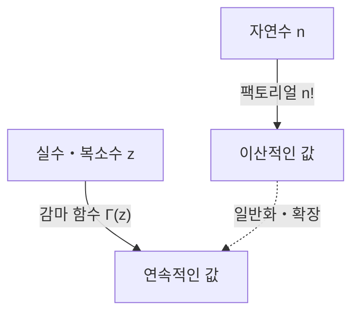

# [감마 함수](https://kenji.blog/ko/p/gamma-function/)란 무엇인가?

수학을 공부하다 보면 때로는 '이산적인 개념을 연속적인 것으로 확장할 수 없을까?'라는 의문에 직면하게 됩니다. 그 가장 아름답고도 중요한 예 중 하나가 바로 **[감마 함수](https://kenji.blog/ko/p/gamma-function/)(Gamma Function)** 입니다.

[감마 함수](https://kenji.blog/ko/p/gamma-function/)는 자연수에 대해 정의되는 '팩토리얼($n!$)'을 양의 실수, 나아가 복소수 전체로 확장한 함수입니다. 18세기의 위대한 수학자 [레온하르트 오일러](/ko/p/euler/)([Leonhard Euler](https://kenji.blog/ko/p/euler/))에 의해 발견된 이 함수는 해석학, 확률론, 통계학, 그리고 물리학에 이르기까지 모든 분야에서 등장합니다.

본 기사에서는 [감마 함수](https://kenji.blog/ko/p/gamma-function/)의 기초부터 그 심오한 성질까지 자세히 살펴보겠습니다.

## 팩토리얼 확장의 아이디어

팩토리얼은 다음과 같이 정의됩니다.

$$ n! = n \times (n-1) \times \dots \times 2 \times 1 $$

예를 들어 $3! = 6$, $4! = 24$가 됩니다. 그러나 이 정의는 $n$이 정수일 때만 의미를 갖습니다. '$2.5!$ 이란 무엇일까?' 혹은 '$(-1.5)!$ 은 계산할 수 있을까?'라는 의문이 자연스럽게 떠오릅니다.

오일러는 이 문제에 도전하여 팩토리얼의 성질을 만족시키면서 실수나 복소수에 대해서도 연속적으로 값을 갖는 함수를 찾아냈습니다.

# [감마 함수](https://kenji.blog/ko/p/gamma-function/)의 정의

[감마 함수](https://kenji.blog/ko/p/gamma-function/) $\Gamma(z)$는 통상적으로 다음과 같은 적분(오일러의 제2종 적분)에 의해 정의됩니다.

$$ \Gamma(z) = \int_0^\infty t^{z-1} e^{-t} dt $$

여기서 $z$는 실수부가 양수($\text{Re}(z) > 0$)인 복소수입니다. 이 적분은 $z$의 실수부가 양수이면 수렴하여 유한한 값을 가집니다.

## 기본적인 성질

이 적분 정의로부터 [감마 함수](https://kenji.blog/ko/p/gamma-function/)의 가장 중요한 성질인 **점화식** 을 유도할 수 있습니다. 부분 적분을 사용하면 다음과 같은 관계를 얻습니다.

$$ \Gamma(z+1) = z \Gamma(z) $$

이 식이야말로 [감마 함수](https://kenji.blog/ko/p/gamma-function/)가 팩토리얼의 확장이라는 핵심입니다. 만약 $z$가 자연수 $n$이라면 $\Gamma(1) = 1$을 사용하여 다음과 같이 계산할 수 있습니다.

$$ \Gamma(n) = (n-1) \Gamma(n-1) = (n-1)(n-2) \Gamma(n-2) = \dots = (n-1)! \Gamma(1) = (n-1)! $$

즉, 팩토리얼과 [감마 함수](https://kenji.blog/ko/p/gamma-function/) 사이에는 **$\Gamma(n) = (n-1)!$** 또는 **$\Gamma(n+1) = n!$** 이라는 관계가 있습니다. 인덱스가 1만큼 어긋나 있다는 점에 주의해야 합니다.

# 복소평면으로의 해석적 연속

앞서 언급한 적분 정의는 $\text{Re}(z) > 0$ 에서만 유효합니다. 하지만 점화식 $\Gamma(z) = \frac{\Gamma(z+1)}{z}$ 을 역방향으로 사용함으로써 [감마 함수](https://kenji.blog/ko/p/gamma-function/)의 정의역을 좌반평면(음의 실수부를 가지는 영역)으로 **해석적 연속(Analytic Continuation)** 할 수 있습니다.

예를 들어 $-1 < \text{Re}(z) < 0$ 범위의 $z$에 대해서는 $\Gamma(z+1)$ 의 실수부가 양수가 되므로 계산이 가능합니다. 그것을 $z$로 나눔으로써 $\Gamma(z)$ 의 값이 정해집니다.

이 조작을 반복함으로써 [감마 함수](https://kenji.blog/ko/p/gamma-function/)는 $z = 0, -1, -2, \dots$ 라는 0 이하의 모든 정수를 제외한 복소수 전체에서 정의되는 유리형 함수가 됩니다. 양이 아닌 정수에서 [감마 함수](https://kenji.blog/ko/p/gamma-function/)는 발산하며, 그곳에는 **극(Pole)** 이 존재합니다.

# 오일러의 반사 공식

[감마 함수](https://kenji.blog/ko/p/gamma-function/)의 아름다움을 보여주는 또 다른 정리가 **오일러의 반사 공식(Euler's Reflection Formula)** 입니다.

$$ \Gamma(z)\Gamma(1-z) = \frac{\pi}{\sin(\pi z)} $$

이 공식은 $z$가 정수가 아닌 복소수일 때 성립합니다. 이 공식을 사용하면 예를 들어 $z = \frac{1}{2}$ 일 때의 값을 쉽게 구할 수 있습니다.

$$ \Gamma\left(\frac{1}{2}\right)\Gamma\left(\frac{1}{2}\right) = \frac{\pi}{\sin\left(\frac{\pi}{2}\right)} = \pi $$

따라서 $\Gamma\left(\frac{1}{2}\right) = \sqrt{\pi}$ 가 됩니다. 이는 정규 분포의 적분 등과도 깊이 관련된 중요한 결과입니다.

# 베타 함수와의 관계

[감마 함수](https://kenji.blog/ko/p/gamma-function/)는 또 다른 중요한 특수 함수인 **베타 함수(Beta Function)** 와 밀접한 관계가 있습니다. 베타 함수 $B(x, y)$는 다음과 같이 정의됩니다.

$$ B(x, y) = \int_0^1 t^{x-1} (1-t)^{y-1} dt $$

[감마 함수](https://kenji.blog/ko/p/gamma-function/)와 베타 함수 사이에는 다음과 같은 놀라운 관계가 성립합니다.

$$ B(x, y) = \frac{\Gamma(x)\Gamma(y)}{\Gamma(x+y)} $$

이 공식은 복잡한 적분 계산을 [감마 함수](https://kenji.blog/ko/p/gamma-function/)의 대수적인 계산으로 귀착시키는 강력한 도구가 됩니다.

# 스털링 근사

$n$이 매우 클 때 $n!$ 을 정확하게 계산하는 것은 어렵습니다. 그런 경우에 팩토리얼(및 [감마 함수](https://kenji.blog/ko/p/gamma-function/))의 점근적인 거동을 보여주는 것이 **스털링 근사(Stirling's Approximation)** 입니다.

$$ n! \approx \sqrt{2\pi n} \left(\frac{n}{e}\right)^n $$

더 일반적으로 [감마 함수](https://kenji.blog/ko/p/gamma-function/)에 대해서도 다음과 같이 쓸 수 있습니다.

$$ \Gamma(z+1) \approx \sqrt{2\pi z} \left(\frac{z}{e}\right)^z $$

이 근사는 통계 역학에서 엔트로피를 계산하거나 확률론에서 거대한 조합을 다룰 때 필수적입니다.

# 응용 및 결론

[감마 함수](https://kenji.blog/ko/p/gamma-function/)는 단순한 수학적 호기심의 산물이 아닙니다. 다음과 같은 많은 분야에서 실천적인 역할을 하고 있습니다.

1. **확률론과 통계학**: 감마 분포, 카이제곱 분포, 스튜던트 t 분포 등은 [감마 함수](https://kenji.blog/ko/p/gamma-function/)를 사용하여 정의됩니다.
2. **물리학**: 양자 역학이나 양자장론에서의 차원 정규화(Dimensional Regularization)에서 [감마 함수](https://kenji.blog/ko/p/gamma-function/)는 발산을 제어하는 역할을 합니다.
3. **해석적 정수론**: 리만 제타 함수와의 관계를 통해 소수 분포 연구에서도 중심적인 위치를 차지합니다.

팩토리얼을 실수로 확장한다는 단순한 질문에서 시작된 탐구는 수학 전체를 관통하는 장대한 구조를 밝혀냈습니다. [감마 함수](https://kenji.blog/ko/p/gamma-function/)는 이산의 세계와 연속의 세계를 연결하는 진정한 오일러의 걸작이라고 할 수 있습니다.
