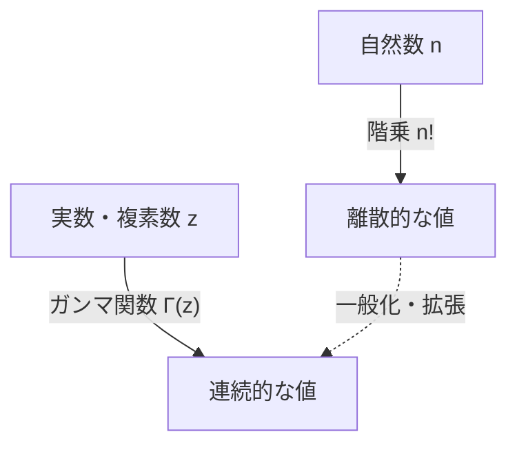

# [ガンマ関数](https://kenji.blog/p/gamma-function/)とは何か？

数学を学んでいると、時として「離散的な概念を連続的なものに拡張できないか？」という疑問に直面します。その最も美しく、かつ重要な例の一つが **[ガンマ関数](https://kenji.blog/p/gamma-function/)（Gamma Function）** です。

[ガンマ関数](https://kenji.blog/p/gamma-function/)は、自然数に対して定義される「階乗（$n!$）」を、正の実数、さらには複素数全体へと拡張した関数です。18世紀の偉大な数学者レオンハルト・オイラー（[Leonhard Euler](https://kenji.blog/p/euler/)）によって発見されたこの関数は、解析学、確率論、統計学、そして物理学に至るまで、あらゆる分野で顔を出します。

本記事では、[ガンマ関数](https://kenji.blog/p/gamma-function/)の基礎からその深遠な性質までを詳しく見ていきましょう。

## 階乗の拡張というアイデア

階乗は、次のように定義されます。

$$ n! = n \times (n-1) \times \dots \times 2 \times 1 $$

例えば、$3! = 6$、$4! = 24$ となります。しかし、この定義は $n$ が整数の場合にしか意味を持ちません。「$2.5!$ とは何だろうか？」あるいは「$(-1.5)!$ は計算できるのか？」といった疑問が自然に湧いてきます。

[オイラー](https://kenji.blog/p/euler/)はこの問題に取り組み、階乗の性質を満たしつつ、実数や複素数に対しても連続的に値をもつ関数を見つけ出しました。

# [ガンマ関数](https://kenji.blog/p/gamma-function/)の定義

[ガンマ関数](https://kenji.blog/p/gamma-function/) $\Gamma(z)$ は、通常、次のような積分（[オイラー](https://kenji.blog/p/euler/)の第2種積分）によって定義されます。

$$ \Gamma(z) = \int_0^\infty t^{z-1} e^{-t} dt $$

ここで、$z$ は実部が正（$\text{Re}(z) > 0$）の複素数です。この積分は $z$ の実部が正であれば収束し、有限の値を持ちます。

## 基本的な性質

この積分定義から、[ガンマ関数](https://kenji.blog/p/gamma-function/)の最も重要な性質である **漸化式** を導くことができます。部分積分を用いると、以下の関係が得られます。

$$ \Gamma(z+1) = z \Gamma(z) $$

この式こそが、[ガンマ関数](https://kenji.blog/p/gamma-function/)が階乗の拡張であることの核心です。もし $z$ が自然数 $n$ である場合、$\Gamma(1) = 1$ を用いて次のように計算できます。

$$ \Gamma(n) = (n-1) \Gamma(n-1) = (n-1)(n-2) \Gamma(n-2) = \dots = (n-1)! \Gamma(1) = (n-1)! $$

つまり、階乗と[ガンマ関数](https://kenji.blog/p/gamma-function/)の間には **$\Gamma(n) = (n-1)!$** または **$\Gamma(n+1) = n!$** という関係があります。インデックスが1つずれている点に注意が必要です。

# 複素平面への解析接続

先ほどの積分定義は $\text{Re}(z) > 0$ でしか有効ではありません。しかし、漸化式 $\Gamma(z) = \frac{\Gamma(z+1)}{z}$ を逆向きに使うことで、[ガンマ関数](https://kenji.blog/p/gamma-function/)の定義域を左半平面（負の実部を持つ領域）へと **解析接続（Analytic Continuation）** することができます。

例えば、$-1 < \text{Re}(z) < 0$ の範囲の $z$ については、$\Gamma(z+1)$ は実部が正となるため計算可能です。それを $z$ で割ることで $\Gamma(z)$ の値が定まります。

この操作を繰り返すことで、[ガンマ関数](https://kenji.blog/p/gamma-function/)は $z = 0, -1, -2, \dots$ という 0 以下のすべての整数を除く複素数全体で定義される有理型関数となります。非正の整数において[ガンマ関数](https://kenji.blog/p/gamma-function/)は発散し、そこには **極（Pole）** が存在します。

# [オイラー](https://kenji.blog/p/euler/)の反射公式

[ガンマ関数](https://kenji.blog/p/gamma-function/)の美しさを示すもう一つの定理が **[オイラー](https://kenji.blog/p/euler/)の反射公式（Euler's Reflection Formula）** です。

$$ \Gamma(z)\Gamma(1-z) = \frac{\pi}{\sin(\pi z)} $$

この公式は、$z$ が整数でない複素数に対して成り立ちます。この公式を用いると、例えば $z = \frac{1}{2}$ のときの値を簡単に求めることができます。

$$ \Gamma\left(\frac{1}{2}\right)\Gamma\left(\frac{1}{2}\right) = \frac{\pi}{\sin\left(\frac{\pi}{2}\right)} = \pi $$

したがって、$\Gamma\left(\frac{1}{2}\right) = \sqrt{\pi}$ となります。これは正規分布の積分などにも深く関連する重要な結果です。

# ベータ関数との関係

[ガンマ関数](https://kenji.blog/p/gamma-function/)は、もう一つの重要な特殊関数である **ベータ関数（Beta Function）** と密接な関係があります。ベータ関数 $B(x, y)$ は次のように定義されます。

$$ B(x, y) = \int_0^1 t^{x-1} (1-t)^{y-1} dt $$

[ガンマ関数](https://kenji.blog/p/gamma-function/)とベータ関数の間には、以下の驚くべき関係が成り立ちます。

$$ B(x, y) = \frac{\Gamma(x)\Gamma(y)}{\Gamma(x+y)} $$

この公式は、複雑な積分の計算を[ガンマ関数](https://kenji.blog/p/gamma-function/)の代数的な計算へと帰着させる強力なツールとなります。

# スターリングの近似

$n$ が非常に大きいとき、$n!$ を正確に計算するのは困難です。そのような場合に、階乗（および[ガンマ関数](https://kenji.blog/p/gamma-function/)）の漸近的な挙動を示すのが **スターリングの近似（Stirling's Approximation）** です。

$$ n! \approx \sqrt{2\pi n} \left(\frac{n}{e}\right)^n $$

より一般的に、[ガンマ関数](https://kenji.blog/p/gamma-function/)に対しても次のように書けます。

$$ \Gamma(z+1) \approx \sqrt{2\pi z} \left(\frac{z}{e}\right)^z $$

この近似は、統計力学においてエントロピーを計算したり、確率論において巨大な組み合わせを扱う際に不可欠です。

# 応用と結論

[ガンマ関数](https://kenji.blog/p/gamma-function/)は単なる数学的な好奇心の産物ではありません。以下のような多くの分野で実践的な役割を果たしています。

1. **確率論と統計学**: ガンマ分布、カイ二乗分布、スチューデントのt分布などは、[ガンマ関数](https://kenji.blog/p/gamma-function/)を用いて定義されます。
2. **物理学**: 量子力学や場の量子論における次元正規化（Dimensional Regularization）において、[ガンマ関数](https://kenji.blog/p/gamma-function/)は発散を制御する役割を果たします。
3. **解析的整数論**: [リーマン](https://kenji.blog/p/riemann/)ゼータ関数との関係を通じて、素数分布の研究においても中心的な位置を占めます。

階乗を実数へと拡張するというシンプルな問いから始まった探求は、数学全体を貫く壮大な構造を明らかにしました。[ガンマ関数](https://kenji.blog/p/gamma-function/)は、離散の世界と連続の世界をつなぐ、まさに[オイラー](https://kenji.blog/p/euler/)の傑作と言えるでしょう。
