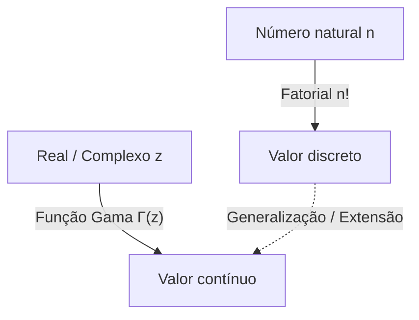

# O que é a Função Gama?

Ao estudar matemática, às vezes nos deparamos com a pergunta: "Um conceito discreto pode ser estendido para um contínuo?" Um dos exemplos mais belos e importantes disso é a **Função Gama**.

A função Gama estende o "fatorial" ($n!$), definido para números naturais, para números reais positivos e até mesmo para todo o plano complexo. Descoberta pelo grande matemático do século 18, Leonhard Euler, essa função aparece em quase todos os campos, desde a análise matemática e teoria da probabilidade até a estatística e física.

Neste artigo, veremos mais de perto os fundamentos da função Gama e suas propriedades profundas.

## A Ideia de Estender o Fatorial

O fatorial é definido da seguinte forma:

$$ n! = n \times (n-1) \times \dots \times 2 \times 1 $$

Por exemplo, $3! = 6$ e $4! = 24$. No entanto, essa definição só faz sentido quando $n$ é um número inteiro. É natural perguntar: "O que é $2.5!$?" ou "Podemos calcular $(-1.5)!$?".

Euler abordou esse problema e encontrou uma função que satisfaz as propriedades dos fatoriais enquanto assume valores contínuos para números reais e complexos.

# Definição da Função Gama

A função Gama $\Gamma(z)$ é geralmente definida pela seguinte integral (a integral de Euler de segunda espécie):

$$ \Gamma(z) = \int_0^\infty t^{z-1} e^{-t} dt $$

Aqui, $z$ é um número complexo com uma parte real positiva ($\text{Re}(z) > 0$). Essa integral converge e tem um valor finito, desde que a parte real de $z$ seja positiva.

## Propriedades Básicas

A partir dessa definição integral, podemos derivar a **relação de recorrência**, que é a propriedade mais importante da função Gama. Usando a integração por partes, obtemos a seguinte relação:

$$ \Gamma(z+1) = z \Gamma(z) $$

Esta equação é a principal razão pela qual a função Gama é uma extensão do fatorial. Se $z$ é um número natural $n$, podemos calculá-lo da seguinte forma usando $\Gamma(1) = 1$:

$$ \Gamma(n) = (n-1) \Gamma(n-1) = (n-1)(n-2) \Gamma(n-2) = \dots = (n-1)! \Gamma(1) = (n-1)! $$

Em outras palavras, existe uma relação entre o fatorial e a função Gama tal que **$\Gamma(n) = (n-1)!$** ou **$\Gamma(n+1) = n!$**. Note que o índice está deslocado em um.

# Continuação Analítica no Plano Complexo

A definição integral mostrada anteriormente só é válida para $\text{Re}(z) > 0$. No entanto, usando a relação de recorrência $\Gamma(z) = \frac{\Gamma(z+1)}{z}$ de trás para frente, podemos realizar a **Continuação Analítica** do domínio da função Gama para o semiplano esquerdo (a região com partes reais negativas).

Por exemplo, para um $z$ no intervalo $-1 < \text{Re}(z) < 0$, $\Gamma(z+1)$ pode ser calculado porque sua parte real é positiva. Ao dividi-lo por $z$, o valor de $\Gamma(z)$ é determinado.

Repetindo essa operação, a função Gama torna-se uma função meromorfa definida em todo o plano complexo, exceto para $z = 0, -1, -2, \dots$ (todos os inteiros não positivos). A função Gama diverge nos inteiros não positivos, e existe um **Polo** em cada um desses pontos.

# Fórmula de Reflexão de Euler

Outro teorema que demonstra a beleza da função Gama é a **Fórmula de Reflexão de Euler**.

$$ \Gamma(z)\Gamma(1-z) = \frac{\pi}{\sin(\pi z)} $$

Esta fórmula é válida para números complexos $z$ que não são inteiros. Usando esta fórmula, podemos facilmente encontrar o valor quando $z = \frac{1}{2}$, por exemplo.

$$ \Gamma\left(\frac{1}{2}\right)\Gamma\left(\frac{1}{2}\right) = \frac{\pi}{\sin\left(\frac{\pi}{2}\right)} = \pi $$

Portanto, $\Gamma\left(\frac{1}{2}\right) = \sqrt{\pi}$. Este é um resultado crucial profundamente relacionado às integrais em distribuições normais.

# Relação com a Função Beta

A função Gama está intimamente relacionada com outra função especial importante, a **Função Beta**. A função Beta $B(x, y)$ é definida da seguinte forma:

$$ B(x, y) = \int_0^1 t^{x-1} (1-t)^{y-1} dt $$

Existe uma relação surpreendente entre a função Gama e a função Beta:

$$ B(x, y) = \frac{\Gamma(x)\Gamma(y)}{\Gamma(x+y)} $$

Esta fórmula é uma ferramenta poderosa que reduz cálculos integrais complexos a cálculos algébricos da função Gama.

# Aproximação de Stirling

Quando $n$ é muito grande, calcular $n!$ exatamente é difícil. Nesses casos, a **Aproximação de Stirling** descreve o comportamento assintótico dos fatoriais (e da função Gama).

$$ n! \approx \sqrt{2\pi n} \left(\frac{n}{e}\right)^n $$

De forma mais geral, para a função Gama, podemos escrever:

$$ \Gamma(z+1) \approx \sqrt{2\pi z} \left(\frac{z}{e}\right)^z $$

Essa aproximação é indispensável ao calcular a entropia na mecânica estatística ou ao lidar com combinações massivas na teoria da probabilidade.

# Aplicações e Conclusão

A função Gama não é meramente um produto da curiosidade matemática. Ela desempenha um papel prático em muitos campos, como:

1. **Probabilidade e Estatística**: A distribuição Gama, distribuição Qui-quadrado e distribuição t de Student são definidas usando a função Gama.
2. **Física**: Na regularização dimensional dentro da mecânica quântica e da teoria quântica de campos, a função Gama desempenha um papel no controle de divergências.
3. **Teoria Analítica dos Números**: Através de sua relação com a função zeta de Riemann, ela ocupa uma posição central no estudo da distribuição de números primos.

A busca que começou com uma simples pergunta sobre a extensão do fatorial para números reais revelou uma magnífica estrutura que atravessa toda a matemática. A função Gama é verdadeiramente a obra-prima de Euler, servindo de ponte entre o mundo discreto e o mundo contínuo.
