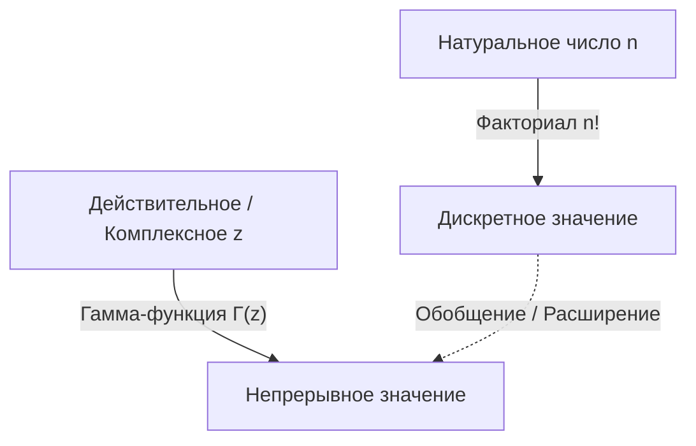

# Что такое Гамма-функция?

При изучении математики мы иногда сталкиваемся с вопросом: "Можно ли расширить дискретное понятие до непрерывного?" Одним из самых красивых и важных примеров этого является **Гамма-функция**.

Гамма-функция расширяет "факториал" ($n!$), определенный для натуральных чисел, на положительные действительные числа и даже на всю комплексную плоскость. Открытая великим математиком 18-го века Леонардом Эйлером, эта функция появляется почти во всех областях: от математического анализа и теории вероятностей до статистики и физики.

В этой статье мы подробно рассмотрим основы Гамма-функции и ее глубокие свойства.

## Идея расширения факториала

Факториал определяется следующим образом:

$$ n! = n \times (n-1) \times \dots \times 2 \times 1 $$

Например, $3! = 6$ и $4! = 24$. Однако это определение имеет смысл только тогда, когда $n$ является целым числом. Естественно возникают вопросы, такие как "Что такое $2.5!$?" или "Можем ли мы вычислить $(-1.5)!$?".

Эйлер взялся за эту проблему и нашел функцию, которая удовлетворяет свойствам факториалов, принимая при этом непрерывные значения для действительных и комплексных чисел.

# Определение Гамма-функции

Гамма-функция $\Gamma(z)$ обычно определяется следующим интегралом (интеграл Эйлера второго рода):

$$ \Gamma(z) = \int_0^\infty t^{z-1} e^{-t} dt $$

Здесь $z$ - это комплексное число с положительной действительной частью ($\text{Re}(z) > 0$). Этот интеграл сходится и имеет конечное значение до тех пор, пока действительная часть $z$ положительна.

## Основные свойства

Из этого интегрального определения мы можем вывести **рекуррентное соотношение**, которое является наиболее важным свойством Гамма-функции. Используя интегрирование по частям, мы получаем следующее соотношение:

$$ \Gamma(z+1) = z \Gamma(z) $$

Это уравнение является главной причиной того, что Гамма-функция является расширением факториала. Если $z$ является натуральным числом $n$, мы можем вычислить его следующим образом, используя $\Gamma(1) = 1$:

$$ \Gamma(n) = (n-1) \Gamma(n-1) = (n-1)(n-2) \Gamma(n-2) = \dots = (n-1)! \Gamma(1) = (n-1)! $$

Другими словами, между факториалом и Гамма-функцией существует связь, такая что **$\Gamma(n) = (n-1)!$** или **$\Gamma(n+1) = n!$**. Обратите внимание, что индекс сдвинут на единицу.

# Аналитическое продолжение на комплексную плоскость

Показанное ранее интегральное определение действительно только для $\text{Re}(z) > 0$. Однако, используя рекуррентное соотношение $\Gamma(z) = \frac{\Gamma(z+1)}{z}$ в обратном порядке, мы можем выполнить **Аналитическое продолжение** области определения Гамма-функции в левую полуплоскость (область с отрицательными действительными частями).

Например, для $z$ в диапазоне $-1 < \text{Re}(z) < 0$, $\Gamma(z+1)$ можно вычислить, потому что его действительная часть положительна. Разделив это значение на $z$, определяется значение $\Gamma(z)$.

Повторяя эту операцию, Гамма-функция становится мероморфной функцией, определенной на всей комплексной плоскости, за исключением $z = 0, -1, -2, \dots$ (всех неположительных целых чисел). Гамма-функция расходится в неположительных целых числах, и в каждой из этих точек существует **Полюс**.

# Формула дополнения Эйлера

Еще одна теорема, демонстрирующая красоту Гамма-функции, это **Формула дополнения Эйлера** (или формула отражения).

$$ \Gamma(z)\Gamma(1-z) = \frac{\pi}{\sin(\pi z)} $$

Эта формула справедлива для комплексных чисел $z$, которые не являются целыми. Используя эту формулу, мы можем легко найти значение, например, при $z = \frac{1}{2}$.

$$ \Gamma\left(\frac{1}{2}\right)\Gamma\left(\frac{1}{2}\right) = \frac{\pi}{\sin\left(\frac{\pi}{2}\right)} = \pi $$

Следовательно, $\Gamma\left(\frac{1}{2}\right) = \sqrt{\pi}$. Это важнейший результат, глубоко связанный с интегралами в нормальном распределении.

# Связь с Бета-функцией

Гамма-функция тесно связана с еще одной важной специальной функцией — **Бета-функцией**. Бета-функция $B(x, y)$ определяется следующим образом:

$$ B(x, y) = \int_0^1 t^{x-1} (1-t)^{y-1} dt $$

Между Гамма-функцией и Бета-функцией существует удивительная связь:

$$ B(x, y) = \frac{\Gamma(x)\Gamma(y)}{\Gamma(x+y)} $$

Эта формула является мощным инструментом, который сводит сложные интегральные вычисления к алгебраическим вычислениям Гамма-функции.

# Формула Стирлинга

Когда $n$ очень велико, точно вычислить $n!$ сложно. В таких случаях **Формула Стирлинга** (приближение Стирлинга) описывает асимптотическое поведение факториалов (и Гамма-функции).

$$ n! \approx \sqrt{2\pi n} \left(\frac{n}{e}\right)^n $$

В более общем виде, для Гамма-функции мы можем записать:

$$ \Gamma(z+1) \approx \sqrt{2\pi z} \left(\frac{z}{e}\right)^z $$

Это приближение незаменимо при вычислении энтропии в статистической механике или при работе с огромными комбинациями в теории вероятностей.

# Применение и заключение

Гамма-функция — это не просто плод математического любопытства. Она играет практическую роль во многих областях, таких как:

1. **Теория вероятностей и статистика**: Гамма-распределение, распределение хи-квадрат и t-распределение Стьюдента определяются с использованием Гамма-функции.
2. **Физика**: В размерной регуляризации в квантовой механике и квантовой теории поля Гамма-функция играет роль в контроле расходимостей.
3. **Аналитическая теория чисел**: Благодаря своей связи с дзета-функцией Римана, она занимает центральное место в изучении распределения простых чисел.

Поиск, который начался с простого вопроса о расширении факториала на действительные числа, выявил великолепную структуру, пронизывающую всю математику. Гамма-функция — это поистине шедевр Эйлера, перекидывающий мост между дискретным и непрерывным мирами.
