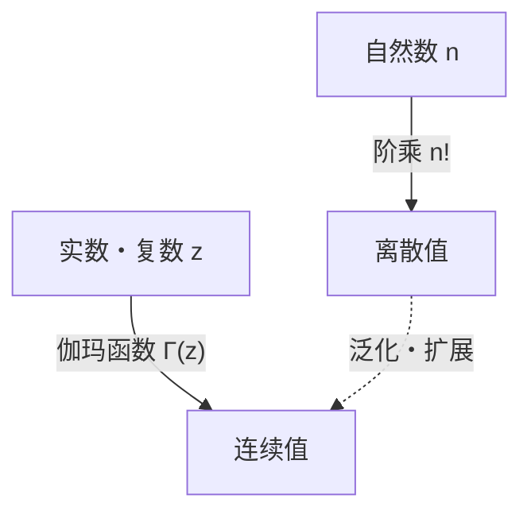

# 什么是[伽玛函数](https://kenji.blog/zh-cn/p/gamma-function/)？

在学习数学时，我们有时会面临这样一个问题：“能否将离散的概念扩展为连续的概念？”其中最美丽且最重要的例子之一就是 **[伽玛函数](https://kenji.blog/zh-cn/p/gamma-function/)（Gamma Function）** 。

[伽玛函数](https://kenji.blog/zh-cn/p/gamma-function/)将定义在自然数上的“阶乘（$n!$）”扩展到了正实数，甚至扩展到了整个复数域。这个由18世纪伟大的数学家[莱昂哈德·欧拉](/zh-cn/p/euler/)（[Leonhard Euler](https://kenji.blog/zh-cn/p/euler/)）发现的函数，在分析学、概率论、统计学以及物理学等各个领域中都有所体现。

在本文中，我们将详细了解[伽玛函数](https://kenji.blog/zh-cn/p/gamma-function/)的基础知识及其深奥的性质。

## 阶乘扩展的理念

阶乘的定义如下：

$$ n! = n \times (n-1) \times \dots \times 2 \times 1 $$

例如，$3! = 6$，$4! = 24$。然而，这个定义只有在 $n$ 是整数时才有意义。“$2.5!$ 是什么？”或者“$(-1.5)!$ 可以计算吗？”这样的疑问自然而然地浮现出来。

欧拉致力于解决这个问题，并找到了一个既满足阶乘性质，又对实数和复数具有连续值的函数。

# [伽玛函数](https://kenji.blog/zh-cn/p/gamma-function/)的定义

[伽玛函数](https://kenji.blog/zh-cn/p/gamma-function/) $\Gamma(z)$ 通常由以下积分（欧拉第二类积分）来定义：

$$ \Gamma(z) = \int_0^\infty t^{z-1} e^{-t} dt $$

这里，$z$ 是实部为正（$\text{Re}(z) > 0$）的复数。只要 $z$ 的实部为正，这个积分就会收敛并具有有限的值。

## 基本性质

从这个积分定义中，我们可以推导出[伽玛函数](https://kenji.blog/zh-cn/p/gamma-function/)最重要的性质，即 **递推关系** 。使用分部积分法，我们可以得到以下关系：

$$ \Gamma(z+1) = z \Gamma(z) $$

这个公式正是[伽玛函数](https://kenji.blog/zh-cn/p/gamma-function/)作为阶乘扩展的核心所在。如果 $z$ 是自然数 $n$，利用 $\Gamma(1) = 1$，我们可以进行如下计算：

$$ \Gamma(n) = (n-1) \Gamma(n-1) = (n-1)(n-2) \Gamma(n-2) = \dots = (n-1)! \Gamma(1) = (n-1)! $$

也就是说，阶乘和[伽玛函数](https://kenji.blog/zh-cn/p/gamma-function/)之间存在 **$\Gamma(n) = (n-1)!$** 或 **$\Gamma(n+1) = n!$** 这样的关系。需要注意的是，索引偏移了1。

# 拓展到复平面的解析延拓

前面提到的积分定义仅在 $\text{Re}(z) > 0$ 时有效。但是，通过反向使用递推公式 $\Gamma(z) = \frac{\Gamma(z+1)}{z}$，我们可以将[伽玛函数](https://kenji.blog/zh-cn/p/gamma-function/)的定义域 **解析延拓（Analytic Continuation）** 到左半平面（实部为负的区域）。

例如，对于 $-1 < \text{Re}(z) < 0$ 范围内的 $z$，因为 $\Gamma(z+1)$ 的实部为正，所以可以进行计算。将其除以 $z$ 就可以确定 $\Gamma(z)$ 的值。

通过重复这一操作，[伽玛函数](https://kenji.blog/zh-cn/p/gamma-function/)就成了一个亚纯函数，其定义域覆盖整个复平面，但在 $z = 0, -1, -2, \dots$ 等所有非正整数处除外。在非正整数处，[伽玛函数](https://kenji.blog/zh-cn/p/gamma-function/)发散，并且在这些点存在 **极点（Pole）** 。

# 欧拉反射公式

另一个展示[伽玛函数](https://kenji.blog/zh-cn/p/gamma-function/)之美的定理是 **欧拉反射公式（Euler's Reflection Formula）** 。

$$ \Gamma(z)\Gamma(1-z) = \frac{\pi}{\sin(\pi z)} $$

这个公式对非整数的复数 $z$ 成立。利用这个公式，我们就能轻松求出诸如 $z = \frac{1}{2}$ 时的值。

$$ \Gamma\left(\frac{1}{2}\right)\Gamma\left(\frac{1}{2}\right) = \frac{\pi}{\sin\left(\frac{\pi}{2}\right)} = \pi $$

因此，$\Gamma\left(\frac{1}{2}\right) = \sqrt{\pi}$。这是一个与正态分布积分等密切相关的重要结果。

# 与贝塔函数的关系

[伽玛函数](https://kenji.blog/zh-cn/p/gamma-function/)与另一个重要的特殊函数—— **贝塔函数（Beta Function）** 密切相关。贝塔函数 $B(x, y)$ 的定义如下：

$$ B(x, y) = \int_0^1 t^{x-1} (1-t)^{y-1} dt $$

[伽玛函数](https://kenji.blog/zh-cn/p/gamma-function/)和贝塔函数之间存在着以下令人惊叹的关系：

$$ B(x, y) = \frac{\Gamma(x)\Gamma(y)}{\Gamma(x+y)} $$

这个公式是一个强大的工具，它将复杂的积分计算转化为[伽玛函数](https://kenji.blog/zh-cn/p/gamma-function/)的代数计算。

# 斯特林公式

当 $n$ 非常大时，精确计算 $n!$ 是很困难的。在这种情况下， **斯特林公式（Stirling's Approximation）** 展示了阶乘（以及[伽玛函数](https://kenji.blog/zh-cn/p/gamma-function/)）的渐近行为。

$$ n! \approx \sqrt{2\pi n} \left(\frac{n}{e}\right)^n $$

更一般地，对于[伽玛函数](https://kenji.blog/zh-cn/p/gamma-function/)，我们可以这样写：

$$ \Gamma(z+1) \approx \sqrt{2\pi z} \left(\frac{z}{e}\right)^z $$

在统计力学中计算熵，或者在概率论中处理巨大的组合数时，这个近似公式是不可或缺的。

# 应用与结论

[伽玛函数](https://kenji.blog/zh-cn/p/gamma-function/)不仅仅是数学好奇心的产物。它在以下许多领域都发挥着实际作用：

1. **概率论与统计学**：伽玛分布、卡方分布和学生t分布等都是使用[伽玛函数](https://kenji.blog/zh-cn/p/gamma-function/)定义的。
2. **物理学**：在量子力学和量子场论的维数正则化（Dimensional Regularization）中，[伽玛函数](https://kenji.blog/zh-cn/p/gamma-function/)发挥着控制发散的作用。
3. **解析数论**：通过与黎曼ζ函数的关系，它在素数分布的研究中也占据了核心地位。

从将阶乘扩展到实数这一简单问题开始的探索，揭示了贯穿整个数学的宏大结构。[伽玛函数](https://kenji.blog/zh-cn/p/gamma-function/)作为连接离散世界与连续世界的桥梁，可以说是当之无愧的欧拉杰作。
