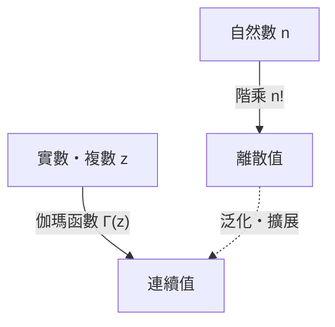

# 什麼是[伽瑪函數](https://kenji.blog/zh-tw/p/gamma-function/)？

在學習數學時，我們有時會面臨這樣一個問題：「能否將離散的概念擴展為連續的概念？」其中最美麗且最重要的例子之一就是 **[伽瑪函數](https://kenji.blog/zh-tw/p/gamma-function/)（Gamma Function）** 。

[伽瑪函數](https://kenji.blog/zh-tw/p/gamma-function/)將定義在自然數上的「階乘（$n!$）」擴展到了正實數，甚至擴展到了整個複數域。這個由18世紀偉大的數學家萊昂哈德·歐拉（[Leonhard Euler](https://kenji.blog/zh-tw/p/euler/)）發現的函數，在分析學、機率論、統計學以及物理學等各個領域中都有所體現。

在本文中，我們將詳細了解[伽瑪函數](https://kenji.blog/zh-tw/p/gamma-function/)的基礎知識及其深奧的性質。

## 階乘擴展的理念

階乘的定義如下：

$$ n! = n \times (n-1) \times \dots \times 2 \times 1 $$

例如，$3! = 6$，$4! = 24$。然而，這個定義只有在 $n$ 是整數時才有意義。「$2.5!$ 是什麼？」或者「$(-1.5)!$ 可以計算嗎？」這樣的疑問自然而然地浮現出來。

歐拉致力於解決這個問題，並找到了一個既滿足階乘性質，又對實數和複數具有連續值的函數。



# [伽瑪函數](https://kenji.blog/zh-tw/p/gamma-function/)的定義

[伽瑪函數](https://kenji.blog/zh-tw/p/gamma-function/) $\Gamma(z)$ 通常由以下積分（歐拉第二類積分）來定義：

$$ \Gamma(z) = \int_0^\infty t^{z-1} e^{-t} dt $$

這裡，$z$ 是實部為正（$\text{Re}(z) > 0$）的複數。只要 $z$ 的實部為正，這個積分就會收斂並具有有限的值。

## 基本性質

從這個積分定義中，我們可以推導出[伽瑪函數](https://kenji.blog/zh-tw/p/gamma-function/)最重要的性質，即 **遞迴關係** 。使用分部積分法，我們可以得到以下關係：

$$ \Gamma(z+1) = z \Gamma(z) $$

這個公式正是[伽瑪函數](https://kenji.blog/zh-tw/p/gamma-function/)作為階乘擴展的核心所在。如果 $z$ 是自然數 $n$，利用 $\Gamma(1) = 1$，我們可以進行如下計算：

$$ \Gamma(n) = (n-1) \Gamma(n-1) = (n-1)(n-2) \Gamma(n-2) = \dots = (n-1)! \Gamma(1) = (n-1)! $$

也就是說，階乘和[伽瑪函數](https://kenji.blog/zh-tw/p/gamma-function/)之間存在 **$\Gamma(n) = (n-1)!$** 或 **$\Gamma(n+1) = n!$** 這樣的關係。需要注意的是，索引偏移了1。

# 拓展到複平面的解析延拓

前面提到的積分定義僅在 $\text{Re}(z) > 0$ 時有效。但是，透過反向使用遞迴公式 $\Gamma(z) = \frac{\Gamma(z+1)}{z}$，我們可以將[伽瑪函數](https://kenji.blog/zh-tw/p/gamma-function/)的定義域 **解析延拓（Analytic Continuation）** 到左半平面（實部為負的區域）。

例如，對於 $-1 < \text{Re}(z) < 0$ 範圍內的 $z$，因為 $\Gamma(z+1)$ 的實部為正，所以可以進行計算。將其除以 $z$ 就可以確定 $\Gamma(z)$ 的值。

透過重複這一操作，[伽瑪函數](https://kenji.blog/zh-tw/p/gamma-function/)就成了一個亞純函數，其定義域覆蓋整個複平面，但在 $z = 0, -1, -2, \dots$ 等所有非正整數處除外。在非正整數處，[伽瑪函數](https://kenji.blog/zh-tw/p/gamma-function/)發散，並且在這些點存在 **極點（Pole）** 。

```mermaid
graph LR
    P1["Re("z") > 0"] -->|"由積分定義"| P2["Γ(z) 收斂"]
    P2 -->|"使用遞迴公式"| P3["擴展到 Re("z") ≤ 0"]
    P3 -->|"z = 0, -1, -2, ..."| P4["奇點（極點）"]
```

# 歐拉反射公式

另一個展示[伽瑪函數](https://kenji.blog/zh-tw/p/gamma-function/)之美的定理是 **歐拉反射公式（Euler's Reflection Formula）** 。

$$ \Gamma(z)\Gamma(1-z) = \frac{\pi}{\sin(\pi z)} $$

這個公式對非整數的複數 $z$ 成立。利用這個公式，我們就能輕鬆求出諸如 $z = \frac{1}{2}$ 時的值。

$$ \Gamma\left(\frac{1}{2}\right)\Gamma\left(\frac{1}{2}\right) = \frac{\pi}{\sin\left(\frac{\pi}{2}\right)} = \pi $$

因此，$\Gamma\left(\frac{1}{2}\right) = \sqrt{\pi}$。這是一個與常態分布積分等密切相關的重要結果。

# 與貝塔函數的關係

[伽瑪函數](https://kenji.blog/zh-tw/p/gamma-function/)與另一個重要的特殊函數—— **貝塔函數（Beta Function）** 密切相關。貝塔函數 $B(x, y)$ 的定義如下：

$$ B(x, y) = \int_0^1 t^{x-1} (1-t)^{y-1} dt $$

[伽瑪函數](https://kenji.blog/zh-tw/p/gamma-function/)和貝塔函數之間存在著以下令人驚嘆的關係：

$$ B(x, y) = \frac{\Gamma(x)\Gamma(y)}{\Gamma(x+y)} $$

這個公式是一個強大的工具，它將複雜的積分計算轉化為[伽瑪函數](https://kenji.blog/zh-tw/p/gamma-function/)的代數計算。

# 斯特林公式

當 $n$ 非常大時，精確計算 $n!$ 是很困難的。在這種情況下， **斯特林公式（Stirling's Approximation）** 展示了階乘（以及[伽瑪函數](https://kenji.blog/zh-tw/p/gamma-function/)）的漸近行為。

$$ n! \approx \sqrt{2\pi n} \left(\frac{n}{e}\right)^n $$

更一般地，對於[伽瑪函數](https://kenji.blog/zh-tw/p/gamma-function/)，我們可以這樣寫：

$$ \Gamma(z+1) \approx \sqrt{2\pi z} \left(\frac{z}{e}\right)^z $$

在統計力學中計算熵，或者在機率論中處理巨大的組合數時，這個近似公式是不可或缺的。

# 應用與結論

[伽瑪函數](https://kenji.blog/zh-tw/p/gamma-function/)不僅僅是數學好奇心的產物。它在以下許多領域都發揮著實際作用：

1. **機率論與統計學**：伽瑪分布、卡方分布和學生t分布等都是使用[伽瑪函數](https://kenji.blog/zh-tw/p/gamma-function/)定義的。
2. **物理學**：在量子力學和量子場論的維數正規化（Dimensional Regularization）中，[伽瑪函數](https://kenji.blog/zh-tw/p/gamma-function/)發揮著控制發散的作用。
3. **解析數論**：透過與黎曼ζ函數的關係，它在質數分布的研究中也佔據了核心地位。

從將階乘擴展到實數這一簡單問題開始的探索，揭示了貫穿整個數學的宏大結構。[伽瑪函數](https://kenji.blog/zh-tw/p/gamma-function/)作為連接離散世界與連續世界的橋梁，可以說是當之無愧的歐拉傑作。
