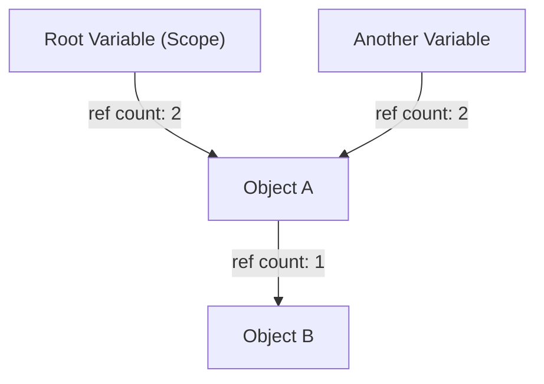
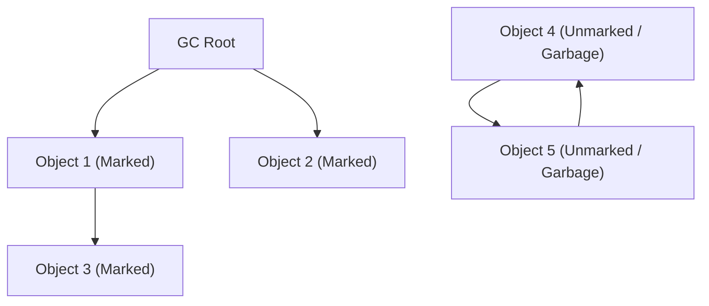
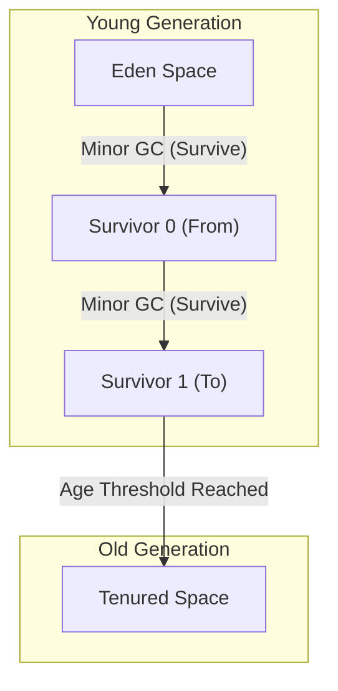

# تاريخ تطور جمع القمامة (GC): من الإدارة اليدوية إلى ZGC

في تطوير البرمجيات الحديثة، فإن القدرة على البرمجة دون القلق بشأن إدارة الذاكرة تعود بالكامل إلى تطور تقنية تسمى "جمع القمامة (Garbage Collection, GC)". العديد من لغات البرمجة المستخدمة على نطاق واسع اليوم، مثل Java، C#، Python، JavaScript، و Go، تحتوي على شكل من أشكال جمع القمامة المدمج.

ومع ذلك، فإن الطريق إلى هذه النقطة لم يكن سلسًا على الإطلاق. لقد بدأ في عصر كان فيه المبرمجون يتمتعون بالتحكم الكامل في تخصيص الذاكرة وتحريرها، وكانت هناك حكاية تاريخية لأتمتة إدارة الذاكرة تدريجيًا مع مكافحة العديد من الأخطاء التي نشأت مع ازدياد تعقيد البرامج.

في هذه المقالة، سنكشف عن تاريخ إدارة الذاكرة في علوم الحاسوب، ونتعمق في عملية التطور من قيود الإدارة اليدوية للذاكرة، عبر عد المراجع، والعلامة والمسح (Mark and Sweep)، وGC القائم على الأجيال، وG1GC، ووصولاً إلى التقنيات الحديثة المذهلة مثل ZGC وShenandoah، موضحين ذلك من منظور الخوارزميات والهندسة المعمارية.

---

## 1. عصر الفوضى: إدارة الذاكرة اليدوية وقيودها

في العصر الذي لم يكن فيه جمع القمامة موجودًا (وحتى اليوم في المجالات التي تنشط فيها لغات مثل C وC++ وRust)، كانت إدارة الذاكرة مسؤولية المبرمج بالكامل. إنها عملية يطلب فيها البرنامج ذاكرة من نظام التشغيل عند الحاجة إليها، ويعيدها صراحةً إلى نظام التشغيل عندما لم تعد هناك حاجة إليها.

### عالم `malloc` و `free`

في لغة C، تُستخدم مجموعة دوال `malloc` لتخصيص الذاكرة الديناميكية، ويُستخدم `free` لتحريرها.

```c
#include <stdlib.h>
#include <stdio.h>

void process_data() {
    // تخصيص ذاكرة لـ 100 عدد صحيح على الكومة (Heap)
    int* data = (int*)malloc(100 * sizeof(int));
    if (data == NULL) {
        // معالجة الخطأ عند فشل تخصيص الذاكرة
        return;
    }

    // معالجة استخدام البيانات
    for (int i = 0; i < 100; i++) {
        data[i] = i * 2;
    }

    // تحرير الذاكرة عند اكتمال المعالجة
    free(data);
}
```

أكبر ميزة لهذا النهج هي "التحكم" و"الأداء". يمكن للمبرمجين معرفة متى وأين يتم تخصيص الذاكرة وتحريرها بالضبط وصولاً إلى مستوى المللي ثانية. في أنظمة الحواسيب المبكرة ذات القيود الصارمة على الأجهزة، كانت هذه السيطرة المطلقة ضرورية.

### الخطايا الثلاث الكبرى الناجمة عن الإدارة اليدوية

ومع ذلك، عندما تتضخم البرامج إلى عشرات ومئات الآلاف من الأسطر وتتشابك خيوط (Threads) متعددة بشكل معقد، تتجاوز إدارة الذاكرة اليدوية الحدود الإدراكية البشرية. ونتيجة لذلك، بدأت الأخطاء الخطيرة التالية تحدث بشكل متكرر:

1. **تسرب الذاكرة (Memory Leak)**
   تحدث هذه المشكلة عند نسيان تحرير الذاكرة المخصصة. إذا حدث تسرب للذاكرة في تطبيقات الخوادم التي تعمل لفترات طويلة، تتناقص الذاكرة المتاحة تدريجياً، وفي النهاية ينهي نظام التشغيل العملية بالقوة (OOM: Out Of Memory).

2. **المؤشرات المتدلية (Dangling Pointers) والاستخدام بعد التحرير (Use-After-Free)**
   هذا خطأ يستمر فيه استخدام مؤشر يشير إلى منطقة ذاكرة على الرغم من أنه تم تحرير الذاكرة بواسطة `free`. قد تكون قد تم تخصيص بيانات جديدة لمنطقة الذاكرة المحررة، وإذا تم الوصول إليها أو الكتابة فيها، فسيتم تدمير بيانات غير ذات صلة تمامًا. أصبح هذا مرتعًا للثغرات الأمنية (مثل تنفيذ الأكواد العشوائية).

3. **التحرير المزدوج (Double Free)**
   تحدث هذه المشكلة عند استدعاء `free` مرتين لنفس منطقة الذاكرة. يؤدي ذلك إلى تدمير بنية البيانات الداخلية لمخصص الذاكرة (مثل القائمة الحرة Free List)، مما يتسبب في حدوث أعطال وعيوب أمنية قاتلة.

```c
// مثال على الاستخدام بعد التحرير (Use-After-Free)
int* ptr = malloc(sizeof(int));
*ptr = 42;
free(ptr);
// ... عمليات معقدة ...
*ptr = 100; // خطر! الكتابة في منطقة تم تحريرها بالفعل
```

للتعامل مع هذه المشاكل، قدمت C++ مفاهيم مثل RAII (الحصول على الموارد هو تهيئة) والمؤشرات الذكية، ولكن جمع القمامة وُلد من فكرة: "في المقام الأول، ألا يمكننا إبعاد إدارة الذاكرة عن المبرمجين وتركها للنظام؟".

---

## 2. الخطوة الأولى نحو الأتمتة: عد المراجع (Reference Counting)

كان النهج الرئيسي الأول للتغلب على قيود إدارة الذاكرة اليدوية هو "عد المراجع". لا يزال يستخدم على نطاق واسع اليوم في Python، PHP، Objective-C/Swift (ARC: Automatic Reference Counting)، و `std::shared_ptr` في C++.

### المبدأ الأساسي لعد المراجع

آلية عد المراجع بسيطة للغاية. تحتوي منطقة الرأس لكل كائن على عداد (عدد المراجع) يشير إلى "عدد المتغيرات (المؤشرات) التي تشير إلى هذا الكائن حاليًا".

- عند إنشاء كائن جديد وتعيينه لمتغير، يتم تعيين العداد إلى `1`.
- عندما يبدأ متغير آخر في الإشارة إلى هذا الكائن، يزداد العداد بمقدار `+1`.
- عندما يخرج المتغير عن النطاق أو تتم إزالة المرجع، ينخفض العداد بمقدار `-1`.
- في اللحظة التي يصل فيها العداد إلى `0`، يُؤكد أن الكائن "غير مشار إليه من أي مكان"، وتتحرر ذاكرته على الفور.



### مزايا وعيوب عد المراجع

**المزايا:**
1. **تحرير حتمي:** يتم تحرير الذاكرة في اللحظة التي يصل فيها المرجع إلى الصفر، مما يسهل التنبؤ بدورة حياة المورد.
2. **توزيع أوقات التوقف (Pause Time):** نظرًا لأن عبء تحرير الذاكرة موزع طوال تنفيذ البرنامج، فمن غير المرجح أن تحدث أوقات توقف ضخمة مثل "إيقاف العالم (Stop-The-World)" المذكورة لاحقًا.

**العيوب:**
1. **عبء تحديث العداد:** في كل مرة يتم فيها تعيين مؤشر، يجب تنفيذ تعليمات الزيادة والنقصان. في البيئات متعددة الخيوط، يجب إجراء تحديثات العداد كعمليات ذرية (مثل الأقفال Lock)، مما يصبح عنق زجاجة كبير للأداء.
2. **الخلل القاتل للمرجع الدائري (Circular Reference):** هذا هو نقطة الضعف الأكبر. إذا كان الكائن A يشير إلى الكائن B، والكائن B يشير إلى الكائن A، فحتى إذا لم يعد بإمكان أي جزء من البرنامج الوصول إلى A و B، فإنهما يشيران إلى بعضهما البعض، لذلك لن يصبح العداد أبدًا `0`، وسيؤدي ذلك إلى تسرب دائم للذاكرة.

لحل مشكلة المراجع الدائرية، يحتاج المطورون إلى استخدام "المراجع الضعيفة (Weak Reference)" بشكل صريح، ولكن هذا في النهاية يعني أن "المطورين بحاجة إلى إدراك تبعيات الذاكرة"، لذلك لا يمكن اعتباره أتمتة كاملة.

---

## 3. التحدي نحو الاستئصال: العلامة والمسح (Mark and Sweep) وGC التتبعي

إن "جمع القمامة التتبعي (Tracing Garbage Collection)" هو الذي حل بشكل أساسي مشكلة المراجع الدائرية وحقق إدارة تلقائية حقيقية للذاكرة، وخوارزميته التمثيلية هي "العلامة والمسح (Mark and Sweep)".

هذه الخوارزمية الرائدة، التي ابتكرها جون مكارثي للغة LISP، هي أساس جميع أنظمة جمع القمامة المتقدمة تقريبًا اليوم، بما في ذلك Java (JVM)، Go، ومحرك V8 (JavaScript).

### مفهوم إمكانية الوصول (Reachability)

لا يتتبع "العلامة والمسح" "من يشير إلى ماذا" مثل عد المراجع. بدلاً من ذلك، فإنه يتخذ قرارات الحياة والموت بناءً على "إمكانية الوصول (Reachability)" بتتبع المسار من نقطة بداية البرنامج (الجذر).

تشمل نقاط البداية المسماة **جذور GC (GC Roots)** ما يلي:
- المتغيرات المحلية على مكدس الاستدعاء (Call Stack) للخيط قيد التنفيذ حاليًا.
- المتغيرات العامة (Global) والمتغيرات الساكنة (Static).
- سجلات وحدة المعالجة المركزية (CPU Registers).

### المرحلتان لعملية العلامة والمسح

كما يوحي الاسم، تتكون الخوارزمية من مرحلتين.

1. **مرحلة العلامة (Mark Phase):**
   تبدأ من جذور GC، وتتبع المؤشرات وتضع علامة "حي (Live)" على جميع الكائنات التي يمكن الوصول إليها. يتم تنفيذ هذا غالبًا عن طريق تعيين بت واحد (بت العلامة) في رأس الكائن.

2. **مرحلة المسح (Sweep Phase):**
   يتم مسح ذاكرة الكومة (Heap) بأكملها من البداية إلى النهاية. الكائنات التي لم يتم وضع علامة عليها تُعتبر "قمامة لم يعد يمكن الوصول إليها من البرنامج (Garbage)"، ويتم استعادة منطقة الذاكرة الخاصة بها وإعادتها إلى القائمة الحرة (Free List). أما الكائنات التي تم وضع علامة عليها فيتم مسح علامتها استعدادًا لعملية GC القادمة.


*(الكائنات Obj4 و Obj5 في الشكل أعلاه يشيران إلى بعضهما البعض بشكل دائري، ولكن نظرًا لأنه لا يمكن الوصول إليهما من GC Root، فسيتم جمعهما معًا كـ Garbage.)*

### إيقاف العالم (Stop-The-World - STW) والتجزئة (Fragmentation)

بدا "العلامة والمسح" كطريقة مثالية لحل المراجع الدائرية، لكنه جاء بتكلفة باهظة.

التكلفة الأولى هي **إيقاف العالم (Stop-The-World - STW)**.
إذا قامت خيوط التطبيق (تسمى المطفرات Mutators) بتغيير علاقات الكائنات أثناء عملية العلامة، فهناك خطر فقدان الكائنات الحية. لذلك، في أنظمة GC المبكرة، كان من الضروري إيقاف جميع خيوط التطبيق تمامًا بين مرحلتي العلامة والمسح. كلما زاد حجم الكومة، قد يمتد وقت التوقف هذا من ثوانٍ إلى عشرات الدقائق، وهو أمر مميت للأنظمة التي تتطلب أداءً في الوقت الفعلي (Real-time).

التكلفة الثانية هي **تجزئة الذاكرة (Memory Fragmentation)**.
بعد جمع القمامة في مرحلة المسح، تتناثر المساحات الفارغة في جميع أنحاء الكومة مثل الجبن المثقوب. على الرغم من أن إجمالي السعة الفارغة كافٍ، لا يمكن تأمين كتلة ذاكرة كبيرة ومستمرة، مما يؤدي إلى حدوث OutOfMemoryError.

لحل هذا، ظهرت تقنية تسمى "العلامة والضغط (Mark and Compact)". من خلال تجميع الكائنات الحية على جانب واحد من منطقة الذاكرة (الضغط Compaction)، يتم إنشاء منطقة فارغة كبيرة ومستمرة. ومع ذلك، نظرًا لتغيير مواقع وضع الكائنات (عناوين الذاكرة)، يلزم إعادة كتابة جميع المؤشرات التي تشير إلى تلك الكائنات، مما تسبب في حدوث أوقات توقف STW أطول.

---

## 4. ولادة GC للأجيال وتقديم الاستدلالات (Heuristics)

للتغلب على عدم كفاءة "العلامة والمسح" المتمثلة في "مسح الكومة بأكملها في كل مرة"، تم ابتكار "جمع القمامة للأجيال (Generational GC)". يمكن القول إن هذا أحد أنجح الاستدلالات (التحسينات القائمة على القواعد التجريبية) في علوم الحاسوب.

### فرضية الأجيال الضعيفة (Weak Generational Hypothesis)

قام باحثون من شركات مثل IBM بتحليل الذاكرة (Profiling) لتطبيقات مختلفة واكتشفوا قانونًا قويًا:

**"معظم الكائنات المخصصة حديثًا تصبح غير ضرورية بسرعة (قصيرة العمر)."**
**"تميل الكائنات القديمة إلى البقاء على قيد الحياة لفترة أطول بعد ذلك."**

على سبيل المثال، السلاسل النصية التي يتم إنشاؤها مؤقتًا داخل الحلقات، أو كائنات DTO التي تخزن قيم الإرجاع الخاصة بالطرق، تصبح قمامة بعد بضعة مللي ثانية. من ناحية أخرى، تبقى بيانات التخزين المؤقت (Cache) ومجمعات الاتصالات (Connection Pools) وما إلى ذلك، حية حتى ينتهي التطبيق.

### تقسيم الكومة: الشاب والقديم (Young and Old)

بناءً على هذه الفرضية، يُقسم GC للأجيال ذاكرة الكومة منطقيًا.

1. **الجيل الشاب (Young Generation):**
   هذا هو المكان الذي توضع فيه الكائنات المنشأة حديثًا لأول مرة. ينقسم الجيل الشاب أيضًا إلى "مساحة Eden" واثنتين من "مساحات Survivor (من/إلى From/To)".
   يتم تخصيص الكائنات في البداية في مساحة Eden. عندما تمتلئ Eden، يحدث **Minor GC**.
   في Minor GC، يتم تنفيذ العلامة والنسخ فقط داخل الجيل الشاب. تنتقل الكائنات الناجية إلى مساحة Survivor، والكائنات التي تنجو من Minor GC عدة مرات (التي تتقدم في العمر) يتم "ترقيتها (Promotion)" إلى الجيل القديم كـ "كائنات طويلة العمر".
   نظرًا لوجود العديد من الكائنات قصيرة العمر، فإن الكائنات الناجية داخل الجيل الشاب قليلة جدًا، وتكتمل عملية النسخ بسرعة عالية، مما يقلل بشكل كبير من وقت STW.

2. **الجيل القديم (Old Generation / Tenured):**
   هذه هي المنطقة التي توضع فيها الكائنات التي تعيش لفترات طويلة. عندما يمتلئ الجيل القديم، يحدث **Major GC (Full GC)** مستهدفًا الكومة بأكملها.
   يستغرق Full GC وقتًا طويلاً، ولكن نظرًا لأن الكائنات قصيرة العمر قد تم مسحها بالفعل بواسطة Minor GC للجيل الشاب، يمكن تقليل وتيرة حدوث Full GC نفسه بشكل كبير.



### التحسين باستخدام جدول البطاقات (Card Table)

لتحقيق GC للأجيال، كان هناك تحدٍ تقني آخر: "عندما تشير كائنات من الجيل القديم إلى كائنات في الجيل الشاب، كيف يمكننا تنفيذ GC للجيل الشاب فقط (Minor GC) بأمان؟". إذا تم التتبع من جذور GC فقط، فسيتعين مسح الجيل القديم بالكامل.

لحل هذا، تم إدخال بنية بيانات تسمى "جدول البطاقات (Card Table)". يتم تقسيم الجيل القديم إلى صفحات صغيرة (بطاقات)، وعندما تحدث كتابة مرجع من القديم إلى الشاب، يتم إدخال كود خاص يسمى "حاجز الكتابة (Write Barrier)" لوضع علامة على البطاقة المعنية كـ "متسخة (Dirty)". أثناء Minor GC، ما عليك سوى مسح هذه البطاقات المتسخة بالإضافة إلى جذور GC، مما أدى إلى القضاء التام على تكلفة مسح الجيل القديم بأكمله.

بفضل ظهور GC للأجيال (مثل CMS: Concurrent Mark Sweep)، حصلت Java على حصة مهيمنة في مجال الشركات.

---

## 5. التعامل مع الكومات ذات السعة الكبيرة: ظهور G1GC (Garbage-First GC)

مع انخفاض أسعار الذاكرة ونمو ذاكرة الخوادم من الجيجابايت إلى عشرات ومئات الجيجابايت، واجهت بنية GC للأجيال التقليدية عقبة جديدة.
عندما يحدث Full GC على كومة بحجم عشرات الجيجابايت، حتى مع استخدام GC متزامن مثل CMS، يحدث STW يستغرق ثوانٍ لحل مشكلة التجزئة (الضغط Compaction).

لحل هذه المشكلة، تم اعتماد **G1GC (Garbage-First GC)** كـ GC الافتراضي بدءًا من Java 9.

### بنية تعتمد على المناطق (Region)

الميزة الأكبر لـ G1GC هي أنها أوقفت التقسيم المادي للذاكرة المتصلة الضخمة إلى "الجيل الشاب" و"الجيل القديم" التقليديين.
بدلاً من ذلك، قسمت الكومة بأكملها إلى آلاف المناطق الصغيرة بنفس الحجم (عادة 1 ميجابايت إلى 32 ميجابايت) تسمى "المناطق (Regions)"، وتشبه مربعات رقعة الشطرنج.

كل منطقة تأخذ دور Eden، أو Survivor، أو Old بشكل ديناميكي.

### معنى "القمامة أولاً" ونموذج التنبؤ

يأتي اسم "Garbage-First" لـ G1GC من استراتيجية الاسترداد الخاصة به.
يحسب G1GC باستمرار "مقدار كائنات القمامة الموجودة (مدى قلة الكائنات الحية)" لكل منطقة من خلال العلامة المتزامنة (إجراء معالجة العلامات بالتوازي مع تنفيذ التطبيق).

أثناء GC، بدلاً من ضغط الكومة بالكامل مرة واحدة، **يعطي G1GC الأولوية لاسترداد "المناطق التي تحتوي على أكبر قدر من القمامة ولها كفاءة استرداد عالية (عدد قليل من الكائنات الحية)".**

بالإضافة إلى ذلك، يمتلك G1GC طبيعة وقت فعلي مرنة تحاول الالتزام بـ "وقت التوقف المستهدف" (مثلاً: 200 مللي ثانية) المحدد بواسطة المستخدم. استنادًا إلى البيانات الإحصائية لـ GC السابق، فإنه يحسب بشكل إرشادي "كم عدد المناطق التي يمكن استردادها (نسخها) في غضون 200 مللي ثانية في هذه المرة"، ويحدد ديناميكيًا عدد المناطق المراد استردادها (مجموعة المجموعة Collection Set: CSet).

ونتيجة لذلك، حتى مع حجم كومة يصل إلى عشرات الجيجابايت، أصبح من الممكن تشغيله بأوقات توقف (STW) قصيرة ومتوقعة.

---

## 6. ذروة GC الحديث: ZGC و Shenandoah يفتحان عالم المللي ثانية

على الرغم من أن ظهور G1GC أدى إلى تحسين مشكلة الكومات الضخمة بشكل كبير، إلا أن المشكلة الأساسية المتمثلة في أن "وقت STW سيزداد بشكل متناسب مع زيادة حجم الكومة" (وخاصة أثناء إعادة تحديد مواقع الكائنات وتحديثات المؤشر أثناء الضغط) لم يتم حلها بالكامل.

من أجل تلبية المتطلبات الصارمة بأن **"التوقف لأكثر من بضعة مللي ثانية غير مسموح به تحت أي ظرف من الظروف"**، في أنظمة مثل الأنظمة المالية، والتداول عالي التردد، وخوادم الألعاب الكبيرة في الوقت الفعلي، وُلدت بنيات GC النهائية التي تبقي STW أقل من 1 مللي ثانية (أقل من مللي ثانية) حتى مع كومات تصل إلى تيرابايت متعددة (TB). هذه هي **ZGC (Z Garbage Collector)** و **Shenandoah GC**.

### سحر إعادة التوطين المتزامن (Concurrent Relocation)

السبب الأكبر لـ STW في أنظمة GC التقليدية هو "نقل الكائنات (الضغط Compaction)". بعد نسخ كائن إلى منطقة ذاكرة جديدة، كان من الضروري إيقاف التطبيق أثناء إعادة كتابة ملايين المؤشرات التي كانت تشير إلى ذلك الكائن. إذا تم وصول التطبيق إلى عنوان الذاكرة القديم دون إيقافه، فسيتم تدمير البيانات.

حقق كل من ZGC و Shenandoah إنجازًا مذهلاً يتمثل في **أداء "نقل الكائنات وتحديث المؤشرات" بشكل متزامن (بالتوازي) دون إيقاف خيوط التطبيق.**

### التكنولوجيا الأساسية لـ ZGC: المؤشرات الملونة (Colored Pointers) وحاجز التحميل (Load Barrier)

يعتمد ZGC، الذي تقوده شركة Oracle، على تقنية رائدة تُعرف باسم **المؤشرات الملونة (Colored Pointers)**، والتي تستغل خصائص بنية 64 بت إلى أقصى حد.

من بين مساحة المؤشر البالغة 64 بت، يتم استخدام حوالي 44 بت السفلية (بحد أقصى 16 تيرابايت) فعليًا كعناوين ذاكرة. يستخدم ZGC بعض البتات العليا المتبقية كـ "بيانات وصفية (ألوان)".
تسجل بتات الألوان هذه حالات مثل: "هل تم وضع علامة على هذا المؤشر بالفعل؟" أو "هل يتم نقل الكائن المشار إليه بهذا المؤشر (Relocated)؟".

```
[ Unused ] [ Marked0 ] [ Marked1 ] [ Remapped ] [ Finalizable ] [   Object Address (44 bits)   ]
   ...          1           0           0              0        1010101010101010...
```

بالإضافة إلى ذلك، يقوم ZGC بإدراج تعليمات تجميع (Assembly) صغيرة جدًا تسمى **حاجز التحميل (Load Barrier)** بشكل ديناميكي في جميع الأماكن التي يقرأ فيها التطبيق (Load) مرجعًا لكائن.

**آلية عمل حاجز التحميل:**
1. يقرأ خيط التطبيق المؤشر.
2. يتم فحص "لون (البيانات الوصفية)" المؤشر.
3. إذا كان هذا الكائن "يتم نقله بواسطة GC إلى موقع آخر (أو تم نقله بالفعل، لكن هذا المؤشر لا يزال يشير إلى العنوان القديم)"، يتدخل حاجز التحميل.
4. يرجع إلى "جدول التوجيه (Forwarding Table)" الذي يديره ZGC للحصول على العنوان الجديد والصحيح.
5. يعيد كتابة المؤشر نفسه إلى العنوان الجديد (الشفاء الذاتي Self-Healing)، ويعيد الكائن في العنوان الجديد إلى التطبيق.

تتيح آلية الشفاء الذاتي هذه لخيوط التطبيق الوصول بأمان دائمًا إلى "الكائن الأحدث والصحيح" حتى أثناء قيام خيوط GC بنقل الكائنات بشكل مكثف في الخلفية. يتم تقليل STW إلى مراحل محدودة للغاية (عادةً أقل من 1 مللي ثانية) مثل "مسح جذور GC"، بغض النظر عما إذا كان حجم الكومة 10 ميجابايت أو 16 تيرابايت، لا يتغير وقت التوقف.

### التكنولوجيا الأساسية لـ Shenandoah: مؤشرات بروكس (Brooks Pointers)

يقوم Shenandoah GC، الذي تقوده شركة Red Hat، بتحقيق إعادة التوطين المتزامن أيضًا، ولكن بنهج مختلف.

يضع Shenandoah مؤشر توجيه يسمى **مؤشر بروكس (Brooks Pointer)** أمام منطقة الرأس لكل الكائنات.
في الأوقات العادية، يشير هذا المؤشر إلى "نفسه". ومع ذلك، عندما يبدأ GC في نسخ كائن إلى مساحة جديدة، فإنه يقوم ذريًا (Atomically) بإعادة كتابة مؤشر بروكس للكائن القديم إلى "عنوان الكائن الجديد".

عندما يقرأ التطبيق الكائنات ويكتب عليها، فإنه يمر دائمًا عبر مؤشر بروكس هذا (حاجز القراءة وحاجز الكتابة Read/Write Barrier)، مما يوفر آلية توجه الوصول بشفافية إلى الكائن الجديد حتى لو كان قيد النقل.

---

## الخاتمة: مستقبل إدارة الذاكرة

بدءًا من عصر الفوضى مع `malloc/free` في لغة C، مرورًا بولادة العلامة والمسح في LISP، إلى GC للأجيال الذي دعم الشركات الكبرى، و G1GC الذي روض الكومات الضخمة، ووصولاً إلى ZGC و Shenandoah اللذين حققا أقل زمن انتقال ممكن.

إن تاريخ جمع القمامة هو في حد ذاته تاريخ من تحدي البشرية حول "كيفية مكافحة تعقيد البرمجيات".
اليوم، مع اندماج تطورات الأجهزة (مثل التنبؤ بالتفرع Branch Prediction في وحدة المعالجة المركزية وتحسين خطوط التخزين المؤقت Cache Lines) والخوارزميات البرمجية، أصبح "GC المتزامن بالكامل الذي لا يتوقف"، والذي كان يُعتقد سابقًا أنه مستحيل، حقيقة واقعة.

ظهرت مناهج أخرى مثل الإدارة الثابتة للذاكرة من خلال "نموذج الملكية في وقت الترجمة" مثل Rust، ولكن بالنسبة للتطبيقات واسعة النطاق التي تتعامل مع رسومات بيانية ديناميكية ومعقدة للكائنات، سيظل جمع القمامة بنية تحتية لا غنى عنها في المستقبل.
ما رأيك في التوقف لحظة للتفكير في خوارزمية GC التي تستمر بهدوء ولكن بمهارة فائقة في إدارة الذاكرة في الخلفية؟

---
*المراجع: The Garbage Collection Handbook, OpenJDK Wiki, various JEPs (JEP 333, JEP 189)*
