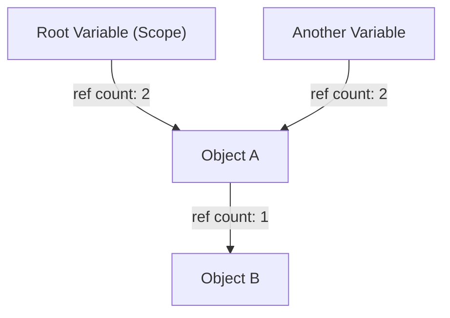
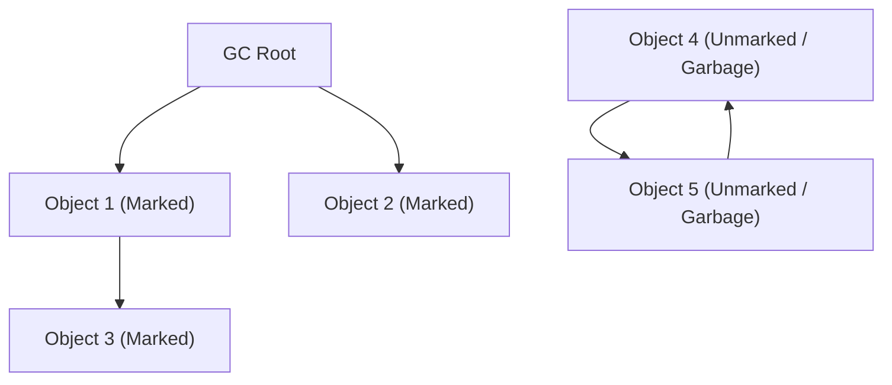
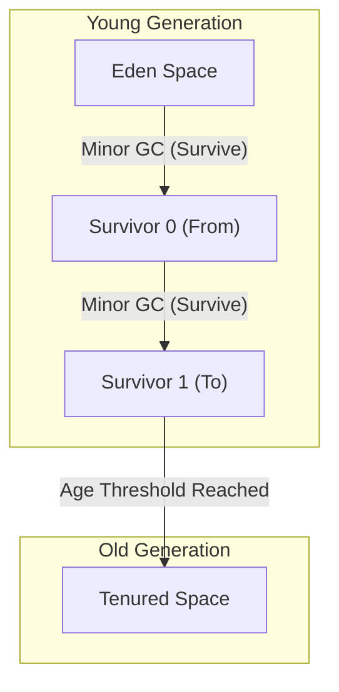

# Die Evolutionsgeschichte der Garbage Collection (GC): Der Weg von der manuellen Verwaltung zu ZGC

Dass wir in der modernen Softwareentwicklung programmieren können, ohne uns um die Speicherverwaltung kümmern zu müssen, ist allein der Evolution der „Garbage Collection (GC)“ zu verdanken. Viele der heute weit verbreiteten Programmiersprachen wie Java, C#, Python, JavaScript und Go haben die Garbage Collection in irgendeiner Form integriert.

Der Weg bis hierhin war jedoch keineswegs einfach. Die Geschichte begann in einer Zeit, als die Programmierer selbst die vollständige Kontrolle über die Zuweisung und Freigabe von Speicher hatten. Während sie mit zahlreichen Bugs kämpften, die mit der zunehmenden Komplexität von Programmen entstanden, wurde die Speicherverwaltung nach und nach automatisiert.

In diesem Artikel beleuchten wir die Geschichte der Speicherverwaltung in der Informatik. Von den Grenzen der manuellen Speicherverwaltung über Reference Counting, Mark & Sweep, Generationen-GC, G1GC bis hin zu den unglaublichen modernen Technologien wie ZGC und Shenandoah, werden wir den Evolutionsprozess aus der Perspektive von Algorithmen und Architektur tiefgehend analysieren.

---

## 1. Die Ära des Chaos: Manuelle Speicherverwaltung und ihre Grenzen

In der Zeit vor der Erfindung der Garbage Collection (und auch heute noch in Bereichen, in denen Sprachen wie C, C++ oder Rust dominieren) lag die Speicherverwaltung vollständig in der Verantwortung des Programmierers. Es war ein Prozess, bei dem das Programm bei Bedarf Speicher vom Betriebssystem anforderte und ihn explizit an das Betriebssystem zurückgab, wenn er nicht mehr benötigt wurde.

### Die Welt von `malloc` und `free`

In C werden für die dynamische Speicherzuweisung Funktionen der `malloc`-Familie und für die Freigabe `free` verwendet.

```c
#include <stdlib.h>
#include <stdio.h>

void process_data() {
    // 100 Integer-Werte auf dem Heap reservieren
    int* data = (int*)malloc(100 * sizeof(int));
    if (data == NULL) {
        // Fehlerbehandlung bei fehlgeschlagener Speicherzuweisung
        return;
    }

    // Daten verwenden
    for (int i = 0; i < 100; i++) {
        data[i] = i * 2;
    }

    // Speicher freigeben, wenn die Verarbeitung abgeschlossen ist
    free(data);
}
```

Der größte Vorteil dieses Ansatzes ist die „Kontrolle“ und die „Leistung“. Programmierer wussten auf die Millisekunde genau, wann und wo Speicher allokiert und wieder freigegeben wurde. In frühen Computersystemen mit strengen Hardwarebeschränkungen war diese absolute Kontrolle unerlässlich.

### Die 3 großen Sünden der manuellen Verwaltung

Als jedoch die Software auf Zehntausende oder Millionen von Zeilen anwuchs und mehrere Threads komplex miteinander verwoben wurden, überstieg die manuelle Speicherverwaltung die kognitiven Fähigkeiten des Menschen. Infolgedessen traten die folgenden schwerwiegenden Fehler häufig auf:

1. **Speicherleck (Memory Leak)**
   Das Problem des Vergessens der Freigabe zugewiesenen Speichers. Wenn bei langfristig laufenden Serveranwendungen ein Speicherleck auftritt, nimmt der verfügbare Speicher allmählich ab, bis das Betriebssystem den Prozess schließlich zwangsweise beendet (OOM: Out Of Memory).

2. **Dangling Pointers und Use-After-Free**
   Ein Fehler, bei dem weiterhin ein Zeiger auf einen Speicherbereich verwendet wird, obwohl der Speicher mit `free` freigegeben wurde. Es besteht die Möglichkeit, dass dem freigegebenen Speicherbereich neue Daten zugewiesen wurden. Wenn darauf zugegriffen oder geschrieben wird, werden völlig irrelevante Daten zerstört. Dies wurde zu einer Brutstätte für Sicherheitslücken (wie z. B. Ausführung beliebigen Codes).

3. **Doppelte Freigabe (Double Free)**
   Das Problem, dass `free` für denselben Speicherbereich zweimal aufgerufen wird. Dies zerstört die internen Datenstrukturen des Speicherallokators (wie die Freispeicherliste) und verursacht Abstürze oder fatale Sicherheitslücken.

```c
// Beispiel für Use-After-Free
int* ptr = malloc(sizeof(int));
*ptr = 42;
free(ptr);
// ... komplexe Verarbeitung ...
*ptr = 100; // Gefahr! Schreiben in einen bereits freigegebenen Bereich
```

Um diesen Problemen zu begegnen, wurden in C++ Konzepte wie RAII (Resource Acquisition Is Initialization) und Smart Pointer eingeführt, aber die Garbage Collection entstand aus der Idee: "Können wir dem Programmierer die Speicherverwaltung nicht abnehmen und dem System überlassen?"

---

## 2. Der erste Schritt zur Automatisierung: Reference Counting (Referenzzählung)

Der erste große Ansatz zur Überwindung der Grenzen manueller Speicherverwaltung war die "Referenzzählung". Auch heute noch wird es weithin in Python, PHP, Objective-C/Swift (ARC: Automatic Reference Counting) und im `std::shared_ptr` von C++ eingesetzt.

### Grundprinzip der Referenzzählung

Der Mechanismus der Referenzzählung ist sehr einfach. Im Headerbereich jedes Objekts wird ein Zähler (Referenzzähler) gehalten, der angibt, "von wie vielen Variablen (Zeigern) derzeit auf mich selbst referenziert wird".

- Wenn ein Objekt neu erstellt und einer Variablen zugewiesen wird, wird der Zähler auf `1` gesetzt.
- Wenn eine andere Variable anfängt, dieses Objekt zu referenzieren, wird der Zähler um `+1` erhöht.
- Wenn eine Variable ihren Gültigkeitsbereich verlässt (Scope) oder die Referenz entfernt wird, wird der Zähler um `-1` verringert.
- In dem Moment, in dem der Zähler `0` wird, ist sichergestellt, dass das Objekt "von nirgendwo mehr referenziert wird", und der Speicher wird sofort freigegeben.



### Vor- und Nachteile der Referenzzählung

**Vorteile:**
1. **Deterministische Freigabe:** Da der Speicher in dem Moment freigegeben wird, in dem die Referenz null erreicht, ist der Lebenszyklus von Ressourcen leicht vorhersehbar.
2. **Verteilung der Pausenzeit (Pause Time):** Da die Last der Speicherfreigabe über die gesamte Ausführung des Programms verteilt ist, treten massive Pausenzeiten wie das später beschriebene "Stop-The-World" (STW) seltener auf.

**Nachteile:**
1. **Overhead der Zähleraktualisierung:** Jedes Mal, wenn eine Zeigerzuweisung erfolgt, müssen Inkrement- und Dekrementbefehle ausgeführt werden. In Multithread-Umgebungen muss diese Zähleraktualisierung als atomare Operation (z. B. durch Sperren) durchgeführt werden, was zu einem großen Leistungsengpass wird.
2. **Der fatale Fehler von zirkulären Referenzen (Circular Reference):** Dies ist die größte Schwäche. Wenn Objekt A auf Objekt B und Objekt B auf Objekt A verweist, selbst wenn A und B von nirgendwo im Programm mehr erreichbar sind, referenzieren sie sich weiterhin gegenseitig. Folglich wird der Zähler niemals `0` erreichen, was zu einem permanenten Speicherleck führt.

Um zirkuläre Referenzen zu lösen, müssen Entwickler explizit "Schwache Referenzen (Weak References)" verwenden. Da dies letztendlich bedeutet, dass "Entwickler sich der Speicherabhängigkeiten bewusst sein müssen", kann man nicht von einer vollständigen Automatisierung sprechen.

---

## 3. Die Herausforderung der Ausrottung: Mark & Sweep und Tracing GC

"Tracing Garbage Collection" war der Ansatz, der das Problem der zirkulären Referenzen grundlegend löste und eine echte automatische Speicherverwaltung realisierte. Sein repräsentativster Algorithmus ist "Mark & Sweep".

Dieser von John McCarthy für die Programmiersprache LISP erfundene bahnbrechende Algorithmus bildet die Grundlage für fast alle hochentwickelten GCs, einschließlich modernem Java (JVM), Go und der V8-Engine (JavaScript).

### Das Konzept der Erreichbarkeit (Reachability)

Mark & Sweep verfolgt nicht wie die Referenzzählung, "von wem ein Objekt referenziert wird". Stattdessen fällt es die Entscheidung über Leben und Tod basierend darauf, ob "es erreichbar ist, wenn man von den Startpunkten des Programms (Roots) aus folgt" (Reachability).

Zu den Startpunkten, die **GC Roots** genannt werden, gehören:
- Lokale Variablen auf dem Call-Stack der aktuell ausgeführten Threads
- Globale Variablen, statische (static) Variablen
- CPU-Register

### Die 2 Phasen von Mark & Sweep

Wie der Name schon sagt, besteht der Algorithmus aus zwei Phasen.

1. **Mark Phase (Markierungsphase):**
   Ausgehend von den GC Roots werden den Zeigern folgend alle erreichbaren Objekte mit der Markierung "lebend (Live)" versehen. Dies wird oft implementiert, indem ein Bit (Mark Bit) im Objektheader gesetzt wird.

2. **Sweep Phase (Räumphase):**
   Der gesamte Heap-Speicher wird von Anfang bis Ende durchsucht (Sweep). Objekte ohne Markierung werden als "Müll (Garbage), der vom Programm nicht mehr erreichbar ist" betrachtet, und ihr Speicherbereich wird gesammelt und an die Freispeicherliste (Free List) zurückgegeben. Die Markierungen der markierten Objekte werden für die nächste GC gelöscht.


*(Im obigen Diagramm haben Obj4 und Obj5 eine zirkuläre Referenz, sind aber vom GC Root aus nicht erreichbar, sodass sie zusammen als Garbage gesammelt werden.)*

### Stop-The-World (STW) und Fragmentierung

Mark & Sweep schien die perfekte Methode zur Lösung zirkulärer Referenzen zu sein, kam aber mit einem hohen Preis.

Der erste Preis ist **Stop-The-World (STW)**.
Wenn Anwendungsthreads (sogenannte Mutatoren) während des Markierungsprozesses die Referenzbeziehungen von Objekten ändern, besteht die Gefahr, dass lebende Objekte übersehen werden. Daher war es bei frühen GCs notwendig, alle Threads der Anwendung zwischen der Markierungs- und der Sweep-Phase vollständig anzuhalten. Je größer der Heap wurde, desto länger dauerte diese Pausenzeit – von Sekunden bis zu mehreren Minuten – was für Systeme, die Echtzeitreaktionen erfordern, fatal war.

Der zweite Preis ist **Speicherfragmentierung**.
Die Orte, an denen Müll in der Sweep-Phase gesammelt wurde, verbleiben als Löcher im Heap, ähnlich wie bei Schweizer Käse. Obwohl insgesamt genügend freier Speicherplatz vorhanden ist, kann kein kontinuierlicher, großer Speicherblock zugewiesen werden, was zu einem OutOfMemoryError führt.

Um dies zu beheben, wurde eine Technik namens "Mark & Compact" eingeführt. Indem lebende Objekte auf eine Seite des Speicherbereichs verschoben (kompaktiert) werden, entsteht ein riesiger zusammenhängender freier Bereich. Da sich jedoch der Speicherort (die Speicheradresse) von Objekten ändert, müssen alle Zeiger, die auf dieses Objekt zeigen, umgeschrieben werden, was wiederum ein noch längeres STW verursacht.

---

## 4. Die Geburt der Generationen-GC und die Einführung von Heuristiken

Um die Ineffizienz des "jedes Mal den gesamten Heap scannens" von Mark & Sweep zu überwinden, wurde die "Generational Garbage Collection" (Generationen-GC) erfunden. Dies ist wohl eine der erfolgreichsten Heuristiken (Optimierung basierend auf Erfahrungswerten) in der Informatik.

### Die Schwache Generationenhypothese (Weak Generational Hypothesis)

Forscher von IBM und anderen Organisationen führten Speicher-Profilings verschiedener Anwendungen und entdeckten eine sehr starke Regel.

**"Die meisten neu zugewiesenen Objekte werden sehr schnell nicht mehr benötigt (sind kurzlebig)."**
**"Alte Objekte neigen dazu, auch in Zukunft lange zu überleben."**

Beispielsweise werden temporäre Zeichenketten, die innerhalb einer Schleife erstellt werden, oder DTO-Objekte, die den Rückgabewert einer Methode speichern, innerhalb weniger Millisekunden zu Müll. Andererseits überleben zwischengespeicherte Daten oder Verbindungspools, bis die Anwendung beendet wird.

### Teilung des Heaps: Young und Old

Basierend auf dieser Hypothese teilt die Generationen-GC den Heap-Speicher logisch in zwei Bereiche.

1. **Junge Generation (Young Generation):**
   Dies ist der Ort, an dem neu erstellte Objekte zuerst platziert werden. Der Young-Bereich ist weiter unterteilt in einen "Eden-Bereich" und zwei "Survivor-Bereiche" (From/To).
   Objekte werden zuerst in Eden allokiert. Wenn Eden voll ist, wird ein **Minor GC** ausgelöst.
   Der Minor GC führt Mark & Copy nur innerhalb der Young-Region durch. Überlebende Objekte werden in den Survivor-Bereich verschoben, und nur Objekte, die mehrere Minor GCs überlebt haben (ein bestimmtes Alter erreicht haben), werden als "langlebige Objekte" in die Old-Region "befördert" (Promotion).
   Da es so viele kurzlebige Objekte gibt, ist die Anzahl der überlebenden Objekte im Young-Bereich sehr gering. Der Kopiervorgang ist sehr schnell abgeschlossen, und die STW-Zeit kann extrem kurz gehalten werden.

2. **Alte Generation (Old Generation / Tenured):**
   Der Bereich, in dem langlebige Objekte platziert werden. Wenn die Old-Region voll ist, wird ein **Major GC (Full GC)** ausgelöst, der auf den gesamten Heap abzielt.
   Ein Full GC dauert lange, aber da kurzlebige Objekte bereits durch die Minor GCs der Young-Region beseitigt wurden, wird die Häufigkeit von Full GCs selbst drastisch reduziert.



### Optimierung durch die Card Table

Um die Generationen-GC zu realisieren, gab es noch eine weitere technische Herausforderung: "Wie kann man sicher einen GC nur für den Young-Bereich (Minor GC) ausführen, wenn Objekte der Old-Region auf Objekte der Young-Region verweisen?" Würde man nur den GC-Roots folgen, müsste man die gesamte Old-Region scannen.

Um dies zu lösen, wurde eine Datenstruktur namens "Card Table" eingeführt. Die Old-Region wird in kleine Seiten (Cards) unterteilt. Wenn eine Referenz von Old nach Young geschrieben wird, fügt ein spezieller Code namens Write Barrier (Schreibbarriere) ein und markiert die entsprechende Karte als "Dirty" (schmutzig). Beim Minor GC müssen dann zusätzlich zu den GC Roots nur diese Dirty-Cards gescannt werden, wodurch die Kosten für das Scannen der gesamten Old-Region vollständig entfallen.

Mit dem Aufkommen von Generationen-GC (z. B. CMS: Concurrent Mark Sweep) errang Java im Unternehmenssektor (Enterprise) einen überwältigenden Marktanteil.

---

## 5. Umgang mit riesigen Heaps: Der Aufstieg des G1GC (Garbage-First GC)

Als die Speicherpreise sanken und der Speicher von Servern von einigen GB auf Dutzende oder Hunderte von GB anwuchs, stieß die traditionelle Architektur der Generationen-GC auf eine neue Barriere.
Wenn ein Full GC auf einem Heap von mehreren Dutzend GB auftrat, verursachte die Beseitigung der Fragmentierung (Kompaktierung) selbst bei Verwendung eines nebenläufigen (concurrent) GC wie CMS eine STW von mehreren Sekunden.

Um dieses Problem zu lösen, wurde ab Java 9 der **G1GC (Garbage-First GC)** als Standard-GC eingeführt.

### Region-basierte Architektur

Das Hauptmerkmal von G1GC ist, dass er die physische Aufteilung des riesigen zusammenhängenden Speichers in eine traditionelle "Young"- und "Old"-Region aufgab.
Stattdessen wird der gesamte Heap in Tausende von kleinen Bereichen gleicher Größe (typischerweise 1MB bis 32MB) namens "Regionen" unterteilt, ähnlich wie die Felder eines Schachbretts.

Jede Region übernimmt dynamisch die Rolle von Eden, Survivor oder Old.

### Die Bedeutung von "Garbage-First" und das Vorhersagemodell

Der Name "Garbage-First" (Müll zuerst) von G1GC leitet sich von seiner Sammelstrategie ab.
Durch Concurrent Marking (die Markierungsphase läuft parallel zur Anwendungsausführung) berechnet G1GC kontinuierlich, "wie viele Müllobjekte jede Region enthält (oder wie wenige überlebende Objekte sie hat)".

Während eines GC kompaktiert G1GC nicht den gesamten Heap auf einmal. Stattdessen wählt er primär jene Regionen zur Sammlung aus, die "den meisten Müll enthalten und am effizientesten zu sammeln sind (wenige überlebende Objekte)".

Darüber hinaus verfügt G1GC über eine "Soft Real-Time"-Eigenschaft, die versucht, eine vom Benutzer spezifizierte "Ziel-Pausenzeit" (z. B. 200 Millisekunden) einzuhalten. Basierend auf statistischen Daten vergangener GCs berechnet G1GC heuristisch, "wie viele Regionen dieses Mal innerhalb von 200 Millisekunden gesammelt (kopiert) werden können", und bestimmt dynamisch die Anzahl der zu sammelnden Regionen (CSet: Collection Set).

Dadurch ist es möglich geworden, selbst Heap-Größen von mehreren Dutzend GB mit vorhersehbar kurzen STWs zu betreiben.

---

## 6. Der Gipfel der modernen GC: ZGC und Shenandoah ebnen den Weg in die Millisekunden-Welt

Obwohl das Problem massiver Heaps durch G1GC stark verbessert wurde, war das grundlegende Problem, "dass die STW-Zeit mit wachsender Heap-Größe unweigerlich proportional zunimmt" (insbesondere bei Zeigeraktualisierungen während Objektverschiebungen/Kompaktierungen), nicht vollständig gelöst.

Um den strengen Anforderungen von Finanzsystemen, Hochfrequenzhandel oder großen Echtzeit-Gaming-Servern gerecht zu werden, bei denen "unter keinen Umständen Pausen von mehr als wenigen Millisekunden toleriert werden können", wurden ultimative GC-Architekturen geschaffen. Diese können das STW selbst bei mehreren Terabyte (TB) Heap-Größe auf unter eine Millisekunde (Sub-Millisekunde) reduzieren. Diese GCs sind der **ZGC (Z Garbage Collector)** und **Shenandoah GC**.

### Die Magie der Concurrent Relocation (Nebenläufige Verschiebung)

Die Hauptursache für STW in traditionellen GCs war das "Verschieben von Objekten (Kompaktierung)". Nach dem Kopieren eines Objekts in einen neuen Speicherbereich musste die Anwendung gestoppt werden, während Millionen von Zeigern, die auf dieses Objekt zeigten, aktualisiert wurden. Wenn die Anwendung ohne Pause auf eine alte Speicheradresse zugegriffen hätte, wären Daten beschädigt worden.

ZGC und Shenandoah haben das magische Kunststück vollbracht, **selbst diese Objektverschiebungen und Zeigeraktualisierungen nebenläufig (concurrent) durchzuführen, ohne die Anwendungsthreads anzuhalten**.

### Die Kerntechnologie von ZGC: Colored Pointers (Farbige Zeiger) und Load Barriers

Der von Oracle entwickelte ZGC nutzt in hohem Maße eine bahnbrechende Technologie namens **Colored Pointers**, die die Eigenschaften der 64-Bit-Architektur maximal ausnutzt.

Von dem 64-Bit-Zeigerraum werden nur die unteren 44 Bit (ca. 16 TB) tatsächlich für Speicheradressen verwendet. ZGC verwendet einige der verbleibenden höheren Bits als "Metadaten (Farben)".
Diese Farbbits speichern Zustände wie "Ist dieser Zeiger bereits markiert?" oder "Wird das Objekt, auf das dieser Zeiger verweist, gerade verschoben (Relocated)?".

```
[ Unused ] [ Marked0 ] [ Marked1 ] [ Remapped ] [ Finalizable ] [   Object Address (44 bits)   ]
   ...          1           0           0              0        1010101010101010...
```

Zusätzlich wird eine winzige Menge Assembly-Code, eine sogenannte **Load Barrier (Ladebarriere)**, dynamisch an allen Stellen eingefügt, an denen die Anwendung einen Objektzeiger liest (Load).

**Wie die Load Barrier funktioniert:**
1. Ein Anwendungsthread liest einen Zeiger.
2. Er prüft die "Farbe" (Metadaten) des Zeigers.
3. Wenn das Objekt "aktuell vom GC an einen anderen Ort verschoben wird (oder verschoben wurde, aber dieser Zeiger noch auf die alte Adresse verweist)", greift die Load Barrier ein.
4. Sie fragt die von ZGC verwaltete "Forwarding Table" ab, um die neue, korrekte Adresse zu erhalten.
5. Der Zeiger selbst wird auf die neue Adresse aktualisiert (Self-Healing / Selbstreparatur), und dem Anwendungsthread wird das Objekt an der neuen Adresse zurückgegeben.

Dank dieses Selbstreparaturmechanismus können Anwendungsthreads immer sicher auf das "korrekte und aktuellste Objekt" zugreifen, selbst während der GC-Thread im Hintergrund fleißig Objekte verschiebt. Das STW beschränkt sich auf sehr begrenzte Phasen wie das "Scannen der GC Roots" (typischerweise unter einer Millisekunde), und die Pausenzeit bleibt konstant, unabhängig davon, ob der Heap 10 MB oder 16 TB groß ist.

### Die Kerntechnologie von Shenandoah: Brooks Pointers

Der hauptsächlich von Red Hat entwickelte Shenandoah GC realisiert ebenfalls eine Concurrent Relocation, wählt jedoch einen anderen Ansatz.

Shenandoah platziert vor dem Header jedes Objekts einen Weiterleitungszeiger, den sogenannten **Brooks Pointer**.
Im Normalfall zeigt dieser Zeiger auf "sich selbst". Wenn der GC jedoch beginnt, das Objekt in eine neue Region zu kopieren, ändert er den Brooks-Pointer des alten Objekts atomar auf "die Adresse des neuen Objekts".

Wenn die Anwendung das Objekt liest oder schreibt, wird der Zugriff stets über diesen Brooks-Pointer geleitet (Read Barrier / Write Barrier), was transparent zur neuen Adresse umleitet, selbst wenn sich das Objekt in Bewegung befindet.

---

## Fazit: Die Zukunft der Speicherverwaltung

Die Geschichte begann in der chaotischen Ära von `malloc/free` in C, führte über Mark & Sweep, das für LISP geboren wurde, zur Generationen-GC, die die Enterprise-Welt prägte, weiter zu G1GC zur Bändigung riesiger Heaps und gipfelt schließlich in ZGC und Shenandoah, die extrem niedrige Latenzzeiten erzielen.

Die Geschichte der Garbage Collection ist praktisch ein Spiegelbild des menschlichen Kampfes: "Wie bewältigen wir die Komplexität von Software?".
Heute ist durch die Verschmelzung von Hardware-Entwicklung (Branch Prediction in CPUs, Cache-Line-Optimierungen) und Software-Algorithmen das einst Unmögliche Realität geworden: Eine "vollständig nebenläufige, nie pausierende GC".

Obwohl ein anderer Ansatz der statischen Speicherverwaltung basierend auf einem "Ownership-Modell zur Kompilierzeit", wie man es in Rust sieht, an Bedeutung gewinnt, wird die Garbage Collection für hochskalierte Anwendungen, die dynamische und komplexe Objektgraphen handhaben, weiterhin eine unverzichtbare Infrastruktur bleiben.
Wie wäre es, ab und zu über die Algorithmen jener GC nachzudenken, die im Hintergrund stillschweigend, aber mit unübertroffener Meisterschaft unseren Speicher verwaltet?

---
*Reference: The Garbage Collection Handbook, OpenJDK Wiki, various JEPs (JEP 333, JEP 189)*
