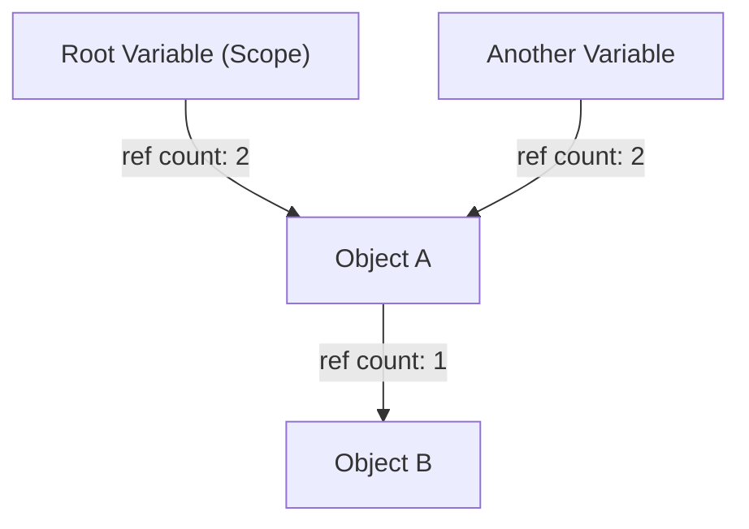
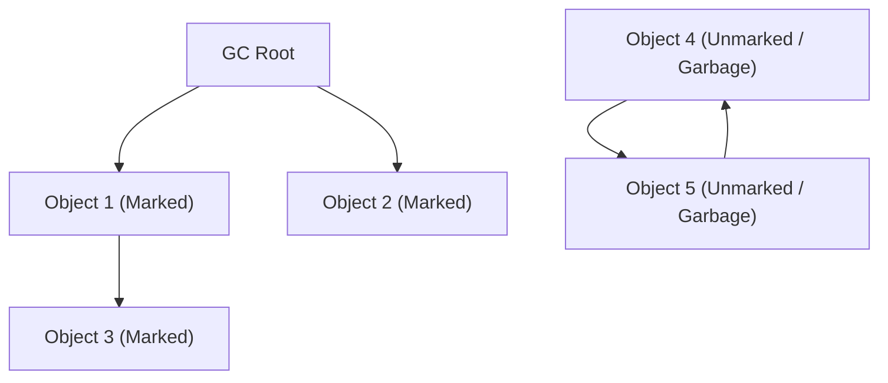
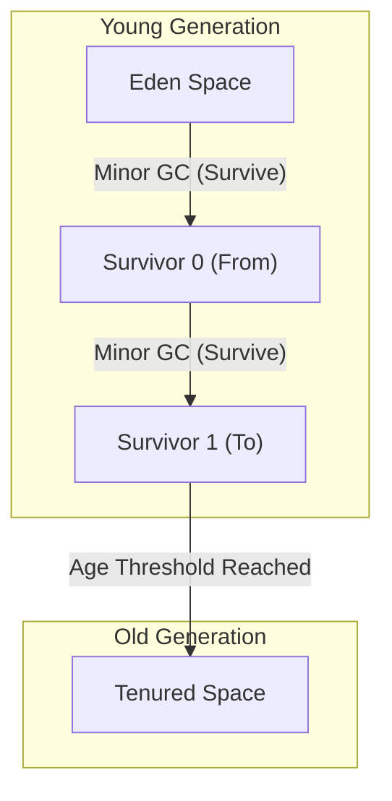

# The Evolution of Garbage Collection (GC): From Manual Management to ZGC

In modern software development, being able to program without worrying about memory management is entirely thanks to the evolution of a technology called "Garbage Collection" (GC). Many programming languages widely used today, such as Java, C#, Python, JavaScript, and Go, have some form of garbage collection built-in.

However, the road to this point was by no means smooth. It began in an era where programmers had full control over memory allocation and deallocation, and there has been a history of gradually automating memory management while fighting numerous bugs that arose as programs became more complex.

In this article, we will unravel the history of memory management in computer science, diving deep from the limitations of manual memory management to the evolution of reference counting, mark and sweep, generational GC, G1GC, and the modern marvels of ZGC and Shenandoah, exploring them from the perspectives of algorithms and architecture.

---

## 1. The Era of Chaos: Manual Memory Management and Its Limitations

In the era before garbage collection existed (and even today in domains where languages like C, C++, and Rust thrive), memory management was the complete responsibility of the programmer. It was a process where the program secured memory from the OS when needed, and explicitly returned it to the OS when it was no longer needed.

### The World of `malloc` and `free`

In C, the `malloc` family of functions is used for dynamic memory allocation, and `free` is used for deallocation.

```c
#include <stdlib.h>
#include <stdio.h>

void process_data() {
    // Allocate memory for 100 integers on the heap
    int* data = (int*)malloc(100 * sizeof(int));
    if (data == NULL) {
        // Error handling if memory allocation fails
        return;
    }

    // Process using the data
    for (int i = 0; i < 100; i++) {
        data[i] = i * 2;
    }

    // Free the memory once processing is complete
    free(data);
}
```

The biggest advantages of this approach are "control" and "performance." Programmers could know exactly when and where memory was allocated and when it was freed, down to the millisecond. In early computer systems with severe hardware constraints, this absolute control was essential.

### The Three Deadly Sins Caused by Manual Management

However, as software scaled to tens of thousands or millions of lines of code, and multiple threads became intricately intertwined, manual memory management exceeded the limits of human cognition. As a result, serious bugs like the following began to occur frequently.

1. **Memory Leak**
   The problem of forgetting to free allocated memory. When memory leaks occur in server applications running for long periods, available memory gradually decreases, eventually leading to the process being forcibly terminated by the OS (OOM: Out Of Memory).

2. **Dangling Pointers and Use-After-Free**
   A bug where a pointer to a memory region continues to be used even after the memory has been freed using `free`. The freed memory region might have been newly allocated for other data, and accessing or writing to it can destroy completely unrelated data. This became a hotbed for security vulnerabilities (like arbitrary code execution).

3. **Double Free**
   The problem of calling `free` twice on the same memory region. It destroys the internal data structures of the memory allocator (such as the free list), causing crashes and fatal security flaws.

```c
// Example of Use-After-Free
int* ptr = malloc(sizeof(int));
*ptr = 42;
free(ptr);
// ... complex processing ...
*ptr = 100; // DANGER! Writing to an already freed memory region
```

To address these problems, concepts like RAII (Resource Acquisition Is Initialization) and smart pointers were introduced in C++, but garbage collection was born from the idea: "Can't we just take memory management away from the programmer and leave it to the system?"

---

## 2. The First Step Toward Automation: Reference Counting

The first major approach to overcome the limitations of manual memory management was "reference counting." It is still widely used today in Python, PHP, Objective-C/Swift (ARC: Automatic Reference Counting), and C++'s `std::shared_ptr`.

### Basic Principles of Reference Counting

The mechanism of reference counting is very simple. In the header region of each object, it maintains a counter (reference count) indicating "how many variables (pointers) are currently referencing this object."

- When an object is newly created and assigned to a variable, the count is set to `1`.
- When another variable starts referencing the object, the count is incremented by `+1`.
- When a reference is lost, such as a variable going out of scope, the count is decremented by `-1`.
- The moment the count reaches `0`, it is certain that the object is "not referenced from anywhere," so the memory is immediately freed.



### Pros and Cons of Reference Counting

**Pros:**
1. **Deterministic Deallocation:** Memory is freed the exact moment references drop to zero, making the resource lifecycle easy to predict.
2. **Distribution of Pause Time:** The overhead of freeing memory is spread across the entire execution of the program, making it less likely to cause massive pause times like "Stop-The-World (STW)," which we will discuss later.

**Cons:**
1. **Counter Update Overhead:** Every time a pointer assignment occurs, increment and decrement instructions must be executed. In a multi-threaded environment, these counter updates must be atomic operations (like locks), becoming a major performance bottleneck.
2. **The Fatal Flaw of Circular References:** This is its greatest weakness. If Object A references Object B, and Object B references Object A, even if neither A nor B is accessible from anywhere else in the program, their counts will never reach `0` because they reference each other, resulting in a permanent memory leak.

To resolve circular references, developers had to explicitly use "Weak References," but this meant that "developers still had to be aware of memory dependencies," which ultimately meant it wasn't a completely automated solution.

---

## 3. The Challenge of Eradication: Mark and Sweep and Tracing GC

"Tracing Garbage Collection" was what fundamentally solved the circular reference problem and achieved true automated memory management, with its representative algorithm being "Mark and Sweep."

This revolutionary algorithm, invented by John McCarthy for the LISP language, serves as the foundation for almost all advanced GCs today, including modern Java (JVM), Go, and the V8 engine (JavaScript).

### The Concept of Reachability

Unlike reference counting, Mark and Sweep does not track "who is referencing what." Instead, it makes life-or-death decisions based on "whether an object can be reached by tracing from the program's starting points (Reachability)."

The starting points, called **GC Roots**, include the following:
- Local variables on the call stack of the currently executing thread
- Global variables, static variables
- CPU registers

### The Two Phases of Mark and Sweep

As the name suggests, the algorithm consists of two phases:

1. **Mark Phase:**
   Starting from the GC Roots, it follows pointers and marks all accessible objects as "Live." This is often implemented by setting a single bit (mark bit) in the object header.

2. **Sweep Phase:**
   It traverses (sweeps) the entire heap memory from beginning to end. Objects that are not marked are judged to be "garbage that is no longer reachable from the program," and their memory space is reclaimed and returned to the Free List. Marked objects have their marks cleared for the next GC.


*(In the diagram above, Obj4 and Obj5 have a circular reference, but since they cannot be reached from the GC Root, they are collected together as Garbage.)*

### Stop-The-World (STW) and Fragmentation

Mark and Sweep seemed like a perfect method for solving circular references, but it came with significant costs.

The first cost is **Stop-The-World (STW)**.
While the mark process is ongoing, if application threads (called mutators) change object reference relationships, there is a risk of missing live objects. Therefore, early GCs required completely stopping all application threads during the mark and sweep phases. The larger the heap size, the longer this pause time stretched—from seconds to tens of minutes—which was fatal for systems requiring real-time responsiveness.

The second cost is **Memory Fragmentation**.
The sites where garbage is collected during the sweep phase are scattered throughout the heap like Swiss cheese. Even if the total free space is sufficient, large contiguous memory blocks cannot be allocated, resulting in an OutOfMemoryError.

To resolve this, a technique called "Mark and Compact" was introduced. By moving (compacting) live objects to one side of the memory space, it creates a massive contiguous free space. However, because the locations (memory addresses) of objects change, all pointers referencing those objects must be rewritten, causing an even longer STW.

---

## 4. The Birth of Generational GC and the Introduction of Heuristics

To overcome the inefficiency of "scanning the entire heap every time" in Mark and Sweep, "Generational Garbage Collection" was devised. This can be considered one of the most successful heuristics (optimizations based on rules of thumb) in computer science.

### Weak Generational Hypothesis

Researchers from companies like IBM profiled the memory of various applications and discovered a powerful rule:

**"Most newly allocated objects become unneeded (die) very quickly."**
**"Older objects tend to survive for a long time."**

For example, strings created temporarily in a loop or DTO objects storing method return values become garbage within a few milliseconds. On the other hand, cached data or connection pools survive until the application terminates.

### Splitting the Heap: Young and Old

Based on this hypothesis, Generational GC logically divides the heap memory.

1. **Young Generation:**
   The place where newly created objects are initially allocated. The Young area is further divided into an "Eden space" and two "Survivor spaces (From/To)."
   Objects are first allocated in Eden. When Eden fills up, a **Minor GC** occurs.
   Minor GC performs mark and copy only within the Young generation. Surviving objects move to a Survivor space, and only objects that survive several Minor GCs (accumulate age) are promoted to the Old generation as "long-lived objects."
   Because there are many short-lived objects, the number of surviving objects in the Young generation is very small, allowing the copying to finish quickly and keeping STW times extremely short.

2. **Old Generation (Tenured):**
   The area where long-surviving objects are placed. When the Old generation fills up, a **Major GC (Full GC)** targeting the entire heap occurs.
   Full GC takes time, but since short-lived objects have already been wiped out by Minor GCs in the Young generation, the frequency of Full GCs can be drastically reduced.



### Optimization via Card Table

There was another technical challenge to realizing Generational GC: "If an object in the Old generation references an object in the Young generation, how can we safely execute a GC solely on the Young generation (Minor GC)?" Tracing only from the GC roots would necessitate scanning the entire Old generation.

To resolve this, a data structure called a "Card Table" was introduced. The Old generation is divided into small pages (cards), and when a write occurs creating a reference from Old to Young, a special piece of code called a Write Barrier is inserted to mark the corresponding card as "Dirty." During a Minor GC, only these Dirty cards need to be scanned in addition to the GC roots, completely eliminating the cost of scanning the entire Old generation.

With the advent of Generational GC (such as CMS: Concurrent Mark Sweep), Java gained an overwhelming market share in the enterprise space.

---

## 5. Handling Massive Heaps: The Rise of G1GC (Garbage-First GC)

As memory prices dropped and server memory capacities grew massively from gigabytes to tens or hundreds of gigabytes, the traditional Generational GC architecture faced a new wall.
When a Full GC occurs on a heap of tens of gigabytes, even when using a concurrent GC like CMS, STW pauses measuring in seconds would occur when resolving fragmentation (compaction).

To solve this, **G1GC (Garbage-First GC)** was adopted as the default GC starting from Java 9.

### Region-Based Architecture

The biggest feature of G1GC is that it abandoned the traditional physical division of massive contiguous memory spaces into "Young" and "Old" generations.
Instead, it divided the entire heap into thousands of small areas called "Regions," typically 1MB to 32MB in size, resembling squares on a chessboard.

Each region dynamically takes on the role of Eden, Survivor, or Old.

### The Meaning of "Garbage-First" and Predictive Modeling

The name "Garbage-First" comes from its collection strategy.
Through concurrent marking (performing mark processing alongside application execution), G1GC is constantly calculating "how much garbage is in each region (how few live objects there are)."

During GC, instead of compacting the entire heap at once, G1GC **"prioritizes collecting regions that contain the most garbage and are highly efficient to collect (have few live objects)."**

Furthermore, G1GC features soft real-time capabilities, attempting to adhere to a "pause time target" specified by the user (e.g., 200 milliseconds). Based on historical GC statistical data, it heuristically calculates "how many regions can be collected (copied) this time within 200 milliseconds" and dynamically determines the number of regions to collect (CSet: Collection Set).

This made it possible to operate with predictable, short STW times even with heap sizes in the tens of gigabytes.

---

## 6. The Zenith of Modern GC: The Millisecond World Forged by ZGC and Shenandoah

While the introduction of G1GC drastically improved the issue of massive heaps, the fundamental problem—"as the heap size grows, the STW time will eventually increase proportionally" (especially during pointer updates during object relocation/compaction)—was not completely solved.

To meet the strict requirements of financial systems, high-frequency trading, or massive real-time game servers where **"pauses of more than a few milliseconds are unacceptable under any circumstances,"** ultimate GC architectures were born that keep STW under 1 millisecond (sub-millisecond) even for heaps of several terabytes (TB). These are **ZGC (Z Garbage Collector)** and **Shenandoah GC**.

### The Magic of Concurrent Relocation

The biggest cause of STW in traditional GCs was "object movement (compaction)." After copying an object to a new memory area, the application had to be stopped while all the millions of pointers referencing that object were rewritten. If the application wasn't stopped and accessed the old memory address, data would be corrupted.

ZGC and Shenandoah accomplished the magical feat of performing even this **"object movement and pointer updating" concurrently, without stopping application threads.**

### ZGC's Core Technology: Colored Pointers and Load Barriers

ZGC, spearheaded by Oracle, employs a revolutionary technology called **Colored Pointers**, maximizing the characteristics of 64-bit architectures.

Out of the 64-bit pointer space, only the lower 44 bits (up to 16TB) are actually used as memory addresses. ZGC uses some of the remaining upper bits as "metadata (color)."
These color bits record states such as "Is this pointer already marked?" or "Is the object this pointer refers to being relocated?"

```
[ Unused ] [ Marked0 ] [ Marked1 ] [ Remapped ] [ Finalizable ] [   Object Address (44 bits)   ]
   ...          1           0           0              0        1010101010101010...
```

Furthermore, a very tiny assembly instruction called a **Load Barrier** is dynamically inserted at every place where the application reads (loads) a reference to an object.

**How the Load Barrier Works:**
1. An application thread reads a pointer.
2. It checks the "color (metadata)" of the pointer.
3. If the object is "being moved to another location by the GC (or has been moved, but this pointer still points to the old address)," the load barrier intervenes.
4. It looks up the "Forwarding Table" managed by ZGC and retrieves the correct new address.
5. It rewrites the pointer itself to the new address (Self-Healing) and returns the object at the new address to the application.

Thanks to this self-healing mechanism, even while GC threads are busy moving objects in the background, application threads can always safely access the "correct, up-to-date objects." STW is restricted to extremely limited phases like "GC root scanning" (usually under 1 millisecond), and the pause time remains the same whether the heap size is 10MB or 16TB.

### Shenandoah's Core Technology: Brooks Pointers

Shenandoah GC, driven by Red Hat, also achieves concurrent relocation, but its approach is different.

Shenandoah places a forwarding pointer called a **Brooks Pointer** before the header region of every object.
Normally, this pointer points to "itself." However, when the GC begins copying an object to a new region, it atomically rewrites the old object's Brooks Pointer to the "new object's address."

By always routing through this Brooks Pointer when the application reads or writes to an object (Read Barrier / Write Barrier), it transparently guides access to the new object even while it is being moved.

---

## Conclusion: The Future of Memory Management

Beginning with the era of chaos with C's `malloc/free`, to Mark and Sweep born in LISP, Generational GC that supported the enterprise, G1GC taming massive heaps, and ZGC and Shenandoah achieving extreme low latency.

The history of garbage collection is effectively the history of humanity's challenge of "how to battle the complexity of software."
Today, through the fusion of hardware evolution (like CPU branch prediction and cache line optimization) and software algorithms, "fully concurrent GCs that never stop," which were once thought impossible, have become a reality.

While other approaches like static memory management via "compile-time ownership models" like Rust are emerging, garbage collection will continue to be an indispensable infrastructure in large-scale applications dealing with dynamic and complex object graphs.
Perhaps it is worth taking a moment occasionally to reflect on the algorithms of GC, quietly but with transcendent skill, continuing to manage memory in the background.

---
*Reference: The Garbage Collection Handbook, OpenJDK Wiki, various JEPs (JEP 333, JEP 189)*
