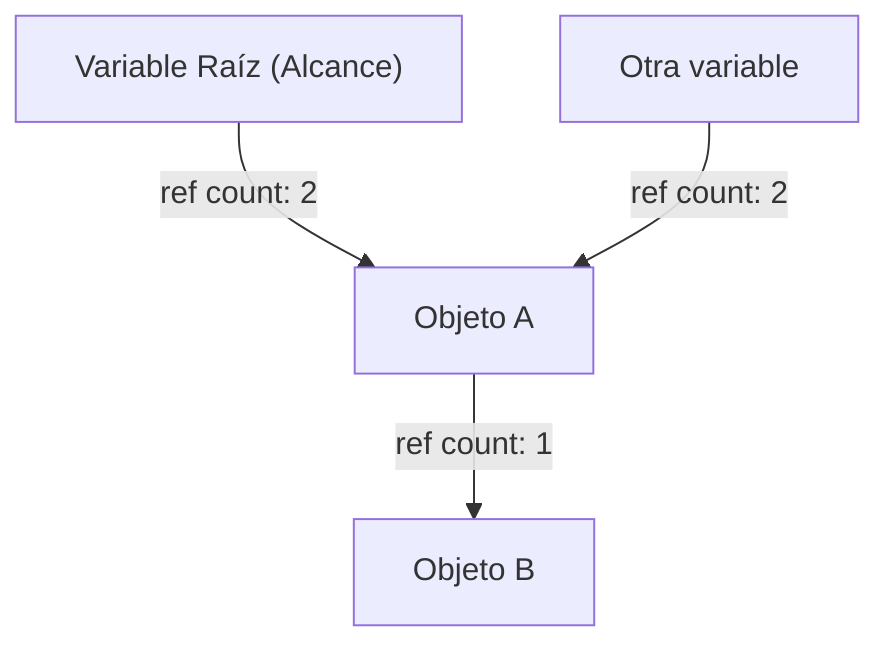
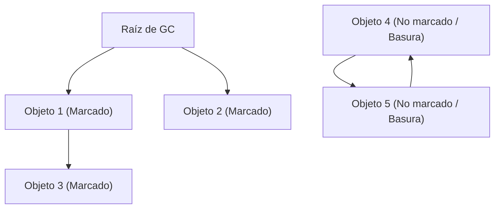
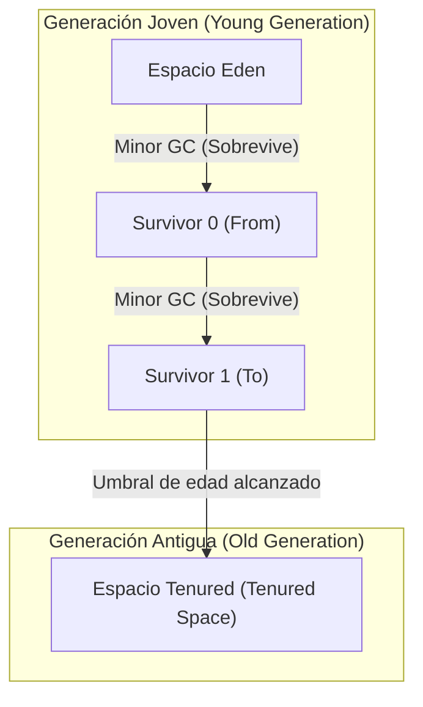

# La historia de la evolución de la recolección de basura (GC): desde la gestión manual hasta ZGC

En el desarrollo de software moderno, el hecho de que podamos programar sin preocuparnos por la gestión de memoria se debe enteramente a la evolución de una tecnología llamada "Recolección de basura" (Garbage Collection, GC). Muchos de los lenguajes de programación ampliamente utilizados hoy en día, como Java, C#, Python, JavaScript y Go, tienen incorporada alguna forma de recolección de basura.

Sin embargo, el camino para llegar aquí no fue en absoluto fácil. Comenzó en una época en la que los propios programadores controlaban por completo la asignación y liberación de memoria, y es una historia de automatización gradual de la gestión de la memoria mientras se luchaba contra numerosos errores que surgían a medida que los programas se volvían más complejos.

En este artículo, desentrañaremos la historia de la gestión de memoria en ciencias de la computación, profundizando en el proceso de evolución desde las limitaciones de la gestión manual de memoria, pasando por el conteo de referencias (Reference Counting), Mark and Sweep, GC generacional, G1GC, hasta las asombrosas tecnologías modernas como ZGC y Shenandoah, todo ello explicado desde la perspectiva de algoritmos y arquitectura.

---

## 1. La era del caos: La gestión manual de memoria y sus límites

En la época en la que no existía la recolección de basura (y en las áreas donde lenguajes como C, C++ y Rust todavía dominan en la actualidad), la gestión de la memoria era responsabilidad exclusiva del programador. Era un proceso de solicitar memoria al sistema operativo (OS) cuando el programa lo necesitaba, y devolverla explícitamente al OS cuando ya no era necesaria.

### El mundo de `malloc` y `free`

En el lenguaje C, la familia de funciones `malloc` se usa para la asignación dinámica de memoria, y `free` se usa para su liberación.

```c
#include <stdlib.h>
#include <stdio.h>

void process_data() {
    // Asignar memoria en el heap (montículo) para 100 enteros
    int* data = (int*)malloc(100 * sizeof(int));
    if (data == NULL) {
        // Manejo de error si falla la asignación de memoria
        return;
    }

    // Procesamiento utilizando los datos
    for (int i = 0; i < 100; i++) {
        data[i] = i * 2;
    }

    // Liberar la memoria cuando el procesamiento haya terminado
    free(data);
}
```

La mayor ventaja de este enfoque es el "control" y el "rendimiento". Los programadores podían saber exactamente, a nivel de milisegundos, cuándo y dónde se asignaba la memoria y cuándo se liberaba. En los primeros sistemas informáticos con estrictas limitaciones de hardware, este control absoluto era esencial.

### Los tres grandes pecados causados por la gestión manual

Sin embargo, a medida que la escala del software se inflaba a decenas de miles o millones de líneas de código y múltiples hilos se entrelazaban de manera compleja, la gestión manual de la memoria comenzó a superar los límites cognitivos humanos. Como resultado, comenzaron a ocurrir con frecuencia errores graves como los siguientes:

1. **Fuga de memoria (Memory Leak)**
   Es el problema de olvidar liberar la memoria asignada. Si se produce una fuga de memoria en una aplicación de servidor de larga duración, la memoria disponible disminuirá gradualmente y, finalmente, el sistema operativo cerrará el proceso a la fuerza (OOM: Out Of Memory).

2. **Punteros colgantes (Dangling Pointers) y Use-After-Free**
   Es un error en el que se continúa utilizando un puntero que apunta a un área de memoria a pesar de que la memoria se liberó con `free`. Es posible que se hayan asignado nuevos datos a la región de memoria liberada, y si se accede a ella o se escribe en ella, se destruirán datos completamente no relacionados. Esto se convirtió en un caldo de cultivo para vulnerabilidades de seguridad (como la ejecución de código arbitrario).

3. **Doble liberación (Double Free)**
   Es el problema de llamar a `free` dos veces para la misma área de memoria. Esto destruye las estructuras de datos internas del asignador de memoria (como la lista libre), causando bloqueos (crashes) o fallos de seguridad fatales.

```c
// Ejemplo de Use-After-Free
int* ptr = malloc(sizeof(int));
*ptr = 42;
free(ptr);
// ... procesamiento complejo ...
*ptr = 100; // ¡Peligro! Escritura en un área ya liberada
```

Para hacer frente a estos problemas, se introdujeron en C++ conceptos como RAII (Resource Acquisition Is Initialization) y punteros inteligentes (smart pointers), pero la recolección de basura nació de la idea: "¿No podemos quitarle la gestión de la memoria al programador y dejarla al sistema desde el principio?".

---

## 2. El primer paso hacia la automatización: Conteo de referencias (Reference Counting)

El primer enfoque importante para superar las limitaciones de la gestión manual de memoria es el "conteo de referencias". Hoy en día, todavía se usa ampliamente en lenguajes como Python, PHP, Objective-C/Swift (ARC: Automatic Reference Counting) y `std::shared_ptr` de C++.

### Principio básico del conteo de referencias

El mecanismo del conteo de referencias es muy simple. En el área del encabezado de cada objeto se incluye un contador (recuento de referencias) que indica "desde cuántas variables (punteros) se está referenciando a sí mismo en la actualidad".

- Cuando se crea un nuevo objeto y se asigna a una variable, el recuento se establece en `1`.
- Cuando otra variable comienza a referenciar a ese objeto, el recuento aumenta en `+1`.
- Cuando la variable sale de su alcance o se pierde la referencia, el recuento disminuye en `-1`.
- En el momento en que el recuento llega a `0`, se determina que ese objeto "no está referenciado por nadie" y la memoria se libera de inmediato.



### Ventajas y desventajas del conteo de referencias

**Ventajas:**
1. **Liberación determinista:** Como la memoria se libera en el instante en que las referencias llegan a cero, es fácil predecir el ciclo de vida de los recursos.
2. **Dispersión del tiempo de pausa (Pause Time):** Dado que la carga de liberar la memoria se distribuye a lo largo de la ejecución del programa, es poco probable que se produzcan pausas enormes como el "Stop-The-World (STW)" que se describe más adelante.

**Desventajas:**
1. **Sobrecarga de actualización del contador:** Cada vez que se produce la asignación de un puntero, es necesario ejecutar instrucciones de incremento y decremento. En entornos de múltiples hilos, esta actualización del contador debe realizarse mediante operaciones atómicas (como bloqueos), lo que se convierte en un cuello de botella de rendimiento importante.
2. **Defecto fatal de las referencias circulares (Circular Reference):** Esta es la mayor debilidad. Si el Objeto A hace referencia al Objeto B y el Objeto B hace referencia al Objeto A, incluso si ya no se puede acceder a A y B desde ningún lugar del programa, el recuento nunca será `0` porque se hacen referencia entre sí, lo que resulta en una fuga de memoria permanente.

Para resolver las referencias circulares, los desarrolladores deben utilizar explícitamente "referencias débiles (Weak References)", lo que significa, después de todo, que "los desarrolladores deben ser conscientes de las dependencias de memoria", por lo que no podría llamarse una automatización completa.

---

## 3. El desafío de la erradicación: Mark and Sweep (Marcado y barrido) y Tracing GC

El "Tracing Garbage Collection" (Recolección de basura por rastreo) es lo que resolvió fundamentalmente el problema de las referencias circulares y logró una verdadera gestión automática de la memoria, y su algoritmo representativo es "Mark and Sweep".

Este revolucionario algoritmo ideado por John McCarthy para el lenguaje LISP se ha convertido en la base de casi todos los GC avanzados actuales, como el de Java (JVM), Go y el motor V8 (JavaScript).

### El concepto de alcanzabilidad (Reachability)

Mark & Sweep no rastrea "quién está haciendo la referencia" como el conteo de referencias. En su lugar, toma decisiones de vida o muerte basándose en "si se puede alcanzar (Reachability) siguiendo el camino desde el punto de partida (raíz) del programa".

Los puntos de partida llamados **Raíces de GC (GC Roots)** incluyen lo siguiente:
- Variables locales en la pila de llamadas del hilo actualmente en ejecución
- Variables globales, variables estáticas (static)
- Registros de la CPU

### Las dos fases de Mark & Sweep

Como sugiere su nombre, el algoritmo consta de dos fases.

1. **Fase de marcado (Mark Phase):**
   A partir de las raíces del GC, rastrea los punteros y marca todos los objetos accesibles como "vivos (Live)". Esto se implementa frecuentemente estableciendo 1 bit (bit de marcado) en el encabezado del objeto.

2. **Fase de barrido (Sweep Phase):**
   Escanea (barre) toda la memoria del heap desde el principio hasta el final. Los objetos que no están marcados se consideran "basura (Garbage) a la que el programa ya no puede llegar", y esas áreas de memoria se recuperan y se devuelven a la lista libre (Free List). A los objetos que estaban marcados se les borra la marca para el próximo GC.


*(En la figura anterior, Obj4 y Obj5 tienen una referencia circular, pero como no se pueden alcanzar desde la Raíz de GC, se recolectan juntos como basura.)*

### Stop-The-World (STW) y fragmentación

Mark & Sweep parecía ser la manera perfecta de resolver las referencias circulares, pero conllevaba un alto precio.

El primer precio a pagar es **Stop-The-World (STW)**.
Durante la ejecución del proceso de marcado, si un hilo de la aplicación (llamado mutador) cambia la relación de referencia de un objeto, existe el riesgo de perder de vista un objeto vivo. Por lo tanto, en los primeros GC, era necesario detener por completo todos los hilos de la aplicación entre el marcado y el barrido. A medida que el tamaño del heap se hacía más grande, este tiempo de parada podía durar desde varios segundos hasta decenas de minutos, lo que resultaba fatal en sistemas que requerían operaciones en tiempo real.

El segundo precio a pagar es la **fragmentación de memoria**.
Los sitios de donde se recolectó la basura en la fase de barrido quedan esparcidos por todo el heap como un queso agujereado. Aunque la cantidad total de espacio libre es suficiente, no se puede asegurar un bloque de memoria grande y contiguo, lo que resulta en un OutOfMemoryError.

Para resolver esto, surgió un método llamado "Marcar y compactar (Mark and Compact)". Al mover los objetos vivos a un lado del área de memoria (compactación), se crean grandes áreas libres contiguas. Sin embargo, debido a que la ubicación del objeto (dirección de memoria) cambia, es necesario un proceso para reescribir todos los punteros que apuntan a ese objeto, lo que causó un STW aún más largo.

---

## 4. El nacimiento del GC generacional y la introducción de la heurística

Para superar la ineficiencia de que Mark & Sweep tenga que "escanear todo el heap cada vez", se inventó la "Recolección de basura generacional (Generational GC)". Se puede decir que es una de las heurísticas (optimizaciones basadas en la experiencia) más exitosas en informática.

### La hipótesis generacional débil (Weak Generational Hypothesis)

Los investigadores de IBM y otros realizaron perfiles de memoria de varias aplicaciones y descubrieron una regla muy poderosa.

**"La mayoría de los objetos recién asignados se vuelven innecesarios de inmediato (tienen una vida corta)."**
**"Los objetos antiguos tienden a sobrevivir más tiempo."**

Por ejemplo, las cadenas de texto creadas temporalmente dentro de un bucle o los objetos DTO que almacenan los valores de retorno de los métodos se convierten en basura unos milisegundos después. Por otro lado, los datos almacenados en caché o los grupos de conexiones (connection pools) sobreviven hasta que finaliza la aplicación.

### División del heap: Jóvenes (Young) y Viejos (Old)

Basándose en esta hipótesis, el GC generacional divide lógicamente la memoria del heap.

1. **Generación Joven (Young Generation):**
   Aquí es donde se colocan inicialmente los objetos recién creados. El espacio Young se divide a su vez en el "Espacio Eden" y dos "Espacios Survivor (From/To)".
   Los objetos se asignan primero a Eden. Cuando Eden se llena, se produce un **Minor GC**.
   En el Minor GC, Mark & Copy se ejecuta solo dentro del espacio Young. Los objetos sobrevivientes se mueven al espacio Survivor, y solo los objetos que sobreviven a varios Minor GC allí (es decir, han envejecido) son promovidos (Promotion) al espacio Old como "objetos longevos".
   Como hay hay muchos objetos de vida corta, quedan muy pocos objetos sobrevivientes en el espacio Young, por lo que la copia se completa rápidamente y el tiempo STW se puede mantener extremadamente corto.

2. **Generación Antigua (Old Generation / Tenured):**
   Esta es el área donde se colocan los objetos de larga vida. Cuando el espacio Old se llena, se produce un **Major GC (Full GC)** que abarca todo el heap.
   El Full GC lleva tiempo, pero como los objetos de vida corta ya han sido eliminados por el Minor GC en el espacio Young, la frecuencia de los Full GC en sí misma puede reducirse drásticamente.



### Optimización a través de la Tabla de Tarjetas (Card Table)

Para hacer realidad el GC generacional, hubo otro desafío técnico: "Si un objeto en el espacio Old hace referencia a un objeto en el espacio Young, ¿cómo podemos ejecutar un GC (Minor GC) solo en el espacio Young de forma segura?". Si solo hiciéramos el rastreo desde las raíces del GC, tendríamos que escanear todo el espacio Old.

Para solucionar esto, se introdujo una estructura de datos llamada "Tabla de Tarjetas (Card Table)". El área Old se divide en pequeñas páginas (tarjetas), y cuando ocurre la escritura de una referencia de Old a Young, se inserta un código especial llamado "Barrera de escritura (Write Barrier)" para marcar la tarjeta correspondiente como "Sucia (Dirty)". Durante un Minor GC, es suficiente escanear solo estas tarjetas sucias además de las raíces del GC, eliminando por completo el costo de escanear toda el área Old.

Con la aparición de GC generacionales (como CMS: Concurrent Mark Sweep), Java ganó una cuota abrumadora en el ámbito empresarial.

---

## 5. Abordando los heaps de gran capacidad: El auge de G1GC (Garbage-First GC)

A medida que caía el precio de la memoria y la memoria de los servidores crecía enormemente de unos pocos GB a decenas o cientos de GB, la arquitectura de GC generacional tradicional se enfrentó a un nuevo obstáculo.
Cuando ocurre un Full GC en un heap de decenas de GB, incluso si se usa un GC concurrente (paralelo) como CMS, se produce un STW que dura varios segundos al resolver la fragmentación (compactación).

Para resolver esto, **G1GC (Garbage-First GC)** fue adoptado como el recolector de basura predeterminado a partir de Java 9.

### Arquitectura basada en Regiones (Region)

La mayor característica de G1GC es que abandonó la división física de bloques de memoria grandes y contiguos tradicionales: "Espacio Young" y "Espacio Old".
En cambio, todo el heap se dividió en miles de pequeñas áreas del mismo tamaño (generalmente de 1 MB a 32 MB) llamadas "Regiones (Regions)", similares a las casillas de un tablero de ajedrez.

Cada región tiene dinámicamente la función de Eden, Survivor o Old.

### Significado de "Garbage-First" y el modelo predictivo

El nombre de G1GC, "Garbage-First" (Basura Primero), proviene de su estrategia de recolección.
G1GC, mediante el marcado concurrente (el procesamiento de marcado se ejecuta en paralelo con la ejecución de la aplicación), calcula constantemente "cuántos objetos basura contiene cada región (o cuán pocos objetos sobrevivientes hay)".

Durante el GC, G1GC no compacta todo el heap a la vez, sino que **"prioriza la recolección de las regiones con la mayor cantidad de basura y la mejor eficiencia de recolección (las que tienen menos objetos sobrevivientes)"**.

Además, G1GC tiene la característica de un sistema de "tiempo real suave" que intenta adherirse a un "tiempo de pausa objetivo" especificado por el usuario (por ejemplo, 200 milisegundos). Basado en datos estadísticos de GC pasados, calcula heurísticamente "¿Cuántas regiones se pueden recolectar (copiar) esta vez en 200 milisegundos?", y determina dinámicamente el número de regiones a recolectar (CSet: Collection Set).

Esto hizo posible operar con STW cortos y predecibles incluso en tamaños de heap de decenas de GB.

---

## 6. La cúspide de los GC modernos: ZGC y Shenandoah abren el mundo de los milisegundos

La llegada de G1GC mejoró en gran medida el problema de los heaps gigantes, pero el problema fundamental de que "a medida que aumenta el tamaño del heap, el tiempo de STW aumentará proporcionalmente" (especialmente la actualización de punteros al reubicar/compactar objetos) no se había resuelto por completo.

Para cumplir con los estrictos requisitos de **"en ninguna circunstancia se permiten pausas de más de unos pocos milisegundos"** para sistemas financieros, operaciones de alta frecuencia, servidores de juegos en tiempo real a gran escala, etc., nacieron las arquitecturas de GC definitivas que mantienen el STW a menos de 1 milisegundo (sub-milisegundo) incluso para heaps de varios terabytes (TB). Estos son **ZGC (Z Garbage Collector)** y **Shenandoah GC**.

### La magia de la reubicación concurrente (Concurrent Relocation)

La principal causa de que ocurriera STW en los GC convencionales era "el movimiento de objetos (compactación)". Después de copiar objetos a una nueva área de memoria, era necesario detener la aplicación mientras se reescribían los millones de punteros que apuntaban a esos objetos. Si la aplicación no se detuviera y accediera a la dirección de memoria antigua, los datos se destruirían.

ZGC y Shenandoah han logrado la hazaña mágica de realizar **incluso este "movimiento de objetos y actualización de punteros" de forma concurrente (en paralelo) sin detener los hilos de la aplicación**.

### Tecnología central de ZGC: Punteros coloreados (Colored Pointers) y Barreras de carga (Load Barriers)

ZGC, liderado por Oracle, emplea una tecnología revolucionaria llamada **Punteros Coloreados (Colored Pointers)** que aprovecha al máximo las características de la arquitectura de 64 bits.

Del espacio de punteros de 64 bits, los 44 bits inferiores (hasta 16 TB) se utilizan realmente como direcciones de memoria. ZGC utiliza una porción de los bits superiores restantes como "metadatos (colores)".
Estos bits de color registran el estado como "¿Ya se ha marcado este puntero?", "¿El objeto al que apunta este puntero se está moviendo (Relocated)?".

```
[ Sin usar ] [ Marcado0 ] [ Marcado1 ] [ Reasignado ] [ Finalizable ] [   Dirección del objeto (44 bits)   ]
   ...            1            0            0               0         1010101010101010...
```

Además, se insertan dinámicamente instrucciones de ensamblaje mínimas llamadas **Barreras de carga (Load Barriers)** en todos los lugares donde la aplicación lee (carga) una referencia a un objeto.

**Funcionamiento de la Barrera de carga:**
1. El hilo de la aplicación lee el puntero.
2. Comprueba el "color (metadatos)" del puntero.
3. Si el objeto se está "moviendo a otra ubicación por el GC (o ya se ha movido, pero este puntero aún apunta a la dirección anterior)", la barrera de carga interviene.
4. Consulta una "Tabla de reenvío (Forwarding Table)" gestionada por ZGC y obtiene la nueva dirección correcta.
5. Reescribe el puntero en sí a la nueva dirección (Auto-reparación o Self-Healing) y devuelve el objeto en la nueva dirección a la aplicación.

Mediante este mecanismo de auto-reparación, incluso mientras los hilos de recolección de basura están trabajando arduamente en segundo plano moviendo objetos, los hilos de la aplicación siempre pueden acceder de manera segura al "último objeto correcto". El STW se limita a fases muy específicas como "escanear las raíces de GC" (generalmente de 1 milisegundo o menos), y el tiempo de pausa sigue siendo el mismo independientemente de si el tamaño del heap es de 10 MB o de 16 TB.

### Tecnología central de Shenandoah: Punteros Brooks (Brooks Pointers)

Shenandoah GC, liderado por Red Hat, también implementa la reubicación concurrente, pero el enfoque es diferente.

Shenandoah coloca un puntero de reenvío llamado **Puntero Brooks (Brooks Pointer)** antes del área del encabezado de todos los objetos.
Normalmente, este puntero apunta a "sí mismo". Sin embargo, cuando el GC comienza a copiar el objeto a una nueva área, el puntero Brooks del objeto antiguo se reescribe de forma atómica a "la dirección del nuevo objeto".

Al hacer que la aplicación siempre pase a través de este puntero Brooks (Barreras de lectura y Barreras de escritura) cuando lee y escribe objetos, el sistema dirige el acceso de forma transparente al nuevo objeto incluso mientras se está moviendo.

---

## Conclusión: El futuro de la gestión de memoria

Comenzando desde la caótica era de `malloc/free` en C, Mark & Sweep que nació con LISP, GC generacional que apoyó las aplicaciones empresariales, G1GC que domestica los grandes heaps, y hasta ZGC y Shenandoah que lograron la máxima latencia baja.

La historia de la recolección de basura es la historia de cómo la humanidad ha afrontado el desafío de "cómo lidiar con la complejidad del software".
Hoy en día, a través de la fusión de la evolución del hardware (predicción de saltos de CPU y optimización de líneas de caché) y algoritmos de software, un "GC completamente concurrente y sin pausas", que alguna vez se pensó que era imposible, se ha convertido en una realidad.

Aunque están surgiendo otros enfoques como la gestión estática de la memoria a través de un "modelo de propiedad en tiempo de compilación" como el de Rust, la recolección de basura seguirá siendo una infraestructura esencial para aplicaciones a gran escala que manejan gráficos de objetos dinámicos y complejos.
¿Por qué no dedicar un momento a reflexionar sobre los algoritmos de GC, que continúan gestionando la memoria de forma silenciosa pero con una técnica exquisita detrás de escena?

---
*Referencia: The Garbage Collection Handbook, OpenJDK Wiki, various JEPs (JEP 333, JEP 189)*
