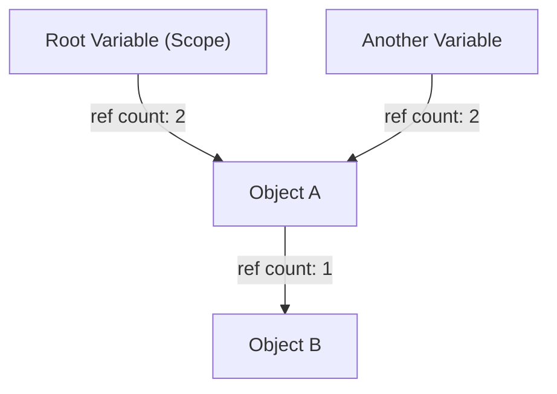
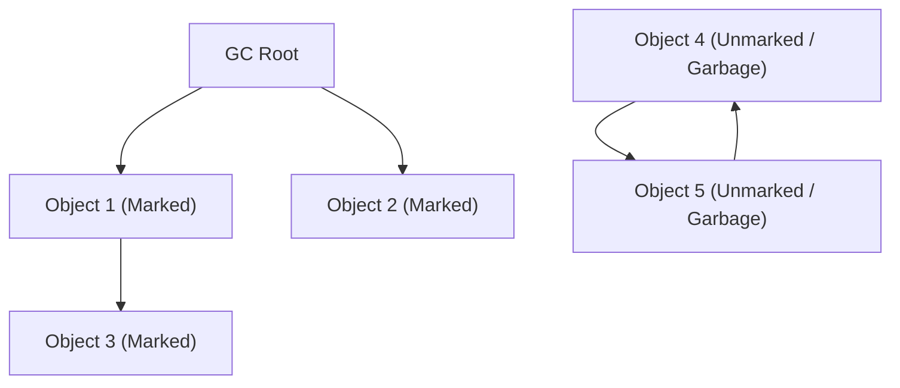
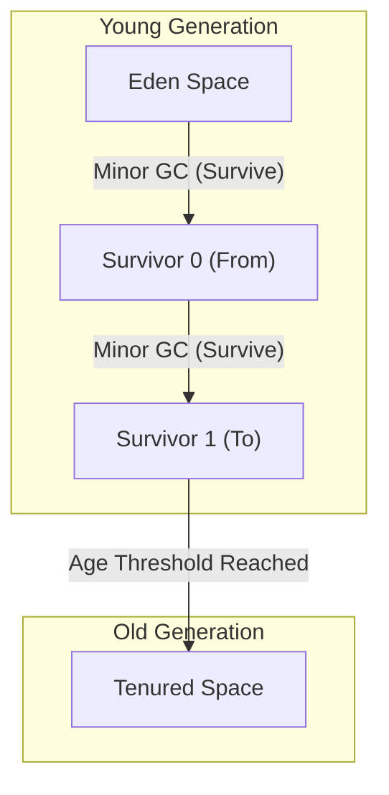

# Histoire de l'évolution du Garbage Collection (GC) : De la gestion manuelle à ZGC

Dans le développement logiciel moderne, la possibilité de programmer sans se soucier de la gestion de la mémoire est entièrement due à l'évolution de la technologie de "Garbage Collection" (GC). La plupart des langages de programmation largement utilisés aujourd'hui, tels que Java, C#, Python, JavaScript et Go, intègrent une forme ou une autre de ramasse-miettes.

Cependant, le chemin pour y parvenir n'a pas été de tout repos. L'histoire a commencé à une époque où les programmeurs contrôlaient entièrement l'allocation et la libération de la mémoire, et ont lutté contre de nombreux bugs survenus avec la complexification des programmes, tout en automatisant progressivement la gestion de la mémoire.

Dans cet article, nous allons retracer l'histoire de la gestion de la mémoire en informatique, et explorer en profondeur le processus d'évolution, depuis les limites de la gestion manuelle jusqu'au comptage de références, au Mark & Sweep, au GC générationnel, au G1GC, et enfin aux incroyables technologies modernes que sont ZGC et Shenandoah, du point de vue des algorithmes et de l'architecture.

---

## 1. L'ère du chaos : La gestion manuelle de la mémoire et ses limites

À l'époque où le Garbage Collection n'existait pas (et même aujourd'hui dans les domaines où des langages comme C, C++ et Rust excellent), la gestion de la mémoire relevait de la seule responsabilité du programmeur. Le processus consistait à allouer de la mémoire au système d'exploitation (OS) lorsque le programme en avait besoin, et à la restituer explicitement à l'OS lorsqu'elle n'était plus nécessaire.

### Le monde de `malloc` et `free`

En langage C, les fonctions de la famille `malloc` sont utilisées pour l'allocation dynamique de mémoire, et `free` pour la libération.

```c
#include <stdlib.h>
#include <stdio.h>

void process_data() {
    // Alloue de la mémoire sur le tas pour 100 entiers
    int* data = (int*)malloc(100 * sizeof(int));
    if (data == NULL) {
        // Gestion d'erreur en cas d'échec de l'allocation
        return;
    }

    // Traitement utilisant les données
    for (int i = 0; i < 100; i++) {
        data[i] = i * 2;
    }

    // Libération de la mémoire une fois le traitement terminé
    free(data);
}
```

Le plus grand avantage de cette approche réside dans sa "contrôlabilité" et ses "performances". Le programmeur savait exactement quand et où la mémoire était allouée et libérée, à la milliseconde près. Dans les premiers systèmes informatiques soumis à de fortes contraintes matérielles, ce contrôle absolu était essentiel.

### Les 3 péchés capitaux causés par la gestion manuelle

Cependant, à mesure que les logiciels ont grossi pour atteindre des dizaines de milliers, voire des millions de lignes de code, et que plusieurs threads se sont entremêlés de manière complexe, la gestion manuelle de la mémoire a dépassé les limites cognitives humaines. En conséquence, les bugs graves suivants sont devenus fréquents.

1. **Fuite de mémoire (Memory Leak)**
   C'est le problème de l'oubli de la libération de la mémoire allouée. Si une fuite de mémoire se produit dans une application serveur exécutée sur une longue période, la mémoire disponible diminue progressivement et, finalement, le processus est interrompu de force par l'OS (OOM : Out Of Memory).

2. **Pointeur sauvage (Dangling Pointer) et Use-After-Free**
   Il s'agit d'un bug où l'on continue d'utiliser un pointeur vers une zone mémoire bien que celle-ci ait été libérée avec `free`. Il est possible que d'autres données aient été nouvellement allouées à cette zone mémoire libérée, et y accéder ou y écrire détruira des données totalement indépendantes. Cela a été un terrain propice aux vulnérabilités de sécurité (comme l'exécution de code arbitraire).

3. **Double libération (Double Free)**
   C'est le problème de l'appel à `free` deux fois pour la même zone mémoire. Cela détruit la structure de données interne de l'allocateur de mémoire (comme la liste libre, Free List), provoquant des plantages ou des failles de sécurité fatales.

```c
// Exemple de Use-After-Free
int* ptr = malloc(sizeof(int));
*ptr = 42;
free(ptr);
// ... traitement complexe ...
*ptr = 100; // Danger ! Écriture dans une zone déjà libérée
```

Pour faire face à ces problèmes, des concepts tels que RAII (Resource Acquisition Is Initialization) et les pointeurs intelligents ont été introduits en C++, mais le Garbage Collection est né de l'idée : "Ne pourrions-nous pas retirer la gestion de la mémoire au programmeur et la confier au système ?"

---

## 2. Le premier pas vers l'automatisation : Le comptage de références (Reference Counting)

La première grande approche pour surmonter les limites de la gestion manuelle de la mémoire fut le "comptage de références". Il est encore largement utilisé aujourd'hui dans Python, PHP, Objective-C/Swift (ARC : Automatic Reference Counting), ou encore le `std::shared_ptr` du C++.

### Principe fondamental du comptage de références

Le mécanisme du comptage de références est très simple. Dans la zone d'en-tête de chaque objet, on maintient un compteur (compteur de références) indiquant "par combien de variables (pointeurs) cet objet est-il actuellement référencé ?".

- Lorsqu'un objet est nouvellement créé et assigné à une variable, le compteur est défini sur `1`.
- Lorsqu'une autre variable commence à référencer cet objet, le compteur fait `+1`.
- Lorsqu'une référence est perdue, par exemple lorsqu'une variable sort de sa portée, le compteur fait `-1`.
- Au moment où le compteur atteint `0`, il est certain que l'objet n'est "référencé de nulle part", et sa mémoire est donc immédiatement libérée.



### Avantages et inconvénients du comptage de références

**Avantages :**
1. **Libération déterministe :** La mémoire étant libérée au moment précis où le nombre de références tombe à zéro, le cycle de vie des ressources est facile à prévoir.
2. **Répartition du temps de pause (Pause Time) :** La charge de la libération de la mémoire étant répartie sur l'ensemble de l'exécution du programme, il est peu probable que des temps de pause gigantesques comme le "Stop-The-World (STW)" (décrit plus loin) se produisent.

**Inconvénients :**
1. **Surcoût de la mise à jour du compteur :** À chaque fois qu'une affectation de pointeur a lieu, des instructions d'incrémentation et de décrémentation doivent être exécutées. Dans un environnement multithread, cette mise à jour du compteur doit se faire par des opérations atomiques (comme des verrous), ce qui devient un goulot d'étranglement majeur pour les performances.
2. **Le défaut fatal des références circulaires (Circular Reference) :** C'est sa plus grande faiblesse. Si un objet A référence un objet B, et que l'objet B référence l'objet A, même si A et B deviennent inaccessibles de n'importe où dans le programme, puisqu'ils se référencent mutuellement, leurs compteurs ne tomberont jamais à `0`, ce qui entraîne une fuite de mémoire permanente.

Pour résoudre les références circulaires, les développeurs doivent utiliser explicitement des "références faibles (Weak Reference)", mais en fin de compte, cela signifie que "les développeurs doivent rester conscients des dépendances de la mémoire", ce qui ne peut être considéré comme une automatisation complète.

---

## 3. Le défi de l'éradication : Mark & Sweep et GC traçant (Tracing GC)

Le "Garbage Collection traçant (Tracing GC)" a fondamentalement résolu le problème des références circulaires et réalisé une véritable gestion automatique de la mémoire, et son algorithme représentatif est le "Mark & Sweep" (Marquer et Balayer).

Cet algorithme révolutionnaire, inventé par John McCarthy pour le langage LISP, constitue la base de presque tous les GC avancés modernes, tels que Java (JVM), Go, ou le moteur V8 (JavaScript).

### Le concept d'accessibilité (Reachability)

Contrairement au comptage de références, le Mark & Sweep ne suit pas "qui référence l'objet". Au lieu de cela, il décide du sort d'un objet en fonction de sa capacité à être "atteint en remontant depuis le point de départ du programme (la racine)".

Les points de départ, appelés **GC Roots**, incluent les éléments suivants :
- Les variables locales sur la pile d'appels (call stack) du thread actuellement en cours d'exécution
- Les variables globales, les variables statiques (static)
- Les registres du CPU

### Les 2 phases du Mark & Sweep

Comme son nom l'indique, l'algorithme se compose de deux phases.

1. **Phase de marquage (Mark Phase) :**
   En partant des GC Roots, il suit les pointeurs et place une marque "vivant (Live)" sur tous les objets accessibles. Dans de nombreux cas, cela est implémenté en activant 1 bit (le bit de marquage) dans l'en-tête de l'objet.

2. **Phase de balayage (Sweep Phase) :**
   Il parcourt (balaie) l'intégralité de la mémoire tas (heap) du début à la fin. Les objets qui ne sont pas marqués sont considérés comme des "déchets (Garbage) inaccessibles depuis le programme", et leurs zones mémoire sont récupérées et remises dans la liste libre (Free List). Les objets qui avaient été marqués voient leur marque effacée pour le prochain GC.


*(Dans le schéma ci-dessus, Obj4 et Obj5 ont une référence circulaire, mais comme ils ne sont pas accessibles depuis le GC Root, ils sont récupérés ensemble en tant que Garbage.)*

### Stop-The-World (STW) et fragmentation

Le Mark & Sweep semblait être une méthode parfaite pour résoudre les références circulaires, mais il avait un prix élevé.

Le premier coût est le **Stop-The-World (STW)**.
Pendant le processus de marquage, si les threads de l'application (appelés mutateurs) modifient les relations de référence des objets, il y a un risque de rater des objets vivants. C'est pourquoi, dans les premiers GC, il était nécessaire d'arrêter complètement tous les threads de l'application pendant le marquage et le balayage. Plus la taille du tas était grande, plus ce temps d'arrêt pouvait durer de quelques secondes à plusieurs dizaines de minutes, ce qui était fatal pour les systèmes nécessitant du temps réel.

Le second coût est la **fragmentation de la mémoire**.
Les espaces récupérés lors de la phase de balayage sont éparpillés sur l'ensemble du tas comme un fromage à trous. Bien que la capacité totale disponible soit suffisante, il est impossible d'allouer de grands blocs de mémoire contigus, ce qui entraîne une erreur OutOfMemoryError.

Pour résoudre ce problème, la technique "Mark & Compact" (Marquer et Compacter) est apparue. En déplaçant les objets vivants vers un côté de la zone mémoire (compactage), on crée un grand espace libre contigu. Cependant, comme l'emplacement de placement de l'objet (l'adresse mémoire) change, il est nécessaire de réécrire tous les pointeurs qui pointent vers cet objet, ce qui entraînait un STW encore plus long.

---

## 4. Naissance du GC générationnel et introduction de l'heuristique

Pour surmonter l'inefficacité du Mark & Sweep consistant à "scanner le tas entier à chaque fois", le "Garbage Collection Générationnel (Generational GC)" a été conçu. On peut dire qu'il s'agit de l'une des heuristiques (optimisation basée sur l'expérience) les plus réussies de l'informatique.

### L'hypothèse générationnelle faible (Weak Generational Hypothesis)

Des chercheurs de sociétés telles qu'IBM ont effectué un profilage de la mémoire de diverses applications et ont découvert une règle empirique puissante :

**"La plupart des objets nouvellement alloués deviennent très vite inutiles (ils sont éphémères)."**
**"Les objets anciens ont tendance à survivre plus longtemps par la suite."**

Par exemple, des chaînes de caractères temporairement créées dans une boucle ou des objets DTO stockant les valeurs de retour d'une méthode deviennent des déchets après quelques millisecondes. En revanche, les données de cache ou les pools de connexions survivront jusqu'à la fin de l'application.

### Partitionnement du tas : Young et Old

Sur la base de cette hypothèse, le GC générationnel divise logiquement la mémoire tas.

1. **La jeune génération (Young Generation) :**
   C'est l'endroit où les objets nouvellement créés sont placés en premier. L'espace Young est subdivisé en un "espace Eden" et deux "espaces Survivor (From/To)".
   Les objets sont d'abord alloués dans Eden. Lorsque Eden est plein, un **Minor GC** se produit.
   Le Minor GC exécute un marquage et une copie uniquement dans l'espace Young. Les objets survivants sont déplacés vers l'espace Survivor, et seuls les objets qui survivent à plusieurs Minor GC (qui vieillissent) sont promus (Promotion) vers l'espace Old en tant qu'"objets à longue durée de vie".
   Comme la plupart des objets sont éphémères, très peu d'objets survivent dans l'espace Young, la copie est extrêmement rapide, et le temps de STW est maintenu très court.

2. **L'ancienne génération (Old Generation / Tenured) :**
   C'est la zone où sont placés les objets ayant survécu longtemps. Lorsque l'espace Old est plein, un **Major GC (Full GC)**, qui cible l'ensemble du tas, se produit.
   Le Full GC prend du temps, mais comme les objets éphémères ont déjà été éliminés par les Minor GC de l'espace Young, la fréquence d'apparition du Full GC lui-même peut être considérablement réduite.



### Optimisation par la table de cartes (Card Table)

Pour réaliser le GC générationnel, il y avait un autre défi technique. "Si un objet de l'espace Old référence un objet de l'espace Young, comment exécuter en toute sécurité un GC uniquement sur l'espace Young (Minor GC) ?" Si l'on ne faisait que suivre depuis les GC Roots, il faudrait scanner l'ensemble de l'espace Old.

Pour résoudre ce problème, une structure de données appelée "table de cartes (Card Table)" a été introduite. Elle divise l'espace Old en petites pages (cartes). Lorsqu'une écriture de référence de Old vers Young se produit, un code spécial appelé barrière d'écriture (Write Barrier) est inséré pour marquer la carte correspondante comme "Dirty (sale)". Lors d'un Minor GC, il suffit de scanner uniquement ces cartes Dirty en plus des GC Roots, ce qui élimine complètement le coût de balayage de l'ensemble de l'espace Old.

Avec l'apparition des GC générationnels (comme le CMS : Concurrent Mark Sweep), Java allait acquérir une part de marché écrasante dans le domaine des entreprises.

---

## 5. Prise en charge des tas de grande capacité : L'essor du G1GC (Garbage-First GC)

À mesure que les prix de la mémoire ont chuté et que la mémoire installée sur les serveurs est passée de quelques gigaoctets à des dizaines ou des centaines de gigaoctets, l'architecture traditionnelle du GC générationnel a été confrontée à un nouveau mur.
Lorsqu'un Full GC se produit sur un tas de plusieurs dizaines de gigaoctets, même avec un GC concurrent (parallèle) comme le CMS, un STW de plusieurs secondes se produit lors de la résolution de la fragmentation (le compactage).

Pour résoudre ce problème, **G1GC (Garbage-First GC)** a été adopté comme GC par défaut à partir de Java 9.

### Architecture basée sur les régions (Region)

La plus grande caractéristique de G1GC est qu'il a abandonné la division physique de l'immense mémoire continue en espaces "Young" et "Old".
Au lieu de cela, l'ensemble du tas est divisé en milliers de petites zones appelées "Régions (Regions)", de la même taille (généralement 1 Mo à 32 Mo), comme les cases d'un échiquier.

Chaque région assume dynamiquement l'un des rôles : Eden, Survivor ou Old.

### Signification de "Garbage-First" et modèle de prédiction

Le nom "Garbage-First" de G1GC (les déchets d'abord) vient de sa stratégie de collecte.
Grâce au marquage concurrent (le processus de marquage s'exécute en parallèle avec l'application), G1GC calcule en permanence "la quantité d'objets inutilisés (déchets) contenus dans chaque région (si le nombre d'objets vivants est faible)".

Lors du GC, G1GC ne compacte pas tout le tas en une seule fois, mais **"récupère en priorité les régions contenant le plus de déchets, où la récupération est la plus efficace (peu d'objets vivants)"**.

De plus, G1GC a une caractéristique de temps réel souple qui tente de respecter un "temps de pause cible" défini par l'utilisateur (par exemple, 200 millisecondes). Sur la base des données statistiques des GC passés, il utilise des heuristiques pour calculer "combien de régions peuvent être récupérées (copiées) cette fois-ci en moins de 200 millisecondes", et détermine dynamiquement le nombre de régions à récupérer (CSet : Collection Set).

Cela a permis de fonctionner avec des STW prévisibles et courts, même pour des tailles de tas de plusieurs dizaines de gigaoctets.

---

## 6. L'aboutissement des GC modernes : ZGC et Shenandoah ouvrent la voie vers le monde des millisecondes

Bien que l'introduction du G1GC ait considérablement amélioré les problèmes liés aux grands tas, le problème fondamental selon lequel "si la taille du tas augmente, le temps STW finira par s'allonger proportionnellement" (en particulier la mise à jour des pointeurs lors du déplacement d'objets ou du compactage) n'était pas complètement résolu.

Pour répondre aux exigences strictes de "pas plus de quelques millisecondes d'arrêt quelles que soient les circonstances", comme c'est le cas dans les systèmes financiers, le trading à haute fréquence (HFT) ou les grands serveurs de jeux multijoueurs en temps réel, les architectures de GC ultimes sont nées. Elles maintiennent le STW à moins d'une milliseconde (sub-milliseconde) même pour des tas de plusieurs téraoctets (To). Il s'agit de **ZGC (Z Garbage Collector)** et **Shenandoah GC**.

### La magie de la relocalisation concurrente (Concurrent Relocation)

La principale cause des STW dans les GC traditionnels était le "déplacement d'objets (compactage)". Après avoir copié un objet vers une nouvelle zone mémoire, il fallait arrêter l'application pendant la réécriture des millions de pointeurs qui pointaient vers cet objet. Si l'application ne s'arrêtait pas et accédait à l'ancienne adresse mémoire, les données seraient corrompues.

ZGC et Shenandoah ont accompli l'exploit magique d'effectuer **même ce "déplacement d'objets et mise à jour de pointeurs" de manière concurrente (parallèle) sans arrêter les threads de l'application**.

### La technologie de base de ZGC : Pointers colorés (Colored Pointers) et Barrières de lecture (Load Barriers)

ZGC, développé principalement par Oracle, utilise une technologie révolutionnaire appelée **pointeurs colorés (Colored Pointers)**, qui exploite au maximum les caractéristiques des architectures 64 bits.

Sur l'espace de 64 bits d'un pointeur, seuls les 44 bits de poids faible (environ 16 To) sont réellement utilisés comme adresse mémoire. ZGC utilise une partie des bits de poids fort restants comme "métadonnées (couleur)".
Ces bits de couleur enregistrent des états tels que "Ce pointeur est-il déjà marqué ?" ou "L'objet pointé par ce pointeur est-il en cours de déplacement (Relocated) ?".

```
[ Unused ] [ Marked0 ] [ Marked1 ] [ Remapped ] [ Finalizable ] [   Object Address (44 bits)   ]
   ...          1           0           0              0        1010101010101010...
```

De plus, ZGC insère dynamiquement une infime instruction assembleur, appelée **barrière de lecture (Load Barrier)**, à chaque endroit où l'application lit (charge) une référence vers un objet.

**Fonctionnement de la barrière de lecture :**
1. Le thread de l'application lit un pointeur.
2. Il vérifie la "couleur (métadonnées)" du pointeur.
3. Si l'objet est "en cours de déplacement par le GC vers un autre endroit (ou déjà déplacé, mais ce pointeur pointe toujours vers l'ancienne adresse)", la barrière de lecture intervient.
4. Elle consulte la "table de transfert (Forwarding Table)" gérée par ZGC et obtient la nouvelle adresse correcte.
5. Le pointeur lui-même est réécrit avec la nouvelle adresse (auto-réparation / Self-Healing), et l'objet à la nouvelle adresse est renvoyé à l'application.

Grâce à ce mécanisme d'auto-réparation, même pendant que les threads du GC s'activent en arrière-plan pour déplacer des objets, les threads de l'application peuvent toujours accéder en toute sécurité à l'"objet correct le plus récent". Les STW sont limités à des phases extrêmement spécifiques telles que le "balayage des GC Roots" (généralement moins de 1 milliseconde), et le temps de pause reste le même que la taille du tas soit de 10 Mo ou de 16 To.

### La technologie de base de Shenandoah : Pointeur Brooks (Brooks Pointers)

Shenandoah GC, développé principalement par Red Hat, réalise également une relocalisation concurrente, mais avec une approche différente.

Shenandoah place un pointeur de transfert, appelé **pointeur Brooks (Brooks Pointer)**, devant la zone d'en-tête de tous les objets.
En temps normal, ce pointeur pointe vers "lui-même". Cependant, lorsque le GC commence à copier un objet vers une nouvelle zone, le pointeur Brooks de l'ancien objet est modifié atomiquement pour pointer vers "l'adresse du nouvel objet".

Lorsque l'application lit ou écrit un objet, elle passe toujours par ce pointeur Brooks (barrière de lecture / barrière d'écriture). Ainsi, même si l'objet est en cours de déplacement, l'accès est redirigé de manière transparente vers le nouvel objet.

---

## Conclusion : L'avenir de la gestion de la mémoire

Depuis l'ère du chaos avec `malloc/free` en langage C, la naissance du Mark & Sweep avec LISP, les GC générationnels qui ont soutenu les entreprises, G1GC pour maîtriser les tas géants, jusqu'aux ZGC et Shenandoah offrant une latence extrêmement faible.

L'histoire du Garbage Collection est elle-même l'histoire des défis de l'humanité pour "savoir comment lutter contre la complexité des logiciels".
Aujourd'hui, grâce à la fusion des évolutions matérielles (prédiction de branchement du CPU et optimisation des lignes de cache) et des algorithmes logiciels, le "GC entièrement concurrent qui ne s'arrête jamais", autrefois considéré comme impossible, est devenu une réalité.

D'autres approches telles que la gestion statique de la mémoire par un "modèle de propriété à la compilation" (comme en Rust) gagnent également en importance. Cependant, pour les applications à grande échelle traitant des graphes d'objets dynamiques et complexes, le Garbage Collection continuera d'être une infrastructure indispensable.
Pourquoi ne pas prendre de temps en temps un moment pour penser aux algorithmes GC, qui gèrent silencieusement mais avec une incroyable virtuosité la mémoire en arrière-plan ?

---
*Reference: The Garbage Collection Handbook, OpenJDK Wiki, various JEPs (JEP 333, JEP 189)*
