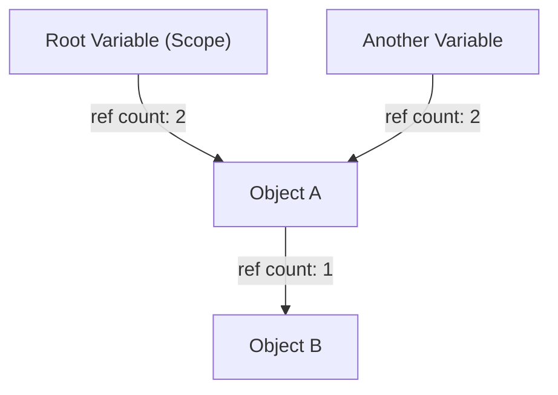
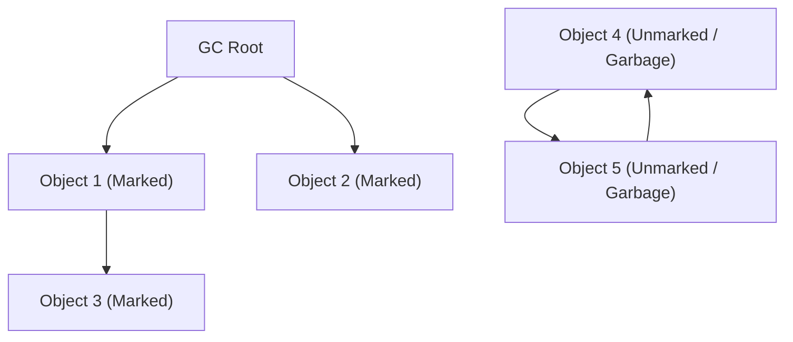
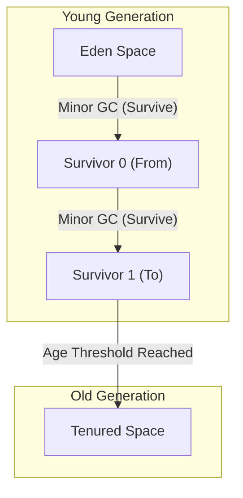

# गार्बेज कलेक्शन (GC) का विकास इतिहास: मैनुअल प्रबंधन से ZGC तक का सफर

आधुनिक सॉफ्टवेयर विकास में, मेमोरी प्रबंधन की चिंता किए बिना प्रोग्रामिंग करने में सक्षम होना पूरी तरह से "गार्बेज कलेक्शन (Garbage Collection, GC)" तकनीक के विकास के कारण है। Java, C#, Python, JavaScript, और Go जैसी आज व्यापक रूप से उपयोग की जाने वाली कई प्रोग्रामिंग भाषाएं, किसी न किसी रूप में गार्बेज कलेक्शन को अपने अंदर समाहित करती हैं।

हालाँकि, यहाँ तक पहुँचने का सफर बिल्कुल भी आसान नहीं था। इसकी शुरुआत उस दौर से हुई जब प्रोग्रामर स्वयं मेमोरी के आवंटन (allocation) और मुक्त (deallocation) करने को पूरी तरह नियंत्रित करते थे, और प्रोग्राम की जटिलता बढ़ने के साथ उत्पन्न होने वाले कई बग्स से लड़ते हुए, धीरे-धीरे मेमोरी प्रबंधन को स्वचालित करने का इतिहास रहा है।

इस लेख में, हम कंप्यूटर विज्ञान में मेमोरी प्रबंधन के इतिहास को उजागर करेंगे, और मैनुअल मेमोरी प्रबंधन की सीमाओं से लेकर, रेफरेंस काउंटिंग, मार्क और स्वीप, जनरेशनल GC, G1GC, और आधुनिक ZGC तथा Shenandoah जैसी अद्भुत तकनीकों तक की विकास प्रक्रिया को, एल्गोरिदम और आर्किटेक्चर के दृष्टिकोण से गहराई से समझेंगे।

---

## 1. अराजकता का युग: मैनुअल मेमोरी प्रबंधन और इसकी सीमाएं

उस युग में जब गार्बेज कलेक्शन मौजूद नहीं था (और आज भी उन क्षेत्रों में जहाँ C, C++, और Rust जैसी भाषाएँ सक्रिय हैं), मेमोरी प्रबंधन पूरी तरह से प्रोग्रामर की जिम्मेदारी थी। यह एक ऐसी प्रक्रिया है जहाँ प्रोग्राम को आवश्यकता होने पर OS से मेमोरी आवंटित की जाती है, और जब इसकी आवश्यकता नहीं होती है तो इसे स्पष्ट रूप से OS को वापस कर दिया जाता है।

### `malloc` और `free` की दुनिया

C भाषा में, डायनामिक मेमोरी आवंटन के लिए `malloc` परिवार के फ़ंक्शन का उपयोग किया जाता है, और इसे मुक्त करने के लिए `free` का उपयोग किया जाता है।

```c
#include <stdlib.h>
#include <stdio.h>

void process_data() {
    // हीप पर 100 पूर्णांकों के लिए मेमोरी आवंटित करें
    int* data = (int*)malloc(100 * sizeof(int));
    if (data == NULL) {
        // मेमोरी आवंटन विफल होने पर त्रुटि प्रबंधन
        return;
    }

    // डेटा का उपयोग करने की प्रक्रिया
    for (int i = 0; i < 100; i++) {
        data[i] = i * 2;
    }

    // प्रक्रिया पूरी होने पर मेमोरी मुक्त करें
    free(data);
}
```

इस दृष्टिकोण का सबसे बड़ा लाभ "नियंत्रण (Control)" और "प्रदर्शन (Performance)" है। प्रोग्रामर सटीक रूप से, मिलीसेकंड के स्तर पर जान सकता था कि मेमोरी कब और कहाँ आवंटित की गई है, और इसे कब मुक्त किया जाएगा। शुरुआती कंप्यूटर सिस्टम में, जहाँ हार्डवेयर की सीमाएं सख्त थीं, यह पूर्ण नियंत्रण आवश्यक था।

### मैनुअल प्रबंधन के कारण होने वाले 3 बड़े पाप

हालाँकि, जैसे-जैसे सॉफ्टवेयर का पैमाना दसियों हज़ारों या लाखों लाइनों तक बढ़ा, और कई थ्रेड्स जटिल रूप से आपस में उलझ गए, मैनुअल मेमोरी प्रबंधन मानवीय संज्ञानात्मक सीमाओं को पार कर गया। परिणामस्वरूप, निम्नलिखित जैसे गंभीर बग अक्सर उत्पन्न होने लगे।

1. **मेमोरी लीक (Memory Leak)**
   यह आवंटित मेमोरी को मुक्त करना भूल जाने की समस्या है। लंबे समय तक चलने वाले सर्वर अनुप्रयोगों में यदि मेमोरी लीक होता है, तो उपलब्ध मेमोरी धीरे-धीरे कम हो जाती है, और अंततः OS द्वारा प्रक्रिया को जबरन समाप्त कर दिया जाता है (OOM: Out Of Memory)।

2. **डैंगलिंग पॉइंटर और Use-After-Free**
   यह एक बग है जहाँ मेमोरी को `free` के साथ मुक्त करने के बावजूद उस मेमोरी क्षेत्र को इंगित करने वाले पॉइंटर का उपयोग जारी रखा जाता है। मुक्त किए गए मेमोरी क्षेत्र में कोई नया डेटा आवंटित किया जा सकता है, और यदि आप इसे एक्सेस करते हैं या इस पर लिखते हैं, तो आप पूरी तरह से असंबद्ध डेटा को नष्ट कर देंगे। यह सुरक्षा कमजोरियों (जैसे कि आर्बिट्रेरी कोड एक्ज़ीक्यूशन) का एक प्रमुख कारण बन गया।

3. **डबल फ्री (Double Free)**
   यह एक ही मेमोरी क्षेत्र के लिए दो बार `free` को कॉल करने की समस्या है। यह मेमोरी एलोकेटर के आंतरिक डेटा स्ट्रक्चर (जैसे कि फ्री लिस्ट) को नष्ट कर देता है, और क्रैश या गंभीर सुरक्षा खामियों का कारण बनता है।

```c
// Use-After-Free का उदाहरण
int* ptr = malloc(sizeof(int));
*ptr = 42;
free(ptr);
// ... जटिल प्रक्रिया ...
*ptr = 100; // खतरा! पहले से ही मुक्त किए गए क्षेत्र में लिखना
```

इन समस्याओं से निपटने के लिए, C++ में RAII (Resource Acquisition Is Initialization) और स्मार्ट पॉइंटर जैसी अवधारणाएँ पेश की गईं, लेकिन गार्बेज कलेक्शन का जन्म इसी विचार से हुआ था, "क्या हम मेमोरी प्रबंधन को प्रोग्रामर से लेकर सिस्टम को नहीं सौंप सकते?"

---

## 2. स्वचालन की ओर पहला कदम: रेफरेंस काउंटिंग (Reference Counting)

मैनुअल मेमोरी प्रबंधन की सीमाओं को पार करने का पहला प्रमुख दृष्टिकोण "रेफरेंस काउंटिंग" है। यह आज भी Python, PHP, Objective-C/Swift (ARC: Automatic Reference Counting), और C++ के `std::shared_ptr` आदि में व्यापक रूप से उपयोग किया जाता है।

### रेफरेंस काउंटिंग का मूल सिद्धांत

रेफरेंस काउंटिंग का तंत्र बहुत सरल है। प्रत्येक ऑब्जेक्ट के हेडर क्षेत्र में एक काउंटर (रेफरेंस काउंट) होता है जो यह दर्शाता है कि "वर्तमान में, कितने चर (पॉइंटर) इसे संदर्भित कर रहे हैं"।

- जब कोई नया ऑब्जेक्ट बनाया जाता है और किसी चर को सौंपा जाता है, तो काउंट `1` हो जाता है।
- जब कोई दूसरा चर उस ऑब्जेक्ट को संदर्भित करना शुरू करता है, तो काउंट `+1` हो जाता है।
- जब कोई चर स्कोप से बाहर हो जाता है या संदर्भ हटा दिया जाता है, तो काउंट `-1` हो जाता है।
- जिस क्षण काउंट `0` हो जाता है, यह निश्चित हो जाता है कि ऑब्जेक्ट "कहीं से भी संदर्भित नहीं है", इसलिए मेमोरी तुरंत मुक्त कर दी जाती है।



### रेफरेंस काउंटिंग के फायदे और नुकसान

**फायदे:**
1. **निर्णायक मुक्ति (Deterministic deallocation):** जैसे ही संदर्भ शून्य हो जाता है, मेमोरी मुक्त हो जाती है, इसलिए संसाधन के जीवनचक्र की भविष्यवाणी करना आसान होता है।
2. **पॉज़ टाइम (Pause Time) का वितरण:** चूंकि मेमोरी मुक्त करने का भार पूरे प्रोग्राम के निष्पादन में वितरित होता है, इसलिए बाद में वर्णित "Stop-The-World (STW)" जैसा कोई बड़ा पॉज़ टाइम उत्पन्न नहीं होता है।

**नुकसान:**
1. **काउंटर अपडेट का ओवरहेड:** हर बार पॉइंटर असाइनमेंट होने पर इंक्रीमेंट और डिक्रीमेंट निर्देशों को निष्पादित करने की आवश्यकता होती है। मल्टी-थ्रेडेड वातावरण में, इस काउंटर अपडेट को एटॉमिक ऑपरेशंस (जैसे कि लॉक) के साथ किया जाना चाहिए, जो प्रदर्शन में एक बड़ी बाधा बन जाता है।
2. **सर्कुलर रेफरेंस (Circular Reference) की घातक खामी:** यह इसकी सबसे बड़ी कमजोरी है। यदि ऑब्जेक्ट A, ऑब्जेक्ट B को संदर्भित करता है, और ऑब्जेक्ट B, ऑब्जेक्ट A को संदर्भित करता है, तो भले ही प्रोग्राम में कहीं से भी A और B को एक्सेस न किया जा सके, वे एक दूसरे को संदर्भित करना जारी रखते हैं इसलिए काउंट कभी `0` नहीं होता है, और यह स्थायी मेमोरी लीक बन जाता है।

सर्कुलर रेफरेंस को हल करने के लिए, डेवलपर्स को स्पष्ट रूप से "वीक रेफरेंस (Weak Reference)" का उपयोग करना पड़ता है, लेकिन यह अंततः पूर्ण स्वचालन नहीं था क्योंकि "डेवलपर को अभी भी मेमोरी निर्भरता के प्रति सचेत रहना पड़ता है"।

---

## 3. उन्मूलन की चुनौती: मार्क एंड स्वीप (Mark and Sweep) और ट्रेसिंग GC

"ट्रेसिंग गार्बेज कलेक्शन" ने सर्कुलर रेफरेंस की समस्या को मौलिक रूप से हल किया और सच्चे स्वचालित मेमोरी प्रबंधन को साकार किया, और इसका सबसे प्रतिनिधि एल्गोरिदम "मार्क एंड स्वीप" है।

LISP भाषा के लिए जॉन मैकार्थी द्वारा आविष्कार किया गया यह अभूतपूर्व एल्गोरिदम आज लगभग सभी उन्नत GC का आधार है, जिसमें आधुनिक Java (JVM), Go, और V8 इंजन (JavaScript) शामिल हैं।

### रीचेबिलिटी (Reachability) की अवधारणा

मार्क एंड स्वीप रेफरेंस काउंटिंग की तरह यह ट्रैक नहीं करता है कि "कौन किसे संदर्भित कर रहा है"। इसके बजाय, यह "प्रोग्राम के शुरुआती बिंदु (रूट) से ट्रेस करके क्या इस तक पहुंचा जा सकता है (Reachability)" के आधार पर जीवन और मृत्यु का निर्णय लेता है।

**GC रूट्स (GC Roots)** नामक शुरुआती बिंदुओं में निम्नलिखित शामिल हैं:
- वर्तमान में निष्पादित हो रहे थ्रेड के कॉल स्टैक पर लोकल वेरिएबल
- ग्लोबल वेरिएबल, स्टैटिक (static) वेरिएबल
- CPU रजिस्टर

### मार्क एंड स्वीप के 2 चरण

जैसा कि नाम से पता चलता है, एल्गोरिदम में 2 चरण होते हैं।

1. **मार्क फेज़ (Mark Phase):**
   GC रूट से शुरू होकर, यह पॉइंटर्स को फॉलो करता है और उन सभी ऑब्जेक्ट्स को "जीवित (Live)" के रूप में चिह्नित (मार्क) करता है जिन तक पहुंचा जा सकता है। अक्सर, यह ऑब्जेक्ट हेडर में 1 बिट (मार्क बिट) सेट करके लागू किया जाता है।

2. **स्वीप फेज़ (Sweep Phase):**
   यह शुरू से अंत तक पूरी हीप मेमोरी को स्कैन (स्वीप) करता है। जो ऑब्जेक्ट चिह्नित नहीं होते हैं उन्हें "अब प्रोग्राम से पहुंच से बाहर कचरा (Garbage)" माना जाता है, और उनके मेमोरी क्षेत्र को पुनः प्राप्त करके फ्री लिस्ट में वापस कर दिया जाता है। चिह्नित ऑब्जेक्ट्स के लिए, अगले GC के लिए उनके मार्क को साफ़ कर दिया जाता है।


*(उपरोक्त चित्र में Obj4 और Obj5 के बीच सर्कुलर रेफरेंस है, लेकिन चूंकि GC Root से उन तक नहीं पहुंचा जा सकता है, इसलिए उन्हें एक साथ Garbage के रूप में पुनः प्राप्त किया जाएगा।)*

### Stop-The-World (STW) और फ्रैग्मेंटेशन

मार्क एंड स्वीप सर्कुलर रेफरेंस को हल करने का एक सही तरीका लग रहा था, लेकिन इसकी एक बड़ी कीमत चुकानी पड़ी।

पहली कीमत **Stop-The-World (STW)** है।
यदि मार्क प्रक्रिया के दौरान एप्लिकेशन के थ्रेड्स (जिन्हें म्यूटेटर्स कहा जाता है) ऑब्जेक्ट के संदर्भ संबंधों को बदलते हैं, तो जीवित ऑब्जेक्ट्स के छूट जाने का जोखिम होता है। इसलिए, शुरुआती GC में, मार्क और स्वीप के बीच एप्लिकेशन के सभी थ्रेड्स को पूरी तरह से रोकना आवश्यक था। हीप का आकार जितना बड़ा होता है, यह रुकने का समय उतना ही लंबा (कुछ सेकंड से लेकर दसियों मिनट तक) हो जाता है, जो रीयल-टाइम प्रदर्शन की आवश्यकता वाले सिस्टम के लिए घातक था।

दूसरी कीमत **मेमोरी फ्रैग्मेंटेशन (Memory Fragmentation)** है।
स्वीप चरण के दौरान कचरा एकत्र होने के बाद बची हुई जगह स्विस चीज़ की तरह पूरी हीप में बिखरी रहती है। भले ही कुल खाली स्थान पर्याप्त हो, एक सतत बड़ा मेमोरी ब्लॉक आवंटित नहीं किया जा सकता है, जिसके परिणामस्वरूप OutOfMemoryError समस्या उत्पन्न होती है।

इसे हल करने के लिए, "मार्क एंड कॉम्पैक्ट (Mark and Compact)" नामक तकनीक सामने आई। यह जीवित ऑब्जेक्ट्स को मेमोरी क्षेत्र के एक तरफ (कॉम्पैक्शन) धकेल कर एक बड़ा, सतत खाली स्थान बनाता है। हालाँकि, चूंकि ऑब्जेक्ट का स्थान (मेमोरी एड्रेस) बदल जाता है, इसलिए उन ऑब्जेक्ट्स को इंगित करने वाले सभी पॉइंटर्स को फिर से लिखना आवश्यक हो गया, जिससे और भी लंबा STW उत्पन्न हुआ।

---

## 4. जनरेशनल GC का जन्म और ह्यूरिस्टिक्स का परिचय

मार्क एंड स्वीप के "हर बार पूरी हीप को स्कैन करने" की अकुशलता को दूर करने के लिए, "जनरेशनल गार्बेज कलेक्शन (Generational GC)" का आविष्कार किया गया था। इसे कंप्यूटर विज्ञान में सबसे सफल ह्यूरिस्टिक्स (अनुभवजन्य अनुकूलन) में से एक कहा जा सकता है।

### वीक जनरेशनल हाइपोथिसिस (Weak Generational Hypothesis)

IBM जैसे शोधकर्ताओं ने विभिन्न अनुप्रयोगों की मेमोरी प्रोफाइलिंग की और एक शक्तिशाली नियम की खोज की।

**"नए आवंटित ऑब्जेक्ट्स में से अधिकांश जल्दी ही अनावश्यक हो जाते हैं (अल्पकालिक होते हैं)।"**
**"पुराने ऑब्जेक्ट्स लंबे समय तक जीवित रहने की प्रवृत्ति रखते हैं।"**

उदाहरण के लिए, लूप के भीतर अस्थायी रूप से बनाए गए स्ट्रिंग्स, या किसी मेथड के रिटर्न मान को स्टोर करने वाले DTO ऑब्जेक्ट्स, कुछ मिलीसेकंड के बाद कचरा बन जाते हैं। दूसरी ओर, कैश डेटा और कनेक्शन पूल जैसे ऑब्जेक्ट्स एप्लिकेशन समाप्त होने तक जीवित रहते हैं।

### हीप का विभाजन: Young और Old

इस परिकल्पना के आधार पर, जनरेशनल GC तार्किक रूप से हीप मेमोरी को विभाजित करता है।

1. **युवा पीढ़ी (Young Generation):**
   यह वह जगह है जहाँ नए बनाए गए ऑब्जेक्ट्स शुरू में रखे जाते हैं। Young क्षेत्र को आगे "Eden स्पेस" और 2 "Survivor स्पेस (From/To)" में विभाजित किया गया है।
   ऑब्जेक्ट्स को पहले Eden में आवंटित किया जाता है। जब Eden भर जाता है, तो **Minor GC** होता है।
   Minor GC के दौरान, केवल Young क्षेत्र के भीतर ही मार्क और कॉपी किया जाता है। जीवित बचे ऑब्जेक्ट्स को Survivor स्पेस में ले जाया जाता है, और जो ऑब्जेक्ट कई Minor GC से बचे रहते हैं (जिनकी उम्र बढ़ गई है), उन्हें "लंबे समय तक रहने वाले ऑब्जेक्ट्स" के रूप में Old क्षेत्र में पदोन्नत (Promotion) किया जाता है।
   चूंकि अधिकांश ऑब्जेक्ट्स अल्पकालिक होते हैं, Young क्षेत्र में बहुत कम जीवित ऑब्जेक्ट्स बचते हैं, इसलिए कॉपी बहुत तेज़ी से पूरी हो जाती है, और STW समय को बेहद कम रखा जा सकता है।

2. **पुरानी पीढ़ी (Old Generation / Tenured):**
   यह वह क्षेत्र है जहाँ लंबे समय तक जीवित रहने वाले ऑब्जेक्ट्स रखे जाते हैं। जब Old क्षेत्र भर जाता है, तो पूरी हीप को लक्षित करते हुए **Major GC (Full GC)** होता है।
   Full GC में समय लगता है, लेकिन चूंकि अल्पकालिक ऑब्जेक्ट्स पहले से ही Young क्षेत्र के Minor GC द्वारा हटा दिए गए हैं, इसलिए Full GC होने की आवृत्ति को नाटकीय रूप से कम किया जा सकता है।



### कार्ड टेबल (Card Table) द्वारा अनुकूलन

जनरेशनल GC को लागू करने के लिए एक और तकनीकी चुनौती थी: "यदि Old क्षेत्र का कोई ऑब्जेक्ट Young क्षेत्र के किसी ऑब्जेक्ट को संदर्भित करता है, तो हम सुरक्षित रूप से केवल Young क्षेत्र के GC (Minor GC) को कैसे निष्पादित कर सकते हैं?" यदि हम केवल GC रूट से ट्रेस करते हैं, तो हमें पूरे Old क्षेत्र को स्कैन करना होगा।

इसे हल करने के लिए, "कार्ड टेबल" नामक एक डेटा स्ट्रक्चर पेश किया गया था। Old क्षेत्र को छोटे पृष्ठों (कार्ड) में विभाजित किया गया है, और जब Old से Young में संदर्भ का लेखन होता है, तो एक विशेष कोड डाला जाता है जिसे राइट बैरियर (Write Barrier) कहा जाता है, ताकि उस कार्ड को "Dirty" के रूप में चिह्नित किया जा सके। Minor GC के दौरान, GC रूट्स के अलावा केवल इन डर्टी कार्ड्स को स्कैन करने की आवश्यकता होती है, जिससे पूरे Old क्षेत्र को स्कैन करने की लागत पूरी तरह से समाप्त हो जाती है।

जनरेशनल GC (जैसे CMS: Concurrent Mark Sweep) के आगमन के साथ, Java ने एंटरप्राइज़ क्षेत्र में जबरदस्त हिस्सेदारी हासिल की।

---

## 5. बड़े हीप का समाधान: G1GC (Garbage-First GC) का उदय

जैसे-जैसे मेमोरी की कीमतें गिरीं और सर्वर मेमोरी कुछ GB से बढ़कर दसियों या सैकड़ों GB तक पहुँच गई, पारंपरिक जनरेशनल GC आर्किटेक्चर को एक नई बाधा का सामना करना पड़ा।
दशकों GB के हीप पर जब Full GC होता है, तो भले ही आप CMS जैसे कॉन्करेंट (concurrent) GC का उपयोग करें, फ्रैग्मेंटेशन को हल करने (कॉम्पैक्शन) के दौरान कई सेकंड का STW उत्पन्न होता है।

इसे हल करने के लिए, Java 9 के बाद से डिफ़ॉल्ट GC के रूप में **G1GC (Garbage-First GC)** को अपनाया गयाContext: G1GC (Garbage-First GC)** को अपनाया गया है।

### रीजन (Region) आधारित आर्किटेक्चर

G1GC की सबसे बड़ी विशेषता यह है कि इसने "Young क्षेत्र" और "Old क्षेत्र" नामक विशाल सतत मेमोरी के पारंपरिक भौतिक विभाजन को छोड़ दिया।
इसके बजाय, इसने पूरी हीप को शतरंज के बोर्ड के वर्गों की तरह "रीजन (Region)" नामक हजारों छोटे क्षेत्रों (आमतौर पर 1MB से 32MB तक समान आकार) में विभाजित कर दिया।

प्रत्येक रीजन गतिशील रूप से Eden, Survivor, या Old की भूमिका निभाता है।

### "Garbage-First" का अर्थ और प्रेडिक्टिव मॉडल

G1GC का नाम "Garbage-First" (कचरा पहले) इसकी रिकवरी रणनीति से आता है।
G1GC कॉन्करेंट मार्किंग (एप्लिकेशन के निष्पादन के साथ-साथ मार्क प्रक्रिया करना) के माध्यम से हमेशा यह गणना करता है कि "प्रत्येक रीजन में कितना कचरा ऑब्जेक्ट है (जीवित ऑब्जेक्ट कितने कम हैं)"।

GC के दौरान, G1GC पूरे हीप को एक बार में कॉम्पैक्ट करने के बजाय, **"उन रीजनों को प्राथमिकता से पुनः प्राप्त करता है जिनमें सबसे अधिक कचरा होता है और जो रिकवरी के लिए सबसे कुशल होते हैं (जीवित ऑब्जेक्ट कम होते हैं)"**।

इसके अलावा, G1GC में सॉफ्ट-रीयल-टाइम क्षमता होती है जो उपयोगकर्ता द्वारा निर्दिष्ट "लक्षित ठहराव समय (जैसे: 200 मिलीसेकंड)" का पालन करने का प्रयास करती है। पिछले GC के सांख्यिकीय डेटा के आधार पर, यह ह्यूरिस्टिक रूप से गणना करता है कि "200 मिलीसेकंड के भीतर, इस बार कितने रीजनों को पुनः प्राप्त (कॉपी) किया जा सकता है," और गतिशील रूप से पुनः प्राप्त किए जाने वाले रीजनों (CSet: Collection Set) की संख्या निर्धारित करता है।

इसके कारण, दसियों GB के हीप आकार के साथ भी, पूर्वानुमानित छोटे STW के साथ काम करना संभव हो गया है।

---

## 6. आधुनिक GC का चरम: ZGC और Shenandoah मिलीसेकंड की दुनिया खोलते हैं

हालाँकि G1GC के आगमन से विशाल हीप की समस्या में काफी सुधार हुआ, लेकिन मूलभूत समस्या कि "यदि हीप का आकार बढ़ता है, तो STW का समय अंततः आनुपातिक रूप से बढ़ जाएगा" (विशेषकर ऑब्जेक्ट रिलोकेशन और कॉम्पैक्शन के दौरान पॉइंटर अपडेट) पूरी तरह से हल नहीं हुई थी।

वित्तीय प्रणालियों, हाई-फ्रीक्वेंसी ट्रेडिंग, और बड़े पैमाने पर रीयल-टाइम गेम सर्वर जैसी सख्त आवश्यकताओं को पूरा करने के लिए, जहाँ **"किसी भी परिस्थिति में कुछ मिलीसेकंड से अधिक का ठहराव स्वीकार्य नहीं है"**, एक परम GC आर्किटेक्चर का जन्म हुआ जो कई टेराबाइट (TB) के हीप के साथ भी STW को 1 मिलीसेकंड से कम (उप-मिलीसेकंड) रखता है। वे **ZGC (Z Garbage Collector)** और **Shenandoah GC** हैं।

### कॉन्करेंट रिलोकेशन (समवर्ती स्थानांतरण) का जादू

पारंपरिक GC में STW का सबसे बड़ा कारण "ऑब्जेक्ट्स की गति (कॉम्पैक्शन)" था। ऑब्जेक्ट्स को एक नए मेमोरी क्षेत्र में कॉपी करने के बाद, उन लाखों पॉइंटर्स को फिर से लिखते समय एप्लिकेशन को रोकना पड़ता था जो उस ऑब्जेक्ट को इंगित कर रहे थे। यदि एप्लिकेशन को रोके बिना पुराने मेमोरी एड्रेस तक पहुंचा गया, तो डेटा नष्ट हो जाएगा।

ZGC और Shenandoah ने इस जादुई उपलब्धि को हासिल किया है कि **"ऑब्जेक्ट्स को स्थानांतरित करने और पॉइंटर्स को अपडेट करने"** का काम भी एप्लिकेशन थ्रेड्स को रोके बिना कॉन्करेंट (समवर्ती) रूप से किया जाता है।

### ZGC की मुख्य तकनीक: कलर्ड पॉइंटर्स (Colored Pointers) और लोड बैरियर

Oracle द्वारा संचालित ZGC में **कलर्ड पॉइंटर्स (Colored Pointers)** नामक एक अभूतपूर्व तकनीक का उपयोग किया जाता है, जो 64-बिट आर्किटेक्चर की विशेषताओं का अधिकतम लाभ उठाती है।

64-बिट पॉइंटर स्पेस में से, वास्तव में मेमोरी एड्रेस के रूप में उपयोग किए जाने वाले बिट्स केवल निचले 44 बिट (अधिकतम 16TB) के आसपास होते हैं। ZGC बचे हुए ऊपरी बिट्स के एक हिस्से का उपयोग "मेटाडेटा (रंग)" के रूप में करता है।
इन कलर बिट्स में ऐसी स्थितियां दर्ज की जाती हैं जैसे "क्या यह पॉइंटर पहले से ही चिह्नित है?" और "क्या वह ऑब्जेक्ट जिसे यह पॉइंटर इंगित कर रहा है स्थानांतरित (Relocated) हो रहा है?"।

```
[ Unused ] [ Marked0 ] [ Marked1 ] [ Remapped ] [ Finalizable ] [   Object Address (44 bits)   ]
   ...          1           0           0              0        1010101010101010...
```

इसके अलावा, हर उस स्थान पर जहाँ एप्लिकेशन ऑब्जेक्ट के संदर्भ को पढ़ता (Load) है, ZGC गतिशील रूप से **लोड बैरियर (Load Barrier)** नामक एक छोटा सा असेंबली निर्देश डालता है।

**लोड बैरियर कैसे काम करता है:**
1. एप्लिकेशन थ्रेड पॉइंटर को पढ़ता है।
2. पॉइंटर के "रंग (मेटाडेटा)" की जाँच करता है।
3. यदि वह ऑब्जेक्ट "GC द्वारा किसी अन्य स्थान पर ले जाया जा रहा है (या ले जाया जा चुका है, लेकिन यह पॉइंटर अभी भी पुराने पते को इंगित कर रहा है)", तो लोड बैरियर हस्तक्षेप करता है।
4. ZGC द्वारा प्रबंधित "फॉरवर्डिंग टेबल (Forwarding Table)" से परामर्श करके, नया और सही एड्रेस प्राप्त किया जाता है।
5. पॉइंटर को स्वयं नए पते पर फिर से लिख दिया जाता है (सेल्फ-हीलिंग / Self-Healing), और एप्लिकेशन को नए पते वाला ऑब्जेक्ट वापस कर दिया जाता है।

इस सेल्फ-हीलिंग तंत्र के साथ, भले ही GC थ्रेड बैकग्राउंड में ऑब्जेक्ट्स को स्थानांतरित कर रहा हो, एप्लिकेशन थ्रेड हमेशा सुरक्षित रूप से "सही और नवीनतम ऑब्जेक्ट" तक पहुँच सकता है। STW केवल "GC रूट स्कैनिंग" जैसे बहुत ही सीमित चरणों (आमतौर पर 1 मिलीसेकंड से कम) तक सीमित है, और रुकने का समय नहीं बदलता है, चाहे हीप का आकार 10MB हो या 16TB।

### Shenandoah की मुख्य तकनीक: ब्रूक्स पॉइंटर्स (Brooks Pointers)

Red Hat के नेतृत्व में विकसित Shenandoah GC भी कॉन्करेंट रिलोकेशन प्राप्त करता है, लेकिन इसका दृष्टिकोण अलग है।

Shenandoah सभी ऑब्जेक्ट्स के हेडर क्षेत्र के सामने एक फॉरवर्डिंग पॉइंटर रखता है जिसे **ब्रूक्स पॉइंटर (Brooks Pointer)** कहा जाता है।
सामान्य समय के दौरान, यह पॉइंटर "स्वयं" को इंगित करता है। हालाँकि, जब GC ऑब्जेक्ट को एक नए क्षेत्र में कॉपी करना शुरू करता है, तो यह पुराने ऑब्जेक्ट के ब्रूक्स पॉइंटर को परमाणु (atomically) रूप से "नए ऑब्जेक्ट के पते" में बदल देता है।

जब भी एप्लिकेशन ऑब्जेक्ट्स को पढ़ता या लिखता है, तो उसे हमेशा इस ब्रूक्स पॉइंटर (रीड बैरियर/राइट बैरियर) के माध्यम से गुज़रना पड़ता है, जिससे ऑब्जेक्ट के स्थानांतरित होने के दौरान भी पारदर्शी रूप से नए ऑब्जेक्ट तक पहुंच प्राप्त होती है।

---

## निष्कर्ष: मेमोरी प्रबंधन का भविष्य

C भाषा के `malloc/free` के साथ अराजकता के युग से शुरू होकर, LISP में मार्क एंड स्वीप का जन्म हुआ, जनरेशनल GC जिसने उद्यमों का समर्थन किया, विशाल हीप्स को नियंत्रित करने वाला G1GC, और अत्यंत कम विलंबता प्राप्त करने वाले ZGC और Shenandoah।

गार्बेज कलेक्शन का इतिहास "सॉफ्टवेयर की जटिलता से कैसे लड़ा जाए" पर मानवता की चुनौती का इतिहास भी है।
आज, हार्डवेयर विकास (CPU की ब्रांच प्रेडिक्शन और कैश लाइन ऑप्टिमाइज़ेशन) और सॉफ्टवेयर एल्गोरिदम के विलय के साथ, एक "पूरी तरह से समवर्ती (full concurrent) और न रुकने वाला GC", जिसे कभी असंभव माना जाता था, अब वास्तविकता बन गया है।

हालाँकि Rust जैसे "कंपाइल-टाइम ओनरशिप मॉडल" पर आधारित स्थिर मेमोरी प्रबंधन का एक अन्य दृष्टिकोण उभर रहा है, फिर भी गतिशील और जटिल ऑब्जेक्ट ग्राफ़ से निपटने वाले बड़े पैमाने के अनुप्रयोगों में गार्बेज कलेक्शन हमेशा एक अनिवार्य बुनियादी ढांचा बना रहेगा।
उन GC एल्गोरिदम्स के बारे में सोचना उचित हो सकता है जो पृष्ठभूमि में चुपचाप लेकिन उत्कृष्ट कौशल के साथ मेमोरी का प्रबंधन करना जारी रखते हैं।

---
*Reference: The Garbage Collection Handbook, OpenJDK Wiki, various JEPs (JEP 333, JEP 189)*
