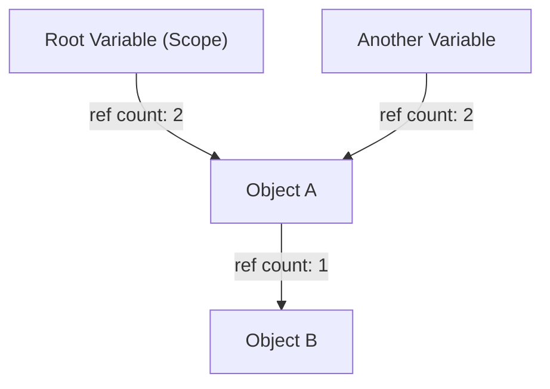
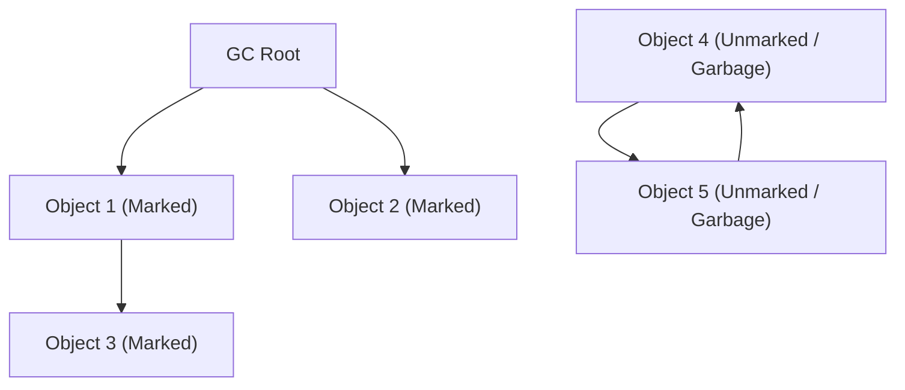
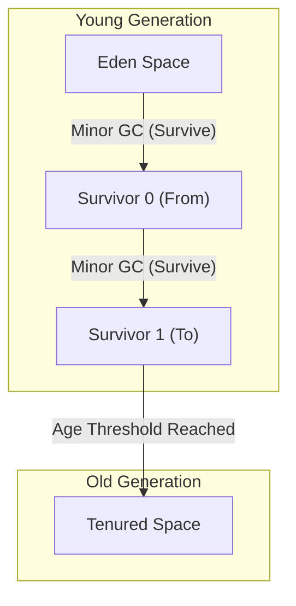

# Sejarah Evolusi Pengumpulan Sampah (GC): Perjalanan dari Manajemen Manual ke ZGC

Dalam pengembangan perangkat lunak modern, kemampuan untuk memprogram tanpa menyadari manajemen memori semata-mata berkat evolusi teknologi yang disebut "Pengumpulan Sampah" (Garbage Collection, GC). Banyak bahasa pemrograman yang digunakan secara luas saat ini, seperti Java, C#, Python, JavaScript, dan Go, memiliki semacam pengumpulan sampah bawaan.

Namun, jalan untuk mencapai titik ini tidaklah mulus. Dimulai dari era di mana pemrogram sepenuhnya mengontrol alokasi dan dealokasi memori, ada sejarah otomatisasi manajemen memori secara bertahap sambil melawan berbagai bug yang muncul seiring dengan meningkatnya kompleksitas program.

Artikel ini menelusuri sejarah manajemen memori dalam ilmu komputer, menjelajahi proses evolusi dari keterbatasan manajemen memori manual, penghitungan referensi (reference counting), mark and sweep, GC generasional, G1GC, hingga teknologi modern yang menakjubkan seperti ZGC dan Shenandoah, yang akan dibahas secara mendalam dari perspektif algoritma dan arsitektur.

---

## 1. Era Kekacauan: Manajemen Memori Manual dan Keterbatasannya

Di era sebelum pengumpulan sampah ada (dan bahkan sekarang di area di mana bahasa seperti C, C++, dan Rust aktif), manajemen memori adalah tanggung jawab penuh pemrogram. Ini adalah proses di mana program mengalokasikan memori dari OS ketika dibutuhkan, dan secara eksplisit mengembalikannya ke OS ketika tidak lagi dibutuhkan.

### Dunia `malloc` dan `free`

Dalam bahasa C, fungsi dari keluarga `malloc` digunakan untuk alokasi memori dinamis, dan `free` digunakan untuk dealokasi.

```c
#include <stdlib.h>
#include <stdio.h>

void process_data() {
    // Mengalokasikan memori di heap untuk 100 bilangan bulat (integer)
    int* data = (int*)malloc(100 * sizeof(int));
    if (data == NULL) {
        // Penanganan kesalahan saat alokasi memori gagal
        return;
    }

    // Pemrosesan menggunakan data
    for (int i = 0; i < 100; i++) {
        data[i] = i * 2;
    }

    // Membebaskan memori setelah pemrosesan selesai
    free(data);
}
```

Keuntungan terbesar dari pendekatan ini adalah "kontrolabilitas" dan "kinerja". Pemrogram dapat dengan tepat mengetahui kapan dan di mana memori dialokasikan dan kapan dibebaskan, hingga skala milidetik. Dalam sistem komputer awal dengan kendala perangkat keras yang ketat, kontrol mutlak ini sangat penting.

### 3 Dosa Besar yang Disebabkan oleh Manajemen Manual

Namun, seiring dengan ukuran perangkat lunak yang membengkak menjadi puluhan ribu atau jutaan baris, dan banyak utas (thread) menjadi terjalin secara kompleks, manajemen memori manual mulai melampaui batas kognitif manusia. Akibatnya, bug serius berikut mulai sering terjadi:

1. **Kebocoran Memori (Memory Leak)**
   Masalah lupa membebaskan memori yang telah dialokasikan. Ketika kebocoran memori terjadi di aplikasi server yang berjalan lama, memori yang tersedia berkurang secara bertahap, dan akhirnya OS secara paksa menghentikan proses (OOM: Out Of Memory).

2. **Dangling Pointer dan Use-After-Free**
   Bug di mana pointer yang menunjuk ke area memori terus digunakan meskipun memori tersebut telah dibebaskan dengan `free`. Ada kemungkinan bahwa area memori yang dibebaskan telah dialokasikan dengan data baru, dan jika diakses atau ditulis, hal itu akan menghancurkan data yang sama sekali tidak terkait. Ini menjadi tempat berkembang biaknya kerentanan keamanan (seperti eksekusi kode arbitrer).

3. **Pembebasan Ganda (Double Free)**
   Masalah memanggil `free` dua kali untuk area memori yang sama. Hal ini menghancurkan struktur data internal (seperti free list) dari alokator memori, dan menyebabkan crash atau kelemahan keamanan yang fatal.

```c
// Contoh Use-After-Free
int* ptr = malloc(sizeof(int));
*ptr = 42;
free(ptr);
// ... pemrosesan kompleks ...
*ptr = 100; // Bahaya! Menulis ke area yang sudah dibebaskan
```

Untuk mengatasi masalah ini, C++ memperkenalkan konsep seperti RAII (Resource Acquisition Is Initialization) dan smart pointers, tetapi pengumpulan sampah lahir dari ide: "Bisakah kita mengambil manajemen memori dari pemrogram dan menyerahkannya pada sistem?"

---

## 2. Langkah Pertama Menuju Otomatisasi: Penghitungan Referensi (Reference Counting)

Pendekatan besar pertama untuk mengatasi keterbatasan manajemen memori manual adalah "Penghitungan Referensi" (Reference Counting). Bahkan hari ini, ini banyak digunakan dalam Python, PHP, Objective-C/Swift (ARC: Automatic Reference Counting), `std::shared_ptr` pada C++, dll.

### Prinsip Dasar Penghitungan Referensi

Mekanisme penghitungan referensi sangat sederhana. Area header setiap objek memiliki penghitung (jumlah referensi) yang menunjukkan "berapa banyak variabel (pointer) yang saat ini merujuk kepadanya".

- Saat objek baru dibuat dan ditugaskan ke variabel, hitungan disetel ke `1`.
- Ketika variabel lain mulai mereferensikan objek tersebut, hitungan ditambah `+1`.
- Saat variabel keluar dari cakupan (scope) atau referensinya dihapus, hitungan dikurangi `-1`.
- Pada saat hitungan mencapai `0`, dipastikan bahwa objek tersebut "tidak direferensikan dari mana pun", jadi memori tersebut segera dibebaskan.



### Kelebihan dan Kekurangan Penghitungan Referensi

**Kelebihan:**
1. **Pembebasan Deterministik:** Karena memori dibebaskan segera setelah referensi mencapai nol, siklus hidup sumber daya mudah diprediksi.
2. **Distribusi Waktu Henti (Pause Time):** Karena beban pembebasan memori didistribusikan ke seluruh eksekusi program, waktu henti yang sangat besar seperti "Stop-The-World (STW)" (dibahas nanti) lebih kecil kemungkinannya terjadi.

**Kekurangan:**
1. **Overhead Pembaruan Penghitung:** Operasi penambahan dan pengurangan harus dieksekusi setiap kali penugasan pointer terjadi. Dalam lingkungan multi-utas, pembaruan penghitung ini harus dilakukan dengan operasi atomik (seperti kunci), yang merupakan hambatan kinerja (bottleneck) besar.
2. **Kelemahan Fatal dari Referensi Melingkar (Circular Reference):** Ini adalah kelemahan terbesarnya. Jika Objek A mereferensikan Objek B, dan Objek B mereferensikan Objek A, bahkan jika A dan B tidak lagi dapat diakses dari mana saja dalam program, karena mereka saling mereferensikan satu sama lain, hitungan tidak akan pernah mencapai `0`, dan itu menjadi kebocoran memori permanen.

Untuk menyelesaikan referensi melingkar, pengembang harus secara eksplisit menggunakan "Referensi Lemah (Weak Reference)", tetapi bagaimanapun, ini tidak sepenuhnya otomatis karena "pengembang harus sadar akan ketergantungan memori."

---

## 3. Tantangan Menuju Pemberantasan: Mark and Sweep dan Tracing GC

"Tracing Garbage Collection" adalah hal yang secara fundamental memecahkan masalah referensi melingkar dan mewujudkan manajemen memori otomatis sejati, dan algoritma perwakilannya adalah "Mark and Sweep".

Algoritma revolusioner ini, yang diciptakan oleh John McCarthy untuk bahasa LISP, menjadi dasar bagi hampir semua GC tingkat lanjut saat ini, seperti Java (JVM), Go, dan mesin V8 (JavaScript).

### Konsep Keterjangkauan (Reachability)

Mark and Sweep tidak melacak "siapa yang merujuk kepada saya" seperti penghitungan referensi. Sebaliknya, ia memutuskan hidup atau mati berdasarkan "apakah ia dapat dijangkau dengan menelusuri dari titik awal (root) program" (Reachability).

Titik awal yang disebut **GC Roots** meliputi yang berikut ini:
- Variabel lokal di call stack dari utas yang sedang dieksekusi
- Variabel global, variabel statis (static)
- Register CPU

### Dua Fase Mark and Sweep

Seperti namanya, algoritma ini terdiri dari dua fase.

1. **Fase Mark (Mark Phase):**
   Dimulai dari GC root dan mengikuti pointer untuk menandai (mark) semua objek yang dapat diakses sebagai "hidup" (Live). Ini sering diimplementasikan dengan menyetel bit tunggal (mark bit) di header objek.

2. **Fase Sweep (Sweep Phase):**
   Memindai (sweep) seluruh memori heap dari awal hingga akhir. Objek yang tidak ditandai dinilai sebagai "sampah (Garbage) yang tidak dapat dijangkau lagi dari program", dan memori tersebut direklamasi (diambil kembali) dan dikembalikan ke daftar kosong (Free List). Objek yang ditandai dibersihkan tandanya untuk persiapan GC berikutnya.


*(Obj4 dan Obj5 pada gambar di atas memiliki referensi melingkar, tetapi karena tidak dapat dijangkau dari GC Root, mereka dikumpulkan secara bersamaan sebagai Garbage.)*

### Stop-The-World (STW) dan Fragmentasi

Mark and Sweep tampak seperti cara yang sempurna untuk memecahkan referensi melingkar, tetapi itu harus dibayar mahal.

Harga pertama adalah **Stop-The-World (STW)**.
Jika utas aplikasi (disebut mutator) mengubah hubungan referensi objek selama proses penandaan, ada risiko objek yang hidup akan terlewatkan. Oleh karena itu, pada GC awal, perlu menghentikan sementara semua utas aplikasi di antara proses mark dan sweep. Semakin besar ukuran heap, waktu henti ini berkisar dari hitungan detik hingga puluhan menit, yang berakibat fatal dalam sistem yang membutuhkan real-time.

Harga kedua adalah **Fragmentasi Memori**.
Tempat di mana sampah dikumpulkan di fase sweep tersebar di seluruh heap seperti keju berlubang. Meskipun jumlah total ruang kosong cukup, sebuah blok memori besar yang berkelanjutan tidak dapat dialokasikan, yang mengakibatkan OutOfMemoryError.

Untuk mengatasi ini, muncullah teknik yang disebut "Mark and Compact". Dengan menggeser objek hidup ke satu sisi area memori (kompaksi/pemadatan), ini menciptakan ruang kosong besar yang berkelanjutan. Namun, karena lokasi objek (alamat memori) berubah, maka diperlukan pembaruan semua pointer yang menunjuk pada objek tersebut, yang menyebabkan STW menjadi semakin lama.

---

## 4. Kelahiran GC Generasional dan Pengenalan Heuristik

"Pengumpulan Sampah Generasional (Generational GC)" diciptakan untuk mematahkan inefisiensi dari metode Mark and Sweep, yang "memindai seluruh heap setiap saat". Ini bisa dikatakan sebagai salah satu heuristik (pengoptimalan berdasarkan aturan praktis) paling sukses dalam ilmu komputer.

### Hipotesis Generasional Lemah (Weak Generational Hypothesis)

Peneliti seperti dari IBM melakukan pemrofilan memori untuk berbagai aplikasi dan menemukan sebuah hukum yang kuat.

**"Sebagian besar objek yang baru dialokasikan segera menjadi tidak dibutuhkan (berumur pendek)."**
**"Objek yang lebih tua cenderung bertahan lebih lama di kemudian hari."**

Misalnya, sebuah string yang dibuat sementara di dalam loop atau objek DTO yang menyimpan nilai balikan dari suatu metode akan menjadi sampah dalam hitungan milidetik. Di sisi lain, data cache atau pool koneksi akan bertahan hingga aplikasi berhenti (terminate).

### Pemisahan Heap: Young dan Old

Berdasarkan hipotesis ini, GC Generasional secara logis membagi memori heap.

1. **Generasi Muda (Young Generation):**
   Ini adalah tempat objek yang baru dibuat pertama kali ditempatkan. Ruang Young lebih lanjut dibagi menjadi "Ruang Eden" dan dua "Ruang Survivor (From/To)".
   Objek awalnya dialokasikan di Eden. Ketika Eden penuh, **Minor GC** terjadi.
   Minor GC hanya mengeksekusi mark and copy di dalam area Young. Objek yang selamat dipindahkan ke ruang Survivor, dan hanya objek yang bertahan dari beberapa Minor GC di sana (mencapai batas usia) yang akan dipromosikan (Promotion) ke area Old sebagai "objek berumur panjang".
   Karena banyak objek berumur pendek, hanya sedikit objek yang selamat di area Young, yang memungkinkan proses penyalinan selesai dengan sangat cepat dan waktu STW tetap sangat pendek.

2. **Generasi Tua (Old Generation / Tenured):**
   Ini adalah area di mana objek yang bertahan hidup dalam jangka panjang ditempatkan. Ketika area Old penuh, **Major GC (Full GC)** yang menargetkan keseluruhan heap terjadi.
   Full GC membutuhkan waktu, tetapi karena objek yang berumur pendek telah dihapus selama Minor GC di area Young, frekuensi dari Full GC itu sendiri dapat dikurangi secara drastis.



### Optimalisasi dengan Card Table

Untuk mewujudkan GC Generasional, ada tantangan teknis lain. "Jika objek di area Old mereferensikan objek di area Young, bagaimana kita bisa dengan aman mengeksekusi GC hanya pada area Young (Minor GC)?" Jika kita hanya menelusuri dari GC root, kita harus memindai seluruh area Old.

Untuk mengatasi ini, diperkenalkanlah struktur data yang disebut "Card Table". Area Old dibagi menjadi halaman (kartu) kecil, dan ketika sebuah referensi ditulis dari Old ke Young, kode khusus yang disebut Write Barrier disisipkan untuk menandai kartu tersebut sebagai "Dirty" (kotor). Selama Minor GC, selain GC root, hanya kartu Dirty ini yang dipindai, sehingga sepenuhnya menghilangkan biaya memindai seluruh area Old.

Dengan munculnya GC Generasional (seperti CMS: Concurrent Mark Sweep), Java mendapatkan pangsa pasar yang luar biasa di sektor enterprise.

---

## 5. Menangani Heap Berkapasitas Besar: Kebangkitan G1GC (Garbage-First GC)

Seiring dengan turunnya harga memori dan memori server menjadi semakin besar dari beberapa GB menjadi puluhan atau ratusan GB, arsitektur GC Generasional konvensional menghadapi dinding baru.
Ketika Full GC terjadi di heap berukuran puluhan GB, bahkan dengan menggunakan GC konkuren (paralel) seperti CMS, penyelesaian fragmentasi (kompaksi) akan menyebabkan STW selama beberapa detik.

Untuk mengatasi ini, **G1GC (Garbage-First GC)** diadopsi sebagai GC default di Java 9.

### Arsitektur Berbasis Region

Karakteristik terbesar G1GC adalah ia berhenti membagi memori secara fisik ke dalam area memori berkelanjutan yang besar seperti "area Young" dan "area Old" tradisional.
Sebaliknya, seluruh heap dibagi menjadi ribuan area kecil (biasanya 1MB hingga 32MB) seperti kotak di papan catur, yang disebut "Region".

Setiap region secara dinamis mengasumsikan peran sebagai Eden, Survivor, atau Old.

### Makna "Garbage-First" dan Model Prediksi

Nama "Garbage-First" (Sampah Pertama) dari G1GC berasal dari strategi reklamasinya.
Melalui proses concurrent marking (proses penandaan yang berjalan secara paralel dengan eksekusi aplikasi), G1GC selalu menghitung "berapa banyak objek sampah yang terkandung (seberapa sedikit objek yang bertahan)" di setiap region.

Selama GC, daripada mengkompaksi seluruh heap sekaligus, G1GC secara aktif **"memprioritaskan reklamasi dari region yang paling banyak mengandung sampah dan paling efisien (objek yang bertahan paling sedikit)"**.

Lebih lanjut, G1GC memiliki fitur soft real-time yang mencoba mematuhi "target waktu henti (misalnya, 200 milidetik)" yang ditentukan pengguna. Berdasarkan data statistik dari GC masa lalu, ia secara heuristik menghitung "berapa banyak region yang dapat diklaim kembali (disalin) kali ini jika berada dalam waktu 200 milidetik" dan secara dinamis menentukan jumlah region yang akan direklamasi (CSet: Collection Set).

Ini memungkinkan pengoperasian dengan STW singkat yang dapat diprediksi bahkan dengan ukuran heap mencapai puluhan GB.

---

## 6. Puncak GC Modern: ZGC dan Shenandoah yang Membuka Dunia Skala Milidetik

Meskipun kebangkitan G1GC sebagian besar memperbaiki masalah heap yang sangat besar, masalah fundamental dari "semakin besar ukuran heap, semakin lama waktu STW" (terutama untuk merelokasi objek dan memperbarui pointer selama kompaksi) tidak sepenuhnya terpecahkan.

Untuk memenuhi persyaratan ketat yang menyatakan bahwa **"waktu henti lebih dari beberapa milidetik tidak dapat ditoleransi dalam keadaan apa pun"**—seperti untuk sistem keuangan, perdagangan frekuensi tinggi (HFT), dan server game real-time berskala besar—arsitektur GC paling pamungkas telah lahir untuk menekan STW menjadi kurang dari 1 milidetik (sub-milidetik) bahkan untuk heap berukuran beberapa terabyte (TB). Itulah **ZGC (Z Garbage Collector)** dan **Shenandoah GC**.

### Keajaiban Concurrent Relocation (Relokasi Konkuren)

Penyebab terbesar terjadinya STW pada GC tradisional adalah "memindahkan objek (kompaksi)". Setelah menyalin sebuah objek ke area memori baru, aplikasi harus dihentikan saat memperbarui jutaan pointer yang menunjuk pada objek tersebut. Jika aplikasi tidak dihentikan dan mengakses alamat memori yang lama, data tersebut akan hancur.

ZGC dan Shenandoah telah mencapai kehebatan luar biasa yang ajaib, yaitu **melakukan bahkan "pemindahan objek dan pembaruan pointer" secara konkuren tanpa menghentikan utas aplikasi**.

### Teknologi Inti ZGC: Colored Pointers dan Load Barrier

ZGC, yang dipimpin oleh Oracle, menggunakan teknologi revolusioner yang disebut **Colored Pointers** yang sepenuhnya memanfaatkan karakteristik arsitektur 64-bit.

Dari ruang pointer 64-bit, hanya 44 bit bagian bawah (maksimum 16TB) yang benar-benar digunakan sebagai alamat memori. ZGC menggunakan beberapa bit atas yang tersisa sebagai "metadata (warna)".
Bit warna ini mencatat status seperti, "Apakah pointer ini sudah ditandai?" dan "Apakah objek yang ditunjuk oleh pointer ini sedang dipindahkan (Relocated)?"

```
[ Unused ] [ Marked0 ] [ Marked1 ] [ Remapped ] [ Finalizable ] [   Object Address (44 bits)   ]
   ...          1           0           0              0        1010101010101010...
```

Selain itu, setiap kali aplikasi memuat (load) referensi ke suatu objek, sebuah perintah assembly kecil secara dinamis disisipkan yang disebut **Load Barrier**.

**Cara kerja Load Barrier:**
1. Utas aplikasi memuat (load) sebuah pointer.
2. Ia memeriksa "warna (metadata)" dari pointer tersebut.
3. Jika objek sedang "dipindahkan ke lokasi lain oleh GC (atau telah dipindahkan tetapi pointer masih menunjuk ke alamat lama)", maka load barrier akan melakukan intervensi.
4. Merujuk ke "Forwarding Table" (tabel penerusan) yang dikelola oleh ZGC dan mendapatkan alamat baru yang benar.
5. Memperbarui pointer itu sendiri ke alamat baru (Self-Healing) dan mengembalikan objek dari alamat baru tersebut ke aplikasi.

Dengan mekanisme Self-Healing ini, bahkan saat utas GC sibuk memindahkan objek di belakang layar, utas aplikasi selalu dapat dengan aman mengakses "objek terbaru yang benar". STW sangat dibatasi untuk fase-fase tertentu seperti "pemindaian GC root" (biasanya kurang dari 1 milidetik), dan waktu hentinya tetap sama terlepas dari apakah ukuran heap 10MB atau 16TB.

### Teknologi Inti Shenandoah: Brooks Pointers

Shenandoah GC, yang dipimpin oleh Red Hat, juga mencapai concurrent relocation (relokasi konkuren) namun menggunakan pendekatan yang berbeda.

Shenandoah menempatkan sebuah forwarding pointer (pointer penerusan) yang disebut **Brooks Pointer** di depan area header seluruh objek.
Secara normal, pointer ini menunjuk pada "dirinya sendiri". Namun, saat GC mulai menyalin objek ke area baru, ia secara atomik memperbarui Brooks pointer objek lama agar menunjuk pada "alamat dari objek baru".

Setiap kali aplikasi membaca atau menulis pada sebuah objek, hal itu akan selalu dirutekan melalui Brooks pointer ini (Read Barrier / Write Barrier), sehingga memastikan akses secara transparan dialihkan ke objek baru meskipun saat objek tersebut sedang dipindahkan.

---

## Kesimpulan: Masa Depan Manajemen Memori

Dimulai dengan era kekacauan dari `malloc/free` di bahasa C, Mark and Sweep yang lahir dari LISP, GC Generasional yang menopang dunia enterprise, G1GC yang mengendalikan heap berukuran besar, dan ZGC serta Shenandoah yang mencapai kelambatan (latensi) sangat rendah.

Sejarah pengumpulan sampah (garbage collection) pada dasarnya adalah sejarah tantangan umat manusia mengenai "bagaimana mengatasi kompleksitas perangkat lunak".
Saat ini, dengan penggabungan evolusi perangkat keras (seperti prediksi percabangan CPU dan optimalisasi cache line) dan algoritma perangkat lunak, "GC full concurrent (sepenuhnya konkuren) yang tidak menghentikan aplikasi", yang dulunya dianggap mustahil, kini telah menjadi kenyataan.

Pendekatan lain seperti manajemen memori statis melalui "model kepemilikan waktu kompilasi (compile-time ownership model)" yang terlihat di bahasa Rust juga mendapatkan tempat, namun di dalam aplikasi berskala besar yang menangani grafik objek kompleks dan dinamis, pengumpulan sampah akan terus menjadi infrastruktur penting.
Tidak ada salahnya sesekali merenungkan algoritma GC yang bekerja diam-diam namun dengan keterampilan tingkat tinggi di balik layar, mengelola memori secara konstan.

---
*Reference: The Garbage Collection Handbook, OpenJDK Wiki, various JEPs (JEP 333, JEP 189)*
