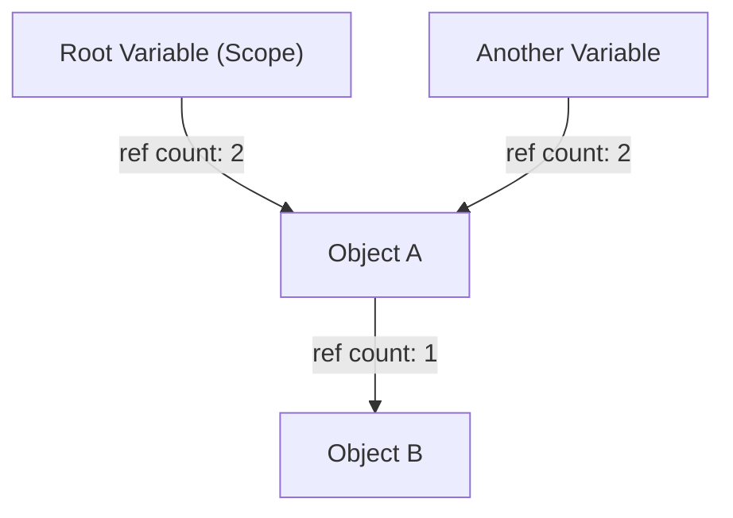
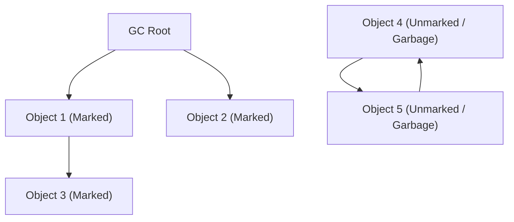
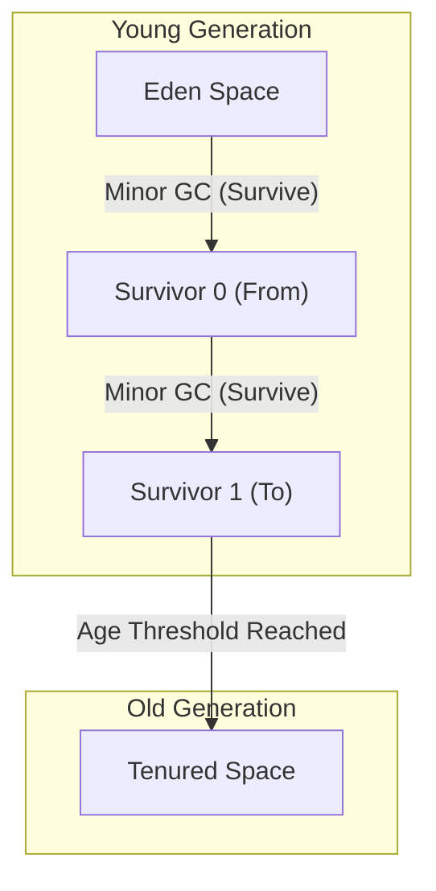

# 가비지 컬렉션(GC)의 진화사: 수동 관리에서 ZGC까지의 발자취

현대의 소프트웨어 개발에서 메모리 관리를 의식하지 않고 프로그래밍을 할 수 있는 것은 전적으로 '가비지 컬렉션(Garbage Collection, GC)'이라는 기술의 진화 덕분입니다. Java, C#, Python, JavaScript, Go 등 오늘날 널리 사용되는 프로그래밍 언어 대부분은 어떤 형태로든 가비지 컬렉션을 내장하고 있습니다.

그러나 여기까지 이르는 여정은 결코 순탄치 않았습니다. 프로그래머가 직접 메모리 할당과 해제를 완전히 제어하던 시대부터 시작하여, 프로그램이 복잡해짐에 따라 발생하는 수많은 버그와 싸우면서 조금씩 메모리 관리를 자동화해 온 역사가 있습니다.

본 기사에서는 컴퓨터 과학에서 메모리 관리의 역사를 파헤쳐, 수동 메모리 관리의 한계에서부터 참조 카운트, 마크 앤 스윕, 세대별 GC, G1GC, 그리고 현대의 경이로운 기술인 ZGC와 Shenandoah에 이르기까지 진화 과정을 알고리즘과 아키텍처 관점에서 깊이 있게 해설합니다.

---

## 1. 혼돈의 시대: 수동 메모리 관리와 그 한계

가비지 컬렉션이 존재하지 않았던 시대(그리고 현재에도 C나 C++, Rust 등의 언어가 활약하는 영역), 메모리 관리는 전적으로 프로그래머의 책임이었습니다. 프로그램이 필요할 때 운영체제(OS)로부터 메모리를 확보하고, 불필요해지면 명시적으로 OS에 반환하는 프로세스입니다.

### `malloc`과 `free`의 세계

C언어에서는 동적 메모리 할당에 `malloc` 계열의 함수를 사용하고, 해제에는 `free`를 사용합니다.

```c
#include <stdlib.h>
#include <stdio.h>

void process_data() {
    // 힙에 100개의 정수 크기만큼 메모리 할당
    int* data = (int*)malloc(100 * sizeof(int));
    if (data == NULL) {
        // 메모리 할당 실패 시 에러 핸들링
        return;
    }

    // 데이터를 사용하는 처리
    for (int i = 0; i < 100; i++) {
        data[i] = i * 2;
    }

    // 처리가 완료되면 메모리 해제
    free(data);
}
```

이 접근법의 가장 큰 장점은 '제어성'과 '성능'입니다. 프로그래머는 메모리가 언제 어디서 할당되고 언제 해제되는지를 밀리초 단위로 정확하게 파악할 수 있었습니다. 하드웨어 제약이 심했던 초창기 컴퓨터 시스템에서 이러한 절대적인 제어권은 필수적이었습니다.

### 수동 관리가 초래하는 3가지 큰 죄

하지만 소프트웨어의 규모가 수만 줄, 수백만 줄로 커지고, 여러 스레드가 복잡하게 얽히게 되면서 수동 메모리 관리는 인간의 인지 한계를 넘어서게 되었습니다. 그 결과, 다음과 같은 심각한 버그가 빈번하게 발생하기 시작합니다.

1. **메모리 누수 (Memory Leak)**
   할당한 메모리를 해제하는 것을 잊어버리는 문제입니다. 장기간 가동되는 서버 애플리케이션에서 메모리 누수가 발생하면 서서히 사용 가능한 메모리가 감소하고, 결국에는 OS에 의해 프로세스가 강제 종료(OOM: Out Of Memory)되고 맙니다.

2. **댕글링 포인터와 Use-After-Free**
   메모리를 `free`로 해제했음에도 불구하고, 그 메모리 영역을 가리키는 포인터를 계속 사용하는 버그입니다. 해제된 메모리 영역에는 다른 데이터가 새롭게 할당되어 있을 수 있으며, 그곳에 접근하거나 쓰기를 시도하면 전혀 무관한 데이터를 파괴하게 됩니다. 이는 보안 취약점(임의 코드 실행 등)의 온상이 되었습니다.

3. **이중 해제 (Double Free)**
   같은 메모리 영역에 대해 두 번 `free`를 호출하는 문제입니다. 메모리 할당자의 내부 데이터 구조(프리 리스트 등)를 파괴하여, 크래시나 보안상의 치명적인 결함을 유발합니다.

```c
// Use-After-Free의 예
int* ptr = malloc(sizeof(int));
*ptr = 42;
free(ptr);
// ... 복잡한 처리 ...
*ptr = 100; // 위험! 이미 해제된 영역에 대한 쓰기 시도
```

이러한 문제에 대처하기 위해 C++에서는 RAII(Resource Acquisition Is Initialization)나 스마트 포인터 등의 개념이 도입되었지만, '애초에 메모리 관리를 프로그래머에게서 떼어내어 시스템에 맡길 수 없을까?'라는 발상에서 탄생한 것이 바로 가비지 컬렉션입니다.

---

## 2. 자동화를 향한 첫걸음: 참조 카운트 (Reference Counting)

수동 메모리 관리의 한계를 극복하기 위한 첫 번째 주요 접근법이 '참조 카운트'입니다. 현재에도 Python이나 PHP, Objective-C/Swift (ARC: Automatic Reference Counting), C++의 `std::shared_ptr` 등에서 널리 채택되고 있습니다.

### 참조 카운트의 기본 원리

참조 카운트의 작동 방식은 매우 단순합니다. 각 객체의 헤더 영역에 '현재 몇 개의 변수(포인터)로부터 자기 자신이 참조되고 있는지'를 나타내는 카운터(참조 카운트)를 둡니다.

- 객체가 새롭게 생성되어 변수에 대입될 때, 카운트를 `1`로 만듭니다.
- 다른 변수가 그 객체를 참조하기 시작할 때, 카운트를 `+1` 합니다.
- 변수가 스코프를 벗어나는 등의 이유로 참조가 끊어질 때, 카운트를 `-1` 합니다.
- 카운트가 `0`이 되는 순간, 그 객체는 '어디에서도 참조되지 않음'이 확정되므로 즉시 메모리를 해제합니다.



### 참조 카운트의 장단점

**장점:**
1. **결정론적인 해제:** 참조가 0이 되는 순간 메모리가 해제되므로, 리소스의 생명 주기를 예측하기 쉽습니다.
2. **중지 시간 (Pause Time)의 분산:** 메모리 해제 부하가 프로그램 실행 전체에 분산되므로, 후술할 'Stop-The-World (STW)'와 같은 거대한 중지 시간이 잘 발생하지 않습니다.

**단점:**
1. **카운터 업데이트 오버헤드:** 포인터 대입이 발생할 때마다 증가 및 감소 명령을 실행해야 합니다. 멀티스레드 환경에서는 이러한 카운터 업데이트를 원자적 작업(락 등)으로 수행해야 하므로 성능에 큰 병목이 됩니다.
2. **순환 참조 (Circular Reference)의 치명적 결함:** 이것이 가장 큰 약점입니다. 객체 A가 객체 B를 참조하고, 객체 B가 객체 A를 참조하는 경우, 비록 프로그램의 어느 곳에서도 A와 B에 접근할 수 없게 되더라도 서로 참조하고 있기 때문에 카운트가 절대 `0`이 되지 않으며, 영구적인 메모리 누수가 발생합니다.

순환 참조를 해결하기 위해 개발자는 '약한 참조 (Weak Reference)'를 명시적으로 사용해야 하지만, 이는 결국 '개발자가 메모리 의존 관계를 의식해야 한다'는 점에서 완전한 자동화라고 할 수 없었습니다.

---

## 3. 근절을 위한 도전: 마크 앤 스윕 (Mark and Sweep)과 트레이싱 GC

순환 참조 문제를 근본적으로 해결하고 진정한 자동 메모리 관리를 실현한 것이 '트레이싱 가비지 컬렉션'이며, 그 대표적인 알고리즘이 '마크 앤 스윕 (Mark and Sweep)'입니다.

존 매카시가 LISP 언어를 위해 고안한 이 획기적인 알고리즘은 현대의 Java (JVM)나 Go, V8 엔진 (JavaScript) 등 거의 모든 고도화된 GC의 기초가 되고 있습니다.

### 도달 가능성 (Reachability)의 개념

마크 앤 스윕은 참조 카운트처럼 '누가 참조하고 있는가'를 추적하지 않습니다. 대신, '프로그램의 기점(루트)에서 출발하여 도달할 수 있는가 (Reachability)'를 기준으로 생사 여부를 판단합니다.

**GC 루트 (GC Roots)** 라고 불리는 기점에는 다음과 같은 것들이 포함됩니다.
- 현재 실행 중인 스레드의 콜 스택에 있는 지역 변수
- 전역 변수, 정적 (static) 변수
- CPU 레지스터

### 마크 앤 스윕의 두 단계

알고리즘은 이름 그대로 두 가지 단계(Phase)로 구성됩니다.

1. **마크 단계 (Mark Phase):**
   GC 루트에서 출발하여 포인터를 따라 접근 가능한 모든 객체에 '살아있다 (Live)'는 표시(마크)를 남깁니다. 대부분의 경우 객체 헤더의 1비트(마크 비트)를 설정하는 것으로 구현됩니다.

2. **스윕 단계 (Sweep Phase):**
   힙 메모리 전체를 처음부터 끝까지 순회(스윕)합니다. 마크가 없는 객체는 '더 이상 프로그램에서 도달 불가능한 쓰레기 (Garbage)'로 판단하여, 해당 메모리 영역을 회수하고 빈 목록 (Free List)으로 되돌립니다. 마크된 객체는 다음 GC를 위해 마크를 해제(Clear)합니다.


*(위 그림에서 Obj4와 Obj5는 순환 참조하고 있지만, GC Root에서 도달할 수 없으므로 모두 Garbage로 회수됩니다.)*

### Stop-The-World (STW)와 단편화

마크 앤 스윕은 순환 참조를 해결하는 완벽한 방법으로 보였지만, 큰 대가가 따랐습니다.

첫 번째 대가는 **Stop-The-World (STW)** 입니다.
마크 처리를 수행하는 도중에 애플리케이션의 스레드(뮤테이터라고 불림)가 객체의 참조 관계를 변경해 버리면, 살아있는 객체를 놓칠 위험이 있습니다. 따라서 초기의 GC에서는 마크와 스윕을 하는 동안 애플리케이션의 모든 스레드를 완전히 정지시켜야 했습니다. 힙 크기가 커질수록 이 정지 시간은 수 초에서 수십 분에 달했으며, 실시간성이 요구되는 시스템에서는 치명적이었습니다.

두 번째 대가는 **메모리 단편화 (Fragmentation)** 입니다.
스윕 단계에서 쓰레기를 회수한 자리는 구멍 뚫린 치즈처럼 힙 전체에 흩어집니다. 남은 용량의 합계는 충분한데도 연속된 큰 메모리 블록을 확보할 수 없게 되어, 결과적으로 OutOfMemoryError가 발생하는 문제입니다.

이를 해결하기 위해 '마크 앤 컴팩트 (Mark and Compact)'라는 기법이 등장했습니다. 살아있는 객체를 메모리 영역의 한쪽으로 모으는(컴팩션) 것으로 연속된 거대한 빈 영역을 만들어냅니다. 그러나 객체의 위치(메모리 주소)가 변경되므로 해당 객체를 가리키는 모든 포인터를 다시 써야 하는 처리가 필요해졌고, 이는 더 긴 STW를 유발하는 원인이 되었습니다.

---

## 4. 세대별 GC의 탄생과 휴리스틱의 도입

마크 앤 스윕의 '매번 힙 전체를 스캔한다'는 비효율성을 극복하기 위해 고안된 것이 '세대별 가비지 컬렉션 (Generational GC)'입니다. 이는 컴퓨터 과학에서 가장 성공한 휴리스틱(경험칙에 기반한 최적화) 중 하나라고 할 수 있습니다.

### 약한 세대별 가설 (Weak Generational Hypothesis)

IBM 등의 연구자들은 다양한 애플리케이션의 메모리 프로파일링을 수행하여 어떤 강력한 법칙을 발견했습니다.

**"새롭게 할당된 객체의 대부분은 금방 불필요해진다 (수명이 짧다)."**
**"오래된 객체는 그 후에도 오랫동안 살아남는 경향이 있다."**

예를 들어, 루프 내에서 임시로 생성되는 문자열이나 메서드의 반환값을 저장하는 DTO 객체 등은 몇 밀리초 후에는 쓰레기가 됩니다. 반면, 캐시 데이터나 커넥션 풀 등은 애플리케이션이 종료될 때까지 살아남습니다.

### 힙 분할: Young과 Old

이 가설을 바탕으로, 세대별 GC에서는 힙 메모리를 논리적으로 분할합니다.

1. **젊은 세대 (Young Generation):**
   새롭게 생성된 객체가 최초로 배치되는 장소입니다. Young 영역은 다시 'Eden 공간'과 두 개의 'Survivor 공간 (From/To)'으로 나뉩니다.
   객체는 먼저 Eden에 할당됩니다. Eden이 가득 차면 **Minor GC**가 발생합니다.
   Minor GC에서는 Young 영역 내에서만 마크 앤 카피(Mark and Copy)를 실행합니다. 살아남은 객체는 Survivor 공간으로 이동하며, 그곳에서 여러 번의 Minor GC를 살아남은(나이를 먹은) 객체만이 '장수 객체'로서 Old 영역으로 승격(Promotion)됩니다.
   수명이 짧은 객체가 많기 때문에 Young 영역 내에서 살아남는 객체는 매우 적고, 카피가 고속으로 완료되어 STW 시간을 극도로 짧게 억제할 수 있습니다.

2. **오래된 세대 (Old Generation / Tenured):**
   장기 생존한 객체가 배치되는 영역입니다. Old 영역이 가득 차면 힙 전체를 대상으로 하는 **Major GC (Full GC)** 가 발생합니다.
   Full GC는 시간이 오래 걸리지만, 단명하는 객체들은 이미 Young 영역의 Minor GC에서 일소되었기 때문에 Full GC가 발생하는 빈도 자체를 획기적으로 줄일 수 있습니다.



### 카드 테이블 (Card Table)을 통한 최적화

세대별 GC를 구현하기 위해서는 또 다른 기술적인 과제가 있었습니다. 'Old 영역의 객체가 Young 영역의 객체를 참조하는 경우, Young 영역만의 GC (Minor GC)를 어떻게 안전하게 실행할 것인가?'입니다. GC 루트에서 따라가는 것만으로는 Old 영역 전체를 스캔해야만 합니다.

이를 해결하기 위해 '카드 테이블'이라고 불리는 데이터 구조가 도입되었습니다. Old 영역을 잘게 쪼갠 페이지(카드)로 나누고, Old에서 Young으로의 참조 쓰기가 발생할 때 라이트 배리어(Write Barrier)라는 특수한 코드를 삽입하여 해당 카드를 'Dirty (더러움)'로 마크합니다. Minor GC 때는 GC 루트에 더해 이 Dirty 카드만을 스캔하면 되므로, Old 영역 전체를 스캔하는 비용을 완전히 배제했습니다.

세대별 GC(CMS: Concurrent Mark Sweep 등)의 등장으로 Java는 엔터프라이즈 영역에서 압도적인 점유율을 차지하게 됩니다.

---

## 5. 대용량 힙에 대한 대응: G1GC (Garbage-First GC)의 대두

메모리 가격이 하락하고 서버의 탑재 메모리가 수 GB에서 수십 GB, 수백 GB로 거대해짐에 따라, 기존의 세대별 GC 아키텍처는 새로운 벽에 부딪혔습니다.
수십 GB의 힙에서 Full GC가 발생하면, 설령 CMS 같은 동시성(Concurrent) GC를 사용하더라도 단편화를 해소(컴팩션)할 때 수 초 단위의 STW가 발생해 버리는 것입니다.

이를 해결하기 위해 Java 9부터 기본 GC로 채택된 것이 **G1GC (Garbage-First GC)** 입니다.

### 리전 (Region) 기반 아키텍처

G1GC의 가장 큰 특징은 기존의 'Young 영역'과 'Old 영역'이라는 거대하고 연속된 메모리의 물리적 분할을 그만두었다는 것입니다.
대신, 힙 전체를 수천 개의 동일한 크기(일반적으로 1MB~32MB)인 '리전 (Region)'이라고 불리는 체스판 칸 같은 작은 영역으로 분할했습니다.

각 리전은 동적으로 Eden, Survivor, Old 중 하나의 역할을 갖게 됩니다.

### "Garbage-First"의 의미와 예측 모델

G1GC의 "Garbage-First (쓰레기 우선)"라는 이름은 그 회수 전략에서 유래합니다.
G1GC는 동시성 마킹(Concurrent Marking, 애플리케이션 실행과 병행하여 마크 처리를 수행함)을 통해 각 리전에 '얼마나 많은 쓰레기 객체가 포함되어 있는지(생존 객체가 적은지)'를 항상 계산하고 있습니다.

GC 시, G1GC는 힙 전체를 한 번에 컴팩션하는 것이 아니라, **'가장 쓰레기가 많아 회수 효율이 좋은 (생존 객체가 적은) 리전부터 우선적으로 회수'** 합니다.

게다가 G1GC는 사용자가 지정한 '목표 중지 시간 (예: 200밀리초)'을 준수하려는 소프트 실시간성을 가집니다. 과거의 GC 통계 데이터를 바탕으로 '200밀리초 이내라면 이번에는 몇 개의 리전을 회수(카피)할 수 있을까'를 휴리스틱하게 계산하여, 회수할 리전의 수(CSet: Collection Set)를 동적으로 결정합니다.

이를 통해 수십 GB의 힙 크기에서도 예측 가능한 짧은 STW로 운영하는 것이 가능해졌습니다.

---

## 6. 모던 GC의 도달점: ZGC와 Shenandoah가 개척하는 밀리초의 세계

G1GC의 등장으로 거대 힙의 문제는 대폭 개선되었지만, '힙 크기가 커지면 언젠가는 STW 시간도 비례해서 길어진다'는 근본적인 문제(특히 객체의 재배치 및 컴팩션 시 포인터 업데이트)는 완전히 해결되지 않았습니다.

금융 시스템이나 고빈도 거래, 대규모 실시간 게임 서버 등 **'어떠한 상황에서도 수 밀리초 이상의 중지는 허용되지 않는다'** 는 엄격한 요구사항을 충족하기 위해, 수 테라바이트(TB)의 힙에서도 STW를 1밀리초 미만(서브 밀리초)으로 억제하는 궁극의 GC 아키텍처가 탄생했습니다. 그것이 바로 **ZGC (Z Garbage Collector)** 와 **Shenandoah GC** 입니다.

### 동시성 재배치 (Concurrent Relocation)의 마법

기존의 GC에서 STW가 발생하는 가장 큰 원인은 '객체의 이동 (컴팩션)'이었습니다. 객체를 새로운 메모리 영역으로 복사한 후, 그 객체를 가리키던 수백만 개의 포인터를 전부 다시 쓰는 동안 애플리케이션을 멈춰야 했습니다. 멈추지 않고 애플리케이션이 옛날 메모리 주소에 접근하게 되면 데이터가 파괴되기 때문입니다.

ZGC와 Shenandoah는 이 **'객체의 이동과 포인터 업데이트'조차도 애플리케이션 스레드를 멈추지 않고 동시성(Concurrent)으로 수행**하는 마법 같은 위업을 달성했습니다.

### ZGC의 핵심 기술: 컬러드 포인터 (Colored Pointers)와 로드 배리어

Oracle이 주도하여 개발한 ZGC는 64비트 아키텍처의 특성을 극한까지 활용한 **컬러드 포인터 (Colored Pointers)** 라는 획기적인 기술을 채택하고 있습니다.

64비트 포인터 공간 중 실제로 메모리 주소로 사용되는 것은 하위 44비트(최대 16TB) 정도입니다. ZGC는 남은 상위 비트의 일부를 '메타데이터 (색)'로 사용합니다.
이 색상 비트에는 '이 포인터는 이미 마크되었는가?', '이 포인터가 가리키는 객체는 이동 중(Relocated)인가?'와 같은 상태가 기록됩니다.

```
[ Unused ] [ Marked0 ] [ Marked1 ] [ Remapped ] [ Finalizable ] [   Object Address (44 bits)   ]
   ...          1           0           0              0        1010101010101010...
```

나아가, 애플리케이션이 객체에 대한 참조를 읽어 들이는 (Load 하는) 모든 위치에 **로드 배리어 (Load Barrier)** 라고 불리는 극히 미미한 어셈블리 명령을 동적으로 삽입합니다.

**로드 배리어의 동작:**
1. 애플리케이션 스레드가 포인터를 읽어 들입니다.
2. 포인터의 '색 (메타데이터)'을 체크합니다.
3. 만약 그 객체가 'GC에 의해 다른 곳으로 이동 중(또는 이동 완료되었으나, 이 포인터는 여전히 이전 주소를 가리킴)'인 경우, 로드 배리어가 개입합니다.
4. ZGC가 관리하는 '전송 테이블 (Forwarding Table)'을 참조하여 새로운 올바른 주소를 얻습니다.
5. 포인터 자체를 새로운 주소로 다시 쓰고(자기 치유, Self-Healing), 애플리케이션에는 새로운 주소의 객체를 반환합니다.

이러한 자기 치유 메커니즘을 통해 GC 스레드가 뒤에서 부지런히 객체를 이동시키고 있는 중이라도 애플리케이션 스레드는 항상 '올바른 최신 객체'에 안전하게 접근할 수 있습니다. STW는 'GC 루트 순회' 등 극히 제한적인 단계(보통 1밀리초 이하)로 억제되며, 힙 크기가 10MB든 16TB든 중지 시간은 변하지 않습니다.

### Shenandoah의 핵심 기술: 브룩스 포인터 (Brooks Pointers)

Red Hat이 주도하여 개발한 Shenandoah GC도 동시성 재배치를 실현하고 있지만 접근 방식이 다릅니다.

Shenandoah는 모든 객체의 헤더 영역 앞에 **브룩스 포인터 (Brooks Pointer)** 라고 불리는 전송 포인터를 배치합니다.
평소에 이 포인터는 '자기 자신'을 가리키고 있습니다. 그러나 GC가 객체를 새로운 영역으로 복사하기 시작할 때, 이전 객체의 브룩스 포인터를 '새로운 객체의 주소'로 원자적으로 다시 씁니다.

애플리케이션이 객체를 읽고 쓸 때 항상 이 브룩스 포인터를 경유하게(리드 배리어, 라이트 배리어) 함으로써, 이동 중이더라도 투명하게 새로운 객체로 접근을 유도하는 방식입니다.

---

## 맺음말: 메모리 관리의 미래

C언어의 `malloc/free`로 인한 혼돈의 시대에서 시작해, LISP에서 탄생한 마크 앤 스윕, 엔터프라이즈를 지탱한 세대별 GC, 거대 힙을 다루는 G1GC, 그리고 극한의 저지연을 실현한 ZGC와 Shenandoah.

가비지 컬렉션의 역사는 곧 '소프트웨어의 복잡성과 어떻게 싸울 것인가'하는 인류의 도전 역사이기도 합니다.
현재는 하드웨어의 진화(CPU 분기 예측과 캐시 라인 최적화)와 소프트웨어 알고리즘의 융합을 통해, 과거에는 불가능하다고 여겨졌던 '완전 동시성(Full Concurrent)으로 멈추지 않는 GC'가 현실이 되었습니다.

Rust와 같은 '컴파일 타임 소유권 모델'을 통한 정적 메모리 관리라는 다른 접근 방식도 대두되고 있지만, 동적이고 복잡한 객체 그래프를 다루는 대규모 애플리케이션에서 가비지 컬렉션은 앞으로도 필수 불가결한 인프라로 남을 것입니다.
보이지 않는 곳에서 조용히, 그러나 초인적인 기교로 끊임없이 메모리를 관리하는 GC 알고리즘에 가끔은 생각에 잠겨보는 것도 좋지 않을까요?

---
*Reference: The Garbage Collection Handbook, OpenJDK Wiki, various JEPs (JEP 333, JEP 189)*
