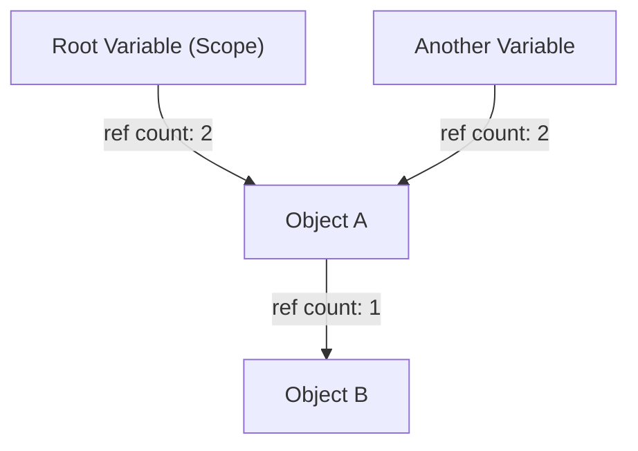
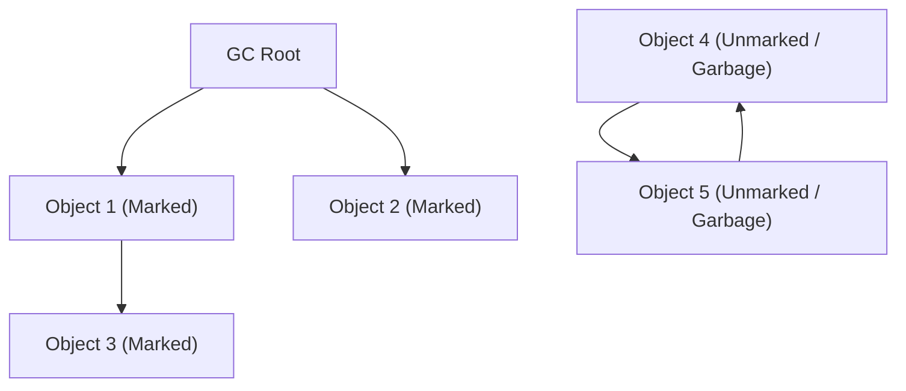
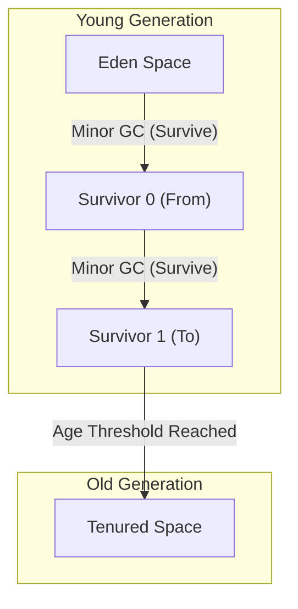

# ガベージコレクション（GC）の進化史：手動管理からZGCへの歩み

現代のソフトウェア開発において、メモリ管理を意識せずにプログラミングができるのは、ひとえに「ガベージコレクション（Garbage Collection, GC）」という技術の進化のおかげです。Java、C#、Python、JavaScript、Goなど、今日広く使われているプログラミング言語の多くは、何らかの形でガベージコレクションを内蔵しています。

しかし、ここに至るまでの道のりは決して平坦なものではありませんでした。プログラマ自身がメモリの確保と解放を完全にコントロールしていた時代から始まり、プログラムの複雑化に伴って生じる数々のバグと戦いながら、少しずつメモリ管理を自動化していく歴史があったのです。

本記事では、コンピュータサイエンスにおけるメモリ管理の歴史を紐解き、手動メモリ管理の限界から、参照カウント、マーク＆スイープ、世代別GC、G1GC、そして現代の驚異的な技術であるZGCやShenandoahに至るまでの進化の過程を、アルゴリズムとアーキテクチャの観点から深く掘り下げて解説します。

---

## 1. 混沌の時代：手動メモリ管理とその限界

ガベージコレクションが存在しなかった時代（そして現在でもCやC++、Rustなどの言語が活躍する領域）、メモリ管理はプログラマの全責任でした。プログラムが必要な時にOSからメモリを確保し、不要になったら明示的にOSへ返却するというプロセスです。

### `malloc` と `free` の世界

C言語では、動的メモリ割り当てに `malloc` ファミリーの関数を使用し、解放には `free` を使用します。

```c
#include <stdlib.h>
#include <stdio.h>

void process_data() {
    // ヒープ上に100個の整数分のメモリを確保
    int* data = (int*)malloc(100 * sizeof(int));
    if (data == NULL) {
        // メモリ確保失敗時のエラーハンドリング
        return;
    }

    // データを使用する処理
    for (int i = 0; i < 100; i++) {
        data[i] = i * 2;
    }

    // 処理が完了したらメモリを解放する
    free(data);
}
```

このアプローチの最大の利点は「制御性」と「パフォーマンス」です。プログラマは、メモリがいつどこで確保され、いつ解放されるかをミリ秒単位で正確に把握できました。ハードウェアの制約が厳しい初期のコンピュータシステムにおいて、この絶対的な制御権は必須でした。

### 手動管理が引き起こす3つの大罪

しかし、ソフトウェアの規模が数万行、数百万行と膨れ上がり、複数のスレッドが複雑に絡み合うようになると、手動でのメモリ管理は人間の認知限界を超えるようになりました。結果として、以下のような深刻なバグが頻発するようになります。

1. **メモリリーク (Memory Leak)**
   確保したメモリを解放し忘れる問題です。長期間稼働するサーバーアプリケーションでメモリリークが発生すると、徐々に利用可能なメモリが減少し、最終的にはOSによってプロセスが強制終了（OOM: Out Of Memory）されてしまいます。

2. **ダングリングポインタと Use-After-Free**
   メモリを `free` で解放したにもかかわらず、そのメモリ領域を指し示すポインタを使い続けてしまうバグです。解放されたメモリ領域には、別のデータが新しく割り当てられている可能性があり、そこにアクセスしたり書き込んだりすると、全く無関係のデータを破壊してしまいます。これはセキュリティの脆弱性（任意コード実行など）の温床となりました。

3. **二重解放 (Double Free)**
   同じメモリ領域に対して2回 `free` を呼び出してしまう問題です。メモリアロケータの内部データ構造（フリーリストなど）を破壊し、クラッシュやセキュリティ上の致命的な欠陥を引き起こします。

```c
// Use-After-Free の例
int* ptr = malloc(sizeof(int));
*ptr = 42;
free(ptr);
// ... 複雑な処理 ...
*ptr = 100; // 危険！すでに解放された領域への書き込み
```

これらの問題に対処するため、C++ではRAII（Resource Acquisition Is Initialization）やスマートポインタなどの概念が導入されましたが、「そもそもメモリ管理をプログラマから取り上げ、システムに任せられないか？」という発想から生まれたのがガベージコレクションです。

---

## 2. 自動化への第一歩：参照カウント (Reference Counting)

手動メモリ管理の限界を克服するための最初の大きなアプローチが「参照カウント」です。現在でもPythonやPHP、Objective-C/Swift (ARC: Automatic Reference Counting)、C++の `std::shared_ptr` などで広く採用されています。

### 参照カウントの基本原理

参照カウントの仕組みは非常にシンプルです。各オブジェクトのヘッダ領域に「現在、いくつの変数（ポインタ）から自分自身が参照されているか」を示すカウンタ（参照カウント）を持たせます。

- オブジェクトが新しく作成され、変数に代入されたとき、カウントを `1` にする。
- 別の変数がそのオブジェクトを参照し始めたとき、カウントを `+1` する。
- 変数がスコープを抜けるなどして参照が外れたとき、カウントを `-1` する。
- カウントが `0` になった瞬間、そのオブジェクトは「どこからも参照されていない」ことが確定するため、即座にメモリを解放する。



### 参照カウントのメリットとデメリット

**メリット：**
1. **決定論的な解放:** 参照がゼロになった瞬間にメモリが解放されるため、リソースのライフサイクルが予測しやすい。
2. **停止時間（Pause Time）の分散:** メモリ解放の負荷がプログラムの実行全体に分散されるため、後述する「Stop-The-World（STW）」のような巨大な停止時間が発生しにくい。

**デメリット：**
1. **カウンタ更新のオーバーヘッド:** ポインタの代入が発生するたびに、インクリメントとデクリメントの命令を実行する必要があります。マルチスレッド環境では、このカウンタ更新をアトミック操作（ロックなど）で行う必要があり、パフォーマンスの大きなボトルネックとなります。
2. **循環参照 (Circular Reference) の致命的欠陥:** これが最大の弱点です。オブジェクトAがオブジェクトBを参照し、オブジェクトBがオブジェクトAを参照している場合、たとえプログラムのどこからもAとBにアクセスできなくなっても、お互いを参照し合っているためカウントが絶対に `0` にならず、永久にメモリリークとなります。

循環参照を解決するために、開発者は「弱参照 (Weak Reference)」を明示的に使用する必要がありますが、これは結局のところ「開発者がメモリの依存関係を意識しなければならない」という点で、完全な自動化とは言えませんでした。

---

## 3. 根絶への挑戦：マーク＆スイープ (Mark and Sweep) とトレーシングGC

循環参照の問題を根本的に解決し、真の自動メモリ管理を実現したのが「トレーシング・ガベージコレクション」であり、その代表的なアルゴリズムが「マーク＆スイープ (Mark and Sweep)」です。

ジョン・マッカーシーがLISP言語のために考案したこの画期的なアルゴリズムは、現代のJava（JVM）やGo、V8エンジン（JavaScript）など、ほぼすべての高度なGCの基礎となっています。

### 到達可能性 (Reachability) の概念

マーク＆スイープは、参照カウントのように「誰から参照されているか」を追跡しません。代わりに、「プログラムの起点（ルート）から辿っていって、到達できるか（Reachability）」を基準に生殺与奪の判断を下します。

**GCルート (GC Roots)** と呼ばれる起点には以下のようなものが含まれます。
- 現在実行中のスレッドのコールスタック上のローカル変数
- グローバル変数、静的 (static) 変数
- CPUレジスタ

### マーク＆スイープの2つのフェーズ

アルゴリズムは名前の通り、2つのフェーズから構成されます。

1. **マークフェーズ (Mark Phase):**
   GCルートから出発し、ポインタを辿ってアクセス可能なすべてのオブジェクトに「生きている（Live）」という印（マーク）を付けます。多くの場合、オブジェクトヘッダの1ビット（マークビット）を立てることで実装されます。

2. **スイープフェーズ (Sweep Phase):**
   ヒープメモリ全体を最初から最後まで走査（スイープ）します。マークが付けられていないオブジェクトは「もはやプログラムから到達不可能なゴミ（Garbage）」であると判断し、そのメモリ領域を回収して空きリスト（Free List）に戻します。マークされていたオブジェクトは、次回のGCのためにマークをクリアします。


*(上記図のObj4とObj5は循環参照していますが、GC Rootから到達できないため、まとめてGarbageとして回収されます。)*

### Stop-The-World (STW) とフラグメンテーション

マーク＆スイープは循環参照を解決する完璧な手法に見えましたが、大きな代償を伴いました。

第一の代償は **Stop-The-World (STW)** です。
マーク処理を行っている最中に、アプリケーションのスレッド（ミューテーターと呼ばれます）がオブジェクトの参照関係を変更してしまうと、生きているオブジェクトを見逃してしまう危険性があります。そのため、初期のGCではマークとスイープの間、アプリケーションのすべてのスレッドを完全に停止させる必要がありました。ヒープサイズが大きくなればなるほど、この停止時間は数秒から数十分にも及び、リアルタイム性が求められるシステムでは致命的でした。

第二の代償は **メモリのフラグメンテーション（断片化）** です。
スイープフェーズでゴミを回収した跡地は、穴あきチーズのようにヒープ全体に散らばります。空き容量の合計は十分にあるのに、連続した大きなメモリブロックが確保できず、結果としてOutOfMemoryErrorが発生してしまう問題です。

これを解決するために、「マーク＆コンパクト (Mark and Compact)」という手法が登場しました。生きているオブジェクトをメモリ領域の片側に寄せる（コンパクション）ことで、連続した巨大な空き領域を作り出します。しかし、オブジェクトの配置場所（メモリアドレス）が変わるため、そのオブジェクトを指し示しているすべてのポインタの書き換え処理が必要となり、さらに長いSTWを引き起こす原因となりました。

---

## 4. 世代別GCの誕生とヒューリスティクスの導入

マーク＆スイープの「毎回ヒープ全体をスキャンする」という非効率性を打破するために考案されたのが、「世代別ガベージコレクション (Generational GC)」です。これはコンピュータサイエンスにおいて最も成功したヒューリスティクス（経験則に基づく最適化）の一つと言えるでしょう。

### 弱い世代別仮説 (Weak Generational Hypothesis)

IBMなどの研究者たちは、様々なアプリケーションのメモリプロファイリングを行い、ある強力な法則を発見しました。

**「新しく割り当てられたオブジェクトのほとんどは、すぐに不要になる（短命である）。」**
**「古いオブジェクトは、その後も長く生き残る傾向がある。」**

例えば、ループの中で一時的に作成される文字列や、メソッドの戻り値を格納するDTOオブジェクトなどは、数ミリ秒後にはゴミになります。一方で、キャッシュデータやコネクションプールなどは、アプリケーションが終了するまで生き残ります。

### ヒープの分割：Young と Old

この仮説に基づき、世代別GCではヒープメモリを論理的に分割します。

1. **若い世代 (Young Generation):**
   新しく作成されたオブジェクトが最初に配置される場所です。Young領域はさらに「Eden空間」と2つの「Survivor空間（From/To）」に分割されます。
   オブジェクトはまずEdenに割り当てられます。Edenがいっぱいになると、**Minor GC** が発生します。
   Minor GCでは、Young領域の中だけでマーク＆コピーを実行します。生き残ったオブジェクトはSurvivor空間に移動し、そこで何度かのMinor GCを生き延びた（年齢を重ねた）オブジェクトだけが、「長寿オブジェクト」としてOld領域へ昇格（Promotion）します。
   短命なオブジェクトが多いため、Young領域内の生き残りオブジェクトは非常に少なく、高速にコピーが完了し、STW時間を極めて短く抑えることができます。

2. **古い世代 (Old Generation / Tenured):**
   長期生存したオブジェクトが配置される領域です。Old領域がいっぱいになると、ヒープ全体を対象とした **Major GC (Full GC)** が発生します。
   Full GCは時間がかかりますが、短命なオブジェクトはすでにYoung領域のMinor GCで一掃されているため、Full GCが発生する頻度自体を劇的に減らすことができます。



### カードテーブル (Card Table) による最適化

世代別GCを実現するためには、もう一つの技術的な課題がありました。「Old領域のオブジェクトが、Young領域のオブジェクトを参照している場合、Young領域だけのGC（Minor GC）をどうやって安全に実行するか？」です。GCルートから辿るだけでは、Old領域全体をスキャンしなければならなくなります。

これを解決するために「カードテーブル」と呼ばれるデータ構造が導入されました。Old領域を細かなページ（カード）に分割し、OldからYoungへの参照の書き込みが発生した際、ライトバリア（Write Barrier）と呼ばれる特殊なコードを挿入して、該当するカードを「Dirty（汚れ）」としてマークします。Minor GCの際は、GCルートに加えてこのDirtyカードだけをスキャンすればよく、Old領域全体をスキャンするコストを完全に排除しました。

世代別GC（CMS: Concurrent Mark Sweepなど）の登場により、Javaはエンタープライズ領域で圧倒的なシェアを獲得することになります。

---

## 5. 大容量ヒープへの対応：G1GC (Garbage-First GC) の台頭

メモリの価格が低下し、サーバーの搭載メモリが数GBから数十GB、数百GBへと巨大化していくにつれ、従来の世代別GCアーキテクチャは新たな壁に直面しました。
数十GBのヒープでFull GCが発生すると、たとえCMSのようなコンカレント（並行）GCを使用しても、フラグメンテーションの解消（コンパクション）の際に数秒単位のSTWが発生してしまうのです。

これを解決するために、Java 9からデフォルトのGCとして採用されたのが **G1GC (Garbage-First GC)** です。

### リージョン (Region) ベースのアーキテクチャ

G1GCの最大の特徴は、従来の「Young領域」と「Old領域」という巨大な連続したメモリの物理的な分割をやめたことです。
代わりに、ヒープ全体を数千個の同じ大きさ（通常1MB〜32MB）の「リージョン（Region）」と呼ばれるチェス盤のマスの様な小さな領域に分割しました。

それぞれのリージョンは、動的にEden、Survivor、Oldのいずれかの役割を持ちます。

### "Garbage-First" の意味と予測モデル

G1GCの "Garbage-First"（ゴミが第一）という名前は、その回収戦略に由来します。
G1GCはコンカレント・マーキング（アプリケーションの実行と並行してマーク処理を行う）により、各リージョンに「どれくらいゴミのオブジェクトが含まれているか（生存オブジェクトが少ないか）」を常に計算しています。

GCの際、G1GCはヒープ全体を一度にコンパクションするのではなく、**「最もゴミが多く、回収効率の良い（生存オブジェクトが少ない）リージョンから優先的に回収する」** のです。

さらに、G1GCはユーザーが指定した「目標停止時間（例：200ミリ秒）」を遵守しようとするソフト・リアルタイム性を持ちます。過去のGCの統計データを元に、「200ミリ秒以内であれば、今回は何個のリージョンを回収（コピー）できるか」をヒューリスティックに計算し、回収するリージョンの数（CSet: Collection Set）を動的に決定します。

これにより、数十GBのヒープサイズでも、予測可能な短いSTWで運用することが可能になりました。

---

## 6. モダンGCの到達点：ZGC と Shenandoah が切り拓くミリ秒の世界

G1GCの登場によって巨大ヒープの問題は大幅に改善されましたが、「ヒープサイズが大きくなれば、いずれはSTWの時間も比例して長くなる」という根本的な問題（特にオブジェクトの再配置・コンパクション時のポインタ更新）は完全には解決されていませんでした。

金融システムや高頻度取引、大規模なリアルタイムゲームサーバーなど、**「いかなる状況下でも数ミリ秒以上の停止は許されない」** という厳しい要件に応えるため、数テラバイト（TB）のヒープでもSTWを1ミリ秒未満（サブミリ秒）に抑える究極のGCアーキテクチャが誕生しました。それが **ZGC (Z Garbage Collector)** と **Shenandoah GC** です。

### コンカレント・リロケーション（並行再配置）の魔法

従来のGCでSTWが発生する最大の原因は、「オブジェクトの移動（コンパクション）」でした。オブジェクトを新しいメモリ領域にコピーした後、そのオブジェクトを指していた何百万ものポインタを全て書き換える間、アプリケーションを止める必要があったのです。止めずにアプリケーションが古いメモリアドレスにアクセスしてしまうと、データが破壊されてしまうからです。

ZGCとShenandoahは、この **「オブジェクトの移動とポインタの更新」すらも、アプリケーションスレッドを止めずにコンカレント（並行）に行う** という魔法のような偉業を成し遂げました。

### ZGCの中核技術：カラードポインタ (Colored Pointers) とロードバリア

Oracleが主導して開発したZGCは、64ビットアーキテクチャの特性を極限まで活用した **カラードポインタ（Colored Pointers）** という画期的な技術を採用しています。

64ビットのポインタ空間のうち、実際にメモリアドレスとして使用されるのは下位44ビット（最大16TB）程度です。ZGCは、残りの上位ビットの一部を「メタデータ（色）」として使用します。
この色ビットには、「このポインタはすでにマーク済みか？」「このポインタが指すオブジェクトは移動中（Relocated）か？」といった状態が記録されます。

```
[ Unused ] [ Marked0 ] [ Marked1 ] [ Remapped ] [ Finalizable ] [   Object Address (44 bits)   ]
   ...          1           0           0              0        1010101010101010...
```

さらに、アプリケーションがオブジェクトへの参照を読み込む（Loadする）すべての箇所に **ロードバリア (Load Barrier)** と呼ばれるごく僅かなアセンブリ命令を動的に挿入します。

**ロードバリアの動作:**
1. アプリケーションスレッドがポインタを読み込む。
2. ポインタの「色（メタデータ）」をチェックする。
3. もしそのオブジェクトが「GCによって別の場所に移動中（または移動済みだが、このポインタはまだ古いアドレスを指している）」であった場合、ロードバリアが介入します。
4. ZGCが管理する「転送表（Forwarding Table）」を参照し、新しい正しいアドレスを取得します。
5. ポインタ自体を新しいアドレスに書き換え（自己修復・Self-Healing）、アプリケーションには新しいアドレスのオブジェクトを返します。

この自己修復機構により、GCスレッドが裏でせっせとオブジェクトを移動させている最中であっても、アプリケーションスレッドは常に「正しい最新のオブジェクト」に安全にアクセスできます。STWは「GCルートの走査」など極めて限定的なフェーズ（通常1ミリ秒以下）に抑えられ、ヒープサイズが10MBであろうと16TBであろうと、停止時間は変わりません。

### Shenandoahの中核技術：ブルックスポインタ (Brooks Pointers)

Red Hatが主導して開発したShenandoah GCも、コンカレント・リロケーションを実現していますが、アプローチが異なります。

Shenandoahは、すべてのオブジェクトのヘッダ領域の前に **ブルックスポインタ (Brooks Pointer)** と呼ばれる転送ポインタを配置します。
通常時、このポインタは「自分自身」を指しています。しかし、GCがオブジェクトを新しい領域にコピーし始めたとき、古いオブジェクトのブルックスポインタを「新しいオブジェクトのアドレス」にアトミックに書き換えます。

アプリケーションがオブジェクトを読み書きする際、常にこのブルックスポインタを経由させる（リードバリア・ライトバリア）ことで、移動中であっても透過的に新しいオブジェクトへアクセスを誘導する仕組みです。

---

## 結語：メモリ管理の未来

C言語の `malloc/free` による混沌の時代から始まり、LISPで産声を上げたマーク＆スイープ、エンタープライズを支えた世代別GC、巨大ヒープを御するG1GC、そして極限の低遅延を実現したZGCとShenandoah。

ガベージコレクションの歴史は、そのまま「ソフトウェアの複雑性といかに戦うか」という人類の挑戦の歴史でもあります。
現在では、ハードウェアの進化（CPUの分岐予測やキャッシュラインの最適化）とソフトウェアアルゴリズムの融合により、かつては不可能と思われていた「フルコンカレントで止まらないGC」が現実のものとなりました。

Rustのような「コンパイル時の所有権モデル」による静的なメモリ管理という別のアプローチも台頭していますが、動的で複雑なオブジェクトグラフを扱う大規模アプリケーションにおいて、ガベージコレクションは今後も必要不可欠なインフラストラクチャであり続けるでしょう。
背後で静かに、しかし超絶な技巧でメモリを管理し続けるGCのアルゴリズムに、時々は思いを馳せてみてはいかがでしょうか。

---
*Reference: The Garbage Collection Handbook, OpenJDK Wiki, various JEPs (JEP 333, JEP 189)*
