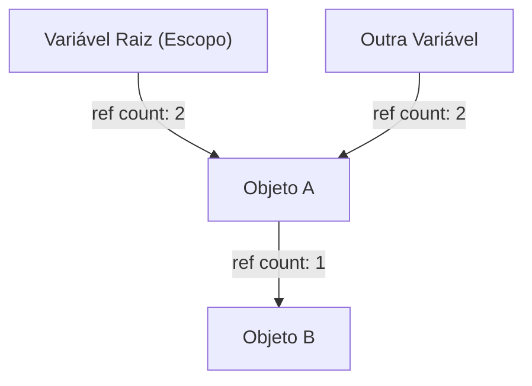
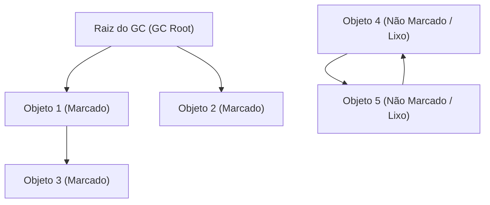
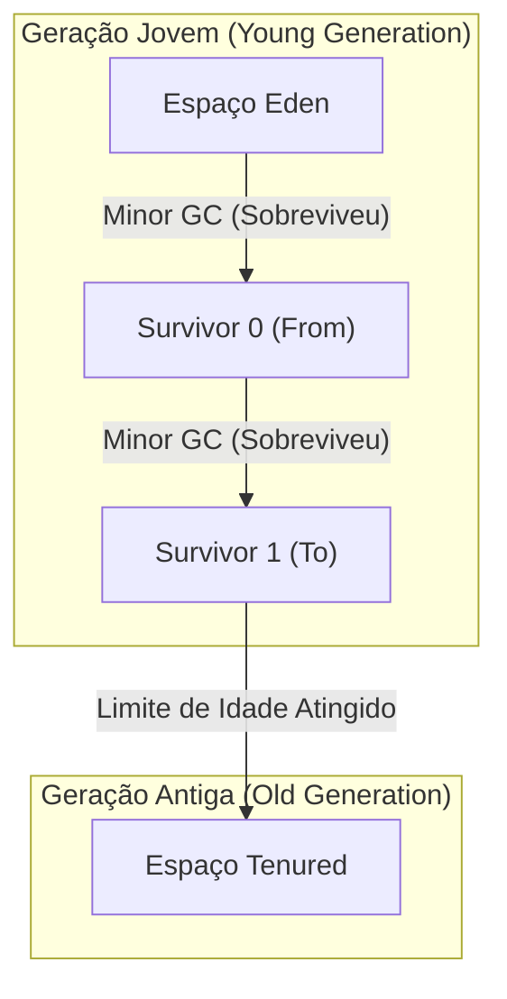

# A História da Evolução da Coleta de Lixo (GC): Do Gerenciamento Manual ao ZGC

No desenvolvimento de software moderno, a capacidade de programar sem a necessidade constante de se preocupar com o gerenciamento de memória se deve, em grande parte, à evolução de uma tecnologia chamada "Coleta de Lixo" (Garbage Collection - GC). Muitas das linguagens de programação amplamente utilizadas hoje, como Java, C#, Python, JavaScript e Go, possuem alguma forma de coleta de lixo embutida.

No entanto, o caminho até aqui não foi de forma alguma suave. Tudo começou em uma época onde os próprios programadores tinham controle total sobre a alocação e liberação de memória e, lutando contra inúmeros bugs que surgiam com a crescente complexidade dos programas, houve um histórico de automação gradual do gerenciamento de memória.

Neste artigo, vamos desvendar a história do gerenciamento de memória na ciência da computação e explorar em profundidade, do ponto de vista de algoritmos e arquitetura, o processo de evolução desde as limitações do gerenciamento manual de memória, passando por contagem de referências, marcação e varredura (Mark and Sweep), GC geracional, G1GC, até as incríveis tecnologias modernas de ZGC e Shenandoah.

---

## 1. A Era do Caos: Gerenciamento Manual de Memória e Suas Limitações

Na era em que a coleta de lixo não existia (e mesmo hoje em áreas onde linguagens como C, C++ e Rust ainda são predominantes), o gerenciamento de memória era de total responsabilidade do programador. O processo consistia no programa solicitando memória do SO (Sistema Operacional) quando necessário e retornando-a explicitamente ao SO quando não era mais precisa.

### O Mundo de `malloc` e `free`

Na linguagem C, funções da família `malloc` são usadas para alocação dinâmica de memória, e `free` é usado para liberá-la.

```c
#include <stdlib.h>
#include <stdio.h>

void process_data() {
    // Aloca memória para 100 inteiros no heap
    int* data = (int*)malloc(100 * sizeof(int));
    if (data == NULL) {
        // Tratamento de erro em caso de falha na alocação
        return;
    }

    // Processamento usando os dados
    for (int i = 0; i < 100; i++) {
        data[i] = i * 2;
    }

    // Libera a memória quando o processamento for concluído
    free(data);
}
```

A maior vantagem dessa abordagem era o "controle" e a "performance". Os programadores podiam saber exatamente quando e onde a memória era alocada e quando era liberada, na precisão de milissegundos. Nos primeiros sistemas de computadores com severas restrições de hardware, esse controle absoluto era essencial.

### Os 3 Grandes Pecados Causados Pelo Gerenciamento Manual

Contudo, à medida que a escala dos softwares crescia para dezenas de milhares a milhões de linhas de código, e múltiplas threads se entrelaçavam complexamente, o gerenciamento manual de memória começou a exceder os limites cognitivos humanos. Como resultado, os seguintes bugs graves tornaram-se frequentes:

1. **Vazamento de Memória (Memory Leak)**
   O problema de esquecer de liberar a memória alocada. Quando ocorre um vazamento de memória em um aplicativo de servidor de longa duração, a memória disponível diminui gradualmente e, por fim, o processo é encerrado à força pelo sistema operacional (OOM: Out Of Memory).

2. **Ponteiro Pendente (Dangling Pointer) e Uso Após Liberação (Use-After-Free)**
   Um bug onde um ponteiro que aponta para uma área de memória continua a ser usado mesmo após essa área ter sido liberada com `free`. A área de memória liberada pode ter sido realocada para novos dados, e acessar ou escrever nela corromperá dados completamente não relacionados. Isso se tornou um foco para vulnerabilidades de segurança (como a execução arbitrária de código).

3. **Liberação Dupla (Double Free)**
   O problema de chamar `free` duas vezes para a mesma área de memória. Isso destrói as estruturas de dados internas do alocador de memória (como a free list), causando travamentos (crashes) e falhas de segurança fatais.

```c
// Exemplo de Use-After-Free
int* ptr = malloc(sizeof(int));
*ptr = 42;
free(ptr);
// ... processamento complexo ...
*ptr = 100; // PERIGO! Gravando em uma área que já foi liberada
```

Para lidar com esses problemas, conceitos como RAII (Resource Acquisition Is Initialization) e smart pointers foram introduzidos em C++, mas a coleta de lixo nasceu da ideia: "Por que não tirar o gerenciamento de memória das mãos dos programadores e deixá-lo com o sistema?"

---

## 2. O Primeiro Passo em Direção à Automação: Contagem de Referências (Reference Counting)

A primeira grande abordagem para superar as limitações do gerenciamento manual de memória foi a "Contagem de Referências". Até hoje é amplamente utilizada em Python, PHP, Objective-C/Swift (ARC: Automatic Reference Counting) e `std::shared_ptr` de C++.

### O Princípio Básico da Contagem de Referências

O mecanismo de contagem de referências é muito simples. O cabeçalho de cada objeto possui um contador (contagem de referências) que indica "por quantas variáveis (ponteiros) este objeto está sendo referenciado atualmente".

- Quando um objeto é recém-criado e atribuído a uma variável, o contador é definido como `1`.
- Quando outra variável começa a referenciar o objeto, o contador é incrementado em `+1`.
- Quando uma variável sai de escopo e a referência é perdida, o contador é decrementado em `-1`.
- No momento em que o contador chega a `0`, é determinado que o objeto "não é mais referenciado por ninguém", e a memória é liberada imediatamente.



### Prós e Contras da Contagem de Referências

**Vantagens:**
1. **Liberação Determinística:** Como a memória é liberada no instante em que as referências chegam a zero, o ciclo de vida dos recursos é fácil de prever.
2. **Distribuição do Tempo de Pausa (Pause Time):** Como a carga da liberação de memória é distribuída ao longo da execução do programa, grandes tempos de pausa, como o "Stop-The-World (STW)" discutido posteriormente, são menos propensos a ocorrer.

**Desvantagens:**
1. **Sobrecarga de Atualização do Contador (Overhead):** Toda vez que uma atribuição de ponteiro ocorre, instruções de incremento e decremento devem ser executadas. Em um ambiente multithread, essa atualização de contador deve ser feita por meio de operações atômicas (como locks), tornando-se um grande gargalo de desempenho.
2. **Falha Fatal de Referência Circular (Circular Reference):** Essa é a maior fraqueza. Se o Objeto A referencia o Objeto B, e o Objeto B referencia o Objeto A, mesmo que nem A nem B estejam acessíveis de qualquer lugar do programa, os contadores nunca chegarão a `0` porque eles continuam referenciando um ao outro, resultando em um vazamento de memória permanente.

Para resolver a referência circular, os desenvolvedores precisam usar explicitamente "Referências Fracas (Weak References)", mas isso significa que "os desenvolvedores ainda devem estar cientes das dependências de memória", o que falha em ser uma automação completa.

---

## 3. O Desafio da Erradicação: Marcação e Varredura (Mark and Sweep) e GC de Rastreamento (Tracing GC)

O que resolveu fundamentalmente o problema de referências circulares e realizou o verdadeiro gerenciamento automático de memória foi a "Coleta de Lixo de Rastreamento (Tracing GC)", e seu algoritmo representativo é "Marcação e Varredura (Mark and Sweep)".

Este algoritmo revolucionário, criado por John McCarthy para a linguagem LISP, forma a base de quase todos os GCs avançados hoje em dia, como Java (JVM), Go e o motor V8 (JavaScript).

### O Conceito de Alcançabilidade (Reachability)

A Marcação e Varredura não rastreia "quem está referenciando quem" como faz a contagem de referências. Em vez disso, toma decisões de vida ou morte com base na "Alcançabilidade" - "Isso pode ser alcançado rastreando a partir do ponto de partida (raiz) do programa?".

Os pontos de partida, chamados **Raízes do GC (GC Roots)**, incluem:
- Variáveis locais na pilha de chamadas (call stack) da thread atualmente em execução.
- Variáveis globais e variáveis estáticas (static).
- Registradores da CPU.

### As Duas Fases da Marcação e Varredura

Como o nome sugere, o algoritmo consiste em duas fases.

1. **Fase de Marcação (Mark Phase):**
   Partindo das raízes do GC, ele segue os ponteiros e coloca uma marca (mark) de "vivo (Live)" em todos os objetos acessíveis. Isso é frequentemente implementado definindo um único bit (mark bit) no cabeçalho do objeto.

2. **Fase de Varredura (Sweep Phase):**
   Ele escaneia (varre) toda a memória heap do início ao fim. Objetos que não foram marcados são determinados como "lixo que não pode mais ser alcançado a partir do programa (Garbage)", e a área de memória é recuperada e devolvida à Lista Livre (Free List). Objetos marcados têm suas marcas limpas para o próximo ciclo de GC.


*(No diagrama acima, os Objetos 4 e 5 possuem referência circular, mas como não podem ser alcançados pela Raiz do GC, eles são recuperados juntos como Lixo.)*

### Stop-The-World (STW) e Fragmentação

Marcação e Varredura parecia ser o método perfeito para resolver referências circulares, mas veio com um grande preço.

O primeiro preço foi o **Stop-The-World (STW)**.
Durante o processamento da marcação, se as threads da aplicação (chamadas de mutators) alterassem as relações de referência dos objetos, haveria o risco de perder objetos vivos. Portanto, nos primeiros GCs, era necessário parar completamente todas as threads da aplicação durante as fases de marcação e varredura. Quanto maior o tamanho do heap, esse tempo de pausa poderia durar de segundos a dezenas de minutos, sendo fatal para sistemas que exigiam tempo real.

O segundo preço era a **Fragmentação de Memória (Fragmentation)**.
As ruínas deixadas após a coleta do lixo na fase de varredura se espalhavam por todo o heap como um queijo suíço. O espaço livre total podia ser suficiente, mas grandes blocos contíguos de memória não podiam ser alocados, resultando em erros OutOfMemoryError.

Para resolver isso, uma técnica chamada "Marcação e Compactação (Mark and Compact)" foi introduzida. Ela move os objetos vivos para um lado da área de memória (compactação) para criar um espaço livre grande e contínuo. No entanto, como as localizações dos objetos (endereços de memória) mudavam, os processos para atualizar todos os ponteiros que referenciam os objetos eram necessários, causando tempos ainda mais longos de STW.

---

## 4. O Nascimento do GC Geracional e a Introdução das Heurísticas

Para superar a ineficiência de "escanear todo o heap a cada vez" em Mark and Sweep, a "Coleta de Lixo Geracional (Generational GC)" foi concebida. Pode-se dizer que essa é uma das heurísticas (otimizações baseadas em regras de ouro) mais bem-sucedidas na ciência da computação.

### A Hipótese Geracional Fraca (Weak Generational Hypothesis)

Pesquisadores da IBM e de outros lugares conduziram perfilamento de memória de várias aplicações e descobriram uma forte regra.

**"A maioria dos objetos recém-alocados tornam-se inúteis rapidamente (são de vida curta)."**
**"Objetos mais antigos tendem a sobreviver por um longo período depois."**

Por exemplo, strings criadas temporariamente dentro de um loop ou objetos DTO armazenando valores de retorno de métodos tornam-se lixo após alguns milissegundos. Por outro lado, dados em cache ou pools de conexão sobrevivem até o término da aplicação.

### Divisão do Heap: Young e Old

Com base nesta hipótese, o GC Geracional divide o heap logicamente em gerações.

1. **Geração Jovem (Young Generation):**
   É o lugar onde objetos recém-criados são primeiramente alocados. O espaço Young é posteriormente subdividido em "Eden" e dois "espaços Survivor" (From/To).
   Objetos são inicialmente alocados no Eden. Quando o Eden fica cheio, ocorre um **Minor GC**.
   No Minor GC, apenas as operações de marcação e cópia são realizadas dentro do espaço Young. Os objetos sobreviventes são movidos para o espaço Survivor. Apenas os objetos que sobrevivem a várias rodadas de Minor GCs (ganham "idade") são promovidos (Promotion) à Geração Antiga como "objetos de vida longa".
   Como existem muitos objetos de vida curta, pouquíssimos objetos sobrevivem na Geração Jovem. As cópias são completadas de forma extremamente rápida, mantendo o tempo de STW extremamente curto.

2. **Geração Antiga (Old Generation / Tenured):**
   É a área onde os objetos que sobreviveram por longos períodos de tempo são colocados. Quando a Geração Antiga fica cheia, um **Major GC (Full GC)**, direcionado a todo o heap, ocorre.
   Um Full GC leva muito tempo, mas uma vez que a maioria dos objetos de curta duração já foi varrida durante o Minor GC na Geração Jovem, a frequência do próprio Full GC pode ser drasticamente reduzida.



### Otimização usando Tabela de Cartões (Card Table)

Para realizar o GC Geracional, havia outro desafio técnico: "Quando um objeto na Geração Antiga referencia um objeto na Geração Jovem, como executar com segurança um GC visando apenas a Geração Jovem (Minor GC)?". Rastreando a partir das raízes do GC, você seria forçado a escanear a Geração Antiga inteira.

Para resolver isso, foi introduzida uma estrutura de dados chamada "Tabela de Cartões (Card Table)". A Geração Antiga é dividida em pequenas páginas (cartões). Quando há uma gravação de referência da Geração Antiga para a Jovem, um código especial chamado Barreira de Gravação (Write Barrier) é inserido, marcando o cartão específico como "Sujo (Dirty)". Durante um Minor GC, além das raízes do GC, apenas esses cartões "Sujos" precisam ser escaneados. O custo de escanear toda a Geração Antiga foi completamente eliminado.

Com o advento dos GCs Geracionais (como CMS: Concurrent Mark Sweep), a linguagem Java obteve grande domínio de participação em ambientes corporativos (Enterprise).

---

## 5. Lidando com Heaps de Grande Capacidade: A Ascensão do G1GC (Garbage-First GC)

Com o declínio nos preços da memória, a memória alocada nos servidores se tornou massiva—indo de alguns GBs para dezenas a centenas de GBs. A arquitetura de GC geracional tradicional enfrentava agora um novo obstáculo.
Ao acionar um Full GC num heap de dezenas de GBs, mesmo utilizando GCs concorrentes como CMS, uma pausa STW da ordem de segundos ocorria ao resolver a fragmentação (compactação).

Para superar isso, o **G1GC (Garbage-First GC)** foi adotado como o GC padrão a partir do Java 9.

### Arquitetura Baseada em Regiões (Regions)

A maior característica do G1GC foi o abandono da divisão física e monolítica contígua em "Geração Jovem" e "Geração Antiga".
Em vez disso, ele dividiu todo o heap em milhares de áreas muito menores e de tamanho idêntico (geralmente 1MB a 32MB) chamadas de "Regiões (Regions)", muito semelhante a um tabuleiro de xadrez.

Cada região, dinamicamente, assume um dos papéis: Eden, Survivor ou Old.

### O Significado de "Garbage-First" e Modelos Preditivos

O nome "Garbage-First" do G1GC vem de sua estratégia de coleta.
Através de marcação concorrente (conduzindo o processo de marcação em paralelo à execução da aplicação), o G1GC constantemente calcula "quais regiões contêm o maior número de objetos lixo (i.e., os que têm menos objetos vivos)".

Durante um GC, em vez de compactar o heap inteiro de uma vez, o G1GC recupera as áreas **"priorizando as regiões com mais lixo (as que têm mais alto retorno e menos sobreviventes)"**.

Ainda além, o G1GC suporta abordagens de "soft real-time" que tentam se adequar aos "tempos de pausa almejados (por ex., 200 milissegundos)" estabelecidos pelo usuário. Ao basear as estatísticas nos ciclos GC anteriores, ele utiliza heurísticas para estimar "quantas regiões nós podemos coletar (copiar) nos 200 ms disponíveis desta vez", definindo dinamicamente o número de regiões a coletar (CSet: Collection Set).

Isso possibilitou rodar heaps de dezenas de GBs, entregando tempos de STW previsíveis e curtos.

---

## 6. O Ápice dos GCs Modernos: O Mundo de Milissegundos Desbravado por ZGC e Shenandoah

O advento do G1GC ajudou em muito o problema do tamanho massivo de heap. Porém, o problema básico, de que "conforme os tamanhos do heap aumentam, os tempos de STW acabarão aumentando proporcionalmente" (em particular devido às atualizações de ponteiros durante a re-alocação e compactação do objeto), permaneceu não completamente resolvido.

Sistemas financeiros, de negociação de alta frequência e servidores de jogos massivos em tempo real têm o rigoroso requisito de que **"Nenhuma pausa acima de um ou alguns milissegundos é aceitável, não importa em que condições."** Visando atender esses gargalos, arquiteturas definitivas de GC foram criadas para restringir STW ao nível sub-milissegundo, mesmo com heaps de centenas de terabytes (TB). Estes são o **ZGC (Z Garbage Collector)** e o **Shenandoah GC**.

### A Mágica do Reposicionamento Concorrente (Concurrent Relocation)

Em GCs passados, a maior razão pela qual os eventos STW ocorreriam era a "Movimentação de Objetos (Compactação)". Ao copiar um objeto para o novo espaço de memória, a aplicação tinha que ser pausada enquanto se reescreviam milhões de ponteiros que antes apontavam para aquele objeto. Fazer a aplicação continuar acessando as velhas posições de memória a sobreporia e a arruinaria.

ZGC e Shenandoah superaram isso fazendo até mesmo a **"movimentação dos objetos e atualização dos ponteiros concorrentemente (em paralelo) sem precisar pausar as threads de aplicação"**. É um feito quase mágico.

### A Tecnologia Central do ZGC: Ponteiros Coloridos (Colored Pointers) e Barreiras de Leitura (Load Barriers)

O ZGC, liderado em desenvolvimento pela Oracle, explorou plenamente e implementou uma tecnologia surpreendente de características para arquiteturas 64 bits chamadas **Ponteiros Coloridos (Colored Pointers)**.

Na extensão dos endereços do espaço de ponteiros de 64 bits, apenas as posições dos 44 bits mais baixos são verdadeiramente usados ​​como os endereços de memória (em um arranjo máximo de cerca de 16TB). O ZGC se apropria de um pouco dos resíduos "altos" transformando em uma extensão para armazenamento "metadados" ("cor").
Esses bits da cor abrigam situações de estado tais como "Este ponteiro já foi marcado (Marked)?", ou "O objeto ao qual ele aponta foi movido (Relocated)?".

```
[ Não Usado ] [ Marked0 ] [ Marked1 ] [ Remapped ] [ Finalizable ] [   Endereço do Objeto (44 bits)   ]
   ...            1           0           0              0        1010101010101010...
```

Adicionalmente, nas etapas em que uma aplicação vai carregar (Ler - Load) as referências a tais objetos, é dinamicamente inserida a instrução assemble bem curta apelidada de **Barreira de Leitura (Load Barrier)**.

**Como Funciona a Barreira de Leitura:**
1. As threads da aplicação leem os ponteiros.
2. As "Cores (metadados)" do ponteiro são checadas.
3. Se o objeto encontra-se no status "sendo transportado pelas re-posições (ou já posicionado numa outra via, porém o seu apontador em curso exibe ainda a localização antiga)" devido ao GC, é momento de intervenção da Barreira de Leitura.
4. Ele adquire/checa o atual Endereço de repasse (Forwarding Table) gerenciado pelo ZGC para descobrir sua localidade definitiva correta.
5. O ponteiro é diretamente atualizado em endereço com destino na nova localidade (Tratativa própria do método chamada: Auto-Cura / Self-Healing) entregando perfeitamente às aplicações, seus objetos nos novos endereços.

Pelos propósitos desse mecanismo Auto-Curativo (Self-Healing), mesmo havendo momentos nos quais linhas (threads) de GC estão vigorosamente no plano de fundo fazendo a locomoção de muitos objetos, o fluxo da aplicação se comunica segura e estritamente rumo a acessar "objetos da localidade realística mais exata/modernizada e validada". Os períodos STW permanecem drasticamente reduzidos ao que se restringe pelas "varreduras curtas e breves originando das GC Roots" (muitas vezes abaixo de 1 milissegundo de duração) – O que faz esse curto tempo de recusa persistir igual não variando sobre qual for o cenário: a dimensão do heap (10MBs ou 16TBs).

### A Tecnologia Central de Shenandoah: Ponteiros de Brooks (Brooks Pointers)

Liderado pela Red Hat, o Shenandoah GC também é hábil a desempenhar Reposicionamento Concorrente na mesma finalidade, entretanto emprega diferente estratégia de abordagem em uso.

Shenandoah acrescenta à cabeça do espaço total de todos os objetos os assim chamados **Ponteiros de Brooks (Brooks Pointer)** a título referencial de transferência (Forwarding).
Quando em repouso habitual, o local aponta de fato "para ele mesmo". Ao acontecer porém do GC engatilhar a transição/cópia dos objetos em área nova, esse tal antigo ponteiro Brooks da velha versão de objetos sofre de substituição, a reescrita (Atômica), informando destarte agora, em nova localidade o local exato rumo ao "endereço recém construído aos objetos na nova zona".

Por decorrência destas ações durante os processamentos de leitura ou gravação conduzidos pelos objetos das aplicações, as mesmas fazem sempre travessias contínuas mediando a estes trânsitos aos ponteiros Brooks (Barreira de leitura - barreira de escrita); este mecanismo proporciona o redirecionamento com total acessibilidade contínua – transparente a seu novo local (seja nas instâncias ou processos da própria ação da transição em acontecimento).

---

## Conclusão: O Futuro do Gerenciamento de Memória

Com os tempos conturbados e o caótico histórico propiciado no surgimento pelas tratativas de C por meio dos comandos `malloc/free`, e vindo depois os métodos primórdios criados baseados aos Mark-and-Sweep do LISP; então percorremos e vimos a expansões das épocas gloriosas ao mercado pelas versões suportadas Geracionais. Mais tarde amadurecendo-nos às capacidades monumentais das demandas gerando respostas em Heaps enormes (G1GC), culminamos destarte sobre inovações estupendas em limitações aos atrasos baixos extremos da contemporaneidade do mundo: Shenandoah e ZGC.

A história da coleta de lixo é, em si mesma, a história do desafio humano de "como lidar com a complexidade do software".
Atualmente, através da fusão da evolução de hardware (otimização de linhas de cache e previsão de ramificação de CPU) e algoritmos de software, o antes impossível "GC totalmente concorrente e sem paradas" se tornou realidade.

Outras abordagens, como o gerenciamento estático de memória baseado em um "modelo de propriedade em tempo de compilação (compile-time ownership)" como no Rust, também estão ganhando destaque. No entanto, em aplicações de larga escala que lidam com gráficos de objetos complexos e dinâmicos, a coleta de lixo continuará sendo uma infraestrutura essencial no futuro.
Ocasionalmente, você pode querer reservar um momento para refletir sobre os algoritmos GC, trabalhando silenciosamente nos bastidores com extrema técnica e habilidade, continuando a gerenciar perfeitamente a memória.

---
*Referência: The Garbage Collection Handbook, OpenJDK Wiki, vários JEPs (JEP 333, JEP 189)*
