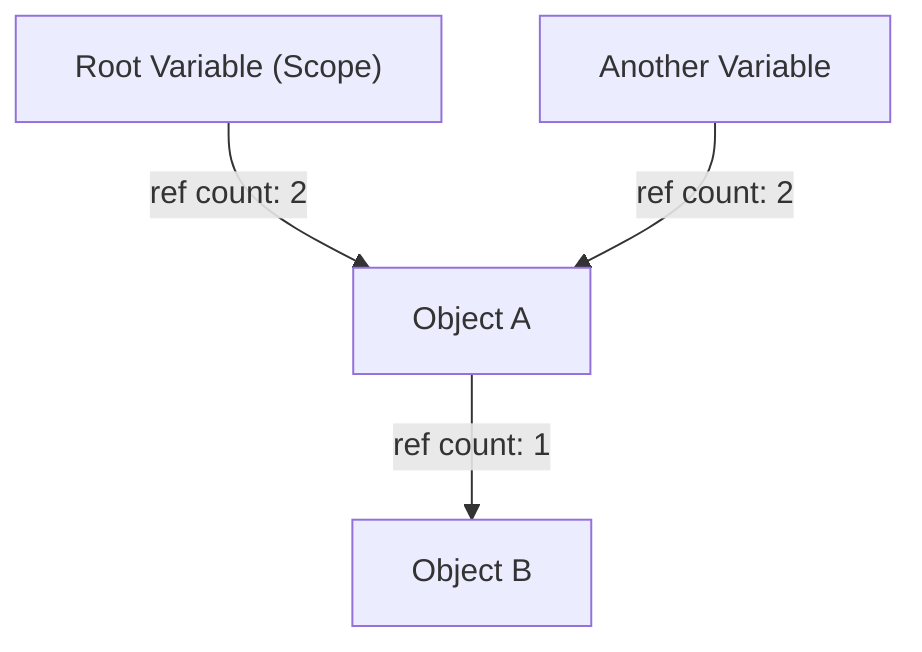
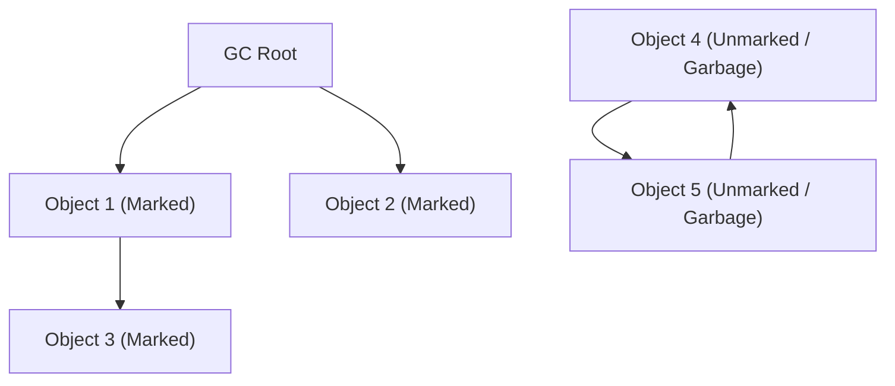
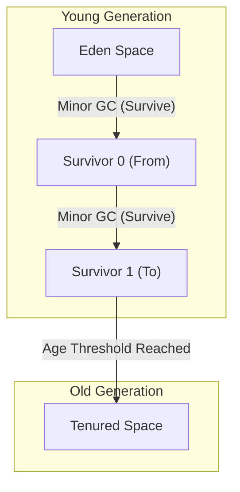

# История эволюции сборки мусора (GC): от ручного управления к ZGC

В современной разработке программного обеспечения возможность программировать, не задумываясь об управлении памятью, — это всецело заслуга эволюции технологии под названием «Сборка мусора» (Garbage Collection, GC). Большинство широко используемых сегодня языков программирования, таких как Java, C#, Python, JavaScript, Go и другие, в той или иной форме имеют встроенную сборку мусора.

Однако путь к этому отнюдь не был гладким. Начиная с эпохи, когда программисты сами полностью контролировали выделение и освобождение памяти, это была история постепенной автоматизации управления памятью в борьбе с многочисленными ошибками, возникающими по мере усложнения программ.

В этой статье мы проследим историю управления памятью в информатике и подробно рассмотрим процесс эволюции с точки зрения алгоритмов и архитектуры: от ограничений ручного управления памятью к подсчету ссылок (reference counting), алгоритму «маркировка и очистка» (mark and sweep), сборке мусора по поколениям (generational GC), G1GC, и, наконец, до потрясающих современных технологий, таких как ZGC и Shenandoah.

---

## 1. Эпоха хаоса: ручное управление памятью и его ограничения

В эпоху до появления сборки мусора (а в областях, где доминируют такие языки, как C, C++ и Rust, это актуально и сегодня) управление памятью было полной ответственностью программиста. Это процесс, при котором программа запрашивает память у операционной системы (ОС), когда она нужна, и явно возвращает её ОС, когда она больше не требуется.

### Мир `malloc` и `free`

В языке C для динамического выделения памяти используется семейство функций `malloc`, а для её освобождения — `free`.

```c
#include <stdlib.h>
#include <stdio.h>

void process_data() {
    // Выделение памяти в куче для 100 целых чисел
    int* data = (int*)malloc(100 * sizeof(int));
    if (data == NULL) {
        // Обработка ошибки при неудачном выделении памяти
        return;
    }

    // Обработка данных
    for (int i = 0; i < 100; i++) {
        data[i] = i * 2;
    }

    // Освобождение памяти по завершении работы
    free(data);
}
```

Главное преимущество этого подхода — «контроль» и «производительность». Программист мог с точностью до миллисекунд знать, когда и где выделяется память и когда она освобождается. В ранних компьютерных системах со строгими аппаратными ограничениями такой абсолютный контроль был необходим.

### Три смертных греха ручного управления

Однако по мере того как размер программного обеспечения разрастался до десятков и сотен тысяч строк кода, а множество потоков сложно переплетались, ручное управление памятью начало выходить за пределы когнитивных способностей человека. В результате стали часто возникать следующие серьезные ошибки:

1. **Утечка памяти (Memory Leak)**
   Проблема забытого освобождения выделенной памяти. Если утечка памяти происходит в серверном приложении, работающем длительное время, объем доступной памяти постепенно сокращается, и в конечном итоге процесс принудительно завершается операционной системой (OOM: Out Of Memory).

2. **Висючая ссылка (Dangling Pointer) и использование после освобождения (Use-After-Free)**
   Ошибка, при которой программа продолжает использовать указатель на область памяти даже после того, как она была освобождена с помощью `free`. В освобожденной области памяти могут быть уже размещены другие новые данные, и доступ к ней или запись в нее приведет к разрушению совершенно не связанных данных. Это стало питательной средой для уязвимостей безопасности (таких как выполнение произвольного кода).

3. **Двойное освобождение (Double Free)**
   Проблема двойного вызова `free` для одной и той же области памяти. Это разрушает внутренние структуры данных аллокатора памяти (например, список свободных блоков) и приводит к сбоям или фатальным дырам в безопасности.

```c
// Пример Use-After-Free
int* ptr = malloc(sizeof(int));
*ptr = 42;
free(ptr);
// ... сложная логика ...
*ptr = 100; // Опасно! Запись в уже освобожденную область
```

Для решения этих проблем в C++ были введены такие концепции, как RAII (Resource Acquisition Is Initialization) и умные указатели, но именно идея «а нельзя ли вообще забрать управление памятью у программиста и доверить его системе?» породила сборку мусора.

---

## 2. Первый шаг к автоматизации: Подсчет ссылок (Reference Counting)

Первым крупным подходом к преодолению ограничений ручного управления памятью стал «подсчет ссылок». Этот метод до сих пор широко применяется в Python, PHP, Objective-C/Swift (ARC: Automatic Reference Counting), а также в `std::shared_ptr` в C++.

### Базовый принцип подсчета ссылок

Механизм подсчета ссылок предельно прост. В области заголовка каждого объекта находится счетчик (счетчик ссылок), который показывает: «из скольких переменных (указателей) в данный момент есть ссылка на этот объект».

- Когда объект создается и присваивается переменной, его счетчик устанавливается в `1`.
- Когда другая переменная начинает ссылаться на этот объект, счетчик увеличивается на `+1`.
- Когда переменная выходит из области видимости или ссылка удаляется, счетчик уменьшается на `-1`.
- В тот момент, когда счетчик достигает `0`, гарантируется, что «на объект больше нет ссылок», и его память немедленно освобождается.



### Преимущества и недостатки подсчета ссылок

**Преимущества:**
1. **Детерминированное освобождение:** Память освобождается ровно в тот момент, когда количество ссылок становится равным нулю, что делает жизненный цикл ресурсов предсказуемым.
2. **Распределение пауз (Pause Time):** Нагрузка по освобождению памяти распределяется по всему времени выполнения программы, что позволяет избежать длительных пауз «Stop-The-World» (STW), о которых пойдет речь позже.

**Недостатки:**
1. **Накладные расходы на обновление счетчика:** При каждом присваивании указателя необходимо выполнять инструкции инкремента и декремента. В многопоточной среде эти обновления счетчиков должны выполняться атомарными операциями (например, с использованием блокировок), что становится серьезным узким местом производительности.
2. **Фатальный недостаток циклических ссылок (Circular Reference):** Это главная слабость. Если объект A ссылается на объект B, а объект B ссылается на объект A, то даже если программа больше не имеет доступа к A и B, их счетчики никогда не станут равными `0`, поскольку они ссылаются друг на друга, что приводит к постоянной утечке памяти.

Для борьбы с циклическими ссылками разработчикам приходится явно использовать «слабые ссылки» (Weak Reference), что, в конечном счете, возвращает к тому, что «разработчик должен помнить о зависимостях памяти», и это уже нельзя назвать полной автоматизацией.

---

## 3. Вызов по искоренению проблем: Маркировка и очистка (Mark and Sweep) и трассирующая сборка мусора

Фундаментально решила проблему циклических ссылок и реализовала действительно автоматическое управление памятью «трассирующая сборка мусора», 대표ным алгоритмом которой является «Маркировка и очистка» (Mark and Sweep).

Этот революционный алгоритм, придуманный Джоном Маккарти для языка LISP, лежит в основе почти всех продвинутых сборщиков мусора современности, включая Java (JVM), Go и движок V8 (JavaScript).

### Концепция достижимости (Reachability)

Алгоритм mark-and-sweep, в отличие от подсчета ссылок, не отслеживает, «кто ссылается». Вместо этого он определяет судьбу объекта на основе того, «можно ли до него добраться (Reachability), начиная от корневых узлов программы».

К корневым узлам, называемым **GC Roots**, относятся:
- Локальные переменные в стеках вызовов текущих выполняющихся потоков.
- Глобальные и статические (static) переменные.
- Регистры процессора.

### Две фазы Mark and Sweep

Как следует из названия, алгоритм состоит из двух фаз.

1. **Фаза маркировки (Mark Phase):**
   Начиная от корней GC, сборщик обходит все указатели и помечает (ставит метку) все достижимые объекты как «живые» (Live). Часто это реализуется путем установки одного бита (mark bit) в заголовке объекта.

2. **Фаза очистки (Sweep Phase):**
   Сборщик сканирует (очищает) всю память кучи от начала до конца. Объекты без метки считаются «мусором (Garbage), к которому программа больше не имеет доступа», и занимаемая ими память освобождается, возвращаясь в список свободных блоков (Free List). С отмеченных объектов метка снимается для подготовки к следующему циклу GC.


*(Объекты Obj4 и Obj5 на рисунке выше имеют циклическую ссылку, но поскольку они недостижимы из GC Root, они собираются вместе как мусор.)*

### Stop-The-World (STW) и фрагментация

Хотя mark-and-sweep казался идеальным методом для решения проблемы циклических ссылок, за него пришлось заплатить высокую цену.

Первая цена — это **Stop-The-World (STW)**.
Если во время выполнения фазы маркировки потоки приложения (называемые мутаторами) изменят связи между объектами, существует риск пропустить живой объект. Поэтому в ранних версиях GC на время между маркировкой и очисткой приходилось полностью останавливать все потоки приложения. По мере увеличения размера кучи это время остановки могло достигать от нескольких секунд до десятков минут, что было фатально для систем, требующих работы в реальном времени.

Вторая цена — это **фрагментация памяти**.
После очистки мусора в фазе sweep в куче остаются свободные участки, разбросанные подобно дыркам в швейцарском сыре. Даже если общий объем свободной памяти достаточен, невозможно выделить большой непрерывный блок памяти, что в итоге приводит к ошибке OutOfMemoryError.

Для решения этой проблемы появился метод «маркировка и сжатие» (Mark and Compact). Он сдвигает все живые объекты в одну сторону области памяти (компактизация), создавая тем самым огромный непрерывный свободный блок. Однако, поскольку расположение (адрес в памяти) объекта меняется, требуется перезапись всех указателей, ссылающихся на этот объект, что вызывает еще более длительные паузы STW.

---

## 4. Рождение сборки мусора по поколениям и внедрение эвристики

Чтобы преодолеть неэффективность алгоритма mark-and-sweep, который «сканирует всю кучу каждый раз», была разработана «Сборка мусора по поколениям» (Generational GC). Это можно назвать одной из самых успешных эвристик (оптимизаций, основанных на эмпирических правилах) в информатике.

### Слабая гипотеза о поколениях (Weak Generational Hypothesis)

Исследователи из IBM и других компаний, проведя профилирование памяти различных приложений, обнаружили сильную закономерность.

**«Большинство вновь созданных объектов быстро становятся ненужными (являются короткоживущими).»**
**«Старые объекты, как правило, живут долго.»**

Например, строки, временно создаваемые в цикле, или объекты DTO, хранящие возвращаемое значение метода, превращаются в мусор уже через несколько миллисекунд. С другой стороны, кэшированные данные или пулы соединений продолжают существовать до самого завершения приложения.

### Разделение кучи: Young и Old

Основываясь на этой гипотезе, сборщик мусора по поколениям логически разделяет память кучи.

1. **Молодое поколение (Young Generation):**
   Это место, куда первоначально помещаются вновь созданные объекты. Область Young дополнительно разделяется на пространство «Eden» и два пространства «Survivor» (From/To).
   Объекты сначала выделяются в Eden. Когда Eden заполняется, происходит **Minor GC** (малая сборка).
   Во время Minor GC алгоритм копирования выполняется только внутри области Young. Выжившие объекты перемещаются в пространство Survivor, и только те объекты, которые пережили несколько циклов Minor GC (достигли определенного возраста), «повышаются» (Promotion) до «долгоживущих объектов» и переходят в область Old.
   Поскольку большинство объектов короткоживущие, количество выживших объектов в области Young очень мало, что позволяет быстро завершить копирование и минимизировать время STW.

2. **Старое поколение (Old Generation / Tenured):**
   Область, где размещаются долгоживущие объекты. Когда область Old заполняется, запускается **Major GC (Full GC)**, который охватывает всю кучу целиком.
   Full GC занимает много времени, но поскольку короткоживущие объекты уже устранены во время Minor GC в области Young, частота возникновения Full GC кардинально снижается.



### Оптимизация с помощью таблицы карт (Card Table)

Для реализации сборки мусора по поколениям существовала еще одна техническая проблема: «Как безопасно выполнить GC только для области Young (Minor GC), если объекты из области Old ссылаются на объекты из области Young?». Если просто идти от корней GC, пришлось бы сканировать всю область Old.

Для решения этого была введена структура данных под названием «Таблица карт» (Card Table). Область Old разделяется на мелкие страницы (карты), и когда происходит запись ссылки из Old в Young, вставляется специальный код, называемый барьером записи (Write Barrier), который помечает соответствующую карту как «Грязную» (Dirty). Во время Minor GC достаточно просканировать только эти Dirty-карты в дополнение к корням GC, что полностью устраняет затраты на сканирование всей области Old.

С появлением сборки мусора по поколениям (например, CMS: Concurrent Mark Sweep), Java завоевала доминирующую долю на корпоративном рынке.

---

## 5. Поддержка куч большого объема: Расцвет G1GC (Garbage-First GC)

По мере того как цены на память падали, а объем памяти, устанавливаемой на серверах, рос с нескольких гигабайт до десятков и сотен гигабайт, традиционная архитектура GC по поколениям столкнулась с новым препятствием.
Когда в куче объемом в десятки гигабайт происходит Full GC, даже при использовании конкурентного GC, такого как CMS, во время устранения фрагментации (компактизации) возникают паузы STW длительностью в секунды.

Для решения этой проблемы, начиная с Java 9, в качестве GC по умолчанию был принят **G1GC (Garbage-First GC)**.

### Архитектура на основе регионов (Region)

Главной особенностью G1GC является отказ от традиционного физического разделения на огромные непрерывные блоки памяти «Young» и «Old».
Вместо этого вся куча разбивается на тысячи небольших областей одинакового размера (обычно от 1 до 32 МБ), называемых «Регионами» (Region), подобно клеткам на шахматной доске.

Каждый регион динамически выполняет роль либо Eden, либо Survivor, либо Old.

### Значение "Garbage-First" и предсказательная модель

Название "Garbage-First" (Сначала мусор) в G1GC происходит от его стратегии сбора.
С помощью конкурентной маркировки (выполнения фазы маркировки параллельно с работой приложения) G1GC постоянно вычисляет, «сколько мусорных объектов содержит каждый регион (то есть, как мало в нем выживших объектов)».

Во время сборки G1GC не компактизирует всю кучу целиком, а **«в первую очередь собирает те регионы, в которых больше всего мусора и эффективность сбора наивысшая (наименьшее число выживших объектов)»**.

Более того, G1GC обладает свойствами мягкого реального времени, пытаясь соблюдать заданное пользователем «целевое время паузы (например, 200 миллисекунд)». Опираясь на статистику прошлых сборок, он эвристически рассчитывает, «сколько регионов можно собрать (скопировать) в этот раз, чтобы уложиться в 200 миллисекунд», и динамически определяет количество регионов для сбора (CSet: Collection Set).

Это позволило использовать предсказуемые и короткие паузы STW даже при размерах кучи в десятки гигабайт.

---

## 6. Вершина современных GC: Мир миллисекунд, открываемый ZGC и Shenandoah

Хотя появление G1GC значительно улучшило ситуацию с огромными кучами, фундаментальная проблема «с увеличением размера кучи время STW рано или поздно начнет пропорционально расти» (особенно из-за обновления указателей при перераспределении и компактизации объектов) не была решена до конца.

Для удовлетворения строгих требований, когда **«ни при каких обстоятельствах не допускаются паузы более нескольких миллисекунд»** (например, в финансовых системах, высокочастотном трейдинге, масштабных игровых серверах реального времени), были созданы совершенные архитектуры GC, способные удерживать время STW на уровне менее 1 миллисекунды (субмиллисекунды) даже для куч объемом в несколько терабайт (ТБ). Это **ZGC (Z Garbage Collector)** и **Shenandoah GC**.

### Магия конкурентного перераспределения (Concurrent Relocation)

Основной причиной возникновения STW в традиционных GC было «перемещение объектов (компактизация)». После копирования объекта в новую область памяти приходилось останавливать приложение на время обновления миллионов указателей, ссылающихся на этот объект. Если приложение не остановить, оно может попытаться получить доступ к старому адресу памяти, что приведет к разрушению данных.

ZGC и Shenandoah совершили магический подвиг, выполняя **даже «перемещение объектов и обновление указателей» конкурентно (параллельно), не останавливая потоки приложения**.

### Ключевая технология ZGC: Цветные указатели (Colored Pointers) и барьеры чтения (Load Barriers)

ZGC, разработанный под руководством Oracle, в максимальной степени использует особенности 64-битной архитектуры, применяя революционную технологию **цветных указателей (Colored Pointers)**.

В 64-битном адресном пространстве указателей фактически в качестве адресов памяти используются только младшие 44 бита (до 16 ТБ). ZGC использует часть оставшихся старших битов в качестве «метаданных (цвета)».
В этих цветовых битах сохраняется состояние: «Отмечен ли уже этот указатель?» или «Перемещается ли (Relocated) объект, на который ссылается этот указатель?».

```
[ Unused ] [ Marked0 ] [ Marked1 ] [ Remapped ] [ Finalizable ] [   Object Address (44 bits)   ]
   ...          1           0           0              0        1010101010101010...
```

Кроме того, во все места, где приложение загружает (Load) ссылку на объект, динамически вставляется крошечная ассемблерная инструкция, называемая **барьером чтения (Load Barrier)**.

**Как работает барьер чтения:**
1. Поток приложения считывает указатель.
2. Проверяется «цвет (метаданные)» указателя.
3. Если объект «в процессе перемещения в другое место сборщиком мусора (или уже перемещен, но этот указатель все еще ссылается на старый адрес)», вмешивается барьер чтения.
4. Он обращается к «Таблице перенаправления» (Forwarding Table), управляемой ZGC, и получает новый правильный адрес.
5. Он перезаписывает сам указатель новым адресом (самовосстановление - Self-Healing) и возвращает приложению объект по новому адресу.

Благодаря этому механизму самовосстановления, даже когда потоки GC активно перемещают объекты в фоновом режиме, потоки приложения всегда могут безопасно получить доступ к «правильному актуальному объекту». STW сводится лишь к крайне ограниченным фазам, таким как «сканирование корней GC» (обычно менее 1 миллисекунды), и время паузы остается неизменным, будь размер кучи 10 МБ или 16 ТБ.

### Ключевая технология Shenandoah: Указатели Брукса (Brooks Pointers)

Shenandoah GC, разработанный под руководством Red Hat, также реализует конкурентное перераспределение, но использует другой подход.

Shenandoah размещает перед областью заголовка каждого объекта указатель перенаправления, называемый **Указателем Брукса (Brooks Pointer)**.
В обычном состоянии этот указатель ссылается «сам на себя». Однако, когда GC начинает копировать объект в новую область, он атомарно перезаписывает указатель Брукса старого объекта на «адрес нового объекта».

Когда приложение читает или пишет в объект, этот процесс всегда проходит через указатель Брукса (с использованием барьеров чтения и записи), что позволяет прозрачно перенаправлять доступ к новому объекту, даже если он находится в процессе перемещения.

---

## Заключение: Будущее управления памятью

Начиная с эпохи хаоса с `malloc/free` в C, к рождению mark-and-sweep в LISP, затем к GC по поколениям, поддерживающему корпоративный софт, к G1GC для управления огромными кучами, и, наконец, к ZGC и Shenandoah, обеспечивающим экстремально низкие задержки.

История сборки мусора — это не что иное, как история попыток человечества «справиться со сложностью программного обеспечения».
Сегодня, благодаря объединению эволюции аппаратного обеспечения (предсказание ветвлений в CPU и оптимизация строк кэша) и программных алгоритмов, «полностью конкурентный GC без остановок», когда-то считавшийся невозможным, стал реальностью.

Хотя на сцену выходят и другие подходы, такие как статическое управление памятью с помощью «модели владения на этапе компиляции», как в Rust, в крупномасштабных приложениях, работающих с динамичными и сложными графами объектов, сборка мусора по-прежнему останется незаменимой инфраструктурой.
Как насчет того, чтобы иногда вспоминать алгоритмы GC, которые тихо, но с невероятным мастерством продолжают управлять памятью на заднем плане?

---
*Reference: The Garbage Collection Handbook, OpenJDK Wiki, various JEPs (JEP 333, JEP 189)*
