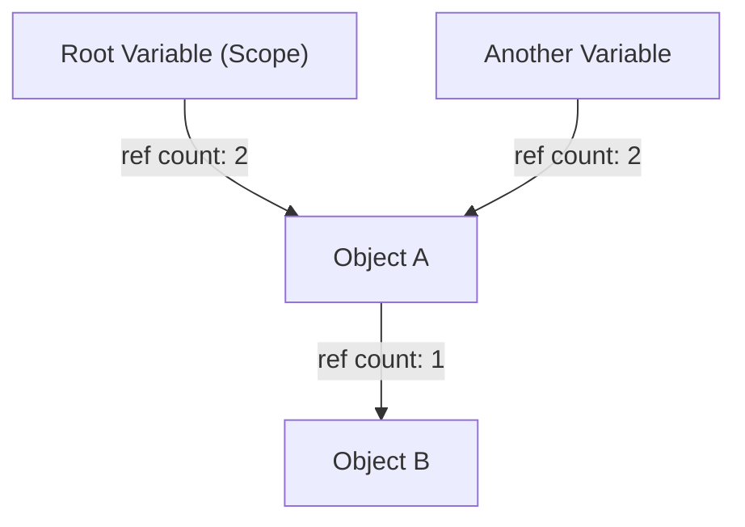
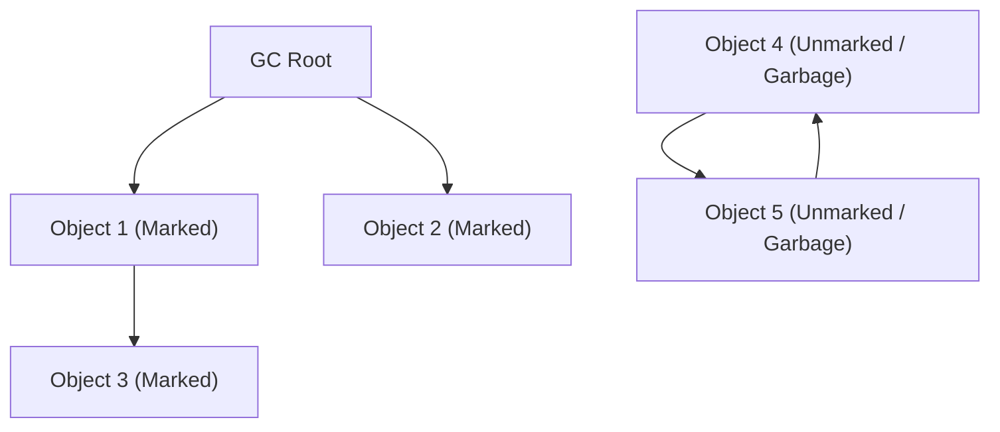
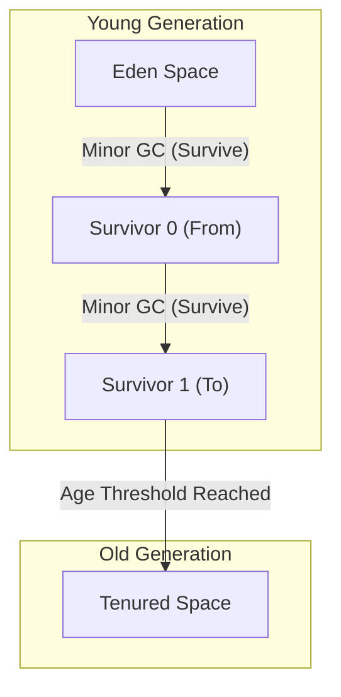

# 垃圾回收（GC）的演进史：从手动管理到ZGC的发展历程

在现代软件开发中，我们能够毫无内存管理负担地进行编程，完全归功于“垃圾回收（Garbage Collection, GC）”技术的演进。Java、C#、Python、JavaScript、Go等当今广泛使用的编程语言，大多内置了某种形式的垃圾回收机制。

然而，走到今天这一步并非一帆风顺。从程序员完全控制内存分配与释放的时代开始，伴随着与程序复杂化带来的各种Bug作斗争，历史一步步走向了内存管理的自动化。

本文将梳理计算机科学中内存管理的历史，从手动内存管理的局限性，到引用计数、标记-清除、分代GC、G1GC，再到现代令人惊叹的ZGC和Shenandoah等技术的演进过程，从算法和架构的角度进行深入剖析。

---

## 1. 混沌时代：手动内存管理及其局限性

在没有垃圾回收的时代（以及现在C、C++、Rust等语言大显身手的领域），内存管理是程序员的全部责任。这是一个在程序需要时向OS申请内存，不再需要时显式归还给OS的过程。

### `malloc` 与 `free` 的世界

在C语言中，使用 `malloc` 系列函数进行动态内存分配，使用 `free` 进行释放。

```c
#include <stdlib.h>
#include <stdio.h>

void process_data() {
    // 在堆上分配100个整数大小的内存
    int* data = (int*)malloc(100 * sizeof(int));
    if (data == NULL) {
        // 内存分配失败时的错误处理
        return;
    }

    // 使用数据的处理逻辑
    for (int i = 0; i < 100; i++) {
        data[i] = i * 2;
    }

    // 处理完成后释放内存
    free(data);
}
```

这种方法最大的优势是“控制力”和“性能”。程序员可以精确到毫秒级地掌握内存何时何地被分配和释放。在硬件限制严苛的早期计算机系统中，这种绝对的控制权是必不可少的。

### 手动管理引发的三大罪状

然而，当软件规模膨胀到数万行、数百万行，且多个线程错综复杂地交织在一起时，手动内存管理开始超出人类的认知极限。结果就是，以下严重的Bug开始频繁出现：

1. **内存泄漏 (Memory Leak)**
   忘记释放已分配内存的问题。在长期运行的服务器应用程序中，如果发生内存泄漏，可用内存会逐渐减少，最终导致进程被OS强制终止（OOM: Out Of Memory）。

2. **悬垂指针与释放后使用 (Dangling Pointer and Use-After-Free)**
   尽管已经通过 `free` 释放了内存，但仍然继续使用指向该内存区域指针的Bug。被释放的内存区域可能已经被分配了新的数据，如果对其进行访问或写入，就会破坏完全无关的数据。这成为了安全漏洞（如任意代码执行）的温床。

3. **双重释放 (Double Free)**
   对同一块内存区域调用两次 `free` 的问题。这会破坏内存分配器的内部数据结构（如空闲链表），引发崩溃或致命的安全缺陷。

```c
// Use-After-Free 的例子
int* ptr = malloc(sizeof(int));
*ptr = 42;
free(ptr);
// ... 复杂的处理逻辑 ...
*ptr = 100; // 危险！写入已被释放的区域
```

为了应对这些问题，C++引入了RAII（Resource Acquisition Is Initialization，资源获取即初始化）和智能指针等概念。但“能不能干脆把内存管理从程序员手中接管过来，交由系统负责呢？”——正是出于这种想法，垃圾回收应运而生。

---

## 2. 自动化的第一步：引用计数 (Reference Counting)

克服手动内存管理局限性的第一个重要方法是“引用计数”。这种方法至今仍在Python、PHP、Objective-C/Swift (ARC: Automatic Reference Counting) 以及C++的 `std::shared_ptr` 中被广泛采用。

### 引用计数的基本原理

引用计数的机制非常简单。在每个对象的头部区域维护一个计数器（引用计数），表示“当前有多少个变量（指针）正在引用自己”。

- 当对象被新创建并赋值给变量时，计数设为 `1`。
- 当另一个变量开始引用该对象时，计数 `+1`。
- 当变量离开作用域等原因导致引用解除时，计数 `-1`。
- 当计数变为 `0` 的瞬间，就可以确定该对象“未被任何地方引用”，此时立即释放内存。



### 引用计数的优缺点

**优点：**
1. **确定性的释放:** 由于在引用归零的瞬间内存就会被释放，资源的生命周期很容易预测。
2. **停顿时间（Pause Time）的分散:** 由于内存释放的负担被分散到了整个程序的执行过程中，很难产生后文所述的“Stop-The-World（STW）”那种巨大的停顿时间。

**缺点：**
1. **计数器更新的开销:** 每次发生指针赋值时，都需要执行递增和递减指令。在多线程环境中，必须使用原子操作（如锁）来进行计数器更新，这会成为巨大的性能瓶颈。
2. **循环引用 (Circular Reference) 的致命缺陷:** 这是最大的弱点。如果对象A引用对象B，对象B引用对象A，即使程序中任何地方都无法再访问A和B，但由于它们互相引用，计数永远不会变为 `0`，从而导致永久性的内存泄漏。

为了解决循环引用问题，开发者必须显式地使用“弱引用 (Weak Reference)”，但这归根结底意味着“开发者必须关注内存的依赖关系”，因此算不上是完全的自动化。

---

## 3. 迈向根除的挑战：标记-清除 (Mark and Sweep) 与追踪式GC

从根本上解决循环引用问题并实现真正自动内存管理的，是“追踪式垃圾回收 (Tracing GC)”，其代表性算法就是“标记-清除 (Mark and Sweep)”。

约翰·麦卡锡（John McCarthy）为LISP语言发明的这一划时代算法，成为了现代Java（JVM）、Go、V8引擎（JavaScript）等几乎所有高级GC的基础。

### 可达性 (Reachability) 概念

标记-清除不像引用计数那样追踪“被谁引用”。相反，它以“从程序的起点（根节点）出发，能否到达（Reachability）”作为判断生死的标准。

被称为 **GC根 (GC Roots)** 的起点包括以下内容：
- 当前正在执行的线程调用栈上的局部变量
- 全局变量、静态 (static) 变量
- CPU寄存器

### 标记-清除的两个阶段

顾名思义，该算法由两个阶段组成。

1. **标记阶段 (Mark Phase):**
   从GC根出发，顺着指针追踪，为所有可访问的对象打上“存活（Live）”的印记（标记）。通常通过在对象头部设置1个比特位（标记位）来实现。

2. **清除阶段 (Sweep Phase):**
   从头到尾遍历（清除）整个堆内存。没有被标记的对象会被判定为“程序已无法到达的垃圾（Garbage）”，其内存区域会被回收并放回空闲链表（Free List）。被标记的对象则会清除标记，为下一次GC做准备。


*(上图中的Obj4和Obj5虽然存在循环引用，但由于无法从GC Root到达，因此会被一起作为Garbage回收。)*

### Stop-The-World (STW) 与内存碎片化

标记-清除看似是解决循环引用的完美方法，但也伴随着巨大的代价。

第一个代价是 **Stop-The-World (STW)**。
如果在执行标记处理的过程中，应用程序线程（被称为Mutator）改变了对象的引用关系，就有可能漏掉存活的对象。因此，早期的GC在标记和清除期间，必须完全暂停应用程序的所有线程。堆内存越大，这种停顿时间就越长，从几秒到几十分钟不等，对于需要实时性的系统来说是致命的。

第二个代价是 **内存碎片化 (Fragmentation)**。
在清除阶段回收垃圾后留下的空地，会像带孔的奶酪一样散布在整个堆中。虽然总的可用空间足够，但无法分配连续的大块内存块，最终导致发生OutOfMemoryError。

为了解决这个问题，出现了“标记-整理 (Mark and Compact)”方法。通过将存活的对象集中到内存区域的一侧（压缩），来创造出连续的巨大空闲区域。但是，由于对象的存放位置（内存地址）发生了改变，必须重写所有指向该对象的指针，这导致了更长的STW时间。

---

## 4. 分代GC的诞生与启发式方法的引入

为了打破标记-清除算法“每次都要扫描整个堆”的低效性，“分代垃圾回收 (Generational GC)”应运而生。这可以说是计算机科学中最成功的启发式方法（基于经验法则的优化）之一。

### 弱分代假说 (Weak Generational Hypothesis)

IBM等机构的研究人员通过对各种应用程序进行内存分析，发现了一个强大的规律。

**“绝大多数新分配的对象很快就会变得不再需要（生命周期短）。”**
**“存活时间较长的对象，倾向于在未来继续存活下去。”**

例如，在循环中临时创建的字符串，或者存储方法返回值的DTO对象等，几毫秒后就会变成垃圾。另一方面，缓存数据或连接池等，则会一直存活到应用程序结束。

### 堆的划分：Young 与 Old

基于这一假说，分代GC将堆内存进行了逻辑划分。

1. **年轻代 (Young Generation):**
   新创建的对象首先被分配的地方。Young区进一步被划分为“Eden空间”和2个“Survivor空间（From/To）”。
   对象首先在Eden中分配。当Eden满时，会发生 **Minor GC**。
   Minor GC只在Young区内部执行标记和复制。存活下来的对象会被移动到Survivor空间，只有在那里经历了多次Minor GC依然存活（年龄增加）的对象，才会作为“长寿对象”晋升（Promotion）到Old区。
   由于短命对象很多，Young区内真正存活的对象极少，因此复制能很快完成，从而将STW时间压得极短。

2. **老年代 (Old Generation / Tenured):**
   存放长期存活对象的区域。当Old区满时，会触发针对整个堆的 **Major GC (Full GC)**。
   Full GC耗时较长，但由于短命对象已经在Young区的Minor GC中被清理干净，因此Full GC发生的频率本身就被大幅降低了。



### 卡表 (Card Table) 优化

为了实现分代GC，还有一个技术难题需要克服：“当Old区的对象引用了Young区的对象时，如何安全地只执行Young区的GC（Minor GC）？”如果只从GC根开始追踪，就不得不扫描整个Old区。

为了解决这个问题，引入了一种称为“卡表（Card Table）”的数据结构。将Old区划分为细小的页（卡片），当发生从Old指向Young的引用写入时，插入一段称为写屏障（Write Barrier）的特殊代码，将相应的卡片标记为“Dirty（脏）”。在Minor GC时，除了GC根之外，只需扫描这些Dirty卡片即可，完全消除了扫描整个Old区的开销。

随着分代GC（如CMS: Concurrent Mark Sweep等）的出现，Java在企业级领域获得了压倒性的市场份额。

---

## 5. 应对大容量堆：G1GC (Garbage-First GC) 的崛起

随着内存价格的下降，服务器搭载的内存从几GB急剧增加到几十甚至几百GB，传统的分代GC架构面临着新的瓶颈。
在几十GB的堆中一旦发生Full GC，即使使用像CMS这样的并发（Concurrent）GC，在解决碎片化（压缩）时依然会产生以秒为单位的STW。

为了解决这个问题，从Java 9开始被作为默认GC采用的就是 **G1GC (Garbage-First GC)**。

### 基于区域 (Region) 的架构

G1GC最大的特点是放弃了传统的将“Young区”和“Old区”作为两块巨大的连续内存进行物理划分的做法。
取而代之的是，它将整个堆划分成数千个大小相同（通常为1MB〜32MB）的小区域，称为“Region（区域）”，就像棋盘上的格子一样。

每个Region会动态地扮演Eden、Survivor或Old的角色。

### "Garbage-First" 的含义与预测模型

G1GC中 "Garbage-First"（垃圾优先）的名字，来源于它的回收策略。
G1GC通过并发标记（在应用程序运行的同时进行标记处理），不断计算每个Region中“包含了多少垃圾对象（存活对象有多小）”。

在进行GC时，G1GC不会一次性对整个堆进行压缩，而是**“优先回收垃圾最多、回收效率最高（存活对象最少）的Region”**。

此外，G1GC具有软实时性（Soft Real-time），它会努力遵守用户指定的“目标停顿时间（例如：200毫秒）”。根据过去GC的统计数据，它通过启发式算法计算“在200毫秒内，这次可以回收（复制）多少个Region”，并动态决定要回收的Region数量（CSet: Collection Set）。

通过这种方式，即使在几十GB的堆大小下，也可以在可预测的短STW内进行运行。

---

## 6. 现代GC的巅峰：ZGC 与 Shenandoah 开辟的毫秒级世界

虽然G1GC的出现大幅改善了大堆的问题，但“堆大小越大，迟早STW时间也会成比例变长”的根本问题（尤其是在对象重定位/压缩时的指针更新）并没有被彻底解决。

为了满足金融系统、高频交易、大规模实时游戏服务器等**“在任何情况下都不能容忍超过几毫秒的停顿”**的苛刻要求，即使在数太字节（TB）的堆下也能将STW控制在1毫秒以下（亚毫秒级）的终极GC架构诞生了。这就是 **ZGC (Z Garbage Collector)** 和 **Shenandoah GC**。

### 并发重定位（Concurrent Relocation）的魔法

在传统GC中，引发STW的最大原因是“对象的移动（压缩）”。在将对象复制到新的内存区域后，必须在改写数以百万计指向该对象的指针期间暂停应用程序。如果不暂停，应用程序访问到旧的内存地址，就会导致数据损坏。

ZGC和Shenandoah完成了仿佛魔法般的壮举：**“即使是对象的移动和指针的更新，也在不停止应用程序线程的情况下并发（Concurrent）进行。”**

### ZGC的核心技术：染色指针 (Colored Pointers) 与读屏障

由Oracle主导开发的ZGC，采用了**染色指针（Colored Pointers）**这一划时代的技术，将64位架构的特性发挥到了极致。

在64位的指针空间中，实际被用作内存地址的只有低44位（最大16TB）左右。ZGC将其余高位中的一部分作为“元数据（颜色）”使用。
这些颜色位记录了“这个指针是否已被标记？”“该指针指向的对象是否正在移动（Relocated）？”等状态。

```
[ Unused ] [ Marked0 ] [ Marked1 ] [ Remapped ] [ Finalizable ] [   Object Address (44 bits)   ]
   ...          1           0           0              0        1010101010101010...
```

此外，在应用程序读取（Load）对象引用的所有地方，ZGC会动态插入极其少量的汇编指令，称为**读屏障 (Load Barrier)**。

**读屏障的动作:**
1. 应用程序线程读取指针。
2. 检查指针的“颜色（元数据）”。
3. 如果该对象“正被GC移动到其他地方（或者已经移动，但该指针仍指向旧地址）”，读屏障就会介入。
4. 查找ZGC管理的“转发表（Forwarding Table）”，获取正确的新地址。
5. 将指针本身改写为新地址（自我修复·Self-Healing），并向应用程序返回新地址的对象。

通过这种自我修复机制，即使在GC线程在后台辛勤地移动对象的同时，应用程序线程也能始终安全地访问到“最新正确的对象”。STW被控制在“GC根扫描”等极其有限的阶段（通常在1毫秒以下），无论堆大小是10MB还是16TB，停顿时间都保持不变。

### Shenandoah的核心技术：布鲁克斯指针 (Brooks Pointers)

由Red Hat主导开发的Shenandoah GC也实现了并发重定位，但采用了不同的方法。

Shenandoah在所有对象的头部区域之前配置了一个转发指针，称为**布鲁克斯指针 (Brooks Pointer)**。
在正常情况下，这个指针指向“对象本身”。但是，当GC开始将对象复制到新区域时，它会原子地将旧对象的布鲁克斯指针重写为“新对象的地址”。

当应用程序读写对象时，总是让其经过这个布鲁克斯指针（读屏障/写屏障），从而实现即使在对象移动中也能透明地将访问引导到新对象。

---

## 结语：内存管理的未来

从C语言 `malloc/free` 的混沌时代开始，经历了在LISP中诞生的标记-清除、支撑了企业级应用的分代GC、驾驭巨大堆的G1GC，一直到实现了极致低延迟的ZGC和Shenandoah。

垃圾回收的历史，也就是人类“如何与软件复杂性作斗争”的挑战史。
如今，随着硬件的演进（CPU的分支预测和缓存行优化）与软件算法的融合，曾经被认为不可能的“全并发不卡顿的GC”已成为现实。

虽然像Rust那样凭借“编译时的所有权模型”进行静态内存管理的另一种方法正在崛起，但在处理动态且复杂的对象图的大规模应用程序中，垃圾回收在未来仍将是不可或缺的基础设施。
在后台静悄悄地、却以绝妙技巧持续管理内存的GC算法，有时也不妨让我们用心体会一番。

---
*Reference: The Garbage Collection Handbook, OpenJDK Wiki, various JEPs (JEP 333, JEP 189)*
