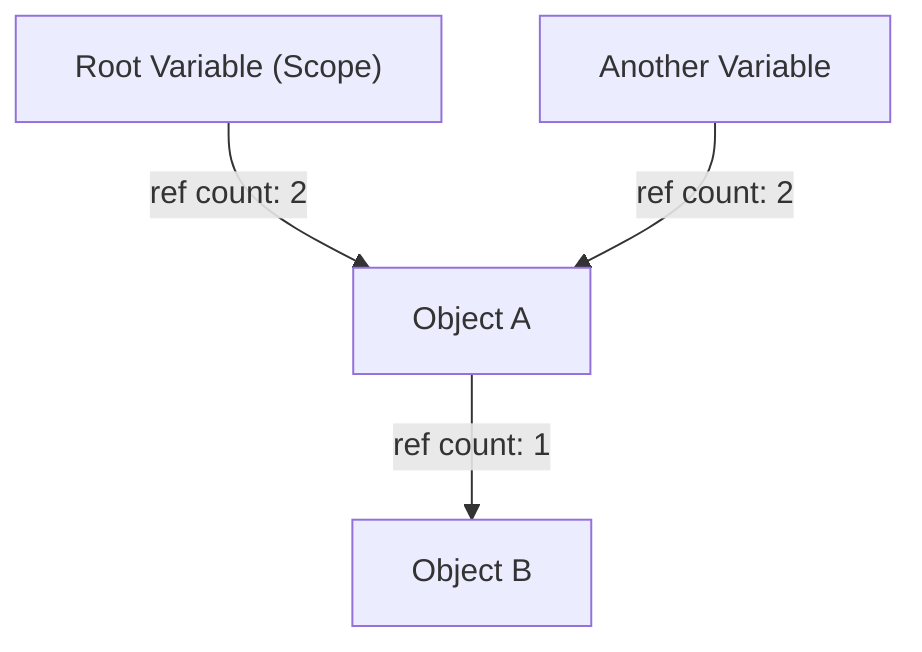
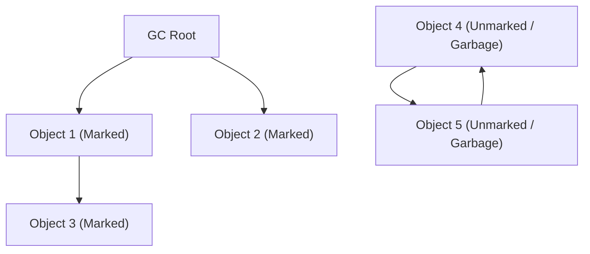
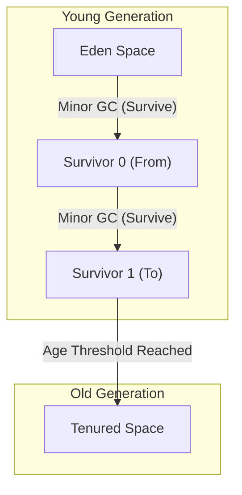

# 垃圾回收（GC）的演進史：從手動管理到 ZGC 的發展

在現代軟體開發中，我們能夠在不特別意識到記憶體管理的情況下進行程式設計，完全歸功於「垃圾回收（Garbage Collection, GC）」這項技術的演進。Java、C#、Python、JavaScript、Go 等當今廣泛使用的程式語言，大多內建了某種形式的垃圾回收機制。

然而，走到這一步的過程絕非平坦。從程式設計師必須完全控制記憶體配置與釋放的時代開始，在與程式複雜化所伴隨而來的無數 Bug 奮戰的同時，經歷了一段逐步將記憶體管理自動化的歷史。

本文將回顧電腦科學中記憶體管理的歷史，從手動記憶體管理的極限，到參考計數（Reference Counting）、標記與清除（Mark and Sweep）、分代 GC（Generational GC）、G1GC，乃至於現代令人驚嘆的 ZGC 與 Shenandoah 技術，從演算法與架構的角度深入探討其演進過程。

---

## 1. 混沌時代：手動記憶體管理及其極限

在垃圾回收不存在的時代（以及現在 C、C++、Rust 等語言活躍的領域），記憶體管理完全是程式設計師的責任。這是一個程式需要時向作業系統（OS）申請配置記憶體，不再需要時明確歸還給 OS 的過程。

### `malloc` 與 `free` 的世界

在 C 語言中，動態記憶體配置使用 `malloc` 家族的函式，而釋放則使用 `free`。

```c
#include <stdlib.h>
#include <stdio.h>

void process_data() {
    // 在 Heap（堆積）上配置 100 個整數大小的記憶體
    int* data = (int*)malloc(100 * sizeof(int));
    if (data == NULL) {
        // 記憶體配置失敗時的錯誤處理
        return;
    }

    // 使用資料的處理
    for (int i = 0; i < 100; i++) {
        data[i] = i * 2;
    }

    // 處理完成後釋放記憶體
    free(data);
}
```

這種方法最大的優勢在於「控制性」與「效能」。程式設計師能夠以毫秒為單位，精確掌握記憶體何時、何地被配置與釋放。在硬體限制嚴苛的早期電腦系統中，這種絕對的控制權是不可或缺的。

### 手動管理引發的三大罪狀

然而，隨著軟體規模膨脹到數萬行、數百萬行，多個執行緒複雜交織，手動記憶體管理逐漸超出了人類的認知極限。結果導致以下嚴重的 Bug 頻繁發生：

1. **記憶體洩漏 (Memory Leak)**
   配置了記憶體卻忘記釋放的問題。在長期運行的伺服器應用程式中若發生記憶體洩漏，可用記憶體會逐漸減少，最終導致行程（Process）被 OS 強制終止（OOM: Out Of Memory）。

2. **懸空指標 (Dangling Pointer) 與 Use-After-Free**
   儘管已經使用 `free` 釋放了記憶體，卻繼續使用指向該記憶體區塊的指標的 Bug。被釋放的記憶體區塊可能已經被分配給其他新資料，如果對其進行存取或寫入，將會破壞完全無關的資料。這成為了安全性漏洞（如任意程式碼執行）的溫床。

3. **重複釋放 (Double Free)**
   對同一個記憶體區塊呼叫兩次 `free` 的問題。這會破壞記憶體配置器（Memory Allocator）的內部資料結構（如 Free List 等），引發崩潰或安全性上的致命缺陷。

```c
// Use-After-Free 的例子
int* ptr = malloc(sizeof(int));
*ptr = 42;
free(ptr);
// ... 複雜的處理 ...
*ptr = 100; // 危險！寫入已經釋放的區域
```

為了解決這些問題，C++ 引入了 RAII（Resource Acquisition Is Initialization）和智慧型指標（Smart Pointer）等概念。然而，出於「難道不能從程式設計師手中接管記憶體管理，交由系統負責嗎？」的想法，垃圾回收應運而生。

---

## 2. 自動化的第一步：參考計數 (Reference Counting)

為克服手動記憶體管理的極限，第一個主要方法是「參考計數」。時至今日，Python、PHP、Objective-C/Swift (ARC: Automatic Reference Counting) 以及 C++ 的 `std::shared_ptr` 等仍廣泛採用此技術。

### 參考計數的基本原理

參考計數的機制非常簡單。每個物件的標頭（Header）區域都會有一個計數器（參考計數），表示「目前有多少個變數（指標）指向自己」。

- 當物件被建立並賦值給變數時，計數設為 `1`。
- 當另一個變數也開始指向該物件時，計數 `+1`。
- 當變數離開作用域（Scope）或不再指向該物件時，計數 `-1`。
- 當計數變為 `0` 的瞬間，確定該物件「不再被任何地方參考」，便立即釋放記憶體。



### 參考計數的優缺點

**優點：**
1. **決定性的釋放:** 由於在參考歸零的瞬間就會釋放記憶體，資源的生命週期容易預測。
2. **分散停頓時間 (Pause Time):** 釋放記憶體的負擔被分散到整個程式的執行過程中，不易發生後述的「Stop-The-World (STW)」那樣長時間的停頓。

**缺點：**
1. **計數器更新的額外負擔:** 每次發生指標賦值時，都必須執行遞增和遞減的指令。在多執行緒環境中，必須以原子操作（Atomic Operation，如鎖）來更新計數器，這會成為效能上的重大瓶頸。
2. **循環參考 (Circular Reference) 的致命缺陷:** 這是最大的弱點。如果物件 A 指向物件 B，且物件 B 指向物件 A，即使程式中再也無法存取 A 和 B，因為互相參考的關係，它們的計數永遠不會變成 `0`，導致永久的記憶體洩漏。

為解決循環參考，開發者必須明確使用「弱參考 (Weak Reference)」。但歸根結底，這意味著「開發者必須意識到記憶體的依賴關係」，無法稱之為完全的自動化。

---

## 3. 挑戰根絕問題：標記與清除 (Mark and Sweep) 與追蹤式 GC

根本解決循環參考問題並實現真正自動記憶體管理的，是「追蹤式垃圾回收 (Tracing Garbage Collection)」，其具代表性的演算法為「標記與清除 (Mark and Sweep)」。

約翰·麥卡錫 (John McCarthy) 為 LISP 語言發明的這項劃時代演算法，成為了現代 Java (JVM)、Go、V8 引擎 (JavaScript) 等幾乎所有進階 GC 的基礎。

### 可達性 (Reachability) 的概念

標記與清除不像參考計數那樣追蹤「被誰參考」。取而代之，它以「從程式的起點（Root）出發，能否抵達 (Reachability)」作為判斷生殺大權的標準。

被稱為 **GC Root** 的起點包含以下幾種：
- 目前執行中執行緒的呼叫堆疊 (Call Stack) 上的區域變數
- 全域變數、靜態 (static) 變數
- CPU 暫存器

### 標記與清除的兩個階段

顧名思義，該演算法由兩個階段組成：

1. **標記階段 (Mark Phase):**
   從 GC Root 出發，順著指標走訪，對所有可存取的物件標上「活著 (Live)」的記號（Mark）。通常透過將物件標頭中的 1 個位元（Mark Bit）設為 1 來實作。

2. **清除階段 (Sweep Phase):**
   從頭到尾走訪整個 Heap 記憶體（Sweep）。未被標記的物件會被判定為「程式已無法抵達的垃圾 (Garbage)」，回收其記憶體區塊並放回空閒列表 (Free List) 中。被標記的物件則會清除標記，為下次 GC 做準備。


*(上圖的 Obj4 與 Obj5 雖然循環參考，但因為無法從 GC Root 抵達，所以會一併作為 Garbage 被回收。)*

### Stop-The-World (STW) 與碎片化

標記與清除看似是解決循環參考的完美手法，卻伴隨著巨大的代價。

第一個代價是 **Stop-The-World (STW)**。
如果在進行標記處理的過程中，應用程式的執行緒（被稱為 Mutator）改變了物件的參考關係，就有可能漏掉活著的物件。因此，早期的 GC 在標記和清除之間，必須完全暫停應用程式的所有執行緒。Heap 大小越大，暫停時間就越長，從幾秒到幾十分鐘不等，對於需要即時性的系統來說是致命的。

第二個代價是 **記憶體碎片化 (Fragmentation)**。
在清除階段回收垃圾後留下的空地，會像有洞的起司一樣散佈在整個 Heap 中。即使可用容量總和足夠，卻無法配置連續的大型記憶體區塊，最終導致 OutOfMemoryError。

為解決這個問題，出現了「標記與壓縮 (Mark and Compact)」的方法。藉由將活著的物件集中到記憶體區域的一側（Compaction），創造出連續的巨大可用空間。然而，由於物件的位置（記憶體位址）發生改變，所有指向該物件的指標都必須被重寫，這導致了更長的 STW 時間。

---

## 4. 分代 GC 的誕生與啟發式法則的引入

為打破標記與清除「每次都要掃描整個 Heap」的低效率，發明了「分代垃圾回收 (Generational GC)」。這可以說是電腦科學中最成功的啟發式法則（基於經驗法則的最佳化）之一。

### 弱分代假說 (Weak Generational Hypothesis)

IBM 等研究人員對各種應用程式進行了記憶體效能分析（Profiling），並發現了一個強大的法則：

**「絕大多數新配置的物件很快就會變得不需要（短命）。」**
**「越老的物件，就越有可能繼續存活下去。」**

例如，迴圈中暫時建立的字串，或是存放方法回傳值的 DTO 物件等，通常在幾毫秒後就會變成垃圾。另一方面，快取資料或連線池（Connection Pool）等，則會存活到應用程式結束為止。

### Heap 的分割：Young 與 Old

基於這個假說，分代 GC 將 Heap 記憶體進行邏輯上的分割：

1. **年輕代 (Young Generation):**
   新建立的物件首先被放置的地方。Young 區域進一步分為「Eden 空間」與兩個「Survivor 空間 (From/To)」。
   物件首先被配置在 Eden 中。當 Eden 滿了時，會觸發 **Minor GC**。
   Minor GC 只在 Young 區域內執行標記與複製。存活下來的物件會移動到 Survivor 空間，在那裡經歷過幾次 Minor GC 後仍然存活（年齡增長）的物件，才會作為「長壽物件」晉升 (Promotion) 到 Old 區域。
   因為短命物件很多，Young 區域內存活的物件非常少，複製過程能迅速完成，可將 STW 時間壓得極短。

2. **老年代 (Old Generation / Tenured):**
   放置長期存活物件的區域。當 Old 區域滿了時，會觸發針對整個 Heap 的 **Major GC (Full GC)**。
   Full GC 雖然耗時，但短命的物件早已在 Young 區域的 Minor GC 中被一掃而空，因此 Full GC 發生的頻率得以大幅降低。



### 藉由記憶卡表 (Card Table) 進行最佳化

為實現分代 GC，還面臨著另一個技術挑戰：「當 Old 區域的物件參考了 Young 區域的物件時，如何安全地只針對 Young 區域執行 GC (Minor GC)？」如果只從 GC Root 走訪，就必須掃描整個 Old 區域。

為解決此問題，引入了名為「記憶卡表 (Card Table)」的資料結構。將 Old 區域分割為細小的分頁（卡片），當發生從 Old 到 Young 的參考寫入時，插入稱為寫入屏障 (Write Barrier) 的特殊程式碼，將該卡片標記為「髒的 (Dirty)」。在 Minor GC 時，除了 GC Root 以外，只需掃描這些 Dirty 卡片即可，完全消除了掃描整個 Old 區域的成本。

隨著分代 GC（如 CMS: Concurrent Mark Sweep 等）的出現，Java 在企業級領域獲得了壓倒性的市占率。

---

## 5. 應對大容量 Heap 的崛起：G1GC (Garbage-First GC)

隨著記憶體價格下降，伺服器搭載的記憶體從幾 GB 擴增到幾十 GB 甚至幾百 GB，傳統的分代 GC 架構面臨了新的瓶頸。
在幾十 GB 的 Heap 中發生 Full GC 時，即使使用像 CMS 這樣的並行 (Concurrent) GC，在消除碎片化 (Compaction) 時仍然會發生以秒為單位的 STW。

為了解決這個問題，從 Java 9 開始被採用為預設 GC 的就是 **G1GC (Garbage-First GC)**。

### 基於區域 (Region) 的架構

G1GC 最大的特徵，是放棄了傳統將記憶體物理上劃分為巨大的「Young 區域」與「Old 區域」的做法。
取而代之的是，它將整個 Heap 劃分為幾千個大小相同（通常為 1MB 到 32MB），類似西洋棋盤格子的微小區域，稱為「Region」。

每個 Region 會動態扮演 Eden、Survivor 或 Old 的角色。

### "Garbage-First" 的涵義與預測模型

G1GC 的名稱 "Garbage-First"（垃圾優先），源自於它的回收策略。
G1GC 透過並行標記 (Concurrent Marking，與應用程式執行平行進行標記處理)，隨時計算每個 Region 中「含有多少垃圾物件（存活物件有多稀少）」。

在 GC 時，G1GC 不會一次壓縮整個 Heap，而是**「優先從垃圾最多、回收效率最高（存活物件最少）的 Region 開始回收」**。

此外，G1GC 具有軟即時性 (Soft Real-time)，會努力遵守使用者指定的「目標停頓時間（例如：200 毫秒）」。它會根據過去 GC 的統計資料，透過啟發式方法計算「在 200 毫秒內，這次能回收（複製）多少個 Region」，藉此動態決定要回收的 Region 數量（CSet: Collection Set）。

有了這個機制，即使面對數十 GB 的 Heap 大小，也能以可預測的短暫 STW 來進行運作。

---

## 6. 現代 GC 的頂點：ZGC 與 Shenandoah 劃開的毫秒世界

雖然 G1GC 的出現大幅改善了巨大 Heap 的問題，但「Heap 越大，STW 的時間終究會成正比增加」的根本問題（尤其是物件重新配置與壓縮時的指標更新）並未完全解決。

金融系統、高頻交易、大規模即時遊戲伺服器等領域，有著**「在任何情況下都不允許超過幾毫秒的停頓」**的嚴格要求。為了滿足這些需求，即使是數 Terabytes (TB) 的 Heap，也能將 STW 壓制在 1 毫秒以下（次毫秒級別）的究極 GC 架構誕生了，那就是 **ZGC (Z Garbage Collector)** 與 **Shenandoah GC**。

### 並行重定位 (Concurrent Relocation) 的魔法

傳統 GC 產生 STW 最大的原因在於「物件的移動 (Compaction)」。將物件複製到新的記憶體區域後，必須暫停應用程式，重寫所有指向該物件的數百萬個指標。如果應用程式不暫停，就可能會存取到舊的記憶體位址，導致資料損壞。

ZGC 和 Shenandoah 達成了如同魔法般的偉業，也就是**「就連物件的移動和指標的更新，也能在不暫停應用程式執行緒的情況下，並行 (Concurrent) 進行」**。

### ZGC 的核心技術：著色指標 (Colored Pointers) 與載入屏障 (Load Barrier)

由 Oracle 主導開發的 ZGC，採用了發揮 64 位元架構特性到極致的劃時代技術：**著色指標 (Colored Pointers)**。

在 64 位元的指標空間中，實際用作記憶體位址的只有較低的 44 個位元（最大 16TB）左右。ZGC 利用剩下的較高位元的一部分作為「中繼資料 (Metadata，即顏色)」。
這些顏色位元會記錄如「這個指標是否已標記？」、「這個指標所指向的物件是否正在移動 (Relocated) 中？」等狀態。

```
[ Unused ] [ Marked0 ] [ Marked1 ] [ Remapped ] [ Finalizable ] [   Object Address (44 bits)   ]
   ...          1           0           0              0        1010101010101010...
```

此外，在應用程式讀取（Load）物件參考的所有地方，都會動態插入被稱為 **載入屏障 (Load Barrier)** 的極少量組合語言指令。

**載入屏障的運作方式:**
1. 應用程式執行緒讀取指標。
2. 檢查指標的「顏色（中繼資料）」。
3. 如果該物件「正被 GC 移動到其他地方（或者已經移動完畢，但這個指標仍然指向舊位址）」，載入屏障就會介入。
4. 參照 ZGC 管理的「轉發表 (Forwarding Table)」，取得新的正確位址。
5. 將指標本身更新為新位址（自我修復 Self-Healing），並將新位址的物件回傳給應用程式。

藉由這個自我修復機制，即使 GC 執行緒正在背景拼命移動物件，應用程式執行緒也始終能安全地存取「正確且最新的物件」。STW 被限制在「掃描 GC Root」等極小範圍的階段（通常在 1 毫秒以下），無論 Heap 大小是 10MB 還是 16TB，停頓時間都不會改變。

### Shenandoah 的核心技術：布魯克斯指標 (Brooks Pointers)

由 Red Hat 主導開發的 Shenandoah GC 同樣實現了並行重定位，但方法不同。

Shenandoah 會在所有物件的標頭區域前方，配置一個稱為 **布魯克斯指標 (Brooks Pointer)** 的轉發指標。
平常時，這個指標會指向「自己」。但是，當 GC 開始將物件複製到新區域時，會原子性地將舊物件的布魯克斯指標更新為「新物件的位址」。

當應用程式讀寫物件時，會強制通過這個布魯克斯指標（讀取屏障、寫入屏障），藉此機制，即使物件正在移動中，也能通透地將存取導向新的物件。

---

## 結語：記憶體管理的未來

從 C 語言的 `malloc/free` 所帶來的混沌時代開始，經歷了在 LISP 中誕生的標記與清除，支撐企業級應用的分代 GC，駕馭龐大 Heap 的 G1GC，以及實現極致低延遲的 ZGC 和 Shenandoah。

垃圾回收的歷史，簡直就是人類「如何與軟體複雜性搏鬥」的挑戰史。
現今，透過硬體的進化（如 CPU 分支預測與快取行 (Cache Line) 的最佳化）與軟體演算法的融合，過去被認為不可能的「全並行且不暫停的 GC」已經成為現實。

儘管像是 Rust 這樣透過「編譯期所有權模型」進行靜態記憶體管理的另一種方法正在崛起，但在處理動態且複雜的物件圖 (Object Graph) 的大規模應用程式中，垃圾回收未來仍將是不可或缺的基礎設施。
偶爾，不妨也對那些在背後默默地、卻以超凡技巧持續管理著記憶體的 GC 演算法，寄予一些敬意吧。

---
*Reference: The Garbage Collection Handbook, OpenJDK Wiki, various JEPs (JEP 333, JEP 189)*
