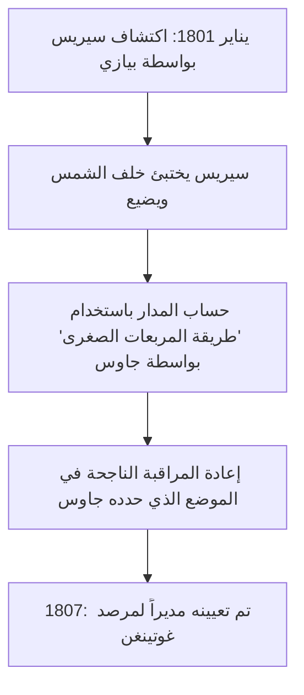

## 1. مقدمة: الرجل المعروف باسم "أمير علماء الرياضيات"

كان يوهان [كارل فريدريش جاوس](https://kenji.blog/p/gauss/) (30 أبريل 1777 - 23 فبراير 1855) عالم رياضيات وعالم فلك وفيزيائيًا ألمانيًا عظيمًا. نظرًا لذكائه الساحق ومساهماته الحاسمة في مجموعة واسعة من المجالات، فقد تم الإشادة به باعتباره **"أمير علماء الرياضيات"** (Princeps mathematicorum). تغطي إنجازات جاوس طيفًا واسعًا للغاية، من النظريات العميقة في الرياضيات البحتة إلى الرياضيات التطبيقية التي تصف الظواهر الفيزيائية في العالم الحقيقي.

تشكل النظريات والمفاهيم العديدة التي تركها وراءه أساس الرياضيات والعلوم الحديثة. تبث القوانين التي اكتشفها جاوس الحياة في التقنيات التي نستفيد منها يوميًا. في هذا المقال، سوف نتتبع حياة هذا العبقري غير المسبوق ترتيبًا زمنيًا، ونتعمق في أحداث حياته التفصيلية وإنجازاته الرياضية لنرى كيف أنجز العديد من المآثر العظيمة.

## 2. ولادة معجزة: أحداث طفولة مذهلة

ولد جاوس في عائلة فقيرة من عمال البناء في مدينة براونشفايغ في دوقية براونشفايغ فولفنبوتل، الإمبراطورية الرومانية المقدسة. لم يتلق والداه تعليمًا كافيًا، وقيل إن والدته كانت أمية بالكامل تقريبًا. ومع ذلك، أشرقت موهبة جاوس الطبيعية ببراعة منذ سن مبكرة جدًا.

### حساب المجموع من 1 إلى 100 في لحظة

وقعت إحدى أشهر الحوادث عندما كان صبيًا يبلغ من العمر 7 سنوات (أو 10 سنوات) في المدرسة الابتدائية. في أحد الأيام، أعطى مدرس الحساب، ج.ج. بوتنر، للطلاب مهمة لإبقائهم هادئين: **"اجمع جميع الأعداد الصحيحة من 1 إلى 100."** بينما كان الأطفال العاديون يجمعون الأرقام بالتتابع، كتب جاوس "5050" على لوحته في بضع ثوانٍ فقط وسلمها إلى مكتب المعلم.

عندما سأله المعلم كيف قام بحسابها، أوضح جاوس الحيلة التالية.

$$
1 + 2 + 3 + \dots + 98 + 99 + 100
$$

أضاف هذا إلى نفس التسلسل بترتيب عكسي:

$$
\begin{align*}
S &= 1 + 2 + \dots + 99 + 100 \\
S &= 100 + 99 + \dots + 2 + 1
\end{align*}
$$

بإضافة المصطلحات العلوية والسفلية على التوالي، فإن كل زوج يساوي "101".

$$
2S = 101 + 101 + \dots + 101 + 101
$$

نظرًا لوجود مائة "101"، فإن الإجمالي هو $101 \times 100 = 10100$، وبقسمة هذا على 2 ينتج الإجابة $5050$. توضح هذه الحكاية أنه اكتشف بشكل حدسي صيغة مجموع متتالية حسابية.

بشكل عام، يتم التعبير عن المجموع $S_n$ للأعداد الصحيحة من 1 إلى $n$ بالصيغة التالية:

$$
S_n = \sum_{i=1}^{n} i = \frac{n(n+1)}{2}
$$

بدافع من هذا الحدث، اقتنع معلمه بوتنر ومساعده مارتن بارتيلز (وهو عالم رياضيات سيقوم لاحقًا بتدريس لوباتشيفسكي) بموهبة جاوس الاستثنائية وأعطوه كتبًا مدرسية للرياضيات أكثر تقدمًا. علاوة على ذلك، بناءً على توصيتهم، أصبح الدوق كارل فيلهلم فرديناند من براونشفايغ راعيًا لجاوس، ووفر له منحة دراسية سخية لتلقي التعليم العالي. بفضل هذا، تقدم جاوس إلى كوليجيوم كارولينوم (الآن جامعة براونشفايغ التقنية) ثم إلى جامعة غوتينغن، حيث ازدهرت مواهبه.

## 3. اختراقات الشباب: بناء سباعي عشري الأضلاع وكتاب 'استفسارات حسابية'

كان جاوس، الذي التحق بجامعة غوتينغن، ممزقًا بين التخصص في اللغويات أو الرياضيات. ومع ذلك، فإن اكتشافًا تاريخيًا قام به في سن التاسعة عشرة دفعه إلى عقد العزم على جعل الرياضيات مهنة حياته.

### بناء سباعي عشري الأضلاع المنتظم باستخدام الفرجار والمسطرة

تصدى علماء الرياضيات اليونانيون القدماء لمشكلة بناء المضلعات المنتظمة باستخدام مسطرة فقط (أداة لرسم خطوط غير متدرجة) وفرجار (أداة لرسم الدوائر). في حين كانت الطرق معروفة لبناء المثلث متساوي الأضلاع، والمربع، والخماسي المنتظم، والخماسي عشري المنتظم، والمضلعات التي يضرب عدد أضلاعها بقوى الرقم 2، فإن بناء المضلعات الأخرى ذات الجوانب الأولية (مثل المسبع المنتظم أو المعشر المنتظم) كان يعتبر مستحيلًا.

ومع ذلك، في 30 مارس 1796، أثبت جاوس رياضيًا أنه **"يمكن بناء سباعي عشري الأضلاع المنتظم (مضلع مكون من 17 ضلعًا) باستخدام فرجار ومسطرة غير متدرجة فقط."** لقد أوضح جبريًا الظروف التي يمكن بموجبها التعبير عن جذور المعادلة الدائرية بدءًا من حقل الأعداد الكسرية وإضافة جذور تربيعية متتالية.

على وجه التحديد، استنبط نظرية مفادها أنه إذا كان $p$ عددًا أوليًا لفيرما (عدد أولي على الصورة $p = 2^{2^n} + 1$)، فإن المضلع $p$ المنتظم قابل للبناء. عندما يكون $n=2$، فإن $p = 2^4 + 1 = 17$، والذي يتضمن سباعي عشري الأضلاع المنتظم. كان جاوس فخورًا جدًا بهذا الاكتشاف ويقال إنه طلب حفر سباعي عشري الأضلاع منتظم على شاهد قبره (في الواقع، تم نحت نجمة ذات 17 نقطة لأنه لا يمكن تمييزها عن الدائرة).

### استفسارات حسابية (Disquisitiones Arithmeticae)

نُشر كتاب *Disquisitiones Arithmeticae* في عام 1801 عندما كان جاوس يبلغ من العمر 24 عامًا، وهو تحفة تاريخية أسست نظرية الأعداد كنظام منهجي. في هذا العمل، قدم تدوين **"التطابقات (الحساب المعياري)"** الذي نستخدمه يوميًا اليوم.

$$
a \equiv b \pmod{n}
$$

هذا يعني أن "الباقي عند قسمة $a$ و $b$ على $n$ متساويان". إن إدخال هذا التدوين جعل الحجج حول الخصائص المعقدة للأرقام موجزة وواضحة للغاية.

وفي نفس الكتاب أيضًا، قدم جاوس أول دليل صارم لـ **"قانون التقابل التربيعي"**، والذي يُعتبر أحد أجمل النظريات في نظرية الأعداد. يوضح هذا القانون أنه بالنسبة لعددين أوليين فرديين مختلفين $p, q$، توجد علاقة متناظرة للغاية بين ما إذا كان التطابق $x^2 \equiv p \pmod{q}$ له حل وما إذا كان $x^2 \equiv q \pmod{p}$ له حل.

يتم التعبير عنه في صيغة رياضية باستخدام رمز ليجاندر، ويتم تمثيله على النحو التالي:

$$
\left( \frac{p}{q} \right) \left( \frac{q}{p} \right) = (-1)^{\frac{p-1}{2} \frac{q-1}{2}}
$$

أطلق جاوس على هذا القانون اسم "النظرية الذهبية" ونشر ثمانية براهين مختلفة له طوال حياته.

## 4. مساهمات في علم الفلك: حساب مدار سيريس و[طريقة المربعات الصغرى](https://kenji.blog/p/method-of-least-squares/)

لم تقتصر مواهب جاوس على الرياضيات البحتة؛ بل حقق أيضًا نتائج استثنائية في علم الفلك.

في 1 يناير 1801، اكتشف عالم الفلك الإيطالي جوزيبي بيازي جرمًا سماويًا جديدًا (سمي لاحقًا بالكوكب القزم سيريس). ومع ذلك، بعد بضعة أيام من المراقبة، اختفى الجرم السماوي خلف الشمس ولم يعد بالإمكان رؤيته. حاول علماء الفلك في ذلك الوقت التنبؤ بمداره اللاحق من بيانات المراقبة التي استمرت لبضعة أيام فقط، لكنهم فشلوا جميعًا.

وهنا جاء دور جاوس. قام بحساب مدار سيريس باستخدام تقنية رياضية جديدة كان قد طورها سرا لبعض الوقت، وهي **"[طريقة المربعات الصغرى](https://kenji.blog/p/method-of-least-squares/)"**. [طريقة المربعات الصغرى](https://kenji.blog/p/method-of-least-squares/) هي تقنية لتقدير المعلمات الأكثر احتمالا لتقليل الأخطاء الواردة في بيانات الملاحظة.

بافتراض أن القيمة المرصودة هي $y_i$ والقيمة النظرية هي $f(x_i, \boldsymbol{\theta})$، نجد المعلمة $\boldsymbol{\theta}$ التي تقلل مجموع الأخطاء المربعة $S$.

$$
S(\boldsymbol{\theta}) = \sum_{i=1}^{n} \left( y_i - f(x_i, \boldsymbol{\theta}) \right)^2
$$

اختلف الموضع المتوقع الذي حسبه جاوس بشكل كبير عن تنبؤات علماء الفلك الآخرين، ولكن عندما وجهوا تلسكوباتهم نحو الإحداثيات التي حددها بعد بضعة أشهر، تم اكتشاف سيريس مرة أخرى هناك. بسبب هذا النجاح الدراماتيكي، تردد اسم جاوس في جميع أنحاء المجتمع العلمي الأوروبي. في عام 1807، تم تعيينه أستاذًا لعلم الفلك ومديرًا للمرصد في جامعة غوتينغن، وهي المناصب التي شغلها لبقية حياته.

## 5. الجيوديسيا والهندسة التفاضلية: النظرية الرائعة (Theorema Egregium)

من أواخر العقد الأول من القرن التاسع عشر إلى عشرينيات القرن التاسع عشر، تم تكليف جاوس بإجراء مسوحات جيوديسية لمملكة هانوفر. من خلال هذا العمل الميداني المرهق، بدأ يفكر بعمق في شكل الأرض والأسطح المنحنية. لتحسين دقة المسح، اخترع جهازًا يسمى "هليوتروب"، والذي كان يعكس ضوء الشمس لإرسال إشارات ضوئية إلى نقاط مراقبة بعيدة.

في الوقت نفسه، أدى عمل المسح هذا إلى إنشاء مجال جديد للرياضيات، وهو **"الهندسة التفاضلية"**. نشر جاوس ورقة بحثية بعنوان *تحقيقات عامة حول الأسطح المنحنية* في عام 1827، حيث أسس طريقة للتعامل مع الهندسة على الأسطح المنحنية بشكل جوهري، دون الاعتماد على مساحة ثلاثية الأبعاد.

أشهرها هو **"النظرية الرائعة"** (Theorema Egregium). توضح هذه النظرية أن **انحناء جاوس** $K$ للسطح (حاصل ضرب الانحناءين الرئيسيين $k_1$ و $k_2$، $K = k_1 k_2$) هو كمية جوهرية تظل دون تغيير حتى إذا تم ثني السطح (طالما لم يتم تمديده أو تقليصه).

$$
K = \frac{L N - M^2}{E G - F^2}
$$

(حيث $E, F, G$ هي معاملات الشكل الأساسي الأول، و $L, M, N$ هي معاملات الشكل الأساسي الثاني)

وفقًا لهذه النظرية، تم إثبات رياضيًا أنه، على سبيل المثال، بغض النظر عن كيفية لف قطعة ورق مسطحة (انحناء 0)، فمن المستحيل صنع كرة (انحناء إيجابي) دون تشويه. تم تعميم هذه الفكرة لهندسة جاوس التفاضلية لاحقًا على أبعاد أعلى بواسطة برنهارد ريمان (هندسة ريمانية) وأصبحت لا غنى عنها كأساس رياضي للنظرية النسبية العامة لألبرت أينشتاين في السنوات اللاحقة.

## 6. توزيع جاوس والكهرومغناطيسية

غالبًا ما يُطلق على **"التوزيع الطبيعي"**، التوزيع الأكثر أهمية في الإحصاء، اسم **"توزيع جاوس"**. في تبرير [طريقة المربعات الصغرى](https://kenji.blog/p/method-of-least-squares/) المذكورة أعلاه، افترض جاوس أن أخطاء الملاحظة تتبع توزيعًا طبيعيًا. يتم التعبير عن دالة الكثافة الاحتمالية $f(x)$ بالصيغة التالية:

$$
f(x) = \frac{1}{\sigma \sqrt{2\pi}} \exp\left( -\frac{1}{2} \left( \frac{x-\mu}{\sigma} \right)^2 \right)
$$

يستخدم هذا المنحنى على شكل جرس الآن كأساس لتحليل البيانات في جميع المجالات العلمية، بما في ذلك الفيزياء وعلم الأحياء والاقتصاد وعلم الاجتماع. تميزت الورقة النقدية الألمانية القديمة فئة 10 مارك ألماني بصورة جاوس جنبًا إلى جنب مع منحنى توزيع جاوس وصيغته.

علاوة على ذلك، في سنواته الأخيرة، كرس جاوس نفسه لدراسة المغناطيسية والكهرباء بالتعاون مع الفيزيائي فيلهلم ويبر. اخترعوا مقياسًا مغناطيسيًا جديدًا لقياس المجال المغناطيسي للأرض، وفي عام 1833 قاموا ببناء أول تلغراف كهرومغناطيسي عملي في العالم، والتواصل بنجاح بين المعهد والمرصد.

تم دمج **"قانون جاوس"**، وهو أحد القوانين الأساسية في الكهرومغناطيسية، كأحد معادلات ماكسويل. يوصف الشكل التفاضلي لقانون جاوس للمجالات الكهربائية على النحو التالي:

$$
\nabla \cdot \mathbf{E} = \frac{\rho}{\varepsilon_0}
$$

كما يشير قانون جاوس للمجالات المغناطيسية إلى أن "الأقطاب المغناطيسية الأحادية غير موجودة".

$$
\nabla \cdot \mathbf{B} = 0
$$

سميت وحدة كثافة التدفق المغناطيسي، "جاوس (G)"، على اسمه أيضًا.

## 7. رؤى خفية في الهندسة غير الإقليدية

من الأحداث التي تُظهر بُعد نظر جاوس المذهل الحكاية المتعلقة بـ **"الهندسة غير الإقليدية"**. ما إذا كان من الممكن إثبات مسلمة التوازي ل[إقليدس](https://kenji.blog/p/euclid/) (من خلال نقطة خارج الخط، يوجد خط موازٍ واحد بالضبط) كان لغزًا رياضيًا كبيرًا لأكثر من 2000 عام.

في ملاحظاته غير المنشورة، كان جاوس يدرك تمامًا وجود هندسة جديدة (الهندسة الزائدية) لا تنطبق فيها مسلمة التوازي، وكان قد بنى نظامها. ومع ذلك، في الدوائر الفلسفية المحافظة في ذلك الوقت (عصر كانت فيه الفلسفة الكانطية هي السائدة)، كان يخشى الانخراط في انتقادات وخلافات غير مفهومة (على حد تعبير جاوس، "صخب البويوتيين") إذا نشر نظرية تنكر مطلقية الفضاء، لذلك لم ينشرها أبدًا خلال حياته.

في وقت لاحق، عندما نشر نيكولاي لوباتشيفسكي ويانوش بولياي الهندسة غير الإقليدية بشكل مستقل، أجاب جاوس، عند تلقيه ورقة من والد بولياي (صديق قديم لجاوس): "مدحها سيكون بمثابة الثناء على نفسي. لأن المحتوى الكامل للعمل يتطابق تقريبًا مع تأملاتي الخاصة التي شغلت ذهني لمدة ثلاثين إلى خمسة وثلاثين عامًا." يقال إن بولياي الشاب أصيب بخيبة أمل شديدة بسبب هذا، ولكنه في نفس الوقت يخدم كدليل على مدى تقدم جاوس على عصره.

## 8. السنوات الأخيرة والإرث

كان جاوس يسعى للكمال، بشعاره **"قليل، لكن ناضج"** (Pauca sed matura). نظرًا لأنه لم ينشر أبحاثه حتى كان راضيًا تمامًا وكانت في شكل محسّن بشكل جميل، تم اكتشاف كميات هائلة من الملاحظات غير المنشورة بعد وفاته، مما أذهل علماء الرياضيات اللاحقين. العديد من النظريات التي اكتشفها لاحقًا علماء رياضيات آخرون واشتهرت بها، مثل التكامل المعقد (نظرية التكامل لكوشي)، والكواتيرنيون، وأسس نظرية الدوال الإهليلجية، كانت مكتوبة بالفعل في ملاحظات جاوس.

كما قام بتوجيه الجيل القادم. بالإضافة إلى ريمان المذكور أعلاه، تلقى علماء الرياضيات العظماء من الجيل التالي مثل ريتشارد ديديكيند وفرديناند جوتهولد ماكس أيزنشتاين إرشادات جاوس.

في 23 فبراير 1855، توفي [كارل فريدريش جاوس](https://kenji.blog/p/gauss/) في غوتينغن عن عمر يناهز 77 عامًا. يتجاوز إرثه حدود الرياضيات ويتدفق في جذور كل العلوم والتكنولوجيا الحديثة. من الفكر المجرد البحت إلى حساب مدارات الكواكب، وصولاً إلى الظاهرة الفيزيائية للكهرومغناطيسية، يستمر نور عقله في السطوع حتى اليوم.

عندما ننظر إلى سماء الليل أو نستخدم الاتصالات على هواتفنا الذكية، فمن المؤكد أن البصمات العظيمة لجاوس، "أمير علماء الرياضيات"، موجودة هناك.
