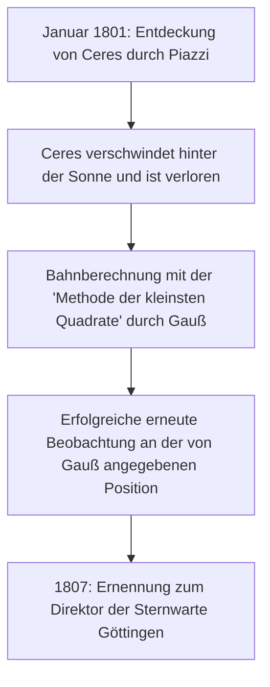

## 1. Einführung: Der Mann, bekannt als „Fürst der Mathematiker“

Johann [Carl Friedrich Gauß](https://kenji.blog/de/p/gauss/) (30. April 1777 - 23. Februar 1855) war ein großer deutscher Mathematiker, Astronom und Physiker. Aufgrund seines überwältigenden Intellekts und seiner entscheidenden Beiträge zu einer Vielzahl von Bereichen wird er als **„Fürst der Mathematiker“** (Princeps mathematicorum) gefeiert. Die Leistungen von Gauß umfassen ein extrem breites Spektrum, von tiefgründigen Theorien in der reinen Mathematik bis hin zur angewandten Mathematik, die physikalische Phänomene in der realen Welt beschreibt.

Die zahlreichen Theoreme und Konzepte, die er hinterließ, bilden das Fundament der modernen Mathematik und Wissenschaft. Die von Gauß entdeckten Gesetze hauchen den Technologien Leben ein, von denen wir täglich profitieren. In diesem Artikel werden wir das Leben dieses beispiellosen Genies chronologisch verfolgen und tief in seine detaillierten Episoden und mathematischen Leistungen eintauchen, um zu sehen, wie er so viele große Taten vollbrachte.

## 2. Geburt eines Wunderkindes: Erstaunliche Kindheitsepisoden

Gauß wurde in einer armen Maurerfamilie in der Stadt Braunschweig im Herzogtum Braunschweig-Wolfenbüttel, Heiliges Römisches Reich, geboren. Seine Eltern erhielten keine ausreichende Ausbildung, und seine Mutter soll fast völlig Analphabetin gewesen sein. Die natürliche Begabung von Gauß erstrahlte jedoch schon in sehr jungen Jahren.

### Die Summe von 1 bis 100 sofort berechnen

Eine der berühmtesten Episoden ereignete sich, als er ein 7-jähriger (oder 10-jähriger) Junge in der Grundschule war. Eines Tages gab sein Rechenlehrer J.G. Büttner den Schülern eine Aufgabe, um sie ruhig zu halten: **„Addiert alle ganzen Zahlen von 1 bis 100.“** Während normale Kinder die Zahlen der Reihe nach addierten, schrieb Gauß in wenigen Sekunden „5050“ auf seine Schiefertafel und legte sie auf das Pult des Lehrers.

Als der Lehrer fragte, wie er das berechnet habe, erklärte Gauß den folgenden Trick.

$$
1 + 2 + 3 + \dots + 98 + 99 + 100
$$

Er addierte dies zur gleichen Folge in umgekehrter Reihenfolge:

$$
\begin{align*}
S &= 1 + 2 + \dots + 99 + 100 \\
S &= 100 + 99 + \dots + 2 + 1
\end{align*}
$$

Addiert man die oberen und unteren Terme jeweils, ergibt jedes Paar „101“.

$$
2S = 101 + 101 + \dots + 101 + 101
$$

Da es 100-mal die „101“ gibt, beträgt die Summe $101 \times 100 = 10100$, und die Division durch 2 ergibt die Antwort $5050$. Diese Anekdote zeigt, dass er intuitiv die Formel für die Summe einer arithmetischen Reihe entdeckte.

Im Allgemeinen wird die Summe $S_n$ der ganzen Zahlen von 1 bis $n$ durch folgende Formel ausgedrückt:

$$
S_n = \sum_{i=1}^{n} i = \frac{n(n+1)}{2}
$$

Durch dieses Ereignis veranlasst, wurden sein Lehrer Büttner und dessen Assistent Martin Bartels (ein Mathematiker, der später Lobatschewski unterrichten sollte) von dem außergewöhnlichen Talent von Gauß überzeugt und gaben ihm fortgeschrittenere Mathematiklehrbücher. Darüber hinaus wurde auf ihre Empfehlung hin Herzog Karl Wilhelm Ferdinand von Braunschweig zum Förderer von Gauß und gewährte ihm ein großzügiges Stipendium für ein Hochschulstudium. Dank dessen besuchte Gauß das Collegium Carolinum (heute Technische Universität Braunschweig) und dann die Universität Göttingen, wo seine Talente aufblühten.

## 3. Jugendlicher Durchbruch: Konstruktion des Siebzehnecks und 'Disquisitiones Arithmeticae'

Gauß, der in die Universität Göttingen eingetreten war, war hin- und hergerissen zwischen einem Studium der Sprachwissenschaften oder der Mathematik. Eine historische Entdeckung, die er im Alter von 19 Jahren machte, veranlasste ihn jedoch zu dem Entschluss, die Mathematik zu seinem lebenslangen Beruf zu machen.

### Konstruktion des regelmäßigen Siebzehnecks mit Zirkel und Lineal

Antike griechische Mathematiker widmeten sich dem Problem der Konstruktion regelmäßiger Vielecke unter ausschließlicher Verwendung eines Lineals (ein Werkzeug zum Zeichnen nicht skalierter Linien) und eines Zirkels (ein Werkzeug zum Zeichnen von Kreisen). Während Methoden zur Konstruktion des gleichseitigen Dreiecks, des Quadrats, des regelmäßigen Fünfecks, des regelmäßigen Fünfzehnecks und von Polygonen, deren Seitenzahl mit Zweierpotenzen multipliziert wird, bekannt waren, galt die Konstruktion anderer primzahlseltiger Polygone (wie das regelmäßige Siebeneck oder Elfeck) als unmöglich.

Am 30. März 1796 bewies Gauß jedoch mathematisch, dass **„das regelmäßige Siebzehneck (17-Eck) allein mit Zirkel und Lineal konstruiert werden kann.“** Er klärte algebraisch die Bedingungen, unter denen die Wurzeln der Kreisteilungsgleichung ausgedrückt werden können, indem man vom Körper der rationalen Zahlen ausgeht und sukzessive Quadratwurzeln hinzufügt.

Konkret leitete er den Satz ab, dass ein regelmäßiges $p$-Eck konstruierbar ist, wenn $p$ eine [Fermat](https://kenji.blog/de/p/fermat/)-Primzahl ist (eine Primzahl der Form $p = 2^{2^n} + 1$). Wenn $n=2$, ist $p = 2^4 + 1 = 17$, was das regelmäßige Siebzehneck einschließt. Gauß war auf diese Entdeckung äußerst stolz und soll darum gebeten haben, ein regelmäßiges Siebzehneck auf seinen Grabstein gravieren zu lassen (in Wirklichkeit wurde ein 17-zackiger Stern gemeißelt, da dieser kaum von einem Kreis zu unterscheiden wäre).

### Disquisitiones Arithmeticae

Das 1801 veröffentlichte Buch *Disquisitiones Arithmeticae*, als Gauß 24 Jahre alt war, ist ein historisches Meisterwerk, das die Zahlentheorie als systematische Disziplin etablierte. In dieser Arbeit führte er die Notation für **„Kongruenzen (modulare Arithmetik)“** ein, die wir heute täglich verwenden.

$$
a \equiv b \pmod{n}
$$

Dies bedeutet, dass „die Reste, wenn $a$ und $b$ durch $n$ geteilt werden, gleich sind“. Die Einführung dieser Notation machte Argumentationen über die komplexen Eigenschaften von Zahlen äußerst prägnant und klar.

Auch in demselben Buch lieferte Gauß den ersten strengen Beweis für das **„Quadratische Reziprozitätsgesetz“**, das als einer der schönsten Sätze in der Zahlentheorie gilt. Dieses Gesetz zeigt, dass für zwei verschiedene ungerade Primzahlen $p, q$ eine höchst symmetrische Beziehung zwischen der Frage besteht, ob die Kongruenz $x^2 \equiv p \pmod{q}$ eine Lösung hat und ob $x^2 \equiv q \pmod{p}$ eine Lösung hat.

Ausgedrückt in mathematischer Formel mit dem [Legendre](https://kenji.blog/de/p/legendre/)-Symbol wird es wie folgt dargestellt:

$$
\left( \frac{p}{q} \right) \left( \frac{q}{p} \right) = (-1)^{\frac{p-1}{2} \frac{q-1}{2}}
$$

Gauß nannte dieses Gesetz das „Goldene Theorem“ und veröffentlichte im Laufe seines Lebens acht verschiedene Beweise dafür.

## 4. Beiträge zur Astronomie: Bahnberechnung von Ceres und die [Methode der kleinsten Quadrate](https://kenji.blog/de/p/method-of-least-squares/)

Das Talent von Gauß beschränkte sich nicht auf die reine Mathematik; er erzielte auch phänomenale Ergebnisse in der Astronomie.

Am 1. Januar 1801 entdeckte der italienische Astronom Giuseppe Piazzi einen neuen Himmelskörper (später Zwergplanet Ceres genannt). Nach einigen Tagen der Beobachtung verschwand der Himmelskörper jedoch hinter der Sonne und geriet aus den Augen. Astronomen der Zeit versuchten, seine weitere Bahn aus nur wenigen Tagen Beobachtungsdaten vorherzusagen, scheiterten jedoch alle.

Hier kam Gauß ins Spiel. Er berechnete die Bahn von Ceres mit einer neuen mathematischen Technik, die er seit einiger Zeit heimlich aufgebaut hatte, der **„[Methode der kleinsten Quadrate](https://kenji.blog/de/p/method-of-least-squares/)“**. Die [Methode der kleinsten Quadrate](https://kenji.blog/de/p/method-of-least-squares/) ist ein Verfahren zur Schätzung der wahrscheinlichsten Parameter, um die in den Beobachtungsdaten enthaltenen Fehler zu minimieren.

Unter der Annahme, dass der beobachtete Wert $y_i$ und der theoretische Wert $f(x_i, \boldsymbol{\theta})$ ist, finden wir den Parameter $\boldsymbol{\theta}$, der die Summe der quadratischen Fehler $S$ minimiert.

$$
S(\boldsymbol{\theta}) = \sum_{i=1}^{n} \left( y_i - f(x_i, \boldsymbol{\theta}) \right)^2
$$

Die von Gauß berechnete vorhergesagte Position wich stark von den Vorhersagen anderer Astronomen ab, aber als sie einige Monate später ihre Teleskope auf die von ihm angegebenen Koordinaten richteten, wurde Ceres genau dort wiederentdeckt. Aufgrund dieses dramatischen Erfolgs hallte der Name Gauß durch die gesamte europäische Wissenschaftsgemeinschaft. Im Jahr 1807 wurde er zum Professor für Astronomie und Direktor der Sternwarte an der Universität Göttingen ernannt, Positionen, die er für den Rest seines Lebens innehatte.

## 5. Geodäsie und Differentialgeometrie: Theorema Egregium

Vom späten 1810er bis in die 1820er Jahre wurde Gauß beauftragt, geodätische Vermessungen für das Königreich Hannover durchzuführen. Durch diese zermürbende Feldarbeit begann er, tief über die Form der Erde und gekrümmte Oberflächen nachzudenken. Um die Vermessungsgenauigkeit zu verbessern, erfand er ein Gerät namens „Heliotrop“, das Sonnenlicht reflektierte, um Lichtsignale an weit entfernte Beobachtungspunkte zu senden.

Gleichzeitig führte diese Vermessungsarbeit zur Schaffung eines neuen Bereichs der Mathematik, der **„Differentialgeometrie“**. Gauß veröffentlichte 1827 die Arbeit *Disquisitiones generales circa superficies curvas* (Allgemeine Untersuchungen über krumme Flächen), in der er eine Methode etablierte, um die Geometrie auf gekrümmten Oberflächen intrinsisch zu behandeln, ohne vom dreidimensionalen Raum abhängig zu sein.

Am berühmtesten darunter ist das **„Theorema Egregium“** (Hervorragender Satz). Dieser Satz zeigt, dass die **Gaußsche Krümmung** $K$ einer Oberfläche (das Produkt der beiden Hauptkrümmungen $k_1$ und $k_2$, $K = k_1 k_2$) eine intrinsische Größe ist, die unverändert bleibt, auch wenn die Oberfläche gebogen wird (solange sie nicht gedehnt oder gestaucht wird).

$$
K = \frac{L N - M^2}{E G - F^2}
$$

(Wobei $E, F, G$ die Koeffizienten der ersten Fundamentalform und $L, M, N$ die Koeffizienten der zweiten Fundamentalform sind)

Nach diesem Satz ist mathematisch bewiesen, dass es beispielsweise unmöglich ist, eine Kugel (positive Krümmung) ohne Verzerrung aus einem flachen Stück Papier (Krümmung 0) herzustellen, egal wie man es aufrollt. Diese Idee der Gaußschen Differentialgeometrie wurde später von [Bernhard Riemann](https://kenji.blog/de/p/riemann/) in höhere Dimensionen verallgemeinert ([Riemann](https://kenji.blog/de/p/riemann/)sche Geometrie) und wurde in späteren Jahren als mathematische Grundlage für Albert Einsteins allgemeine Relativitätstheorie unverzichtbar.

## 6. Normalverteilung und Elektromagnetismus

Die **„Normalverteilung“**, die wichtigste Verteilung in der Statistik, wird oft als **„Gauß-Verteilung“** bezeichnet. Bei der Rechtfertigung der oben genannten [Methode der kleinsten Quadrate](https://kenji.blog/de/p/method-of-least-squares/) ging Gauß davon aus, dass Beobachtungsfehler einer Normalverteilung folgen. Die Wahrscheinlichkeitsdichtefunktion $f(x)$ wird durch folgende Formel ausgedrückt:

$$
f(x) = \frac{1}{\sigma \sqrt{2\pi}} \exp\left( -\frac{1}{2} \left( \frac{x-\mu}{\sigma} \right)^2 \right)
$$

Diese glockenförmige Kurve wird heute in allen wissenschaftlichen Bereichen, einschließlich Physik, Biologie, Wirtschaft und Soziologie, als Grundlage für die Datenanalyse verwendet. Auf der ehemaligen deutschen 10-D-Mark-Banknote war das Porträt von Gauß zusammen mit dieser Kurve und Formel der Normalverteilung abgebildet.

Darüber hinaus widmete sich Gauß in seinen späteren Jahren in Zusammenarbeit mit dem Physiker Wilhelm Weber dem Studium von Magnetismus und Elektrizität. Sie erfanden ein neues Magnetometer zur Messung des Erdmagnetfeldes und konstruierten 1833 den weltweit ersten praktischen elektromagnetischen Telegraphen, mit dem sie erfolgreich zwischen dem Institut und der Sternwarte kommunizierten.

Das **„Gaußsche Gesetz“**, eines der grundlegenden Gesetze im Elektromagnetismus, ist als eine der Maxwell-Gleichungen integriert. Die Differentialform des Gaußschen Gesetzes für elektrische Felder wird wie folgt beschrieben:

$$
\nabla \cdot \mathbf{E} = \frac{\rho}{\varepsilon_0}
$$

Das Gaußsche Gesetz für Magnetfelder besagt auch, dass „magnetische Monopole nicht existieren“.

$$
\nabla \cdot \mathbf{B} = 0
$$

Die Einheit der magnetischen Flussdichte, das „Gauß (G)“, ist ebenfalls nach ihm benannt.

## 7. Verborgene Einblicke in die nicht-euklidische Geometrie

Eine Episode, die die erstaunliche Weitsicht von Gauß zeigt, ist die Anekdote zur **„Nicht-euklidischen Geometrie“**. Ob [Euklid](https://kenji.blog/de/p/euclid/)s Parallelenaxiom (durch einen Punkt außerhalb einer Geraden gibt es genau eine parallele Gerade) bewiesen werden könnte, war über 2.000 Jahre lang ein großes mathematisches Rätsel gewesen.

In seinen unveröffentlichten Notizen war sich Gauß der Existenz einer neuen Geometrie (hyperbolische Geometrie), in der das Parallelenaxiom nicht gilt, völlig bewusst und hatte deren System aufgebaut. In den konservativen philosophischen Kreisen der Zeit (eine Ära, in der die kantische Philosophie vorherrschend war) befürchtete er jedoch, in unverständliche Kritik und Kontroversen (in Gauß' Worten „das Geschrei der Böotier“) verwickelt zu werden, wenn er eine Theorie veröffentlichte, die die Absolutheit des Raumes leugnet, weshalb er sie zu seinen Lebzeiten nie veröffentlichte.

Als später Nikolai Lobatschewski und János Bolyai unabhängig voneinander die nicht-euklidische Geometrie veröffentlichten, antwortete Gauß, nachdem er ein Papier von Bolyais Vater (einem alten Freund von Gauß) erhalten hatte: „Es zu loben, hieße, mich selbst zu loben. Denn der gesamte Inhalt der Arbeit stimmt fast genau mit meinen eigenen Meditationen überein, die meinen Geist seit dreißig bis fünfunddreißig Jahren beschäftigen.“ Es wird gesagt, dass der junge Bolyai davon zutiefst enttäuscht war, aber gleichzeitig dient es als Beweis dafür, wie weit Gauß seiner Zeit voraus war.

## 8. Spätere Jahre und Vermächtnis

Gauß war ein Perfektionist, mit dem Motto **„Pauca sed matura“** (Weniges, aber Reifes). Da er seine Papiere nicht veröffentlichte, bis er völlig zufrieden war und sie in einer wunderbar verfeinerten Form vorlagen, wurden nach seinem Tod massive Mengen unveröffentlichter Notizen entdeckt, die spätere Mathematiker in Erstaunen versetzten. Viele der Theorien, die später von anderen Mathematikern entdeckt und berühmt gemacht wurden, wie die komplexe Integration ([Cauchy](https://kenji.blog/de/p/cauchy/)s Integralsatz), Quaternionen und die Grundlagen der elliptischen Funktionstheorie, waren bereits in den Notizen von Gauß verzeichnet.

Er war auch Mentor der nächsten Generation. Neben dem bereits erwähnten [Riemann](https://kenji.blog/de/p/riemann/) erhielten große Mathematiker der nächsten Generation wie Richard Dedekind und Ferdinand Gotthold Max Eisenstein die Anleitung von Gauß.

Am 23. Februar 1855 verstarb [Carl Friedrich Gauß](https://kenji.blog/de/p/gauss/) in Göttingen im Alter von 77 Jahren. Sein Vermächtnis überschreitet die Grenzen der Mathematik und fließt an der Wurzel aller modernen Wissenschaft und Technologie. Vom reinen abstrakten Denken über die Berechnung von Planetenbahnen bis hin zum physikalischen Phänomen des Elektromagnetismus leuchtet das Licht seines Intellekts auch heute noch.

Wenn wir in den Nachthimmel blicken oder Kommunikation über unsere Smartphones nutzen, sind die großartigen Fußstapfen von Gauß, dem „Fürsten der Mathematiker“, mit Sicherheit dort.
