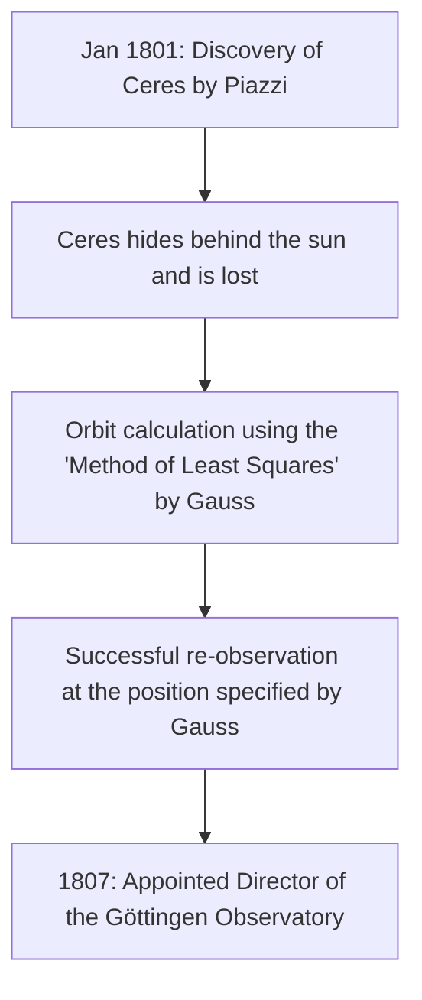

## 1. Introduction: The Man Known as the "Prince of Mathematicians"

Johann [Carl Friedrich Gauss](https://kenji.blog/en/p/gauss/) (April 30, 1777 - February 23, 1855) was a great German mathematician, astronomer, and physicist. Due to his overwhelming intellect and decisive contributions to a wide range of fields, he is hailed as the **"Prince of Mathematicians"** (Princeps mathematicorum). Gauss's achievements cover an extremely broad spectrum, from profound theories in pure mathematics to applied mathematics that describes physical phenomena in the real world.

The numerous theorems and concepts he left behind form the foundation of modern mathematics and science. The laws discovered by Gauss breathe life into the technologies we benefit from daily. In this article, we will follow the life of this unprecedented genius chronologically, delving deeply into his detailed episodes and mathematical achievements to see how he accomplished so many great feats.

## 2. Birth of a Prodigy: Astonishing Childhood Episodes

Gauss was born in a poor bricklayer's family in the town of Braunschweig in the Duchy of Brunswick-Wolfenbüttel, Holy Roman Empire. His parents did not receive a sufficient education, and his mother was said to be almost entirely illiterate. However, Gauss's natural gift shone brightly from a very young age.

### Instantly Calculating the Sum from 1 to 100

One of the most famous episodes occurred when he was a 7-year-old (or 10-year-old) boy in elementary school. One day, his arithmetic teacher, J.G. Büttner, gave the students a task to keep them quiet: **"Add up all the integers from 1 to 100."** While normal children were adding the numbers sequentially, Gauss wrote "5050" on his slate in just a few seconds and handed it to the teacher's desk.

When the teacher asked how he calculated it, Gauss explained the following trick.

$$
1 + 2 + 3 + \dots + 98 + 99 + 100
$$

He added this to the same sequence in reverse order:

$$
\begin{align*}
S &= 1 + 2 + \dots + 99 + 100 \\
S &= 100 + 99 + \dots + 2 + 1
\end{align*}
$$

Adding the top and bottom terms respectively, each pair equals "101".

$$
2S = 101 + 101 + \dots + 101 + 101
$$

Since there are 100 "101"s, the total is $101 \times 100 = 10100$, and dividing this by 2 yields the answer $5050$. This anecdote shows that he intuitively discovered the formula for the sum of an arithmetic progression.

Generally, the sum $S_n$ of integers from 1 to $n$ is expressed by the following formula:

$$
S_n = \sum_{i=1}^{n} i = \frac{n(n+1)}{2}
$$

Prompted by this event, his teacher Büttner and his assistant Martin Bartels (a mathematician who would later teach Lobachevsky) became convinced of Gauss's extraordinary talent and gave him more advanced mathematics textbooks. Furthermore, upon their recommendation, Duke Karl Wilhelm Ferdinand of Brunswick became Gauss's patron, providing him with a generous scholarship to receive higher education. Thanks to this, Gauss advanced to the Collegium Carolinum (now the Technical University of Brunswick) and then to the University of Göttingen, where his talents blossomed.

## 3. Youthful Breakthroughs: Construction of the Heptadecagon and 'Disquisitiones Arithmeticae'

Gauss, who had entered the University of Göttingen, was torn between majoring in linguistics or mathematics. However, a historical discovery he made at the age of 19 led him to resolve to make mathematics his lifelong profession.

### Construction of the Regular Heptadecagon with Compass and Straightedge

Ancient Greek mathematicians tackled the problem of constructing regular polygons using only a straightedge (a tool for drawing ungraduated lines) and a compass (a tool for drawing circles). While methods for constructing the equilateral triangle, square, regular pentagon, regular pentadecagon, and polygons with the number of sides multiplied by powers of 2 were known, constructing other prime-sided polygons (such as the regular heptagon or regular hendecagon) was considered impossible.

However, on March 30, 1796, Gauss mathematically proved that **"the regular heptadecagon (17-sided polygon) can be constructed using only a compass and straightedge."** He algebraically elucidated the conditions under which the roots of the cyclotomic equation can be expressed by starting from the field of rational numbers and successively adding square roots.

Specifically, he derived the theorem that if $p$ is a [Fermat](https://kenji.blog/en/p/fermat/) prime (a prime of the form $p = 2^{2^n} + 1$), the regular $p$-gon is constructible. When $n=2$, $p = 2^4 + 1 = 17$, which includes the regular heptadecagon. Gauss was extremely proud of this discovery and reportedly requested that a regular heptadecagon be engraved on his tombstone (in reality, a 17-pointed star was carved because it would be indistinguishable from a circle).

### Disquisitiones Arithmeticae

Published in 1801 when Gauss was 24 years old, the book *Disquisitiones Arithmeticae* is a historical masterpiece that established number theory as a systematic discipline. In this work, he introduced the notation for **"congruences (modular arithmetic)"** that we use daily today.

$$
a \equiv b \pmod{n}
$$

This means that "the remainders when $a$ and $b$ are divided by $n$ are equal". The introduction of this notation made arguments about the complex properties of numbers extremely concise and clear.

Also in the same book, Gauss provided the first rigorous proof of the **"Law of Quadratic Reciprocity"**, considered one of the most beautiful theorems in number theory. This law shows that for two different odd primes $p, q$, there is a highly symmetrical relationship between whether the congruence $x^2 \equiv p \pmod{q}$ has a solution and whether $x^2 \equiv q \pmod{p}$ has a solution.

Expressed in mathematical formula using the [Legendre](https://kenji.blog/en/p/legendre/) symbol, it is represented as follows:

$$
\left( \frac{p}{q} \right) \left( \frac{q}{p} \right) = (-1)^{\frac{p-1}{2} \frac{q-1}{2}}
$$

Gauss called this law the "Golden Theorem" and published eight different proofs of it throughout his life.

## 4. Contributions to Astronomy: Orbit Calculation of Ceres and the [Method of Least Squares](https://kenji.blog/en/p/method-of-least-squares/)

Gauss's talents were not limited to pure mathematics; he also achieved phenomenal results in astronomy.

On January 1, 1801, Italian astronomer Giuseppe Piazzi discovered a new celestial body (later called the dwarf planet Ceres). However, after a few days of observation, the celestial body hid behind the sun and was lost sight of. Astronomers of the time attempted to predict its subsequent orbit from just a few days of observation data, but all failed.

This is where Gauss came in. He calculated the orbit of Ceres using a new mathematical technique he had secretly built up for some time, the **"[Method of Least Squares](https://kenji.blog/en/p/method-of-least-squares/)"**. The method of least squares is a technique for estimating the most probable parameters to minimize the errors contained in observation data.

Assuming the observed value is $y_i$ and the theoretical value is $f(x_i, \boldsymbol{\theta})$, we find the parameter $\boldsymbol{\theta}$ that minimizes the sum of squared errors $S$.

$$
S(\boldsymbol{\theta}) = \sum_{i=1}^{n} \left( y_i - f(x_i, \boldsymbol{\theta}) \right)^2
$$

The predicted position calculated by Gauss differed greatly from the predictions of other astronomers, but when they pointed their telescopes at the coordinates he specified a few months later, Ceres was rediscovered right there. Due to this dramatic success, Gauss's name echoed throughout the European scientific community. In 1807, he was appointed Professor of Astronomy and Director of the Observatory at the University of Göttingen, positions he held for the rest of his life.

## 5. Geodesy and Differential Geometry: Theorema Egregium

From the late 1810s to the 1820s, Gauss was commissioned to conduct geodetic surveys for the Kingdom of Hanover. Through this grueling fieldwork, he began to think deeply about the shape of the earth and curved surfaces. To improve survey accuracy, he invented a device called the "heliotrope," which reflected sunlight to send light signals to distant observation points.

At the same time, this survey work led to the creation of a new field of mathematics, **"Differential Geometry"**. Gauss published the paper *General Investigations of Curved Surfaces* in 1827, establishing a method for treating the geometry on curved surfaces intrinsically, without depending on three-dimensional space.

The most famous among these is the **"Theorema Egregium"** (Remarkable Theorem). This theorem shows that the **Gaussian curvature** $K$ of a surface (the product of the two principal curvatures $k_1$ and $k_2$, $K = k_1 k_2$) is an intrinsic quantity that remains unchanged even if the surface is bent (as long as it is not stretched or shrunk).

$$
K = \frac{L N - M^2}{E G - F^2}
$$

(Where $E, F, G$ are the coefficients of the first fundamental form, and $L, M, N$ are the coefficients of the second fundamental form)

According to this theorem, it is mathematically proven that, for example, no matter how a flat piece of paper (curvature 0) is rolled up, it is impossible to make a sphere (positive curvature) without distortion. This idea of Gauss's differential geometry was later generalized to higher dimensions by [Bernhard Riemann](https://kenji.blog/en/p/riemann/) ([Riemann](https://kenji.blog/en/p/riemann/)ian geometry) and further became indispensable as the mathematical foundation for Albert Einstein's general theory of relativity in later years.

## 6. Gaussian Distribution and Electromagnetism

The **"Normal Distribution"**, the most important distribution in statistics, is often called the **"Gaussian Distribution"**. In justifying the aforementioned method of least squares, Gauss assumed that observation errors follow a normal distribution. The probability density function $f(x)$ is expressed by the following formula:

$$
f(x) = \frac{1}{\sigma \sqrt{2\pi}} \exp\left( -\frac{1}{2} \left( \frac{x-\mu}{\sigma} \right)^2 \right)
$$

This bell-shaped curve is now used as the basis for data analysis in all scientific fields, including physics, biology, economics, and sociology. The former German 10 Deutsche Mark banknote featured Gauss's portrait alongside this Gaussian distribution curve and formula.

Furthermore, in his later years, Gauss devoted himself to the study of magnetism and electricity in collaboration with physicist Wilhelm Weber. They invented a new magnetometer for measuring the Earth's magnetic field, and in 1833 constructed the world's first practical electromagnetic telegraph, successfully communicating between the institute and the observatory.

**"Gauss's Law"**, one of the fundamental laws in electromagnetism, is incorporated as one of Maxwell's equations. The differential form of Gauss's law for electric fields is described as follows:

$$
\nabla \cdot \mathbf{E} = \frac{\rho}{\varepsilon_0}
$$

Also, Gauss's law for magnetic fields indicates that "magnetic monopoles do not exist."

$$
\nabla \cdot \mathbf{B} = 0
$$

The unit of magnetic flux density, the "Gauss (G)", is also named after him.

## 7. Hidden Insights into Non-[Euclide](https://kenji.blog/en/p/euclid/)an Geometry

An episode showing Gauss's amazing foresight is the anecdote regarding **"Non-[Euclide](https://kenji.blog/en/p/euclid/)an Geometry"**. Whether [Euclid](https://kenji.blog/en/p/euclid/)'s parallel postulate (through a point outside a line, there is exactly one parallel line) could be proven had been a great mathematical mystery for over 2,000 years.

In his unpublished notes, Gauss was completely aware of the existence of a new geometry (hyperbolic geometry) in which the parallel postulate does not hold, and had constructed its system. However, in the conservative philosophical circles of the time (an era when Kantian philosophy was mainstream), he feared getting involved in uncomprehending criticism and controversy (in Gauss's words, "the clamor of the Boeotians") if he published a theory denying the absoluteness of space, so he never published it during his lifetime.

Later, when Nikolai Lobachevsky and János Bolyai independently published non-[Euclide](https://kenji.blog/en/p/euclid/)an geometry, Gauss, upon receiving a paper from Bolyai's father (an old friend of Gauss), replied, "To praise it would amount to praising myself. For the entire content of the work coincides almost exactly with my own meditations which have occupied my mind for from thirty to thirty-five years." It is said that the young Bolyai was deeply disappointed by this, but at the same time, it serves as evidence of how far ahead of his time Gauss was.

## 8. Later Years and Legacy

Gauss was a perfectionist, with the motto **"Few, but ripe"** (Pauca sed matura). Because he did not publish his papers until he was completely satisfied and they were in a beautifully refined form, massive amounts of unpublished notes were discovered after his death, astounding later mathematicians. Many of the theories later discovered and made famous by other mathematicians, such as complex integration ([Cauchy](https://kenji.blog/en/p/cauchy/)'s integral theorem), quaternions, and the foundations of elliptic function theory, were already written in Gauss's notes.

He also mentored the next generation. In addition to the aforementioned [Riemann](https://kenji.blog/en/p/riemann/), great mathematicians of the next generation such as Richard Dedekind and Ferdinand Gotthold Max Eisenstein received Gauss's guidance.

On February 23, 1855, [Carl Friedrich Gauss](https://kenji.blog/en/p/gauss/) passed away in Göttingen at the age of 77. His legacy transcends the boundaries of mathematics and flows at the root of all modern science and technology. From pure abstract thought to the calculation of planetary orbits, and down to the physical phenomenon of electromagnetism, the light of his intellect continues to shine even today.

When we look up at the night sky or use communication on our smartphones, the great footprints of Gauss, the "Prince of Mathematicians," are certainly there.
