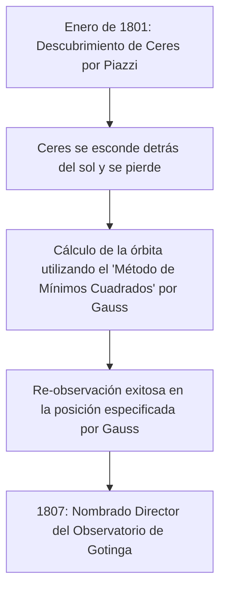

## 1. Introducción: El hombre conocido como el "Príncipe de los Matemáticos"

Johann [Carl Friedrich Gauss](https://kenji.blog/p/gauss/) (30 de abril de 1777 - 23 de febrero de 1855) fue un gran matemático, astrónomo y físico alemán. Debido a su abrumador intelecto y sus contribuciones decisivas a una amplia gama de campos, es aclamado como el **"Príncipe de los Matemáticos"** (Princeps mathematicorum). Los logros de Gauss cubren un espectro extremadamente amplio, desde profundas teorías en matemáticas puras hasta matemáticas aplicadas que describen fenómenos físicos en el mundo real.

Los numerosos teoremas y conceptos que dejó forman la base de las matemáticas y la ciencia modernas. Las leyes descubiertas por Gauss infunden vida a las tecnologías de las que nos beneficiamos a diario. En este artículo, seguiremos la vida de este genio sin precedentes cronológicamente, profundizando en sus episodios detallados y logros matemáticos para ver cómo logró tantas grandes hazañas.

## 2. Nacimiento de un prodigio: Asombrosos episodios de la infancia

Gauss nació en el seno de una familia pobre de albañiles en la ciudad de Brunswick, en el Ducado de Brunswick-Wolfenbüttel, Sacro Imperio Romano Germánico. Sus padres no recibieron una educación suficiente, y se decía que su madre era casi completamente analfabeta. Sin embargo, el don natural de Gauss brilló intensamente desde una edad muy temprana.

### Calculando instantáneamente la suma del 1 al 100

Uno de los episodios más famosos ocurrió cuando era un niño de 7 años (o de 10 años) en la escuela primaria. Un día, su profesor de aritmética, J.G. Büttner, dio a los estudiantes una tarea para mantenerlos callados: **"Sumen todos los números enteros del 1 al 100"**. Mientras los niños normales sumaban los números secuencialmente, Gauss escribió "5050" en su pizarra en solo unos segundos y la entregó en el escritorio del profesor.

Cuando el profesor le preguntó cómo lo había calculado, Gauss explicó el siguiente truco.

$$
1 + 2 + 3 + \dots + 98 + 99 + 100
$$

A esto le sumó la misma secuencia en orden inverso:

$$
\begin{align*}
S &= 1 + 2 + \dots + 99 + 100 \\
S &= 100 + 99 + \dots + 2 + 1
\end{align*}
$$

Sumando los términos superior e inferior respectivamente, cada par equivale a "101".

$$
2S = 101 + 101 + \dots + 101 + 101
$$

Dado que hay cien "101", el total es $101 \times 100 = 10100$, y dividir esto por 2 da la respuesta $5050$. Esta anécdota muestra que descubrió intuitivamente la fórmula de la suma de una progresión aritmética.

Generalmente, la suma $S_n$ de enteros del 1 al $n$ se expresa mediante la siguiente fórmula:

$$
S_n = \sum_{i=1}^{n} i = \frac{n(n+1)}{2}
$$

Impulsado por este evento, su profesor Büttner y su asistente Martin Bartels (un matemático que más tarde enseñaría a Lobachevsky) se convencieron del extraordinario talento de Gauss y le dieron libros de texto de matemáticas más avanzados. Además, por recomendación suya, el duque Karl Wilhelm Ferdinand de Brunswick se convirtió en el mecenas de Gauss, proporcionándole una generosa beca para recibir educación superior. Gracias a esto, Gauss avanzó al Collegium Carolinum (ahora Universidad Técnica de Brunswick) y luego a la Universidad de Gotinga, donde florecieron sus talentos.

## 3. Avances juveniles: Construcción del heptadecágono y 'Disquisitiones Arithmeticae'

Gauss, que había ingresado a la Universidad de Gotinga, estaba dividido entre especializarse en lingüística o matemáticas. Sin embargo, un descubrimiento histórico que hizo a la edad de 19 años lo llevó a decidir hacer de las matemáticas su profesión de por vida.

### Construcción del heptadecágono regular con compás y regla

Los antiguos matemáticos griegos abordaron el problema de construir polígonos regulares utilizando solo una regla (una herramienta para dibujar líneas no graduadas) y un compás (una herramienta para dibujar círculos). Aunque se conocían métodos para construir el triángulo equilátero, el cuadrado, el pentágono regular, el pentadecágono regular y polígonos con el número de lados multiplicados por potencias de 2, la construcción de otros polígonos de lados primos (como el heptágono regular o el endecágono regular) se consideraba imposible.

Sin embargo, el 30 de marzo de 1796, Gauss demostró matemáticamente que **"el heptadecágono regular (polígono de 17 lados) se puede construir utilizando solo un compás y una regla no graduada"**. Dilucidó algebraicamente las condiciones bajo las cuales las raíces de la ecuación ciclotómica se pueden expresar partiendo del cuerpo de los números racionales y añadiendo sucesivamente raíces cuadradas.

Específicamente, derivó el teorema de que si $p$ es un primo de Fermat (un primo de la forma $p = 2^{2^n} + 1$), el $p$-ágono regular es construible. Cuando $n=2$, $p = 2^4 + 1 = 17$, lo que incluye el heptadecágono regular. Gauss estaba extremadamente orgulloso de este descubrimiento y, según se informa, solicitó que se grabara un heptadecágono regular en su lápida (en realidad, se talló una estrella de 17 puntas porque sería indistinguible de un círculo).

### Disquisitiones Arithmeticae

Publicado en 1801 cuando Gauss tenía 24 años, el libro *Disquisitiones Arithmeticae* es una obra maestra histórica que estableció la teoría de números como una disciplina sistemática. En este trabajo, introdujo la notación para **"congruencias (aritmética modular)"** que usamos a diario en la actualidad.

$$
a \equiv b \pmod{n}
$$

Esto significa que "los restos cuando $a$ y $b$ se dividen por $n$ son iguales". La introducción de esta notación hizo que los argumentos sobre las propiedades complejas de los números fueran extremadamente concisos y claros.

También en el mismo libro, Gauss proporcionó la primera prueba rigurosa de la **"Ley de Reciprocidad Cuadrática"**, considerada uno de los teoremas más hermosos de la teoría de números. Esta ley muestra que para dos primos impares diferentes $p, q$, existe una relación altamente simétrica entre si la congruencia $x^2 \equiv p \pmod{q}$ tiene solución y si $x^2 \equiv q \pmod{p}$ tiene solución.

Expresado en fórmula matemática utilizando el símbolo de Legendre, se representa de la siguiente manera:

$$
\left( \frac{p}{q} \right) \left( \frac{q}{p} \right) = (-1)^{\frac{p-1}{2} \frac{q-1}{2}}
$$

Gauss llamó a esta ley el "Teorema de Oro" y publicó ocho pruebas diferentes a lo largo de su vida.

## 4. Contribuciones a la astronomía: Cálculo de la órbita de Ceres y el [Método de Mínimos Cuadrados](https://kenji.blog/p/method-of-least-squares/)

Los talentos de Gauss no se limitaron a las matemáticas puras; también logró resultados fenomenales en astronomía.

El 1 de enero de 1801, el astrónomo italiano Giuseppe Piazzi descubrió un nuevo cuerpo celeste (más tarde llamado planeta enano Ceres). Sin embargo, después de unos días de observación, el cuerpo celeste se escondió detrás del sol y se perdió de vista. Los astrónomos de la época intentaron predecir su órbita posterior a partir de solo unos pocos días de datos de observación, pero todos fracasaron.

Aquí es donde entró Gauss. Calculó la órbita de Ceres utilizando una nueva técnica matemática que había estado construyendo en secreto durante algún tiempo, el **"[Método de Mínimos Cuadrados](https://kenji.blog/p/method-of-least-squares/)"**. El método de mínimos cuadrados es una técnica para estimar los parámetros más probables para minimizar los errores contenidos en los datos de observación.

Suponiendo que el valor observado es $y_i$ y el valor teórico es $f(x_i, \boldsymbol{\theta})$, encontramos el parámetro $\boldsymbol{\theta}$ que minimiza la suma de errores al cuadrado $S$.

$$
S(\boldsymbol{\theta}) = \sum_{i=1}^{n} \left( y_i - f(x_i, \boldsymbol{\theta}) \right)^2
$$

La posición prevista calculada por Gauss difería mucho de las predicciones de otros astrónomos, pero cuando apuntaron sus telescopios a las coordenadas que especificó unos meses después, Ceres fue redescubierto justo allí. Debido a este éxito dramático, el nombre de Gauss resonó en toda la comunidad científica europea. En 1807, fue nombrado Profesor de Astronomía y Director del Observatorio de la Universidad de Gotinga, cargos que ocupó por el resto de su vida.

## 5. Geodesia y Geometría Diferencial: Theorema Egregium

Desde finales de la década de 1810 hasta la década de 1820, Gauss recibió el encargo de realizar estudios geodésicos para el Reino de Hannover. A través de este agotador trabajo de campo, comenzó a pensar profundamente sobre la forma de la tierra y las superficies curvas. Para mejorar la precisión de la topografía, inventó un dispositivo llamado "heliotropo", que reflejaba la luz solar para enviar señales luminosas a puntos de observación distantes.

Al mismo tiempo, este trabajo de topografía condujo a la creación de un nuevo campo de las matemáticas, la **"Geometría Diferencial"**. Gauss publicó el artículo *Investigaciones generales sobre superficies curvas* en 1827, estableciendo un método para tratar la geometría en superficies curvas de forma intrínseca, sin depender del espacio tridimensional.

El más famoso de ellos es el **"Theorema Egregium"** (Teorema Destacable). Este teorema muestra que la **curvatura gaussiana** $K$ de una superficie (el producto de las dos curvaturas principales $k_1$ y $k_2$, $K = k_1 k_2$) es una cantidad intrínseca que permanece sin cambios incluso si la superficie se dobla (siempre que no se estire ni se encoja).

$$
K = \frac{L N - M^2}{E G - F^2}
$$

(Donde $E, F, G$ son los coeficientes de la primera forma fundamental, y $L, M, N$ son los coeficientes de la segunda forma fundamental)

Según este teorema, se demuestra matemáticamente que, por ejemplo, no importa cómo se enrolle un trozo de papel plano (curvatura 0), es imposible hacer una esfera (curvatura positiva) sin distorsión. Esta idea de la geometría diferencial de Gauss fue posteriormente generalizada a dimensiones superiores por [Bernhard Riemann](https://kenji.blog/p/riemann/) (geometría riemanniana) y se volvió indispensable como base matemática para la teoría de la relatividad general de Albert Einstein en años posteriores.

## 6. Distribución Gaussiana y Electromagnetismo

La **"Distribución Normal"**, la distribución más importante en estadística, a menudo se llama **"Distribución de Gauss"**. Al justificar el método de mínimos cuadrados mencionado anteriormente, Gauss asumió que los errores de observación siguen una distribución normal. La función de densidad de probabilidad $f(x)$ se expresa mediante la siguiente fórmula:

$$
f(x) = \frac{1}{\sigma \sqrt{2\pi}} \exp\left( -\frac{1}{2} \left( \frac{x-\mu}{\sigma} \right)^2 \right)
$$

Esta curva en forma de campana se utiliza ahora como base para el análisis de datos en todos los campos científicos, incluyendo la física, la biología, la economía y la sociología. El antiguo billete de 10 marcos alemanes presentaba el retrato de Gauss junto a esta curva y fórmula de distribución gaussiana.

Además, en sus últimos años, Gauss se dedicó al estudio del magnetismo y la electricidad en colaboración con el físico Wilhelm Weber. Inventaron un nuevo magnetómetro para medir el campo magnético de la Tierra y en 1833 construyerun el primer telégrafo electromagnético práctico del mundo, comunicándose con éxito entre el instituto y el observatorio.

La **"Ley de Gauss"**, una de las leyes fundamentales del electromagnetismo, se incorpora como una de las ecuaciones de Maxwell. La forma diferencial de la ley de Gauss para campos eléctricos se describe de la siguiente manera:

$$
\nabla \cdot \mathbf{E} = \frac{\rho}{\varepsilon_0}
$$

Además, la ley de Gauss para campos magnéticos indica que "no existen los monopolos magnéticos".

$$
\nabla \cdot \mathbf{B} = 0
$$

La unidad de densidad de flujo magnético, el "Gauss (G)", también lleva su nombre.

## 7. Visiones ocultas sobre la geometría no euclidiana

Un episodio que muestra la asombrosa previsión de Gauss es la anécdota sobre la **"Geometría no euclidiana"**. Si el postulado de las paralelas de [Euclides](https://kenji.blog/p/euclid/) (por un punto exterior a una recta, pasa exactamente una recta paralela) podía ser probado, había sido un gran misterio matemático durante más de 2000 años.

En sus notas inéditas, Gauss era completamente consciente de la existencia de una nueva geometría (geometría hiperbólica) en la que el postulado de las paralelas no se cumple, y había construido su sistema. Sin embargo, en los círculos filosóficos conservadores de la época (una época en que la filosofía kantiana era la corriente principal), temía verse envuelto en críticas y controversias incomprensibles (en palabras de Gauss, "el clamor de los beocios") si publicaba una teoría que negara la absolutidad del espacio, por lo que nunca la publicó en vida.

Más tarde, cuando Nikolai Lobachevsky y János Bolyai publicaron independientemente la geometría no euclidiana, Gauss, al recibir un artículo del padre de Bolyai (un viejo amigo de Gauss), respondió: "Elogiarlo equivaldría a elogiarme a mí mismo. Porque todo el contenido del trabajo coincide casi exactamente con mis propias meditaciones que han ocupado mi mente durante treinta a treinta y cinco años". Se dice que el joven Bolyai se sintió profundamente decepcionado por esto, pero al mismo tiempo, sirve como evidencia de lo adelantado a su tiempo que estaba Gauss.

## 8. Últimos años y legado

Gauss era un perfeccionista, con el lema **"Pocos, pero maduros"** (Pauca sed matura). Debido a que no publicaba sus artículos hasta que estaba completamente satisfecho y estaban en una forma bellamente refinada, se descubrieron cantidades masivas de notas inéditas después de su muerte, asombrando a los matemáticos posteriores. Muchas de las teorías luego descubiertas y hechas famosas por otros matemáticos, como la integración compleja (teorema integral de Cauchy), los cuaterniones y los fundamentos de la teoría de funciones elípticas, ya estaban escritas en las notas de Gauss.

También fue mentor de la próxima generación. Además del mencionado Riemann, grandes matemáticos de la siguiente generación como Richard Dedekind y Ferdinand Gotthold Max Eisenstein recibieron la guía de Gauss.

El 23 de febrero de 1855, [Carl Friedrich Gauss](https://kenji.blog/p/gauss/) falleció en Gotinga a la edad de 77 años. Su legado trasciende los límites de las matemáticas y fluye en la raíz de toda la ciencia y tecnología modernas. Desde el pensamiento abstracto puro hasta el cálculo de órbitas planetarias y hasta el fenómeno físico del electromagnetismo, la luz de su intelecto continúa brillando incluso hoy.

Cuando miramos el cielo nocturno o usamos la comunicación en nuestros teléfonos inteligentes, las grandes huellas de Gauss, el "Príncipe de los Matemáticos", ciertamente están ahí.
