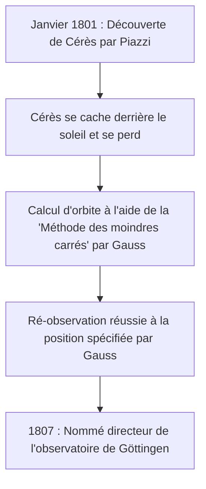

## 1. Introduction : L'homme connu sous le nom de "Prince des Mathématiciens"

Johann [Carl Friedrich Gauss](https://kenji.blog/fr/p/gauss/) (30 avril 1777 - 23 février 1855) était un grand mathématicien, astronome et physicien allemand. En raison de son intellect écrasant et de ses contributions décisives dans de très nombreux domaines, il est salué comme le **"Prince des Mathématiciens"** (Princeps mathematicorum). Les réalisations de Gauss couvrent un spectre extrêmement large, des théories profondes des mathématiques pures aux mathématiques appliquées qui décrivent les phénomènes physiques du monde réel.

Les nombreux théorèmes et concepts qu'il a laissés derrière lui forment le fondement des mathématiques et des sciences modernes. Les lois découvertes par Gauss insufflent la vie aux technologies dont nous bénéficions quotidiennement. Dans cet article, nous suivrons la vie de ce génie sans précédent de manière chronologique, en plongeant profondément dans ses épisodes détaillés et ses réalisations mathématiques pour voir comment il a accompli tant de grands exploits.

## 2. Naissance d'un prodige : des épisodes d'enfance étonnants

Gauss est né dans une famille pauvre de maçons dans la ville de Brunswick, dans le duché de Brunswick-Wolfenbüttel (Saint-Empire romain germanique). Ses parents n'avaient pas reçu une éducation suffisante et on disait que sa mère était presque entièrement analphabète. Cependant, le don naturel de Gauss a brillé de mille feux dès son plus jeune âge.

### Calcul instantané de la somme de 1 à 100

L'un des épisodes les plus célèbres s'est produit alors qu'il était un garçon de 7 ans (ou 10 ans) à l'école primaire. Un jour, son professeur d'arithmétique, J.G. Büttner, a donné une tâche aux élèves pour qu'ils restent tranquilles : **"Additionnez tous les nombres entiers de 1 à 100."** Alors que les enfants normaux additionnaient les nombres de manière séquentielle, Gauss a écrit "5050" sur son ardoise en quelques secondes et l'a remise sur le bureau du professeur.

Lorsque le professeur a demandé comment il l'avait calculé, Gauss a expliqué l'astuce suivante.

$$
1 + 2 + 3 + \dots + 98 + 99 + 100
$$

Il a ajouté cela à la même séquence dans l'ordre inverse :

$$
\begin{align*}
S &= 1 + 2 + \dots + 99 + 100 \\
S &= 100 + 99 + \dots + 2 + 1
\end{align*}
$$

En additionnant respectivement les termes du haut et du bas, chaque paire équivaut à "101".

$$
2S = 101 + 101 + \dots + 101 + 101
$$

Puisqu'il y a cent "101", le total est de $101 \times 100 = 10100$, et en divisant ce total par 2, on obtient la réponse $5050$. Cette anecdote montre qu'il a intuitivement découvert la formule de la somme d'une progression arithmétique.

Généralement, la somme $S_n$ des entiers de 1 à $n$ est exprimée par la formule suivante :

$$
S_n = \sum_{i=1}^{n} i = \frac{n(n+1)}{2}
$$

Poussé par cet événement, son professeur Büttner et son assistant Martin Bartels (un mathématicien qui enseignera plus tard à Lobatchevski) ont été convaincus du talent extraordinaire de Gauss et lui ont donné des manuels de mathématiques plus avancés. De plus, sur leur recommandation, le duc Karl Wilhelm Ferdinand de Brunswick est devenu le protecteur de Gauss, lui offrant une généreuse bourse pour recevoir un enseignement supérieur. Grâce à cela, Gauss intègre le Collegium Carolinum (aujourd'hui l'Université technique de Brunswick) puis l'Université de Göttingen, où ses talents s'épanouissent.

## 3. Découvertes de jeunesse : construction de l'heptadécagone et "Disquisitiones Arithmeticae"

Gauss, entré à l'Université de Göttingen, hésitait entre se spécialiser en linguistique ou en mathématiques. Cependant, une découverte historique qu'il a faite à l'âge de 19 ans l'a amené à se résoudre à faire des mathématiques sa profession de toujours.

### Construction de l'heptadécagone régulier avec un compas et une règle

Les anciens mathématiciens grecs s'étaient penchés sur le problème de la construction de polygones réguliers en utilisant uniquement une règle (un outil pour tracer des lignes non graduées) et un compas (un outil pour dessiner des cercles). Bien que des méthodes pour construire le triangle équilatéral, le carré, le pentagone régulier, le pentadécagone régulier et des polygones dont le nombre de côtés est multiplié par des puissances de 2 fussent connues, la construction d'autres polygones à côtés premiers (comme l'heptagone régulier ou l'hendécagone régulier) était considérée comme impossible.

Cependant, le 30 mars 1796, Gauss prouve mathématiquement que **"l'heptadécagone régulier (polygone à 17 côtés) peut être construit en utilisant uniquement un compas et une règle non graduée."** Il a élucidé de manière algébrique les conditions sous lesquelles les racines de l'équation cyclotomique peuvent être exprimées en partant du corps des nombres rationnels et en ajoutant successivement des racines carrées.

Plus précisément, il a dérivé le théorème selon lequel si $p$ est un nombre premier de [Fermat](https://kenji.blog/fr/p/fermat/) (un nombre premier de la forme $p = 2^{2^n} + 1$), le $p$-gone régulier est constructible. Lorsque $n=2$, $p = 2^4 + 1 = 17$, ce qui inclut l'heptadécagone régulier. Gauss était extrêmement fier de cette découverte et aurait demandé qu'un heptadécagone régulier soit gravé sur sa pierre tombale (en réalité, une étoile à 17 branches a été sculptée car elle serait indiscernable d'un cercle).

### Disquisitiones Arithmeticae

Publié en 1801, alors que Gauss avait 24 ans, le livre *Disquisitiones Arithmeticae* (Recherches arithmétiques) est un chef-d'œuvre historique qui a établi la théorie des nombres en tant que discipline systématique. Dans cet ouvrage, il introduit la notation des **"congruences (arithmétique modulaire)"** que nous utilisons quotidiennement aujourd'hui.

$$
a \equiv b \pmod{n}
$$

Cela signifie que "les restes lorsque $a$ et $b$ sont divisés par $n$ sont égaux". L'introduction de cette notation a rendu les arguments sur les propriétés complexes des nombres extrêmement concis et clairs.

Toujours dans le même livre, Gauss a fourni la première preuve rigoureuse de la **"loi de réciprocité quadratique"**, considérée comme l'un des plus beaux théorèmes de la théorie des nombres. Cette loi montre que pour deux nombres premiers impairs différents $p, q$, il existe une relation très symétrique entre le fait que la congruence $x^2 \equiv p \pmod{q}$ admette une solution et le fait que $x^2 \equiv q \pmod{p}$ admette une solution.

Exprimé sous forme de formule mathématique utilisant le symbole de [Legendre](https://kenji.blog/fr/p/legendre/), il est représenté comme suit :

$$
\left( \frac{p}{q} \right) \left( \frac{q}{p} \right) = (-1)^{\frac{p-1}{2} \frac{q-1}{2}}
$$

Gauss appelait cette loi le "Théorème d'Or" et en a publié huit preuves différentes tout au long de sa vie.

## 4. Contributions à l'astronomie : calcul de l'orbite de Cérès et méthode des moindres carrés

Les talents de Gauss ne se limitaient pas aux mathématiques pures ; il a également obtenu des résultats phénoménaux en astronomie.

Le 1er janvier 1801, l'astronome italien Giuseppe Piazzi découvre un nouveau corps céleste (appelé plus tard la planète naine Cérès). Cependant, après quelques jours d'observation, le corps céleste s'est caché derrière le soleil et a été perdu de vue. Les astronomes de l'époque ont tenté de prédire son orbite ultérieure à partir de quelques jours seulement de données d'observation, mais tous ont échoué.

C'est là qu'intervient Gauss. Il calcula l'orbite de Cérès en utilisant une nouvelle technique mathématique qu'il avait secrètement mise au point pendant un certain temps, la **"[Méthode des moindres carrés](https://kenji.blog/fr/p/method-of-least-squares/)"**. La méthode des moindres carrés est une technique permettant d'estimer les paramètres les plus probables pour minimiser les erreurs contenues dans les données d'observation.

En supposant que la valeur observée est $y_i$ et la valeur théorique est $f(x_i, \boldsymbol{\theta})$, nous trouvons le paramètre $\boldsymbol{\theta}$ qui minimise la somme des erreurs au carré $S$.

$$
S(\boldsymbol{\theta}) = \sum_{i=1}^{n} \left( y_i - f(x_i, \boldsymbol{\theta}) \right)^2
$$

La position prévue calculée par Gauss différait grandement des prédictions des autres astronomes, mais lorsqu'ils ont pointé leurs télescopes vers les coordonnées qu'il avait spécifiées quelques mois plus tard, Cérès y a été redécouverte. Grâce à ce succès dramatique, le nom de Gauss a résonné dans toute la communauté scientifique européenne. En 1807, il est nommé professeur d'astronomie et directeur de l'Observatoire de l'Université de Göttingen, postes qu'il occupera pour le reste de sa vie.

## 5. Géodésie et géométrie différentielle : Theorema Egregium

De la fin des années 1810 aux années 1820, Gauss a été chargé de mener des levés géodésiques pour le royaume de Hanovre. À travers ce travail de terrain épuisant, il commença à réfléchir profondément à la forme de la Terre et aux surfaces courbes. Pour améliorer la précision de l'arpentage, il a inventé un appareil appelé "héliotrope", qui réfléchissait la lumière du soleil pour envoyer des signaux lumineux à des points d'observation éloignés.

Dans le même temps, ce travail d'arpentage a conduit à la création d'un nouveau domaine des mathématiques, la **"Géométrie différentielle"**. Gauss a publié l'article *Recherches générales sur les surfaces courbes* en 1827, établissant une méthode pour traiter la géométrie des surfaces courbes de manière intrinsèque, sans dépendre de l'espace tridimensionnel.

Le plus célèbre d'entre eux est le **"Theorema Egregium"** (Théorème remarquable). Ce théorème montre que la **courbure de Gauss** $K$ d'une surface (le produit des deux courbures principales $k_1$ et $k_2$, $K = k_1 k_2$) est une quantité intrinsèque qui reste inchangée même si la surface est pliée (tant qu'elle n'est ni étirée ni rétrécie).

$$
K = \frac{L N - M^2}{E G - F^2}
$$

(Où $E, F, G$ sont les coefficients de la première forme fondamentale, et $L, M, N$ sont les coefficients de la seconde forme fondamentale)

Selon ce théorème, il est mathématiquement prouvé que, par exemple, quelle que soit la façon dont un morceau de papier plat (courbure 0) est enroulé, il est impossible de réaliser une sphère (courbure positive) sans distorsion. Cette idée de la géométrie différentielle de Gauss a ensuite été généralisée à des dimensions supérieures par [Bernhard Riemann](https://kenji.blog/fr/p/riemann/) (géométrie riemannienne) et est en outre devenue indispensable en tant que base mathématique pour la théorie de la relativité générale d'Albert Einstein dans les années ultérieures.

## 6. Distribution gaussienne et électromagnétisme

La **"Distribution normale"**, la distribution la plus importante en statistique, est souvent appelée **"Distribution de Gauss"**. En justifiant la méthode des moindres carrés susmentionnée, Gauss a supposé que les erreurs d'observation suivaient une distribution normale. La fonction de densité de probabilité $f(x)$ est exprimée par la formule suivante :

$$
f(x) = \frac{1}{\sigma \sqrt{2\pi}} \exp\left( -\frac{1}{2} \left( \frac{x-\mu}{\sigma} \right)^2 \right)
$$

Cette courbe en forme de cloche est désormais utilisée comme base pour l'analyse de données dans tous les domaines scientifiques, y compris la physique, la biologie, l'économie et la sociologie. L'ancien billet de 10 marks allemands comportait le portrait de Gauss à côté de cette courbe de distribution de Gauss et de sa formule.

Par ailleurs, dans ses dernières années, Gauss se consacre à l'étude du magnétisme et de l'électricité en collaboration avec le physicien Wilhelm Weber. Ils ont inventé un nouveau magnétomètre pour mesurer le champ magnétique terrestre et, en 1833, ont construit le premier télégraphe électromagnétique pratique au monde, communiquant avec succès entre l'institut et l'observatoire.

La **"loi de Gauss"**, l'une des lois fondamentales de l'électromagnétisme, est incorporée comme l'une des équations de Maxwell. La forme différentielle de la loi de Gauss pour les champs électriques est décrite comme suit :

$$
\nabla \cdot \mathbf{E} = \frac{\rho}{\varepsilon_0}
$$

De plus, la loi de Gauss pour les champs magnétiques indique que "les monopôles magnétiques n'existent pas".

$$
\nabla \cdot \mathbf{B} = 0
$$

L'unité de densité de flux magnétique, le "Gauss (G)", porte également son nom.

## 7. Aperçus cachés sur la géométrie non euclidienne

Un épisode montrant l'étonnante prévoyance de Gauss est l'anecdote concernant la **"Géométrie non euclidienne"**. La question de savoir si le postulat des parallèles d'[Euclide](https://kenji.blog/fr/p/euclid/) (par un point extérieur à une droite, il passe exactement une droite parallèle) pouvait être prouvé a été un grand mystère mathématique pendant plus de 2 000 ans.

Dans ses notes inédites, Gauss était tout à fait conscient de l'existence d'une nouvelle géométrie (géométrie hyperbolique) dans laquelle le postulat des parallèles n'est pas valable, et en avait construit le système. Cependant, dans les cercles philosophiques conservateurs de l'époque (une époque où la philosophie kantienne était dominante), il craignait de se retrouver impliqué dans des critiques et controverses incompréhensibles (selon les mots de Gauss, "la clameur des Béotiens") s'il publiait une théorie niant l'absolu de l'espace, il ne l'a donc jamais publié de son vivant.

Plus tard, lorsque Nikolai Lobatchevski et János Bolyai ont publié indépendamment la géométrie non euclidienne, Gauss, après avoir reçu un article du père de Bolyai (un vieil ami de Gauss), a répondu : "Le louer reviendrait à me louer moi-même. Car tout le contenu de l'ouvrage coïncide presque exactement avec mes propres méditations qui occupent mon esprit depuis trente à trente-cinq ans." On dit que le jeune Bolyai en fut profondément déçu, mais en même temps, cela prouve à quel point Gauss était en avance sur son temps.

## 8. Dernières années et héritage

Gauss était un perfectionniste, avec pour devise **"Peu, mais mûr"** (Pauca sed matura). Parce qu'il ne publiait ses articles que lorsqu'il était complètement satisfait et qu'ils étaient sous une forme magnifiquement raffinée, des quantités massives de notes inédites ont été découvertes après sa mort, stupéfiant les mathématiciens ultérieurs. Beaucoup des théories découvertes et rendues célèbres plus tard par d'autres mathématiciens, telles que l'intégration complexe (théorème de l'intégrale de [Cauchy](https://kenji.blog/fr/p/cauchy/)), les quaternions et les fondements de la théorie des fonctions elliptiques, étaient déjà écrites dans les notes de Gauss.

Il a également encadré la génération suivante. Outre [Riemann](https://kenji.blog/fr/p/riemann/) mentionné ci-dessus, de grands mathématiciens de la génération suivante tels que Richard Dedekind et Ferdinand Gotthold Max Eisenstein ont reçu les conseils de Gauss.

Le 23 février 1855, [Carl Friedrich Gauss](https://kenji.blog/fr/p/gauss/) décède à Göttingen à l'âge de 77 ans. Son héritage transcende les frontières des mathématiques et se retrouve à la base de toutes les sciences et technologies modernes. De la pure pensée abstraite au calcul de l'orbite des planètes, en passant par le phénomène physique de l'électromagnétisme, la lumière de son intelligence continue de briller encore aujourd'hui.

Lorsque nous regardons le ciel nocturne ou utilisons la communication sur nos smartphones, les grandes empreintes de Gauss, le "Prince des Mathématiciens", sont certainement là.
