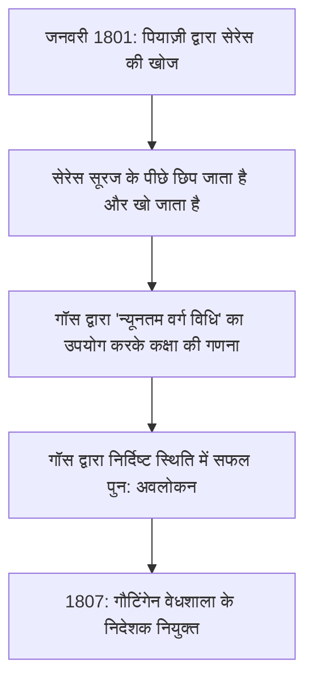

## 1. परिचय: "गणितज्ञों के राजकुमार" के रूप में जाने जाने वाले व्यक्ति

जोहान [कार्ल फ्रेडरिक गॉस](https://kenji.blog/hi/p/gauss/) (30 अप्रैल 1777 - 23 फरवरी 1855) एक महान जर्मन गणितज्ञ, खगोलशास्त्री और भौतिक विज्ञानी थे। उनकी अत्यधिक बुद्धि और विभिन्न क्षेत्रों में निर्णायक योगदान के कारण, उन्हें **"गणितज्ञों के राजकुमार"** (Princeps mathematicorum) के रूप में सराहा जाता है। गॉस की उपलब्धियां अत्यंत व्यापक स्पेक्ट्रम को कवर करती हैं, शुद्ध गणित में गहन सिद्धांतों से लेकर अनुप्रयुक्त गणित तक जो वास्तविक दुनिया में भौतिक घटनाओं का वर्णन करता है।

उनके द्वारा छोड़े गए कई प्रमेय और अवधारणाएँ आधुनिक गणित और विज्ञान की नींव बनाते हैं। गॉस द्वारा खोजे गए नियम उन तकनीकों में जान फूंकते हैं जिनका हम प्रतिदिन लाभ उठाते हैं। इस लेख में, हम कालानुक्रमिक रूप से इस अभूतपूर्व प्रतिभा के जीवन का अनुसरण करेंगे, उनके विस्तृत प्रसंगों और गणितीय उपलब्धियों में गहराई से उतरते हुए देखेंगे कि उन्होंने इतने महान कार्य कैसे किए।

## 2. एक कौतुक का जन्म: बचपन के आश्चर्यजनक प्रसंग

गॉस का जन्म पवित्र रोमन साम्राज्य के डची ऑफ ब्रंसविक-वोल्फेनबुट्टेल में ब्रंसविक शहर में एक गरीब राजमिस्त्री परिवार में हुआ था। उनके माता-पिता को पर्याप्त शिक्षा नहीं मिली थी, और कहा जाता है कि उनकी माँ लगभग पूरी तरह से अनपढ़ थीं। हालाँकि, गॉस की प्राकृतिक प्रतिभा बहुत कम उम्र से ही चमकने लगी थी।

### 1 से 100 तक के योग की तुरंत गणना करना

सबसे प्रसिद्ध प्रसंगों में से एक तब हुआ जब वह प्राथमिक विद्यालय में 7 वर्षीय (या 10 वर्षीय) लड़के थे। एक दिन, उनके अंकगणित शिक्षक, जे.जी. बट्टनर ने छात्रों को शांत रखने के लिए एक कार्य दिया: **"1 से 100 तक के सभी पूर्णांकों को जोड़ें।"** जबकि सामान्य बच्चे क्रमिक रूप से संख्याओं को जोड़ रहे थे, गॉस ने कुछ ही सेकंड में अपनी स्लेट पर "5050" लिखा और उसे शिक्षक के डेस्क पर सौंप दिया।

जब शिक्षक ने पूछा कि उन्होंने इसकी गणना कैसे की, तो गॉस ने निम्नलिखित तरकीब बताई।

$$
1 + 2 + 3 + \dots + 98 + 99 + 100
$$

उन्होंने इसे उल्टे क्रम में उसी अनुक्रम में जोड़ा:

$$
\begin{align*}
S &= 1 + 2 + \dots + 99 + 100 \\
S &= 100 + 99 + \dots + 2 + 1
\end{align*}
$$

ऊपर और नीचे के पदों को क्रमशः जोड़ने पर, प्रत्येक जोड़ी "101" के बराबर होती है।

$$
2S = 101 + 101 + \dots + 101 + 101
$$

चूँकि एक सौ "101" हैं, कुल $101 \times 100 = 10100$ है, और इसे 2 से विभाजित करने पर $5050$ उत्तर प्राप्त होता है। यह किस्सा दर्शाता है कि उन्होंने सहज रूप से एक अंकगणितीय प्रगति के योग के सूत्र की खोज की थी।

आमतौर पर, 1 से $n$ तक के पूर्णांकों का योग $S_n$ निम्नलिखित सूत्र द्वारा व्यक्त किया जाता है:

$$
S_n = \sum_{i=1}^{n} i = \frac{n(n+1)}{2}
$$

इस घटना से प्रेरित होकर, उनके शिक्षक बट्टनर और उनके सहायक मार्टिन बार्टेल्स (एक गणितज्ञ जो बाद में लोबाचेवस्की को पढ़ाएंगे) गॉस की असाधारण प्रतिभा के प्रति आश्वस्त हो गए और उन्हें अधिक उन्नत गणित की पाठ्यपुस्तकें दीं। इसके अलावा, उनकी सिफारिश पर, ब्रंसविक के ड्यूक कार्ल विल्हेम फर्डिनेंड गॉस के संरक्षक बन गए, उन्हें उच्च शिक्षा प्राप्त करने के लिए एक उदार छात्रवृत्ति प्रदान की। इसके लिए धन्यवाद, गॉस कॉलेजियम कैरोलिनम (अब ब्रंसविक के तकनीकी विश्वविद्यालय) और फिर गौटिंगेन विश्वविद्यालय में आगे बढ़े, जहां उनकी प्रतिभा विकसित हुई।

## 3. युवा सफलताएं: हेप्टाडेकागन का निर्माण और 'डिस्क्विजिशन अरिथमेटिका'

गॉस, जिन्होंने गौटिंगेन विश्वविद्यालय में प्रवेश लिया था, भाषा विज्ञान या गणित में पढ़ाई करने के बीच असमंजस में थे। हालाँकि, 19 वर्ष की आयु में की गई एक ऐतिहासिक खोज ने उन्हें गणित को अपना आजीवन पेशा बनाने का संकल्प लेने के लिए प्रेरित किया।

### परकार और सीधे किनारे (रूलर) के साथ नियमित हेप्टाडेकागन का निर्माण

प्राचीन यूनानी गणितज्ञों ने केवल सीधे किनारे (अचिह्नित रेखाएँ खींचने का उपकरण) और परकार (वृत्त खींचने का उपकरण) का उपयोग करके नियमित बहुभुज बनाने की समस्या का समाधान किया था। हालांकि समबाहु त्रिभुज, वर्ग, नियमित पंचभुज, नियमित पेंटाडेकागन और 2 की शक्तियों से गुणा किए गए भुजाओं वाले बहुभुजों के निर्माण के तरीके ज्ञात थे, लेकिन अन्य अभाज्य-पक्षीय बहुभुजों (जैसे नियमित हेप्टागन या नियमित हेंडेकागन) का निर्माण असंभव माना जाता था।

हालाँकि, 30 मार्च 1796 को, गॉस ने गणितीय रूप से साबित किया कि **"नियमित हेप्टाडेकागन (17-पक्षीय बहुभुज) का निर्माण केवल एक परकार और अचिह्नित सीधे किनारे का उपयोग करके किया जा सकता है।"** उन्होंने बीजगणितीय रूप से उन स्थितियों को स्पष्ट किया जिनके तहत साइक्लोटोमिक समीकरण की जड़ों को तर्कसंगत संख्याओं के क्षेत्र से शुरू करके और क्रमिक रूप से वर्गमूल जोड़कर व्यक्त किया जा सकता है।

विशेष रूप से, उन्होंने यह प्रमेय निकाला कि यदि $p$ एक फ़र्मेट अभाज्य (प्रपत्र $p = 2^{2^n} + 1$ का एक अभाज्य) है, तो नियमित $p$-गॉन निर्माणीय है। जब $n=2$, $p = 2^4 + 1 = 17$, जिसमें नियमित हेप्टाडेकागन शामिल है। गॉस को इस खोज पर अत्यंत गर्व था और कथित तौर पर उन्होंने अनुरोध किया था कि उनके मकबरे पर एक नियमित हेप्टाडेकागन उकेरा जाए (वास्तव में, एक 17-नुकीला तारा उकेरा गया था क्योंकि यह एक वृत्त से अप्रभेद्य होगा)।

### डिस्क्विजिशन अरिथमेटिका (Disquisitiones Arithmeticae)

1801 में प्रकाशित, जब गॉस 24 वर्ष के थे, पुस्तक *डिस्क्विजिशन अरिथमेटिका* एक ऐतिहासिक उत्कृष्ट कृति है जिसने संख्या सिद्धांत को एक व्यवस्थित अनुशासन के रूप में स्थापित किया। इस काम में, उन्होंने **"सर्वांगसमता (मॉड्यूलर अंकगणित)"** के लिए संकेतन पेश किया जिसका हम आज दैनिक उपयोग करते हैं।

$$
a \equiv b \pmod{n}
$$

इसका अर्थ है कि "जब $a$ और $b$ को $n$ से विभाजित किया जाता है तो शेषफल बराबर होते हैं"। इस अंकन की शुरूआत ने संख्याओं के जटिल गुणों के बारे में तर्कों को अत्यंत संक्षिप्त और स्पष्ट बना दिया।

उसी पुस्तक में, गॉस ने **"द्विघात पारस्परिकता के नियम"** का पहला कठोर प्रमाण भी प्रदान किया, जिसे संख्या सिद्धांत में सबसे सुंदर प्रमेयों में से एक माना जाता है। यह नियम दर्शाता है कि दो भिन्न विषम अभाज्यों $p, q$ के लिए, सर्वांगसमता $x^2 \equiv p \pmod{q}$ का हल है या नहीं और क्या $x^2 \equiv q \pmod{p}$ का हल है, के बीच अत्यधिक सममित संबंध है।

लीजेंड्रे प्रतीक का उपयोग करके गणितीय सूत्र में व्यक्त, इसे इस प्रकार दर्शाया गया है:

$$
\left( \frac{p}{q} \right) \left( \frac{q}{p} \right) = (-1)^{\frac{p-1}{2} \frac{q-1}{2}}
$$

गॉस ने इस नियम को "स्वर्ण प्रमेय" कहा और जीवन भर इसके आठ अलग-अलग प्रमाण प्रकाशित किए।

## 4. खगोल विज्ञान में योगदान: सेरेस की कक्षा की गणना और [न्यूनतम वर्ग विधि](https://kenji.blog/hi/p/method-of-least-squares/)

गॉस की प्रतिभा केवल शुद्ध गणित तक सीमित नहीं थी; उन्होंने खगोल विज्ञान में भी अभूतपूर्व परिणाम हासिल किए।

1 जनवरी 1801 को इतालवी खगोलशास्त्री ग्यूसेप पियाजी ने एक नए आकाशीय पिंड (बाद में बौना ग्रह सेरेस कहा गया) की खोज की। हालांकि, कुछ दिनों के अवलोकन के बाद, आकाशीय पिंड सूर्य के पीछे छिप गया और ओझल हो गया। उस समय के खगोलविदों ने केवल कुछ दिनों के अवलोकन डेटा से इसकी बाद की कक्षा की भविष्यवाणी करने का प्रयास किया, लेकिन सभी विफल रहे।

यहीं गॉस ने प्रवेश किया। उन्होंने एक नई गणितीय तकनीक का उपयोग करके सेरेस की कक्षा की गणना की, जिसे वे कुछ समय से गुप्त रूप से बना रहे थे, **"[न्यूनतम वर्ग विधि](https://kenji.blog/hi/p/method-of-least-squares/)"** (Method of Least Squares)। [न्यूनतम वर्ग विधि](https://kenji.blog/hi/p/method-of-least-squares/) अवलोकन डेटा में निहित त्रुटियों को कम करने के लिए सबसे संभावित मापदंडों का अनुमान लगाने की एक तकनीक है।

यह मानते हुए कि देखा गया मान $y_i$ है और सैद्धांतिक मान $f(x_i, \boldsymbol{\theta})$ है, हम वह पैरामीटर $\boldsymbol{\theta}$ पाते हैं जो चुकता त्रुटियों के योग $S$ को कम करता है।

$$
S(\boldsymbol{\theta}) = \sum_{i=1}^{n} \left( y_i - f(x_i, \boldsymbol{\theta}) \right)^2
$$

गॉस द्वारा गणना की गई अनुमानित स्थिति अन्य खगोलविदों की भविष्यवाणियों से बहुत भिन्न थी, लेकिन जब उन्होंने कुछ महीनों बाद अपनी दूरबीनों को उनके द्वारा निर्दिष्ट निर्देशांक की ओर इशारा किया, तो सेरेस को वहीं फिर से खोजा गया। इस नाटकीय सफलता के कारण, गॉस का नाम पूरे यूरोपीय वैज्ञानिक समुदाय में गूंज उठा। 1807 में, उन्हें गौटिंगेन विश्वविद्यालय में खगोल विज्ञान का प्रोफेसर और वेधशाला का निदेशक नियुक्त किया गया, ऐसे पद जो उन्होंने जीवन भर संभाले।

## 5. भूगणित और विभेदक ज्यामिति: थियोरेमा एग्रेजियम

1810 के दशक के उत्तरार्ध से लेकर 1820 के दशक तक, गॉस को हनोवर साम्राज्य के लिए भूगणितीय सर्वेक्षण करने के लिए नियुक्त किया गया था। इस भीषण क्षेत्र कार्य के माध्यम से, उन्होंने पृथ्वी के आकार और घुमावदार सतहों के बारे में गहराई से सोचना शुरू किया। सर्वेक्षण की सटीकता में सुधार करने के लिए, उन्होंने "हेलियोट्रोप" नामक एक उपकरण का आविष्कार किया, जो दूर के अवलोकन बिंदुओं पर प्रकाश संकेत भेजने के लिए सूर्य के प्रकाश को प्रतिबिंबित करता था।

साथ ही, इस सर्वेक्षण कार्य ने गणित के एक नए क्षेत्र, **"विभेदक ज्यामिति"** के निर्माण को जन्म दिया। गॉस ने 1827 में *कर्व्ड सर्फेस की सामान्य जांच* (General Investigations of Curved Surfaces) पेपर प्रकाशित किया, जिसमें त्रि-आयामी स्थान पर निर्भर किए बिना, घुमावदार सतहों पर ज्यामिति के आंतरिक रूप से व्यवहार करने की एक विधि स्थापित की गई।

इनमें सबसे प्रसिद्ध **"थियोरेमा एग्रेजियम"** (उल्लेखनीय प्रमेय) है। यह प्रमेय दर्शाता है कि सतह की **गाऊसी वक्रता** $K$ (दो प्रमुख वक्रता $k_1$ और $k_2$ का उत्पाद, $K = k_1 k_2$) एक आंतरिक मात्रा है जो सतह के मुड़े होने पर भी अपरिवर्तित रहती है (जब तक कि इसे फैलाया या सिकोड़ा न जाए)।

$$
K = \frac{L N - M^2}{E G - F^2}
$$

(जहां $E, F, G$ पहले मौलिक रूप के गुणांक हैं, और $L, M, N$ दूसरे मौलिक रूप के गुणांक हैं)

इस प्रमेय के अनुसार, यह गणितीय रूप से सिद्ध हो चुका है कि, उदाहरण के लिए, एक कागज का सपाट टुकड़ा (वक्रता 0) चाहे कैसे भी लपेटा जाए, विरूपण के बिना एक क्षेत्र (सकारात्मक वक्रता) बनाना असंभव है। गॉस की विभेदक ज्यामिति के इस विचार को बाद में [बर्नहार्ड रीमैन](https://kenji.blog/hi/p/riemann/) (रीमन्नियन ज्यामिति) द्वारा उच्च आयामों के लिए सामान्यीकृत किया गया और बाद के वर्षों में अल्बर्ट आइंस्टीन के सामान्य सापेक्षता के सिद्धांत के लिए गणितीय आधार के रूप में अपरिहार्य हो गया।

## 6. गाऊसी वितरण और विद्युत चुंबकत्व

**"सामान्य वितरण"**, सांख्यिकी में सबसे महत्वपूर्ण वितरण, अक्सर **"गाऊसी वितरण"** कहा जाता है। उपर्युक्त [न्यूनतम वर्ग विधि](https://kenji.blog/hi/p/method-of-least-squares/) को सही ठहराते हुए, गॉस ने माना कि अवलोकन त्रुटियां एक सामान्य वितरण का पालन करती हैं। प्रायिकता घनत्व फलन $f(x)$ को निम्नलिखित सूत्र द्वारा व्यक्त किया गया है:

$$
f(x) = \frac{1}{\sigma \sqrt{2\pi}} \exp\left( -\frac{1}{2} \left( \frac{x-\mu}{\sigma} \right)^2 \right)
$$

घंटी के आकार के इस वक्र का उपयोग अब भौतिकी, जीव विज्ञान, अर्थशास्त्र और समाजशास्त्र सहित सभी वैज्ञानिक क्षेत्रों में डेटा विश्लेषण के आधार के रूप में किया जाता है। पूर्व जर्मन 10 डॉयचे मार्क बैंकनोट में गॉस का चित्र इस गाऊसी वितरण वक्र और सूत्र के साथ था।

इसके अलावा, अपने बाद के वर्षों में, गॉस ने भौतिक विज्ञानी विल्हेम वेबर के सहयोग से चुंबकत्व और बिजली के अध्ययन के लिए खुद को समर्पित कर दिया। उन्होंने पृथ्वी के चुंबकीय क्षेत्र को मापने के लिए एक नए मैग्नेटोमीटर का आविष्कार किया, और 1833 में दुनिया के पहले व्यावहारिक विद्युत चुम्बकीय टेलीग्राफ का निर्माण किया, जिसने संस्थान और वेधशाला के बीच सफलतापूर्वक संचार किया।

विद्युत चुंबकत्व में मौलिक नियमों में से एक, **"गॉस का नियम"**, मैक्सवेल के समीकरणों में से एक के रूप में शामिल है। विद्युत क्षेत्रों के लिए गॉस के नियम का अवकल रूप इस प्रकार वर्णित है:

$$
\nabla \cdot \mathbf{E} = \frac{\rho}{\varepsilon_0}
$$

साथ ही, चुंबकीय क्षेत्रों के लिए गॉस का नियम इंगित करता है कि "चुंबकीय मोनोपोल मौजूद नहीं हैं।"

$$
\nabla \cdot \mathbf{B} = 0
$$

चुंबकीय प्रवाह घनत्व की इकाई, "गॉस (G)", का नाम भी उनके नाम पर रखा गया है।

## 7. गैर-[यूक्लिड](https://kenji.blog/hi/p/euclid/)ियन ज्यामिति में छिपी हुई अंतर्दृष्टि

गॉस की अद्भुत दूरदर्शिता को दर्शाने वाला एक प्रसंग **"गैर-[यूक्लिड](https://kenji.blog/hi/p/euclid/)ियन ज्यामिति"** के बारे में किस्सा है। [यूक्लिड](https://kenji.blog/hi/p/euclid/) के समानांतर अभिगृहीत (एक रेखा के बाहर एक बिंदु के माध्यम से, ठीक एक समानांतर रेखा है) को साबित किया जा सकता है या नहीं, यह 2,000 से अधिक वर्षों से एक महान गणितीय रहस्य रहा था।

अपने अप्रकाशित नोटों में, गॉस एक नई ज्यामिति (अतिशयोक्तिपूर्ण ज्यामिति) के अस्तित्व के बारे में पूरी तरह से जानते थे जिसमें समानांतर अभिगृहीत लागू नहीं होता है, और उन्होंने इसकी प्रणाली का निर्माण किया था। हालांकि, उस समय के रूढ़िवादी दार्शनिक हलकों (एक ऐसा युग जब कांतियन दर्शन मुख्यधारा था) में, उन्हें अंतरिक्ष की पूर्णता को नकारने वाले सिद्धांत को प्रकाशित करने पर समझ से बाहर की आलोचना और विवाद (गॉस के शब्दों में, "बोओटियंस का कोलाहल") में शामिल होने का डर था, इसलिए उन्होंने इसे अपने जीवनकाल में कभी प्रकाशित नहीं किया।

बाद में, जब निकोलाई लोबाचेवस्की और जेनोस बोल्याई ने स्वतंत्र रूप से गैर-[यूक्लिड](https://kenji.blog/hi/p/euclid/)ियन ज्यामिति प्रकाशित की, गॉस ने बोल्याई के पिता (गॉस के एक पुराने दोस्त) से एक पेपर प्राप्त करने पर उत्तर दिया: "इसकी प्रशंसा करना मेरी खुद की प्रशंसा करने के बराबर होगा। क्योंकि काम की पूरी सामग्री लगभग पूरी तरह से मेरे स्वयं के ध्यानों से मेल खाती है जिसने मेरे दिमाग पर तीस से पैंतीस वर्षों तक कब्जा किया है।" कहा जाता है कि युवा बोल्याई इससे बहुत निराश हुए थे, लेकिन साथ ही, यह इस बात का प्रमाण है कि गॉस अपने समय से कितना आगे थे।

## 8. बाद के वर्ष और विरासत

गॉस एक पूर्णतावादी थे, जिनका आदर्श वाक्य **"कुछ, लेकिन पके हुए"** (Pauca sed matura) था। क्योंकि उन्होंने अपने पत्रों को तब तक प्रकाशित नहीं किया जब तक कि वे पूरी तरह से संतुष्ट नहीं हो गए और वे एक सुंदर परिष्कृत रूप में नहीं थे, उनकी मृत्यु के बाद भारी मात्रा में अप्रकाशित नोट खोजे गए, जिसने बाद के गणितज्ञों को चकित कर दिया। बाद में अन्य गणितज्ञों द्वारा खोजे गए और प्रसिद्ध किए गए कई सिद्धांत, जैसे जटिल एकीकरण (कॉची की अभिन्न प्रमेय), चतुर्भुज और अण्डाकार कार्य सिद्धांत की नींव, पहले से ही गॉस के नोट्स में लिखे गए थे।

उन्होंने अगली पीढ़ी का मार्गदर्शन भी किया। उपर्युक्त रीमैन के अलावा, अगली पीढ़ी के महान गणितज्ञों जैसे रिचर्ड डेडेकाइंड और फर्डिनेंड गोथोल्ड मैक्स ईसेनस्टीन को गॉस का मार्गदर्शन प्राप्त हुआ।

23 फरवरी 1855 को, गौटिंगेन में 77 वर्ष की आयु में [कार्ल फ्रेडरिक गॉस](https://kenji.blog/hi/p/gauss/) का निधन हो गया। उनकी विरासत गणित की सीमाओं को पार करती है और सभी आधुनिक विज्ञान और प्रौद्योगिकी की जड़ों में बहती है। शुद्ध अमूर्त विचार से लेकर ग्रहों की कक्षाओं की गणना और विद्युत चुंबकत्व की भौतिक घटना तक, उनकी बुद्धि का प्रकाश आज भी चमकता है।

जब हम रात के आकाश को देखते हैं या अपने स्मार्टफोन पर संचार का उपयोग करते हैं, तो "गणितज्ञों के राजकुमार" गॉस के महान पदचिह्न निश्चित रूप से वहां मौजूद हैं।
