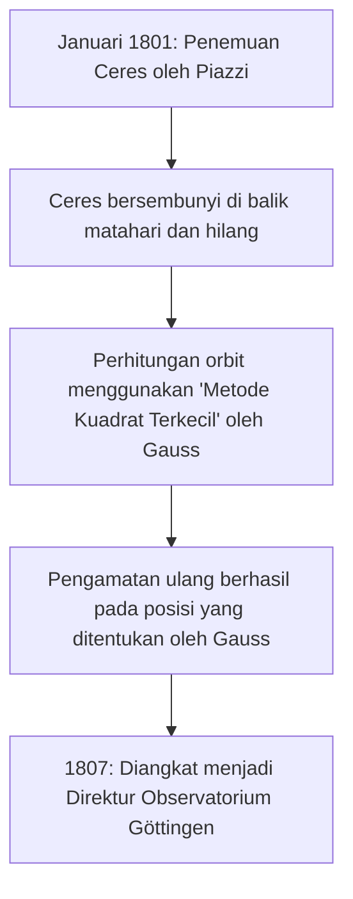

## 1. Pendahuluan: Pria yang Dikenal sebagai "Pangeran Matematika"

Johann [Carl Friedrich Gauss](https://kenji.blog/id/p/gauss/) (30 April 1777 - 23 Februari 1855) adalah seorang matematikawan, astronom, dan fisikawan besar Jerman. Karena kecerdasannya yang luar biasa dan kontribusi yang menentukan dalam berbagai bidang, ia dipuji sebagai **"Pangeran Matematika"** (Princeps mathematicorum). Pencapaian Gauss mencakup spektrum yang sangat luas, dari teori mendalam dalam matematika murni hingga matematika terapan yang menggambarkan fenomena fisik di dunia nyata.

Berbagai teorema dan konsep yang ia tinggalkan membentuk fondasi matematika dan sains modern. Hukum-hukum yang ditemukan oleh Gauss memberikan kehidupan pada teknologi yang kita manfaatkan setiap hari. Dalam artikel ini, kita akan mengikuti kehidupan jenius yang belum pernah ada sebelumnya ini secara kronologis, menggali lebih dalam episode detail dan pencapaian matematikanya untuk melihat bagaimana ia mencapai begitu banyak prestasi besar.

## 2. Lahirnya Seorang Anak Ajaib: Episode Masa Kecil yang Menakjubkan

Gauss lahir di keluarga tukang batu miskin di kota Braunschweig di Kadipaten Brunswick-Wolfenbüttel, Kekaisaran Romawi Suci. Orang tuanya tidak menerima pendidikan yang cukup, dan ibunya dikatakan hampir sepenuhnya buta huruf. Namun, bakat alami Gauss bersinar terang sejak usia sangat muda.

### Menghitung Penjumlahan dari 1 hingga 100 dalam Sekejap

Salah satu episode paling terkenal terjadi ketika ia adalah seorang anak laki-laki berusia 7 tahun (atau 10 tahun) di sekolah dasar. Suatu hari, guru aritmetikanya, J.G. Büttner, memberikan tugas kepada siswa agar mereka diam: **"Jumlahkan semua bilangan bulat dari 1 hingga 100."** Sementara anak-anak normal menjumlahkan angka secara berurutan, Gauss menulis "5050" di batu tulisnya hanya dalam beberapa detik dan menyerahkannya ke meja guru.

Ketika guru bertanya bagaimana ia menghitungnya, Gauss menjelaskan trik berikut.

$$
1 + 2 + 3 + \dots + 98 + 99 + 100
$$

Ia menambahkan ini ke urutan yang sama dalam urutan terbalik:

$$
\begin{align*}
S &= 1 + 2 + \dots + 99 + 100 \\
S &= 100 + 99 + \dots + 2 + 1
\end{align*}
$$

Menambahkan suku atas dan bawah masing-masing, setiap pasangan sama dengan "101".

$$
2S = 101 + 101 + \dots + 101 + 101
$$

Karena ada seratus "101", totalnya adalah $101 \times 100 = 10100$, dan membagi ini dengan 2 menghasilkan jawaban $5050$. Anekdot ini menunjukkan bahwa ia secara intuitif menemukan rumus jumlah deret aritmatika.

Umumnya, jumlah $S_n$ bilangan bulat dari 1 hingga $n$ dinyatakan dengan rumus berikut:

$$
S_n = \sum_{i=1}^{n} i = \frac{n(n+1)}{2}
$$

Terdorong oleh peristiwa ini, gurunya Büttner dan asistennya Martin Bartels (seorang matematikawan yang kemudian akan mengajar Lobachevsky) menjadi yakin akan bakat luar biasa Gauss dan memberinya buku teks matematika yang lebih maju. Selanjutnya, atas rekomendasi mereka, Adipati Karl Wilhelm Ferdinand dari Brunswick menjadi pelindung Gauss, memberinya beasiswa yang murah hati untuk menerima pendidikan tinggi. Berkat ini, Gauss maju ke Collegium Carolinum (sekarang Universitas Teknik Brunswick) dan kemudian ke Universitas Göttingen, tempat bakatnya berkembang.

## 3. Terobosan Masa Muda: Konstruksi Heptadekagon dan 'Disquisitiones Arithmeticae'

Gauss, yang telah masuk Universitas Göttingen, bimbang antara mengambil jurusan linguistik atau matematika. Namun, penemuan bersejarah yang dibuatnya pada usia 19 tahun membuatnya memutuskan untuk menjadikan matematika sebagai profesi seumur hidupnya.

### Konstruksi Heptadekagon Beraturan dengan Jangka dan Penggaris

Matematikawan Yunani kuno memecahkan masalah mengonstruksi poligon beraturan menggunakan hanya penggaris (alat untuk menggambar garis tanpa ukuran) dan jangka (alat untuk menggambar lingkaran). Sementara metode untuk membangun segitiga sama sisi, bujur sangkar, segilima beraturan, pentadekagon beraturan, dan poligon dengan jumlah sisi yang dikalikan dengan pangkat 2 telah diketahui, membangun poligon bersisi bilangan prima lainnya (seperti heptagon beraturan atau hendekagon beraturan) dianggap mustahil.

Namun, pada 30 Maret 1796, Gauss membuktikan secara matematis bahwa **"heptadekagon beraturan (poligon bersisi 17) dapat dibangun dengan menggunakan hanya jangka dan penggaris tanpa ukuran."** Ia secara aljabar menjelaskan kondisi di mana akar persamaan siklotomik dapat dinyatakan dengan memulai dari medan bilangan rasional dan berturut-turut menambahkan akar kuadrat.

Secara khusus, ia menurunkan teorema bahwa jika $p$ adalah bilangan prima Fermat (bilangan prima dengan bentuk $p = 2^{2^n} + 1$), $p$-gon beraturan dapat dikonstruksi. Ketika $n=2$, $p = 2^4 + 1 = 17$, yang mencakup heptadekagon beraturan. Gauss sangat bangga dengan penemuan ini dan dilaporkan meminta agar heptadekagon beraturan diukir di batu nisannya (pada kenyataannya, bintang berujung 17 diukir karena tidak akan dapat dibedakan dari lingkaran).

### Disquisitiones Arithmeticae

Diterbitkan pada tahun 1801 ketika Gauss berusia 24 tahun, buku *Disquisitiones Arithmeticae* adalah mahakarya bersejarah yang menetapkan teori bilangan sebagai disiplin ilmu yang sistematis. Dalam karya ini, ia memperkenalkan notasi untuk **"kekongruenan (aritmatika modular)"** yang kita gunakan sehari-hari saat ini.

$$
a \equiv b \pmod{n}
$$

Ini berarti bahwa "sisa hasil bagi ketika $a$ dan $b$ dibagi dengan $n$ adalah sama". Pengenalan notasi ini membuat argumen tentang sifat-sifat angka yang kompleks menjadi sangat ringkas dan jelas.

Juga di buku yang sama, Gauss memberikan bukti ketat pertama tentang **"Hukum Timbal Balik Kuadrat"**, yang dianggap sebagai salah satu teorema terindah dalam teori bilangan. Hukum ini menunjukkan bahwa untuk dua bilangan prima ganjil $p, q$ yang berbeda, ada hubungan yang sangat simetris antara apakah kekongruenan $x^2 \equiv p \pmod{q}$ memiliki solusi dan apakah $x^2 \equiv q \pmod{p}$ memiliki solusi.

Dinyatakan dalam rumus matematika menggunakan simbol Legendre, itu direpresentasikan sebagai berikut:

$$
\left( \frac{p}{q} \right) \left( \frac{q}{p} \right) = (-1)^{\frac{p-1}{2} \frac{q-1}{2}}
$$

Gauss menyebut hukum ini "Teorema Emas" dan menerbitkan delapan bukti berbeda tentang hal itu sepanjang hidupnya.

## 4. Kontribusi dalam Astronomi: Perhitungan Orbit Ceres dan [Metode Kuadrat Terkecil](https://kenji.blog/id/p/method-of-least-squares/)

Bakat Gauss tidak terbatas pada matematika murni; ia juga mencapai hasil yang fenomenal dalam astronomi.

Pada tanggal 1 Januari 1801, astronom Italia Giuseppe Piazzi menemukan benda langit baru (kemudian disebut planet katai Ceres). Namun, setelah beberapa hari observasi, benda langit itu bersembunyi di balik matahari dan hilang dari pandangan. Para astronom pada waktu itu berusaha memprediksi orbitnya selanjutnya hanya dari beberapa hari data observasi, namun semuanya gagal.

Di sinilah Gauss masuk. Ia menghitung orbit Ceres menggunakan teknik matematika baru yang secara rahasia telah ia bangun selama beberapa waktu, **"[Metode Kuadrat Terkecil](https://kenji.blog/id/p/method-of-least-squares/)"**. Metode kuadrat terkecil adalah teknik untuk memperkirakan parameter yang paling mungkin untuk meminimalkan kesalahan yang terkandung dalam data pengamatan.

Dengan asumsi nilai yang diamati adalah $y_i$ dan nilai teoritisnya adalah $f(x_i, \boldsymbol{\theta})$, kita menemukan parameter $\boldsymbol{\theta}$ yang meminimalkan jumlah kesalahan kuadrat $S$.

$$
S(\boldsymbol{\theta}) = \sum_{i=1}^{n} \left( y_i - f(x_i, \boldsymbol{\theta}) \right)^2
$$

Prediksi posisi yang dihitung oleh Gauss jauh berbeda dari prediksi astronom lain, namun ketika mereka mengarahkan teleskop ke koordinat yang ditentukannya beberapa bulan kemudian, Ceres ditemukan kembali tepat di sana. Karena kesuksesan yang dramatis ini, nama Gauss bergema ke seluruh komunitas ilmiah Eropa. Pada tahun 1807, ia diangkat sebagai Profesor Astronomi dan Direktur Observatorium di Universitas Göttingen, posisi yang dipegangnya selama sisa hidupnya.

## 5. Geodesi dan Geometri Diferensial: Theorema Egregium

Dari akhir 1810-an hingga 1820-an, Gauss ditugaskan untuk melakukan survei geodesi untuk Kerajaan Hanover. Melalui kerja lapangan yang melelahkan ini, ia mulai berpikir dalam-dalam tentang bentuk bumi dan permukaan melengkung. Untuk meningkatkan akurasi survei, ia menemukan alat yang disebut "heliotrop," yang memantulkan sinar matahari untuk mengirimkan sinyal cahaya ke titik pengamatan yang jauh.

Pada saat yang sama, pekerjaan survei ini mengarah pada penciptaan bidang matematika baru, **"Geometri Diferensial"**. Gauss menerbitkan makalah *Penyelidikan Umum Permukaan Lengkung* pada tahun 1827, membangun metode untuk memperlakukan geometri pada permukaan melengkung secara intrinsik, tanpa bergantung pada ruang tiga dimensi.

Yang paling terkenal di antaranya adalah **"Theorema Egregium"** (Teorema Luar Biasa). Teorema ini menunjukkan bahwa **kelengkungan Gaussian** $K$ suatu permukaan (produk dari dua kelengkungan utama $k_1$ dan $k_2$, $K = k_1 k_2$) adalah kuantitas intrinsik yang tetap tidak berubah meskipun permukaan ditekuk (selama tidak diregangkan atau disusutkan).

$$
K = \frac{L N - M^2}{E G - F^2}
$$

(Di mana $E, F, G$ adalah koefisien bentuk fundamental pertama, dan $L, M, N$ adalah koefisien bentuk fundamental kedua)

Menurut teorema ini, terbukti secara matematis bahwa, misalnya, tidak peduli bagaimana selembar kertas datar (kelengkungan 0) digulung, tidak mungkin membuat bola (kelengkungan positif) tanpa distorsi. Gagasan geometri diferensial Gauss ini kemudian digeneralisasikan ke dimensi yang lebih tinggi oleh [Bernhard Riemann](https://kenji.blog/id/p/riemann/) (geometri Riemannian) dan selanjutnya menjadi sangat diperlukan sebagai dasar matematis untuk teori relativitas umum Albert Einstein di tahun-tahun berikutnya.

## 6. Distribusi Gaussian dan Elektromagnetisme

**"Distribusi Normal"**, distribusi yang paling penting dalam statistik, sering disebut **"Distribusi Gaussian"**. Dalam membenarkan metode kuadrat terkecil yang disebutkan di atas, Gauss mengasumsikan bahwa kesalahan observasi mengikuti distribusi normal. Fungsi kepadatan probabilitas $f(x)$ dinyatakan dengan rumus berikut:

$$
f(x) = \frac{1}{\sigma \sqrt{2\pi}} \exp\left( -\frac{1}{2} \left( \frac{x-\mu}{\sigma} \right)^2 \right)
$$

Kurva berbentuk lonceng ini kini digunakan sebagai dasar untuk analisis data di semua bidang ilmiah, termasuk fisika, biologi, ekonomi, dan sosiologi. Uang kertas 10 Deutsche Mark Jerman yang lama menampilkan potret Gauss di samping kurva dan rumus distribusi Gaussian ini.

Lebih jauh, di tahun-tahun terakhirnya, Gauss mengabdikan dirinya untuk mempelajari magnetisme dan listrik bekerja sama dengan fisikawan Wilhelm Weber. Mereka menemukan magnetometer baru untuk mengukur medan magnet bumi, dan pada tahun 1833 membangun telegraf elektromagnetik praktis pertama di dunia, berhasil berkomunikasi antara institut dan observatorium.

**"Hukum Gauss"**, salah satu hukum dasar dalam elektromagnetisme, dimasukkan sebagai salah satu persamaan Maxwell. Bentuk diferensial hukum Gauss untuk medan listrik dijelaskan sebagai berikut:

$$
\nabla \cdot \mathbf{E} = \frac{\rho}{\varepsilon_0}
$$

Selain itu, hukum Gauss untuk medan magnet menunjukkan bahwa "monopol magnet tidak ada."

$$
\nabla \cdot \mathbf{B} = 0
$$

Satuan rapat fluks magnetik, "Gauss (G)", juga dinamai menurut namanya.

## 7. Wawasan Tersembunyi tentang Geometri Non-[Euclide](https://kenji.blog/id/p/euclid/)an

Episode yang menunjukkan pandangan ke depan Gauss yang menakjubkan adalah anekdot mengenai **"Geometri Non-[Euclide](https://kenji.blog/id/p/euclid/)an"**. Apakah postulat paralel [Euclid](https://kenji.blog/id/p/euclid/) (melalui titik di luar garis, ada tepat satu garis paralel) dapat dibuktikan telah menjadi misteri matematika besar selama lebih dari 2.000 tahun.

Dalam catatan-catatannya yang tidak dipublikasikan, Gauss sepenuhnya sadar akan keberadaan geometri baru (geometri hiperbolik) di mana postulat paralel tidak berlaku, dan telah membangun sistemnya. Namun, dalam lingkaran filosofis konservatif pada saat itu (era di mana filsafat Kantian adalah arus utama), ia khawatir terlibat dalam kritik dan kontroversi yang tidak dipahami (dalam kata-kata Gauss, "teriakan orang-orang Boeotia") jika ia menerbitkan sebuah teori yang menyangkal keabsolutan ruang, sehingga ia tidak pernah mempublikasikannya selama hidupnya.

Kemudian, ketika Nikolai Lobachevsky dan János Bolyai secara independen menerbitkan geometri non-[Euclide](https://kenji.blog/id/p/euclid/)an, Gauss, setelah menerima makalah dari ayah Bolyai (teman lama Gauss), menjawab, "Memujinya sama dengan memuji diri saya sendiri. Karena keseluruhan isi karya tersebut hampir persis sama dengan renungan saya sendiri yang telah memenuhi pikiran saya selama tiga puluh hingga tiga puluh lima tahun." Dikatakan bahwa Bolyai muda sangat kecewa dengan hal ini, tetapi pada saat yang sama, ini berfungsi sebagai bukti betapa jauh di depan zamannya Gauss.

## 8. Tahun-tahun Terakhir dan Warisan

Gauss adalah seorang yang perfeksionis, dengan moto **"Sedikit, namun matang"** (Pauca sed matura). Karena ia tidak mempublikasikan makalahnya sampai ia benar-benar puas dan tersusun dalam bentuk yang sangat halus, sejumlah besar catatan yang tidak dipublikasikan ditemukan setelah kematiannya, yang mengejutkan ahli matematika di kemudian hari. Banyak dari teori yang kemudian ditemukan dan dibuat terkenal oleh ahli matematika lain, seperti integrasi kompleks (teorema integral Cauchy), kuaternion, dan dasar-dasar teori fungsi elips, sudah ditulis dalam catatan Gauss.

Ia juga menjadi mentor bagi generasi berikutnya. Selain Riemann yang disebutkan di atas, ahli matematika hebat dari generasi berikutnya seperti Richard Dedekind dan Ferdinand Gotthold Max Eisenstein menerima bimbingan Gauss.

Pada tanggal 23 Februari 1855, [Carl Friedrich Gauss](https://kenji.blog/id/p/gauss/) meninggal di Göttingen pada usia 77 tahun. Warisannya melampaui batas-batas matematika dan mengalir di akar semua ilmu pengetahuan dan teknologi modern. Dari pemikiran abstrak murni hingga perhitungan orbit planet, dan turun ke fenomena fisik elektromagnetik, cahaya kecerdasannya terus bersinar hingga hari ini.

Ketika kita menatap langit malam atau menggunakan komunikasi di ponsel pintar kita, jejak besar Gauss, "Pangeran Matematika," pastilah ada di sana.
