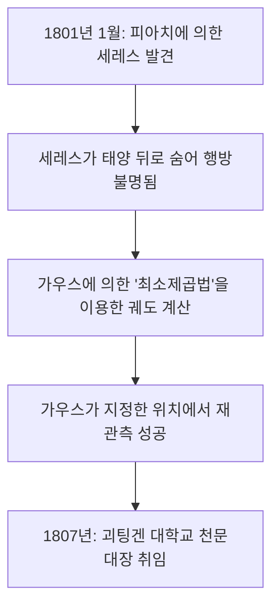

## 1. 머리말: "수학의 왕" 이라 불린 사나이

요한 [카를 프리드리히 가우스](https://kenji.blog/ko/p/gauss/) (Johann [Carl Friedrich Gauß](https://kenji.blog/ko/p/gauss/), 1777년 4월 30일 - 1855년 2월 23일) 는 독일이 낳은 위대한 수학자이자 천문학자, 물리학자입니다. 그는 압도적인 지능과 다방면에 걸친 결정적인 공헌으로 인해 **"수학의 왕"** (Princeps mathematicorum) 으로 칭송받고 있습니다. 가우스의 업적은 순수 수학의 심오한 이론부터 현실 세계의 물리 현상을 기술하는 응용 수학에 이르기까지 극히 광범위합니다.

그가 남긴 수많은 정리와 개념은 현대 수학과 과학 기술의 기초가 되었으며, 우리가 일상적으로 혜택을 받고 있는 기술의 이면에도 가우스가 발견한 법칙이 숨 쉬고 있습니다. 본 기사에서는 이 희대의 천재의 생애를 연대순으로 더듬어가며, 그가 어떻게 수많은 위업을 달성했는지, 그 상세한 일화와 수학적 업적을 깊이 파헤쳐 보겠습니다.

## 2. 신동의 탄생: 경이로운 유년기의 일화

가우스는 신성 로마 제국 브라운슈바이크-볼펜뷜텔 공국의 브라운슈바이크라는 마을에서 가난한 벽돌공의 아들로 태어났습니다. 그의 부모는 충분한 교육을 받지 못했고, 어머니는 글을 거의 읽고 쓰지 못했다고 전해집니다. 하지만 가우스의 천부적인 재능은 어릴 적부터 숨길 수 없는 빛을 발했습니다.

### 1부터 100까지의 합을 순식간에 계산

가장 유명한 일화 중 하나는 그가 초등학교에 다니던 7세 (또는 10세) 무렵의 일입니다. 어느 날, 산수 교사인 뷔트너는 학생들을 조용히 시키기 위해 **"1부터 100까지의 모든 정수를 더하시오"** 라는 과제를 냈습니다. 일반 아이들이 차례대로 덧셈을 하는 동안, 가우스는 단 몇 초 만에 석판에 "5050" 이라는 답을 쓰고 교사의 책상에 제출했습니다.

교사가 어떻게 계산했는지 묻자, 가우스는 다음과 같은 계산의 묘리를 설명했습니다.

$$
1 + 2 + 3 + \dots + 98 + 99 + 100
$$

이것을 역순으로 한 것과 더합니다.

$$
\begin{align*}
S &= 1 + 2 + \dots + 99 + 100 \\
S &= 100 + 99 + \dots + 2 + 1
\end{align*}
$$

위아래의 항을 각각 더하면 모두 "101" 이 됩니다.

$$
2S = 101 + 101 + \dots + 101 + 101
$$

"101" 이 100개 있으므로, 합계는 $101 \times 100 = 10100$ 이 되고, 이것을 2로 나눔으로써 답인 $5050$ 을 도출해낸 것입니다. 이 일화는 등차수열의 합의 공식을 그가 직관적으로 발견했다는 것을 보여줍니다.

일반적으로 1부터 $n$ 까지 정수의 합 $S_n$ 은 다음과 같은 수식으로 표현됩니다.

$$
S_n = \sum_{i=1}^{n} i = \frac{n(n+1)}{2}
$$

이 사건을 계기로 교사 뷔트너와 조수 마르틴 바르텔스 (훗날 로바쳅스키를 가르치게 되는 수학자) 는 가우스의 비범한 재능을 확신하고 그에게 더 수준 높은 수학 교과서를 주었습니다. 나아가 그들의 추천으로 브라운슈바이크 공작 카를 빌헬름 페르디난트가 가우스의 후원자가 되어, 그가 고등 교육을 받을 수 있도록 거액의 장학금을 제공하게 됩니다. 이를 통해 가우스는 카롤리눔 콜레기움 (현 브라운슈바이크 공과대학교) 과 괴팅겐 대학교로 진학하여 재능을 꽃피우게 됩니다.

## 3. 청년기의 약진: 정17각형의 작도와 『정수론』

괴팅겐 대학교에 진학한 가우스는 언어학을 전공할지 수학을 전공할지 고민했지만, 19세 때 역사적인 발견을 하면서 수학을 평생의 업으로 삼기로 결심합니다.

### 정17각형의 자와 컴퍼스에 의한 작도

고대 그리스의 수학자들은 눈금 없는 자 (눈금이 없는 직선을 긋는 도구) 와 컴퍼스 (원을 그리는 도구) 만을 사용하여 정다각형을 작도하는 문제에 도전했습니다. 정삼각형, 정사각형, 정오각형, 정십오각형 및 이들의 변의 수를 2의 거듭제곱 배한 정다각형의 작도 방법은 알려져 있었지만, 그 외의 소수각형 (예를 들어 정7각형이나 정11각형 등) 의 작도는 불가능하다고 여겨졌습니다.

하지만 1796년 3월 30일, 가우스는 **"정17각형이 자와 컴퍼스만으로 작도 가능하다"** 는 것을 수학적으로 증명했습니다. 그는 원분 방정식의 근이 유리수체에서 출발하여 제곱근을 차례로 첨가해 나감으로써 표현될 수 있기 위한 조건을 대수적으로 해명한 것입니다.

구체적으로는, $p$ 를 페르마 소수 ($p = 2^{2^n} + 1$ 형태의 소수) 라고 할 때, 정 $p$ 각형은 작도 가능하다는 정리를 도출했습니다. $n=2$ 일 때 $p = 2^4 + 1 = 17$ 이 되어 정17각형이 포함됩니다. 가우스는 이 발견을 매우 자랑스럽게 여겨 자신의 묘비에 정17각형을 새겨 달라고 요망했다고 합니다 (실제로는 원과 구별하기 어렵기 때문에 17개의 점을 가진 별 모양이 조각되었습니다).

### 『정수론』 (Disquisitiones Arithmeticae)

1801년, 가우스가 24세 때 출판된 저서 『정수론』 (라틴어: *Disquisitiones Arithmeticae*) 은 정수론을 하나의 체계적인 학문으로 확립한 역사적 걸작입니다. 이 저서에서 그는 현재 우리가 일상적으로 사용하고 있는 **"합동식 (모듈러 산술)"** 의 기호를 도입했습니다.

$$
a \equiv b \pmod{n}
$$

이것은 "$a$ 와 $b$ 를 $n$ 으로 나눈 나머지가 같다" 는 것을 의미합니다. 이 기호의 도입으로 복잡한 수의 성질에 관한 논의를 매우 간결하고 명확하게 할 수 있게 되었습니다.

또한 같은 책에서 가우스는 정수론에서 가장 아름다운 정리 중 하나로 꼽히는 **"이차 상호 법칙"** (Law of Quadratic Reciprocity) 의 첫 번째 엄밀한 증명을 제시했습니다. 이 법칙은 서로 다른 두 홀수 소수 $p, q$ 에 대해, 합동식 $x^2 \equiv p \pmod{q}$ 가 해를 가지는지 여부와 $x^2 \equiv q \pmod{p}$ 가 해를 가지는지 여부 사이에 지극히 대칭적인 관계가 존재함을 보여줍니다.

수식으로 표현하면, 르장드르 기호를 사용하여 다음과 같이 표현됩니다.

$$
\left( \frac{p}{q} \right) \left( \frac{q}{p} \right) = (-1)^{\frac{p-1}{2} \frac{q-1}{2}}
$$

가우스는 이 법칙을 "황금 정리" 라고 불렀으며, 평생에 걸쳐 8가지나 되는 다른 증명을 발표했습니다.

## 4. 천문학에 대한 공헌: 세레스의 궤도 계산과 [최소제곱법](https://kenji.blog/ko/p/method-of-least-squares/)

가우스의 재능은 순수 수학에 그치지 않고 천문학 분야에서도 경이로운 성과를 올렸습니다.

1801년 1월 1일, 이탈리아의 천문학자 주세페 피아치가 새로운 천체 (훗날 왜행성 세레스로 불림) 를 발견했습니다. 그러나 며칠간의 관측 후, 그 천체는 태양 뒤로 숨어버려 시야에서 사라졌습니다. 당시 천문학자들은 불과 며칠 치의 관측 데이터로부터 그 후의 궤도를 예측하려 시도했지만 모두 실패로 끝났습니다.

여기서 등장한 사람이 가우스입니다. 그는 자신이 이전부터 은밀히 구축해 온 새로운 수학적 기법, 즉 **"[최소제곱법](https://kenji.blog/ko/p/method-of-least-squares/)"** (Method of Least Squares) 을 사용하여 세레스의 궤도를 계산했습니다. [최소제곱법](https://kenji.blog/ko/p/method-of-least-squares/)이란 관측 데이터에 포함된 오차를 최소화하도록 가장 확실한 매개변수를 추정하는 기법입니다.

관측값을 $y_i$, 이론값을 $f(x_i, \boldsymbol{\theta})$ 라고 할 때, 오차의 제곱합 $S$ 를 최소로 하는 매개변수 $\boldsymbol{\theta}$ 를 구합니다.

$$
S(\boldsymbol{\theta}) = \sum_{i=1}^{n} \left( y_i - f(x_i, \boldsymbol{\theta}) \right)^2
$$

가우스의 계산에 의한 예측 위치는 다른 천문학자들의 예측과는 크게 달랐지만, 몇 달 후 망원경을 그가 지정한 좌표로 향하자 바로 그곳에서 세레스가 재발견되었습니다. 이 극적인 성공으로 가우스의 이름은 유럽 전역의 과학계에 널리 퍼졌습니다. 1807년, 그는 괴팅겐 대학교의 천문학 교수 및 천문대장으로 임명되었고, 평생 그 지위에 머물게 됩니다.

## 5. 측지학과 미분기하학: 놀라운 정리

1810년대 후반부터 1820년대에 걸쳐, 가우스는 하노버 왕국의 측지 측량을 의뢰받았습니다. 이 가혹한 야외 작업을 통해 그는 지구의 모양이나 곡면에 관한 깊은 고찰을 하게 됩니다. 측량의 정밀도를 향상시키기 위해, 그는 "헬리오트로프" 라는, 태양광을 반사시켜 멀리 떨어진 관측점에 빛 신호를 보내는 장치를 발명했습니다.

동시에 이 측량 업무는 수학의 새로운 분야인 **"미분기하학"** 의 창시로 이어졌습니다. 가우스는 1827년에 논문 『곡면에 관한 일반 연구』를 발표하여, 곡면상의 기하학을 3차원 공간에 의존하지 않고 내재적으로 다루는 수법을 확립했습니다.

그중에서 가장 유명한 것이 **"놀라운 정리"** ([Theorema Egregium](/ko/p/theorema-egregium/)) 입니다. 이 정리는 곡면의 **가우스 곡률** $K$ (두 개의 주곡률 $k_1$ 과 $k_2$ 의 곱, $K = k_1 k_2$) 가, 곡면을 구부려도 (신축시키지 않는 한) 변하지 않는 내재적인 양임을 보여줍니다.

$$
K = \frac{L N - M^2}{E G - F^2}
$$

(여기서 $E, F, G$ 는 제1 기본 형식의 계수, $L, M, N$ 은 제2 기본 형식의 계수)

이 정리에 의해, 예를 들어 평평한 종이 (곡률 0) 를 어떻게 말아도 구면 (양의 곡률) 을 왜곡 없이 만드는 것은 불가능함이 수학적으로 증명됩니다. 이 가우스의 미분기하학 아이디어는 훗날 [베른하르트 리만](https://kenji.blog/ko/p/riemann/)에 의해 고차원으로 일반화되었고 (리만 기하학), 더 훗날 알베르트 아인슈타인의 일반 상대성 이론의 수학적 기초로서 불가결한 것이 되었습니다.

## 6. 가우스 분포와 전자기학

통계학에서 가장 중요한 분포인 **"정규 분포"** 는 종종 **"가우스 분포"** 라고 불립니다. 앞서 언급한 [최소제곱법](https://kenji.blog/ko/p/method-of-least-squares/)의 정당화에서 가우스는 관측 오차가 정규 분포를 따른다고 가정했습니다. 확률 밀도 함수 $f(x)$ 는 다음 수식으로 표현됩니다.

$$
f(x) = \frac{1}{\sigma \sqrt{2\pi}} \exp\left( -\frac{1}{2} \left( \frac{x-\mu}{\sigma} \right)^2 \right)
$$

이 종 모양의 곡선은 현재 물리학, 생물학, 경제학, 사회학 등 모든 과학 분야에서 데이터 분석의 기초로 이용되고 있습니다. 독일의 구 10마르크 지폐에는 가우스의 초상화와 함께 이 가우스 분포의 곡선과 수식이 그려져 있었습니다.

또한 말년의 가우스는 물리학자 빌헬름 베버와 공동으로 자기와 전기의 연구에 몰두했습니다. 그들은 지구 자기장을 측정하기 위한 새로운 자력계를 발명했고, 1833년에는 세계 최초의 실용적인 전자기 전신기를 구축하여 연구소와 천문대 간의 통신에 성공했습니다.

전자기학에서의 기본 법칙 중 하나인 **"가우스의 법칙"** 은 맥스웰 방정식 중 하나로 통합되어 있습니다. 전기장에 관한 가우스의 법칙의 미분형은 다음과 같이 기술됩니다.

$$
\nabla \cdot \mathbf{E} = \frac{\rho}{\varepsilon_0}
$$

또한 자기장에 관한 가우스의 법칙은 "자기 단극자가 존재하지 않는다" 는 것을 나타냅니다.

$$
\nabla \cdot \mathbf{B} = 0
$$

자기 선속 밀도의 단위인 "가우스 (G)" 도 그의 이름에서 유래했습니다.

## 7. 비[유클리드](https://kenji.blog/ko/p/euclid/) 기하학에 대한 숨겨진 통찰

가우스의 놀라운 선견지명을 보여주는 일화로 **"비[유클리드](https://kenji.blog/ko/p/euclid/) 기하학"** 에 관한 일화가 있습니다. [유클리드](https://kenji.blog/ko/p/euclid/)의 평행선 공준 (어떤 직선 밖의 한 점을 지나는 평행선은 오직 하나 존재한다) 이 증명 가능한지는 2000년 이상에 걸친 수학계의 큰 수수께끼였습니다.

가우스는 미발표 메모에서 평행선 공준이 성립하지 않는 새로운 기하학 (쌍곡 기하학) 의 존재를 완전히 깨닫고 있었으며, 그 체계를 구축하고 있었습니다. 그러나 당시의 보수적인 철학계 (특히 칸트 철학이 주류였던 시대) 에서 공간의 절대성을 부정하는 듯한 이론을 발표하면 무이해한 비판이나 논쟁 (가우스의 말을 빌리자면 "보이오티아인들의 외침") 에 휘말릴 것을 두려워하여 생전에는 일절 발표하지 않았습니다.

훗날 [니콜라이 로바쳅스키](/ko/p/biography-nikolai-lobachevsky/)와 야노슈 볼야이가 독립적으로 비[유클리드](https://kenji.blog/ko/p/euclid/) 기하학을 발표했을 때, 볼야이의 아버지 (가우스의 오랜 친구) 로부터 논문을 받은 가우스는 "이 성과를 칭찬하는 것은 나 자신을 칭찬하는 것이 된다. 왜냐하면 여기에 쓰여 있는 것은 내가 30년 전부터 생각하고 있던 것과 완전히 일치하기 때문이다" 라고 답장했습니다. 이로 인해 젊은 볼야이는 깊이 낙담했다고 전해지지만, 동시에 가우스가 얼마나 시대를 앞서갔는지를 보여주는 증거이기도 합니다.

## 8. 말년과 후세에 미친 영향

가우스는 완벽주의자였으며, **"적지만 성숙한 것을"** (Pauca sed matura) 을 좌우명으로 삼았습니다. 그는 자신이 완전히 납득하고 아름답게 세련된 형태가 될 때까지 논문을 발표하지 않았기 때문에, 사후에 방대한 미발표 노트가 발견되어 후대의 수학자들을 경악시켰습니다. 복소 적분 ([코시의 적분 정리](/ko/p/cauchys-integral-theorem/)), 사원수, 타원 함수론의 기초 등 다른 수학자가 나중에 발견하여 유명해진 이론의 상당수가 이미 가우스의 노트에 적혀 있었던 것입니다.

그는 후진 양성에도 힘썼습니다. 앞서 언급한 리만 외에 리하르트 데데킨트나 페르디난트 고트홀트 막스 아이젠슈타인과 같은 차세대의 위대한 수학자들이 가우스의 가르침을 받았습니다.

1855년 2월 23일, [카를 프리드리히 가우스](https://kenji.blog/ko/p/gauss/)는 괴팅겐에서 77세의 나이로 생애를 마감했습니다. 그가 남긴 업적은 수학이라는 학문의 틀을 넘어 현대의 모든 과학과 기술의 근저에 흐르고 있습니다. 순수한 추상적 사고에서 우주 운행의 계산, 그리고 전자기라는 물리 현상까지 그의 지성의 빛은 지금도 계속 빛나고 있습니다.

우리가 밤하늘을 올려다볼 때, 혹은 스마트폰의 통신을 이용할 때, 그곳에는 확실히 "수학의 왕" 가우스의 위대한 발자취가 존재하고 있는 것입니다.
