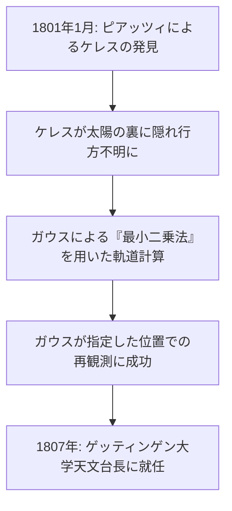

## 1. はじめに：「数学の王」と呼ばれる男

ヨハン・カール・フリードリヒ・[ガウス](https://kenji.blog/p/gauss/)（Johann Carl Friedrich Gauß、1777年4月30日 - 1855年2月23日）は、ドイツが誇る偉大なる数学者であり、天文学者、物理学者です。彼はその圧倒的な知能と、多岐にわたる分野への決定的な貢献から **「数学の王」** (Princeps mathematicorum) と称賛されています。[ガウス](https://kenji.blog/p/gauss/)の業績は、純粋数学の深淵な理論から、現実世界の物理現象を記述する応用数学に至るまで、極めて広範囲に及びます。

彼の遺した数々の定理や概念は、現代の数学や科学技術の基礎となっており、我々が日常的に恩恵を受けているテクノロジーの背後にも、[ガウス](https://kenji.blog/p/gauss/)の発見した法則が息づいています。本記事では、この不世出の天才の生涯を時系列で辿りながら、彼がどのようにして数々の偉業を成し遂げたのか、その詳細なエピソードと数学的業績を深く掘り下げていきます。

## 2. 神童の誕生：驚異的な幼少期のエピソード

[ガウス](https://kenji.blog/p/gauss/)は、神聖ローマ帝国ブラウンシュヴァイク＝ヴォルフェンビュッテル侯国のブラウンシュヴァイクという町で、貧しいレンガ職人の家庭に生まれました。彼の両親は十分な教育を受けておらず、母親に至っては読み書きがほとんどできなかったと言われています。しかし、[ガウス](https://kenji.blog/p/gauss/)の天賦の才は幼い頃から隠しようのない輝きを放っていました。

### 1から100までの和を瞬時に計算

最も有名なエピソードの一つが、彼がまだ小学校に通っていた7歳（あるいは10歳）の頃の出来事です。ある日、算数の教師であるビュットナーは、生徒たちを静かにさせるために **「1から100までのすべての整数を足し合わせなさい」** という課題を出しました。普通の子供たちが順番に足し算をしていく中、[ガウス](https://kenji.blog/p/gauss/)はわずか数秒で石盤に「5050」と答えを書き込み、教師の机に提出しました。

教師がどのように計算したのかを尋ねると、[ガウス](https://kenji.blog/p/gauss/)は次のような計算の工夫を説明しました。

$$
1 + 2 + 3 + \dots + 98 + 99 + 100
$$

これを、逆順にしたものと足し合わせます。

$$
\begin{align*}
S &= 1 + 2 + \dots + 99 + 100 \\
S &= 100 + 99 + \dots + 2 + 1
\end{align*}
$$

上下の項をそれぞれ足すと、すべて「101」になります。

$$
2S = 101 + 101 + \dots + 101 + 101
$$

「101」が100個あるため、合計は $101 \times 100 = 10100$ となり、これを2で割ることで答えの $5050$ を導き出したのです。この逸話は、等差数列の和の公式を彼が直感的に発見していたことを示しています。

一般的に、1から $n$ までの整数の和 $S_n$ は以下の数式で表されます。

$$
S_n = \sum_{i=1}^{n} i = \frac{n(n+1)}{2}
$$

この出来事をきっかけに、教師のビュットナーと助手のマルティン・バルテルス（後にロバチェフスキーを教えることになる数学者）は[ガウス](https://kenji.blog/p/gauss/)の並外れた才能を確信し、彼により高度な数学の教科書を与えました。さらに、彼らの推薦により、ブラウンシュヴァイク公カール・ヴィルヘルム・フェルディナントがガウスのパトロンとなり、彼に高等教育を受けるための多額の奨学金を提供することになります。これにより、[ガウス](https://kenji.blog/p/gauss/)はカロリヌム・コレギウム（現在のブラウンシュヴァイク工科大学）、そしてゲッティンゲン大学へと進学し、才能を開花させていくのです。

## 3. 青年期の躍進：正十七角形の作図と『整数論』

ゲッティンゲン大学に進学した[ガウス](https://kenji.blog/p/gauss/)は、言語学を専攻するか数学を専攻するかで迷っていましたが、19歳の時にある歴史的な発見をしたことで、数学の道を生涯の生業とすることを決意します。

### 正十七角形の定規とコンパスによる作図

古代ギリシャの数学者たちは、定規（目盛りのない直線を描く道具）とコンパス（円を描く道具）のみを用いて正多角形を作図する問題に挑んでいました。正三角形、正方形、正五角形、正十五角形、およびそれらの辺の数を2の冪乗倍した正多角形の作図方法は知られていましたが、それ以外の素数角形（例えば正七角形や正十一角形など）の作図は不可能だと考えられていました。

しかし1796年3月30日、[ガウス](https://kenji.blog/p/gauss/)は **「正十七角形が定規とコンパスのみで作図可能である」** ことを数学的に証明しました。彼は、円周等分方程式の根が、有理数体から出発して平方根を次々に添加していくことで表現できるための条件を代数的に解明したのです。

具体的には、$p$ を[フェルマー](https://kenji.blog/p/fermat/)素数（$p = 2^{2^n} + 1$ の形をした素数）としたとき、正 $p$ 角形は作図可能であるという定理を導きました。$n=2$ のとき $p = 2^4 + 1 = 17$ となり、正十七角形が含まれます。[ガウス](https://kenji.blog/p/gauss/)はこの発見を非常に誇りに思い、自身の墓石に正十七角形を刻むよう要望したと言われています（実際には円と区別がつきにくいため、17の点をもつ星型が彫られました）。

### 『整数論』（Disquisitiones Arithmeticae）

1801年、[ガウス](https://kenji.blog/p/gauss/)が24歳の時に出版された著書『整数論』（ラテン語: *Disquisitiones Arithmeticae*）は、数論を一つの体系的な学問として確立した歴史的傑作です。この著作で彼は、現在我々が日常的に使用している **「合同式（モジュラー算術）」** の記法を導入しました。

$$
a \equiv b \pmod{n}
$$

これは「$a$ と $b$ を $n$ で割った余りが等しい」ことを意味します。この記法の導入により、複雑な数の性質に関する議論が非常に簡潔かつ見通しよく行えるようになりました。

また同書において、[ガウス](https://kenji.blog/p/gauss/)は数論における最も美しい定理の一つとされる **「平方剰余の相互法則」** (Law of Quadratic Reciprocity) の最初の厳密な証明を与えました。この法則は、二つの異なる奇素数 $p, q$ について、合同式 $x^2 \equiv p \pmod{q}$ が解を持つかどうかという問題と、$x^2 \equiv q \pmod{p}$ が解を持つかどうかという問題の間に、極めて対称的な関係が存在することを示しています。

数式で表すと、[ルジャンドル](https://kenji.blog/p/legendre/)記号を用いて次のように表現されます。

$$
\left( \frac{p}{q} \right) \left( \frac{q}{p} \right) = (-1)^{\frac{p-1}{2} \frac{q-1}{2}}
$$

[ガウス](https://kenji.blog/p/gauss/)はこの法則を「黄金定理」と呼び、生涯にわたって8種類もの異なる証明を発表しました。

## 4. 天文学への貢献：ケレスの軌道計算と[最小二乗法](https://kenji.blog/p/method-of-least-squares/)

[ガウス](https://kenji.blog/p/gauss/)の才能は純粋数学にとどまらず、天文学の分野でも驚異的な成果を上げました。

1801年1月1日、イタリアの天文学者ジュゼッペ・ピアッツィが新しい天体（後に準惑星ケレスと呼ばれる）を発見しました。しかし、数日間の観測の後、その天体は太陽の裏側に隠れてしまい、見失われてしまいました。当時の天文学者たちは、わずか数日分の観測データからその後の軌道を予測しようと試みましたが、すべて失敗に終わりました。

ここで登場したのが[ガウス](https://kenji.blog/p/gauss/)です。彼は自身が以前から密かに構築していた新しい数学的手法、すなわち **「最小二乗法」** (Method of Least Squares) を用いてケレスの軌道を計算しました。[最小二乗法](https://kenji.blog/p/method-of-least-squares/)とは、観測データに含まれる誤差を最小化するように、最も確からしいパラメータを推定する手法です。

観測値を $y_i$、理論値を $f(x_i, \boldsymbol{\theta})$ としたとき、誤差の平方和 $S$ を最小にするようなパラメータ $\boldsymbol{\theta}$ を求めます。

$$
S(\boldsymbol{\theta}) = \sum_{i=1}^{n} \left( y_i - f(x_i, \boldsymbol{\theta}) \right)^2
$$

[ガウス](https://kenji.blog/p/gauss/)の計算による予測位置は、他の天文学者たちの予測とは大きく異なっていましたが、数ヶ月後に望遠鏡を彼が指定した座標に向けると、まさにそこにケレスが再発見されました。この劇的な成功により、[ガウス](https://kenji.blog/p/gauss/)の名前はヨーロッパ中の科学界に轟き渡りました。1807年、彼はゲッティンゲン大学の天文学教授および天文台長に任命され、生涯その地位にとどまることになります。

## 5. 測地学と微分幾何学：驚異の定理

1810年代後半から1820年代にかけて、[ガウス](https://kenji.blog/p/gauss/)はハノーファー王国の測地測量を依頼されました。この過酷な野外作業を通じて、彼は地球の形状や曲面に関する深い考察を行うようになります。測量の精度を向上させるため、彼は「ヘリオトロープ」と呼ばれる、太陽光を反射させて遠くの観測点に光のシグナルを送る装置を発明しました。

同時に、この測量業務は数学の新しい分野である **「微分幾何学」** の創始へと繋がりました。[ガウス](https://kenji.blog/p/gauss/)は1827年に論文『曲面に関する一般研究』を発表し、曲面上の幾何学を三次元空間に依存せずに内在的に扱う手法を確立しました。

その中で最も有名なのが **「驚異の定理」** (Theorema Egregium) です。この定理は、曲面の **[ガウス](https://kenji.blog/p/gauss/)曲率** $K$（2つの主曲率 $k_1$ と $k_2$ の積、$K = k_1 k_2$）が、曲面を曲げても（伸縮させない限り）変わらない内在的な量であることを示しています。

$$
K = \frac{L N - M^2}{E G - F^2}
$$

（ここで $E, F, G$ は第一基本形式の係数、$L, M, N$ は第二基本形式の係数）

この定理により、例えば平らな紙（曲率0）をどのように丸めても、球面（正の曲率）を歪みなく作ることは不可能であることが数学的に証明されます。この[ガウス](https://kenji.blog/p/gauss/)の微分幾何学のアイデアは、後にベルンハルト・リーマンによって高次元へと一般化され（[リーマン](https://kenji.blog/p/riemann/)幾何学）、さらに後年、アルベルト・アインシュタインの一般相対性理論の数学的基礎として不可欠なものとなりました。

## 6. [ガウス](https://kenji.blog/p/gauss/)分布と電磁気学

統計学において最も重要な分布である **「正規分布」** は、しばしば **「[ガウス](https://kenji.blog/p/gauss/)分布」** と呼ばれます。前述の最小二乗法の正当化において、[ガウス](https://kenji.blog/p/gauss/)は観測誤差が正規分布に従うと仮定しました。確率密度関数 $f(x)$ は次の数式で表されます。

$$
f(x) = \frac{1}{\sigma \sqrt{2\pi}} \exp\left( -\frac{1}{2} \left( \frac{x-\mu}{\sigma} \right)^2 \right)
$$

この釣鐘型の曲線は、現在では物理学、生物学、経済学、社会学など、あらゆる科学分野でデータ分析の基礎として利用されています。ドイツの旧10マルク紙幣には、[ガウス](https://kenji.blog/p/gauss/)の肖像画とともにこの[ガウス](https://kenji.blog/p/gauss/)分布の曲線と数式が描かれていました。

さらに、晩年の[ガウス](https://kenji.blog/p/gauss/)は物理学者のヴィルヘルム・ヴェーバーと共同で、磁気と電気の研究に打ち込みました。彼らは地球磁場を測定するための新しい磁力計を発明し、1833年には世界初の実用的な電磁電信機を構築して、研究所と天文台の間での通信に成功しました。

電磁気学における基本法則の一つである **「[ガウス](https://kenji.blog/p/gauss/)の法則」** は、マクスウェルの方程式の一つとして組み込まれています。電場に関する[ガウス](https://kenji.blog/p/gauss/)の法則の微分形は以下のように記述されます。

$$
\nabla \cdot \mathbf{E} = \frac{\rho}{\varepsilon_0}
$$

また、磁場に関する[ガウス](https://kenji.blog/p/gauss/)の法則は「磁気モノポールが存在しない」ことを示しています。

$$
\nabla \cdot \mathbf{B} = 0
$$

磁束密度の単位である「[ガウス](https://kenji.blog/p/gauss/) (G)」も、彼の名前に由来しています。

## 7. 非[ユークリッド](https://kenji.blog/p/euclid/)幾何学への秘められた洞察

[ガウス](https://kenji.blog/p/gauss/)の驚くべき先見性を示すエピソードとして、**「非ユークリッド幾何学」** に関する逸話があります。[ユークリッド](https://kenji.blog/p/euclid/)の平行線公準（ある直線外の1点を通る平行線はただ1本存在する）が証明可能かどうかは、2000年以上にわたる数学上の大きな謎でした。

[ガウス](https://kenji.blog/p/gauss/)は未発表のメモの中で、平行線公準が成り立たない新しい幾何学（双曲幾何学）の存在に完全に気づいており、その体系を構築していました。しかし、当時の保守的な哲学界（特にカント哲学が主流であった時代）において、空間の絶対性を否定するような理論を発表すれば、無理解な批判や論争（[ガウス](https://kenji.blog/p/gauss/)の言葉を借りれば「ボイオティア人の叫び」）に巻き込まれることを恐れ、生前には一切発表しませんでした。

後に、ニコライ・ロバチェフスキーとヤーノシュ・ボヤイが独立に非[ユークリッド](https://kenji.blog/p/euclid/)幾何学を発表した際、ボヤイの父親（ガウスの旧友）から論文を送られたガウスは、「この成果を賞賛することは、自分自身を賞賛することになる。なぜなら、ここに書かれていることは、私が30年前から考えていたことと完全に一致しているからだ」と返信しました。これにより若いボヤイは深く落胆したと言われていますが、同時に[ガウス](https://kenji.blog/p/gauss/)がどれほど時代を先取りしていたかを示す証左でもあります。

## 8. 晩年と後世への影響

[ガウス](https://kenji.blog/p/gauss/)は完璧主義者であり、**「少なれど熟成したものを」** (Pauca sed matura) をモットーとしていました。彼は自身が完全に納得し、美しく洗練された形になるまで論文を発表しなかったため、死後に膨大な未発表ノートが発見され、後の数学者たちを驚愕させました。複素積分（コーシーの積分定理）、四元数、楕円関数論の基礎など、他の数学者が後に発見して有名になった理論の多くが、すでに[ガウス](https://kenji.blog/p/gauss/)のノートに記されていたのです。

彼はまた、後進の指導にもあたりました。前述の[リーマン](https://kenji.blog/p/riemann/)のほか、リヒャルト・デデキントやフェルディナント・ゴットホルト・マックス・アイゼンシュタインといった次世代の偉大な数学者たちが、[ガウス](https://kenji.blog/p/gauss/)の薫陶を受けています。

1855年2月23日、カール・フリードリヒ・[ガウス](https://kenji.blog/p/gauss/)はゲッティンゲンにて77歳でその生涯を閉じました。彼の遺した業績は、数学という学問の枠を超え、現代のあらゆる科学と技術の根底に流れています。純粋な抽象思考から宇宙の運行の計算、そして電磁気という物理現象まで、彼の知性の光は今なお輝き続けています。

我々が夜空を見上げるとき、あるいはスマートフォンの通信を利用するとき、そこには確実に「数学の王」[ガウス](https://kenji.blog/p/gauss/)の偉大なる足跡が存在しているのです。
