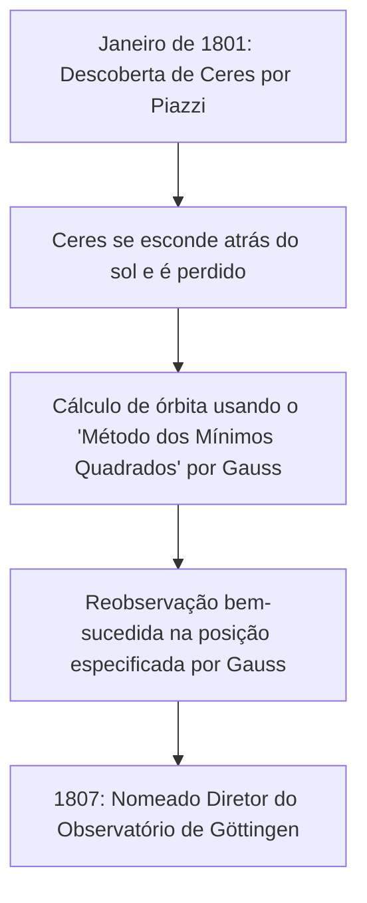

## 1. Introdução: O Homem Conhecido como o "Príncipe dos Matemáticos"

Johann [Carl Friedrich Gauss](https://kenji.blog/pt/p/gauss/) (30 de abril de 1777 - 23 de fevereiro de 1855) foi um grande matemático, astrônomo e físico alemão. Devido ao seu intelecto avassalador e suas contribuições decisivas para uma ampla gama de campos, ele é aclamado como o **"Príncipe dos Matemáticos"** (Princeps mathematicorum). As conquistas de Gauss cobrem um espectro extremamente amplo, desde teorias profundas em matemática pura até matemática aplicada que descreve fenômenos físicos no mundo real.

Os numerosos teoremas e conceitos que ele deixou para trás formam a base da matemática e da ciência modernas. As leis descobertas por Gauss dão vida às tecnologias das quais nos beneficiamos diariamente. Neste artigo, seguiremos a vida deste gênio sem precedentes cronologicamente, investigando profundamente seus episódios detalhados e conquistas matemáticas para ver como ele realizou tantos grandes feitos.

## 2. Nascimento de um Prodígio: Episódios Surpreendentes da Infância

Gauss nasceu em uma família pobre de pedreiros na cidade de Braunschweig, no Ducado de Brunswick-Wolfenbüttel, Sacro Império Romano-Germânico. Seus pais não receberam educação suficiente e dizia-se que sua mãe era quase totalmente analfabeta. No entanto, o dom natural de Gauss brilhou intensamente desde muito jovem.

### Calculando Instantaneamente a Soma de 1 a 100

Um dos episódios mais famosos ocorreu quando ele era um menino de 7 (ou 10) anos na escola primária. Um dia, seu professor de aritmética, J.G. Büttner, deu aos alunos uma tarefa para mantê-los quietos: **"Somem todos os números inteiros de 1 a 100."** Enquanto as crianças normais somavam os números sequencialmente, Gauss escreveu "5050" em sua lousa em apenas alguns segundos e entregou na mesa do professor.

Quando o professor perguntou como ele havia calculado aquilo, Gauss explicou o seguinte truque.

$$
1 + 2 + 3 + \dots + 98 + 99 + 100
$$

Ele adicionou isso à mesma sequência na ordem inversa:

$$
\begin{align*}
S &= 1 + 2 + \dots + 99 + 100 \\
S &= 100 + 99 + \dots + 2 + 1
\end{align*}
$$

Somando os termos superior e inferior, respectivamente, cada par é igual a "101".

$$
2S = 101 + 101 + \dots + 101 + 101
$$

Como existem cem "101", o total é $101 \times 100 = 10100$, e dividindo isso por 2 obtém-se a resposta $5050$. Esta anedota mostra que ele descobriu intuitivamente a fórmula para a soma de uma progressão aritmética.

Geralmente, a soma $S_n$ de inteiros de 1 a $n$ é expressa pela seguinte fórmula:

$$
S_n = \sum_{i=1}^{n} i = \frac{n(n+1)}{2}
$$

Impulsionado por este evento, seu professor Büttner e seu assistente Martin Bartels (um matemático que mais tarde ensinaria Lobachevsky) se convenceram do talento extraordinário de Gauss e lhe deram livros de matemática mais avançados. Além disso, por recomendação deles, o duque Karl Wilhelm Ferdinand de Brunswick tornou-se patrono de Gauss, fornecendo-lhe uma bolsa generosa para o ensino superior. Graças a isso, Gauss avançou para o Collegium Carolinum (hoje Universidade Técnica de Brunswick) e depois para a Universidade de Göttingen, onde seus talentos floresceram.

## 3. Avanços Juvenis: Construção do Heptadecágono e 'Disquisitiones Arithmeticae'

Gauss, que havia ingressado na Universidade de Göttingen, ficou dividido entre se formar em linguística ou matemática. No entanto, uma descoberta histórica que fez aos 19 anos o levou a decidir fazer da matemática sua profissão para o resto da vida.

### Construção do Heptadecágono Regular com Compasso e Régua

Os antigos matemáticos gregos abordaram o problema de construir polígonos regulares usando apenas uma régua (uma ferramenta para desenhar linhas não graduadas) e um compasso (uma ferramenta para desenhar círculos). Embora métodos para construir o triângulo equilátero, o quadrado, o pentágono regular, o pentadecágono regular e polígonos com o número de lados multiplicados por potências de 2 fossem conhecidos, a construção de outros polígonos de lados primos (como o heptágono regular ou o endecágono regular) era considerada impossível.

No entanto, em 30 de março de 1796, Gauss provou matematicamente que **"o heptadecágono regular (polígono de 17 lados) pode ser construído usando apenas um compasso e uma régua não graduada."** Ele elucidou algebricamente as condições sob as quais as raízes da equação ciclotômica podem ser expressas partindo do corpo dos números racionais e adicionando sucessivamente raízes quadradas.

Especificamente, ele derivou o teorema de que se $p$ for um primo de [Fermat](https://kenji.blog/pt/p/fermat/) (um primo da forma $p = 2^{2^n} + 1$), o $p$-ágono regular é construtível. Quando $n=2$, $p = 2^4 + 1 = 17$, o que inclui o heptadecágono regular. Gauss estava extremamente orgulhoso desta descoberta e teria pedido que um heptadecágono regular fosse gravado em sua lápide (na realidade, uma estrela de 17 pontas foi esculpida porque seria indistinguível de um círculo).

### Disquisitiones Arithmeticae

Publicado em 1801 quando Gauss tinha 24 anos, o livro *Disquisitiones Arithmeticae* é uma obra-prima histórica que estabeleceu a teoria dos números como uma disciplina sistemática. Neste trabalho, ele introduziu a notação para **"congruências (aritmética modular)"** que usamos diariamente hoje.

$$
a \equiv b \pmod{n}
$$

Isso significa que "os restos quando $a$ e $b$ são divididos por $n$ são iguais". A introdução desta notação tornou os argumentos sobre as propriedades complexas dos números extremamente concisos e claros.

Também no mesmo livro, Gauss forneceu a primeira prova rigorosa da **"Lei da Reciprocidade Quadrática"**, considerada um dos mais belos teoremas da teoria dos números. Esta lei mostra que para dois números primos ímpares diferentes $p, q$, existe uma relação altamente simétrica entre se a congruência $x^2 \equiv p \pmod{q}$ tem uma solução e se $x^2 \equiv q \pmod{p}$ tem uma solução.

Expresso em fórmula matemática usando o símbolo de [Legendre](https://kenji.blog/pt/p/legendre/), é representado da seguinte forma:

$$
\left( \frac{p}{q} \right) \left( \frac{q}{p} \right) = (-1)^{\frac{p-1}{2} \frac{q-1}{2}}
$$

Gauss chamou esta lei de "Teorema de Ouro" e publicou oito provas diferentes ao longo de sua vida.

## 4. Contribuições para a Astronomia: Cálculo da Órbita de Ceres e o [Método dos Mínimos Quadrados](https://kenji.blog/pt/p/method-of-least-squares/)

Os talentos de Gauss não se limitaram à matemática pura; ele também alcançou resultados fenomenais na astronomia.

Em 1º de janeiro de 1801, o astrônomo italiano Giuseppe Piazzi descobriu um novo corpo celeste (mais tarde chamado de planeta anão Ceres). No entanto, após alguns dias de observação, o corpo celeste escondeu-se atrás do sol e foi perdido de vista. Os astrônomos da época tentaram prever sua órbita subsequente com base em apenas alguns dias de dados de observação, mas todos falharam.

É aqui que entra Gauss. Ele calculou a órbita de Ceres usando uma nova técnica matemática que construiu secretamente por algum tempo, o **"[Método dos Mínimos Quadrados](https://kenji.blog/pt/p/method-of-least-squares/)"**. O [método dos mínimos quadrados](/pt/p/method-of-least-squares/) é uma técnica para estimar os parâmetros mais prováveis para minimizar os erros contidos nos dados de observação.

Assumindo que o valor observado é $y_i$ e o valor teórico é $f(x_i, \boldsymbol{\theta})$, encontramos o parâmetro $\boldsymbol{\theta}$ que minimiza a soma dos erros quadráticos $S$.

$$
S(\boldsymbol{\theta}) = \sum_{i=1}^{n} \left( y_i - f(x_i, \boldsymbol{\theta}) \right)^2
$$

A posição prevista calculada por Gauss diferia muito das previsões de outros astrônomos, mas quando apontaram seus telescópios para as coordenadas que ele especificou alguns meses depois, Ceres foi redescoberto exatamente lá. Devido a esse sucesso dramático, o nome de Gauss ecoou por toda a comunidade científica europeia. Em 1807, ele foi nomeado Professor de Astronomia e Diretor do Observatório da Universidade de Göttingen, cargos que ocupou pelo resto de sua vida.

## 5. Geodésia e Geometria Diferencial: Theorema Egregium

Do final da década de 1810 à década de 1820, Gauss foi comissionado para realizar levantamentos geodésicos para o Reino de Hanover. Através deste trabalho de campo cansativo, ele começou a pensar profundamente sobre a forma da Terra e superfícies curvas. Para melhorar a precisão do levantamento, ele inventou um dispositivo chamado "heliótropo", que refletia a luz do sol para enviar sinais de luz a pontos de observação distantes.

Ao mesmo tempo, este trabalho de levantamento levou à criação de um novo campo da matemática, a **"Geometria Diferencial"**. Gauss publicou o artigo *Investigações Gerais de Superfícies Curvas* em 1827, estabelecendo um método para tratar a geometria em superfícies curvas de forma intrínseca, sem depender do espaço tridimensional.

O mais famoso deles é o **"Theorema Egregium"** (Teorema Notável). Este teorema mostra que a **curvatura gaussiana** $K$ de uma superfície (o produto das duas curvaturas principais $k_1$ e $k_2$, $K = k_1 k_2$) é uma quantidade intrínseca que permanece inalterada mesmo que a superfície seja dobrada (desde que não seja esticada ou encolhida).

$$
K = \frac{L N - M^2}{E G - F^2}
$$

(Onde $E, F, G$ são os coeficientes da primeira forma fundamental, e $L, M, N$ são os coeficientes da segunda forma fundamental)

De acordo com este teorema, é matematicamente provado que, por exemplo, não importa como um pedaço de papel plano (curvatura 0) seja enrolado, é impossível fazer uma esfera (curvatura positiva) sem distorção. Esta ideia da geometria diferencial de Gauss foi mais tarde generalizada para dimensões superiores por [Bernhard Riemann](https://kenji.blog/pt/p/riemann/) (geometria [Riemann](https://kenji.blog/pt/p/riemann/)iana) e, mais tarde, tornou-se indispensável como base matemática para a teoria da relatividade geral de Albert Einstein.

## 6. Distribuição Gaussiana e Eletromagnetismo

A **"Distribuição Normal"**, a distribuição mais importante em estatística, é frequentemente chamada de **"Distribuição de Gauss"**. Ao justificar o [método dos mínimos quadrados](/pt/p/method-of-least-squares/) mencionado acima, Gauss assumiu que os erros de observação seguem uma distribuição normal. A função de densidade de probabilidade $f(x)$ é expressa pela seguinte fórmula:

$$
f(x) = \frac{1}{\sigma \sqrt{2\pi}} \exp\left( -\frac{1}{2} \left( \frac{x-\mu}{\sigma} \right)^2 \right)
$$

Esta curva em forma de sino é hoje utilizada como base para a análise de dados em todos os campos científicos, incluindo física, biologia, economia e sociologia. A antiga nota de 10 marcos alemães trazia o retrato de Gauss ao lado desta curva de distribuição gaussiana e da fórmula.

Além disso, nos seus últimos anos, Gauss dedicou-se ao estudo do magnetismo e da eletricidade em colaboração com o físico Wilhelm Weber. Eles inventaram um novo magnetômetro para medir o campo magnético da Terra e, em 1833, construíram o primeiro telégrafo eletromagnético prático do mundo, comunicando-se com sucesso entre o instituto e o observatório.

A **"Lei de Gauss"**, uma das leis fundamentais do eletromagnetismo, é incorporada como uma das equações de Maxwell. A forma diferencial da lei de Gauss para campos elétricos é descrita da seguinte forma:

$$
\nabla \cdot \mathbf{E} = \frac{\rho}{\varepsilon_0}
$$

Além disso, a lei de Gauss para campos magnéticos indica que "monopolos magnéticos não existem".

$$
\nabla \cdot \mathbf{B} = 0
$$

A unidade de densidade de fluxo magnético, o "Gauss (G)", também tem o seu nome.

## 7. Insights Ocultos sobre a Geometria Não [Euclid](https://kenji.blog/pt/p/euclid/)iana

Um episódio que mostra a incrível visão de futuro de Gauss é a anedota sobre a **"Geometria Não [Euclid](https://kenji.blog/pt/p/euclid/)iana"**. Se o postulado das paralelas de [Euclides](https://kenji.blog/pt/p/euclid/) (por um ponto fora de uma reta, passa exatamente uma reta paralela) poderia ser provado, havia sido um grande mistério matemático por mais de 2.000 anos.

Nas suas notas não publicadas, Gauss estava totalmente ciente da existência de uma nova geometria (geometria hiperbólica) na qual o postulado das paralelas não se sustenta, e havia construído seu sistema. No entanto, nos círculos filosóficos conservadores da época (uma era em que a filosofia kantiana era predominante), ele temia se envolver em críticas e controvérsias incompreensíveis (nas palavras de Gauss, "o clamor dos beócios") se publicasse uma teoria que negasse a absolutidade do espaço, por isso ele nunca a publicou em vida.

Mais tarde, quando [Nikolai Lobachevsky](/pt/p/biography-nikolai-lobachevsky/) e János Bolyai publicaram de forma independente a geometria não euclidiana, Gauss, ao receber um artigo do pai de Bolyai (um velho amigo de Gauss), respondeu: "Elogiá-lo equivaleria a elogiar a mim mesmo. Pois todo o conteúdo do trabalho coincide quase exatamente com as minhas próprias meditações que ocuparam a minha mente por trinta a trinta e cinco anos." Diz-se que o jovem Bolyai ficou profundamente decepcionado com isso, mas ao mesmo tempo serve como prova de quão à frente de seu tempo Gauss estava.

## 8. Últimos Anos e Legado

Gauss era um perfeccionista, com o lema **"Poucos, mas maduros"** (Pauca sed matura). Como não publicava seus artigos até estar completamente satisfeito e em uma forma maravilhosamente refinada, grandes quantidades de notas não publicadas foram descobertas após sua morte, surpreendendo os matemáticos posteriores. Muitas das teorias mais tarde descobertas e tornadas famosas por outros matemáticos, como a integração complexa (teorema integral de [Cauchy](https://kenji.blog/pt/p/cauchy/)), quaternions e os fundamentos da teoria das funções elípticas, já estavam escritas nas notas de Gauss.

Ele também orientou a próxima geração. Além do já mencionado [Riemann](https://kenji.blog/pt/p/riemann/), grandes matemáticos da geração seguinte, como Richard Dedekind e Ferdinand Gotthold Max Eisenstein, receberam a orientação de Gauss.

Em 23 de fevereiro de 1855, [Carl Friedrich Gauss](https://kenji.blog/pt/p/gauss/) faleceu em Göttingen aos 77 anos. Seu legado transcende as fronteiras da matemática e flui na raiz de toda a ciência e tecnologia modernas. Do pensamento abstrato puro ao cálculo das órbitas planetárias e até o fenômeno físico do eletromagnetismo, a luz do seu intelecto continua a brilhar ainda hoje.

Quando olhamos para o céu noturno ou usamos a comunicação em nossos smartphones, as grandes pegadas de Gauss, o "Príncipe dos Matemáticos", estão certamente lá.
