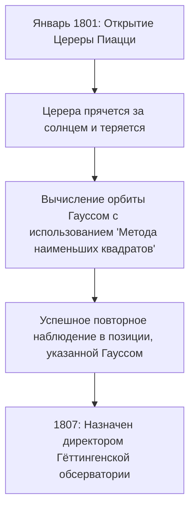

## 1. Введение: Человек, известный как «Король математиков»

Иоганн Карл Фридрих Гаусс (30 апреля 1777 — 23 февраля 1855) был великим немецким математиком, астрономом и физиком. Благодаря своему выдающемуся интеллекту и решающему вкладу в широкий спектр областей, он провозглашен **«Королем математиков»** (Princeps mathematicorum). Достижения Гаусса охватывают чрезвычайно широкий спектр: от глубоких теорий в чистой математике до прикладной математики, описывающей физические явления в реальном мире.

Многочисленные теоремы и концепции, которые он оставил после себя, составляют фундамент современной математики и науки. Законы, открытые Гауссом, вдыхают жизнь в технологии, которыми мы пользуемся ежедневно. В этой статье мы проследим жизнь этого беспрецедентного гения в хронологическом порядке, глубоко погружаясь в подробные эпизоды и математические достижения, чтобы увидеть, как он совершил так много великих подвигов.

## 2. Рождение вундеркинда: Удивительные эпизоды детства

Гаусс родился в бедной семье каменщика в городе Брауншвейг герцогства Брауншвейг-Вольфенбюттель, Священная Римская империя. Его родители не получили достаточного образования, а мать, как говорили, была почти полностью неграмотной. Однако природный дар Гаусса ярко проявился с самого раннего возраста.

### Мгновенное вычисление суммы от 1 до 100

Один из самых известных эпизодов произошел, когда он был 7-летним (или 10-летним) мальчиком в начальной школе. Однажды его учитель арифметики И.Г. Бюттнер дал ученикам задание, чтобы они сидели тихо: **«Сложите все целые числа от 1 до 100».** Пока обычные дети складывали числа последовательно, Гаусс всего за несколько секунд написал «5050» на своей грифельной доске и положил ее на стол учителя.

Когда учитель спросил, как он это вычислил, Гаусс объяснил следующий трюк.

$$
1 + 2 + 3 + \dots + 98 + 99 + 100
$$

Он прибавил к этому ту же последовательность в обратном порядке:

$$
\begin{align*}
S &= 1 + 2 + \dots + 99 + 100 \\
S &= 100 + 99 + \dots + 2 + 1
\end{align*}
$$

При сложении верхнего и нижнего членов соответственно каждая пара равна «101».

$$
2S = 101 + 101 + \dots + 101 + 101
$$

Поскольку «101» встречается 100 раз, общая сумма равна $101 \times 100 = 10100$, и разделив ее на 2, получаем ответ $5050$. Этот случай показывает, что он интуитивно открыл формулу суммы арифметической прогрессии.

В общем виде сумма $S_n$ целых чисел от 1 до $n$ выражается следующей формулой:

$$
S_n = \sum_{i=1}^{n} i = \frac{n(n+1)}{2}
$$

Побуждаемые этим событием, его учитель Бюттнер и его помощник Мартин Бартельс (математик, который позже будет обучать Лобачевского) убедились в выдающемся таланте Гаусса и дали ему более продвинутые учебники по математике. Кроме того, по их рекомендации герцог Карл Вильгельм Фердинанд Брауншвейгский стал покровителем Гаусса, предоставив ему щедрую стипендию для получения высшего образования. Благодаря этому Гаусс поступил в Collegium Carolinum (ныне Брауншвейгский технический университет), а затем в Гёттингенский университет, где его таланты расцвели.

## 3. Прорывы юности: Построение семнадцатиугольника и «Арифметические исследования»

Гаусс, поступивший в Гёттингенский университет, разрывался между изучением лингвистики или математики. Однако историческое открытие, сделанное им в возрасте 19 лет, привело его к решению сделать математику своей профессией на всю жизнь.

### Построение правильного семнадцатиугольника с помощью циркуля и линейки

Древнегреческие математики решали задачу построения правильных многоугольников, используя только линейку (инструмент для проведения прямых линий без делений) и циркуль (инструмент для черчения кругов). Хотя были известны методы построения равностороннего треугольника, квадрата, правильного пятиугольника, правильного пятнадцатиугольника и многоугольников, число сторон которых умножается на степени 2, построение других многоугольников с простым числом сторон (таких как правильный семиугольник или правильный одиннадцатиугольник) считалось невозможным.

Однако 30 марта 1796 года Гаусс математически доказал, что **«правильный семнадцатиугольник (17-угольник) можно построить, используя только циркуль и линейку без делений».** Он алгебраически выяснил условия, при которых корни кругового уравнения могут быть выражены, отправляясь от поля рациональных чисел и последовательно присоединяя квадратные корни.

В частности, он вывел теорему о том, что если $p$ — простое число Ферма (простое число вида $p = 2^{2^n} + 1$), то правильный $p$-угольник можно построить. При $n=2$, $p = 2^4 + 1 = 17$, что включает правильный семнадцатиугольник. Гаусс чрезвычайно гордился этим открытием и, как сообщается, просил, чтобы на его надгробии был выгравирован правильный семнадцатиугольник (на самом деле была вырезана 17-конечная звезда, потому что ее было бы трудно отличить от круга).

### Арифметические исследования (Disquisitiones Arithmeticae)

Опубликованная в 1801 году, когда Гауссу было 24 года, книга *Disquisitiones Arithmeticae* является историческим шедевром, утвердившим теорию чисел как систематическую дисциплину. В этой работе он ввел обозначение для **«сравнений (модульная арифметика)»**, которое мы ежедневно используем сегодня.

$$
a \equiv b \pmod{n}
$$

Это означает, что «остатки при делении $a$ и $b$ на $n$ равны». Введение этого обозначения сделало рассуждения о сложных свойствах чисел чрезвычайно краткими и ясными.

Также в этой же книге Гаусс представил первое строгое доказательство **«Квадратичного закона взаимности»**, считающегося одной из самых красивых теорем в теории чисел. Этот закон показывает, что для двух различных нечетных простых чисел $p, q$ существует в высшей степени симметричная связь между тем, имеет ли решение сравнение $x^2 \equiv p \pmod{q}$, и тем, имеет ли решение сравнение $x^2 \equiv q \pmod{p}$.

Выраженный математической формулой с использованием символа Лежандра, он выглядит следующим образом:

$$
\left( \frac{p}{q} \right) \left( \frac{q}{p} \right) = (-1)^{\frac{p-1}{2} \frac{q-1}{2}}
$$

Гаусс назвал этот закон «Золотой теоремой» и за свою жизнь опубликовал восемь его различных доказательств.

## 4. Вклад в астрономию: Вычисление орбиты Цереры и метод наименьших квадратов

Таланты Гаусса не ограничивались чистой математикой; он также достиг феноменальных результатов в астрономии.

1 января 1801 года итальянский астроном Джузеппе Пиацци открыл новое небесное тело (позже названное карликовой планетой Церера). Однако после нескольких дней наблюдений небесное тело скрылось за солнцем и было потеряно из виду. Астрономы того времени пытались предсказать его дальнейшую орбиту, основываясь лишь на нескольких днях наблюдений, но все потерпели неудачу.

Здесь в дело вступил Гаусс. Он вычислил орбиту Цереры, используя новую математическую методику, которую он тайно разрабатывал некоторое время, — **«Метод наименьших квадратов»**. Метод наименьших квадратов — это метод оценки наиболее вероятных параметров для минимизации ошибок, содержащихся в данных наблюдений.

Предполагая, что наблюдаемое значение равно $y_i$, а теоретическое — $f(x_i, \boldsymbol{\theta})$, мы находим параметр $\boldsymbol{\theta}$, который минимизирует сумму квадратов ошибок $S$.

$$
S(\boldsymbol{\theta}) = \sum_{i=1}^{n} \left( y_i - f(x_i, \boldsymbol{\theta}) \right)^2
$$

Предсказанное положение, вычисленное Гауссом, сильно отличалось от предсказаний других астрономов, но когда несколько месяцев спустя они направили свои телескопы на указанные им координаты, Церера была вновь открыта именно там. Благодаря этому драматическому успеху имя Гаусса прогремело на все европейское научное сообщество. В 1807 году он был назначен профессором астрономии и директором обсерватории Гёттингенского университета — должности, которые он занимал до конца жизни.

## 5. Геодезия и дифференциальная геометрия: Theorema Egregium

С конца 1810-х до 1820-х годов Гауссу было поручено провести геодезическую съемку Королевства Ганновер. Благодаря этой изнурительной полевой работе он начал глубоко размышлять о форме земли и искривленных поверхностях. Для повышения точности съемки он изобрел прибор под названием «гелиотроп», который отражал солнечный свет, посылая световые сигналы на удаленные точки наблюдения.

В то же время эта геодезическая работа привела к созданию новой области математики — **«Дифференциальной геометрии»**. Гаусс опубликовал статью *«Общие исследования о кривых поверхностях»* в 1827 году, в которой установил метод рассмотрения геометрии на кривых поверхностях внутренне, без зависимости от трехмерного пространства.

Наиболее известной из них является **«Theorema Egregium»** (Замечательная теорема). Эта теорема показывает, что **гауссова кривизна** $K$ поверхности (произведение двух главных кривизн $k_1$ и $k_2$, $K = k_1 k_2$) является внутренней величиной, которая остается неизменной, даже если поверхность изогнуть (при условии, что она не растягивается и не сжимается).

$$
K = \frac{L N - M^2}{E G - F^2}
$$

(Где $E, F, G$ — коэффициенты первой квадратичной формы, а $L, M, N$ — коэффициенты второй квадратичной формы)

Согласно этой теореме, математически доказано, что, например, как бы ни сворачивался плоский лист бумаги (кривизна 0), из него невозможно сделать сферу (положительная кривизна) без искажений. Эта идея дифференциальной геометрии Гаусса позже была обобщена на более высокие размерности Бернхардом Риманом (риманова геометрия) и впоследствии стала незаменимой математической основой для общей теории относительности Альберта Эйнштейна.

## 6. Распределение Гаусса и электромагнетизм

**«Нормальное распределение»**, наиболее важное распределение в статистике, часто называют **«Распределением Гаусса»**. Обосновывая вышеупомянутый метод наименьших квадратов, Гаусс предположил, что ошибки наблюдений подчиняются нормальному распределению. Функция плотности вероятности $f(x)$ выражается следующей формулой:

$$
f(x) = \frac{1}{\sigma \sqrt{2\pi}} \exp\left( -\frac{1}{2} \left( \frac{x-\mu}{\sigma} \right)^2 \right)
$$

Эта колоколообразная кривая сейчас используется в качестве основы для анализа данных во всех научных областях, включая физику, биологию, экономику и социологию. На старой немецкой банкноте в 10 марок был изображен портрет Гаусса рядом с этой кривой распределения Гаусса и формулой.

Кроме того, в свои поздние годы Гаусс посвятил себя изучению магнетизма и электричества в сотрудничестве с физиком Вильгельмом Вебером. Они изобрели новый магнитометр для измерения магнитного поля Земли, а в 1833 году сконструировали первый в мире практичный электромагнитный телеграф, успешно установив связь между институтом и обсерваторией.

**«Закон Гаусса»**, один из фундаментальных законов электромагнетизма, включен в качестве одного из уравнений Максвелла. Дифференциальная форма закона Гаусса для электрических полей описывается следующим образом:

$$
\nabla \cdot \mathbf{E} = \frac{\rho}{\varepsilon_0}
$$

Кроме того, закон Гаусса для магнитных полей указывает на то, что «магнитных монополей не существует».

$$
\nabla \cdot \mathbf{B} = 0
$$

Единица магнитной индукции, «Гаусс (Гс)», также названа в его честь.

## 7. Скрытые прозрения в неевклидову геометрию

Эпизодом, демонстрирующим удивительное предвидение Гаусса, является история с **«Неевклидовой геометрией»**. Вопрос о том, можно ли доказать пятый постулат Евклида о параллельных прямых (через точку вне прямой проходит ровно одна параллельная ей прямая), был величайшей математической загадкой на протяжении более 2000 лет.

В своих неопубликованных заметках Гаусс полностью осознавал существование новой геометрии (гиперболической геометрии), в которой постулат о параллельных не выполняется, и построил ее систему. Однако в консервативных философских кругах того времени (в эпоху, когда господствовала кантовская философия) он боялся быть втянутым в непонимающую критику и споры (по словам Гаусса, «крики беотийцев»), если опубликует теорию, отрицающую абсолютность пространства, поэтому он так и не опубликовал ее при жизни.

Позже, когда Николай Лобачевский и Янош Бойяи независимо друг от друга опубликовали неевклидову геометрию, Гаусс, получив работу от отца Бойяи (старого друга Гаусса), ответил: «Хвалить это значило бы хвалить самого себя. Ибо все содержание работы почти в точности совпадает с моими собственными размышлениями, которые занимали мой ум от тридцати до тридцати пяти лет». Говорят, что молодой Бойяи был глубоко разочарован этим, но в то же время это служит доказательством того, насколько Гаусс опередил свое время.

## 8. Поздние годы и наследие

Гаусс был перфекционистом, его девизом было **«Мало, но зрело»** (Pauca sed matura). Поскольку он не публиковал свои работы до тех пор, пока не был ими полностью удовлетворен и пока они не приобретали прекрасную отточенную форму, после его смерти было обнаружено огромное количество неопубликованных заметок, поразивших последующих математиков. Многие из теорий, которые позже были открыты и прославлены другими математиками, такие как комплексное интегрирование (интегральная теорема Коши), кватернионы и основы теории эллиптических функций, уже были записаны в заметках Гаусса.

Он также был наставником следующего поколения. Помимо вышеупомянутого Римана, руководство Гаусса получили великие математики следующего поколения, такие как Рихард Дедекинд и Фердинанд Готтхольд Макс Эйзенштейн.

23 февраля 1855 года Карл Фридрих Гаусс скончался в Гёттингене в возрасте 77 лет. Его наследие выходит за рамки математики и лежит в основе всей современной науки и техники. От чистой абстрактной мысли до вычисления орбит планет и вплоть до физического явления электромагнетизма свет его интеллекта продолжает сиять и сегодня.

Когда мы смотрим на ночное небо или пользуемся связью на своих смартфонах, в этом, несомненно, присутствуют великие следы Гаусса, «Короля математиков».
