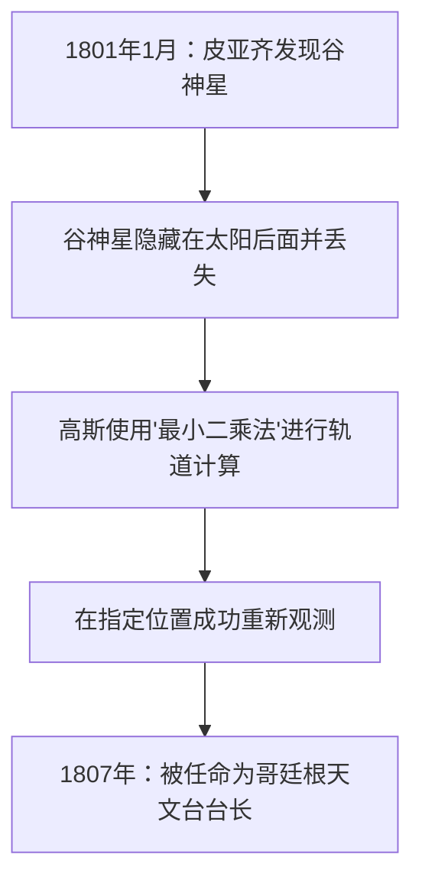

## 1. 引言：被称为“数学王子”的人

约翰·[卡尔·弗里德里希·高斯](https://kenji.blog/zh-cn/p/gauss/)（Johann [Carl Friedrich Gauß](https://kenji.blog/zh-cn/p/gauss/)，1777年4月30日 - 1855年2月23日）是德国引以为傲的伟大数学家、天文学家和物理学家。由于其压倒性的智慧和对广泛领域的决定性贡献，他被赞誉为 **“数学王子”** (Princeps mathematicorum)。高斯的成就涵盖了极其广泛的领域，从纯粹数学的深奥理论到描述现实世界物理现象的应用数学。

他留下的众多定理和概念构成了现代数学和科学技术的基础，我们日常受益的技术背后也活跃着高斯发现的定律。在本文中，我们将按时间顺序追溯这位旷世天才的生平，深入挖掘他详细的轶事和数学成就，看看他是如何完成众多伟业的。

## 2. 神童的诞生：惊人的童年轶事

高斯出生在神圣罗马帝国不伦瑞克-沃尔芬比特尔公国的不伦瑞克镇的一个贫穷泥瓦匠家庭。他的父母没有受过充分的教育，据说他的母亲几乎完全是文盲。然而，高斯的天赋从很小的时候就闪耀着无法掩盖的光芒。

### 瞬间计算1到100的和

最著名的轶事之一发生在他还是小学里一个7岁（或10岁）的男孩时。有一天，算术老师J.G.毕特纳为了让学生们安静下来，布置了一个任务： **“把从1到100的所有整数加起来。”** 当普通孩子还在依次相加时，高斯只用了几秒钟就在石板上写下了“5050”并交到了老师的讲台上。

当老师问他是如何计算时，高斯解释了以下技巧。

$$
1 + 2 + 3 + \dots + 98 + 99 + 100
$$

他将其与逆序的相同数列相加：

$$
\begin{align*}
S &= 1 + 2 + \dots + 99 + 100 \\
S &= 100 + 99 + \dots + 2 + 1
\end{align*}
$$

将上下两项分别相加，每一对都等于“101”。

$$
2S = 101 + 101 + \dots + 101 + 101
$$

因为有100个“101”，总和是 $101 \times 100 = 10100$，将其除以2得到答案 $5050$。这个轶事表明他直觉地发现了等差数列求和的公式。

通常，从1到 $n$ 的整数之和 $S_n$ 由以下公式表示：

$$
S_n = \sum_{i=1}^{n} i = \frac{n(n+1)}{2}
$$

受此事件的启发，他的老师毕特纳和助手马丁·巴特尔斯（后来教导罗巴切夫斯基的数学家）确信了高斯非凡的天赋，并给了他更高级的数学教科书。此外，在他们的推荐下，不伦瑞克公爵卡尔·威廉·斐迪南成为高斯的赞助人，为他提供慷慨的奖学金以接受高等教育。多亏了这一点，高斯进入了卡罗琳学院（现不伦瑞克工业大学），然后进入哥廷根大学，在那里他的才华得到了充分绽放。

## 3. 青年时期的突破：正十七边形的作图与《算术研究》

进入哥廷根大学的高斯在主修语言学还是数学之间徘徊。然而，他在19岁时做出的一项历史性发现使他下定决心将数学作为一生的职业。

### 用圆规和直尺作正十七边形

古希腊数学家致力于仅使用直尺（一种画无刻度直线的工具）和圆规（一种画圆的工具）来作正多边形的问题。虽然已知作正三角形、正方形、正五边形、正十五边形以及边数乘以2的幂的多边形的方法，但其他素数边多边形（如正七边形或正十一边形）的作图被认为是不可能的。

然而，在1796年3月30日，高斯在数学上证明了 **“正十七边形仅用圆规和无刻度直尺即可作图。”** 他在代数上阐明了分圆方程的根可以从有理数域出发并通过依次添加平方根来表示的条件。

具体而言，他推导出一个定理：如果 $p$ 是费马素数（形式为 $p = 2^{2^n} + 1$ 的素数），则正 $p$ 边形是可作图的。当 $n=2$ 时，$p = 2^4 + 1 = 17$，这包括了正十七边形。高斯对这一发现极其自豪，据报道他要求在他的墓碑上刻一个正十七边形（实际上雕刻的是一个17角星，因为它与圆难以区分）。

### 《算术研究》（Disquisitiones Arithmeticae）

1801年出版的高斯24岁时的著作《算术研究》（拉丁语：*Disquisitiones Arithmeticae*）是一部确立了数论作为一门系统学科的历史杰作。在这部著作中，他引入了我们今天日常使用的 **“同余（模算术）”** 的符号。

$$
a \equiv b \pmod{n}
$$

这意味着“当 $a$ 和 $b$ 被 $n$ 除时，余数相等”。这种符号的引入使得关于数字复杂性质的论证变得极其简明清晰。

同样在同一本书中，高斯提供了 **“二次互反律”** 的第一个严格证明，这被认为是数论中最美丽的定理之一。该定律表明，对于两个不同的奇素数 $p, q$，关于同余方程 $x^2 \equiv p \pmod{q}$ 是否有解与 $x^2 \equiv q \pmod{p}$ 是否有解之间存在高度对称的关系。

使用勒让德符号表示为数学公式如下：

$$
\left( \frac{p}{q} \right) \left( \frac{q}{p} \right) = (-1)^{\frac{p-1}{2} \frac{q-1}{2}}
$$

高斯称该定律为“黄金定理”，并在其一生中发表了八种不同的证明。

## 4. 对天文学的贡献：谷神星的轨道计算与[最小二乘法](https://kenji.blog/zh-cn/p/method-of-least-squares/)

高斯的才华并不局限于纯数学；他还在天文学上取得了惊人的成果。

1801年1月1日，意大利天文学家朱塞佩·皮亚齐发现了一颗新的天体（后来被称为矮行星谷神星）。然而，在几天的观测后，这颗天体躲到了太阳后面，失去了踪影。当时的天文学家试图仅从几天的观测数据中预测其随后的轨道，但都失败了。

这正是高斯出场的时候。他利用一种他秘密构建了一段时间的新数学技术—— **“[最小二乘法](https://kenji.blog/zh-cn/p/method-of-least-squares/)”** 计算了谷神星的轨道。[最小二乘法](https://kenji.blog/zh-cn/p/method-of-least-squares/)是一种估计最可能参数以最小化观测数据中包含的误差的技术。

假设观测值为 $y_i$，理论值为 $f(x_i, \boldsymbol{\theta})$，我们寻找使误差平方和 $S$ 最小化的参数 $\boldsymbol{\theta}$。

$$
S(\boldsymbol{\theta}) = \sum_{i=1}^{n} \left( y_i - f(x_i, \boldsymbol{\theta}) \right)^2
$$

高斯计算出的预测位置与其他天文学家的预测相差很大，但几个月后当他们将望远镜指向他指定的坐标时，谷神星果然在那里被重新发现了。由于这一戏剧性的成功，高斯的名字响彻整个欧洲科学界。1807年，他被任命为哥廷根大学天文学教授兼天文台台长，并在此职位上度过了余生。

## 5. 大地测量学与微分几何：绝妙定理

从1810年代后期到1820年代，高斯受命为汉诺威王国进行大地测量。通过这项艰苦的野外工作，他开始深入思考地球的形状和曲面。为了提高测量精度，他发明了一种名为“日光仪”的设备，它能反射阳光以向远处的观测点发送光信号。

同时，这项测量工作促成了数学新领域 **“微分几何”** 的诞生。高斯在1827年发表了论文《关于曲面的一般研究》，确立了一种内蕴地处理曲面上几何学的方法，而不依赖于三维空间。

其中最著名的是 **“绝妙定理”** (Theorema Egregium)。该定理表明曲面的 **高斯曲率** $K$（两个主曲率 $k_1$ 和 $k_2$ 的乘积，$K = k_1 k_2$）是一个内蕴量，即使曲面弯曲（只要不拉伸或收缩）它也保持不变。

$$
K = \frac{L N - M^2}{E G - F^2}
$$

（其中 $E, F, G$ 是第一基本形式的系数，$L, M, N$ 是第二基本形式的系数）

根据这个定理，在数学上证明了，例如，无论一张平坦的纸（曲率为0）怎么卷起，都不可能在不发生扭曲的情况下制作出一个球面（正曲率）。高斯微分几何的这一思想后来被[波恩哈德·黎曼](https://kenji.blog/zh-cn/p/riemann/)推广到更高维空间（黎曼几何），并在后来的岁月中成为阿尔伯特·爱因斯坦广义相对论不可或缺的数学基础。

## 6. 高斯分布与电磁学

统计学中最重要的分布 **“正态分布”** 通常被称为 **“高斯分布”**。在证明上述[最小二乘法](https://kenji.blog/zh-cn/p/method-of-least-squares/)时，高斯假设观测误差服从正态分布。概率密度函数 $f(x)$ 由以下公式表示：

$$
f(x) = \frac{1}{\sigma \sqrt{2\pi}} \exp\left( -\frac{1}{2} \left( \frac{x-\mu}{\sigma} \right)^2 \right)
$$

这条钟形曲线现在被用作所有科学领域（包括物理学、生物学、经济学和社会学）数据分析的基础。前德国10马克纸币上印有高斯的肖像以及这条高斯分布曲线和公式。

此外，在晚年，高斯与物理学家威廉·韦伯合作致力于磁学和电学的研究。他们发明了一种用于测量地球磁场的新型磁力计，并在1833年建造了世界上第一台实用的电磁电报机，成功地在研究所和天文台之间进行了通信。

**“高斯定律”** 是电磁学的基本定律之一，被纳入麦克斯韦方程组之一。电场高斯定律的微分形式描述如下：

$$
\nabla \cdot \mathbf{E} = \frac{\rho}{\varepsilon_0}
$$

此外，磁场的高斯定律表明“磁单极子不存在”。

$$
\nabla \cdot \mathbf{B} = 0
$$

磁通量密度的单位“高斯 (G)”也是以他的名字命名的。

## 7. 隐藏的非欧几何洞见

展现高斯惊人先见之明的一个轶事是关于 **“非欧几何”** 的。[欧几里得](https://kenji.blog/zh-cn/p/euclid/)平行公设（通过直线外一点，有且只有一条平行线）能否被证明，是两千多年来的一个伟大数学谜题。

在他未发表的笔记中，高斯完全意识到存在一种平行公设不成立的新几何学（双曲几何学），并且已经构建了它的系统。然而，在当时保守的哲学界（康德哲学占据主流的时代），他害怕如果发表否认空间绝对性的理论，会卷入无法理解的批评和争议（用高斯的话说，就是“波奥西亚人的喧嚣”），所以他生前从未发表过。

后来，当尼古拉·罗巴切夫斯基和雅诺什·鲍耶独立发表非欧几何时，高斯在收到鲍耶父亲（高斯的老朋友）的一篇论文后回复说：“称赞它就等同于称赞我自己。因为作品的全部内容几乎与我自己思考了三十到三十五年的沉思完全一致。”据说年轻的鲍耶对此深感失望，但这同时也是高斯超越时代多远的证据。

## 8. 晚年与遗产

高斯是一位完美主义者，他的座右铭是 **“少，但成熟”** (Pauca sed matura)。因为他在完全满意并将其打磨得极其完美之前不发表论文，所以他死后发现了大量的未发表笔记，震惊了后来的数学家。后来被其他数学家发现并闻名的许多理论，如复积分（柯西积分定理）、四元数和椭圆函数论的基础，都已经写在了高斯的笔记中。

他也指导了下一代。除了上面提到的黎曼，理查德·戴德金和费迪南德·哥特霍尔德·马克斯·艾森斯坦等下一代伟大数学家都受到了高斯的指导。

1855年2月23日，[卡尔·弗里德里希·高斯](https://kenji.blog/zh-cn/p/gauss/)在哥廷根逝世，享年77岁。他的遗产超越了数学的界限，流淌在所有现代科学技术的根基之中。从纯粹的抽象思想到行星轨道的计算，再到电磁学的物理现象，他智慧的光芒至今依然闪耀。

当我们仰望星空，或者在智能手机上使用通信功能时，那里一定存在着“数学王子”高斯的伟大足迹。
