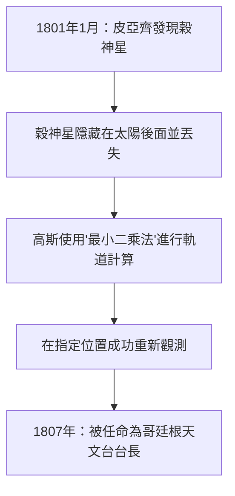

## 1. 引言：被稱為「數學王子」的人

約翰·[卡爾·弗里德里希·高斯](https://kenji.blog/zh-tw/p/gauss/)（Johann [Carl Friedrich Gauß](https://kenji.blog/zh-tw/p/gauss/)，1777年4月30日 - 1855年2月23日）是德國引以為傲的偉大數學家、天文學家和物理學家。由於其壓倒性的智慧和對廣泛領域的決定性貢獻，他被讚譽為 **「數學王子」** (Princeps mathematicorum)。高斯的成就涵蓋了極其廣泛的領域，從純粹數學的深奧理論到描述現實世界物理現象的應用數學。

他留下的眾多定理和概念構成了現代數學和科學技術的基礎，我們日常受益的技術背後也活躍著高斯發現的定律。在本文中，我們將按時間順序追溯這位曠世天才的生平，深入挖掘他詳細的軼事和數學成就，看看他是如何完成眾多偉業的。

## 2. 神童的誕生：驚人的童年軼事

高斯出生在神聖羅馬帝國布倫瑞克-沃爾芬比特爾公國的布倫瑞克鎮的一個貧窮泥瓦匠家庭。他的父母沒有受過充分的教育，據說他的母親幾乎完全是文盲。然而，高斯的天賦從很小的時候就閃耀著無法掩蓋的光芒。

### 瞬間計算1到100的和

最著名的軼事之一發生在他還是小學裡一個7歲（或10歲）的男孩時。有一天，算術老師J.G.畢特納為了讓學生們安靜下來，佈置了一個任務： **「把從1到100的所有整數加起來。」** 當普通孩子還在依次相加時，高斯只用了幾秒鐘就在石板上寫下了「5050」並交到了老師的講台上。

當老師問他是如何計算時，高斯解釋了以下技巧。

$$
1 + 2 + 3 + \dots + 98 + 99 + 100
$$

他將其與逆序的相同數列相加：

$$
\begin{align*}
S &= 1 + 2 + \dots + 99 + 100 \\
S &= 100 + 99 + \dots + 2 + 1
\end{align*}
$$

將上下兩項分別相加，每一對都等於「101」。

$$
2S = 101 + 101 + \dots + 101 + 101
$$

因為有100個「101」，總和是 $101 \times 100 = 10100$，將其除以2得到答案 $5050$。這個軼事表明他直覺地發現了等差數列求和的公式。

通常，從1到 $n$ 的整數之和 $S_n$ 由以下公式表示：

$$
S_n = \sum_{i=1}^{n} i = \frac{n(n+1)}{2}
$$

受此事件的啟發，他的老師畢特納和助手馬丁·巴特爾斯（後來教導羅巴切夫斯基的數學家）確信了高斯非凡的天賦，並給了他更高級的數學教科書。此外，在他們的推薦下，布倫瑞克公爵卡爾·威廉·斐迪南成為高斯的贊助人，為他提供慷慨的獎學金以接受高等教育。多虧了這一點，高斯進入了卡羅琳學院（現布倫瑞克工業大學），然後進入哥廷根大學，在那裡他的才華得到了充分綻放。

## 3. 青年時期的突破：正十七邊形的作圖與《算術研究》

進入哥廷根大學的高斯在主修語言學還是數學之間徘徊。然而，他在19歲時做出的一項歷史性發現使他下定決心將數學作為一生的職業。

### 用圓規和直尺作正十七邊形

古希臘數學家致力於僅使用直尺（一種畫無刻度直線的工具）和圓規（一種畫圓的工具）來作正多邊形的問題。雖然已知作正三角形、正方形、正五邊形、正十五邊形以及邊數乘以2的冪的多邊形的方法，但其他質數邊多邊形（如正七邊形或正十一邊形）的作圖被認為是不可能的。

然而，在1796年3月30日，高斯在數學上證明了 **「正十七邊形僅用圓規和無刻度直尺即可作圖。」** 他在代數上闡明了分圓方程的根可以從有理數域出發並通過依次添加平方根來表示的條件。

具體而言，他推導出一個定理：如果 $p$ 是費馬質數（形式為 $p = 2^{2^n} + 1$ 的質數），則正 $p$ 邊形是可作圖的。當 $n=2$ 時，$p = 2^4 + 1 = 17$，這包括了正十七邊形。高斯對這一發現極其自豪，據報導他要求在他的墓碑上刻一個正十七邊形（實際上雕刻的是一個17角星，因為它與圓難以區分）。

### 《算術研究》（Disquisitiones Arithmeticae）

1801年出版的高斯24歲時的著作《算術研究》（拉丁語：*Disquisitiones Arithmeticae*）是一部確立了數論作為一門系統學科的歷史傑作。在這部著作中，他引入了我們今天日常使用的 **「同餘（模算術）」** 的符號。

$$
a \equiv b \pmod{n}
$$

這意味著「當 $a$ 和 $b$ 被 $n$ 除時，餘數相等」。這種符號的引入使得關於數字複雜性質的論證變得極其簡明清晰。

同樣在同一本書中，高斯提供了 **「二次互反律」** 的第一個嚴格證明，這被認為是數論中最美麗的定理之一。該定律表明，對於兩個不同的奇質數 $p, q$，關於同餘方程 $x^2 \equiv p \pmod{q}$ 是否有解與 $x^2 \equiv q \pmod{p}$ 是否有解之間存在高度對稱的關係。

使用勒讓德符號表示為數學公式如下：

$$
\left( \frac{p}{q} \right) \left( \frac{q}{p} \right) = (-1)^{\frac{p-1}{2} \frac{q-1}{2}}
$$

高斯稱該定律為「黃金定理」，並在其一生中發表了八種不同的證明。

## 4. 對天文學的貢獻：穀神星的軌道計算與[最小二乘法](https://kenji.blog/zh-tw/p/method-of-least-squares/)

高斯的才華並不侷限於純數學；他還在天文學上取得了驚人的成果。

1801年1月1日，義大利天文學家朱塞佩·皮亞齊發現了一顆新的天體（後來被稱為矮行星穀神星）。然而，在幾天的觀測後，這顆天體躲到了太陽後面，失去了蹤影。當時的天文學家試圖僅從幾天的觀測數據中預測其隨後的軌道，但都失敗了。

這正是高斯出場的時候。他利用一種他秘密構建了一段時間的新數學技術—— **「[最小二乘法](https://kenji.blog/zh-tw/p/method-of-least-squares/)」** 計算了穀神星的軌道。[最小二乘法](https://kenji.blog/zh-tw/p/method-of-least-squares/)是一種估計最可能參數以最小化觀測數據中包含的誤差的技術。

假設觀測值為 $y_i$，理論值為 $f(x_i, \boldsymbol{\theta})$，我們尋找使誤差平方和 $S$ 最小化的參數 $\boldsymbol{\theta}$。

$$
S(\boldsymbol{\theta}) = \sum_{i=1}^{n} \left( y_i - f(x_i, \boldsymbol{\theta}) \right)^2
$$

高斯計算出的預測位置與其他天文學家的預測相差很大，但幾個月後當他們將望遠鏡指向他指定的座標時，穀神星果然在那裡被重新發現了。由於這一戲劇性的成功，高斯的名字響徹整個歐洲科學界。1807年，他被任命為哥廷根大學天文學教授兼天文台台長，並在此職位上度過了餘生。

## 5. 大地測量學與微分幾何：絕妙定理

從1810年代後期到1820年代，高斯受命為漢諾威王國進行大地測量。透過這項艱苦的野外工作，他開始深入思考地球的形狀和曲面。為了提高測量精度，他發明了一種名為「日光儀」的設備，它能反射陽光以向遠處的觀測點發送光信號。

同時，這項測量工作促成了數學新領域 **「微分幾何」** 的誕生。高斯在1827年發表了論文《關於曲面的一般研究》，確立了一種內蘊地處理曲面上幾何學的方法，而不依賴於三維空間。

其中最著名的是 **「絕妙定理」** ([Theorema Egregium](/zh-tw/p/theorema-egregium/))。該定理表明曲面的 **高斯曲率** $K$（兩個主曲率 $k_1$ 和 $k_2$ 的乘積，$K = k_1 k_2$）是一個內蘊量，即使曲面彎曲（只要不拉伸或收縮）它也保持不變。

$$
K = \frac{L N - M^2}{E G - F^2}
$$

（其中 $E, F, G$ 是第一基本形式的係數，$L, M, N$ 是第二基本形式的係數）

根據這個定理，在數學上證明了，例如，無論一張平坦的紙（曲率為0）怎麼捲起，都不可能在不發生扭曲的情況下製作出一個球面（正曲率）。高斯微分幾何的這一思想後來被[波恩哈德·黎曼](https://kenji.blog/zh-tw/p/riemann/)推廣到更高維空間（黎曼幾何），並在後來的歲月中成為阿爾伯特·愛因斯坦廣義相對論不可或缺的數學基礎。

## 6. 高斯分佈與電磁學

統計學中最重要的分佈 **「常態分佈」** 通常被稱為 **「高斯分佈」**。在證明上述[最小二乘法](https://kenji.blog/zh-tw/p/method-of-least-squares/)時，高斯假設觀測誤差服從常態分佈。機率密度函數 $f(x)$ 由以下公式表示：

$$
f(x) = \frac{1}{\sigma \sqrt{2\pi}} \exp\left( -\frac{1}{2} \left( \frac{x-\mu}{\sigma} \right)^2 \right)
$$

這條鐘形曲線現在被用作所有科學領域（包括物理學、生物學、經濟學和社會學）數據分析的基礎。前德國10馬克紙幣上印有高斯的肖像以及這條高斯分佈曲線和公式。

此外，在晚年，高斯與物理學家威廉·韋伯合作致力於磁學和電學的研究。他們發明了一種用於測量地球磁場的新型磁力計，並在1833年建造了世界上第一台實用的電磁電報機，成功地在研究所和天文台之間進行了通信。

**「高斯定律」** 是電磁學的基本定律之一，被納入麥克斯韋方程組之一。電場高斯定律的微分形式描述如下：

$$
\nabla \cdot \mathbf{E} = \frac{\rho}{\varepsilon_0}
$$

此外，磁場的高斯定律表明「磁單極子不存在」。

$$
\nabla \cdot \mathbf{B} = 0
$$

磁通量密度的單位「高斯 (G)」也是以他的名字命名的。

## 7. 隱藏的非歐幾何洞見

展現高斯驚人先見之明的一個軼事是關於 **「非歐幾何」** 的。[歐幾里得](https://kenji.blog/zh-tw/p/euclid/)平行公設（通過直線外一點，有且只有一條平行線）能否被證明，是兩千多年來的一個偉大數學謎題。

在他未發表的筆記中，高斯完全意識到存在一種平行公設不成立的新幾何學（雙曲幾何學），並且已經構建了它的系統。然而，在當時保守的哲學界（康德哲學佔據主流的時代），他害怕如果發表否認空間絕對性的理論，會捲入無法理解的批評和爭議（用高斯的話說，就是「波奧西亞人的喧囂」），所以他生前從未發表過。

後來，當[尼古拉·羅巴切夫斯基](/zh-tw/p/biography-nikolai-lobachevsky/)和雅諾什·鮑耶獨立發表非歐幾何時，高斯在收到鮑耶父親（高斯的老朋友）的一篇論文後回覆說：「稱讚它就等同於稱讚我自己。因為作品的全部內容幾乎與我自己思考了三十到三十五年的沉思完全一致。」據說年輕的鮑耶對此深感失望，但這同時也是高斯超越時代多遠的證據。

## 8. 晚年與遺產

高斯是一位完美主義者，他的座右銘是 **「少，但成熟」** (Pauca sed matura)。因為他在完全滿意並將其打磨得極其完美之前不發表論文，所以他死後發現了大量的未發表筆記，震驚了後來的數學家。後來被其他數學家發現並聞名的許多理論，如複積分（[柯西積分定理](/zh-tw/p/cauchys-integral-theorem/)）、四元數和橢圓函數論的基礎，都已經寫在了高斯的筆記中。

他也指導了下一代。除了上面提到的黎曼，理查德·戴德金和費迪南德·哥特霍爾德·馬克斯·艾森斯坦等下一代偉大數學家都受到了高斯的指導。

1855年2月23日，[卡爾·弗里德里希·高斯](https://kenji.blog/zh-tw/p/gauss/)在哥廷根逝世，享年77歲。他的遺產超越了數學的界限，流淌在所有現代科學技術的根基之中。從純粹的抽象思想到行星軌道的計算，再到電磁學的物理現象，他智慧的光芒至今依然閃耀。

當我們仰望星空，或者在智慧型手機上使用通信功能時，那裡一定存在著「數學王子」高斯的偉大足跡。
