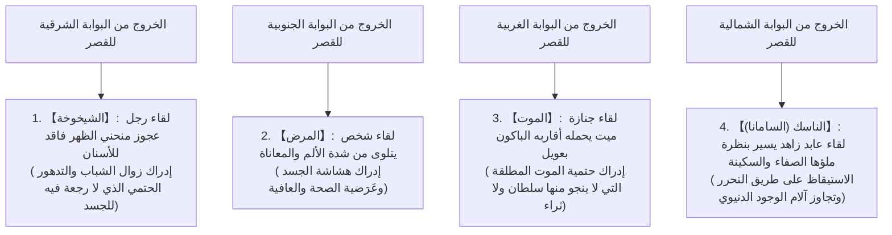

## مقدمة: ولادة المستنير (بوذا) وثورة في تاريخ الفكر الإنساني

في خضم الغليان الفكري الذي شهده الحوض الأوسط لنهر الغانج في الهند القديمة بين القرنين السادس والخامس قبل الميلاد (فيما يُعرف بـ "العصر المحوري / Axial Age")، انبثقت "البوذية (Buddhism)" على يد غوتاما سيدهارثا (Gautama Siddhārtha، وباللغة البالية: غوتاما سيدهاتا). ومثلت هذه الدعوة أكبر ثورة فكرية ووجودية في تاريخ الوعي الإنساني، إذ قلبت جذرياً الفلسفة الدينية للهند القديمة المستقرة منذ عصور الفيدا والأوبانيشاد.

إن لفظ "بوذا (Buddha)" ليس اسماً علماً لإله معين، بل هو اسم جنس مشتق من اللغتين السنسكريتية والبالية يعني "المستيقظ" أو "المستنير الذي أدرك الحقيقة المطلقة (المستنير / العارف)". وقد تجلى جوهر التعاليم التي أرساها سيدهارثا في النبذ القاطع للإيمان الأعمى بإله خالق مطلق للكون، والرفض التام للقرابين الحيوانية والطقوس السحرية التي كانت تحتكرها طبقة الكهنة (البراهمة)؛ وبدلاً من ذلك، واجهت البوذية بصرامة واقعية هادئة "المعاناة البنيوية المتأصلة في صلب الوجود الإنساني (دوكا / Dukkha)"، مفككة أسبابها وفق منهجية علّية سببية صارمة، ومقدمة "معرفة عملية تشريعية (إبستيمي / Episteme)" تقود عبر الملاحظة الذاتية والممارسة الصارمة نحو التحرر والانعتاق النهائي (الموكشا / النيرفانا / نيبانا).

إن البوذية تتجاوز بمراحل الأطر الضيقة لمفهوم "الدين" بالمعنى الحديث. فقد كانت علماً إدراكياً فائق الدقة، وعلاجاً نفسياً بنيوياً، ونقداً لغوياً راديكالياً، وفينومينولوجيا وجودية وأنطولوجية شاملة. وفي هذه الدراسة الأكاديمية الاستقصائية، سنستجلي معالم هذا البناء الفكري بكل صرامة معرفية وعمق تحليلي، مقتفين سيرة غوتاما سيدهارثا وتحولاته الفكرية، والبنية المنطقية والرياضية لتعاليم الحقائق النبيلة الأربع والدرب الثماني والروابط الاثنتي عشرة للنشوء المشروط، والتشريح الأنطولوجي للركام الخمسة ونفي الذات الجوهرية (الأناتا)، فضلاً عن القراءة الفيلولوجية الدقيقة للنصوص البالية المبكرة، والتحولات الكبرى نحو الأبهيدارما والماهايانا، وصولاً إلى التقاطعات العميقة مع الفينومينولوجيا المعاصرة وعلم الأعصاب الإدراكي وحركة اليقظة الذهنية الحديثة.

```
【التحول النموذجي (البارادايم) للبوذية في تاريخ الفكر الهندي القديم】

┌─────────────────┬───────────────────────────────┬───────────────────────────────┐
│ وجه المقارنة    │ البراهمانية الأرثوذكسية والأوبانيشاد│ البوذية المبكرة (غوتاما بوذا)  │
├─────────────────┼───────────────────────────────┼───────────────────────────────┤
│ الحقيقة المطلقة │ براهمن (المبدأ الكوني الأسمى) │ الدارما (نواميس النشوء المشروط)│
│ مفهوم الذات     │ الأتمان (الذات الخالدة الأبدية)│ الأناتا (نفي الذات الجوهرية)   │
│ طريق الخلاص     │ استبصار وحدة البراهمن والطقوس │ الحقائق الأربع والدرب الثماني │
│ الرؤية الاجتماعية│ تكريس النظام الطبقي (فارنا)   │ نفي التمييز الطبقي والمساواة  │
│ منهج المعرفة    │ الإيمان المطلق بسلطة الفيدا    │ التحقق والبرهان الذاتي الداخلي│
└─────────────────┴───────────────────────────────┴───────────────────────────────┘
```

---

## 1. حياة غوتاما سيدهارثا وتحولاته الفكرية

### 1.1 ولادته كأمير لعشيرة شاكيا وصدمة الخروج من البوابات الأربع
ولد غوتاما سيدهارثا عند سفوح جبال الهيمالايا، في لومبيني الواقعة حالياً في جنوب نيبال، بصفته الابن البكر للملك سودودانا (Śuddhodana) والملكة مايا (Māyā)، اللذين كانا يحكمان كابيلافاستو (Kapilavastu)، وهي دويلة-مدينة تابعة لاتحاد قبائل شاكيا.

وتفيد الروايات الأسطورية التقليدية أن سيدهارثا خطا عقب ولادته مباشرة سبع خطوات في الاتجاهات الأربعة معلناً: "أنا الأسمى في السموات والأرض"؛ غير أن القراءة التاريخية والفيلولوجية النقدية توضح أنه نشأ ابناً لعائلة أرستقراطية حاكمة تنتمي لطبقة المحاربين والنبلاء (الكشاتريا) في نظام حكم قبلي تشاركي (غانا-سانغا) بشرق الهند، حيث رفل في أسباب النعيم والرفاهية المطلقة دون أي حرمان. وإذ تملكت والده الملك مخاوف عارمة من أن يزهد ابنه في الملك ويختار طريق الرهبنة والتنسك، عمد إلى إحاطته بشتى صنوف الترف، فبنى له ثلاثة قصور باذخة تتلاءم مع فصول السنة الثلاثة (الصيف، وموسم الأمطار، والشتاء)، وملأها بالحسان والمغنيات والموسيقى، ساعياً بكل حيلة إلى عزل نظره تماماً عن الحقائق الإنسانية الكالحة من هرم ومرض وموت.

بيد أن بصيرة سيدهارثا الوقادة وحساسيته الفائقة سرعان ما مزقتا حجب هذا الفردوس المصطنع وكشفتا زيفه. ويتجسد هذا التحول في الرواية الشهيرة المعروفة في التراث البوذي بـ "الخروج من البوابات الأربع (المشاهد الأربعة)".



لا تمثل قصة الخروج من البوابات الأربع مجرد حكاية رمزية، بل تقدم نموذجاً كلياً لما يُعرف بـ **"الأزمة الوجودية (Existential Crisis)"**. فمهما بلغ الإنسان من ثراء وسلطة وموفور صحة، فإنه لا يملك الفكاك لحظة واحدة من المحددات الوجودية الثلاثة الحاسمة: "الهرم"، و"السقم"، و"الردى". وإذ عاين سيدهارثا مشهد شيخوخة الآخرين واعتلالهم وفنائهم، أدرك في أعماقه: "ليست هذه وقائع تخص غرباء في مستقبل بعيد، بل هي قدري الوجودي الحتمي القائم ها هنا والآن في صلب جسدي". وكان هذا اليأس الوجودي الصاعق والوعي الحاد هو الوقود الذي دفعه في سن التاسعة والعشرين إلى "الخروج العظيم (الفرار من القصر)" طلباً للحقيقة المطلقة.

### 1.2 الرهبنة، التتلمذ، والنسك المتطرف ومآلاته
تخلى سيدهارثا عن زوجته ياشودهارا (Yaśodharā) وابنه الرضيع راهولا (Rāhula)، وعن كافة أبهة العرش والتاج المرتقب، وحلق رأسه وارتدى أسمالاً خشنة ليصير "سامانا (Śramaṇa / باحثاً جوالاً عن الحقيقة وحرية الفكر)".

وتتلمذ أولاً على يد اثنين من كبار أساتذة التأمل المشهورين في عصره:
1. **آلارا كالاما (Āḷāra Kālāma)**: علّمه بلوغ "مقام العدم (ākiñcaññāyatana / وهي حالة ذهنية عالية من التركيز الصافي تنعدم فيها الأشياء)". وأتقن سيدهارثا هذه المرتبة في زمن قياسي، غير أنه فطن إلى أن آلام الوجود وأوهامه تعود لمباغتة النفس بمجرد الاستيقاظ من غيبوبة التأمل، فغادر أستاذه موقناً أن هذا ليس التحرر النهائي.
2. **أوداكا رامابوتا (Uddaka Rāmaputta)**: أرشده إلى "مقام لا-إدراك ولا-لاإدراك (nevasaññānāsaññāyatana / أقصى حالات التركيز التأملي حيث يتماهى الوعي بين الإثبات والنفي)". وسرعان ما بلغ سيدهارثا مقام أستاذه، لكنه استنتج مجدداً أن هذه الرياضات الذهنية لا تجتث جذور المعاناة ولا تطفئ لهيبها.

وإذ تبينت له محدودية التأملات المجردة، ألقى سيدهارثا بنفسه في غمار "النسك الجسدي المتطرف (التامباس / Tapas)" مستهدفاً استئصال الرغبات عبر قهر البدن. واستقر في غابات أوروفيلا (Uruvelā) بمملكة ماغادها رفقة خمسة من رفاق الدرب الرهباني (كوندانيا والرهبان الأربعة الآخرين)، ومارس على مدار ست سنوات رياضات شاقة تضمنت حبس الأنفاس حتى مشارف الاختناق، والتعرض للشمس الحارقة، وصياماً امتناعياً صارماً اقتصر فيه على حبة سمسم أو حبة أرز واحدة يومياً.

وانتهى به هذا التنكيل الجسدي إلى أن غدا جسده هيكلاً عظمياً كسته جلدة جافة؛ وبرزت عظام صدره كأضلاع سقيفة متهالكة، وتجعدت فروة رأسه كقرع يابس تحت وطأة القيظ، وبات يخر صريعاً كلما حاول الوقوف. ومع ذلك، ورغم وقوفه على شفا الهلاك، لم يظفر بالسكينة القلبية التامة ولا ببصيرة الاستنارة التي ينشدها. وهنا لاحت لسيدهارثا إحدى أهم الإشراقات المعرفية الحاسمة في تاريخ الفكر البشري:

> **"إن التنكيل بالجسد لا يفعل شيئاً سوى تدمير القوى البدنية واستنزاف الطاقات الذهنية، ولا يمكنه بحال أن يورث الحكمة الحقيقية أو يقود إلى الاستنارة. وكما أن الغرق في الشهوات (المذهب النفعي الحسي) ضلال، فإن إيلام النفس وتجويعها (مذهب النسك المتطرف) ضلال مماثل."**

وقرر سيدهارثا نبذ النسك الجسدي بالكامل. فاغتسل في مياه نهر نيرانجانا (Nerañjarā) من أدران ست سنوات من الغبار والإنهاك، وحين خارت قواه على الضفة، قبل من الفتاة القروية سوجاتا (Sujātā) زبدية من أرز مطبوخ بالحليب الطازج (باياسا / pāyāsa). وسرت الطاقة في أوصاله، واستعاد جسده عافيته بصورة مذهلة. غير أن رفاقه الخمسة احتقروه حين رأوا ذلك، وظنوا أن "غوتاما قد استسلم لضعفه وسقط في الترف والتهاون"، فنفضوا أيديهم منه وهجروه.

```
【تجاوز الطرفين واكتشاف الطريق الوسط (مادجهيما باتيبادا)】

الانغماس في اللذات (الشهوات الدنيوية)  ←─────［الطريق الوسط］─────→  تعذيب الجسد (النسك المتطرف)
(الحياة الملكية في القصور)                  (الحكمة الحقة والسكينة)           (غابات أوروفيلا)
* إذا اشتد وتر القيثارة انقطع، وإذا ارتخى لم يُصدر نغماً؛ والضبط المتوازن وحده يصنع اللحن البديع.
```

### 1.3 الاستنارة تحت شجرة بودي: مواجهة مارا وولادة "المستنير (بوذا)"
بعد استرداد عافيته البدنية، قصد سيدهارثا شجرة أشفاتها (aśvattha - التي عُرفت لاحقاً بـ "شجرة بودي / شجرة الاستنارة") في بودغايا، وفرش تحتها حشية من العشب، وجلس في جلسة اللوتس الكاملة (بادماسانا)، عاقداً عزماً قاطعاً لا يتزعزع:
**"حتى لو جف دمي، وتفتت لحمي وعظامي، فلن أبرح هذا المقعد حتى أبلغ الاستنارة التامة."**

وتخبرنا السيرة البوذية أن كافة أشكال الشهوات، والمخاوف، والشكوك، والتعلقات النفسية المحتدمة في بواطن سيدهارثا تجسدت آنذاك في هيئة شخصية رمزية هي "مارا (Māra / سيد الوهم والظلمات والرغبات المردية)".
وعمد مارا أولاً إلى إغواء سيدهارثا عبر بناته الفاتنات الثلاث (تانها: الشهوة، وأراتي: السأم، وراغا: الرغبة المحمومة). فلما رآه ثابتاً كالطود لا يتزعزع، سلط عليه أعتى عواصف الريح، وسيول المطر، وقذائف النار، وجيوش الشياطين المرعبة في محاولة لسحق رباطة جأشه بالرعب. وفي الختام، صرخ مارا متسائلاً: "بأي حق وبأي استحقاق تجلس في مقعد الاستنارة هذا؟ وما برهانك؟". فمد سيدهارثا يده اليمنى بهدوء ولمس الأرض بطرف أصابعه (في الهيئة الشهيرة المعروفة بـ "إشارة لمس الأرض / بوميسيارشا مودرا"). وإذا بالأرض ترتج وتدوي بصوت هادر معلنة: "أنا شاهدة على فضائله التي لا تحصى وتضحياته اللامتناهية عبر حيواته السابقة". وتبددت جحافل مارا أدراج الرياح، وانمحت كافة الشوائب الذهنية (الكليشات / kleshas) من أعماق قلبه.

وفي الهزيع الأول من الليل (من 6 إلى 10 مساءً)، نال سيدهارثا "معرفة استرجاع الحيوات السابقة (بوبهي نيفاسانوساتي نانا / pubbenivāsānussati-ñāṇa)".
وفي الهزيع الثاني من الليل (من 10 مساءً إلى 2 صباحاً)، نال "العين الإلهية الكونية (ديبا تشاكهو نانا / dibbacakkhu-ñāṇa)"، مستبصراً نواميس الكارما الكونية وموت الكائنات وتناسخها بحسب أعمالها.
وفي الهزيع الأخير من الليل (من 2 إلى 6 صباحاً)، مع إشراقة نجمة الصباح في كبد السماء الشرقية، تفككت أمامه شفرة "الروابط الاثنتي عشرة للنشوء المشروط (باتيتشا-ساموبادا)" في مساريها الطردي والعكسي، محققاً "معرفة اجتثاث الشوائب والرواسب العقلية (آسافاكخايا نانا / āsavakkhaya-ñāṇa)".

وهناك، أدرك سيدهارثا الاستنارة المطلقة التي لا تضاهى (أنوتارا-سامياك-سامبودي / Anuttara-samyak-sambodhi)، متجاوزاً حدود الإنسان العادي ليغدو **"بوذا (شاكياموني / الحكيم المستنير من عشيرة شاكيا)"**، وكان عمره آنذاك خمسة وثلاثين عاماً.

### 1.4 رجاء براهما وإدارة عجلة الدارما الأولى: من الصمت إلى آفاق الديانة العالمية
عقب الاستنارة، غرق بوذا في تأمل غائر، وتردد ملياً في مشاركة الحقيقة (الدارما) التي أدركها مع سائر البشر: "إن هذه الحقيقة عميقة جداً، ودقيقة ولطيفة، ومستعصية على التفكير المنطقي الساذج، ولا يدرك كنهها إلا الحكماء. فإذا بسطتها للبشر الغارقين في لُجج الأهواء والتعلق الأعمى، فلن أورثهم إلا الحيرة والاضطراب، ولن أنال إلا النصب والإعياء". وعزم بوذا على أن يقضي ما تبقى من حياته في صمت ساكن حتى يدخل النيرفانا.

وتذكر المتون البوذية أن الإله براهما (براهما ساهامباتي / Brahmā Sahampati)، أرفع آلهة الميثولوجيا الهندية، هبط من عليائه وجثا على ركبتيه أمام بوذا ضاماً كفيه تضرعاً، والتمس منه ثلاث مرات أن يكسر صمته، وهو الحدث التاريخي المعروف بـ **"رجاء براهما (براهما-ياتشانا)"**:
"يا صاحب السعادة والقداسة، أرجوك أن تعلن الدارما! ففي هذا العالم كائنات لم تعلق بأعينها سوى ذرات يسيرة من غبار الشهوات، وتلك نفوس نقية سيكتنفها الهلاك إن حُرمت سماع الحق، لكنها إن استمعت إلى الدارما ستبلغ الاستنارة يقيناً".

وتأمل بوذا العالم بعين البصيرة والشفقة. ورأى البشر أشبه بزهور اللوتس في مستنقع موحل؛ فمنها ما يزال غارقاً في طين الماء العكر، ومنها ما ارتفع حتى حافات السطح، ومنها ما انبثق متسامياً فوق الماء الآسن متفتحاً بنقاء تام. وأدرك بوذا التفاوت في الاستعداد الفطري للحكمة بين البشر، فقرر كسر صمته وإطلاق نداء التحرير:

> **"فُتحت أبواب الخلود! فليصغِ إليها كل من يملك أذناً واعية، وليلقِ عن كاهله رداء الشك."**

وانطلق بوذا قاطعاً مئات الكيلومترات مشياً على الأقدام نحو حديقة الغزلان في سارناث (بالقرب من فاراناسي)، باحثاً عن رفاقه الخمسة الذين هجروه. وحين أبصره الرفاق مقبلاً من بعيد بهيبته ووقاره، تعاهدوا في البداية على تجاهله وعدم القيام له؛ بيد أن جلال حضوره ونوره الوضاء سحقا كبرياءهم، فهبوا لا شعورياً لاستقباله، وغسلوا قدميه وأعدوا له مقعداً وجلسوا منصتين.

وهناك، ألقى بوذا أول خطبة له في تاريخ الإنسانية، وهو الحدث المعروف بـ **"إدارة عجلة الدارما الأولى (تحريك عجلة الشريعة / Dhammacakkappavattana Sutta)"**. وعرض في هذا المجلس تعاليم "الطريق الوسط"، و"الحقائق النبيلة الأربع"، و"الدرب النبيل الثماني". وفي أثناء الخطاب، انقدحت شرارة البصيرة في قلب الراهب الشيخ كوندانيا، مستبصراً الحقيقة القائلة: "كل ما له طبيعة النشوء، له بالضرورة طبيعة الزوال والاندثار"، ففُتحت عيناه على الحقيقة (عين الدارما). ومع هذه اللحظة، تأسست الأركان الثلاثة للبوذية على وجه الأرض: **"الجواهر الثلاث (تيراتانا / بوذا: المعلم، والدارما: التعليم، والسانغا: الجماعة الرهبانية)"**.

---

## 2. جوهر العقيدة البوذية: البنية المنطقية للحقائق النبيلة الأربع

لم تكن تعاليم بوذا دوجما غيبية أو إيماناً عقائدياً أعمى، بل كانت **"طباً إكلينيكياً وجودياً"** يُطبق بعبقرية صارمة النموذج المنهجي للطب الهندي القديم (الأيورفيدا) المرتكز على: "التشخيص، والسبب، وحالة الشفاء، ووصفة الدواء"، ونقلها بالكامل إلى مدارات النفس والوعي. ويمثل هذا الإطار التأسيسي ما يُعرف بـ "الحقائق النبيلة الأربع (كاتاري أرياساتشاني / Cattāri Ariyasaccāni)".

```
【التناظر البنيوي بين نموذج العلاج الطبي والحقائق النبيلة الأربع】

┌─────────────────┬───────────────────────────────┬───────────────────────────────┐
│ نموذج التشخيص   │ الحقائق النبيلة الأربع        │ المضمون والدلالة الوجودية     │
├─────────────────┼───────────────────────────────┼───────────────────────────────┤
│ 1. تشخيص المرض  │ حقيقة المعاناة (دوكا-ساتشا)   │ حقيقة الوجود الجوهرية هي المعاناة│
│ 2. تحديد السبب  │ حقيقة أصل المعاناة (سامودايا) │ جذر المعاناة هو "العطش (تانها)" │
│ 3. إقرار الشفاء │ حقيقة زوال المعاناة (نيرودا)  │ فناء العطش = النيرفانا (نيبانا)│
│ 4. وصفة العلاج  │ حقيقة الدرب (ماغا-ساتشا)      │ الممارسة المؤدية للنيرفانا = الدرب الثماني│
└─────────────────┴───────────────────────────────┴───────────────────────────────┘
```

### 2.1 حقيقة المعاناة (دوكا-ساتشا): "اللا-رضى" البنيوي للوجود
حين تقرر البوذية مبدأ "كل الأشياء المشروطة معاناة (سابهي سانكارا دوكا / Sabbe saṅkhārā dukkhā)"، فإن كلمة "دوكا (Dukkha)" لا تقتصر بحال على مجرد الألم العضوي أو الحزن النفسي العابر.
ففي أصلها الاشتقاقي باللغة البالية، تعود كلمة *dukkha* إلى تجويف محور العجلة (kha) حين يكون معوجاً أو غير مستوٍ (du)، مما يجعل العجلة تصدر صريراً متشنجاً وتعجز عن الدوران بسلاسة. ومن ثم، فإن جوهر الدوكا يكمن في **"عجز الأمور عن مسايرة هوانا ورغباتنا، والافتقار البنيوي الجذري إلى الرضى والانسجام"**.

وقد صاغت البوذية المبكرة المعاناة الإنسانية في منظومة محكمة تُعرف بـ "المعاناة الأربع والثماني (الآلام الثمانية)":

1. **معاناة الولادة (جاتي)**: كرب الانبثاق في الوجود واستمرار الحياة بحد ذاتها.
2. **معاناة الشيخوخة (جارا)**: اضمحلال قوى الجسد وتراجع المدارك العقلية.
3. **معاناة المرض (بيادي)**: عذابات الاعتلال والأسقام البدنية والنفسية.
4. **معاناة الموت (مارانا)**: رعب فناء الكينونة ومواجهة العدم والفقد المطلق.
5. **معاناة مفارقة المحبوب (بيافيبايوغا)**: كرب الانفصال الإجباري عمن نحب وما نهوى.
6. **معاناة مصاحبة المكروه (أبيا سامبايوغا)**: عناء الالتقاء والتعايش القسري مع ما نبغض ونكره.
7. **معاناة عدم نيل المبتغى (يامبيتشام نا لابهاتي)**: الإحباط الوجودي الناجم عن عجز الإنسان عن بلوغ ما يتوق إليه.
8. **معاناة الركام الخمسة للتشبث (بانشوباداناكاندا)**: المعاناة الشاملة المنبثقة من التشبث بالمركبات الخمسة المكونة للذات (الركام الخمسة).

### 2.2 حقيقة أصل المعاناة (سامودايا-ساتشا): ديناميكية نشوء المعاناة و"العطش (تانها)"
إذا كانت المعاناة واقعاً حياً، فلا بد لها من سبب علّي يُنشئها. وتكشف حقيقة أصل المعاناة (سامودايا) أن جذر كل عذاب يكمن في **"العطش أو الرغبة الشديدة (تانها / Taṇhā)"**.
والتانها في معناها الحرفي تمثل الهياج الأعمى والاندفاع المحموم الذي يُشبه لُهاث التائه في صحراء قاحلة وهو يستجدي قطرة ماء، متمسكاً بالموضوعات بتشبث مرضي يرفض الإفلات.

وقد صنف بوذا هذا التوق الجارف إلى ثلاثة أضرب:
- **عطش الحواس (كاما-تانها)**: التوق الشره للذات الحسية المشبعة عبر منافذ الحواس (البصر، السمع، التذوق، وغيرها).
- **عطش الصيرورة والوجود (بهافا-تانها)**: التوق الأناني المحموم لخلود الذات واستمرارها وبقائها إلى الأبد، وتوسيع رقعة الثروة والجاه والسلطة.
- **عطش الفناء واللاوجود (فيبهافا-تانها)**: الرغبة العدمية التدميرية في محو الذات أو إفناء الآخرين فراراً من وطأة المعاناة والحياة (النزوع نحو الانتحار والعدم).

وتكمن خطورة التانها في "بنيتها الإدمانية الدائرية" التي لا ترتوي أبداً. فهي تشبه من يتجرع ماء البحر الأجاج ليروي ظمأه؛ فكلما ازداد شرباً، تفاقم عطشه واستعر جحيمه، مقيداً الإنسان في دولاب لا ينتهي من التناسخ والمعاناة.

### 2.3 حقيقة انطفاء المعاناة (نيرودا-ساتشا): الزوال التام للمعاناة و"النيرفانا"
وكما يبرأ المريض بمجرد استئصال جرثومة المرض، فإن هناك حالة ينطفئ فيها بالكلية سبب المعاناة وهو العطش. وتلك هي حقيقة الزوال (نيرودا)، التي تمثل الغاية القصوى للبوذية: **"النيرفانا (نيبانا / Nibbāna، وبالسنسكريتية: نيرفانا / Nirvāṇa)"**.

والأصل اللغوي لكلمة نيبانا هو "الانطفاء بالنَّفخ (Nir + vā)". وتدل على خمود نيران السموم الثلاثة المهلكة: الجشع (روبا)، والكراهية (دوسا)، والجهل والضلال (موها)؛ واستحالتها إلى حالة روحية وارفة الظلال، تفيض بالبرودة والسكينة والطمأنينة المطلقة. وليست النيرفانا جنة علوية يُرتحل إليها بعد الممات، بل هي **"مقام التحرر والانعتاق التام من أسر الأهواء والقيود، المتحقق عيناً ها هنا والآن في هذه الحياة الدنيا"**.

### 2.4 حقيقة الدرب (ماغا-ساتشا): الوصفة العملية لبلوغ النيرفانا عبر "الدرب النبيل الثماني"
يمثل المسار العملي المؤدي إلى استئصال المعاناة وبلوغ النيرفانا "حقيقة الدرب (ماغا)"، وهي مجسدة في **"الدرب النبيل الثماني (أريو أتاهانغيكو ماغو / Ariyo aṭṭhaṅgiko maggo)"**. ويتألف هذا الدرب من ثمانية أركان مترابطة، تنتظم تقليدياً تحت مظلة "التدريبات الثلاثة (تي-سيكا)": الأخلاق (سيلا)، والتركيز الذهني (سامادهي)، والحكمة (بانيا).

```
【بنية الدرب النبيل الثماني ومطابقته للتدريبات الثلاثة (الأخلاق، التركيز، الحكمة)】

┌───────────────┬───────────────────────────────┬───────────────────────────────┐
│ التدريبات الثلاثة│ عناصر الدرب النبيل الثماني   │ التعريف الوظيفي والعملي       │
├───────────────┼───────────────────────────────┼───────────────────────────────┤
│ الحكمة (بانيا)│ 1. الرؤية الصائبة (Sammā-diṭṭhi)│ الرؤية الحقة للحقائق والنشوء المشروط│
│               │ 2. التفكير الصائب (Sammā-saṅkappa)│ التفكير الخالي من الجشع والضغينة│
├───────────────┼───────────────────────────────┼───────────────────────────────┤
│ الأخلاق (سيلا)│ 3. الكلام الصائب (Sammā-vācā) │ اجتناب الكذب والغيبة وفضول الكلام│
│               │ 4. العمل الصائب (Sammā-kammanta)│ الكف عن القتل والسرقة والفواحش│
│               │ 5. المعاش الصائب (Sammā-ājīva)│ كسب العيش دون تجارة السموم والأسلحة│
├───────────────┼───────────────────────────────┼───────────────────────────────┤
│ التركيز (سامادهي)│ 6. الجهد الصائب (Sammā-vāyāma)│ السعي المتواصل لكبح الشر وتنمية الخير│
│               │ 7. اليقظة الصائبة (Sammā-sati) │ المراقبة الموضوعية لظواهر الجسد والعقل│
│               │ 8. التركيز الصائب (Sammā-samādhi)│ توحيد الذهن في سكون التأمل العميق (جهانا)│
└───────────────┴───────────────────────────────┴───────────────────────────────┘
```

ولا تؤدى خطوات الدرب النبيل الثماني بصورة متسلسلة تعاقبية، بل تعمل كنظام عضوي متكامل شبيه بأسلاك العجلة الواحدة التي تتضافر معاً في حركتها. فالرؤية الصائبة تهب إدراكاً حقيقياً للعالم، والأخلاق (الكلام، والعمل، والمعاش الصائب) تطهر مسلك الإنسان وسلوكه، والتركيز (الجهد، واليقظة، والتركيز الصائب) يصفّي العقل ويرهف الوعي، مما يعود بدوره لتعميق الرؤية الصائبة، حتى تتكامل الدورة متوجة بالتحرر النهائي.

---

## 3. أعماق الأنطولوجيا البوذية: الروابط الاثنتا عشرة للنشوء المشروط والركام الخمسة

### 3.1 نظرية النشوء المشروط (باتيتشا-ساموبادا): ذروة الاكتشافات الفكرية لبوذا
تعد نظرية **"النشوء المشروط (باتيتشا-ساموبادا / Paṭicca-samuppāda)"** أعمق الأطروحات الفلسفية لبوذا وأكثرها فرادة، وهي المبدأ الجذري الذي يفصل البوذية عن سائر الأنساق الفلسفية والدينية في العالم.
والنشوء المشروط يعني حرفياً "النشوء القائم على أسباب وشروط متبادلة (Dependent Origination / الاعتماد المتبادل)".

وقد صاغ بوذا هذا القانون الكوني في النصوص البالية بصيغة رياضية مذهلة بالغة الإيجاز:

> **"بوجود هذا، يوجد ذاك. وبنشوء هذا، ينشأ ذاك.**
> **وبانعدام هذا، ينعدم ذاك. وبزوال هذا، يزول ذاك."**
> (من كتاب *سانيوتا نيكايا*)

فليس في العالم بأسره أي ظاهرة (مادية، أو عقلية، أو حيوية، أو اجتماعية) تملك وجوداً ذاتياً مستقلاً أو جوهراً قائماً بذاته (جوهر مطلق). إنما كل ما هنالك شبكة لامتناهية من الأسباب (الهيتو) والشروط (باتايا) المتشابكة تشابك خيوط شبكة إندرا الأسطورية، تتبدى فيها الظواهر عَرَضياً ومؤقتاً. فلا وجود لخالق أزلي مطلق، ولا لإله سرمدي، ولا لعلة أولى ثابتة. فإذا تكاملت الشروط نشأ الشيء، وإذا تفككت انعدم واندثر؛ وهذا هو الناموس الكوني الشامل الذي يحكم الوجود بأسره (الدارما).

### 3.2 البنية السلسلية للروابط الاثنتي عشرة للنشوء المشروط
في ليلة الاستنارة، فكك بوذا ميكانيزم السببية الذي يقيد الإنسان بأغلال الهرم والموت، ويدفعه في دوامة التناسخ، كاشفاً إياه في سلسلة مؤلفة من اثنتي عشرة حلقة (الروابط الاثنتا عشرة للنشوء المشروط):

```mermaid
graph LR
    A["1. الجهل<br/>(Avijjā)"] --> B["2. التشكيلات الإرادية<br/>(Saṅkhāra)"]
    B --> C["3. الوعي<br/>(Viññāṇa)"]
    C --> D["4. الاسم والشكل<br/>(Nāmarūpa)"]
    D --> E["5. مجالات الحواس الست<br/>(Saḷāyatana)"]
    E --> F["6. الاتصال الحسي<br/>(Phassa)"]
    F --> G["7. الشعور<br/>(Vedanā)"]
    G --> H["8. العطش / الرغبة<br/>(Taṇhā)"]
    H --> I["9. التشبث<br/>(Upādāna)"]
    I --> J["10. الصيرورة<br/>(Bhava)"]
    J --> K["11. الولادة<br/>(Jāti)"]
    K --> L["12. الشيخوخة والموت<br/>(Jarāmaraṇa)"]
```



```
【الروابط الاثنتا عشرة للنشوء المشروط وتجلياتها السيكولوجية في الوجود الإنساني】

1. الجهل (أفيجا / Avijjā): الجهل الجذري؛ عدم إدراك الحقائق النبيلة الأربع والنشوء المشروط والـ لا-ذات.
2. التشكيلات الإرادية (سانكارا / Saṅkhāra): النشاط الإرادي المنبثق عن الجهل، وطاقات التكوين الكارمي الكامنة.
3. الوعي (فينيانا / Viññāṇa): وظيفة التمييز وإدراك الموضوعات، وتيار الوعي الرابط بين أطوار الحياة (وعي إعادة الولادة).
4. الاسم والشكل (ناماروبا / Nāmarūpa): اقتران الوظائف العقلية (الاسم) بالجسد المادي (الشكل)، أي نشوء الكيان الجنيني.
5. مجالات الحواس الست (سالاياتانا / Saḷāyatana): الحواس الخمس الجسدية (العين، الأذن، الأنف، اللسان، اللمس) وحاسة العقل/الذهن.
6. الاتصال الحسي (فاسا / Phassa): التماس بين عضو الحاسة، والموضوع الخارجي، والوعي الحسي المقابل.
7. الشعور / الإحساس (فيدانا / Vedanā): الأثر الانفعالي الحسي الناجم عن الاتصال (سار، مؤلم، أو محايد).
8. العطش / التوق (تانها / Taṇhā): الاندفاع الجامح لطلب اللذة والنفور من الألم؛ الرغبة العارمة.
9. التشبث / التمسك (أوبادانا / Upādāna): التعلق المتكلس بالموضوعات ومحاولة الاستحواذ عليها بناءً على العطش.
10. الصيرورة / الوجود (بهافا / Bhava): نسق الوجود المشروط المتولد عن التشبث وتراكم الطاقات الكارمية الفاعلة.
11. الولادة (جاتي / Jāti): الانبثاق في حياة جديدة، والتجسد العيني ككائن حي.
12. الشيخوخة والموت (جارامارانا / Jarāmaraṇa): التدهور الحتمي المترتب على الولادة، وما يرافقه من حزن وألم وحسرة وموت.
```

وتكمن البراعة المذهلة في هذه السلسلة في تشخيصها أن الجذر الأساسي لمآسي الهرم والموت هو **"الجهل (أفيجا)"**.
والأهم من ذلك، أن هذه السلسلة السببية قابلة لـ "العكس التام".
فبإشراق الحكمة يزول الجهل، وبزوال الجهل تزول التشكيلات الكارمية، وبزوال التشكيلات يزول الوعي المشروط... وهكذا دواليك حتى يزول التشبث، وتزول الولادة، وتتهاوى منظومة الهرم والموت والأسى بأسرها من جذورها (مسار الانطفاء والتحرر). فالخلاص في البوذية ليس معجزة خارقة أو منحة هابطة من السماء، بل هو ضرورة منطقية تنتج حتماً عن تحول راديكالي في الوعي والمعرفة (الحكمة).

### 3.3 الركام الخمسة (بانشا-كاندا): تفكيك الكينونة الإنسانية
ما حقيقة هذا الكيان الذي ندعوه "أنا"؟
رفض بوذا بحزم تصور الإنسان كـ "جوهر روحي بسيط وثابت (النفس / الروح)"، وقام بتفكيك الإنسان إلى حزمة مؤلفة من خمسة مركبات متغيرة أطلق عليها **"الركام الخمسة (بانشا-كاندا / Pañca-khandhā)"**:

1. **ركام المادة (روبا / Rūpa)**: الجسد الفيزيائي المادي، والحواس البدنية، والموضوعات المادية للعالم الخارجي.
2. **ركام الشعور (فيدانا / Vedanā)**: الانطباعات الحسية والانفعالات الفورية المتولدة عن ملامسة الحواس للعالم (سارة، غير سارة، أو محايدة).
3. **ركام الإدراك / التصور (سانيا / Saññā)**: القدرة الإدراكية على تمييز الأشياء وتسميتها ومطابقتها مع الصور الذهنية والمخزون التذكاري.
4. **ركام التكوينات العقلية (سانكارا / Saṅkhāra)**: الدوافع الإرادية، والنزعات العاطفية، والمشاعر، والرغبات، والقرارات الكارمية التي تحرك الذهن باتجاه معين.
5. **ركام الوعي (فينيانا / Viññāṇa)**: الوعي الخالص الذي يجمع شتات هذه العمليات ويميز موضوعات الإدراك ويدرك الوجود ككل.

وتوجه بوذا إلى تلاميذه بالسؤال: "أيها الرهبان، هل أي ركام من هذه الركام الخمسة دائم أم زائل؟" فأجابوا: "إنه زائل يا صاحب القداسة". فقال: "وما كان زائفاً زائلاً، أهو باعث على الرضى والراحة أم على المعاناة؟" قالوا: "على المعاناة يا صاحب القداسة". فقال: "وما كان زائلاً، معاناةً، وخاضعاً للتحول والفناء بطبيعته، أيصح أن يُقال عنه: هذا ملكي، وهذا أنا، وهذا يمثل ذاتي وجوهري؟" قالوا: "كلا يا صاحب القداسة".

إن الإنسان ليس سوى "عملية ديناميكية وسيلان دائم" تتفاعل فيه هذه العناصر الخمسة بسرعات هائلة. وكما أن أجزاء العربة كالعجلات والمحور والهيكل حين تتجمع معاً تُسمى مجازاً "عربة"، فكذلك لفظ "الإنسان" أو "الأنا" ليس إلا تسمية اصطلاحية نُطلقها على هذه الحزمة المتدفقة من الركام الخمسة دون وجود أي كيان جوهري خلفها.

---

## 4. فلسفة الـ لا-ذات (أناتا): تفكيك الذات الجوهرية والحرية الوجودية

### 4.1 الأناتا (نفي الذات) في مواجهة الأتمان (الذات الجوهرية) في الأوبانيشاد
يمثل مفهوم **"الأناتا (Anattā / بالسنسكريتية: أناتمان Anātman)"** أو الـ لا-ذات قمة الإبداع الفلسفي في البوذية المبكرة، وهو في الوقت نفسه المفهوم الذي ناله أوفر قسط من سوء الفهم والخلط.

فقد كانت الفلسفة السائدة في الهند آنذاك (فلسفة الأوبانيشاد) تؤكد أن: "الجسد والمشاعر قد يعتريهما الفناء، غير أن في الأعماق القصوى للإنسان تقبع ذات عليا خالدة أبدية لا تفنى هي (الأتمان / الذات الحقة)". وذهبت إلى أن قمة الخلاص تتجلى في إدراك تطابق هذه الذات الفردية مع المبدأ الكوني الأسمى (البراهمن)، وهو ما عُرف بمبدأ وحدة الوجود والذات (تات تفام آسي / Tat Tvam Asi).

وفي المقابل، أعلن بوذا صراحة مبدأ "كل الظواهر خالية من الذات (سابهي داما أناتا / Sabbe dhammā anattā)"، ناسفاً فرضية وجود الأتمان من جذورها.
وكان برهان بوذا منطقياً وصارماً للغاية:
إذا كان ثمة شيء يمثل "ذاتي الحقة" أو "ملكي الخاص"، لوجب أن يخضع لسيطرتي وإرادتي المطلقة. فهل يستطيع الإنسان أن يأمر جسده قائلاً: "أيها الجسد لا تمرض، ولا تهرم أبداً" فيستجيب له الجسد؟ وهل بمقدور الإنسان أن يتحكم بمشاعره وأفكاره اللحظية فلا تزيغ قيد أنملة عما يشتهي؟ قطعاً لا. والعلة في ذلك أن هذه كلها ظواهر تنشأ وتزول وفق أسباب وشروط لا سلطان لنا عليها. وما لا يخضع لإرادتنا لا يمكن بحال أن نسميه "أنا". ومن ثم، فأنّى فتشت في ثنايا الركام الخمسة، فلن تعثر قط على أي "جوهر ذاتي ثابت".

```
【التعارض الإبستيمولوجي بين نظرية جوهرية الأتمان ونظرية الأناتا في البوذية】

■ النزعة الجوهرية في الأوبانيشاد (الأتمان)
يقبع خلف تقلبات الجسد والمشاعر والأفكار "شاهدٌ روحي نقي، أبدي لا يفنى" يمثل الذات الحقة (الأتمان).
* يسعى إلى "خلاص الروح"، لكنه ينزلق في النهاية إلى فخ ترسيخ "التعلق بالأنا".

■ النزعة الظاهراتية والعلائقية في البوذية المبكرة (الأناتا)
لا يوجد سوى تيار سيلان سببي متدفق من العمليات الجسدية والانفعالية والفكرية،
ولا وجود لـ "شاهدٍ" قابع في الخلفية. ثمة "فعل رؤية" دون وجود "رائي".
* عبر تفكيك المفهوم المتصلب لـ "الأنا" من أساسه، يتم اجتثاث جذور كل تعلق واضطراب.
```

### 4.2 أختام القانون الثلاثة والأربعة: الحقائق الكونية الشاملة
تطرح البوذية ما يُعرف بـ "أختام القانون (دهارما-مودرا)" لتكون بمثابة العلامة الفارقة والختم الذي يثبت صحة الحقيقة والوجود:

1. **كل الأشياء المشروطة فانية وغير دائمة (أنيكا / Sabbe saṅkhārā aniccā)**:
   كل كينونة مركبة خاضعة للنشوء المشروط تتبدل دون توقف للحظة واحدة؛ فلا وجود لسكون مطلق أو ثبات أبدي في أرجاء الكون قاطبة.
2. **جميع الظواهر خالية من الذات (أناتا / Sabbe dhammā anattā)**:
   ليس فقط الظواهر المشروطة، بل حتى الظواهر غير المشروطة (وعلى رأسها النيرفانا) لا يوجد فيها أي جوهر ذاتي مستقل أو كيان ثابت يُدعى "الأنا".
3. **النيرفانا سكينة وسلام مطلق (نيبانا سانتا / Nibbānaṃ santaṃ)**:
   المقام الذي تنطفئ فيه نيران الرغبة والكراهية والجهل، وتستقر فيه البصيرة في حقيقة اللا-دوام واللا-ذات، هو مقام السكينة التامة والسلام الأبدي.
4. **كل الأشياء المشروطة معاناة وعدم رضى (دوكا / Sabbe saṅkhārā dukkhā)**:
   حين يتوهم الإنسان أن الزائل خالد، ويتشبث بما لا ذات فيه على أنه "ذاته"، فإن كل وجود مشروط ينقلب في وعيه إلى "معاناة" (وحين يُضاف هذا البند إلى الأختام الثلاثة تكتمل الأختام الأربعة).

وليست الأناتا بحال ضرباً من "العدمية (Nihilism)". فقد حذر بوذا بشدة من نزعة الفناء المحض (أوتشيدافادا / فكرة أن الإنسان يفنى بالكلية بعد الموت دون أي أثر كارمي)، واعتبرها انزلاقاً خطيراً لا يقل ضلالاً عن نزعة الخلود الأبدي (ساسفاتافادا / الإيمان بخلود النفس). إن نفي الذات في البوذية هو: "التحرر من قيود الوهم الجوهري، ورؤية الوقائع الوجودية كما هي في صلب اللحظة الراهنة، والتخلص من شراك التعلق المرضي بالذات".

---

## 5. القراءة الفيلولوجية للنصوص البوذية المبكرة وتأسيس السانغا

### 5.1 تاريخ تدوين النصوص البالية ومجامع التلاوة المشتركة (سانغيتي)
لم يترك بوذا وراءه سطراً واحداً مكتوباً؛ إذ جرت التقاليد في الهند القديمة على نقل العلوم المقدسة عبر "التلاوة الشفهية والحفظ الصدري" الصارم من المعلم إلى التلميذ، تعظيماً لقيمة النقل الشفهي الحي.

وعقب وفاة بوذا ودخوله النيرفانا الكاملة (المابارينيرفانا) في كوشينارا وهو في الثمانين من عمره، تداعى 500 راهب من كبار المستنيرين (الأرهانت) إلى راجغير (عاصمة ماغادها) برئاسة الشيخ الجليل ماهاكاسابا (Mahākassapa). وكان هذا الاجتماع التاريخي التأسيسي هو **"مجمع التلاوة الأول (سانغيتي / Sangīti)"**.

```
【إرساء التقليدين الكنسيين العظيمين في مجمع التلاوة الأول】

1. تدوين سلة الحوارات (سوتا بيتاكا / Sutta Piṭaka)
   - الراوي المتلو: أناندا (ابن عم بوذا وخادمه الشخصي طوال 25 عاماً، "الأول في حفظ وسماع التعاليم")
   - العبارة الافتتاحية النموذجية: "هكذا سمعت" (Evaṃ me sutaṃ)
   - المحتوى: مجموع الحوارات والخطب التي ألقاها بوذا مراعياً تفاوت مدارك الناس وطبائعهم في مختلف الأصقاع.

2. تدوين سلة الانضباط الرهباني (فينايا بيتاكا / Vinaya Piṭaka)
   - الراوي المتلو: أوبالي (الحلاق المتواضع الذي فاق الجميع في إتقان القواعد، "الأول في حفظ الشريعة")
   - المحتوى: القواعد الصارمة المفروضة على الرهبان والراهبات (بيكخو وبيكخوني)، وتنظيم حوكمة الجماعة والعقوبات.
```

وفيما بعد، وإثر انقسام الجماعة الرهبانية واندلاع الحروب والمجاعات التي هددت حياة الرهبان الحافظين للنصوص في سريلانكا خلال القرن الأول قبل الميلاد، خشي المجتمعون من ضياع هذا الإرث الشفهي العظيم، فقاموا لأول مرة بتدوين النصوص البالية على سعف النخيل (أوراق البالميرا)، لتتشكل **"سلال القانون البالي الثلاث (تيبيتاكا / Tipiṭaka: سلة الحوارات، وسلة الانضباط، وسلة الدراسات المتقدمة)"**.

### 5.2 أقدم الطبقات النصية: فكر "سوتا نيباتا" و"الدامابادا"
أثبتت الأبحاث الفيلولوجية الحديثة الرائدة في نصوص البوذية (أعمال هاجيمي ناكامورا، وإدوين أرنولد، وريس ديفيدز، وغيرهم) وجود طبقات نصية قديمة جداً تنتمي إلى اللغة البالية العتيقة (الفترة الآركية المبكرة)، وتتقدم تاريخياً على سائر نصوص التراث. وتتجلى هذه الطبقة بأجلى صورها في الفصول الأخيرة من كتاب *سوتا نيباتا* (وتحديداً فصلي "أتّهاكافاغا" و"بارايانافاغا")، وكتاب *الدامابادا (كلمات الدارما)*.

وفي هذه النصوص العتيقة، لا نجد بوذا كائناً أسطورياً تحيط به جيوش الآلهة والبوديساتفات وتماثيل الذهب الباذخة، بل يتبدى حكيماً واقعياً زاهداً، يرتدي رداءً مرقعاً، ويحمل وعاء التسول بيده، ويجوب البراري والقفار وحيداً كفيلسوف واقعي ينشد خلاص الإنسان.

> **"امشِ وحيداً كقرن الخرتيت"**
> (*سوتا نيباتا*، الفصل الأول، السورة الثالثة)
> فالعشرة تخلق التعلق والهوى، وعن الهوى تنبثق المعاناة؛ فدع عنك المراء العقيم والجدل الزائف، وسر في درب الطهر وحيداً متزناً كقرن الخرتيت الفرد.

> **"لا تنطفئ الأحقاد بالأحقاد قط في هذا العالم؛**
> **إنما بالمحبة والصفح تنطفئ. هذا ناموس أزلي خالد."**
> (*الدامابادا*، الآية 5)

وفي هذه الطبقات النصية الأقدم، ضرب بوذا صفحاً عن التجريدات الميتافيزيقية العقيمة (مثل: "هل العالم أزلي أم حادث؟"، "وهل الروح والجسد واحد أم متمايزان؟"، "وهل يوجد بوذا بعد الموت أم لا؟")، واعتبرها جدلاً لا طائل تحته (بابانشا / Papñca). وكما بين في ضرب المثل الشهير بـ **"أمثولة السهم المسموم"**، فإن من رُمي بسهم مسموم ليس من شأنه أن يقعد متسائلاً عن نسب الرامي، ونوع القوس، والريش المثبت في نصله، بل واجبه الحتمي العاجل هو نزع السهم المسموم وتطهير الجرح من السم القاتل. ولقد تمحور اهتمام بوذا كلياً حول سؤال واحد: "كيف ننقذ الإنسان المتألم في واقع الحياة المعاش؟".

### 5.3 هندسة الحوكمة في السانغا المبكرة: الباتيموكا والديمقراطية الذاتية القائمة على الإجماع
لم تكن جماعة "السانغا (Saṅgha)" التي أسسها بوذا مجرد تجمع لرهبان متعبدين، بل مثلت **"أبكر نموذج تاريخي للديمقراطية المباشرة والجماعات التعاونية ذات الحوكمة الذاتية الكاملة"**.

ففي مجتمع هندي قديم سادته التفرقة الطبقية الصارمة والاستبداد الملكي المطلق لدول كبرى مثل ماغادها وكوسالا، انبثقت السانغا كواحة مدهشة للمساواة الجذرية. فبمجرد الدخول في السانغا، تتلاشى كافة الامتيازات والفوارق؛ فيتساوى النبيل الكشاتري، مع الكاهن البراهمي، والتاجر الفايشي، والخادم الشودري، بل وحتى المنبوذون (الشاندالا). ويتحول التمايز الوحيد بين الأعضاء إلى "أسبقية الرسامة الرهبانية". وتتجلى هذه الثورة الأخلاقية في تقدم الحلاق الفقير أوبالي في الرسامة على أمراء شاكيا العظام (مثل أنورودا وأناندا)، حتى جثا الأمراء النبلاء عند قدمي الحلاق إجلالاً وتوقيراً، في مشهد جسد المساواة الجذرية للسانغا بأبهى صورة.

```
【نظام الحوكمة الذاتية والفقه الشوري في السانغا المبكرة】

1. الكارما الرهبانية (كاما / Kamma): مبدأ الإجماع المطلق في القرارات العليا
   - القضايا المصيرية (قبول رهبان جدد، محاكمة مخالفات الانضباط، توزيع الممتلكات) تُبت في مجامع كاملة بإجماع الرهبان.
   - بعد طرح الاقتراح، يسأل الرئيس ثلاث مرات: "هل من معترض؟"، ويُقر القرار بسكوت الجميع (الصمت علامة الرضا). واعتراض مبرر واحد كفيل بإسقاط القرار.

2. الأوبوساثا (Uposatha): التطهر الدوري النصفي وصيانة الأخلاق
   - في ليالي الهلال والبدر (كل نصف شهر)، يجتمع الرهبان لتلاوة قواعد الانضباط (الباتيموكا) البالغة 227 قاعدة، بنداً بنداً.
   - يعترف كل راهب علناً بأي مخالفة ارتكبها لاستعادة نقاء قلبه؛ ويُحظر التستر أو الإنكار حظراً باتاً.

3. البافارانا (Pavāraṇā): التقويم المتبادل عند انتهاء خلوة موسم الأمطار (فاسا)
   - في اليوم الأخير من اعتكاف الأمطار الممتد لثلاثة أشهر، يطلب الرهبان من بعضهم بروح الشفقة: "إذا رأيتم أو سمعتم عني زلة فصوّبوني"، متقبلين النقد بكل تواضع.
```

وعلاوة على ذلك، يسجل التاريخ الاجتماعي موقفاً ثورياً فريداً لبوذا، حين أقر - نزولاً عند إلحاح خالته وأمه بالتبني ماهابراجاباتي غوتامي (Mahāprajāpatī Gautamī) - تأسيس **"رهبنة الراهبات (بيكخوني-سانغا / Bhikkhunī-saṅgha)"**. ففي عصر سحيق كانت تُعامل فيه المرأة كتابع ذليل للأب والزوج والابن، أقر بوذا رسمياً بأن للمرأة ذات الأهلية الروحية والعقلية للرجل في بلوغ الاستنارة ومرتبة الأرهانت، وسمح للراهبات بإدارة جماعتهن باستقلالية تنظيمية، فيما مثل قفزة تحررية استبقت العصر بآلاف السنين في تاريخ الأديان والنوع الاجتماعي.

---

## 6. التحول البنيوي من البوذية المبكرة إلى الأبهيدارما والماهايانا

### 6.1 بوذية الأبهيدارما: التحليل الذري الدقيق للوجود
بعد قرون من وفاة بوذا، تصدعت الجماعة الرهبانية وشهدت الانقسام الكبير إلى الثيرافادا (التيار التقليدي) والماهاسامغيكا (التيار الجماهيري التجديدي)، لتتفرع لاحقاً إلى نحو عشرين مدرسة مذهبية (بوذية المدارس المبكرة / النيكايات).

وفي هذا العصر، عكف الرهبان الدارسون على تصنيف تعاليم بوذا وتبويبها بدقة فلسفية متناهية، واضعين شروحاً ومنظومات أنطولوجية ضخمة عُرفت بـ "الأبهيدارما (Abhidharma / التحليل المتخصص في القوانين والظواهر)". وبرعت مدرسة السارفاستيفادا (Sarvāstivāda / القائلون بوجود كل الظواهر) في تفكيك الوجود وتصنيفه إلى وحدات ذرية دنيا أطلقوا عليها "الدارمات"، مشيدين نظام "المركبات الخمسة والخمس وسبعين دارما" كأعقد نموذج معرفي وتحليلي للوعي والوجود في الفكر الشرقي.

بيد أن هذا الإغراق في التجريد قاد إلى تحول الأبهيدارما إلى برج عاجي مغلق؛ فاحتبس الرهبان داخل حجرات التأمل والمكتبات يتجادلون حول أدق التعريفات الميتافيزيقية، وتلاشت صلتهم الحية بآلام العامة ومشاكلهم الوجودية اليومية. وكان لا بد لهذا الانعزال الأرستقراطي من أن يفجر حركة تصحيحية راديكالية مضادة.

### 6.2 ثورة الماهايانا: تضافر نفع الذات ونفع الآخر وفلسفة الخواء (شونياتا)
مع مطلع العصر الميلادي، انطلقت حركة دينية وفكرية عارمة من أوساط العلمانيين والرهبان التجديديين، دعت إلى تجاوز نموذج "الخلاص الفردي الضيق (الهينايانا / المركبة الصغرى)" المقتصر على سعي الراهب لتحقيق نجاته الذاتية كـ "أرهانت"، واستبداله بمركبة عملاقة تتسع لإنقاذ كافة الكائنات المتألمة: **"الماهايانا (Mahāyāna / المركبة الكبرى)"**.

```
【المقارنة النموذجية بين بوذية المدارس المبكرة (النيكايات) وبوذية الماهايانا】

┌─────────────────┬───────────────────────────────┬───────────────────────────────┐
│ وجه المقارنة    │ بوذية المدارس (تطور البوذية المبكرة)│ بوذية الماهايانا (المركبة الكبرى) │
├─────────────────┼───────────────────────────────┼───────────────────────────────┤
│ النموذج الإنساني الأسمى│ الأرهانت (المتحرر بذاته)       │ البوديساتفا (كائن الاستنارة الساعي لإنقاذ الجميع)│
│ طبيعة الممارسة  │ خلاص الذات (عبر الزهد والرهبنة)│ كمال نفع الذات ونفع الآخرين معاً│
│ النواة الفلسفية │ الـ75 دارما وواقعية الظواهر الذرية│ الخواء (شونياتا)، المادخياما، واليوغاتشارا│
│ نطاق الخلاص     │ الرهبان الملتزمون بالانضباط الصارم│ كل الكائنات الحية تملك طبيعة بوذا│
│ النصوص المركزية │ سلال النيكايا والأبهيدارما البالية│ متون البراجناباراميتا، اللوتس، والأفاتامساكا│
└─────────────────┴───────────────────────────────┴───────────────────────────────┘
```

وأرسى الفيلسوف العظيم ناغارجونا (Nāgārjuna، القرن 2-3 الميلادي) الأساس النظري للماهايانا عبر استنطاق أطروحة النشوء المشروط البوذية المبكرة بأقصى درجات الصرامة المنطقية، مؤسساً مدرسة "المادخياما (الطريق الأوسط)" وفلسفة **"الخواء (شونياتا / Śūnyatā)"** في مؤلفه العمدة *مولامادخياماككاريكا (أبيات الطريق الأوسط)*.

وبرهن ناغارجونا أن كل ظاهرة قائمة على النشوء المشروط (الاعتماد المتبادل) تفتقر بالضرورة إلى أي جوهر أو طبيعة ذاتية متأصلة مستقلة (سفابهافا / Svabhāva). وهذا الافتقار إلى الجوهر الثابت هو بعينه معنى "الخواء". فالخواء ليس عدماً سلبياً أو فراغاً نيهيليستياً، بل هو الإثبات الديناميكي المطلق لإمكانية التغير والتطور والارتباط اللامتناهي؛ إذ لولا الخواء لما أمكن لشيء أن يتحول أو ينشأ.

وهكذا، تطورت النواة التأسيسية لـ "النشوء المشروط والـ لا-ذات" في البوذية المبكرة لتثمر في الماهايانا مفاهيم "الخواء"، و"الشفقة اللامحدودة (كارونا)"، و"اليوجاتشارا (علم الوعي الخالص)"، و"طبيعة بوذا الكامنة في كل كائن (تاتهاغاتاجاربا)"، لتنطلق هذه التعاليم شرقاً ناشرة أنوارها في آسيا الوسطى، والصين، وشبه الجزيرة الكورية، وبلاد اليابان.

---

## 7. الحوار العميق مع الفكر المعاصر والعلوم الإدراكية واليقظة الذهنية

### 7.1 التناظر البنيوي بين العلاج المعرفي السلوكي (CBT) والتعاليم البوذية
يكشف التدقيق في "العلاج المعرفي السلوكي (CBT)" - المعيار الذهبي في الطب النفسي والعلاج النفسي الحديث - ولا سيما في إسهامات آرون بيك وألبرت إليس (علاج السلوك الانفعالي العقلاني REBT)، عن تناظر بنيوي باهر مع الحقائق النبيلة الأربع في البوذية.

فالعلاج المعرفي يؤكد أن: "الوقائع بحد ذاتها ليست هي التي تؤلم الإنسان، بل إن تأويلاته وإدراكاته المعرفية (الأفكار الآلية والمخططات الذهنية) لتلك الوقائع هي التي تخلق معاناته واضطرابه". وهذا المبدأ يطابق تماماً تعليم **"السهم الثاني"** الذي أعلنه بوذا في *سورة السهم (سالاتها سوتا)*:

> حين تعترض الإنسان مصائب الحياة من آلام عضوية ونكبات، فإن رميه بهذا "السهم الأول" أمر لا فكاك منه في صلب الوجود.
> غير أن الإنسان الجاهل بالحقائق سرعان ما يثور، وينوح، ويغرق في الغضب والحسرة قائلاً: "لماذا أنا؟ لقد انتهى كل شيء!". وبذلك يطعن قلبه بنفسه بـ "سهم ثانٍ"، مضاعفاً ألمه ومعاناته أضعافاً مضاعفة.
> أما المتدرب الحكيم، فإنه حتى لو أصابه السهم الأول الحتمي، فإنه لا يطعن نفسه أبداً بالسهم الثاني.

إن تأمل البصيرة البوذي (فيباسانا / اليقظة الصائبة "ساتي") يمثل هندسة إدراكية فائقة تقوم على التمييز الصارم بين السهم الأول (المدخلات الحسية الصافية) والسهم الثاني (الأفكار الآلية، والانفعالات، والتهويلات التخيلية)، كاسراً بذلك حلقات الاستجابة التلقائية المسببة للاكتئاب والتوتر.

### 7.2 ولادة برنامج تقليل التوتر القائم على اليقظة الذهنية (MBSR) وعلم الأعصاب
في عام 1979، عمد الدكتور جون كابات-زين (Jon Kabat-Zinn)، أستاذ الطب في جامعة ماساتشوستس، إلى تجريد تقنية التأمل البوذية "ساتي (Sati / اليقظة)" من قوالبها الدينية والطقسية، مطوراً برنامجاً طبياً إكلينيكياً علاجياً هو **"برنامج تقليل التوتر القائم على اليقظة الذهنية (MBSR)"**.

وتُعرف اليقظة الذهنية بأنها: **"توجيه الانتباه قصداً إلى مجريات اللحظة الراهنة، بتجرد تام ودون إطلاق أحكام مسبقة (Non-judgmentally)"**.

```
【تأمل اليقظة الذهنية المعاصر وإعادة تشكيل الدوائر العصبية الدماغية】

［فرط نشاط شبكة الوضع الافتراضي (DMN)］
- تنشيط القشرة الجبهية الحجاجية الإنسية والقشرة الحزامية الخلفية
- الوقوع في حلقة مفرغة من اجترار الماضي، والقلق من المستقبل، والتعلق بالذات (الاجترار الفكري)
- استنزاف 60% إلى 80% من طاقة الدماغ الأساسية، مشكلاً أرضاً خصبة للاكتئاب واضطرابات القلق
  ↓
［ممارسة تأمل اليقظة الذهنية (الساتي والتركيز على التنفس)］
- تنشيط شبكة التحكم في الانتباه (القشرة الجبهية الظهرية الجانبية وقشرة الفص الجزيري)
- كبح ملحوظ لنشاط شبكة الوضع الافتراضي (DMN)، مما يوقف الإنهاك الذهني
  ↓
［التغيرات البنيوية في الدماغ (المرونة العصبية / Neuroplasticity)］
- تقلص حجم اللوزة الدماغية (مركز الخوف والتوتر) وانخفاض استجابتها الانفعالية
- زيادة كثافة المادة الرمادية في الحُصين (تنظيم الذاكرة والانفعال) والقشرة الجبهية
- تعزيز جوهري في القدرة على تنظيم المشاعر، وقوة التركيز، ومشاعر الرفاه النفسي الذاتي
```

وتؤكد أبحاث التصوير بالرنين المغناطيسي الوظيفي (fMRI) في علم الأعصاب المعاصر أن "تأمل الملاحظة (فيباسانا)" الذي مارسه بوذا تحت شجرة بودي قبل 2500 عام، يعمل فيزيائياً على تهدئة شبكة الإحالة الذاتية (DMN) في الدماغ، وتثبيط اللوزة الدماغية المسؤولة عن الخوف، معيداً تشكيل التوصيلات العصبية المسؤولة عن تنظيم المشاعر بصورة مادية ملموسة.

### 7.3 التقاطعات مع الفينومينولوجيا والمقاربة التجسيدية: فاريلا وديريدا
وعلى الصعيد الفلسفي الخالص، تلتقي رؤى البوذية في النشوء المشروط ونفي الذات مع طليعة الفلسفة الغربية في أواخر القرن العشرين ومطلع الحادي والعشرين.

فقد أرسى عالم الأحياء الإدراكي فرانسيسكو فاريلا (Francisco Varela) وزملاؤه في كتابهم الرائد *العقل المتجسد (The Embodied Mind, 1991)* حواراً ثلاثياً دمج بين العلوم الإدراكية، والفينومينولوجيا (موريس ميرلو-بونتي)، ونظرية "المركب والوسطية والركام الخمسة" في البوذية. وقدموا أطروحة "المقاربة التجسيدية / التفاعلية (Enaction)"، التي تنص على أن المعرفة ليست تمثيلاً سلبياً لواقع خارجي موضوعي يتلقاه الدماغ كمرآة، بل هي انبثاق ديناميكي يشارك فيه الكائن المتجسد في تخليق عالمه عبر التفاعل المستمر مع بيئته. وكان هذا إحياءً علمياً مباشراً لمفهوم "الاعتماد المتبادل بين الاسم والشكل (الجسد والبيئة) من جهة والوعي من جهة أخرى" الذي أرسته البوذية المبكرة.

ومن جهة أخرى، نجد أن مشروع "التفكيك (Deconstruction)" عند جاك ديريدا (Jacques Derrida) - الذي سعى إلى تفكيك "ميتافيزيقا الحضور" الغربية والإيمان بالجوهر الثابت والمدلول المتعالي - يتقاطع بصورة مذهلة مع تفكيك بوذا لوهم "الأتمان" وإرجاعه إلى سيلان الركام الخمسة والنشوء المشروط. فلقد اجتاز بوذا في القرن الخامس قبل الميلاد ذات الميادين الفلسفية المعقدة التي استغرقت من الفكر الغربي قروناً طوالاً ليبلغها في مرحلة ما بعد الحداثة وما بعد البنيوية.

---

## 8. الخاتمة: عالمية الدارما والحكمة الحية لعصرنا الحاضر

إن أعظم إرث خلده غوتاما سيدهارثا للبشرية جمعاء لم يكن أصناماً تُعبد في المعابد، ولا طقوساً ميتة أو وصايا مرعبة، بل كان نداءً صادعاً للاستقلال والحرية الروحية والعقلية: **"كونوا مصابيح لأنفسكم، واستنيروا بالدارما مصباحاً وهدى"**.

وعلى مشارف الرحيل، والأسى يعتصر قلب تلميذه الأثير أناندا، نطق بوذا بأجلّ الكلمات وأعمقها في تاريخ الروح البشري (*سورة الدخول العظيم في النيرفانا / Mahāparinibbāna Sutta*):

> **"لذلك يا أناندا، كونوا مصابيح لأنفسكم، وملاذاً لأنفسكم، لا تلجأوا إلى ملاذ سواكم؛**
> **واجعلوا الدارما مصباحكم، واجعلوا الدارما ملاذكم، لا تركنوا إلى ملاذ سواها."**
> (*Attadīpā viharatha attasaraṇā anaññasaraṇā, dhammadīpā dhammasaraṇā anaññasaraṇā*)

لقد أبى بوذا حتى الرمق الأخير أن يُؤله نفسه؛ فقد كان هو الآخر إنساناً من لحم ودم، ذاق مرارات الهرم والمرض والموت، وعانى وتقلب في آلام الوجود. ولم تكن سبيله قائمة على الاتكال على نجاة تهبط من قوى غيبية خارجية، بل رسم طريقاً يُشعل فيه الإنسان قناديل عقله وبصيرته وملاحظته الذاتية، مستكشفاً مكامن جهله وتعلقاته، ليمضي قدماً بملء إرادته وقدميه نحو مرافئ الحرية والسكينة.

وفي عصرنا الحاضر في القرن الحادي والعشرين - وسط طوفان المعلومات الرقمية الهادر، واللهاث الاقتصادي الاستهلاكي الذي لا يهدأ، وجحيم طلب القبول والاستحسان المصطنع في منصات التواصل الاجتماعي، وأخطار التمزق والحروب - يقف الإنسان المعاصر أكثر من أي وقت مضى فريسة سهلة لـ "العطش المستعر (تانها)" و"القلق الوجودي الخانق (دوكا)".
والآن، تشتد حاجتنا الوجودية للعودة إلى سكون تلك الليلة الصافية في بودغايا.
أن نعتزل ضجيج العالم وصخبه هنيهة، لنرنو إلى أنفاسنا الصاعدة والهابطة، ونراقب بحياد تدفق مشاعرنا وأجسادنا المتحولة كما هي، متخففين من أعباء المقارنة الزائفة وأغلال التعلقات المردية. ففي صلب ذلك السكون الحي، تشرق أسمى آيات "الحرية الحقة والسلام الأبدي (النيرفانا)" الذي لا تعصف به رياح الزمان.
