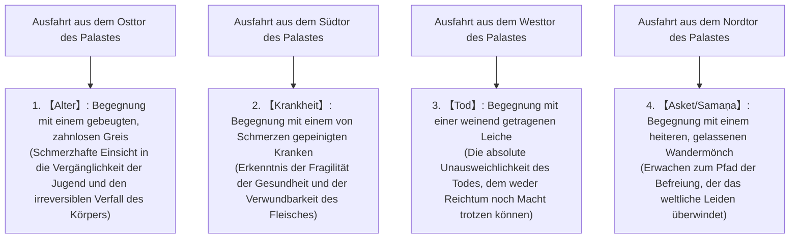

## Einleitung: Die Geburt des Erwachten (Buddha) und die Revolution der menschlichen Geistesgeschichte

Im 5. bis 6. Jahrhundert vor Christus, inmitten jener gewaltigen geistigen Gärung im mittleren Gangesbecken des antiken Indiens – einer Epoche, die Karl Jaspers treffend als „Achsenzeit“ charakterisierte –, begründete Gautama Siddhārtha (Pali: Gotama Siddhattha) die Lehre des Buddhismus. Dieses Ereignis markierte die tiefgreifendste intellektuelle und existenzielle Revolution in der Geistesgeschichte der Menschheit, welche die überlieferte Religionsphilosophie der Veden und frühen Upanishaden in ihren Grundfesten erschütterte und von Grund auf transformierte.

Der Titel „Buddha“ ist kein Eigenname eines metaphysischen Gottes, sondern ein Appellativum im Sanskrit und Pali, welches den „Erwachten“ bezeichnet – jenen, der die ungeschminkte Wirklichkeit des Daseins vollkommen durchschaut hat. Der Kern der von Siddhārtha gestifteten Lehre verwarf radikal jeden blinden Dogmenglauben an ein personhaftes Schöpferwesen sowie das von der Priesterkaste (den Brahmanen) monopolisierte System aus Tieropfern und magisch-rituellen Beschwörungen. An deren Stelle setzte er die unbestechliche, kühle Analyse des strukturellen Leidens (Dukkha), welches dem menschlichen In-der-Welt-Sein unweigerlich inhärent ist. Er sezierte dessen Entstehungsursachen kausalanalytisch und formulierte eine gesetzmäßige, praxisorientierte Erkenntnis (Episteme), durch welche der Mensch vermöge methodischer Selbstbeobachtung und mentaler Disziplin zur endgültigen Befreiung (Mokṣa / Nibbāna) vordringen kann.

Der frühe Buddhismus sprengt den abendländisch geprägten Begriff der „Religion“ bei weitem: Er erweist sich als eine hochpräzise Kognitionswissenschaft, eine fundierte klinische Psychologie, eine radikale Sprach- und Illusionskritik sowie eine phänomenologische Ontologie des Geistes. Die vorliegende Abhandlung unternimmt es, den gesamten Kosmos dieser Lehre mit philologischer Akribie und philosophischer Tiefe auszubreiten: von Siddhārthas existenziellem Werdegang über die logisch-mathematische Architektur der Vier Edlen Wahrheiten, des Edlen Achtfachen Pfades und des abhängigen Entstehens (Paṭicca-samuppāda), die anatomische Dekonstruktion der Person in die fünf Daseinsfaktoren (Skandhas) und das Nicht-Selbst (Anattā) bis hin zur textkritischen Lektüre des Pali-Kanons und dem faszinierenden Dialog mit moderner Neurobiologie, kognitiver Verhaltenstherapie und Phänomenologie.

```
【Paradigmenwechsel des Buddhismus in der altindischen Geistesgeschichte】

┌──────────────────┬─────────────────────────────────┬─────────────────────────────────┐
│ Vergleichskriterium │ Orthodoxer Brahmanismus/Upanishaden │ Früher Buddhismus (Gautama Buddha) │
├──────────────────┼─────────────────────────────────┼─────────────────────────────────┤
│ Letztendliche Realität │ Brahman (Universales Urprinzip)   │ Dharma (Gesetzmäßigkeit/Bedingtheit)│
│ Auffassung des Selbst │ Ātman (Ewiges, unvergängliches Ich)│ Anattā (Nicht-Selbst: Wesenlosigkeit)│
│ Weg zur Befreiung  │ Erkenntnis von Tat Tvam Asi/Opfer/Kaste│ Vier Edle Wahrheiten/Mittlerer Pfad │
│ Weltanschauung     │ Bejahung des Kastensystems (Varṇa)│ Ablehnung der Kasten/Gleichheit aller│
│ Erkenntnismethode  │ Autorität der vedischen Offenbarung│ Eigene Einsicht & empirische Prüfung│
└──────────────────┴─────────────────────────────────┴─────────────────────────────────┘
```

---

## 1. Das Leben Gautama Siddhārthas und seine geistige Wende

### 1.1 Die Geburt als Prinz der Śākyas und die Erschütterung durch die vier Ausfahrten
Gautama Siddhārtha erblickte am Fuße des majestätischen Himalayas, im Hain von Lumbinī (im heutigen südlichen Nepal), als Sohn des Königs Śuddhodana und der Königin Māyā das Licht der Welt. Seine Familie herrschte über die Adelsrepublik Kapilavastu des Kriegeradelsgeschlechts der Śākyas.

Obschon spätere Hagiographien berichten, das Neugeborene habe sogleich sieben Schritte in die vier Himmelsrichtungen getan und seinen universalen Rang verkündet („Zwischen Himmel und Erde bin ich allein der Erhabene“), zeichnet die moderne historische und philologische Forschung ein nüchterneres Bild: Als Spross der herrschenden Kriegerkaste (Kṣatriya) innerhalb eines oligarchischen Bundes (Gaṇa-Saṅgha) wuchs Siddhārtha in unermesslichem Wohlstand und höfischem Luxus auf. Sein Vater, von der Furcht getrieben, der Thronfolger könne der Welt entsagen und das unstete Leben eines Asketen wählen, unternahm alles, um jeglichen Anschein menschlicher Hinfälligkeit von ihm fernzuhalten. Er ließ drei prächtige Paläste für die verschiedenen Jahreszeiten (Sommer, Regenzeit und Winter) errichten, umgab den Knaben mit anmutigen Tänzerinnen, Musik und Festmählern und schirmte ihn rigoros gegen den Anblick von Alter, Siechtum und Verfall ab.

Doch Siddhārthas außergewöhnlich geschärfte Wahrnehmungsgabe und existenzielle Sensibilität ließen sich durch dieses künstliche Idyll nicht dauerhaft betäuben. Den archetypischen Wendepunkt dieses inneren Konflikts schildert die berühmte Legende von den „Vier Ausfahrten“ (Cattāri Nimittāni).



Die vier Ausfahrten sind weit mehr als eine rührende Fabel; sie stellen ein zeitloses Paradigma einer **„existenziellen Krise (Existential Crisis)“** dar. Ungeachtet dessen, wie reich, mächtig oder privilegiert ein Mensch sein mag: Den drei fundamentalen Gesetzen des Alterns, des Erkrankens und des Sterbens kann kein sterbliches Wesen entfliehen. Beim Anblick fremden Leids begriff Siddhārtha blitzartig, dass es sich hierbei nicht um das ferne Missgeschick Fremder handelte, sondern um das unentrinnbare, unausweichliche Schicksal seines eigenen Seins. Diese existenzielle Erschütterung und Verzweiflung trieb den 29-jährigen Prinzen schließlich zu jenem radikalen Schritt, den die Überlieferung als „Große Entsagung“ (Mahāabhiniṣkramaṇa) feiert.

### 1.2 Entsagung, Lehrjahre, extreme Askese und deren Scheitern
Er verließ heimlich den Palast, schnitt sein langes fürstliches Haar ab, tauschte die seidenen Gewänder gegen das staubige Tuch eines Bettlers und trennte sich von seiner Gemahlin Yaśodharā sowie seinem neugeborenen Sohn Rāhula. Fortan zog er als heimatloser Wandermönch (Samaṇa / Śramaṇa) durch die Lande, um das Geheimnis des Daseins zu ergründen.

Zunächst begab er sich in die Lehre zweier gefeierter Meditationsmeister jener Zeit:
1. **Āḷāra Kālāma**: Dieser unterwies ihn in der Erlangung der „Sphäre der Nichtsheit“ (Ākiñcaññāyatana), einer Stufe immenser mentaler Versenkung. Siddhārtha meisterte diesen Zustand binnen kürzester Zeit. Doch er musste feststellen, dass nach dem Auftauchen aus der Trance die alten Ängste und Begierden unvermindert zurückkehrten. Diese Technik bot lediglich ein temporäres Betäubungsmittel, keine endgültige Befreiung.
2. **Uddaka Rāmaputta**: Dieser leitete ihn zur noch subtileren Stufe der „Sphäre von Weder-Wahrnehmung-noch-Nichtwahrnehmung“ (Nevasaññānāsaññāyatana) an. Auch hier erlangte Siddhārtha rasch dieselbe Meisterschaft wie sein Lehrer, erkannte jedoch erneut ernüchtert, dass der letzte Keim des Leidens dadurch nicht ausgerottet wurde.

Nachdem er die Grenzen rein mystischer Trancezustände erkannt hatte, schloss sich Siddhārtha fünf asketischen Gefährten (unter Führung von Koṇḍañña) im Walde von Uruvelā (im Reich Magadha) an. Er beschloss, die Begierden durch die schonungslose Abtötung des Fleisches (Tapas) an der Wurzel zu vernichten. Sechs Jahre lang unterwarf er seinen Körper beispiellosen Qualen: Er hielt den Atem an, bis ihm die Schläfen wie von glühenden Drähten durchbohrt schienen, setzte sich sengender Glut und eisiger Kälte aus und reduzierte seine tägliche Nahrung auf ein einziges Reiskorn oder einen winzigen Sesamsamen.

Am Ende dieses Martyriums glich sein Körper einem wandelnden Skelett: Die Rippen traten hervor wie das Gerippe einer verfallenen Hütte, seine Augen lagen tief in den Höhlen wie Wasser auf dem Grund eines ausgetrockneten Brunnens, seine Kopfhaut schrumpfte wie ein vertrockneter Flaschenkürbis, und als er den Bauch berühren wollte, fasste er an seine Wirbelsäule. Als er vor Entkräftung ohnmächtig am Boden lag und dem Tode nahe war, dämmerte ihm eine fundamentale Erkenntnis, die zum Wendepunkt der Geistesgeschichte werden sollte:

> **„Kasteiung und Selbstquälerei zerstören lediglich den Körper und zerrütten den Geist, ohne jemals wahre Weisheit und Erleuchtung herbeizuführen. Ebenso wie das Versinken in Sinneslust (Hedonismus) ein Irrweg ist, so ist auch die Selbstkasteiung (Askese) verfehlt.“**

Siddhārtha fasste den kühnen Entschluss, die Askese restlos aufzugeben. Er wusch den Schmutz von sechs Jahren im Fluss Nerañjarā ab. Als er kraftlos am Ufer zusammenbrach, reichte ihm das Dorfmädchen Sujātā eine stärkende Schale frisch zubereiteten Milchreises (Pāyāsa). Als die lebensspendende Nahrung seine Glieder durchströmte, kehrte die Lebenskraft auf wundersame Weise zurück. Seine fünf asketischen Weggefährten jedoch wandten sich voller Abscheu und Verachtung von ihm ab, überzeugt, Gautama sei der Schwäche erlegen, vom Pfad abgekommen und dem weltlichen Genuss anheimgefallen.

```
【Überwindung der Extreme und Entdeckung des Mittleren Pfades (Majjhimā Paṭipadā)】

Hingabe an Sinneslüste (Weltlicher Hedonismus) ←────［Mittlerer Pfad］────→ Kasteiung des Fleisches (Extreme Askese)
(Prunkvolles Leben im Königspalast)              (Wahre Weisheit & Stille)          (Der Wald von Uruvelā)
※ Wenn die Saite der Laute zu straff gespannt ist, reißt sie; ist sie zu schlaff, erklingt kein Ton.
   Nur die rechte Stimmung erzeugt vollkommene Harmonie.
```

### 1.3 Das Erwachen unter dem Bodhi-Baum: Die Konfrontation mit Māra und die Geburt des Buddha
Mit regenerierter physischer Kraft wanderte Siddhārtha nach Bodh Gayā. Am Fuße einer mächtigen Pappel-Feige (Aśvattha, seither als „Bodhi-Baum“ verehrt) breitete er ein Bündel Kusa-Gras aus, nahm den unerschütterlichen Lotossitz (Pallaṅka) ein und legte ein Gelübde ab, das von titanischer Entschlossenheit zeugte:
**„Und sollten mein Fleisch und meine Haut verdorren, sollten meine Knochen zerfallen: Ich werde diesen Sitz nicht verlassen, ehe ich nicht die vollkommene, unübertreffliche Erleuchtung erlangt habe!“**

Der buddhistischen Ikonographie zufolge traten in jener Nacht all seine verborgenen Ängste, Zweifel, unbewussten Triebe und Bindungen personifiziert als Dämonenfürst Māra (der Gott des Todes, der Täuschung und des Begehrens) vor ihn, um seinen Geist zu erschüttern. Zunächst entsandte Māra seine betörenden Töchter (Taṇhā/Durst, Aratī/Unlust und Rāga/Leidenschaft), um Siddhārthas Sinne zu betören. Als dieser unberührt verharrte, entfesselte Māra Orkane, Hagelstürme, flammende Meteore und Heere furchterregender Monster, um Panik in ihm zu wecken. Schließlich forderte Māra Siddhārtha spöttisch heraus: „Mit welchem Recht maßt du dir diesen Thron der Weisheit an? Wer ist dein Zeuge?“

Lautlos senkte Siddhārtha seine rechte Hand und berührte mit den Fingerspitzen die Erde (die weltberühmte Geste der Erdberührung: *Bhūmisparśa-mudrā*). Daraufhin erbebte der Erdboden mit Donnerhall und bezeugte: „Ich bin sein Zeuge; durch zahllose Existenzen hindurch hat er sich in selbstloser Hingabe für alle Wesen geopfert!“ Die Dämonenheere zerstoben wie Nebel vor der Morgensonne. Die Fesseln der Geistesgifte (Kilesas) waren zersprengt.

Im Verlauf der darauffolgenden Nacht durchmaß Siddhārthas Geist die drei Phasen des höheren Wissens (Tevijjā):
- **Erste Nachtwache (18–22 Uhr)**: Er erlangte die Gabe der Erinnerung an frühere Existenzen (*Pubbenivāsānussati-ñāṇa*), wodurch er den unendlichen Kausalzusammenhang von Ursache und Wirkung über Äonen hinweg durchschaute.
- **Zweite Nachtwache (22–02 Uhr)**: Er erlangte das „Himmlische Auge“ (*Dibbacakkhu-ñāṇa*), mit dem er sah, wie alle Wesen gemäß der Beschaffenheit ihres Handelns (Karma) sterben und in niederen oder höheren Daseinsbereichen wiedergeboren werden.
- **Dritte Nachtwache (02–06 Uhr)**: Beim Aufleuchten des Morgensterns am östlichen Horizont durchdrang er in direkter, simultaner Schau die Zwölf Glieder des abhängigen Entstehens (Paṭicca-samuppāda) in aufsteigender und absteigender Folge. Mit dem Auslöschen des letzten Rests von Verblendung erlangte er die Erkenntnis der Vernichtung aller Geistesausflüsse (*Āsavakkhaya-ñāṇa*).

In diesem erhabenen Augenblick vollendete Siddhārtha die unübertreffliche, vollkommene Erleuchtung (Anuttara-sammā-sambodhi). Aus dem suchenden Prinzen war der **Buddha** geworden – der vollkommen Erwachte, der Śākyamuni (Weise aus dem Geschlecht der Śākya). Er zählte zu diesem Zeitpunkt 35 Lebensjahre.

### 1.4 Die Bitte des Brahmā und das Ingangsetzen des Rades der Lehre: Vom Schweigen zur Weltreligion
Unmittelbar nach dem großen Durchbruch verharrte der Buddha in tiefer Meditation und schwankte, ob er die erfahrene Wahrheit der Welt verkünden sollte: „Diese von mir entdeckte Wahrheit ist abgrundtief, subtil, schwer zu fassen, jenseits des bloßen Verstandes, nur den Weisen zugänglich. Die Menschen dieser Welt jedoch sind verstrickt in Begierden, gefesselt an Illusionen. Würde ich ihnen diesen Dhamma darlegen, so erntete ich unverstandenen Hohn und vergebliche Mühe.“ Er neigte dazu, schweigend im Frieden des Nibbāna zu verweilen.

Da stieg der Überlieferung nach Brahmā Sahampati, die höchste Gottheit des altindischen Pantheons, aus den lichten Himmeln herab, kniete vor dem Erhabenen nieder, faltete ehrerbietig die Hände und bat ihn dreimal inständig um die Verkündigung der Lehre (*Brahmā-yācana*):
„O Erhabener, verkündet das Gesetz! Es gibt Wesen, deren Augen nur von wenig Staub bedeckt sind; sie gehen zugrunde, wenn sie die Heilsbotschaft nicht vernehmen. Hören sie aber das Wort, so werden sie zur Erlösung gelangen!“

Der Buddha blickte mit dem Auge des Mitgefühls auf die Welt. Er sah die Menschheit wie ein Feld von Lotosblumen in einem schlammigen Teich: Einige Knospen stecken tief im Schlamm, andere wachsen empor und berühren die Wasseroberfläche, und einige wenige ragen bereits makellos über das trübe Wasser hinaus, bereit, sich beim ersten Sonnenstrahl zu entfalten. Daraufhin brach der Buddha sein Schweigen und sprach jene denkwürdigen Worte:

> **„Geöffnet sind die Tore des Todlosen! Wer Ohren hat, vernehme die Botschaft mit Vertrauen!“**
> (*Aparutā tesaṃ amatassa dvārā, ye sotavanto pamuñcantu saddhaṃ*)

Um seine fünf Gefährten zu suchen, wanderte der Buddha hunderte Kilometer westwärts nach Sārnāth bei Vārāṇasī (im Hirschpark Isipatana). Als die fünf Asketen ihn von weitem herannahen sahen, vereinbarten sie zunächst insgeheim: „Da kommt der abtrünnige Gautama, der dem Luxus verfallen ist; wir wollen ihm keinen Gruß entbieten und ihm keinen Sitzplatz bereiten.“ Doch als der Erhabene näher trat, überwältigte sie seine majestätische, von tiefer Gelassenheit durchdrungene Aura derart, dass sie unwillkürlich aufsprangen, ihm die Füße wuschen und ihm ehrerbietig einen Sitz anboten.

Dort hielt der Buddha die geschichtsträchtige erste Predigt der Weltreligion: **„Das Ingangsetzen des Rades der Lehre“ (*Dhammacakkappavattana-sutta*)**. Er legte den Mittleren Pfad dar, welcher die Extreme von Sinnengier und Selbstzerfleischung meidet, und verkündete die Vier Edlen Wahrheiten sowie den Edlen Achtfachen Pfad. Während des Vortrags ging dem ältesten Asketen Koṇḍañña das reine „Auge der Wahrheit“ (Dhammacakkhu) auf: *„Alles, was der Entstehung unterworfen ist, ist auch dem Vergehen unterworfen.“* Damit waren die Drei Juwelen (Tiratana) – der Buddha (der Lehrer), der Dharma (die Lehre) und der Sangha (die Gemeinschaft der Praktizierenden) – geschichtlich in der Welt verankert.

---

## 2. Die Kernlehre des Buddhismus: Die logische Struktur der Vier Edlen Wahrheiten (Cattāri Ariyasaccāni)

Die Verkündigung des Erhabenen ist weder theologische Spekulation noch esoterisches Dogma. Sie bedient sich vielmehr der exakten diagnostisch-therapeutischen Methodik der klassischen indischen Heilkunde (Āyurveda), übertragen auf die existenzielle Verfassung des menschlichen Geistes. Der Buddha agiert hierbei als der oberste Seelenarzt der Menschheit.

```
【Strukturelle Isomorphie zwischen medizinischem Heilmodell und den Vier Edlen Wahrheiten】

┌──────────────────────┬──────────────────────────────┬─────────────────────────────────┐
│ Medizinisches Modell │ Vier Edle Wahrheiten (Dhamma)│ Inhalt und existenzielle Bedeutung│
├──────────────────────┼──────────────────────────────┼─────────────────────────────────┤
│ 1. Erkennen d. Krankheit│ Dukkha-sacca (Wahrheit v. Leiden)│ Grundlegende Realität: Dasein ist unbefriedigend │
│ 2. Ergründen d. Ursache │ Samudaya-sacca (Ursprung)    │ Wurzel des Leidens ist der Durst (Taṇhā)         │
│ 3. Ziel d. Heilung   │ Nirodha-sacca (Aufhebung)    │ Vollständiges Erlöschen d. Durstes = Nibbāna     │
│ 4. Verordnen d. Therapie│ Magga-sacca (Weg/Therapie)   │ Praktischer Pfad zum Nibbāna = Achtfacher Pfad   │
└──────────────────────┴──────────────────────────────┴─────────────────────────────────┘
```

### 2.1 Dukkha-sacca: Die strukturelle Unbefriedigtheit der Existenz
Wenn die buddhistische Lehre postuliert: „Alles Dasein ist von Leiden durchdrungen“ (*Sabbe saṅkhārā dukkhā*), so erschöpft sich der Begriff *Dukkha* keineswegs in banalem körperlichem Schmerz oder melancholischer Trauer.
Etymologisch leitet sich das Pali-Wort *dukkha* von der Vorsilbe *du-* (schlecht, fehlerhaft, mühsam) und dem Stamm *kha* (die Nabe oder das Achsloch eines Rades) her. Es meint im ursprünglichen Wortsinn ein Wagenrad, dessen Achsloch verzogen ist: Das Rad eckt unaufhörlich an, läuft unrund und holpert schmerzhaft über den Weg. Dukkha meint somit die fundamentale, strukturelle **„Unbefriedigtheit, Instabilität und Diskrepanz“** zwischen unseren Wünschen und der Natur der Realität.

Der frühe Buddhismus differenziert diesen existentiellen Befund in die klassischen „Vier und Acht Leiden“ (Cattāri Dukkhāni, Aṭṭha Dukkhāni):

1. **Jāti-dukkha**: Das Leiden des Geborenwerdens und des Daseinsvollzugs.
2. **Jarā-dukkha**: Das Leiden des Alterns und des unaufhaltsamen körperlich-geistigen Verfalls.
3. **Byādhi-dukkha**: Das Leiden an Krankheiten, Seuchen und physischem Gebrechen.
4. **Maraṇa-dukkha**: Das Leiden des Sterbens und das Entsetzen vor der eigenen Vernichtung.
5. **Piyavippayoga-dukkha**: Das Leiden, von dem getrennt zu werden, was man liebt und schätzt.
6. **Appiyasaṃpayoga-dukkha**: Das Leiden, mit dem vereint zu sein, was man verabscheut und fürchtet.
7. **Yampicchaṃ na labhati tampi dukkhaṃ**: Das Leiden, das Begehrte trotz aller Anstrengung nicht zu erlangen.
8. **Saṅkhittena pañcupādānakkhandhā dukkhā**: Kurz gesagt: Das verhaftete Festhalten an den fünf Daseinsgruppen (Skandhas) ist an sich leidvoll.

### 2.2 Samudaya-sacca: Die Ursache des Leidens und der „Durst“ (Taṇhā)
Wo eine chronische Pathologie existiert, muss eine spezifische Ursache (*Samudaya*) vorliegen. Die zweite Wahrheit lokalisiert diese Wurzel im Phänomen des **„Durstes“ (*Taṇhā* / Sanskrit: *Tṛṣṇā*)**.
*Taṇhā* bezeichnet jenen obsessiven, verzehrenden Trieb des Geistes, der – gleich einem in der Wüste Verdurstenden – blindlings nach Objekten giert, an ihnen haftet und sie krampfhaft festzuhalten versucht.

Der Buddha unterteilt diesen Durst in drei phänomenologische Hauptformen:
- **Kāma-taṇhā (Sinnendurst)**: Das ruhelose Verlangen nach Sinnesreizen und Vergnügungen der fünf Sinne (Schmecken, Sehen, Hören, Riechen, Tasten).
- **Bhava-taṇhā (Werdedurst / Daseinsdurst)**: Der metaphysische Wille zur Selbstverewigung, der Wunsch, das Ich möge endlos fortbestehen, an Macht, Reichtum und Geltung zunehmen und den Tod überdauern.
- **Vibhava-taṇhā (Vernichtungsdurst)**: Das destruktive Verlangen, sich aus Verzweiflung selbst auszulöschen, die Existenz zu vernichten oder schmerzhaften Erfahrungen durch Flucht ins Nichts zu entkommen.

Das tückische Wesen des Durstes liegt in seiner inhärenten Suchtstruktur begründet: Er lässt sich niemals stillen. Wer seinen Durst mit Sinnesfreuden zu löschen versucht, gleicht einem Dürstenden, der Meerwasser trinkt – mit jedem Schluck nimmt das innere Brennen nur noch verheerendere Ausmaße an.

### 2.3 Nirodha-sacca: Die vollkommene Aufhebung des Leidens und das Nirvana
Weil das Leiden auf einer Kausalkette beruht, fällt die Wirkung augenblicklich in sich zusammen, sobald die Ursache beseitigt wird. Die Dritte Edle Wahrheit ist die frohe Botschaft der restlosen Aufhebung (*Nirodha*): das Aufhören des Leidens im **Nirvana (*Nibbāna* / Sanskrit: *Nirvāṇa*)**.

Das Wort *Nibbāna* bedeutet wörtlich „Verwehen“, „Erlöschen“ (von *nir* = heraus, weg + *vā* = wehen). Es bezeichnet das vollkommene Verlöschen der lodernden Flammen der Drei Geistesgifte: der Gier (*Lobha* / *Rāga*), des Hasses (*Dosa*) und der Verblendung (*Moha*).
Nibbāna ist mitnichten ein transzendenter Ort im Jenseits oder eine nihilistische Auslöschung; es ist die **vollkommene, unerschütterliche Geistesruhe und Freiheit im Hier und Jetzt**, erlangt durch das Zerschneiden aller Fesseln der Verstrickung.

### 2.4 Magga-sacca: Der Edle Achtfache Pfad als konkreter therapeutischer Weg (Ariyo aṭṭhaṅgiko maggo)
Die Vierte Edle Wahrheit beschreibt den praktischen, gangbaren Pfad, der unmittelbar zum Verlöschen des Leidens führt. Dieser Edle Achtfache Pfad gliedert sich klassisch in die „Drei Schulungen“ (*Tisso sikkhā*): Sittlichkeit (*Sīla*), Sammlung (*Samādhi*) und Weisheit (*Paññā*).

```
【Struktur des Edlen Achtfachen Pfades und Zuordnung zu den Drei Übungen (Sikkhā)】

┌────────────────────┬─────────────────────────────┬────────────────────────────────────┐
│ Dreifache Schulung │ Glied des Achtfachen Pfades │ Praktische Definition und Funktion │
├────────────────────┼─────────────────────────────┼────────────────────────────────────┤
│ Weisheit (Paññā)   │ 1. Rechte Ansicht (Sammā-diṭṭhi)│ Klares Begreifen der Vier Wahrheiten/Karma│
│                    │ 2. Rechte Gesinnung (Sammā-saṅkappa)│ Entsagung, Wohlwollen und Nicht-Schädigen│
├────────────────────┼─────────────────────────────┼────────────────────────────────────┤
│ Sittlichkeit (Sīla)│ 3. Rechte Rede (Sammā-vācā)  │ Meiden von Lüge, Verleumdung, Härte, Geschwätz│
│                    │ 4. Rechtes Handeln (Sammā-kammanta)│ Unterlassen von Töten, Stehlen, Unzucht│
│                    │ 5. Rechter Lebenserwerb (Sammā-ājīva)│ Meiden schädigender Berufe (Waffen, Gifte)│
├────────────────────┼─────────────────────────────┼────────────────────────────────────┤
│ Sammlung (Samādhi) │ 6. Rechte Anstrengung (Sammā-vāyāma)│ Überwinden des Unheilsamen, Wecken des Guten│
│                    │ 7. Rechte Achtsamkeit (Sammā-sati)│ Gegenwärtiges Gewahrsein von Körper/Geist│
│                    │ 8. Rechte Konzentration (Sammā-samādhi)│ Einstimmigkeit des Geistes in den Jhānas│
└────────────────────┴─────────────────────────────┴────────────────────────────────────┘
```

Diese acht Faktoren bilden keine lineare Stufenleiter, die man nacheinander abarbeitet, sondern greifen wie die Speichen eines Rades ineinander. Die Rechte Ansicht erhellt den Weg; die sittliche Läuterung (Rechte Rede, Rechtes Handeln, Rechter Lebenserwerb) beruhigt das Gewissen und schafft die unabdingbare Basis; die meditative Disziplin (Rechte Anstrengung, Rechte Achtsamkeit, Rechte Konzentration) schärft das Bewusstsein wie ein Skalpell, wodurch die Weisheit zur vollen Reife gelangt.

---

## 3. Die Tiefen der Ontologie: Das abhängige Entstehen (Paṭicca-samuppāda) und die fünf Skandhas

### 3.1 Die Lehre vom abhängigen Entstehen: Buddhas höchste Erkenntnis
Die philosophische Krone des frühen Buddhismus, durch welche er sich radikal von allen theistischen, materialistischen und idealistischen Systemen abgrenzt, ist das Gesetz des **abhängigen Entstehens (*Paṭicca-samuppāda* / Sanskrit: *Pratītyasamutpāda*)**.
Es besagt, dass kein Phänomen im Universum isoliert, aus sich selbst heraus oder durch einen übernatürlichen Schöpferwillen existiert. Alles ist relational, bedingt und prozessual.

Im Saṃyutta Nikāya hat der Buddha diese Gesetzmäßigkeit in einer bestechenden, gleichsam mathematischen Eleganz formuliert:

> **„Wenn dies ist, so ist jenes. Durch das Entstehen von diesem entsteht jenes.**
> **Wenn dies nicht ist, so ist jenes nicht. Durch das Vergehen von diesem vergeht jenes.“**
> (*Imasmiṃ sati idaṃ hoti, imassuppādā idaṃ uppajjati; imasmiṃ asati idaṃ na hoti, imassa nirodhā idaṃ nirujjhati.*)

Die Wirklichkeit ist mithin keine Ansammlung statischer Substanzen, sondern ein dynamisches, unaufhörlich fließendes Gewebe wechselseitiger Abhängigkeiten (metaphorisch im späteren Mahāyāna als „Netz des Gottes Indra“ veranschaulicht). Es gibt keine erste Ursache (Causa prima), keinen unbewegten Beweger. Bedingungen fügen sich zusammen, und Phänomene flammen auf; Bedingungen lösen sich auf, und Phänomene vergehen.

### 3.2 Die Kette der zwölf Glieder des abhängigen Entstehens (Dvādasa-nidāna)
In jener Erleuchtungsnacht durchschaute Siddhārtha die Verkettung der Ursachen, welche die Lebewesen an das Rad der Wiedergeburten (Saṃsāra) und an das Leiden von Alter und Tod schmieden, in zwölf wohlunterschiedenen Gliedern:

```mermaid
graph LR
    A["1. Unwissenheit<br/>(Avijjā)"] --> B["2. Gestaltungen<br/>(Saṅkhāra)"]
    B --> C["3. Bewusstsein<br/>(Viññāṇa)"]
    C --> D["4. Geist & Körper<br/>(Nāmarūpa)"]
    D --> E["5. Sechs Sinne<br/>(Saḷāyatana)"]
    E --> F["6. Berührung/Kontakt<br/>(Phassa)"]
    F --> G["7. Empfindung<br/>(Vedanā)"]
    G --> H["8. Durst/Begehren<br/>(Taṇhā)"]
    H --> I["9. Ergreifen/Anhaften<br/>(Upādāna)"]
    I --> J["10. Werden/Dasein<br/>(Bhava)"]
    J --> K["11. Geburt<br/>(Jāti)"]
    K --> L["12. Alter & Tod<br/>(Jarāmaraṇa)"]
```



```
【Die zwölf Glieder und die psychophysische Dynamik des menschlichen Daseins】

1. Avijjā (Unwissenheit): Das fundamentale Nicht-Erkennen der Vier Edlen Wahrheiten und der Natur des Geistes.
2. Saṅkhāra (Karmische Gestaltungen): Willentliche Impulse und Taten, die aus Unwissenheit entspringen.
3. Viññāṇa (Bewusstsein): Der unterscheidende Bewusstseinsstrom, der in einen neuen Mutterleib eintritt.
4. Nāmarūpa (Geist und Körperlichkeit): Die psychophysische Individualität des embryonalen Organismus.
5. Saḷāyatana (Sechs Sinnesgrundlagen): Auge, Ohr, Nase, Zunge, Körper und der denkende Geist.
6. Phassa (Berührung / Sinneskontakt): Das Zusammentreffen von Sinnesorgan, Außenobjekt und Bewusstsein.
7. Vedanā (Empfindung): Die unwillkürliche Tönung des Erlebens als angenehm, schmerzhaft oder neutral.
8. Taṇhā (Durst): Das ungestüme Verlangen nach Wiederholung des Angenehmen und Vermeidung des Unangenehmen.
9. Upādāna (Ergreifen / Anhaften): Das krampfhafte Festhalten an Sinnesobjekten, Ansichten und der Ich-Illusion.
10. Bhava (Werden / Daseinsprozess): Das Heranreifen neuer karmischer Existenzbedingungen.
11. Jāti (Geburt): Das erneute Hervortreten in einem neuen Daseinszustand.
12. Jarāmaraṇa (Alter und Tod): Der unvermeidliche Verfall, Kummer, Schmerz und das physische Sterben.
```

Das Geniale an dieser Kausalkette liegt darin, dass der Buddha die Wurzel nicht in einer metaphysischen Sünde oder göttlicher Fügung verortete, sondern in einem kognitiven Defizit: der **Unwissenheit (*Avijjā*)**.
Weil die Kette kausal konstruiert ist, lässt sie sich auch dekonstruieren („Umkehrung der Kette“ / *Nirodha-vāra*):
Erlischt die Unwissenheit durch rückhaltlose Erkenntnis, so erlöschen die karmischen Gestaltungen; erlöschen diese, so erlischt das anhaftende Bewusstsein ... bis schließlich das Ergreifen, die Geburt und der gewaltige Berg von Leid, Alter und Tod restlos in sich zusammenstürzen. Befreiung ist demnach kein Mirakel, sondern eine logisch zwingende Konsequenz erkenntnismäßiger Klärung.

### 3.3 Pañca-khandhā: Die Dekonstruktion der menschlichen Existenz
Was aber ist dieses Wesen, das wir voller Inbrunst „Ich“ nennen?
Der Buddha verwarf die Vorstellung einer unteilbaren, ewigen Seelenmonade und zerlegte die menschliche Person analytisch in fünf wechselwirkende Komponenten – die **Fünf Daseinsgruppen (*Pañca-khandhā* / Sanskrit: *Pañca-skandha*)**:

1. **Rūpa (Körperlichkeit / Materie)**: Der materielle Organismus, bestehend aus den vier großen Elementen (Erde/Festigkeit, Wasser/Kohäsion, Feuer/Temperatur, Wind/Bewegung) samt den Sinnesorganen und äußeren Objekten.
2. **Vedanā (Empfindung)**: Die affektive Valenz bei jedem Sinneskontakt – angenehm (*sukha*), unangenehm (*dukkha*) oder indifferent (*adukkhamasukha*).
3. **Saññā (Wahrnehmung / Erkennen)**: Die begriffliche Erfassung, das Wiedererkennen von Formen, Farben und Lauten durch Assoziation mit Gedächtnisspuren.
4. **Saṅkhāra (Willensformationen / Geistesregungen)**: Sämtliche emotionalen und volitiven Regungen (Absichten, Begehren, Hass, Entschlossenheit, Neid, Güte), welche Karma erzeugen.
5. **Viññāṇa (Bewusstsein)**: Das reine, synthetisierende Gewahrsein, das die Aktivität der jeweiligen Sinnespforten begleitet und erhellt.

Im berühmten *Anattalakkhaṇa-sutta* (der zweiten Lehrrede) führte der Buddha seinen Schülern diese Zerlegung vor Augen:
„Was meint ihr, Mönche: Ist der Körper beständig oder unbeständig?“ – „Unbeständig, Herr.“ – „Was aber unbeständig ist, ist das leidvoll oder freudvoll?“ – „Leidvoll, Herr.“ – „Ist es da nun angemessen, von dem, was unbeständig, leidvoll und dem Wandel unterworfen ist, zu wähnen: ‚Das gehört mir, das bin ich, das ist mein wahres Selbst (Ātman)‘?“ – „Gewiss nicht, Herr!“ Dasselbe befragte er bezüglich der Empfindungen, Wahrnehmungen, Geistesformationen und des Bewusstseins.

Der Mensch ist demnach keine Substanz, sondern ein dynamisches, rasend schnell oszillierendes Prozessgefüge. Wie der Ehrwürdige Nāgasena später im philosophischen Dialog *Milindapañha* anhand des Gleichnisses vom Streitwagen darlegte: Weder die Räder noch die Achse, weder die Deichsel noch der Kasten allein sind der „Wagen“; der Begriff „Wagen“ ist lediglich eine konventionelle Bezeichnung für das geordnete Zusammenspiel seiner Teile. Genau so verhält es sich mit dem Wort „Ich“: Es ist eine sprachliche Fiktion für das temporäre Bündel der fünf Skandhas.

---

## 4. Die Philosophie des Nicht-Selbst (Anattā): Dekonstruktion der Wesensidentität und existentielle Freiheit

### 4.1 Anattā versus upanishadischer Ātman
Die kühnste und bis heute am häufigsten missverstandene Provokation des Buddhismus ist die Doktrin des **Nicht-Selbst (*Anattā* / Sanskrit: *Anātman*)**.

Die im damaligen Indien dominierende Geistesströmung der Upanishaden lehrte mit Nachdruck: Zwar altern Fleisch und Geist, doch tief im Inneren jedes Wesens residiert ein ewiger, unwandelbarer, göttlicher Wesenskern – der **Ātman (das Selbst)**. Und die höchste Erlösung bestehe darin, zu erkennen, dass dieser individuelle Wesenskern wesensgleich mit dem universalen Weltgeist (Brahman) ist (*Tat Tvam Asi* – „Das bist Du“).

Demgegenüber schleuderte der Buddha sein unmissverständliches Diktum in die Welt:
**„Alle Phänomene sind Nicht-Selbst!“ (*Sabbe dhammā anattā*)**

Sein Beweisgang ist von entwaffnender Stringenz:
Wenn etwas wahrhaft mein unantastbares „Selbst“ wäre, so müsste es meinem uneingeschränkten Willen unterworfen sein. Man müsste seinem Körper befehlen können: „Werde niemals krank! Alter niemals!“ Doch der Körper verfällt nach seinen eigenen biologischen Gesetzen. Können wir unserem Geist gebieten, niemals traurig zu sein oder niemals Verwirrung zu empfinden? Nein. Gefühle und Gedanken tauchen auf, bedingt durch Reize und Dispositionen, und vergehen wieder. Etwas, das wir weder vollkommen beherrschen können noch von Dauer ist, kann unmöglich unser Wesenskern sein. Wo immer wir in den fünf Skandhas suchen: Nirgendwo stoßen wir auf eine unveränderliche Seele.

```
【Erkenntnistheoretischer Gegensatz zwischen Ātman-Ontologie und buddhistischer Anattā-Lehre】

■ Substanzontologie der Upanishaden (Ātman)
Hinter Körper, Gefühlen und Gedanken thront eine ewige, unveränderliche,
reine „Seele als unberührter Beobachter“ (Das wahre Selbst).
※ Das Streben nach „Erlösung der Seele“ verstrickt den Menschen letztlich
   in die subtile Falle verstärkter Selbstbezogenheit und Ich-Verhaftung.

■ Phänomenologischer Prozessualismus des frühen Buddhismus (Anattā)
Es gibt lediglich einen kausal fließenden Strom aus Körperlichkeit, Gefühlen
und Gedanken; hinter dem Fluss existiert kein statischer „Beobachter“.
Es gibt die Tat, doch keinen Täter; es gibt das Sehen, doch keinen Seher.
※ Indem die fixe Illusion eines substanziellen „Ich“ dekonstruiert wird,
   wird jeglichem Anhaften an der Wurzel der Boden entzogen.
```

### 4.2 Die Drei und Vier Daseinsmerkmale: Universale Gesetze des Kosmos
Als unumstößliche Siegel der Wirklichkeit formulierte der Buddha die „Daseinsmerkmale“ (*Tilakkhaṇa*):

1. **Sabbe saṅkhārā aniccā (Alles Gestaltete ist unbeständig)**:
   Nichts Verursachtes verharrt auch nur den Bruchteil einer Sekunde im Stillstand. Von den subatomaren Schwingungen bis zu den Galaxienhaufen befindet sich das gesamte All im Zustand ständigen Fließens (*Panta rhei*).
2. **Sabbe dhammā anattā (Alle Phänomene sind ohne Selbst)**:
   Weder im Bereich des Bedingten (*Saṅkhata*) noch im Unbedingten (*Asaṅkhata*, dem Nibbāna) gibt es eine autonome, substanzhafte Entität.
3. **Nibbānaṃ santaṃ (Nirvana ist vollkommener Friede)**:
   Das Erlöschen der Begierde und die Einsicht in die Wesenlosigkeit führen zu unerschütterlicher, ungetrübter Stille.
4. **Sabbe saṅkhārā dukkhā (Alles Gestaltete ist unbefriedigend)**:
   Weil der Mensch das Unbeständige irrtümlich für ewig hält und das Wesenlose als sein „Eigentum“ umklammert, verwandelt sich der kosmische Wandel im Erleben des Toren unabwendbar in Leid. (Werden diese vier Merkmale gemeinsam genannt, spricht man von den Vier Daseinssiegeln).

Hierbei ist zu betonen: Die Anattā-Lehre ist kein Nihilismus! Der Buddha wies die materialistische Vernichtungslehre (*Ucchedavāda* – „Mit dem Tod ist alles vorbei“) mit derselben Schärfe zurück wie den metaphysischen Ewigkeitsglauben (*Sassatavāda* – „Die Seele währt ewig“). Anattā ist der Mittlere Pfad: Es gibt Kontinuität ohne Identität, Werden ohne Substanz. Befreiung bedeutet nicht, ein Ich zu vernichten, sondern das Phantom eines abgetrennten Ichs als wurzellose Illusion zu entlarven.

---

## 5. Philologische Erschließung der frühen Schriften und die Entstehung des Sangha

### 5.1 Entstehungsgeschichte des Pali-Kanons und die Konzilien (Saṅgīti)
Der Buddha hinterließ keine geschriebene Zeile. Im antiken Indien galt die lebendige, mündliche Weitergabe von Meister zu Schüler als die einzig adäquate Form zur Bewahrung heiligen Wissens.

Als der Erhabene im Alter von 80 Jahren zu Kusinārā zwischen zwei Sāla-Bäumen das vollkommene Verlöschen (Mahāparinibbāna) verwirklichte, rief der Ehrwürdige Mahākassapa in der Höhle Sattapaṇṇi bei Rājagaha 500 vollendete Heilige (Arahants) zusammen. Dies war das **Erste Buddhistische Konzil (*Paṭhama-saṅgīti* = gemeinsames Rezitieren)**.

```
【Die Etablierung der beiden Hauptstränge auf dem Ersten Konzil】

1. Rezitation des Sutta Piṭaka (Lehrreden)
   ・ Sprecher: Ānanda (Vetter und persönlicher Begleiter Buddhas über 25 Jahre; „Erster unter den Vielhörenden“)
   ・ Einleitende Formel: „So habe ich gehört“ (Evaṃ me sutaṃ)
   ・ Inhalt: Dialoge und Lehrreden des Buddha, angepasst an die Fassungskraft der Hörer.

2. Rezitation des Vinaya Piṭaka (Ordensdisziplin)
   ・ Sprecher: Upāli (ehemaliger Barbier niederen Standes; „Erster in der Kenntnis der Ordensregeln“)
   ・ Inhalt: Verhaltensregeln für Mönche und Nonnen (Bhikkhus/Bhikkhunīs), Verfahrensordnung und Sanktionen.
```

Im ersten vorchristlichen Jahrhundert geriet diese mündliche Tradition in Sri Lanka (im Kloster Aluvihāra) durch verheerende Hungersnöte und Kriege in akute Gefahr. Um den Untergang des Wissens zu verhindern, ritzten gelehrte Mönche den gesamten Kanon in mühseliger Handarbeit auf getrocknete Palmblätter (Ola-Blätter). So entstand der bis heute überlieferte **Pali-Dreikorb (*Tipiṭaka*)**, bestehend aus:
- **Vinaya Piṭaka** (Korb der Ordensregeln)
- **Sutta Piṭaka** (Korb der Lehrreden: Dīgha-, Majjhima-, Saṃyutta-, Aṅguttara- und Khuddaka-Nikāya)
- **Abhidhamma Piṭaka** (Korb der scholastischen Systematisierung)

### 5.2 Die ältesten Schichten: Sutta Nipāta und Dhammapada
Die moderne historisch-kritische Philologie (begründet durch Forscher wie T.W. Rhys Davids, Hermann Oldenberg, Wilhelm Geiger und weitergeführt von K.R. Norman und Hajime Nakamura) konnte nachweisen, dass bestimmte Abschnitte des Pali-Kanons sprachlich und metrisch in ein archaisches Vorstadium zurückreichen. Herausragende Zeugnisse dieser frühesten Schicht sind das *Aṭṭhakavagga* (Achter-Buch) und das *Pārāyanavagga* (Weg zur jenseitigen Küste) des *Sutta Nipāta* sowie Verse des *Dhammapada*.

In diesen Texten tritt uns kein vergöttlichter Weltenherrscher im Glanz übernatürlicher Mythologie entgegen, sondern ein wandernder Asket von bestechender Realitätsnähe – barfuß, im Flickenkleid, die Almosenschale haltend, unerschütterlich wie ein Fels in der Brandung:

> **„Wandle einsam wie das Horn des Nashorns!“**
> (*Khaggavisāṇa-sutta*, Sutta Nipāta I.3)
> Wer mit Genossen verkehrt, verfällt der Zuneigung; aus Zuneigung aber erwächst Schmerz. Wer die Gefahr erkennt, die im Hangen an Gesellschaft liegt, meide den Streit um Meinungen und wandle lauter und selbstgenügsam, einsam wie das Horn des Nashorns.

Gleichermaßen erstrahlt im *Dhammapada* die zeitlose ethische Kraft des frühen Buddhismus:

> **„Niemals erlischt Feindschaft durch Feindschaft in dieser Welt;**
> **nur durch Nicht-Feindschaft (Liebe) erlischt sie. Das ist ein ewiges Gesetz.“**
> (*Dhammapada*, Vers 5)
> (*Na hi verena verāni sammantīdha kudācanaṃ, averena ca sammanti esa dhammo sanantano.*)

Metaphysische Spekulationen („Ist die Welt ewig oder endlich?“, „Sind Seele und Körper eins oder verschieden?“) wies der Buddha kategorisch als müßiges Geschwätz (*Papañca*) zurück. Im berühmten Gleichnis vom vergifteten Pfeil (*Cūḷamālukya-sutta*) stellte er klar: Wenn ein Mann von einem giftgetränkten Pfeil getroffen wird, verlangt er nicht zuerst zu wissen, welcher Kaste der Schütze angehört, wie sein Bogen gebaut war und aus welchen Federn der Pfeil bestand – er will einzig und allein, dass der Pfeil unverzüglich herausgezogen und die Wunde geheilt wird! Buddhas Lehre diente einzig dem existenziellen Heilsziel: der Ausrottung des Leidens.

### 5.3 Die Regierungskunst des frühen Sangha: Pātimokkha und konsensuale Basisdemokratie
Die vom Buddha gegründete Gemeinschaft der Mönche und Nonnen (**Sangha**) war kein hierarchischer Priesterorden, sondern eine der frühesten und radikalsten basisdemokratischen Kommunen der Weltgeschichte.

In einer Ära, in der despotische Monarchien erstarkten und das Kastenwesen Menschen grausam segregierte, errichtete der Sangha eine Oase absoluter Egalität. Beim Überschreiten der Schwelle zum Orden verloren Brahmanen, Könige, Kaufleute und Unberührbare (Caṇḍālas) jegliches Privileg. Rang und Sitzordnung bemaßen sich einzig nach dem Dienstalter seit der Ordination (*Upasampadā*). Als der niedere Barbier Upāli vor den edlen Prinzen der Śākyas (wie Anuruddha und Ānanda) geweiht wurde, verneigten sich die hochmütigen Fürstensöhne tief vor dem ehemaligen Friseur – ein beispielloser Bruch mit den gesellschaftlichen Konventionen der Antike.

```
【Autonome Organisations- und Beschlussordnung des frühen Sangha】

1. Kamma (Rechtsakt der Gemeinde): Einstimmigkeit als oberstes Beschlussprinzip
   ・ Bedeutsame Angelegenheiten (Ordination, Verfehlungsprüfungen, Güterverteilung) bedürfen des Konsenses der Vollversammlung.
   ・ Nach Einbringung eines Antrags fragt der Leiter dreimal: „Gibt es Einwände?“ Nur bei vollständigem Schweigen aller gilt der Beschluss als gefasst (Ñatticatuttha-kamma). Der begründete Einspruch eines Einzelnen genügt zur Ablehnung.

2. Uposatha (Halbmonatliche Läuterung und Wahrung der Ordensdisziplin)
   ・ Zu Neu- und Vollmond versammeln sich alle Mönche; die Ordensregeln (Pātimokkha: 227 Regeln für Bhikkhus) werden verlesen.
   ・ Jeder bekennt etwaige Verfehlungen öffentlich (Saṃvego/Kopana), um die Reinheit des Herzens wiederherzustellen. Vertuschung ist untersagt.

3. Pavāraṇā (Gegenseitige Einladung zur Kritik am Ende der Regenzeit)
   ・ Am Schlusstag des dreimonatigen Vassa bitten sich die Mönche wechselseitig: „Weiset mich voller Mitgefühl auf Verfehlungen hin, die ihr gesehen, gehört oder vermutet habt.“ Demut und Offenheit für Kritik.
```

Ebenso revolutionär war der Entschluss des Buddha, auf das unermüdliche Drängen seiner Pflegemutter Mahāpajāpatī Gotamī und Ānandas hin die Gründung des **Bhikkhunī-Sangha (des Nonnenordens)** zu autorisieren. In einer Epoche, in der Frauen im gesamten eurasischen Raum als unselbständiges Eigentum von Vätern und Ehemännern galten, anerkannte der Buddha ausdrücklich, dass Frauen in genau demselben Maße fähig sind, die höchste Frucht der Heiligkeit (das Arahant-tum) zu erlangen, und übertrug ihnen die administrative Selbstverwaltung ihrer Klöster. Dies war ein beispielloser kulturgeschichtlicher Emanzipationsakt.

---

## 6. Struktureller Wandel vom frühen Buddhismus zu Abhidharma und Mahāyāna

### 6.1 Abhidharma-Buddhismus: Die mikroskopische Analyse des Daseins
Einige Jahrhunderte nach dem Parinibbāna spaltete sich die Urgemeinde infolge disziplinärer und dogmatischer Differenzen in die Traditionalisten (Theravāda / Sthaviravāda) und die Reformer (Mahāsāṅghika) – die sogenannte Grundspaltung. Später differenzierten sich daraus etwa zwanzig Schulen des Nikāya-Buddhismus heraus.

In dieser Ära unternahmen es monastische Gelehrte, die verstreuten Lehrreden des Buddha in ein geschlossenes metaphysisches Kategoriensystem zu überführen: Es entstand der **Abhidhamma (die „höhere Lehre“)**. Insbesondere die einflussreiche Schule der Sarvāstivādins zerlegte die Wirklichkeit akribisch in 75 fundamentale Letztelemente des Seins (Dharmas) innerhalb von fünf Hauptkategorien (*Pañcavastuka*).
Obgleich diese scholastische Sezierkunst eine atemberaubende phänomenologische Tiefenschärfe besaß, verfiel sie zusehends in weltfremde Haarspaltereien. Hinter Klostermauern verschanzt, verloren viele Gelehrte den lebendigen Kontakt zu den existenziellen Nöten der einfachen Menschen.

### 6.2 Die Revolution des Mahāyāna: Eigenwohl und Fremdwohl im Zeichen von Śūnyatā
Um die Zeitenwende erhob sich aus Kreisen visionärer Wandermönche und engagierter Laienanhänger ein gewaltiger Proteststurm gegen den als egoistisch empfundenen Rückzug der Arahants. Sie proklamierten das **Mahāyāna (das „Große Fahrzeug“)**, welches nicht bloß die individuelle Rettung im Auge hat, sondern gelobt, alle fühlenden Wesen aus dem Ozean des Leidens hinüberzuretten.

```
【Paradigmenvergleich zwischen Nikāya-Buddhismus und Mahāyāna】

┌────────────────────┬─────────────────────────────────┬─────────────────────────────────┐
│ Kriterium          │ Nikāya-Buddhismus (Frühe Schulen)│ Mahāyāna-Buddhismus             │
├────────────────────┼─────────────────────────────────┼─────────────────────────────────┤
│ Menschliches Ideal │ Arahant (Eigene Erlösung)       │ Bodhisattva (Erlösung aller Wesen)│
│ Charakter d. Praxis│ Eigenheil (Introspektion/Askese)│ Vereinigung von Weisheit & Mitleid│
│ Philosophischer Kern│ 75 Dharmas / Realität d. Elemente│ Śūnyatā (Leerheit) / Madhyamaka │
│ Umfang d. Erlösung │ Für Mönche, die d. Gelübde halten│ Universale Buddhaschaft aller Wesen│
│ Kanonische Schriften│ Nikāyas / Āgamas / Pali-Dreikorb │ Prajñāpāramitā, Lotos-, Avataṃsaka-Sūtra│
└────────────────────┴─────────────────────────────────┴─────────────────────────────────┘
```

Das philosophische Fundament dieser Bewegung schuf der geniale Dialektiker **Nāgārjuna** (ca. 2.–3. Jh. n. Chr.) mit seiner Schule des Madhyamaka (Mittlerer Weg) und seinem Hauptwerk *Mūlamadhyamakakārikā*.
Nāgārjuna radikalisierte das frühbuddhistische Gesetz des abhängigen Entstehens zum Prinzip der **„Leerheit“ (*Śūnyatā*)**:
Weil alle Dinge abhängig voneinander entstehen, besitzt kein einziges Ding eine inhärente Eigenexistenz (*Svabhāva*). Alles ist leer an Substanz. Doch Leerheit bedeutet kein Nichts; sie ist vielmehr die offene, schöpferische Bedingung der Möglichkeit dafür, dass Wandel, Entwicklung und Befreiung überhaupt erst stattfinden können.

Auf diesem Fundament entfalteten sich in den folgenden Jahrhunderten die Tiefenpsychologie des Bewusstseins im Yogācāra (*Vijñānavāda* – „Nur-Geist-Lehre“) sowie die Lehre von der allgegenwärtigen Buddhanatur (*Tathāgatagarbha*), welche über die Seidenstraße nach China, Korea, Tibet und Japan vordrangen und dort faszinierende Kulturblüten hervorbrachten.

---

## 7. Tiefendialog mit zeitgenössischer Philosophie, Kognitionswissenschaft und Achtsamkeit

### 7.1 Kognitive Verhaltenstherapie (KVT) und der Buddhismus: Strukturelle Isomorphie
Die moderne klinische Psychologie – namentlich die Kognitive Verhaltenstherapie (KVT) nach Aaron T. Beck und die Rational-Emotive Verhaltenstherapie (REBT) nach Albert Ellis – fußt auf dem Grundaxiom: „Nicht die Dinge an sich beunruhigen den Menschen, sondern seine Bewertungen und Gedanken über die Dinge.“
Diese Erkenntnis deckt sich bis ins Detail mit der frühbuddhistischen Kognitionstheorie, wie sie der Erhabene im berühmten Gleichnis von den zwei Pfeilen (*Salla-sutta*) darlegte:

> Wird ein gewöhnlicher Mensch im Leben von Schmerz oder Missgeschick getroffen, so erleidet er den **„ersten Pfeil“** – den unvermeidlichen, reinen Sinnesreiz.
> Unverzüglich jedoch reagiert der Verblendete mit Klage, Verzweiflung und Wut: „Warum trifft das mich? Alles ist ruiniert!“ Indem er gedankliche Katastrophenszenarien spinnt, stößt er sich eigenhändig den **„zweiten Pfeil“** ins Herz. Dadurch potenziert er sein Leiden ins Unendliche.
> Der geschulte Praktizierende registriert den Schmerz des ersten Pfeils, hütet sich jedoch achtsam davor, sich den zweiten Pfeil des mentalen Dramas selbst zuzufügen.

Die buddhistische Vipassanā-Meditation ist im Grunde eine hochentwickelte Kognitionstechnik, welche den automatisierten Übergang vom ersten zum zweiten Pfeil durchbricht, die kognitiven Verzerrungen entlarvt und emotionale Reaktionsmuster entschärft.

### 7.2 Die Entstehung von MBSR und die kognitiven Neurowissenschaften
Im Jahre 1979 trennte der Molekularbiologe Jon Kabat-Zinn an der University of Massachusetts Medical School die frühbuddhistische Meditationspraxis des *Sati* (Achtsamkeit) von ihrem religiös-kulturellen Überbau und formte daraus ein standardisiertes medizinisches Interventionsprogramm: die **Mindfulness-Based Stress Reduction (MBSR)**.

Achtsamkeit wird hierbei definiert als: **„Die absichtliche, nicht-wertende Lenkung der Aufmerksamkeit auf das unmittelbare Erleben im gegenwärtigen Augenblick.“**

```
【Moderne Achtsamkeitsmeditation und neurologische Schaltkreis-Transformation】

［Hyperaktivität des Default Mode Network (DMN)］
・Aktivierung des medialen präfrontalen Kortex und des posterioren cingulären Kortex
・Gedankenschleifen: Grübeln über die Vergangenheit, Zukunftsängste, Ich-Fixierung (Ruminieren)
・Verbraucht 60–80 % der Hirnenergie; Nährboden für Depressionen und Angststörungen
  ↓
［Praxis der Achtsamkeitsmeditation (Sati & Atemfokussierung)］
・Aktivierung des Aufmerksamkeitskontrollnetzwerks (dorsolateraler präfrontaler Kortex, Insula)
・Signifikante Dämpfung der DMN-Aktivität (Abschalten des mentalen Leerlaufs)
  ↓
［Strukturelle Neuroplastizität des Gehirns］
・Volumenabnahme und Reaktivitätsminderung der Amygdala (Angst- und Stresszentrum)
・Zunahme der Dichte der grauen Substanz im Hippocampus und im präfrontalen Kortex
・Dramatische Verbesserung von Emotionsregulation, Konzentration und subjektivem Wohlbefinden
```

Moderne Bildgebungsverfahren (fMRT) bestätigen heute empirisch, was der Buddha durch reine Introspektion erkannte: Kontemplative Übung verändert physisch die neuronale Architektur des Gehirns (Neuroplastizität). Das Default Mode Network – die neuroanatomische Heimat des zwanghaften Grübelns und des ängstlichen Ich-Bezugs – wird beruhigt, während Hirnareale für Mitgefühl und emotionale Stabilität messbar erstarken.

### 7.3 Resonanz mit Phänomenologie und Enaktivismus: Francisco Varela und Jacques Derrida
Auch auf dem Parkett der theoretischen Philosophie des 20. und 21. Jahrhunderts erweist sich die frühbuddhistische Erkenntnislehre als verblüffend aktuell.

In ihrem epochalen Werk *The Embodied Mind* (1991) fusionierten der Neurobiologe Francisco Varela, der Philosoph Evan Thompson und die Psychologin Eleanor Rosch die Phänomenologie Maurice Merleau-Pontys mit der buddhistischen Philosophie der fünf Skandhas und formulierten das Paradigma des **Enaktivismus (Enaction)**: Kognition ist kein passives Abbilden einer objektiven Außenwelt durch ein isoliertes Gehirn, sondern das dynamische Hervorbringen („Enacting“) einer Welt durch die leibliche Interaktion des Organismus mit seiner Umwelt. Dies ist die exakte wissenschaftliche Reformulierung der Wechselbeziehung zwischen Geist-Körper (*Nāmarūpa*) und Bewusstsein (*Viññāṇa*).

Darüber hinaus schlägt die Dekonstruktion von Jacques Derrida eine faszinierende Brücke zum Buddhismus: Derridas schonungslose Kritik an der abendländischen „Metaphysik der Präsenz“ – dem Glauben an ein unerschütterliches Ur-Zentrum, ein absolutes Subjekt oder eine letzte Essenz – korrespondiert vollkommen mit Buddhas Sezierung des Ātman in vergängliche, relationale Skandha-Prozesse. Was das westliche Denken erst nach zweieinhalb Jahrtausenden mühsam über Nietzsche, Heidegger und den Poststrukturalismus erstritt, hatte Gautama Buddha bereits am Ufer des Nairañjanā-Flusses klar und unumstößlich formuliert.

---

## 8. Fazit: Die Universalität des Dharma und Weisheit für die Gegenwart

Das unvergängliche Vermächtnis, welches Gautama Siddhārtha der Menschheit hinterließ, besteht weder in einem starren Katechismus noch in der Forderung nach unterwürfigem Glauben. Es ist der leidenschaftliche Aufruf zur geistigen Souveränität und existenziellen Emanzipation: **„Seid euch selbst eine Leuchte!“**

Als der greise Buddha in Kusinārā dem Tod ins Auge blickte, sprach er zu seinem zutiefst trauernden Lieblingsschüler Ānanda jene unsterblichen Worte, die im *Mahāparinibbāna-sutta* überliefert sind:

> **„Ānanda, seid euch selbst eine Insel (eine Leuchte), seid euch selbst eure Zuflucht und suchet keine fremde Zuflucht!**
> **Nehmet die Wahrheit (den Dharma) zur Insel, nehmet die Wahrheit zur Zuflucht und suchet keine andere Zuflucht!“**
> (*Attadīpā viharatha attasaraṇā anaññasaraṇā, dhammadīpā dhammasaraṇā anaññasaraṇā*)

Bis zu seinem letzten Atemzug lehnte es der Buddha kategorisch ab, sich vergöttern zu lassen. Er sah sich stets als ein Mensch unter Menschen – als einer, der die Wunden des Daseins, das Altern, die Krankheit und das Sterben am eigenen Leib erlitten hatte, aber durch die unerbittliche Kraft der eigenen Vernunft und Beobachtung den Ausweg aus dem Labyrinth des Leidens bahnte. Er wies jeden Führerkult zurück und stellte klar, dass niemand einen anderen erlösen kann; jeder muss den Pfad der Achtsamkeit und Läuterung auf den eigenen Füßen beschreiten.

Im 21. Jahrhundert steht der Mensch inmitten einer beispiellosen Krise: digitaler Reizüberflutung, gnadenloser wirtschaftlicher Verwertungslogik, dem brennenden Fegefeuer sozialer Medien, wo der Kampf um Bestätigung tobt, sowie globalen Zerreißproben und kriegerischen Konflikten. Mehr denn je zuvor ist die Menschheit heute von einem unstillbaren **„Durst (*Taṇhā*)“** und lähmender **„existentieller Unruhe (*Dukkha*)“** gepeinigt.

Gerade jetzt bedarf unsere Epoche der zeitlosen Stille jener Nacht von Bodh Gayā.
Sich dem betäubenden Lärm der Welt für einen Augenblick zu entziehen, den eigenen Atem in Ruhe wahrzunehmen, den vorüberziehenden Strom von Gedanken und Emotionen ohne Urteil zu betrachten und das krampfhafte Festhalten an Vergleichen, Besitz und Illusionen loszulassen: Mitten in dieser lauteren Stille erschließt sich – unberührt von Zeit und Raum – jener unverbrüchliche Friede, den der Buddha als das Höchste rühmte: das Erwachen zum wahren Leben.
