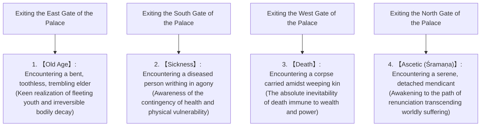

## Introduction: The Awakening of the Buddha and the Revolution in Human Intellectual History

Between the 6th and 5th centuries BCE, amidst the intellectual ferment occurring across the middle Ganges basin in ancient India—a pivotal epoch within Karl Jaspers' conceptualization of the "Axial Age"—Gautama Siddhārtha (Pāli: Gotama Siddhattha) founded the philosophical and spiritual movement known as **Buddhism**. It represented the most profound intellectual and existential revolution in the history of human consciousness, radically overturning the religious and philosophical paradigms that had prevailed since the era of the Vedas and early Upaniṣads.

"Buddha" is not the proper name of a deity; rather, it is a common noun in Sanskrit and Pāli signifying the "Awakened One" or "One Who Has Realized the Truth." The core of the teaching established by Siddhārtha thoroughly discarded blind faith in an absolute creator deity as well as the bloody animal sacrifices and esoteric rituals performed by the hereditary priestly caste (Brahmins). Instead, it calmly and unflinchingly confronted the fundamental condition of human existence—structural suffering (*dukkha*)—dissected its etiology through causal analysis, and articulated a path of liberation (*mokṣa* / *nibbāna*) realized through disciplined personal observation and empirical practice: an epistemic praxis of natural law (*dharma*).

Buddhism fundamentally transcends the modern Western taxonomy of "religion." It functioned simultaneously as an exceptionally rigorous cognitive science, a radical form of psychotherapy, a critique of language, and an ontological phenomenology. This treatise reconstructs the totality of early Buddhism with uncompromising academic rigor: Siddhārtha's existential trajectory and philosophical turning point; the mathematical and logical architecture of the Four Noble Truths, the Noble Eightfold Path, and the Twelve Links of Dependent Origination; the ontological deconstruction of the Five Aggregates and Non-Self (*anattā*); philological readings of the earliest Pāli strata; and the profound subterranean resonance connecting early Buddhist thought with contemporary cognitive neuroscience, phenomenology, and secular mindfulness.

```
[The Paradigm Shift of Buddhism in Ancient Indian Intellectual History]

┌──────────────────┬───────────────────────────────┬───────────────────────────────┐
│ Dimension        │ Orthodox Brahmanism & Upaniṣads│ Early Buddhism (Gautama Buddha)│
├──────────────────┼───────────────────────────────┼───────────────────────────────┤
│ Ultimate Reality │ Brahman (Cosmic Absolute,     │ Dharma (Law of Dependent      │
│                  │ uncaused metaphysical ground) │ Origination, causal regularity│
│ Concept of Self  │ Ātman (Eternal, immutable,    │ Anattā (Non-Self: radical     │
│ (The Soul)       │ indestructible True Self)     │ deconstruction of substance)  │
│ Path to          │ Intuition of Brahman-Ātman    │ Four Noble Truths, Eightfold  │
│ Liberation       │ identity, rituals, asceticism │ Path, Middle Way, Vipassanā   │
│ Worldview &      │ Affirmation of caste system   │ Rejection of caste hierarchy, │
│ Society          │ (Varṇa-dharma)                │ spiritual egalitarianism      │
│ Epistemology     │ Surrender to Vedic authority  │ Ehipassiko (Direct empirical  │
│                  │ (Śruti / revelation)          │ observation and rational test)│
└──────────────────┴───────────────────────────────┴───────────────────────────────┘
```

---

## 1. The Life of Gautama Siddhārtha and His Intellectual Transformation

### 1.1 Birth as Prince of the Śākyas and the Shock of the Four Sights
Gautama Siddhārtha was born in Lumbinī (in modern-day southern Nepal) at the foot of the Himalayas, as the crown prince of King Śuddhodana and Queen Māyā of the Śākya clan, which governed the aristocratic city-state of Kapilavastu.

According to later devotional hagiography, Siddhārtha took seven steps in each cardinal direction immediately after birth and declared, "Above heaven and below heaven, I alone am venerable." Viewed through the lens of modern historical-critical philology, however, he was born into the kṣatriya (warrior-aristocrat) ruling class of an eastern Indian oligarchic confederacy (*gaṇa-saṅgha*), enjoying an extraordinarily luxurious and sheltered aristocratic youth. Deeply terrified by prophecies that his son would renounce the throne to become an ascetic wanderer, King Śuddhodana constructed three magnificent palaces customized for the three seasons (summer, rainy season, and winter). He surrounded Siddhārtha with lavish music, banquets, and beautiful courtiers, striving systematically to shield the young prince from the grotesque realities of human frailty, senescence, morbidity, and death.

Yet Siddhārtha's acute intellect and existential sensitivity penetrated the illusion of this artificial paradise. This awakening is immortalized in the celebrated legend of the **Four Sights** (*catur-nimitta*).



The narrative of the Four Sights represents far more than an allegory; it provides a universal paradigm of the **Existential Crisis**. Regardless of how wealthy, powerful, or physically robust an individual may be, no human being can escape the three inexorable boundaries of aging, illness, and mortality. Beholding the elderly, the sick, and the dead, Siddhārtha realized that these were not distant calamities befalling others in a remote future, but his own inescapable fate unfolding here and now. This profound existential despair and lucidity served as the catalytic engine compelling him to make the "Great Renunciation" (*abhiniṣkramaṇa*) at the age of twenty-nine.

### 1.2 Renunciation, Mentorship, Extreme Asceticism, and Its Disillusionment
Abandoning his wife Yaśodharā, his newborn infant son Rāhula, and all claims to dynastic power, Siddhārtha shaved his head, donned coarse ochre robes, and stepped into the wilderness as a *śramaṇa*—a homeless truth-seeker operating outside Vedic orthodoxy.

He initially placed himself under the tutelage of two renowned contemplative masters of his day:
1. **Āḷāra Kālāma**: Master of the meditative absorption known as the "Sphere of Nothingness" (*ākiñcaññāyatana*). While Siddhārtha mastered this state in short order, he realized that upon emerging from trance, worldly vexations and subconscious afflictions resumed. Concluding that this was not ultimate liberation, he departed.
2. **Uddaka Rāmaputta**: Master of the "Sphere of Neither-Perception-Nor-Non-Perception" (*nevasaññānāsaññāyatana*), the highest reachable realm of formless absorption. Siddhārtha attained equal mastery with his teacher but once more recognized that it failed to uproot the foundational substratum of suffering.

Having exhausted the limits of purely psychic absorption, Siddhārtha turned to the radical mortification of the physical body (*tapas*) to conquer and incinerate desire. In the forest of Uruvelā within the kingdom of Magadha, joined by five ascetic companions (Koṇḍañña and his peers), he engaged in harrowing austerities for six years: extreme breath-retention until intense cranial pressure threatened his life, prolonged exposure to scorching heat and bitter cold, and near-total starvation, reducing his nourishment to a single sesame seed or grain of rice per day.

Consequently, Siddhārtha's frame was reduced to skin and bone; his ribs protruded like rafters of a dilapidated roof, his spine stood out like a chain of beads, his scalp withered like a dried bitter gourd, and his eyes sank deep within their sockets. When he sought to touch his stomach, he grasped his backbone. Yet, on the precipice of physical dissolution, the luminous clarity of spiritual awakening remained elusive. At this threshold of death, Siddhārtha arrived at an epoch-making insight:

> **"Self-mortification that tortures the flesh merely destroys the body and exhausts the mind; it does not yield true wisdom or awakening. Just as immersion in sensual indulgence (hedonism) is erroneous, so too is self-tormenting asceticism (mortification)."**

Siddhārtha resolved to abandon asceticism entirely. He bathed in the waters of the Nairañjanā River to wash away six years of accumulated filth. Collapsing on the riverbank in complete exhaustion, he accepted a bowl of fresh rice milk (*pāyasa*) offered by a village maiden named Sujātā. As physical vitality returned to his emaciated limbs, his five ascetic companions recoiled in disgust, accusing Gautama of succumbing to moral laxity and indulgence, and deserted him.

```
[Sublation of the Two Extremes and Discovery of the Middle Way (Majjhimā Paṭipadā)]

Sensual Indulgence (Worldly Hedonism)  <───── [Middle Way] ─────>  Self-Mortification (Extreme Tapas)
(Princely Splendor in Palaces)          (Prajñā & Tranquility)      (Forest of Uruvelā)
*Analogy of the Lute: If strings are tuned too tight, they snap; if too loose, they produce no tone.
 Only balanced attunement produces sublime harmony.
```

### 1.3 Enlightenment Under the Bodhi Tree: Confrontation with Māra and the Birth of the Buddha
Having regained physical strength, Siddhārtha walked to Bodh Gayā, sat cross-legged upon a cushion of kuśa grass beneath the Aśvattha tree (later known as the Bodhi Tree), and made an irrevocable vow:
**"Though my skin, sinews, and bones wither, and all the flesh and blood of my body dry up, I shall not leave this seat until I have attained supreme and complete awakening."**

In Buddhist narrative literature, all the subconscious cravings, terrors, attachments, and egoistic illusions latent within Siddhārtha's psyche manifested personified as **Māra Pāpīyān** (the Evil One, personification of death and desire).
Māra first dispatched his three daughters (Taṇhā/Craving, Arati/Discontent, and Rāga/Lust) to seduce Siddhārtha. When Siddhārtha remained unmoved, Māra hurled tempests, torrential rains, fireballs, and legions of monstrous demons to shatter his psyche through terror. Finally, Māra challenged Siddhārtha's authority: "By what right or witness do you claim the seat of liberation?" Siddhārtha silently lowered his right hand and touched the earth with his fingertips—the **Earth-Touching Mudrā** (*bhūmisparśa mudrā*). The earth thundered in response: "I bear witness to his selfless perfection throughout countless lives!" Māra's hosts dissolved into mist, and all defilements (*kilesas*) were forever vanquished.

Through the three watches of that full moon night, Siddhārtha ascended the stages of awakening (*tevijjā*):
- **First Watch (6:00 PM – 10:00 PM)**: He attained the knowledge of recollecting his own past existences (*pubbenivāsānussati-ñāṇa*).
- **Second Watch (10:00 PM – 2:00 AM)**: He attained the divine eye (*dibba-cakkhu*), perceiving the transmigration of all beings through the cosmos according to their karma.
- **Third Watch (2:00 AM – 6:00 AM)**: As the morning star crested the eastern horizon, he attained the knowledge of the destruction of all taints (*āsavakkhaya-ñāṇa*), contemplating the Twelve Links of Dependent Origination (*paṭicca-samuppāda*) in direct and reverse order, entirely rooting out ignorance (*avijjā*).

At this moment, Siddhārtha realized Unsurpassed Complete Awakening (*anuttara-samyak-sambodhi*) and became the **Buddha** (the Awakened One, Śākyamuni) at the age of thirty-five.

### 1.4 The Request of Brahmā and the First Sermon: From Silence to a World Religion
Following his awakening, the Buddha remained immersed in the bliss of emancipation, hesitating to disclose the Dharma to humanity. "This Dhamma I have realized is profound, difficult to see, difficult to comprehend, tranquil, sublime, beyond the sphere of discursive thought, subtle, to be experienced by the wise. Mankind, however, delights in attachment, is captivated by attachment. If I were to teach the Dhamma, they would not understand me, resulting only in weariness and vexation." He contemplated resting in silent nirvana.

According to the canonical texts, Brahmā Sahampati, the supreme deity of the ancient Indian cosmos, descended from the heavens, knelt with folded palms before the Buddha, and implored him three times (**Brahmā-yācana**):
"May the Blessed One teach the Dhamma! There are beings with little dust in their eyes; through not hearing the Dhamma, they are perishing. They will understand the truth."

Gazing across the world with the compassionate eye of an Awakened One, the Buddha saw humanity through the metaphor of lotus flowers in a pond: some lotuses remain immersed in deep mud, others float at the water's surface, and still others rise completely above the muddy water, blooming immaculate. Recognizing the diversity of human faculties, he broke his silence:

> **"Open are the doors to the Deathless! Let those who have ears to hear show forth their faith!"**

The Buddha walked hundreds of kilometers to the Deer Park (Isipatana / modern Sārnāth) near Vārāṇasī to locate his five former ascetic companions. When the five monks saw the Buddha approaching, they initially agreed among themselves to snub him as a fallen backslider. Yet, overwhelmed by his sheer majestic stillness and radiant aura, they instinctively stood up, washed his feet, and prepared an honored seat.

To these five ascetics, the Buddha delivered the first sermon in Buddhist history: **Setting the Wheel of Dhamma in Motion** (*Dhammacakkappavattana Sutta*). Here he expounded the Middle Way, the Four Noble Truths, and the Noble Eightfold Path. As he spoke, the eldest monk, Koṇḍañña, had the pristine "Eye of the Dhamma" (*dhamma-cakkhu*) opened within him: "Whatever is subject to origination is all subject to cessation." Thus were established on earth the Three Jewels (*Triratna*): the Buddha (the Awakened Teacher), the Dharma (the Truth), and the Saṅgha (the Community of Practitioners).

---

## 2. Core of Buddhist Doctrine: Logical Architecture of the Four Noble Truths (Cattāri Ariyasaccāni)

The teaching of the Buddha does not present itself as metaphysical revelation or dogmatic mythology; rather, it applies the structural methodology of ancient Indian clinical medicine (Āyurveda)—comprising diagnosis, etiology, prognosis, and prescription—to the realm of existential consciousness. This foundational paradigm constitutes the **Four Noble Truths** (*cattāri ariyasaccāni*).

```
[Structural Homology: Medical Diagnostic Paradigm and the Four Noble Truths]

┌──────────────────┬───────────────────────────────┬───────────────────────────────┐
│ Medical Model    │ Four Noble Truths of Buddhism │ Existential Function & Meaning│
├──────────────────┼───────────────────────────────┼───────────────────────────────┤
│ 1. Diagnosis     │ Dukkha-sacca (Noble Truth of  │ Existence in conditioned samsāra│
│                  │ Suffering)                    │ is fundamentally unsatisfactory│
│ 2. Etiology      │ Samudaya-sacca (Noble Truth of│ The proximate root cause of   │
│                  │ the Origin of Suffering)      │ suffering is Craving (Taṇhā)  │
│ 3. Prognosis     │ Nirodha-sacca (Noble Truth of │ Uprooting craving yields the  │
│                  │ the Cessation of Suffering)   │ state of Nirvana (Nibbāna)    │
│ 4. Prescription  │ Magga-sacca (Noble Truth of   │ The systematic therapeutic    │
│                  │ the Path to Cessation)        │ regimen: Noble Eightfold Path │
└──────────────────┴───────────────────────────────┴───────────────────────────────┘
```

### 2.1 Dukkha-sacca: The Structural "Unsatisfactoriness" of Existence
When Buddhism declares *Sabbe saṅkhārā dukkhā* ("All conditioned phenomena are dukkha"), the term *dukkha* denotes far more than mere physical pain, grief, or transient emotional melancholy.
Etymologically, *dukkha* derives from the prefix *du* (ill, wrong, difficult) and *kha* (the axle-hole of a wheel). It depicts a cart wheel whose axle does not fit properly, causing constant friction, jarring, and structural instability. In its deep philosophical sense, *dukkha* signifies **uncontrollability, radical impermanence, and pervasive structural unsatisfactoriness**.

Early Buddhism systematically cataloged this existential condition through the schema of the **Four and Eight Sufferings**:

1. **Jāti (Suffering of Birth)**: The physical trauma of entering somatic existence and the burden of living.
2. **Jarā (Suffering of Aging)**: The gradual, irreversible decay of physical faculties and cognitive vitality.
3. **Byādhi (Suffering of Sickness)**: The somatic and psychological agony of illness and bodily vulnerability.
4. **Maraṇa (Suffering of Death)**: The terror of physical dissolution and existential annihilation.
5. **Piya-vippayoga (Separation from the Loved)**: The grief of being parted from cherished people, objects, or states.
6. **Appiya-sampayoga (Association with the Unpleasant)**: The friction of being forced into contact with hostile or aversive conditions.
7. **Yam picchaṃ na labhati tampi (Unfulfilled Desires)**: The psychological frustration of failing to obtain what one craves.
8. **Pañc'upādānakkhandhā dukkhā (Suffering of Clinging to the Five Aggregates)**: The all-encompassing distress that arises from grasping the five transient aggregates as a solid, permanent "I".

### 2.2 Samudaya-sacca: The Generative Mechanism of Dukkha and "Craving"
If suffering exists as an empirical reality, it must arise from an identifiable causal mechanism. The Truth of the Origin diagnoses the root cause of suffering as **Craving** (*taṇhā*, literally "thirst").
*Taṇhā* is the insatiable, blind grasping impulse comparable to a traveler dying of thirst in a desert, desperately drinking saltwater.

The Buddha delineated three primary modalities of craving:
- **Kāma-taṇhā (Sensual Craving)**: Grasping after the fleeting pleasures derived from the sensory organs (sight, sound, smell, taste, touch).
- **Bhava-taṇhā (Craving for Existence/Becoming)**: The primal instinct toward self-perpetuation, the longing for eternal soul-preservation, fame, power, and continuous becoming.
- **Vibhava-taṇhā (Craving for Non-Existence/Annihilation)**: The reactive impulse to flee pain by wishing for complete self-obliteration, destruction, or nihilistic suicide.

The peril of craving lies in its recursive, addictive feedback loop: drinking saltwater never satisfies thirst; it only heightens somatic torment, entangling consciousness ever more tightly within the wheels of saṃsāra.

### 2.3 Nirodha-sacca: The Complete Cessation of Suffering and "Nirvana"
Just as removing the pathogen restores physiological health, entirely extirpating craving brings about the total cessation of suffering. This is the Truth of Cessation: **Nirvana** (Pāli: *Nibbāna*).

Etymologically derived from *nir* (out) + *vā* (to blow), *nibbāna* literally means "to blow out" or "extinguish." It signifies the complete cooling and extinction of the Three Poisons: the fires of Greed (*lobha* / *rāga*), Ill-will (*dosa*), and Delusion (*moha*). Nirvana is not a posthumous celestial realm or a nihilistic void; it is the **unconditioned state of serene peace, absolute clarity, and existential freedom realized here and now (*diṭṭhadhammanibbāna*)**.

### 2.4 Magga-sacca: The Concrete Prescription Leading to Nirvana — The "Noble Eightfold Path"
The practical methodology for bringing about the cessation of suffering is the Truth of the Path: the **Noble Eightfold Path** (*ariyo aṭṭhaṅgiko maggo*). It comprises eight factors organized into the **Threefold Training** (*tisso sikkhā*): Wisdom (*paññā*), Ethical Conduct (*sīla*), and Mental Concentration (*samādhi*).

```
[Structure of the Noble Eightfold Path and Correspondence to the Three Trainings]

┌──────────────────┬───────────────────────────────┬───────────────────────────────┐
│ Threefold Training│ Eightfold Path Factor         │ Practical Definition & Role   │
├──────────────────┼───────────────────────────────┼───────────────────────────────┤
│ Wisdom           │ 1. Right View (Sammā-diṭṭhi)  │ Penetrating insight into Four │
│ (Paññā)          │                               │ Truths, Karma, and Conditionality│
│                  │ 2. Right Resolve              │ Aspiration free from ill-will,│
│                  │    (Sammā-saṅkappa)           │ cruelty, and sensual craving  │
├──────────────────┼───────────────────────────────┼───────────────────────────────┤
│ Ethical Conduct  │ 3. Right Speech (Sammā-vācā)  │ Abstaining from falsehood,    │
│ (Sīla)           │                               │ slander, harshness, and idle talk│
│                  │ 4. Right Action               │ Abstaining from killing,      │
│                  │    (Sammā-kammanta)           │ stealing, and sexual misconduct│
│                  │ 5. Right Livelihood           │ Earning an honest living free │
│                  │    (Sammā-ājīva)              │ from weapons, poisons, slaves │
├──────────────────┼───────────────────────────────┼───────────────────────────────┤
│ Concentration    │ 6. Right Effort (Sammā-vāyāma)│ Diligence to abandon evil and │
│ (Samādhi)        │                               │ cultivate wholesome qualities │
│                  │ 7. Right Mindfulness          │ Bare objective awareness of   │
│                  │    (Sammā-sati)               │ body, feelings, mind, phenomena│
│                  │ 8. Right Concentration        │ Unification of mind through   │
│                  │    (Sammā-samādhi)            │ the four meditative jhānas    │
└──────────────────┴───────────────────────────────┴───────────────────────────────┘
```

The Noble Eightfold Path does not represent a disjointed, sequential checklist; it functions as an integrated organic system, resembling eight interwoven spokes of a single wheel. Right View provides the epistemic horizon; ethical disciplines (Right Speech, Action, Livelihood) stabilize social action and psychological guiltlessness; meditative disciplines (Right Effort, Mindfulness, Concentration) purify and stabilize the mind, which in turn elevates Right View into direct, non-dual realization of reality as it is.

---

## 3. The Abyssal Ontology: Dependent Origination (Twelve Nidānas) and the Five Aggregates

### 3.1 Paṭicca-samuppāda: The Buddha's Supreme Discovery
The philosophical foundation of early Buddhism, which distinguishes it from every other system of ancient and modern metaphysics, is **Dependent Origination** (*paṭicca-samuppāda*).
It denotes that all phenomena arise strictly conditioned by antecedent relations (*conditioned co-production*).

In the *Saṃyutta Nikāya*, the Buddha formulated this principle with succinct, quasi-mathematical precision:

> **"When this exists, that comes to be; with the arising of this, that arises.**
> **When this does not exist, that does not come to be; with the cessation of this, that ceases."**

Nothing in the cosmos—whether physical matter, subjective sensations, cognitive structures, or social systems—possesses an autonomous, unconditioned, independent essence (*svabhāva*). All phenomena arise as temporary manifestations within an infinitely interconnected matrix (the jewel-net of Indra). Buddhism rejects an omnipotent prime mover, an eternal pantheistic substance, and an uncaused first principle. When conditions assemble, phenomena emerge; when conditions dissolve, phenomena vanish. This is the unvarying, universal order of reality (*Dhamma*).

### 3.2 The Chain of the Twelve Nidānas (Twelve Links of Dependent Origination)
During the night of his awakening, the Buddha articulated the precise causal nexus explaining why human beings remain bound to the trauma of aging, death, and cyclic rebirth through twelve interconnected nodes (*nidānas*).

```mermaid
graph LR
    A["1. Ignorance<br/>(Avijjā)"] --> B["2. Volitional Formations<br/>(Saṅkhāra)"]
    B --> C["3. Consciousness<br/>(Viññāṇa)"]
    C --> D["4. Name-and-Form<br/>(Nāmarūpa)"]
    D --> E["5. Six Sense Bases<br/>(Saḷāyatana)"]
    E --> F["6. Contact<br/>(Phassa)"]
    F --> G["7. Feeling<br/>(Vedanā)"]
    G --> H["8. Craving<br/>(Taṇhā)"]
    H --> I["9. Clinging<br/>(Upādāna)"]
    I --> J["10. Becoming<br/>(Bhava)"]
    J --> K["11. Birth<br/>(Jāti)"]
    K --> L["12. Aging & Death<br/>(Jarāmaraṇa)"]
```



```
[The Twelve Links of Dependent Origination and Psychological Evolution]

1. Avijjā (Ignorance): Foundational delusion; blindness to the Four Truths and Non-Self.
2. Saṅkhāra (Volitional Formations): Karmic impulses and habitual volitional drives.
3. Viññāṇa (Consciousness): Cognitive discernment, including the relinking consciousness.
4. Nāmarūpa (Name-and-Form): Integration of psychic functions (nāma) and physical body (rūpa).
5. Saḷāyatana (Six Sense Bases): The five physical senses plus the mind as sixth sense organ.
6. Phassa (Contact): The confluence of sense organ, external sense object, and consciousness.
7. Vedanā (Feeling / Affect): The hedonic tone produced by contact (pleasant, unpleasant, neutral).
8. Taṇhā (Craving): The reflexive compulsive drive to grasp pleasure and push away pain.
9. Upādāna (Clinging): Intensified grasping, reifying objects and views as "mine."
10. Bhava (Becoming): Existential momentum, the energetic matrix producing karmic rebirth.
11. Jāti (Birth): The emergence of a new individual existence in a life form.
12. Jarāmaraṇa (Aging and Death): Inevitable physiological decay, sorrow, lamentation, and demise.
```

The profound discovery of the Twelve Nidānas lies in its identification of **Ignorance (*avijjā*)** as the ultimate generative root of suffering.
Crucially, this causal sequence can be reversed (**Nirodha-vāra / Order of Cessation**):
When ignorance is completely eradicated by wisdom, volitional formations cease; when volitional formations cease, consciousness ceases... ending clinging, becoming, birth, and the entire colossal mass of sorrow and decay. Liberation is thus not achieved through divine intervention or mystical grace, but through the rigorous, logical dismantling of psychological causality.

### 3.3 Pañca-khandhā: The Deconstruction of the Self
What, then, is the entity we designate as "I"?
The Buddha categorically rejected the existence of a permanent, unified soul (*ātman*), deconstructing human personality into five dynamic, interacting aggregates: the **Five Aggregates** (*pañca-khandhā*).

1. **Rūpa (Form / Materiality)**: The somatic organism, the physical sense organs, and external material objects.
2. **Vedanā (Feeling / Sensation)**: The raw affective tone experienced upon sensory contact (pleasant, unpleasant, or neutral).
3. **Saññā (Perception / Apperception)**: The conceptual faculty that identifies, labels, categorizes, and matches sensory inputs against memory.
4. **Saṅkhāra (Mental Formations / Volitions)**: The dynamic intentional states, including desires, emotions, habits, and will, that steer consciousness into action.
5. **Viññāṇa (Consciousness)**: The baseline awareness and ongoing discernment of sensory and mental phenomena.

The Buddha questioned his disciples:
"Is each of the five aggregates permanent or impermanent?"
"Impermanent, Venerable Sir."
"And is that which is impermanent painful or pleasant?"
"Painful, Venerable Sir."
"Then is it fitting to regard that which is impermanent, painful, and subject to change as: 'This is mine, this I am, this is my true self'?"
"No, Venerable Sir."

A human being is not an immutable substance; rather, it is a rapid, dynamic, self-organizing **process**. Just as the noun "chariot" is merely a conventional designation for the functional assemblage of wheels, axle, chassis, and reins, so too the terms "self," "individual," and "person" are mere pragmatic labels assigned to an ever-flowing nexus of the five aggregates.

---

## 4. The Philosophy of Non-Self (Anattā): Deconstruction of Substantial Selfhood and Existential Freedom

### 4.1 Anattā vs. Upanishadic Ātman
The supreme pinnacle of early Buddhist philosophy—and its most frequently misunderstood doctrine—is **Non-Self** (*anattā* / Sanskrit: *anātman*).

The dominant paradigm of classical Indian philosophy (the Upaniṣadic tradition) posited that beneath the fluctuating surface of the physical body and mental states dwells an eternal, uncreated, pure witness-consciousness: the **Ātman** (the True Self). It taught that realizing the ontological identity of this Ātman with the ground of the universe, Brahman (*Brahmatmā-aikyam* / "Thou art That"), constitutes ultimate liberation.

In stark contrast, the Buddha proclaimed *Sabbe dhammā anattā* ("All phenomena are devoid of self"), dismantling the metaphysical reality of the Ātman.
The Buddha's logical deduction is impeccably empirical:
If any element of mind or body were truly my "Self," it would be subject to my sovereign volitional command. Can one command one's body, "Let my cells never age, let disease never touch me"? Can one command one's emotions or thoughts never to wander into sadness, anxiety, or distraction? One cannot. Why? Because they are conditioned phenomena emerging and vanishing strictly according to impersonal causes (*nidānas*). That which cannot be subjected to absolute mastery cannot logically be designated as "mine" or "my self." Search where one might across the five aggregates, no permanent metaphysical ego can be located.

```
[Epistemological Conflict: Ātman Realism vs. Buddhist Anattā Doctrine]

■ Upaniṣadic Substantialism (Ātman)
Behind the stream of body, feeling, and thought, an eternal, indestructible,
pure "Soul as Observer" resides.
*Seeks salvation of the soul, but falls into the trap of reifying attachment to self.

■ Early Buddhist Phenomenalism / Process Philosophy (Anattā)
Body, feeling, and thought flow in causal interdependence; no hidden observer exists.
There is seeing, but no seer; experiencing, but no experiencer; deed, but no doer.
*Deconstructs the very illusion of "I", severing the root of all clinging.
```

### 4.2 Three and Four Dharma Seals: Universal Hallmarks of Reality
The immutable criteria that validate any genuine Buddhist teaching are the **Dharma Seals** (*dhamma-muddā*):

1. **Sabbe saṅkhārā aniccā (All conditioned things are impermanent)**:
   Every compounded phenomenon (*saṅkhāra*) is in relentless, perpetual flux. Nowhere in the universe does a static, unyielding substance exist.
2. **Sabbe dhammā anattā (All phenomena are non-self)**:
   Not only conditioned things (*saṅkhāra*), but all phenomena whatsoever (*dhamma*, including unconditioned Nirvana) are entirely devoid of an intrinsic ego or independent essence.
3. **Nibbānaṃ santaṃ (Nirvana is peace)**:
   The state wherein the fires of grasping and ignorance have been extinguished is absolute, unshakeable tranquility.
4. **Sabbe saṅkhārā dukkhā (All conditioned things are unsatisfactory)**:
   When impermanent things are mistakenly grasped as permanent, and non-self phenomena are clung to as "I," profound existential suffering inevitably ensues (often combined with the Three Seals to form the Four Dharma Seals).

*Anattā* is emphatically not **Nihilism** (*ucchedavāda*). The Buddha rejected the nihilistic view that "death annihilates everything into absolute nothingness" with the same vigor that he rejected the eternalist view (*sassatavāda*) that "the soul endures forever." Non-self does not deny the continuity of experience or ethical responsibility; it dissolves the conceptual fiction of a permanent ego, liberating human consciousness to engage directly with the fluid reality of the present moment.

---

## 5. Philological Reading of Early Suttas and the Formation of the Saṅgha

### 5.1 Historical Formation of the Pāli Canon and the First Buddhist Council (Saṅgīti)
The Buddha wrote down none of his teachings. In ancient India, sacred traditions were transmitted not through written script, but through rigorous oral recitation and memorization preserved across generations from teacher to student.

Following the Buddha's Parinirvāṇa at age eighty in Kuśinagara, five hundred Arahants convened at the Sattapaṇṇi Cave near Rājagaha (modern Rājgīr) under the presidency of Elder Mahākassapa. This historic assembly was the **First Buddhist Council** (*Paṭhama-saṅgīti* / communal chanting).

```
[Establishment of the Two Major Traditions at the First Buddhist Council]

1. Recitation of the Sutta Piṭaka (Basket of Discourses)
   - Reciter: Ānanda (the Buddha's cousin and personal attendant for 25 years, "Foremost in Learning")
   - Opening Formula: "Thus have I heard" (Evaṃ me sutaṃ)
   - Scope: The Buddha's contextual dialogues, sermons, and parabolic teachings suited to specific audiences.

2. Recitation of the Vinaya Piṭaka (Basket of Monastic Discipline)
   - Reciter: Upāli (formerly an underprivileged court barber, "Foremost in Upholding Discipline")
   - Scope: The ethical precepts for monks and nuns, community jurisprudence, and organizational bylaws.
```

Centuries later, following sectarian schisms and geopolitical turbulence, the Theravāda monastic order faced severe crises in 1st-century BCE Sri Lanka, precipitated by Tamil invasions and catastrophic famine. To avert the loss of oral transmission, the Tipitaka was transcribed for the first time in history onto palm leaves (*ola*) in the Pāli language at the Aluvihāra rock temple. This corpus survives today as the **Pāli Canon** (*Tipitaka*).

### 5.2 The Most Archaic Strata: Philosophy of the Sutta Nipāta and Dhammapada
Modern philological scholarship (exemplified by Hajime Nakamura, Edwin Arnold, and T.W. Rhys Davids) has isolated the most archaic linguistic strata within the Pāli texts—specifically the *Aṭṭhakavagga* (Book of Eights) and *Pārāyanavagga* (Way to the Far Shore) of the *Sutta Nipāta*, alongside portions of the *Dhammapada*.

In these earliest poetic texts, the Buddha appears not as a deified cosmic figure enthroned amidst celestial bodhisattvas, but as an austere, solitary philosopher clad in rag-robes, carrying an earthen bowl, and traversing the untamed wilderness:

> **"Wander alone like a rhinoceros horn."**
> (*Sutta Nipāta*, Khaggavisāṇa Sutta, I.3)
> Mingling with others breeds affection and clinging; from affection springs suffering. Stepping back from dogmatic sectarian disputes and worldly vanity, self-contained and serene, wander alone like the single horn of a rhinoceros.

> **"Hatred is never appeased by hatred in this world.**
> **By non-hatred alone is hatred appeased. This is an eternal truth."**
> (*Dhammapada*, verse 5)

In these archaic texts, the Buddha dismissed abstract metaphysical disputes ("Is the universe infinite or finite?", "Are the soul and body identical or distinct?", "Does the Tathāgata exist after death?") as unbeneficial speculative thickets (*diṭṭhigahana*).
As demonstrated in the famous **Parable of the Poisoned Arrow** (*Cūḷamālukya Sutta*), a warrior struck by an envenomed arrow must not waste precious time interrogating the caste of the archer, the wood of the shaft, or the feather of the fletching; his immediate, urgent task is to extract the arrow and apply the medicine. The Buddha's concern was exclusively focused on the direct, existential resolution of human suffering.

### 5.3 Political and Organizational Engineering of the Early Saṅgha: Pāṭimokkha and Consensual Democracy
The monastic order founded by the Buddha, the **Saṅgha**, was not a dogmatic ecclesiastical hierarchy, but one of the earliest recorded examples of a **direct-democratic, self-governing cooperative**.

In an ancient Indian society fractured by rigid caste stratifications (*varṇa*) and autocracies, the Saṅgha served as an egalitarian sanctuary. Upon entering the Saṅgha, kings, warriors, merchants, and untouchables (*caṇḍāla*) were entirely stripped of secular titles and caste identity. All were recognized as spiritual equals, with precedence determined solely by the chronological seniority of ordination. When Upāli, an impoverished barber of low caste, received ordination prior to aristocratic Śākya princes such as Aniruddha and Ānanda, the royal princes humbly bowed their heads to the ground before him, venerating his spiritual seniority.

```
[Autonomous Governance System and Consensus Jurisprudence of the Early Saṅgha]

1. Saṅghakamma: Supreme Democratic Decision-Making through Unanimity
   - Major affairs (ordinations, trials for disciplinary infractions, distribution of property)
     required communal assembly and absolute consensus.
   - Motions were read once followed by three calls for objections (Ñatticatuttha-kamma).
     Unanimous silence constituted approval. A single reasoned objection blocked the resolution.

2. Uposatha: Fortnightly Ethical Purification
   - Convening on new-moon and full-moon nights, the community recited the 227 rules
     of the Pāṭimokkha rule by rule.
   - Monastics openly confessed any transgression to restore mental purity. Concealment was forbidden.

3. Pavāraṇā: Reciprocal Peer Evaluation at the Conclusion of the Rains Retreat
   - At the end of the three-month monsoon retreat (Vassa), practitioners invited mutual critique:
     "Brethren, if you have seen, heard, or suspected any fault in me, admonish me out of compassion."
```

Moreover, yielding to the persistent entreaties of his foster mother Mahāpajāpatī Gotamī, the Buddha took the revolutionary step of founding the **Bhikkhunī Saṅgha** (the monastic order for women). In an antiquity where women were regarded as chattel subservient to fathers, husbands, and sons, granting women equal institutional autonomy and formally affirming their capacity to attain the highest fruit of enlightenment (Arahantship) was an unprecedented breakthrough in the history of religion and human rights.

---

## 6. Structural Transition: From Early Buddhism to Abhidharma and Mahāyāna

### 6.1 Abhidharma (Treatises): Microscopic Ontological Analysis
In the centuries following the Buddha's Parinirvāṇa, the Buddhist community underwent internal division, splitting into conservative Theravāda and progressive Mahāsāṃghika branches (the Root Schism), eventually proliferating into eighteen to twenty distinct Nikāya schools (Sectarian Buddhism).

Monastic scholars within these schools constructed sprawling analytical commentaries to formalize the Buddha's teachings into a cohesive philosophical system: the **Abhidharma** (systematic philosophy of dharmas). The Sarvāstivāda school, in particular, classified all phenomena into the "Five Categories and Seventy-Five Dharmas" (*pañca-vastu-dharme*), erecting a dizzyingly intricate ontological architecture.

Over time, however, Abhidharma scholasticism grew excessively insular. Monks secluded themselves in cloisters, absorbed in pedantic semantic squabbles. This institutional elitism severed Buddhism from the lived suffering of ordinary lay society, setting the stage for a powerful reformist counter-reaction.

### 6.2 The Mahāyāna Revolution: Universal Compassion and Śūnyatā
Around the 1st century BCE to 1st century CE, an expansive spiritual renaissance arose among visionary monastics and lay communities: **Mahāyāna** (the "Great Vehicle"). It sought to transcend the pursuit of individual self-liberation (the Arahant ideal, labeled *Hīnayāna* or "Lesser Vehicle") in favor of liberating all sentient beings: the **Bodhisattva** ideal.

```
[Paradigm Comparison: Sectarian/Nikāya Buddhism vs. Mahāyāna Buddhism]

┌──────────────────┬───────────────────────────────┬───────────────────────────────┐
│ Dimension        │ Nikāya Buddhism (Scholastic)  │ Mahāyāna Buddhism             │
├──────────────────┼───────────────────────────────┼───────────────────────────────┤
│ Spiritual Ideal  │ Arahant (Personal liberation  │ Bodhisattva (Universal savior │
│                  │ from the cycle of saṃsāra)    │ vowing to liberate all beings)│
│ Core Praxis      │ Self-benefit (Monastic purity │ Mutual benefit (Integration   │
│                  │ and individual realization)   │ of wisdom and active compassion)│
│ Philosophical    │ 75 Dharmas / Substantialism   │ Śūnyatā (Emptiness), Madhyamaka,│
│ Center           │ of elemental constituents     │ Vijñaptimātratā (Mind-Only)   │
│ Scope of         │ Monastics upholding complete  │ Universal Buddhahood          │
│ Salvation        │ Vinaya discipline             │ (All beings possess Buddha-nature)│
│ Canonical Texts  │ Pāli Tipitaka, Āgamas         │ Prajñāpāramitā, Lotus, Heart, │
│                  │                               │ Avataṃsaka, Pure Land Sūtras  │
└──────────────────┴───────────────────────────────┴───────────────────────────────┘
```

The philosophical foundation of Mahāyāna was crystallized by Nāgārjuna (c. 150–250 CE) in his seminal text, the *Mūlamadhyamakakārikā* (Fundamental Verses on the Middle Way), establishing the school of **Śūnyatā** (Emptiness).
Nāgārjuna took the early Buddhist doctrine of Dependent Origination (*paṭicca-samuppāda*) to its ultimate logical conclusion: because all phenomena exist purely in relational interdependence, nothing possesses an intrinsic, independent essence (*svabhāva*). The absence of intrinsic reality is precisely what is meant by "Emptiness." Far from being a nihilistic void, Emptiness represents radical openness: precisely because entities are empty of fixed essence, transformation, development, and universal compassion are possible.

Through this evolution, early Buddhist insights expanded into the vast philosophies of Emptiness, Mind-Only (*cittamātra*), and Buddha-nature (*tathāgatagarbha*), disseminating across Central Asia, China, Korea, and Japan.

---

## 7. Profound Dialogue with Modern Thought, Cognitive Science, and Mindfulness

### 7.1 Cognitive Behavioral Therapy (CBT) and Buddhism
In contemporary psychiatric medicine, Cognitive Behavioral Therapy (CBT)—pioneered by Aaron Beck's cognitive therapy and Albert Ellis's Rational Emotive Behavior Therapy (REBT)—shares a striking structural isomorphism with the Four Noble Truths.

CBT posits that external events do not directly cause psychic distress; rather, it is our cognitive appraisals, core schemas, and automatic thoughts about events that generate depression and anxiety. This mirrors the Buddha's ancient teaching of the **Two Arrows** expounded in the *Sallatha Sutta* (*The Dart*):

> When an ordinary uninstructed person experiences physical pain, they weep, wail, and plunge into sorrow.
> They experience two kinds of pain: bodily pain and mental pain. It is as if a person were struck by an arrow, and immediately afterward struck by a second arrow.
> The physical pain is the **First Arrow**—an unavoidable sensory fact of embodied life.
> But through anger, panic, and catastrophic thought ("Why me?", "My life is ruined!"), the individual pierces themselves with the **Second Arrow**, multiplying their agony exponentially.
> The wise, mindful practitioner feels the first arrow of physical sensation, but does not fire the second arrow of mental rumination.

Buddhist Vipassanā meditation (Right Mindfulness / *sati*) is an applied cognitive discipline that uncouples the First Arrow (raw sensory input) from the Second Arrow (subconscious narrative, egoistic bias, and emotional spiraling).

### 7.2 Mindfulness (MBSR) and Cognitive Neuroscience
In 1979 at the University of Massachusetts Medical Center, Dr. Jon Kabat-Zinn stripped the meditative practice of *sati* of its Asian religious and sectarian trappings, creating an evidence-based medical protocol: **Mindfulness-Based Stress Reduction (MBSR)**.

Kabat-Zinn defined mindfulness as:
**"The awareness that arises from paying attention on purpose, in the present moment, and non-judgmentally."**

```
[Contemporary Mindfulness Meditation and Alteration of Neural Circuits]

[Default Mode Network (DMN) Hyperactivity]
- Activation of medial Prefrontal Cortex (mPFC) and Posterior Cingulate Cortex (PCC)
- Compulsive looping of past regrets, future anxieties, and rumination on self-identity
- Consumes 60–80% of total brain metabolic energy; primary engine of anxiety and depression
  ↓
[Mindfulness Practice (Sati / Breath Concentration & Somatosensory Awareness)]
- Activation of task-positive networks (Dorsolateral Prefrontal Cortex, Insula)
- Significant downregulation and decoupling of DMN activity (cooling cranial overheating)
  ↓
[Neuroplastic Structural Remodeling (Neuroplasticity)]
- Volumetric reduction and downscaled reactivity of the Amygdala (alarm system for fear/stress)
- Increased gray matter density in the Hippocampus and Prefrontal Cortex
- Dramatic elevation in emotional self-regulation, cognitive stamina, and subjective well-being
```

Modern functional magnetic resonance imaging (fMRI) studies demonstrate that Vipassanā meditation, mastered by the Buddha beneath the Bodhi tree twenty-five centuries ago, directly downregulates the brain's ego-generating network (the DMN), dampens the amygdala's fear reactivity, and physically rewires prefrontal circuits responsible for emotional equanimity.

### 7.3 Resonance with Phenomenology and Enactivism: Varela and Derrida
In modern philosophy, Buddhist Dependent Origination and Non-Self resonate profoundly with late 20th-century paradigms.

In their landmark work *The Embodied Mind* (1991), cognitive neuroscientist Francisco Varela, philosopher Evan Thompson, and psychologist Eleanor Rosch synthesized cognitive science, Maurice Merleau-Ponty's phenomenology, and early Buddhist psychology. They rejected the classical computationalist paradigm that the brain is an isolated computer passively mirroring an objective external world. Instead, they argued that cognition is **Enaction**—the ongoing bringing-forth of a world through embodied sensory-motor interaction. This corresponds directly to the early Buddhist insight regarding the reciprocal conditioning between Name-and-Form (*nāmarūpa*) and Consciousness (*viññāṇa*).

Furthermore, Jacques Derrida's strategy of **Deconstruction** (*déconstruction*), which dismantled Western metaphysics' "metaphysics of presence" (the belief in self-identical substances and transcendental signifiers), demonstrates remarkable structural alignment with the Buddha's dismantling of the Ātman into an ever-flowing, dependently originated nexus of the five aggregates. Buddhism achieved in the 5th century BCE an anti-foundationalist, process-oriented understanding of consciousness that European philosophy arrived at only after millennia of metaphysical detours.

---

## 8. Conclusion: The Universality of the Dhamma and Wisdom for Contemporary Existence

The supreme legacy left to humanity by Gautama Siddhārtha was neither an idol to be worshiped nor an inflexible dogma to be accepted on blind faith, but a manifesto of spiritual self-reliance: **"Be an island unto yourselves; let the Dhamma be your island."**

Facing death at the age of eighty, the Buddha spoke his final, immortal words of guidance to his grieving disciple Ānanda (*Mahāparinibbāna Sutta*):

> **"Therefore, Ānanda, dwell with yourselves as an island [a lamp], with yourselves as a refuge, with no other refuge;**
> **dwell with the Dhamma as an island [a lamp], with the Dhamma as a refuge, with no other refuge."**
> (*Attadīpā viharatha attasaraṇā anaññasaraṇā, dhammadīpā dhammasaraṇā anaññasaraṇā*)

Until his final breath, the Buddha refused to deify himself. He lived and died as a human being—one who had faced the terror of senescence, sickness, and death, wrestled with existential despair, and conquered it through the clear light of empirical investigation and rational discipline. He did not point toward salvation through external grace; he revealed a path whereby each human being, through their own lucid observation and ethical discipline, can illuminate the delusions of their own mind and walk under their own power into absolute liberation.

In our 21st-century civilization—besieged by information overload, unbridled commercial competition, the hyper-accelerated narcissistic craving cultivated by digital algorithms, and renewed global conflict—humanity is tormented by Craving (*taṇhā*) and Existential Distress (*dukkha*) on an unprecedented scale.
Now, more than ever, we need to return to the quiet night beneath the Bodhi tree at Bodh Gayā.
By stepping back from sensory turbulence, observing the breath, contemplating the transient flow of sensations and mental states without clinging, and relinquishing the illusion of an isolated ego, we open ourselves to an unassailable sanctuary: the peace and boundless freedom of Nirvana, waiting to be realized here and now.
