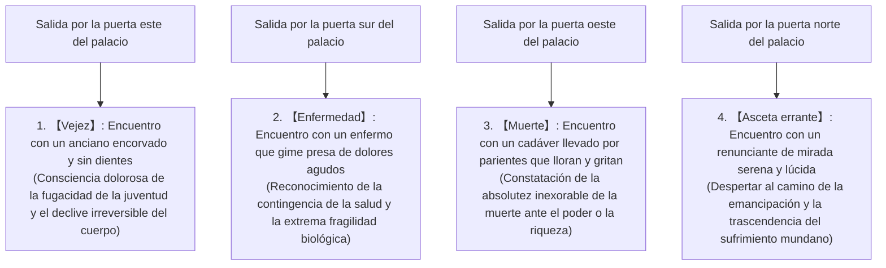

## Introducción: El nacimiento del Despierto (Buda) y la revolución en la historia del pensamiento humano

Entre los siglos VI y V a. C., en medio de la efervescencia intelectual que emergió en la cuenca media del río Ganges en la antigua India (en el marco de la denominada «Era Axial»), el budismo, fundado por Gautama Siddhartha (en sánscrito: Gautama Siddhārtha; en pali: Gotama Siddhattha), constituyó la más trascendental revolución intelectual y existencial en la historia espiritual de la humanidad, subvirtiendo radicalmente la filosofía y religión védica y upanishádica imperante hasta entonces.

El término «Buda» (Buddha) no designa el nombre propio de una deidad, sino que es un sustantivo común derivado del sánscrito y del pali que significa «el despierto» o «el iluminado» (aquel que ha discernido y realizado la verdad última). El núcleo de la enseñanza articulada por Siddhartha rechazó categóricamente la fe ciega en un dios creador absoluto del cosmos, así como los sacrificios animales y los rituales mágico-sacerdotales administrados por la casta brahmánica. En su lugar, encaró con lucidez y rigor implacables el «sufrimiento estructural intrínseco a la existencia humana» (*dukkha*), deconstruyó sus causas de manera estrictamente causalista, y concibió un saber práctico y normativo (*episteme*) orientado a alcanzar la liberación última (*mokṣa* / *nibbāna*) mediante la autoobservación sistemática y la praxis disciplinada.

El budismo trasciende con creces el marco convencional de lo que la modernidad define como «religión». Representa, a un tiempo, una ciencia cognitiva de extrema precisión, un modelo psicoterapéutico, una rigurosa crítica del lenguaje y una fenomenología ontológica. En este ensayo se elucidará con exhaustividad su arquitectura íntegra: desde el periplo vital y los giros intelectuales de Gautama Siddhartha, la estructura lógica y axiomática de las Cuatro Nobles Verdades, el Noble Óctuple Sendero y el surgimiento dependiente (*paṭicca-samuppāda*), la disección ontológica de los cinco agregados (*pañca-khandhā*) y el no-yo (*anattā*), el examen filológico de las fuentes canónicas tempranas en pali, hasta su metamorfosis histórica en el Abhidharma y el Mahāyāna, y su profundo diálogo con las neurociencias cognitivas, la fenomenología y el mindfulness contemporáneos.

```
【CAMBIO DE PARADIGMA EN LA HISTORIA DEL PENSAMIENTO DE LA INDIA ANTIGUA】

┌─────────────────┬───────────────────────────────┬───────────────────────────────┐
│ Criterio        │ Brahmanismo ortodoxo / Upanishad│ Budismo temprano (Gautama Buda)│
├─────────────────┼───────────────────────────────┼───────────────────────────────┤
│ Realidad última │ Brahman (Principio cósmico abs│ Dharma (Ley universal, orden  │
│                 │ oluto y fundamento ontológico)│ causal y surgimiento interdep)│
│ Concepción del  │ Ātman (Alma/Yo sustancial,    │ Anattā (No-yo: negación absol │
│ yo / alma       │ eterno, inmutable y divino)   │ uta de un yo sustancial o alma│
│ Vía de          │ Intuición de la identidad     │ Cuatro Nobles Verdades, Noble │
│ liberación      │ Brahman-Ātman, ritos, ascetism│ Óctuple Sendero, Vía Media    │
│ Visión del orden│ Legitimación y sacralización  │ Rechazo de la discriminación  │
│ social/mundo    │ del sistema de castas (varṇa) │ de castas; igualdad universal │
│ Método          │ Sumisión dogmática a la auto  │ Validación epistémica empírica│
│ epistemológico  │ ridad canónica de los Vedas   │ y autorrealizada (ehipassiko) │
└─────────────────┴───────────────────────────────┴───────────────────────────────┘
```

---

## 1. La vida y los giros intelectuales de Gautama Siddhartha

### 1.1 El nacimiento como príncipe del clan Śākya y el impacto de los cuatro encuentros
Gautama Siddhartha nació en Lumbinī (en el actual sur de Nepal), en las estribaciones meridionales del Himalaya, como primogénito del rey Śuddhodana y la reina Māyā, soberanos de Kapilavastu, una ciudad-estado gobernada por el clan Śākya.

Según la hagiografía tradicional, al poco de nacer dio siete pasos en las cuatro direcciones cardinales y proclamó: «Entre el cielo y la tierra, solo yo soy el venerable». No obstante, desde una perspectiva histórica y filológica rigurosa, Siddhartha perteneció a la aristocracia guerrera (*kṣatriya*) de una confederación tribal republicana (*gaṇa-saṅgha*) del este de la India, disfrutando de una existencia colmada de refinamiento, riqueza material y bienestar absoluto. Su padre, temiendo profundamente las profecías que auguraban que el príncipe renunciaría al trono para convertirse en un asceta errante, mandó erigir tres suntuosos palacios adaptados a cada una de las tres estaciones climáticas (verano, lluvias e invierno), rodeándolo de bellas doncellas, músicos y cortesanos, e instruyendo aislarlo con celo implacable de toda visión de la decrepitud, la dolencia somática o la finitud cadavérica.

Sin embargo, la penetrante agudeza intelectual y la profunda sensibilidad existencial de Siddhartha no tardaron en advertir la vacuidad e ilusión de aquel paraíso artificial. Dicha crisis espiritual se encuentra plasmada en la célebre narración canónica de los **«Cuatro Encuentros» (o las Cuatro Visiones)**.



Los cuatro encuentros no constituyen una mera alegoría mítica, sino el modelo universal de una **«crisis existencial» (Existential Crisis)**. Por inmensa que sea la opulencia, el poder o la lozanía física de un ser humano, nadie puede eludir ni por un instante los tres condicionamientos ontológicos insoslayables: envejecer, enfermar y morir. Al contemplar la decrepitud, el padecimiento y el final de otros seres, Siddhartha comprendió que no se trataba de vicisitudes ajenas proyectadas en un porvenir remoto, sino de su propio e inexorable destino inmediato. Esta desgarradora desesperación y lúcida conciencia existencial se convirtieron en el motor primordial que lo impulsó, a la edad de veintinueve años, a protagonizar la «Gran Renuncia» (el abandono definitivo del palacio).

### 1.2 La renuncia, el discipulado y el extremo ascetismo con su posterior fracaso
Dejando atrás a su esposa Yaśodharā, a su hijo recién nacido Rāhula y todas las prerrogativas del poder regio, Siddhartha se afeitó la cabeza, vistió austeros ropajes ocres y se transformó en un *śramaṇa* (asceta o filósofo errante desvinculado de las estructuras védicas) en busca de la verdad trascendente.

En una primera etapa, se instruyó bajo la guía de dos célebres maestros de meditación de la época:
1. **Āḷāra Kālāma**: Enseñaba el estadio meditativo de la «esfera de la nada» (*ākiñcaññāyatana*, un estado de refinada absorción mental donde cesa toda noción de objeto). Siddhartha dominó dicho estado con extraordinaria celeridad; sin embargo, al emerger de la absorción constató que las aflicciones y desasosiegos de la realidad fenoménica reaparecían intactos, por lo que juzgó que dicha técnica no conducía a la extinción definitiva del sufrimiento y se despidió de su maestro.
2. **Uddaka Rāmaputta**: Conducía a la «esfera de ni-percepción-ni-no-percepción» (*nevasaññānāsaññāyatana*, el límite extremo de la sutileza cognoscitiva). Al igual que en la experiencia previa, Siddhartha alcanzó el mismo nivel espiritual de su preceptor en un lapso mínimo, concluyendo nuevamente que no entrañaba la aniquilación de la raíz del sufrimiento ontológico.

Reconociendo las limitaciones inherentes a las técnicas de absorción puramente mental, resolvió subyugar las pasiones y desarraigar el deseo mediante el «ascetismo extremo» (*tapas*). En los bosques de Uruvelā, en el reino de Magadha, junto a cinco compañeros de senda ascética (los cinco *bhikkhus*, encabezados por Koṇḍañña), practicó durante seis extenuantes años rigurosas mortificaciones: retenciones respiratorias hasta el borde de la asfixia, exposición implacable al sol abrasador y prolongados ayunos en los que consumía tan solo un grano de sésamo o un grano de arroz al día.

Como consecuencia de este martirio, su cuerpo quedó reducido a piel y huesos; las costillas se le marcaban como las vigas de un tejado derrumbado, la piel del cráneo se marchitó como una calabaza reseca al sol, y al intentar incorporarse se desplomaba privado de fuerzas. No obstante, al borde mismo de la inanición y la muerte, la anhelada serenidad absoluta y el despertar a la verdad suprema no se manifestaban. En ese instante supremo de desolación, Siddhartha alcanzó una intelección decisiva en la historia del pensamiento humano:

> **«La mortificación que atormenta el cuerpo no engendra sabiduría ni iluminación; únicamente aniquila la carne y agota el intelecto. Del mismo modo que el apego ciego a los placeres sensuales (hedonismo) constituye un error, la autoaversión punitiva del ascetismo mortificante (rigorismo corporal) resulta igualmente vana y extraviada».**

Siddhartha decidió renunciar de forma irrevocable al ascetismo extremo. Se dirigió al río Nerañjarā para lavar la suciedad y las impurezas acumuladas durante seis años de martirio. Tras colapsar en la orilla exhausto, aceptó una ofrenda de arroz con leche fresca (*pāyasa*) de manos de Sujātā, una joven del poblado cercano. Al asimilar el alimento, la vitalidad biológica recorrió nuevamente sus venas. Al presenciar semejante escena, sus cinco compañeros de penitencia lo juzgaron con desdén: «Gautama ha claudicado ante la dureza de la disciplina y ha caído en la indulgencia mundana», tras lo cual lo repudiaron y lo abandonaron en soledad.

```
【SUPERACIÓN DE LOS EXTREMOS Y DESCUBRIMIENTO DEL CAMINO MEDIO (MAJJHIMĀ PAṬIPADĀ)】

Complacencia en los placeres sensuales  ←─────［CAMINO MEDIO］─────→  Mortificación autoinfligida
(Disipación hedonista de la corte)            (Sabiduría y ecuanimidad)       (Ascetismo extremo de Uruvelā)

※ Si las cuerdas del laúd están demasiado tensas, se rompen; si están flojas, no emiten sonido.
   Únicamente mediante una afinación armónica y templada brota la melodía sublime.
```

### 1.3 La iluminación bajo el árbol Bodhi: La confrontación con Māra y el surgimiento del Despierto (Buda)
Una vez restablecido su vigor somático, Siddhartha se dirigió hacia Bodh Gaya. A la sombra de un árbol asvattha (venerado posteriormente como el árbol Bodhi o *Ficus religiosa*), extendió un lecho de hierba fresca, adoptó la postura de loto completo (*padmāsana*) y pronunció un voto inquebrantable:
**«Aunque mi carne se consuma y mis huesos se quiebren y se reduzcan a polvo, jamás me levantaré de este asiento sin haber alcanzado el Despertar supremo y definitivo».**

De acuerdo con las crónicas canónicas, todas las pulsiones inconscientes, temores, dudas y apegos que hervían en las profundidades de la psique de Siddhartha se proyectaron arquetípicamente bajo la figura del rey demoníaco Māra (el Maligno o la personificación de la muerte y la ilusión).
Māra envió en primer término a sus tres seductoras hijas (Tanha / la sed o deseo voluptuoso, Arati / el descontento o aversión, y Raga / la pasión posesiva) para desestabilizar su concentración. Ante la imperturbabilidad de Siddhartha, desató vendavales huracanados, lluvias torrenciales, rocas incandescentes y huestes monstruosas de pesadilla, buscando demoler su mente mediante el terror. Finalmente, Māra increpó a Siddhartha en tono desafiante: «¿Con qué derecho y bajo qué mérito reclamas tú el trono supremo de la iluminación? ¿Quién testifica a favor de tu causa?». Siddhartha extendió con serenidad su mano derecha y tocó la tierra con la punta de los dedos (gesto arquetípico conocido como el *bhūmisparśa-mudrā* o «sello del testimonio de la tierra»). En ese instante, la tierra bramó como un trueno y proclamó: «Doy fe y testimonio de sus incontables vidas consagradas a la virtud y la compasión desinteresada». Las legiones de Māra se disiparon como la niebla al viento, extinguiéndose de raíz todas las impurezas y desórdenes mentales (*kilesas*).

Durante la primera vigilia de la noche (de 18:00 a 22:00 h), Siddhartha obtuvo el conocimiento de sus incontables existencias pretéritas (*pubbenivāsānussati-ñāṇa* / conocimiento de las vidas pasadas).
Durante la segunda vigilia (de 22:00 a 02:00 h), conquistó el «ojo divino» (*dibbacakkhu-ñāṇa*), mediante el cual percibió con diafanidad cómo todos los seres nacen, transmigran y mueren inexorablemente en conformidad con las leyes de sus propias acciones intencionales (*kamma* / karma).
Y en la tercera vigilia (de 02:00 a 06:00 h), en el momento preciso en que la estrella de la mañana resplandecía en el horizonte oriental, contempló en orden directo e inverso la concatenación causal de los Doce Eslabones del Surgimiento Dependiente (*paṭicca-samuppāda*), erradicando para siempre todas las pulsiones e impurezas contaminantes y alcanzando el conocimiento de la destrucción de las perturbaciones mentales (*āsavakkhaya-ñāṇa*).

De este modo, Siddhartha consumó la iluminación perfecta, insuperable y completa (*anuttara-sammā-sambodhi*), trascendiendo la condición ordinaria para convertirse en el **Buda (Śākyamuni Bhagavān, el Sabio del clan Śākya)**, a los treinta y cinco años de edad.

### 1.4 La petición de Brahmā (Brahmayācana) y el primer giro de la rueda del Dharma: Del silencio a la irradiación universal
Consumada la iluminación, el Buda se sumergió en una profunda meditación, experimentando la dicha de la liberación, pero dudó seriamente de comunicar a la humanidad el Dharma que había descubierto: «Este Dharma que he realizado es hondo, sutil, arduo de percibir y de comprender, sereno y sublime, inaccesible al mero raciocinio discursivo y solo inteligible para los sabios lúcidos. Mas el común de las gentes está encadenado al apego voluptuoso y ensordecido por las pasiones. Si intentase proclamarlo, no suscitaría sino fatiga, frustración e incomprensión en vano». Ante ello, resolvió permanecer en silencio y recluirse en la quietud del nirvana.

Fue en ese momento crucial cuando Brahmā Sahampati, la deidad suprema en la cosmovisión brahmánica india, descendió de los cielos celestiales, hincó la rodilla ante el Buda, unió sus palmas en señal de reverencia y le suplicó por tres veces consecutivas. Este acontecimiento es conocido canónicamente como la **«petición de Brahmā» (Brahmayācana)**:
«¡Oh Bienaventurado, proclama el Dharma! ¡Proclama la doctrina de la verdad, Señor de la compasión! En este mundo existen seres cuyos ojos están cubiertos por un tenue velo de polvo; seres dotados de noble discernimiento que, si no escuchan el Dharma, sucumbirán en la oscuridad, pero que si lo oyen comprenderán la verdad y alcanzarán la emancipación».

El Buda contempló el mundo con la mirada compasiva de un iluminado. De igual modo que en un estanque de lotos hay capullos que permanecen sumergidos en el fango denso, otros que alcanzan la superficie del agua y algunos que emergen inmaculados por encima de la corriente para desplegar sus pétalos al sol, advirtió que la humanidad alberga una amplia diversidad en sus facultades y predisposiciones espirituales. Fue entonces cuando tomó la determinación histórica de quebrar su silencio:

> **«Abiertas quedan las puertas de la inmortalidad. Que aquellos que tengan oídos para oír abandonen sus dudas y desplieguen la fe».**

El Buda emprendió una caminata de cientos de kilómetros con destino al parque de las gacelas en Isipatana (Sārnāth, cerca de Benarés), en busca de los cinco ascetas que otrora lo habían repudiado. Al verlo acercarse desde la lejanía, envuelto en una serenidad y majestad soberanas, los cinco ascetas habían acordado de antemano ignorarlo con frialdad; empero, sobrecogidos y cautivados por su presencia augusta, se pusieron en pie espontáneamente, lavaron sus pies, le dispusieron un asiento de honor y lo recibieron con profunda veneración.

Ante ellos, el Buda impartió el primer discurso doctrinal de su magisterio: la **«primera puesta en movimiento de la rueda del Dharma» (Dhammacakkappavattana Sutta)**. En dicha proclama fundacional expuso el «Camino Medio» (*Majjhimā Paṭipadā*), las «Cuatro Nobles Verdades» (*Cattāri Ariyasaccāni*) y el «Noble Óctuple Sendero» (*Ariyo Aṭṭhaṅgiko Maggo*). Mientras escuchaba la enseñanza, el venerable anciano Koṇḍañña abrió el ojo puro e inmaculado del Dharma (*dhamma-cakkhu*), comprendiendo de forma fulgurante la máxima ontológica: «Todo aquello que posee la naturaleza de originarse, posee también la naturaleza de extinguirse». Con este acontecimiento fundacional quedó instituida formalmente en la historia humana la «Triple Joya» (*Tiratana*): el Buda (el Guía/Maestro), el Dharma (la Enseñanza/Ley Cósmica) y la Sangha (la Comunidad de practicantes).

---

## 2. El fundamento doctrinal: La estructura lógica de las Cuatro Nobles Verdades (Cattāri Ariyasaccāni)

La enseñanza del Buda no se erigió sobre dogmas metafísicos ni artículos de fe ciega, sino que reprodujo con absoluta fidelidad y rigor la estructura metodológica de la medicina clásica india (el Āyurveda), compuesta por cuatro pasos clínicos: «reconocimiento de la patología, identificación de la etiología, prognosis o definición del estado de salud, y prescripción de la terapia». Constituye, por ende, una auténtica **«medicina clínica existencial»**. Este marco axial se articula en las Cuatro Nobles Verdades (*Cattāri Ariyasaccāni*).

```
【ISOMORFISMO ESTRUCTURAL ENTRE EL MODELO MÉDICO Y LAS CUATRO NOBLES VERDADES】

┌─────────────────┬───────────────────────────────┬───────────────────────────────┐
│ Modelo clínico  │ Cuatro Nobles Verdades budistas│ Definición y sentido existenci│
├─────────────────┼───────────────────────────────┼───────────────────────────────┤
│ 1. Diagnóstico  │ Dukkha-sacca (Noble verdad del│ La realidad fenoménica es fun │
│ de la patología │ sufrimiento)                  │ damentalmente insatisfactoria │
│ 2. Etiología    │ Samudaya-sacca (Noble verdad  │ El origen del sufrimiento es  │
│ del trastorno   │ del origen del sufrimiento)   │ la sed / apego ciego (taṇhā)  │
│ 3. Prognosis y  │ Nirodha-sacca (Noble verdad de│ La extinción de la sed es la  │
│ estado de salud │ la cesación del sufrimiento)  │ cesación del dolor = Nibbāna  │
│ 4. Prescripción │ Magga-sacca (Noble verdad del │ El tratamiento práctico para  │
│ terapéutica     │ sendero hacia la cesación)    │ el Nibbāna = Óctuple Sendero  │
└─────────────────┴───────────────────────────────┴───────────────────────────────┘
```

### 2.1 Dukkha-sacca: La insatisfactoriedad estructural de la existencia
Cuando el budismo postula que «todo lo condicionado es sufrimiento» (*Sabbe saṅkhārā dukkhā*), el concepto de *dukkha* desborda con creces la mera acepción de dolor físico o tristeza emocional.
Etimológicamente, la voz pali *dukkha* alude a un eje cuya cavidad (*kha*) se encuentra descentrada, torcida o defectuosa (*du*), impidiendo que la rueda gire con fluidez y produciendo continuos chirridos, sacudidas y asperezas mecánicas. En consecuencia, la esencia de *dukkha* radica en la **«imposibilidad de adecuar la realidad a nuestros deseos voluntarios»**, en una **«radical insatisfactoriedad, desajuste y fricción existencial»**.

El budismo temprano sistematizó rigurosamente esta condición en el esquema de los «ocho sufrimientos» (los cuatro básicos más cuatro complementarios):

1. **Sufrimiento del nacimiento (*Jāti-dukkha*)**: La aflicción intrínseca de nacer, ser arrojado al mundo y sostener la existencia biológica.
2. **Sufrimiento de la vejez (*Jarā-dukkha*)**: El declive inexorable de las facultades sensoriales, corporales y cognoscitivas.
3. **Sufrimiento de la enfermedad (*Byādhi-dukkha*)**: La vulnerabilidad congénita a las afecciones físicas, el dolor y la decrepitud celular.
4. **Sufrimiento de la muerte (*Maraṇa-dukkha*)**: La angustia radical ante el cese biológico y la disolución irrevocable de la identidad empírica.
5. **Sufrimiento por la separación de lo amado (*Piyavippayoga-dukkha*)**: El dolor ineludible de desprenderse de las personas, objetos o condiciones gratificantes.
6. **Sufrimiento por el encuentro con lo aborrecido (*Appiyasamprayoga-dukkha*)**: La hostilidad y el tormento de verse obligado a convivir con lo repulsivo o adverso.
7. **Sufrimiento por no obtener lo deseado (*Yampicchaṃ na labhati tampi dukkhaṃ*)**: La frustración ontológica de ver frustrados los anhelos y ambiciones humanas.
8. **Sufrimiento de los cinco agregados de apego (*Pañcupādānakkhandhā-dukkha*)**: La pesadumbre integral derivada de identificarse y aferrarse a los cinco componentes psicofísicos que constituyen el pretendido «yo».

### 2.2 Samudaya-sacca: El mecanismo de génesis del sufrimiento y la «sed» (Taṇhā)
Si el sufrimiento es un fenómeno empírico verificable, debe poseer necesariamente una causa determinante que lo origine. La Noble Verdad del Origen (*Samudaya-sacca*) penetra en dicha raíz e identifica como causa primordial la **«sed o avidez ciega» (*Taṇhā* / en sánscrito: *Tṛṣṇā*)**.
El vocablo *taṇhā* describe el impulso compulsivo, la avidez insaciable similar a la de un viajero extraviado en el desierto que, consumido por la sed, busca desesperadamente agua y se abalanza ciegamente sobre cualquier espejismo sin poder soltarlo.

El Buda categorizó la sed en tres modalidades operativas:
- **Kāma-taṇhā (Sed de placeres sensoriales)**: El anhelo y persecución incesante de gratificaciones procedentes de los órganos de los sentidos (formas visuales, sonidos, fragancias, sabores, sensaciones táctiles).
- **Bhava-taṇhā (Sed de existencia / devenir)**: La pulsión imperiosa de preservar la propia continuidad biológica y psíquica, de eternizarse, acumular estatus, poder y riquezas (el apego ciego a la autopreservación del ego).
- **Vibhava-taṇhā (Sed de no-existencia / aniquilación)**: La pulsión nihilista o destructiva que emerge ante el dolor insoportable, deseando erradicar el propio ser, abolir la conciencia o consumar la autodestrucción (el anhelo de evasión mediante la nada).

La perversidad intrínseca de *taṇhā* reside en su «dinámica adictiva» estructural: saciar la sed con placeres efímeros equivale a calmar la sed bebiendo agua salada. Cuanta más agua salina se ingiere, más voraz se torna la sed, encadenando al ser humano a un círculo vicioso interminable de insatisfacción y reexistencia (*saṃsāra*).

### 2.3 Nirodha-sacca: La cesación radical del sufrimiento y el «Nirvana»
Del mismo modo que una enfermedad remite cuando se extirpa su agente patógeno, existe un estado donde la causa del sufrimiento (*taṇhā*) se apaga de forma definitiva. Esta es la Noble Verdad de la Cesación (*Nirodha-sacca*), y designa el fin supremo del budismo: el **Nirvana (*Nibbāna* en pali; *Nirvāṇa* en sánscrito)**.

Etimológicamente, la voz *nibbāna* procede de la raíz *nir* (cesación/fuera) y *vā* (soplar), significando literalmente «extinción por soplido» o «apagado». Describe el estado en el que las «tres llamas venenosas» —la codicia/apego (*lobha/rāga*), la aversión/odio (*dosa/dveṣa*) y la ignorancia/ilusión (*moha*)— han sido sopladas y extinguidas en su totalidad, dando lugar a una serenidad límpida, diáfana e inmutable. El Nirvana no es un paraíso ultraterreno reservado a la post-muerte, sino **«un estado existencial de libertad incondicionada, alcanzable aquí y ahora, caracterizado por la erradicación total de todas las ataduras que contaminan la mente»**.

### 2.4 Magga-sacca: La prescripción terapéutica hacia el Nirvana: El Noble Óctuple Sendero
El sendero metódico y práctico para extinguir el sufrimiento y actualizar el Nirvana es la Noble Verdad del Sendero (*Magga-sacca*), cristalizada en el «Noble Óctuple Sendero» (*Ariyo aṭṭhaṅgiko maggo*). Este sendero abarca ocho factores interrelacionados que la tradición sintetiza de manera sistemática en los «Tres Entrenamientos» o «Tres Disciplinas Superiores» (*Tisso sikkhā*): Ética (*Sīla*), Concentración (*Samādhi*) y Sabiduría (*Paññā*).

```
【ARQUITECTURA DEL NOBLE ÓCTUPLE SENDERO Y SU ARTICULACIÓN EN LOS TRES ENTRENAMIENTOS】

┌───────────────┬───────────────────────────────┬───────────────────────────────┐
│ Tres Saberes  │ Factores del Óctuple Sendero  │ Definición práctica y función │
├───────────────┼───────────────────────────────┼───────────────────────────────┤
│ Sabiduría     │ 1. Recta Visión               │ Comprensión lúcida de las Cua │
│ (Paññā)       │    (Sammā-diṭṭhi)             │ tro Verdades, el karma y el or│
│               │ 2. Recto Pensamiento          │ Resolución mental exenta de co│
│               │    (Sammā-saṅkappa)           │ dicia, crueldad y malevolencia│
├───────────────┼───────────────────────────────┼───────────────────────────────┤
│ Ética         │ 3. Recta Palabra              │ Abstención de la mentira, la c│
│ (Sīla)        │    (Sammā-vācā)               │ alumnia, la ofensa y la chách │
│               │ 4. Recta Acción               │ Abstención de matar, robar y  │
│               │    (Sammā-kammanta)           │ mantener conductas sexuales da│
│               │ 5. Recto Medio de Vida        │ Sustento digno, sin comercio d│
│               │    (Sammā-ājīva)              │ e armas, seres vivos o venenos│
├───────────────┼───────────────────────────────┼───────────────────────────────┤
│ Concentración │ 6. Recto Esfuerzo             │ Diligencia en impedir el mal y│
│ (Samādhi)     │    (Sammā-vāyāma)             │ cultivar e irradiar la virtud │
│               │ 7. Recta Atención             │ Consciencia vigilante del cuer│
│               │    (Sammā-sati)               │ po, sensaciones, mente y dharm│
│               │ 8. Recta Concentración        │ Unificación de la mente en los│
│               │    (Sammā-samādhi)            │ cuatro estadios meditativos   │
└───────────────┴───────────────────────────────┴───────────────────────────────┘
```

El Óctuple Sendero no consiste en una secuencia de etapas lineales que se abandonan tras ser recorridas una a una, sino en un sistema orgánico cuyos miembros funcionan sincrónicamente como los radios de una misma rueda. La Recta Visión permite discernir el mundo con veracidad; la Ética (*sīla*) purifica la acción externa y apacigua las turbulencias de la conciencia; y la Concentración (*samādhi*) aquieta y afila la mente, permitiendo que la Sabiduría (*paññā*) penetre con mayor profundidad en la naturaleza de lo real, culminando en la liberación definitiva.

---

## 3. El abismo ontológico: Los Doce Eslabones del Surgimiento Dependiente y los Cinco Agregados

### 3.1 El Surgimiento Dependiente (Paṭicca-samuppāda): El descubrimiento cimero del Buda
La proposición fundamental que ostenta la mayor profundidad filosófica en la enseñanza del Buda y que demarca al budismo de cualquier otra corriente de pensamiento es el **«Surgimiento Dependiente» (*Paṭicca-samuppāda* en pali; *Pratītyasamutpāda* en sánscrito)**.
Dicha doctrina postula la «generación condicionada e interdependiente de todos los fenómenos».

En los discursos del Canon Pali, el Buda formuló este principio supremo con la sobria exactitud de un teorema axiomático:

> **«Cuando esto existe, aquello existe.**
> **Con el surgir de esto, aquello surge.**
> **Cuando esto no existe, aquello no existe.**
> **Con la cesación de esto, aquello cesa».**
> (*Saṃyutta Nikāya*)

Ningún fenómeno del universo (físico, psíquico, biológico o social) posee una existencia independiente, autárquica o sustancial. Todo lo que deviene lo hace suspendido en una intrincada malla de causas (*hetu*) y condiciones (*paccaya*), semejante a la célebre metáfora de la red de Indra. No existe un Creador supremo incondicionado, un Dios demiurgo ni una causa primera inmutable. Cuando las condiciones confluyen, el fenómeno emerge; cuando las condiciones se disgregan, el fenómeno se desvanece inexorablemente. Tal es el principio rector que gobierna el cosmos: el Dharma.

### 3.2 La estructura concatenada de los Doce Eslabones (Dvādaśa-nidāna)
Durante la noche de su iluminación, el Buda desentrañó los engranajes causales que atrapan a los seres en el ciclo de transmigración y sufrimiento a través de doce eslabones concatenados (*dvādaśa-nidāna*):


```
【LOS DOCE ESLABONES DEL SURGIMIENTO DEPENDIENTE Y EL DESPLIEGUE PSICOLÓGICO DE LA EXISTENCIA】

1. Ignorancia (Avijjā): Desconocimiento radical de la verdadera naturaleza de la realidad (Cuatro Nobles Verdades, anicca y anattā).
2. Formaciones volitivas (Saṅkhāra): Actos volitivos intencionales motivados por la ignorancia; predisposiciones kármicas latentes.
3. Conciencia (Viññāṇa): Actividad discriminativa de la conciencia; flujo de apercepción; conciencia de reconexión al nacer.
4. Nombre y forma (Nāmarūpa): Estructura psicofísica integral; funciones mentales sutiles (nombre) y cuerpo material (forma).
5. Seis bases sensoriales (Saḷāyatana): Los seis órganos perceptivos (ojo, oído, nariz, lengua, cuerpo y el órgano mental / manas).
6. Contacto (Phassa): Conjunción tripartita de un órgano sensorial, su correspondiente objeto externo y la conciencia respectiva.
7. Sensación (Vedanā): Tonalidad afectiva engendrada por el contacto sensorial (placentera, dolorosa o neutra).
8. Sed / Deseo (Taṇhā): Impulso voraz de apropiarse de lo placentero y repeler con aversión lo desagradable.
9. Apego / Aferramiento (Upādāna): Fijación posesiva y obsesiva sobre los objetos del deseo y las nociones del yo.
10. Devenir / Existencia (Bhava): Configuración activa de nuevos patrones de existencia sustentados en el cúmulo kármico.
11. Nacimiento (Jāti): Manifestación biológica y psicofísica en un nuevo plano de existencia.
12. Vejez y muerte (Jarāmaraṇa): Deterioro degenerativo, dolor somático, agonía, duelo y muerte que siguen fatalmente al nacer.
```

El hallazgo revolucionario de este encadenamiento radica en haber situado en la **«ignorancia» (*avijjā*)** la raíz fundamental del dolor de la vejez y la muerte.
Y, lo que es aún más decisivo, esta cadena de causalidad es plenamente susceptible de ser invertida:
Cuando la ignorancia se erradica mediante la sabiduría, las formaciones volitivas cesan. Al cesar las formaciones, cesa la conciencia condicionada... y, en última instancia, cesa el apego, cesa el renacimiento y se extingue la colosal masa de pesadumbre que suponen la vejez y la muerte (modo de cesación o *nirodha-vāra*). Para el budismo, la liberación de la servidumbre no depende de un milagro extramundano ni de la benevolencia divina, sino de una necesidad lógica desencadenada por una revolución epistémica en la conciencia del individuo.

### 3.3 Los Cinco Agregados (Pañca-khandhā): La deconstrucción ontológica del ser humano
¿Qué es verdaderamente lo que denominamos «yo»?
El Buda rechazó con determinación categórica concebir al ser humano como una sustancia fija, indivisible y eterna (un alma o *ātman*), deconstruyendo la entidad individual en una amalgama de cinco factores constitutivos interrelacionados: los **«Cinco Agregados» (*Pañca-khandhā*)**.

1. **Agregado de la materialidad (*Rūpa-khandha*)**: El cuerpo biológico, los componentes materiales y los órganos sensoriales junto con los estímulos físicos del entorno.
2. **Agregado de las sensaciones (*Vedanā-khandha*)**: La tonalidad afectiva primaria que brota del contacto sensorial (placer, aflicción o indiferencia neutral).
3. **Agregado de las percepciones (*Saññā-khandha*)**: El proceso de conceptualización, discernimiento perceptivo, nominación y contraste memorístico de los datos captados.
4. **Agregado de las formaciones mentales (*Saṅkhāra-khandha*)**: Los estados volitivos, impulsos, deseos, motivaciones e inclinaciones intencionales que direccionan y configuran el curso psíquico.
5. **Agregado de la conciencia (*Viññāṇa-khandha*)**: La facultad fundamental de registrar, apercibir y discernir la presencia de los objetos cognitivos en coordinación con los demás agregados.

El Buda interrogó reiteradamente a sus discípulos: «¿Es acaso cada uno de los cinco agregados permanente o impermanente?». «Es impermanente, venerable Señor». «Y aquello que es impermanente, ¿es fuente de sufrimiento o de bienaventuranza permanente?». «Es fuente de sufrimiento, venerable Señor». «Y de aquello que es impermanente, doloroso y sujeto al cambio y la ruina perpetuos, ¿resulta legítimo aseverar: "Esto es mío, esto soy yo, esto es mi alma (*ātman*)"?». A lo cual respondían: «De ningún modo, Señor».

El ser humano no es una entidad estática, sino un «proceso» dinámico e incesante de transformaciones vertiginosas donde estos cinco agregados interactúan recíprocamente. Del mismo modo que un carruaje no es una sustancia trascendente más allá de sus ruedas, su timón y sus ejes reunidos, sino el término convencional que aplicamos a dicha conjunción mecánica, los términos «individuo», «persona» o «yo» no son más que meras designaciones convencionales asignadas a la procesualidad incesante de los cinco agregados.

---

## 4. La filosofía del No-Yo (Anattā): Deconstrucción de la sustancialidad y libertad existencial

### 4.1 Anattā (No-Yo) versus el Ātman de las Upanishad
La piedra angular del budismo temprano, y al propio tiempo su concepto más incomprendido y paradójico, es la doctrina del **«No-Yo» (*Anattā* en pali; *Anātman* en sánscrito)**.

El pensamiento predominante de la India clásica (la filosofía upanishádica) proclamaba con vehemencia que, tras la corteza mudable del cuerpo y las turbulencias de los afectos, reside en lo más hondo del ser un Yo eterno, inmutable, puro e indestructible (*Ātman*). Y postulaba que la cumbre de la liberación espiritual radicaba en la realización de la identidad ontológica absoluta entre este *Ātman* individual y el Fundamento cósmico supremo (*Brahman*): la fórmula inmortal *Tat tvam asi* («Tú eres aquello»).

En abierta y radical oposición a este principio, el Buda formuló la tesis revolucionaria: «Todos los fenómenos carecen de un yo sustancial» (*Sabbe dhammā anattā*), recusando taxativamente la existencia ontológica del *Ātman*.
La argumentación del Buda es de una lucidez analítica incontrovertible:
Si existiese algo merecedor de llamarse «mi verdadero Yo» (aquello que me pertenece soberanamente), debería responder sin fisuras a mi voluntad absoluta. ¿Acaso podemos ordenar a nuestro organismo: «Que mi cuerpo no enferme jamás y conserve para siempre su juventud» y ver cumplido el mandato? ¿Podemos controlar de forma omnímoda y milimétrica cada uno de nuestros pensamientos, sensaciones y voliciones? Es a todas luces imposible. ¿Por qué razón? Porque todos ellos son fenómenos contingentes que brotan y se extinguen gobernados inexorablemente por causas y condiciones (*paccaya*). Aquello que es ingobernable y escapa a nuestro arbitrio soberano jamás puede ser investido con el título de «Yo». Por consiguiente, por más minuciosamente que se explore la totalidad de los cinco agregados, jamás se hallará una sustancia permanente que opere como un «Yo» sustantivo.

```
【CONFRONTACIÓN EPISTEMOLÓGICA: SUSTANCIALISMO DEL ĀTMAN VS. PROCESUALISMO DEL ANATTĀ】

■ Ontología sustancialista de las Upanishad (Ātman)
Tras el flujo del cuerpo, las emociones y los pensamientos,
habita inmóvil y eterno un «alma espectadora pura» (el verdadero Yo).
※ Pretende alcanzar la salvación trascendental, mas termina cautiva de la trampa
   de absolutizar y blindar el apego a la propia mismidad metafísica.

■ Fenomenología procesual del budismo temprano (Anattā)
Solo existe el fluir causal de eventos físicos, afectivos y cognitivos.
No hay ningún «sujeto espectador» oculto tras la percepción. Solo hay «el ver»,
no un «vidente». Solo hay «el pensar», sin una entidad fija «que piense».
※ Al desintegrar la ilusión del «yo» sustancial, se tala de raíz la fuente de todo apego.
```

### 4.2 Las Tres y Cuatro Marcas de la Existencia: Leyes universales del cosmos
Como señas de identidad epistémicas del budismo temprano se erigen las «Marcas de la Existencia» (*Dhammamuddā* / sellos de la verdad), que delinean el comportamiento intrínseco de todos los fenómenos:

1. **Impermanencia (*Sabbe saṅkhārā aniccā*)**:
   Todas las cosas condicionadas e integradas por partes se hallan en incesante mutación y descomposición. En ninguna región del universo observable existe un ápice de fijeza o reposo estático.
2. **Carencia de un yo sustancial (*Sabbe dhammā anattā*)**:
   No solo los agregados condicionados (*saṅkhārā*), sino la totalidad de los fenómenos (*dhammā*, incluyendo lo incondicionado como el Nirvana), están por completo vacíos de una entidad o esencia sustancial propia.
3. **Paz del Nirvana (*Nibbānaṃ santaṃ*)**:
   El estado en el cual se ha discernido con claridad la impermanencia y el no-yo, extinguiendo por entero las llamas del apego, constituye la serenidad, calma y libertad inconmovibles.
4. **Insatisfactoriedad (*Sabbe saṅkhārā dukkhā*)**:
   Al atribuir falsamente permanencia a lo impermanente y proyectar un «yo» en lo que carece de sustancia, cualquier apego a las cosas condicionadas degenera inevitablemente en sufrimiento existencial (al agregarse esta verdad a las tres anteriores se articulan las «Cuatro Marcas de la Existencia»).

La doctrina de *Anattā* no debe equipararse jamás a un «nihilismo ontológico» vulgar (*ucchedavāda*). El Buda combatió con idéntico rigor tanto la creencia en la aniquilación absoluta («el ser humano queda reducido a la nada absoluta con la muerte biológica») como el eternismo sustancialista («el alma pervive idéntica por la eternidad»), tachando a ambas de aberraciones extremas. *Anattā* no significa la negación de la experiencia ni la abolición del compromiso ético, sino el despertar lúcido a la verdad fáctica del vivir fenoménico: liberarse de la prisión de la autoidolatría subjetiva y abrirse a una existencia desapegada, compasiva e incondicionada.

---

## 5. El desciframiento filológico de los textos canónicos tempranos y la génesis de la Sangha

### 5.1 La historia formativa del Canon Pali y el Primer Concilio (Saṅgīti)
Gautama Buda no legó una sola línea escrita de su propio puño. En la sociedad de la India antigua, la transmisión de las doctrinas de valor sagrado no se confiaba a la escritura, sino a la rigurosa memorización y recitación coral (*saṅgīti*) preservada celosamente por maestros y discípulos.

Inmediatamente tras el fallecimiento del Buda a los ochenta años de edad en Kusinārā (suceso canónico conocido como el *Mahāparinibbāna* o Nirvana definitivo), quinientos *arahants* se congregaron en Rājagaha (actual Rajgir), en el reino de Magadha, bajo el liderazgo del venerable Mahākassapa. Este cónclave constituyó el **«Primer Concilio Budista» (Saṅgīti / Recitación conjunta)**.

```
【FIJACIÓN DE LAS DOS GRANDES TRADICIONES ORALES EN EL PRIMER CONCILIO】

1. Recitación de la Colección de Discursos (Sutta Piṭaka)
   ・Recitador: Ānanda (primo y asistente devoto del Buda durante veinticinco años;
     venerado como el «primero en erudición y retentiva»).
   ・Fórmula introductoria canónica: «Así he oído» (Evaṃ me sutaṃ / evam mayā śrutam).
   ・Contenido: Diálogos, discursos doctrinales y parábolas impartidos por el Buda
     según la madurez y condición de sus oyentes en diversas localidades.

2. Recitación de la Colección de la Disciplina Monástica (Vinaya Piṭaka)
   ・Recitador: Upāli (monje de humilde origen barbero, consumado maestro
     y máxima autoridad en los preceptos; «el primero en la disciplina»).
   ・Contenido: Reglas de conducta comunitaria para monjes (bhikkhus) y monjas (bhikkhunīs),
     protocolos asamblearios, procedimientos de ordenación y régimen penitencial.
```

Posteriormente, tras experimentar la comunidad monástica un cisma institucional primario (*Mahāsāṅghika* vs. *Sthaviravāda*), en torno al siglo I a. C., la Sangha establecida en la isla de Ceilán (actual Sri Lanka) se vio amenazada por cruentas invasiones tamiles y severas hambrunas que diezmaban a los monjes custodios de la memoria oral. Para conjurar el riesgo irreparable de la dispersión de las enseñanzas, los discursos fueron transcritos por vez primera en caracteres escritos sobre hojas de palma secas en lengua pali. Así quedó sellado el **«Tipiṭaka» (las Tres Canastas: Vinaya, Sutta y Abhidhamma)**, preservado intacto hasta nuestros días por la tradición Theravāda.

### 5.2 El estrato más arcaico del canon: El pensamiento del Sutta Nipāta y el Dhammapada
Las investigaciones de la moderna filología budológica (impulsadas por figuras pioneras como Hajime Nakamura, T. W. Rhys Davids, K. R. Norman y Edwin Arnold) han logrado deslindar las capas lingüísticas del Canon Pali, aislando los estratos que conservan los rasgos dialectales y métricos más primitivos (período arcaico antiguo). Sobresalen de manera paradigmática el cuarto capítulo («Aṭṭhakavagga») y el quinto capítulo («Pārāyanavagga») del *Sutta Nipāta*, así como los versos inmortales del *Dhammapada*.

En estas fuentes canónicas basales no hallamos al Buda transfigurado en una deidad hierática ni rodeado de legiones místicas de bodhisattvas cósmicos, sino a un sabio sobrio, penetrante y profundamente realista que camina solitario por los senderos polvorientos del norte de la India, envuelto en un humilde hábito zurcido y portando su cuenco de limosnas.

> **«Camina solitario como el cuerno de un rinoceronte».**
> (*Sutta Nipāta*, cap. I, v. 3)
> El trato íntimo con los otros genera afecto e indulgencia; tras el afecto brota el dolor del apego posesivo. Quien advierte el peligro inherente a la familiaridad mundana y a las disputas dialécticas vanas, apacigua su conducta y marcha en soledad sin claudicar, altivo y puro como el cuerno del rinoceronte.

> **«Jamás cesa el odio mediante el odio en este mundo;**
> **solo con el no-odio y el amor benevolente se pacifica el rencor.**
> **Esta es una ley eterna e inmutable».**
> (*Dhammapada*, v. 5)

En los estratos más arcaicos, el Buda desestimó frontalmente los debates de metafísica especulativa (tales como dilucidar si el universo es infinito o temporal, si el alma es idéntica o ajena al cuerpo, o si el iluminado subsiste o no tras la muerte biológica), categorizándolos como charlatanería estéril e intoxicación teórica (*papañca*). Como lo ilustra la célebre «parábola de la flecha envenenada», un guerrero herido en el campo de batalla por una saeta untada en ponzoña no se detiene a inquirir la casta, estatura o estirpe del arquero que disparó el dardo, ni la madera de la flecha o el plumaje de su asta; su tarea urgente e insoslayable consiste en extraer de inmediato el proyectil y sanar la herida para salvar la vida. La vocación de Gautama Buda se mantuvo invariablemente anclada en un propósito pragmático primordial: emancipar al ser humano del sufrimiento existencial real y concreto.

### 5.3 La ingeniería de gobierno en la Sangha temprana: El Pātimokkha y la democracia asamblearia por consenso unánime
La comunidad monástica (*Saṅgha*) fundada por el Buda no constituyó un mero cenáculo de adeptos religiosos, sino una de las experiencias organizativas más tempranas y radicales de **«democracia directa, comunitarismo asambleario y autogobierno horizontal»** en los anales de la humanidad.

En el marco sociopolítico de la India arcaica, rígidamente estratificado por el sistema de castas (*varṇa*) y testigo del ascenso despiadado de monarquías autocráticas centralizadas (como Magadha y Kosala), la Sangha del Buda emergió como un prodigioso oasis de equidad e igualitarismo emancipador. Al trasponer las puertas de la orden, monarcas y nobles (*kṣatriyas*), sacerdotes letrados (*brāhmaṇas*), campesinos o comerciantes (*vaiśyas*), así como sirvientes desposeídos (*śūdras*) y miembros de los estratos intocables e invisibilizados (*caṇḍālas*), quedaban despojados al instante de todo linaje de casta, blasón o privilegio hereditario. Su rango y prelación comunitaria se dirimían pura y exclusivamente por la «antigüedad cronológica desde el día de su ordenación monástica» (*upasampadā*). El episodio histórico donde el barbero Upāli, perteneciente a una de las castas más vilipendiadas, fue ordenado con antelación a los ilustres príncipes del clan Śākya (como Aniruddha y Ānanda), obligando a estos nobles a postrarse con veneración a sus pies, ilustra con elocuencia la naturaleza revolucionaria del igualitarismo budista.

```
【SISTEMA INSTITUCIONAL DE GOBIERNO AUTÓNOMO Y PROCEDIMIENTOS ASAMBLEARIOS DE LA SANGHA】

1. Kamma (Procedimiento asambleario deliberativo): Consenso por unanimidad absoluta
   ・Los asuntos determinantes de la comunidad (admisión de novicios, instrucción de
     faltas disciplinarias y distribución equitativa de dones comunitarios) se
     resuelven exclusivamente en asamblea plenaria ante la comunidad convocada.
   ・Tras presentarse formalmente una moción, el presidente del concilio inquiere tres veces
     a la asamblea si existe alguna objeción («ñattidutiya / ñatticatuttha kamma»).
     La resolución solo queda válidamente adoptada cuando reina el silencio unánime.
     Basta la objeción motivada y fundamentada de un solo monje para invalidar el acuerdo.

2. Uposatha (Recitación quincenal del código ético): Autodepuración y vigilancia
   ・En cada noche de luna llena y luna nueva (cada quince días), la asamblea se reúne
     en sesión solemne para escuchar la recitación precepto por precepto de las 227 reglas
     del código disciplinario (Pātimokkha en el caso de los monjes).
   ・Cualquier transgresión debe ser declarada en público y confesada con total honestidad
     para restaurar la pureza moral interna. El encubrimiento u ocultamiento deliberado
     está tajantemente proscrito.

3. Pavāraṇā (Apertura al juicio mutuo): Clausura de la estación de lluvias (Vassa)
   ・Al concluir el retiro monástico de tres meses impuesto por la temporada monzónica,
     cada miembro de la comunidad se arrodilla ante sus pares y solicita fraternalmente:
     «Hermanos, si habéis visto, oído o sospechado en mí alguna falta moral, os ruego que
     me la señaléis con corazón compasivo; escucharé vuestra enmienda con gozo y gratitud».
```

Asimismo, reviste una magnitud historiográfica y sociológica sin precedentes el hecho de que, ante la fervorosa y persistente intercesión de su madre nutricia Mahāpajāpatī Gotamī, el Buda consintiera la fundación de la **«Sangha de Bhikkhunīs» (la orden de monjas budistas)**. En un horizonte civilizatorio donde la mujer era considerada una posesión jurídica subordinada de por vida a la tutela de su progenitor, su marido o su descendencia masculina, conceder de manera formal y explícita a la mujer idéntica capacidad espiritual y cognoscitiva que al varón para alcanzar la plenitud del despertar y la condición de *arahant*, dotándola a su vez de autonomía administrativa comunitaria, representó un avance sociológico y de género adelantado a su tiempo por más de dos milenios.

---

## 6. La metamorfosis doctrinal: Del budismo temprano al Abhidharma y la eclosión del Mahāyāna

### 6.1 El budismo del Abhidharma: Análisis atómico-fenomenológico de la realidad
Transcurridos varios siglos desde la desaparición física del Buda, la comunidad originaria sufrió su primera fractura institucional (el Cisma Fundamental), escindiéndose entre la corriente conservadora de los ancianos (Theravāda / Sthaviravāda) y la facción aperturista mayoritaria (Mahāsāṅghika), la cual se fragmentaría ulteriormente en unas veinte escuelas monásticas diferenciadas (el denominado budismo de las escuelas o sectario).

Durante este fructífero período hermenéutico, los teólogos y filósofos monacales de cada escuela acometieron la ciclópea labor de sistematizar, categorizar y unificar los discursos dispersos del Buda en una arquitectura conceptual coherente e incontestable: así nació el «Abhidharma» (*Abhidhamma* / investigación analítica suprema de los fenómenos). Especial mención merece la escuela Sarvāstivāda («aquellos que sostienen que todo existe»), cuyos pensadores desmenuzaron los constituyentes irreductibles de la experiencia fenoménica (los *dharmas* atómicos o momentos mínimos de realidad), estructurando un prodigioso modelo ontológico y cognitivo condensado en su célebre clasificación de los «Cinco Órdenes y Setenta y Cinco Dharmas» (*Pañcavastu-dharmas*).

No obstante, esta descomunal sofisticación teórica degeneró progresivamente en una hiperespecialización escolástica. Encerrados en los monasterios y consagrados a disputas dialécticas bizantinas sobre microfenomenología sensorial, los eruditos monásticos terminaron por desconectarse del dolor vivo y las urgencias de los laicos, transformando el mensaje emancipador del Buda en una torre de marfil reservada a una élite recluida.

### 6.2 La revolución del Mahāyāna: La reconciliación del bien propio y ajeno y la vacuidad (Śūnyatā)
Hacia los albores de la era común, en el seno de círculos laicos devotos y comunidades de monjes reformistas descontentos con la cerrazón escolástica, brotó un colosal movimiento de renovación espiritual que proclamaba trascender la búsqueda individual de la propia emancipación (tildada peyorativamente de «Vehículo Menor» o Hīnayāna), para proclamar la salvación universal de la totalidad de los seres sintientes: el **«Gran Vehículo» (Mahāyāna)**.

```
【CONFRONTACIÓN DE PARADIGMAS: BUDISMO DE LAS ESCUELAS TEMPRANAS VS. MAHĀYĀNA】

┌─────────────────┬───────────────────────────────┬───────────────────────────────┐
│ Eje de contraste│ Budismo escolástico de las esc│ Mahāyāna (El Gran Vehículo)   │
│                 │ uelas tempranas (Theravāda)   │                               │
├─────────────────┼───────────────────────────────┼───────────────────────────────┤
│ Arquetipo humano│ Arahant (Aquel que ha sofocado│ Bodhisattva (Aquel que renunc │
│ primordial      │ su propio apego y sufrimiento)│ ia a la paz solitaria por amor│
│ Orientación del │ Énfasis en el beneficio propio│ Beneficio propio y ajeno inse │
│ compromiso ético│ (Liberación interna monástica)│ parables (Compasión y socorro)│
│ Núcleo          │ Clasificación analítica de los│ Śūnyatā (Vacuidad universal), │
│ filosófico      │ dharmas y su vigencia causal  │ Madhyamaka y Yogācāra         │
│ Alcance de la   │ Exclusiva para la disciplina  │ Universal: todos los seres po │
│ soteriología    │ de los monjes ordenados       │ seen naturaleza búdica innata │
│ Textos de       │ Nikāyas / Āgamas, Vinaya,     │ Prajñāpāramitā, Saddharmapuṇ  │
│ referencia      │ Abhidhamma clásico            │ ḍarīka, Avataṃsaka, Sukhāvatī │
└─────────────────┴───────────────────────────────┴───────────────────────────────┘
```

El arquitecto intelectual que cimentó la epistemología del budismo Mahāyāna fue el insigne filósofo Nāgārjuna (siglos II-III d. C.), quien condujo la premisa original del surgimiento dependiente (*pratītyasamutpāda*) a sus consecuencias metafísicas más extremas y depuradas en sus célebres *Mūlamadhyamakakārikā* (Versos fundamentales sobre la Vía Media), dando origen a la escuela Madhyamaka y su concepto nuclear: la **«Vacuidad» (*Śūnyatā*)**.
Nāgārjuna razonó que, dado que todos los entes existen exclusivamente en dependencia recíproca de causas y condiciones, carecen por completo de una esencia sustantiva autónoma o naturaleza intrínseca (*svabhāva*). Estar exento de sustancia propia es exactamente lo que define la «vacuidad». Mas la vacuidad dista abismalmente de significar la nada estéril o el nihilismo destructivo; constituye, por el contrario, la condición ontológica de posibilidad que permite que todo devenga, fluya y se transforme dinámicamente. Al no existir nada estático ni aprisionado en una identidad fija, la totalidad del cosmos se revela como un tejido viviente abierto a infinitas relaciones y posibilidades de transmutación y compasión universal.

De este modo portentoso, los gérmenes de la «impermanencia, el no-yo y el surgimiento dependiente» del budismo primitivo florecieron en las doctrinas de la vacuidad (*śūnyatā*), la compasión infinita (*karuṇā*), el idealismo fenomenológico (*cittamātra/vijñaptimātratā*) y la naturaleza innata de Buda (*tathāgatagarbha*), expandiéndose a través de la Ruta de la Seda hacia Asia Central, China, la península coreana, Japón y el Tíbet.

---

## 7. Diálogo profundo con la filosofía contemporánea, las ciencias cognitivas y el mindfulness

### 7.1 La terapia cognitivo-conductual (TCC) y el isomorfismo con la psicología budista
En el campo de la psicoterapia y la psiquiatría contemporánea, el enfoque hegemónico por su validación empírica es la Terapia Cognitivo-Conductual (TCC), cimentada sobre las formulaciones de Aaron Beck y la Terapia Racional Emotiva Conductual (TREC) de Albert Ellis. Ambas corrientes guardan una simetría asombrosa con las enseñanzas axiales formuladas por el Buda hace dos milenios y medio.

El postulado epistemológico fundamental de la terapia cognitiva sostiene que «no son los hechos o acontecimientos en sí mismos los que perturban o atormentan al sujeto humano, sino la interpretación distorsionada, las creencias irracionales y los esquemas cognitivos automáticos que el individuo proyecta sobre dichos sucesos». Esta premisa reproduce puntualmente la célebre doctrina de la **«segunda flecha»**, expuesta por el Buda en el *Salla Sutta* (Discurso de la Flecha):

> En el transcurso de la existencia terrenal, recibir el impacto de la «primera flecha» —el dolor biológico, la enfermedad involuntaria o los reveses fortuitos del destino— resulta inevitable para cualquier ser encarnado.
> Mas el ser humano ordinario, cegado por la ignorancia, reacciona ante ese agravio primario con ira, autocompasión, lamentos y angustias desorbitadas («¿Por qué me sucede esto a mí?», «¡Mi existencia está arruinada!»). Al proceder de tal suerte, se clava a sí mismo una «segunda flecha» en el corazón, multiplicando y exacerbando su dolor de manera deliberada y devastadora.
> El sabio despierto, en cambio, aunque experimente el dolor inevitable de la primera flecha, jamás se asesta la segunda flecha de la rumiación y la desesperación mental.

La técnica meditativa del *Vipassanā* (la Recta Atención / *Sati*) en el budismo antiguo no es otra cosa que una sutil ingeniería cognitiva concebida para discernir de inmediato el impacto del primer dardo (la sensación sensorial pura e incondicionada) del fuego cruzado del segundo dardo (la proliferación desbocada de constructos reactivos, juicios cognitivos, autoacusaciones y delirios emocionales), cortando de raíz la cascada neuroafectiva que alimenta el sufrimiento neurótico.

### 7.2 El nacimiento del programa MBSR y la neurociencia del cerebro meditativo
En 1979, el biólogo molecular Jon Kabat-Zinn, en la Facultad de Medicina de la Universidad de Massachusetts, acometió la pionera tarea de despojar a la técnica tradicional del *Sati* (atención vigilante o presencia plena) de cualquier ropaje religioso, dogmático o cultural asiático, formalizándola como un protocolo estandarizado de intervención médica y psiquiátrica: el programa de **«Reducción del Estrés Basado en la Atención Plena» (Mindfulness-Based Stress Reduction / MBSR)**.

Kabat-Zinn definió la atención plena o mindfulness como: **«La capacidad humana intrínseca de prestar atención deliberada al despliegue de la experiencia momento a momento en el presente, sin juzgar, evaluar ni reaccionar automáticamente ante ella»**.

```
【LA MEDITACIÓN MINDFULNESS Y LA RECONFIGURACIÓN DE LOS CIRCUITOS NEUROBIOLÓGICOS】

［Hiperactivación de la Red Neuronal por Defecto (Default Mode Network / DMN)］
・Corteza prefrontal medial y corteza cingulada posterior encendidas.
・Bucle de rumiación obsesiva, culpa por el pasado, ansiedad por el futuro,
  hipertrofia y apego al ego («yo, me, conmigo»).
・Consume del 60% al 80% de la energía metabólica cerebral; correlato directo
  de la depresión mayor, la ansiedad crónica y el estrés psicógeno.
  ↓
［Praxis meditativa sistemática (Sati / foco atencional sostenido en la respiración)］
・Activación robusta de la Red de Control Atencional (corteza prefrontal dorsolateral
  y corteza insular anterior).
・Desactivación y atenuación drástica del circuito DMN (cese de la rumiación mental).
  ↓
［Transformaciones estructurales en el cerebro (Neuroplasticidad)］
・Reducción volumétrica y atenuación de la reactividad de la amígdala cerebral
  (el centro primario de la alarma, el pánico y el estrés biológico).
・Incremento de la densidad de materia gris en el hipocampo (memoria y regulación
  emocional) y en la corteza prefrontal dorsolateral.
・Optimización de la resiliencia psicológica, foco cognitivo y bienestar subjetivo.
```

Las modernas tecnologías de neuroimagen por resonancia magnética funcional (fMRI) demuestran empíricamente hoy lo que el príncipe Siddhartha descubrió bajo la higuera sagrada: que la autoobservación consciente, sostenida y ecuánime de los fenómenos psicofísicos desactiva el circuito cerebral de la rumiación egocéntrica, aquieta los centros subcorticales del terror y reorganiza físicamente las conexiones neuronales hacia una ecuanimidad perdurable.

### 7.3 Fenomenología y enactivismo: Las resonancias con Varela y Derrida
En el territorio de la epistemología y la filosofía de la mente de vanguardia, el surgimiento dependiente (*pratītyasamutpāda*) y la doctrina del no-yo (*anattā*) han establecido una fértil convergencia con las corrientes más audaces del pensamiento del siglo XX y XXI.

El biólogo y neurocientífico Francisco Varela, junto a Evan Thompson y Eleanor Rosch, en su obra cumbre *De cuerpo presente: Las ciencias cognitivas y la experiencia humana* (*The Embodied Mind*, 1991), trenzaron un diálogo fecundo entre las ciencias cognitivas contemporáneas, la fenomenología existencial de Maurice Merleau-Ponty y el paradigma budista del Camino Medio y los Cinco Agregados. Varela postuló que la mente no es un sistema computacional pasivo que procesa representaciones abstractas de un mundo exterior preexistente, sino un fenómeno **«enactivo» (Enaction)**: un conocimiento corporeizado donde el organismo sintiente y su nicho ambiental se co-constituyen y emergen mutuamente a través de su interacción sensorio-motora activa. Esta vanguardia científica contemporánea restituye explícitamente el principio fundacional proclamado por el budismo antiguo: la co-emergencia indisociable entre la estructura psicofísica (*nāmarūpa*) y la conciencia (*viññāṇa*).

Asimismo, el movimiento de la «deconstrucción» articulado por Jacques Derrida para desmantelar la «metafísica de la presencia» en el pensamiento occidental —es decir, la obsesión de la filosofía europea por erigir esencias inmutables, fundamentos originarios y sustancias trascendentales autosuficientes— halla su correlato conceptual más exacto y radical en la deconstrucción que Gautama Buda consumó respecto a la ilusión metafísica del *Ātman*. Al desbaratar la quimera de un sujeto sustancial y revelar que solo existe la danza relacional de los agregados condicionados, el Buda transitó y superó, en pleno siglo V antes de nuestra era, los horizontes analíticos a los que el pensamiento posestructuralista y la ontología relacional arribarían tras fatigosos siglos de especulación.

---

## 8. Conclusión: La universalidad del Dharma y la sabiduría para habitar el presente

El más imperecedero y sublime legado que Gautama Siddhartha transmitió a la humanidad no consistió en ídolos esculpidos a los que postrarse con sumisión, ni en dogmas cosmológicos que aceptar bajo coerción confesional, sino en un llamado vibrante a la emancipación y la autonomía existencial: **«Sed una isla para vosotros mismos, sed vuestro propio refugio; sed vuestra propia lámpara, y no busquéis otro amparo; tened al Dharma como isla, tened al Dharma como lámpara»**.

En las vísperas de su desenlace terrenal, postrado en su lecho fúnebre entre dos árboles sal gemelos en Kusinārā, el Buda dirigió a su desolado discípulo Ānanda aquellas palabras inmortales conservadas en el *Mahāparinibbāna Sutta*:

> **«Por tanto, Ānanda, morad siendo islas para vosotros mismos, tomándoos a vosotros mismos por refugio, sin buscar amparo en nadie más; teniendo al Dharma por isla, teniendo al Dharma por supremo refugio, sin buscar refugio en ninguna otra cosa».**
> (*Attadīpā viharatha attasaraṇā anaññasaraṇā, dhammadīpā dhammasaraṇā anaññasaraṇā*)

Hasta su último aliento, el Buda rehusó con firmeza ser divinizado o erigido en un mediador sobrenatural. Él fue, en toda su estatura histórica, un ser humano que conoció la angustia y el desasosiego del envejecer, enfermar y morir; que dudó, indagó y combatió contra las sombras del intelecto. Su senda no promete la redención externa mediante una gracia divina ajena a la voluntad individual; convoca al ser humano a servirse de su propia facultad crítica y de la observación perseverante para desmantelar las ataduras de la ignorancia y el apego, conquistando por su propio esfuerzo la inexpugnable libertad del espíritu.

En este turbulento siglo XXI, inmerso en la vorágine de la hiperconectividad digital, el consumismo frenético, la pesadilla algorítmica de la persecución de validación en las redes sociales y las amenazas geopolíticas de confrontación y fragmentación bélica, la humanidad se halla expuesta como nunca antes a las garras devastadoras de la «sed insaciable» (*taṇhā*) y a una profunda «angustia existencial» (*dukkha*).

Hoy más que nunca se hace apremiante retornar a la calma sosegada de aquella noche mítica en Bodh Gaya.
Aprender a distanciarse del estruendo ensordecedor del mundo fenoménico; posar la mirada en el vaivén silencioso de la respiración; contemplar con serenidad el tránsito incesante de las sensaciones corporales y las tempestades afectivas; y soltar con valentía todo afán de posesión, juicio o comparación vanidosa. Pues es precisamente en el corazón mismo de esa quietud incondicionada donde florece, libre de toda amenaza y zozobra mundana, la auténtica paz, la compasión infinita y la suprema emancipación del Nirvana.
