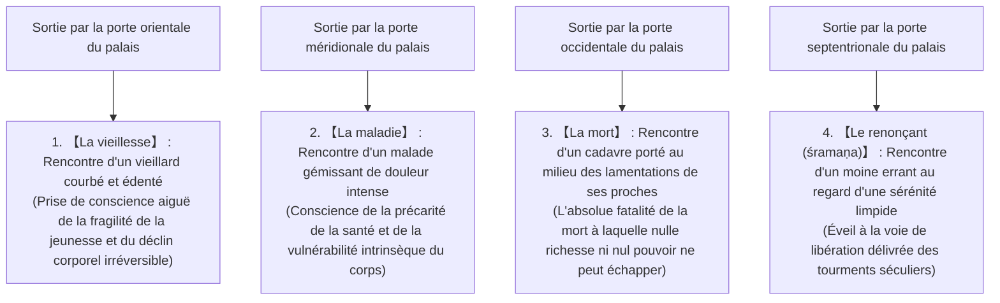

## Introduction : La naissance de l'Éveillé (Bouddha) et la révolution dans l'histoire de la pensée humaine

Entre le VIe et le Ve siècle avant notre ère, au cœur de l'effervescence intellectuelle qui embrasa le bassin moyen du Gange en Inde ancienne — période qualifiée par Karl Jaspers d'« Âge axial » —, le bouddhisme, fondé par Gautama Siddhārtha (en sanskrit : Gautama Siddhārtha ; en pāli : Gotama Siddhattha), constitua la plus formidable révolution intellectuelle et existentielle de l'histoire spirituelle de l'humanité, renversant de fond en comble la philosophie religieuse traditionnelle issue des Védas et des Upanishads.

Le terme « Bouddha » n'est pas le nom propre d'une divinité déterminée, mais un nom commun signifiant en sanskrit et en pāli « l'Éveillé » ou « celui qui a pleinement réalisé la Vérité suprême ». Le cœur de l'enseignement établi par Siddhārtha rejetait catégoriquement toute foi aveugle en un Dieu créateur tout-puissant, ainsi que les sacrifices sanglants d'animaux et les rituels magiques monopolisés par la caste sacerdotale des brahmanes. Il consistait en une « épistémè pratique et rationnelle » qui affrontait avec une lucidité clinique et sereine la « souffrance structurelle inhérente au fait même d'exister pour l'être humain (dukkha) », en décomposait les causes selon une rigoureuse logique de causalité, et conduisait à la délivrance ultime (mokṣa / nirvāṇa / nibbāna) par le moyen d'une observation méthodique et d'une discipline intérieure vécue.

Le bouddhisme transcende de loin les cadres étroits de ce que la modernité occidentale nomme « religion ». Il s'est déployé comme une science cognitive d'une précision chirurgicale, une psychothérapie existentielle, une critique radicale du langage et une phénoménologie ontologique. Dans cette étude, nous mettrons en lumière la totalité de cet édifice avec une rigueur universitaire sans compromis et une ampleur conceptuelle exhaustive : depuis la vie et le tournant philosophique de Gautama Siddhārtha, l'architecture mathématique et logique des Quatre Nobles Vérités, du Noble Sentier Octuple et des Douze Liens de la coproduction conditionnée, jusqu'à la déconstruction ontologique des cinq agrégats et du non-soi (anattā), la lecture philologique du canon pāli, ainsi que les résonances profondes avec les neurosciences cognitives contemporaines, la phénoménologie et la pleine conscience.

```
【Changement de paradigme du bouddhisme dans l'histoire de la pensée de l'Inde ancienne】

┌─────────────────┬───────────────────────────────┬───────────────────────────────┐
│ Critère         │ Brahmanisme orthodoxe /       │ Bouddhisme primitif           │
│ de comparaison  │ Upanishads                    │ (Gautama Bouddha)             │
├─────────────────┼───────────────────────────────┼───────────────────────────────┤
│ Réalité ultime  │ Brahman (Absolu cosmique,     │ Dharma (Loi universelle de la │
│                 │ principe premier immuable)    │ coproduction conditionnée)    │
│ Conception du   │ Ātman (Soi substantiel, âme   │ Anattā (Non-Soi : négation    │
│ Soi (Âme)       │ éternelle et indestructible)  │ radicale d'une entité du Soi) │
│ Voie de         │ Intuition du Brahman-Ātman    │ Quatre Nobles Vérités, Noble  │
│ libération      │ (Unité), sacrifices rituels,  │ Sentier Octuple, Voie du      │
│                 │ ascétisme corporel extrême    │ Milieu, méditation śamatha-   │
│                 │                               │ vipaśyanā (calme et vision)   │
│ Vision du monde │ Légitimation sacrée de l'ordre│ Rejet des discriminations de  │
│                 │ des castes (varṇa)            │ castes, égalité universelle   │
│ Méthode de      │ Soumission à l'autorité       │ Élucidation intérieure        │
│ connaissance    │ révélée des Écritures védiques│ personnelle, observation et   │
│                 │ (Śruti)                       │ vérification empirique        │
└─────────────────┴───────────────────────────────┴───────────────────────────────┘
```

---

## 1. La vie de Gautama Siddhārtha et son tournant philosophique

### 1.1 La naissance princière chez les Śākya et le choc des quatre rencontres
Gautama Siddhārtha naquit à Lumbinī, dans le sud de l'actuel Népal, au pied de la chaîne de l'Himalaya. Il était le fils aîné du roi Śuddhodana (浄飯王), souverain du clan des Śākya régnant sur la cité-État de Kapilavastu, et de la reine Māyā (摩耶夫人).

Selon la légende hagiographique, aussitôt après sa venue au monde, Siddhārtha aurait fait sept pas dans chacune des quatre directions cardinales avant de proclamer : « Entre ciel et terre, moi seul suis vénérable. » Cependant, envisagé sous l'angle de l'histoire critique et de la philologie, il est avéré qu'il appartenait à l'aristocratie militaire (kṣatriya) d'une confédération tribale d'Inde orientale organisée selon le régime républicain et oligarchique du gaṇa-saṅgha, jouissant d'une existence extraordinairement fastueuse et protégée, exempte du moindre dénuement matériel. Son père, le roi Śuddhodana, terrifié à l'idée prophétisée que son fils pût renoncer au trône pour devenir un ascète errant, fit édifier trois somptueux palais adaptés aux trois saisons de l'Inde (la saison chaude, la saison des pluies et la saison froide), peuplant ces demeures de courtisanes dévouées au chant et à la danse, et prenant soin d'exclure méticuleusement du regard du prince toute manifestation de la misère humaine, du déclin physique et de la mort.

Pourtant, l'intelligence d'une acuité exceptionnelle et la sensibilité existentielle de Siddhārtha ne tardèrent pas à percer à jour la vanité tragique de ce paradis artificiel. Cette prise de conscience est immortalisée dans la tradition bouddhique sous le récit exemplaire des « Quatre Rencontres » (les quatre sorties hors des portes de la cité).



Les Quatre Rencontres ne constituent pas une simple fable allégorique : elles formalisent le modèle universel de la **« crise existentielle » (Existential Crisis)**. Quels que soient le degré d'opulence matérielle, l'étendue du pouvoir politique ou la vigueur physique dont un être humain peut bénéficier, nul ne saurait s'affranchir ne serait-ce qu'une fraction de seconde des trois servitudes absolues que sont la sénescence, la maladie et la mort inéluctable. En observant la décrépitude, la souffrance et le trépas d'autrui, Siddhārtha réalisa avec effroi que ces spectacles n'étaient pas des calamités frappant de lointains étrangers, mais constituaient le destin ontologique inexorable qui l'attendait lui-même ici et maintenant. C'est ce désespoir lucide et cette commotion existentielle qui constituèrent la force motrice le poussant, à l'âge de vingt-neuf ans, à accomplir la « Grande Renonciation » (le départ clandestin du palais royal).

### 1.2 Renonciation, maîtres spirituels, ascétisme extrême et son échec
Abandonnant son épouse Yaśodharā, son jeune fils nouveau-né Rāhula et tous les privilèges afférents à la succession royale, Siddhārtha se rasa la tête, revêtit une robe de toile grossière et devint un « śramaṇa » (un renonçant sans feu ni lieu, voué à la quête autonome de la vérité).

Dans un premier temps, il se mit à l'école de deux éminents maîtres de méditation réputés à l'époque :
1. **Āḷāra Kālāma** : Il lui enseigna la méditation menant à la « sphère du néant » (ākiñcaññāyatana / un état d'absorption mentale supérieure où la conscience s'établit dans la perception qu'aucune chose n'existe en soi). Siddhārtha maîtrisa ce niveau en très peu de temps, mais réalisa qu'aussitôt sorti de cette transe méditative, les angoisses et les tourments de l'existence réapparaissaient intacts ; jugeant qu'il ne s'agissait pas là de la délivrance ultime, il prit congé de son maître.
2. **Uddaka Rāmaputta** : Il lui transmit la pratique conduisant à la « sphère de ni-perception-ni-non-perception » (nevasaññānāsaññāyatana / un état limite d'absorption où l'activité cognitive ne peut plus être qualifiée ni de présente ni d'absente). Atteignant avec la même aisance l'état de réalisation de son maître, Siddhārtha constata une fois encore que cette absorption raffinée ne permettait pas de déraciner la source primordiale de la souffrance.

Ayant éprouvé les limites des états méditatifs purement contemplatifs, Siddhārtha décida de se tourner vers la tentative d'éradication du désir par la mortification corporelle la plus radicale : les austérités extrêmes (tapas). Dans la forêt d'Uruvelā, au royaume de Magadha, flanqué de cinq compagnons de quête (les cinq ascètes menés par Kauṇḍinya / Koṇḍañña), il s'adonna pendant six longues années à des mortifications terrifiantes : rétention du souffle jusqu'aux limites de l'asphyxie, exposition aux brûlures solaires, et jeûne prolongé au point de ne consommer qu'un seul grain de sésame ou un seul grain de riz par jour.

Au terme de ces épreuves, le corps de Siddhārtha fut réduit à un état squelettique d'une effroyable maigreur : sa cage thoracique saillait comme les chevrons d'une grange éventrée, son cuir chevelu s'étiolait comme une gourde desséchée, et lorsqu'il tentait de se redresser, il s'effondrait sur le sol, épuisé au seuil de la mort. Pourtant, alors même qu'il frôlait le trépas, l'apaisement absolu de l'esprit et l'illumination de la vérité suprême demeuraient inaccessibles. C'est à cet instant précis que Siddhārtha parvint à une intuition décisive qui allait marquer à jamais l'histoire de la pensée humaine :

> **« Tourmenter et violenter le corps physique ne fait que détruire la chair et épuiser l'esprit, sans jamais faire éclore la sagesse authentique ni l'Éveil véritable. De même que sombrer dans les voluptés sensuelles (l'hédonisme) est un égarement stérile, s'infliger de cruelles mortifications (l'ascétisme outrancier) constitue une impasse tout aussi erronée. »**

Siddhārtha prit la décision irrévocable de renoncer à ces mortifications stériles. Il se traîna jusqu'aux eaux de la rivière Nairañjanā (Nerañjarā) pour laver la crasse et la poussière accumulées durant six années de privations. Évanoui de faiblesse sur la rive, il reçut d'une jeune villageoise nommée Sujātā une offrande bienfaisante de riz au lait crémeux (pāyasa). Le breuvage nourrissant se diffusa dans tout son organisme, restaurant miraculeusement la vigueur de son corps. Voyant cet acte, ses cinq compagnons d'ascèse le méprisèrent profondément, concluant que Gautama avait fléchi devant l'effort pour retomber dans la mollesse des désirs terrestres, et ils l'abandonnèrent sur-le-champ.

```
【Dépassement des deux extrêmes et découverte de la Voie du Milieu (Majjhimā Paṭipadā)】

Attachement aux plaisirs des sens  ←─────［VOIE DU MILIEU］─────→  Mortification du corps
(Hédonisme de la vie princière)          (Sagesse et sérénité)           (Ascétisme d'Uruvelā)

* Si les cordes du luth sont trop tendues, elles se rompent ; si elles sont trop lâches,
  elles n'émettent aucun son harmonieux. Seul un accord tempéré produit une musique sublime.
```

### 1.3 L'Éveil sous l'arbre de la Bodhi : L'affrontement avec Māra et la naissance de l'Éveillé
Ayant recouvré ses forces physiques, Siddhārtha gagna les environs de Bodh-Gayā. Il disposa une litière d'herbe kuśa au pied d'un grand figuier sacré (l'aśvattha, ultérieurement baptisé « arbre de la Bodhi »), s'y assit en posture du lotus (padmāsana), et formula ce serment inébranlable :
**« Quand bien même ma chair se dessécherait et que mes os tomberaient en poussière, je ne quitterai pas cette assise avant d'avoir atteint l'Éveil parfait et indépassable. »**

D'après la tradition scripturaire, toutes les pulsions de concupiscence, de terreur, de doute et d'attachement qui tourbillonnaient dans les profondeurs de la psyché de Siddhārtha se personnifièrent alors sous les traits du Démon Māra (Māra Pāpīyant, l'incarnation de la mort et des passions aliénantes), qui lança un assaut furieux contre le méditant.

Māra dépêcha d'abord ses trois filles voluptueuses — Taṇhā (la soif passionnée), Arati (l'insatisfaction / l'aversion) et Rāga (le désir lubrique) — pour tenter de séduire Siddhārtha. Devant l'impassibilité souveraine du sage, Māra déchaîna des tempêtes d'ouragans, des pluies diluviennes, des pluies de météores incandescents et des légions de monstres terrifiants afin de faire vaciller sa raison par la terreur. En dernier recours, Māra s'écria : « De quel droit un être mortel tel que toi prétend-il occuper le trône de l'Éveil ? Qui donc témoignera de ta légitimité ? » Siddhārtha abaissa calmement sa main droite et effleura le sol du bout des doigts, exécutant le geste rituel de la « prise de la Terre à témoin » (Bhūmisparśa-mudrā). La Terre alors gronda avec fracas et répondit d'une voix souveraine : « Je me porte garante des mérites infinis et du don de soi désintéressé qu'il a accumulés au fil de ses existences innombrables. » L'armée de Māra se volatilisa comme fumée au vent, et toutes les souillures passionnelles (kilesa) s'éteignirent définitivement en son cœur.

Durant la première veille de la nuit (de 18 heures à 22 heures), Siddhārtha obtint la « réminiscence de ses vies antérieures » (pubbenivāsānussatiñāṇa), se remémorant le flux continu de ses innombrables existences passées.
Durant la deuxième veille de la nuit (de 22 heures à 2 heures du matin), il acquit « l'œil divin » (dibbacakkhuñāṇa), pénétrant les lois universelles de la rétribution des actes (karma) par lesquelles tous les êtres vivants meurent et renaissent selon la nature vertueuse ou malfaisante de leurs volitions.
Enfin, au cours de la troisième veille de la nuit (de 2 heures à 6 heures du matin), alors que l'étoile du matin scintillait dans le ciel oriental, Siddhārtha contempla dans un mouvement direct et récursif les douze maillons de la « coproduction conditionnée » (paṭicca-samuppāda) régissant l'apparition et la disparition interdépendantes de tous les phénomènes, et réalisa la « destruction totale de tous les flux polluants » (āsavakkhayañāṇa).

C'est ainsi que Siddhārtha réalisa l'insurpassable Éveil complet et parfait (anuttarā samyak-saṃbodhi) et devint le **« Bouddha »** (le Bienheureux Śākyamuni, l'Éveillé). Il était alors âgé de trente-cinq ans.

### 1.4 La supplication de Brahmā et la mise en mouvement de la roue du Dharma : Du silence à la religion mondiale
Aussitôt après son Éveil, le Bouddha demeura plongé dans une profonde méditation, hésitant à communiquer au monde des hommes la vérité sublime (Dharma) qu'il venait d'actualiser : « Cette Loi que j'ai pénétrée est profonde, subtile, difficile à percevoir, transcendant la logique discursive, accessible aux seuls esprits sages. Les hommes de ce monde étant consumés par la convoitise et aveuglés par l'ignorance, si je devais leur exposer cette vérité, ils n'y trouveraient qu'incompréhension et lassitude. » Le Bouddha songea alors à demeurer dans le recueillement solitaire et à entrer en extinction sans prononcer d'enseignement.

Selon les textes canoniques, la divinité suprême du panthéon védique, le grand Brahmā Sahampati, descendant des cieux, vint s'agenouiller devant le Bouddha, joignit les mains en signe de vénération et le supplia à trois reprises. Cet épisode cardinal est désigné sous le nom de **« Brahmā-yācana » (la supplication de Brahmā)** :
« Ô Vénéré du monde, daignez proclamer le Dharma ! Il est dans ce monde des êtres dont les yeux ne sont que faiblement couverts de poussière. Faute d'entendre la Loi, ils périront dans les ténèbres ; s'ils entendent le Dharma, ils parviendront assurément à l'Éveil ! »

Le Bouddha posa alors sur l'humanité un regard empreint d'une infinie compassion. Semblable à la vision d'un étang où des fleurs de lotus croissent dans la fange — certaines demeurant immergées sous l'eau trouble, d'autres atteignant la surface, d'autres enfin s'élevant au-dessus des eaux pour s'épanouir dans une pureté immaculée —, il discerna la diversité des prédispositions spirituelles parmi les hommes. Le Bouddha trancha alors d'un coup sa réserve et prononça ces paroles historiques :

> **« Les portes de l'Immortel sont désormais grand ouvertes ! Que ceux qui ont des oreilles entendent, et qu'ils fassent naître la foi ! »**

Afin de retrouver les cinq compagnons qui l'avaient autrefois abandonné, le Bouddha entreprit un périple à pied de plusieurs centaines de kilomètres en direction du parc des Gazelles (Migadāya / Isipatana) à Sārnāth, près de Vārāṇasī. Apercevant de loin sa silhouette majestueuse qui approchait, les cinq ascètes s'étaient promis entre eux de l'ignorer avec dédain ; toutefois, subjugués par son aura de sainteté et son incomparable noblesse d'allure, ils se levèrent spontanément, se précipitèrent pour laver ses pieds souillés par la poussière et lui préparèrent une assise d'honneur.

Le Bouddha dispensa alors à leur intention le premier sermon de l'histoire du bouddhisme : **la « mise en mouvement de la roue de la Loi » (Dhammacakkappavattana Sutta)**. Il y exposa avec une rigueur magistrale la Voie du Milieu, les Quatre Nobles Vérités et le Noble Sentier Octuple. Au fil de son exposé, le plus âgé d'entre eux, Kauṇḍinya (Koṇḍañña), fut traversé par une illumination fulgurante et ouvrit « l'œil pur de la Loi » (dhammacakkhu) : « Tout ce qui est de nature à apparaître est également de nature à disparaître. » Dès cet instant, les « Trois Joyaux » (Triratna / Tiratana) — le Maître (Bouddha), l'Enseignement (Dharma) et la Communauté monastique (Sangha) — furent définitivement établis sur la terre des hommes.

---

## 2. Le fondement doctrinal : La structure logique des Quatre Nobles Vérités (Cattāri Ariyasaccāni)

L'enseignement initial du Bouddha ne se présente pas comme un dogme théologique mystique ni comme une profession de foi aveugle ; il adopte avec une perfection saisissante la structure logique quadripartite de la médecine clinique traditionnelle de l'Inde ancienne (l'Āyurveda) : le diagnostic des symptômes, l'identification de l'étiologie, la définition de la guérison et la prescription de la thérapie curative. Ce modèle d'une **« médecine clinique existentielle »** appliquée à l'esprit constitue le cadre fondamental des « Quatre Nobles Vérités » (Cattāri Ariyasaccāni).

```
【Correspondance structurelle entre le diagnostic médical et les Quatre Nobles Vérités】

┌─────────────────┬───────────────────────────────┬───────────────────────────────┐
│ Modèle de       │ Quatre Nobles Vérités         │ Contenu et signification      │
│ diagnostic      │ du bouddhisme                 │ existentielle                 │
├─────────────────┼───────────────────────────────┼───────────────────────────────┤
│ 1. Diagnostic   │ Vérité de la souffrance       │ La réalité fondamentale de    │
│    des symptômes│ (Dukkha-sacca)                │ l'existence est « dukkha »    │
│ 2. Étiologie    │ Vérité de l'origine           │ La cause première est la      │
│    de la cause  │ (Samudaya-sacca)              │ « soif » insatiable (taṇhā)   │
│ 3. Définition   │ Vérité de la cessation        │ L'extinction de la soif est   │
│    de la guérison│ (Nirodha-sacca)              │ la délivrance (Nirvana)       │
│ 4. Prescription │ Vérité de la Voie             │ La thérapeutique méthodique : │
│    thérapeutique│ (Magga-sacca)                 │ le Noble Sentier Octuple      │
└─────────────────┴───────────────────────────────┴───────────────────────────────┘
```

### 2.1 Dukkha-sacca : L'« insatisfaction » structurelle de l'existence
Lorsque le bouddhisme énonce le principe : « Tout est souffrance » (Sabbe saṅkhārā dukkhā), le terme « dukkha » (en pāli : Dukkha ; en sanskrit : Duḥkha) ne saurait être restreint à la simple souffrance physique ou au chagrin émotionnel passager.

Sur le plan étymologique, le terme pāli *dukkha* dérive d'une racine métaphorique évoquant l'essieu d'un chariot dont l'orifice (*kha*) est faussé ou asymétrique (*du*), provoquant une friction permanente, des secousses violentes et une rotation contrariée de la roue. Par conséquent, la signification authentique de *dukkha* réside dans l'incapacité radicale du monde phénoménal à satisfaire nos désirs, la non-congruence ontologique, et **« l'insatisfaction et l'inconfort fondamentaux inhérents à toute existence conditionnée »**.

Le bouddhisme primitif a classifié cette condition humaine sous la formule classique des « quatre souffrances et huit afflictions » (四苦八苦) :

1. **La souffrance de la naissance (Jāti)** : Le traumatisme originel de la mise au monde et les servitudes physiques du fait d'exister.
2. **La souffrance de la vieillesse (Jarā)** : La dégradation irréversible du corps physique et le déclin des facultés cognitives.
3. **La souffrance de la maladie (Byādhi)** : La douleur et le déchirement causés par les pathologies organiques.
4. **La souffrance de la mort (Maraṇa)** : L'angoisse de l'anéantissement et la dissolution brutale de l'agrégat vital.
5. **La souffrance d'être séparé de ce que l'on aime (Piyavippayoga)** : Le déchirement imposé par la perte inéluctable des êtres chers et des situations agréables.
6. **La souffrance d'être uni à ce que l'on hait (Appiyasaṃpayoga)** : La contrainte de côtoyer ce qui nous rebute, nous agresse ou nous blesse.
7. **La souffrance de ne pas obtenir ce que l'on désire (Yampicchaṃ na labhati tampi dukkhaṃ)** : La frustration perpétuelle née de l'inadéquation entre nos appétits illimités et la réalité finie.
8. **La souffrance inhérente aux cinq agrégats d'attachement (Pañcupādānakkhandhā dukkhā)** : La souffrance globale et permanente générée par l'illusion de s'identifier aux cinq composantes constitutives de notre personnalité psychophysique.

### 2.2 Samudaya-sacca : Le mécanisme d'apparition de la souffrance et la « soif »
S'il est avéré que la souffrance existe comme un fait universel, il doit impérativement exister une cause génératrice qui la produit. La deuxième Noble Vérité (Samudaya-sacca) pénètre la racine même de cette souffrance et l'identifie comme étant la **« soif » insatiable (Taṇhā / sanskrit : Tṛṣṇā)**.

Le mot *taṇhā* désigne littéralement cette ardeur fiévreuse d'un voyageur égaré dans le désert qui, dévoré par une soif atroce, cherche désespérément de l'eau : c'est l'impulsion aveugle par laquelle la conscience s'agrippe aux objets, les convoite avec frénésie et refuse d'en lâcher prise.

Le Bouddha a distingué trois modalités fondamentales de cette soif :
- **La soif des plaisirs sensuels (Kāma-taṇhā)** : L'avidité pour les jouissances issues des organes de la perception (la vue, l'ouïe, l'odorat, le goût, le toucher et les représentations mentales).
- **La soif d'existence et de perpétuation (Bhava-taṇhā)** : L'attachement viscéral à la continuation de son propre moi, la volonté obsessionnelle de durer, de survivre indéfiniment et de consolider son pouvoir ou sa renommée.
- **La soif d'anéantissement (Vibhava-taṇhā)** : La pulsion autodestructrice cherchant à fuir la souffrance en désirant la néantisation de soi, la destruction du monde ou le suicide nihiliste.

Le caractère intrinsèquement tragique de la soif réside dans sa structure cyclique addictive : elle est semblable à la tentative d'étancher sa soif en buvant de l'eau de mer salée. Plus l'individu boit avidement, plus la salinité irrite sa gorge et amplifie sa brûlure intérieure, l'enfermant dans une spirale sans fin de frustrations et de renaissances tourmentées.

### 2.3 Nirodha-sacca : L'extinction totale de la souffrance et le « Nirvana »
De même que l'éradication de l'agent pathogène entraîne la guérison totale du patient, il existe un état où la soif qui alimentait la souffrance est entièrement et définitivement abolie. C'est la troisième Noble Vérité (Nirodha-sacca), qui culmine dans l'idéal suprême du bouddhisme : le **« Nirvana » (sanskrit : Nirvāṇa ; pāli : Nibbāna)**.

Étymologiquement, le mot *nibbāna* signifie « extinction par le souffle » (*Nir* + *vā*, souffler pour éteindre). Il évoque l'apaisement absolu consécutif à l'extinction des « trois feux toxiques » (les trois poisons de l'esprit / triviṣa) que sont la cupidité (rāga), la haine/aversion (dosa) et l'aveuglement/ignorance (moha). Le Nirvana ne représente nullement un au-delà paradisiaque réservé aux défunts après leur trépas corporel ; il s'agit d'**« un état de souveraine liberté, d'immuable fraîcheur et de paix inaltérable actualisable ici et maintenant, libéré de tous les liens de l'illusion passionnelle »**.

### 2.4 Magga-sacca : La prescription concrète menant au Nirvana — Le Noble Sentier Octuple
La quatrième Noble Vérité définit la méthode pratique, graduelle et méthodique permettant d'éteindre la souffrance et d'accéder au Nirvana : c'est le « Noble Sentier Octuple » (Ariyo aṭṭhaṅgiko maggo). Ce cheminement se déploie à travers huit facteurs complémentaires, traditionnellement synthétisés dans les « Trois Disciplines supérieures » (Tisso sikkhā) : la Moralité (Sīla), la Concentration (Samādhi) et la Sagesse (Paññā).

```
【Structure du Noble Sentier Octuple et correspondance avec les Trois Disciplines (śīla, samādhi, prajñā)】

┌───────────────┬───────────────────────────────┬───────────────────────────────┐
│ Trois         │ Branches du Noble             │ Définition et fonction        │
│ Disciplines   │ Sentier Octuple               │ pratiques                     │
├───────────────┼───────────────────────────────┼───────────────────────────────┤
│ Sagesse       │ 1. Vue juste                  │ Vision lucide des Quatre      │
│ (Paññā)       │    (Sammā-diṭṭhi)             │ Vérités et de la causalité    │
│               │ 2. Pensée juste               │ Pensée pure, détachée de la   │
│               │    (Sammā-saṅkappa)           │ convoitise et de la haine     │
├───────────────┼───────────────────────────────┼───────────────────────────────┤
│ Éthique       │ 3. Parole juste               │ S'abstenir du mensonge, de la │
│ (Sīla)        │    (Sammā-vācā)               │ calomnie et des bavardages    │
│               │ 4. Action juste               │ S'abstenir de tuer, voler et  │
│               │    (Sammā-kammanta)           │ des conduites sexuelles nocives│
│               │ 5. Moyen d'existence juste    │ Subsistance honnête rejetant  │
│               │    (Sammā-ājīva)              │ le trafic d'armes ou de poisons│
├───────────────┼───────────────────────────────┼───────────────────────────────┤
│ Méditation /  │ 6. Effort juste               │ Énergie continue pour éliminer│
│ Concentration │    (Sammā-vāyāma)             │ le mal et faire croître le bien│
│ (Samādhi)     │ 7. Attention juste            │ Présence attentive et lucide  │
│               │    (Sammā-sati)               │ aux phénomènes ici et maintenant│
│               │ 8. Concentration juste        │ Esprit unifié et absorbé dans │
│               │    (Sammā-samādhi)            │ la paix des dhyānas           │
└───────────────┴───────────────────────────────┴───────────────────────────────┘
```

Le Noble Sentier Octuple ne doit pas être conçu comme une progression linéaire où les étapes se franchiraient les unes après les autres de manière séquentielle, mais comme un système dynamique et interconnecté, semblable aux huit rayons d'une même roue tournant de concert. Par la Vue juste, l'adepte perçoit la réalité des phénomènes sans distorsion ; par l'éthique (Parole, Action, Moyen d'existence justes), il pacifie ses comportements corporels et verbaux ; par la culture méditative (Effort, Attention, Concentration justes), il stabilise et aiguise l'esprit, ce qui vient en retour approfondir la Vue juste jusqu'à l'émancipation définitive.

---

## 3. Les profondeurs de l'ontologie : Les Douze Liens de la Coproduction conditionnée et les Cinq Agrégats

### 3.1 La Coproduction conditionnée (Paṭicca-samuppāda) : La découverte suprême du Bouddha
L'enseignement du Bouddha qui possède la plus vertigineuse profondeur philosophique et qui distingue radicalement le bouddhisme de tous les autres systèmes de pensée mondiaux est la doctrine de la **« coproduction conditionnée » (en pāli : Paṭicca-samuppāda ; en sanskrit : Pratītyasamutpāda)**.
Ce concept exprime la vérité selon laquelle tout phénomène n'apparaît qu'en dépendance étroite de causes et de conditions concomitantes (Dependent Origination / production interdépendante).

Dans le canon pāli, le Bouddha formule la formule axiomatique de la coproduction conditionnée avec une sobriété mathématique saisissante :

> **« Quand ceci est, cela est. De l'apparition de ceci provient l'apparition de cela.**
> **Quand ceci n'est pas, cela n'est pas. De la cessation de ceci provient la cessation de cela. »**
> (*Saṃyutta Nikāya*)

Aucune entité existant dans l'univers — qu'il s'agisse de la matière inerte, de la conscience, des organismes biologiques ou des formations sociales — ne jouit d'une existence autonome, autosuffisante et substantielle. Toutes choses ne sont que des configurations temporaires émergeant au sein d'un gigantesque réseau d'interdépendances causales (le filet d'Indra). Il n'existe nulle part de Créateur premier incréé, nulle divinité immuable, nulle cause originelle éternelle. Lorsque les conditions s'assemblent, le phénomène apparaît ; lorsque les conditions se disloquent, le phénomène disparaît : telle est la Loi universelle et éternelle (Dharma) qui gouverne le cosmos.

### 3.2 La chaîne des douze maillons de la coproduction conditionnée
Au cours de la nuit de son Éveil, le Bouddha analysa le mécanisme causal par lequel l'être humain se trouve irrémédiablement enchaîné aux tourments de la vieillesse et de la mort, et formalisa cette genèse en une chaîne circulaire de douze maillons interdépendants (les douze nidānas).


```
【Les douze maillons de la coproduction conditionnée et le déploiement psychologique de l'existence】

1. L'ignorance (Avijjā) : L'aveuglement fondamental face aux Quatre Vérités, au non-soi et à l'impermanence.
2. Les formations volitionnelles (Saṅkhāra) : Les impulsions intentionnelles et l'accumulation d'énergies karmiques issues de l'ignorance.
3. La conscience (Viññāṇa) : La conscience discriminante reliant les états d'existence et animant la cognition.
4. Le nom et la forme (Nāmarūpa) : L'organisme psychophysique constitué des fonctions mentales (le nom) et corporelles (la forme).
5. Les six bases sensorielles (Saḷāyatana) : Les cinq organes sensoriels physiques et le sixième organe mental (l'esprit/manas).
6. Le contact (Phassa) : La rencontre tripartite entre l'organe sensoriel, l'objet extérieur et la conscience correspondante.
7. La sensation (Vedanā) : La tonalité affective spontanément éprouvée à la suite du contact (agréable, désagréable ou neutre).
8. La soif (Taṇhā) : L'avidité passionnée cherchant à capturer ce qui est agréable et à fuir ce qui est désagréable.
9. L'attachement / L'appropriation (Upādāna) : L'agrippement forcené s'efforçant d'annexer l'objet convoité au domaine du « Moi ».
10. Le devenir (Bhava) : Le processus dynamique d'accumulation d'existence et de maturation karmique conditionnant le futur.
11. La naissance (Jāti) : L'émergence d'une nouvelle individualité dans une existence conditionnée.
12. La vieillesse et la mort (Jarāmaraṇa) : Le déclin physique inéluctable, la décomposition, le deuil, l'angoisse et le trépas.
```

Ce qui bouleverse la pensée philosophique dans cette analyse des douze liens, c'est que le Bouddha situe l'origine ultime de toute la tragédie de la vieillesse et de la mort non pas dans une malédiction divine ou une faute morale originelle, mais dans **l'ignorance cognitive fondamentale (Avijjā)**.

Dès lors, cette chaîne de causalité peut être inversée dans un mouvement libérateur (l'ordre de cessation / paṭiloma) :
Si, grâce à la sagesse intuitive, l'ignorance s'éteint, les formations volitionnelles s'éteignent. Si les formations s'éteignent, la conscience aliénée s'éteint... jusqu'à ce que s'effondre définitivement l'immense agrégat de souffrance que sont la naissance, la vieillesse et la mort. Dans le bouddhisme, l'affranchissement de la souffrance ne relève ni d'un miracle surnaturel ni d'une grâce divine transcendante : il découle d'une nécessité logique et cognitive rigoureuse issue de la transmutation de la conscience.

### 3.3 Les Cinq Agrégats (Pañca-khandhā) : La déconstruction de l'être humain
Qu'est-ce au juste que ce que nous nommons spontanément « Moi » ?
Le Bouddha rejeta avec fermeté l'illusion que l'être humain recèlerait une âme unitaire, autonome et immuable. Il déconstruisit la personnalité humaine en cinq agrégats constitutifs en perpétuelle mutation : **les Cinq Agrégats d'existence (en pāli : Pañca-khandhā ; en sanskrit : Pañca-skandha)**.

1. **L'agrégat de la forme matérielle (Rūpa)** : Le corps physique, les organes de la perception et l'ensemble des phénomènes matériels extérieurs.
2. **L'agrégat de la sensation (Vedanā)** : La tonalité affective brute ressentie lors du contact sensoriel (plaisir, déplaisir, indifférence).
3. **L'agrégat de la perception / reconnaissance (Saññā)** : La faculté d'identifier les objets, de les nommer, de conceptualiser et d'associer les stimuli aux traces mémorielles.
4. **L'agrégat des formations mentales (Saṅkhāra)** : Les volitions, les intentions, les passions, les émotions et toutes les pulsions actives qui impriment une direction éthique à la conscience.
5. **L'agrégat de la conscience (Viññāṇa)** : L'activité fondamentale de discernement qui intègre les données sensibles et prend acte de la présence des phénomènes.

Le Bouddha interrogeait ainsi ses disciples :
« Moines, chacun de ces cinq agrégats est-il permanent ou impermanent ? »
— « Il est impermanent, Vénéré du monde. »
« Ce qui est impermanent est-il souffrance ou félicité ? »
— « C'est souffrance, Vénéré du monde. »
« Ce qui est impermanent, souffrance et voué à la destruction continuelle, est-il légitime de le considérer en disant : "Ceci est mien, cela je le suis, ceci constitue mon Soi (ātman)" ? »
— « Non, certes non, Vénéré du monde. »

L'être humain n'est donc rien d'autre qu'un flux dynamique, un processus incessant d'interactions ultra-rapides entre ces cinq composantes. De même que le mot « char » n'est qu'une désignation conventionnelle appliquée à l'assemblage temporaire de roues, d'un essieu, d'un timon et d'une caisse, les notions de « sujet », de « personne » ou de « moi » ne sont que des étiquettes linguistiques commodes apposées sur un faisceau d'agrégats impersonnels et transitoires.

---

## 4. La philosophie du Non-Soi (Anattā) : Dissolution du Soi substantiel et liberté existentielle

### 4.1 Anattā (Non-Soi) contre l'Ātman (Soi) des Upanishads
Le sommet philosophique du bouddhisme originel — et en même temps le concept qui a suscité les plus tenaces contresens — réside dans la doctrine du **« Non-Soi » (en pāli : Anattā ; en sanskrit : Anātman)**.

La philosophie dominante de l'Inde à l'époque du Bouddha (la tradition métaphysique des Upanishads) soutenait ardemment que, derrière le flux éphémère du corps charnel, des émotions et des pensées périssables, réside un Soi transcendant, éternel, immuable et divin : **l'Ātman**. Pour cette pensée, la délivrance consistait à réaliser l'identité absolue entre ce principe intime (Ātman) et la substance cosmique suprême (Brahman) : la formule mystique du *Tat tvam asi* (« Tu es Cela »).

Face à cette ontologie de la substance, le Bouddha opposa un démenti sans appel en proclamant : **« Tous les phénomènes sont sans soi substantiel » (Sabbe dhammā anattā)**.
La démonstration déployée par le Bouddha brille par sa limpidité logique :
Si une réalité quelconque méritait le titre de « Mon Soi véritable », elle devrait se trouver sous la juridiction absolue et inconditionnelle de ma volonté souveraine. Or, nul être ne peut décréter : « Que mon corps ne vieillisse jamais, qu'il ne tombe jamais malade ! » Nul ne peut empêcher ses émotions ou ses pensées de surgir et de disparaître en fonction de conditions extérieures. Nous ne contrôlons pas de manière absolue ce flux psycho-physique, précisément parce qu'il n'est qu'un ensemble de processus conditionnés surgissant et s'évanouissant selon des lois causales. On ne saurait identifier comme son « Soi » ce qui vous échappe perpétuellement. En explorant scrupuleusement la totalité des cinq agrégats, nulle part on ne découvre le moindre noyau ontologique permanent, nulle étincelle d'un moi substantiel.

```
【Opposition épistémologique entre le substantialisme de l'Ātman et la doctrine bouddhiste du Non-Soi】

■ L'ontologie substantialiste des Upanishads (Ātman)
Derrière le corps, les émotions et les pensées trône une « âme immortelle,
pure et permanente en tant que témoin absolu » (le Vrai Soi).
* Cherche le salut de l'âme, mais retombe dans le piège du renforcement
  de l'attachement au soi.

■ La théorie phénoménale et processuelle du bouddhisme primitif (Anattā)
Le corps, les émotions et les pensées ne sont que des flux causaux en perpétuel
changement ; aucun « observateur » ne réside en coulisse. Il y a l'acte de voir,
mais aucun « voyant ».
* En déconstruisant l'illusion fondamentale du « Moi », elle déracine
  tous les attachements à leur source.
```

### 4.2 Les Trois et Quatre Sceaux du Dharma : Vérités universelles de l'existence
La marque d'authenticité distinctive de l'enseignement bouddhique est scellée par les « Sceaux du Dharma » (法印 / les empreintes de la vérité universelle). Ceux-ci définissent la nature ultime de tout ce qui compose notre monde :

1. **L'impermanence universelle (Sabbe saṅkhārā aniccā / 諸行無常)** :
   Toutes les formations conditionnées (saṅkhāra) sont engagées dans un flux perpétuel de transformation, sans un seul instant de stagnation statique. Nulle part dans l'univers il n'existe de repos substantiel immuable.
2. **Le Non-Soi de tous les phénomènes (Sabbe dhammā anattā / 諸法無我)** :
   Non seulement les choses composées (conditionnées), mais la totalité absolue des phénomènes — y compris les réalités inconditionnées comme le Nirvana — sont absolument dénuées d'entité substantielle propre (Soi).
3. **Le Nirvana est paix absolue et sérénité (Nibbānaṃ santaṃ / 涅槃寂静)** :
   L'état dans lequel l'illusion du moi et le feu destructeur de l'attachement sont totalement éteints par la vision lucide de l'impermanence et du non-soi constitue l'apaisement et la liberté suprêmes.
4. **Toute existence conditionnée est souffrance (Sabbe saṅkhārā dukkhā / 一切皆苦)** :
   Parce que l'homme s'obstine à croire éternel ce qui est intrinsèquement impermanent, et qu'il s'acharne à vouloir posséder comme son « Moi » ce qui est dénué de substance, toutes les formations conditionnées deviennent sources d'insatisfaction et d'angoisse (ce quatrième sceau est fréquemment adjoint aux trois premiers pour former les « Quatre Sceaux du Dharma »).

Soulignons avec force que la doctrine du non-soi ne s'apparente en aucun cas à un nihilisme (Ucchedavāda). Le Bouddha a rejeté avec une vigueur égale la thèse matérialiste selon laquelle la mort équivaut à un anéantissement absolu du flux vital (l'annihilationisme) et la thèse spiritualiste proclamant l'immortalité éternelle d'une âme immuable (l'éternalisme / Sassatavāda), les dénonçant toutes deux comme des erreurs extrêmes. Le Non-Soi signifie simplement s'affranchir de la fiction toxique d'un ego figé afin de contempler sans voile la réalité vivante telle qu'elle se déploie dans l'instant, se libérant ainsi de toute forme de crispation possessive.

---

## 5. Déchiffrement philologique des textes bouddhiques primitifs et formation du Sangha

### 5.1 Histoire de la constitution du canon pali et les conciles (Saṅgīti)
Le Bouddha n'a consigné son enseignement dans aucun écrit matériel. En Inde ancienne, la transmission des doctrines spirituelles sacrées obéissait à une tradition orale rigoureuse, fondée sur la récitation mémorielle directe de maître à disciples.

Aussitôt après l'extinction finale du Bouddha (Mahāparinibbāna) survenue à Kuśinagara à l'âge de quatre-vingts ans, cinq cents maîtres spirituels parvenus au rang d'Arhat se réunirent à Rājagaha (l'actuelle Rājgīr), capitale du Magadha, sous la présidence du vénérable Mahākāśyapa (Mahākassapa). Ce rassemblement inaugural est connu sous le nom de **« Premier Concile » (Saṅgīti / littéralement « récitation conjointe »)**.

```
【Établissement des deux grandes traditions lors du Premier Concile】

1. Rédaction chantée de la corbeille des discours (Sutta Piṭaka)
   ・Récitant : Ānanda (cousin du Bouddha et son serviteur dévoué durant 25 ans,
     reconnu comme « le premier pour la mémorisation des enseignements »)
   ・Formule liminaire canonique : « Ainsi ai-je entendu » (Evaṃ me sutaṃ)
   ・Contenu : Recueil de dialogues et de sermons dispensés par le Bouddha
     selon les dispositions spirituelles des auditeurs.

2. Rédaction chantée de la corbeille de la discipline (Vinaya Piṭaka)
   ・Récitant : Upāli (ancien barbier devenu éminent connaisseur des règles monastiques,
     « le premier pour la maîtrise de la discipline »)
   ・Contenu : Règles monastiques imposées aux renonçants (bhikkhus et bhikkhunīs),
     protocoles de gouvernance communautaire et sanctions disciplinaires.
```

Par la suite, après la survenue de divisions doctrinales (le Schisme fondamental), la communauté monastique dut affronter au Ier siècle avant notre ère au Sri Lanka (au monastère d'Aluvihāra) les périls dévastateurs des invasions tamoules et de famines aiguës menaçant de faire disparaître la lignée des moines récitants. Afin de préserver l'enseignement de l'oubli, le canon fut gravé pour la première fois par écrit en langue pālie sur des feuilles de palmier (talipot). C'est ce corpus qui est parvenu jusqu'à nous sous le nom de **« Triple Corbeille en langue pālie » (Tipiṭaka / Corbeille des discours, de la discipline et de la philosophie systématique)**.

### 5.2 La couche textuelle la plus archaïque : La pensée du Sutta Nipāta et du Dhammapada
Les travaux menés par la philologie bouddhique moderne (notamment par Hajime Nakamura, T.W. Rhys Davids et Edwin Arnold) ont permis d'isoler au sein du canon pāli les strates linguistiques les plus anciennes, caractérisées par un état de langue pré-canonique et archaïque. Les fleurons de cette littérature primitive sont le quatrième chapitre (« Aṭṭhakavagga » / Les Octets) et le cinquième chapitre (« Pārāyanavagga » / La Voie vers l'Au-delà) du *Sutta Nipāta*, ainsi que le *Dhammapada* (Les Vers du Dharma).

L'image du Bouddha qui émerge de ces textes vénérables n'est ni celle des statues monumentales dorées de l'art bouddhique ultérieur, ni celle d'un être divinisé trônant au milieu d'armées de bodhisattvas célestes : c'est la figure dépouillée d'un philosophe réaliste, vêtu d'un habit de rebut, bol à aumônes en main, cheminant solitairement à travers les contrées sauvages de l'Inde.

> **« Marche solitaire comme la corne du rhinocéros. »**
> (*Sutta Nipāta*, Khaggavisāṇa Sutta, I, 3)
> Fréquenter la foule engendre l'attachement affectif ; de l'attachement découle inévitablement la souffrance. Délaissant les querelles d'opinions stériles et les vanités mondaines, veillant sur soi avec pureté, chemine solitaire comme la corne du rhinocéros.

> **« Jamais la haine ne s'éteint par la haine en ce monde ;**
> **par l'amour et l'absence de haine seule, la haine s'éteint. Telle est la vérité éternelle. »**
> (*Dhammapada*, verset 5)

Dans cette strate la plus ancienne, le Bouddha écartait résolument les spéculations métaphysiques oiseuses (« L'univers est-il fini ou infini ? », « L'âme est-elle identique ou distincte du corps physique ? », « Le Bouddha existe-t-il ou non après la mort ? »), les qualifiant de bavardages inutiles (papañca). Comme l'illustre la célèbre parabole de la flèche empoisonnée (Cūḷamāluṅkya Sutta), un homme transpercé par un trait empoisonné ne doit pas perdre son temps à exiger de connaître la caste de l'archer qui a tiré, son nom, ou le bois dont est faite la flèche : son urgence absolue est d'extraire immédiatement le dard et de neutraliser le venin. La préoccupation unique du Bouddha était exclusivement d'ordre pragmatique et thérapeutique : comment délivrer concrètement l'homme en proie à la souffrance réelle.

### 5.3 L'ingénierie politique du premier Sangha : Le Pātimokkha et la démocratie autonome délibérative
La communauté monastique fondée par le Bouddha, le **« Sangha »**, ne représentait pas un simple cercle de dévots religieux : elle constitua l'une des réalisations les plus précoces et les plus sophistiquées de **« démocratie directe, délibérative et coopérative autogérée »** de toute l'histoire des institutions humaines.

Au sein d'une société indienne dominée par l'étanchéité impitoyable du système des castes et témoin de la montée en puissance de monarchies despotiques (tels les royaumes de Magadha et de Kosala), le Sangha du Bouddha instaura une oasis d'égalité stupéfiante. Dès l'instant où un individu franchissait le seuil du monastère, qu'il fût prince royal (kṣatriya), prêtre immémorial (brahmane), riche négociant (vaiśya) ou paria réprouvé intouchable (caṇḍāla / śūdra), toutes ses distinctions de naissance et ses privilèges de classe étaient instantanément anéantis. Seul le critère de l'ancienneté dans l'ordination déterminait la préséance au sein de la communauté. L'épisode où l'humble barbier Upāli fut ordonné avant les nobles princes du clan Śākya (tels Aniruddha et Ānanda), contraignant ces derniers à s'incliner avec déférence devant ses pieds, illustre de façon magistrale le caractère révolutionnaire et émancipateur du Sangha.

```
【Système d'autogouvernance du premier Sangha et principes de la délibération collégiale】

1. L'acte communautaire (Kamma / Saṅghakamma) : Unanimité requise
   ・Les décisions majeures (ordination, sanctions disciplinaires, redistribution des biens)
     sont tranchées en assemblée plénière par consensus absolu.
   ・Après la formulation de la motion, le président demande par trois fois : « Y a-t-il une
     objection ? » Le silence de tous vaut adoption unanime (ñatticatuttha-kamma).
     L'objection justifiée d'un seul membre suffit à invalider la décision.

2. L'Uposatha : Purification bimensuelle et intégrité éthique
   ・Lors des nuits de nouvelle et de pleine lune (tous les quinze jours), la communauté
     se réunit pour écouter la récitation des 227 règles du code de discipline (Pātimokkha).
   ・Chaque moine confesse publiquement ses transgressions pour restaurer la pureté intérieure.
     La dissimulation et le mensonge sont strictement proscrits.

3. La Pavāraṇā : Évaluation réciproque au terme de la retraite des pluies
   ・Au terme des trois mois de retraite monastique (vassa), chaque renonçant invite ses
     pairs : « S'il vous est apparu un tort dans ma conduite, daignez me l'indiquer par
     compassion », accueillant ainsi toute critique constructive avec humilité.
```

Sur le plan socio-historique, il convient de souligner avec admiration que, répondant à la supplication passionnée de sa mère adoptive Mahāprajāpatī Gautamī (Mahāpajāpatī Gotamī), le Bouddha autorisa la création d'un **ordre monastique féminin (Bhikkhunī-saṅgha)**, une innovation sans précédent dans le monde antique. À une époque où la femme était universellement considérée comme la propriété inaliénable de son père, de son époux ou de son fils, proclamer publiquement que les femmes possèdent exactement les mêmes capacités spirituelles que les hommes pour parvenir à l'Éveil parfait et au rang d'Arhat, tout en leur confiant l'autogestion institutionnelle de leurs communautés, représenta une avancée pionnière monumentale dans l'histoire des religions et de l'émancipation du genre humain.

---

## 6. La mutation structurelle : Du bouddhisme primitif à l'Abhidharma et au Mahāyāna

### 6.1 Le bouddhisme de l'Abhidharma : L'analyse atomistique des constituants de l'existence
Quelques siècles après le Parinirvāṇa du Bouddha, la communauté monastique se scinda entre la faction conservatrice des Anciens (Sthaviravāda / Theravāda) et l'aile réformatrice de la Grande Assemblée (Mahāsāṃghika) — événement connu sous le nom de Schisme fondamental —, avant de se fragmenter en une vingtaine d'écoles doctrinales distinctes (le bouddhisme des écoles ou Nikāya-buddhisme).

Durant cette période, les érudits monastiques de chaque école s'attelèrent à systématiser et à codifier l'enseignement dispersé du maître au sein de vastes traités philosophiques et de commentaires analytiques : ce fut l'avènement de l'**Abhidharma (阿毘達磨 / l'étude analytique approfondie des dharmas)**. En particulier, l'école Sarvāstivāda (les partisans de la doctrine selon laquelle « tout existe ») poussa à son paroxysme la décomposition des composantes ultimes de la réalité phénoménale (les dharmas / atomes psychiques et physiques), élaborant un modèle ontologique et cognitif d'une complexité vertigineuse dénommé le système des « Cinq Ordres et Soixante-Quinze Lois » (五位七十五法).

Toutefois, en s'hyperspécialisant dans des joutes scolastiques byzantines, l'Abhidharma enferma les moines dans une tour d'ivoire intellectuelle, coupée des détresses concrètes des populations laïques. Cette dérive élitiste et formaliste allait susciter une violente réaction réformatrice.

### 6.2 La révolution du Mahāyāna : Bienfait d'autrui et vacuité (Śūnyatā)
Aux alentours du début de notre ère, parmi les cercles de fidèles laïcs et de moines novateurs, émergea un puissant mouvement de régénération spirituelle qui refusa de se cantonner à l'idéal jugé étroit de la délivrance individuelle (l'Arhat) qualifié péjorativement de « Petit Véhicule » (Hīnayāna), pour revendiquer un navire universel capable de transporter l'ensemble des êtres vivants vers le rivage de l'Éveil : **le « Grand Véhicule » (Mahāyāna)**.

```
【Comparaison paradigmatique entre le bouddhisme des écoles (dérivé du primitif) et le Mahāyāna】

┌─────────────────┬───────────────────────────────┬───────────────────────────────┐
│ Critère         │ Bouddhisme des écoles         │ Bouddhisme du Grand Véhicule  │
│ de comparaison  │ (Évolution de l'Abhidharma)   │ (Mahāyāna)                    │
├─────────────────┼───────────────────────────────┼───────────────────────────────┤
│ Idéal humain    │ Arhat (saint ayant accompli sa│ Bodhisattva (être voué à      │
│                 │ propre libération du saṃsāra) │ l'Éveil par compassion pour   │
│                 │                               │ sauver tous les êtres)        │
│ Nature de       │ Émancipation personnelle      │ Accomplissement parfait pour  │
│ la pratique     │ (démarche intériorisée)       │ soi et pour autrui (altruisme)│
│ Noyau           │ Réalité substantielle des     │ Vacuité universelle (Śūnyatā),│
│ philosophique   │ dharmas (cinq ordres, 75 lois)│ Voie du Milieu, Rien-qu'esprit│
│ Portée du salut │ Restreinte aux moines fidèles │ Universelle : tous les êtres  │
│                 │ aux préceptes monastiques     │ possèdent la nature de Bouddha│
│ Textes canoniques│ Sutta Piṭaka, Nikāyas,        │ Prajñāpāramitā, Sūtra du Lotus,│
│ majeurs         │ Āgamas, Abhidhamma            │ Avataṃsaka, Sūtras de la Terre│
│                 │                               │ Pure                          │
└─────────────────┴───────────────────────────────┴───────────────────────────────┘
```

Le penseur qui posa les fondations philosophiques inébranlables du Mahāyāna fut le grand maître Nāgārjuna (龍樹, IIe–IIIe siècle). En radicalisant à l'extrême la logique de la coproduction conditionnée issue du bouddhisme primitif, il forgea la dialectique de la **« Vacuité » (en sanskrit : Śūnyatā ; en japonais : 空)** dans son ouvrage fondamental, les *Stances du Milieu par excellence* (*Mūlamadhyamakakārikā*).

Selon Nāgārjuna, puisque toute chose n'existe qu'en dépendance mutuelle par rapport à d'autres facteurs (pratītyasamutpāda), aucune entité ne saurait posséder de « nature propre autonome » (svabhāva / essence fixe). Cette absence intrinsèque de substance fixe est précisément ce que l'on nomme la « Vacuité ». La Vacuité n'est nullement un néant passif ou un vide dévastateur ; elle est au contraire la matrice dynamique de toute existence : c'est précisément parce qu'aucune réalité n'est figée dans une substance immuable que le changement, la liberté, la compassion et l'évolution spirituelle sont éternellement possibles.

C'est ainsi que les intuitions premières du bouddhisme primitif — le Non-Soi et la Coproduction conditionnée — s'épanouirent magnifiquement dans les doctrines mahāyānistes de la Vacuité, de la Compassion universelle (karuṇā), de la Conscience seule (Vijñānavāda) et de la Nature de Bouddha (Tathāgatagarbha), avant d'irriguer l'Asie centrale, la Chine, la Corée et le Japon.

---

## 7. Dialogue approfondi avec la pensée contemporaine, les sciences cognitives et la pleine conscience

### 7.1 Homologie structurelle entre la thérapie cognitivo-comportementale (TCC) et le bouddhisme
Dans la psychiatrie et la psychologie clinique contemporaines, la « thérapie cognitivo-comportementale » (TCC) — particulièrement sous les formes pionnières développées par Aaron Beck ou la thérapie rationnelle-émotive (REBT) d'Albert Ellis — présente une homologie structurelle proprement saisissante avec les Quatre Nobles Vérités du bouddhisme.

La thérapie cognitive démontre que ce ne sont pas les événements extérieurs en eux-mêmes qui font souffrir l'être humain, mais bien les distorsions cognitives, les pensées automatiques dysfonctionnelles et les schémas mentaux rigides plaqués sur ces événements qui engendrent la détresse psychologique. Cette découverte moderne reproduit mot pour mot la célèbre métaphore de la **« Seconde Flèche »** formulée par le Bouddha dans le *Sallatha Sutta* (le Discours de la Flèche) :

> Dans l'existence humaine, il est inévitable de recevoir un jour ou l'autre la « première flèche » de la douleur physique ou des vicissitudes imprévisibles du sort.
> Cependant, l'homme ordinaire dans son égarement réagit par la colère, la lamentation et le désespoir en s'écriant : « Pourquoi cela m'arrive-t-il à moi ? Tout est fini ! » Ce faisant, il décoche lui-même de ses propres mains une « seconde flèche » qu'il plante dans son propre cœur, multipliant à l'infini l'intensité de sa détresse.
> Le sage instruit, quant à lui, bien que touché par la première flèche inévitable, se garde scrupuleusement de s'infliger à lui-même la seconde flèche.

La pratique bouddhique de l'attention juste (sati) et de la méditation vipaśyanā constitue une véritable ingénierie cognitive : elle sépare chirurgicalement la première flèche (l'information sensorielle brute) de la seconde flèche (le flot de ruminations, d'angoisses et de jugements parasites qui s'y greffent), neutralisant ainsi le cercle vicieux de la souffrance psychique.

### 7.2 L'émergence de la pleine conscience (MBSR) et les neurosciences
En 1979, le professeur Jon Kabat-Zinn, de la faculté de médecine de l'université du Massachusetts, dépouilla la technique de méditation bouddhique « sati » de ses oripeaux religieux et culturels traditionnels pour concevoir un protocole d'intervention médicale laïque et rigoureux : **la méthode de réduction du stress basée sur la pleine conscience (MBSR / Mindfulness-Based Stress Reduction)**.

La pleine conscience se définit formellement comme : **« l'acte de porter son attention intentionnellement, au moment présent et sans porter de jugement (non-judgmental awareness), sur l'expérience qui se déploie instant après instant »**.

```
【La méditation de pleine conscience contemporaine et la réorganisation des circuits cérébraux】

［Hyperactivité du réseau du mode par défaut (Default Mode Network - DMN)］
・Activation excessive du cortex préfrontal médian et du cortex cingulaire postérieur
・Boucles de ruminations : regrets du passé, anxiété de l'avenir, obsession du moi
・Consomme 60 à 80 % de l'énergie métabolique cérébrale ; terreau fertile de la dépression et de l'angoisse
  ↓
［Pratique de la pleine conscience (Sati / Focalisation soutenue sur la respiration)］
・Recrutement du réseau de contrôle attentionnel (cortex préfrontal dorsolatéral, cortex insulaire)
・Inhibition significative de l'activité du DMN (extinction de la surchauffe cognitive)
  ↓
［Modifications structurales du cerveau (Neuroplasticité)］
・Réduction volumétrique et désensibilisation de l'amygdale (centre de la peur et du stress)
・Augmentation de la densité de matière grise dans l'hippocampe (mémoire, régulation émotionnelle)
  et le cortex préfrontal
・Amélioration spectaculaire de l'autorégulation émotionnelle, de la concentration et du bien-être subjectif
```

Les recherches de pointe menées sous imagerie par résonance magnétique fonctionnelle (IRMf) apportent aujourd'hui la preuve expérimentale que la méditation contemplative (vipaśyanā), découverte par le Bouddha il y a deux millénaires et demi, apaise l'emballement du réseau du mode par défaut (DMN), réduit la réactivité de l'amygdale cérébrale et reconfigure structurellement les connexions synaptiques de la régulation affective grâce au phénomène de neuroplasticité.

### 7.3 Résonance avec la phénoménologie et l'énactivisme : Varela et Derrida
Dans le champ de la philosophie théorique, la pensée du Non-Soi et de la coproduction conditionnée entre en résonance profonde avec les courants les plus radicaux de la philosophie de la seconde moitié du XXe siècle.

Le neurobiologiste Francisco Varela, en collaboration avec Evan Thompson et Eleanor Rosch dans leur ouvrage fondateur *The Embodied Mind* (1991 ; *L'inscription corporelle de l'esprit*), a articulé de manière pionnière les sciences cognitives, la phénoménologie de Maurice Merleau-Ponty et la doctrine bouddhiste des cinq agrégats et de la Voie du Milieu. Varela y démontre que la cognition n'est pas la représentation passive d'un monde objectif extérieur capté par un cerveau spectateur, mais un processus dynamique d'« énaction » (génération conjointe du sujet et du monde) à travers l'interaction incarnée de l'organisme vivant avec son environnement. Il s'agit là d'une réactualisation directe de la thèse bouddhique primitive de la co-dépendance entre le nom-et-forme (le corps incarné et son milieu) et la conscience (viññāṇa).

De même, l'entreprise de « déconstruction » menée par Jacques Derrida, visant à démanteler la « métaphysique de la présence » occidentale (le postulat illusoire d'une essence fixe, d'une substance immuable ou d'un signifié originel), présente une affinité intellectuelle frappante avec la méthode critique du Bouddha démantelant le fantasme métaphysique de l'Ātman pour révéler le jeu insaisissable des cinq agrégats interdépendants. Les horizons ultimes du post-structuralisme et de l'antifondationalisme que la philosophie occidentale a mis des siècles à formuler avaient déjà été explorés et dépassés par le Bouddha au bord du Gange au Ve siècle avant notre ère.

---

## 8. Conclusion : L'universalité du Dharma et la sagesse vivante pour le XXIe siècle

Le legs suprême que Gautama Siddhārtha a confié à l'humanité ne réside ni dans des idoles à vénérer servilement, ni dans des commandements dogmatiques à redouter, mais dans cet appel vibrant à l'autonomie spirituelle : **« Soyez à vous-mêmes votre propre flambeau, vivez en ayant le Dharma pour flambeau. »**

Alors qu'il s'acheminait vers son trépas physique et que son disciple bien-aimé Ānanda s'effondrait dans les larmes, le Bouddha prononça l'une des exhortations les plus majestueuses et les plus émouvantes de toute l'histoire spirituelle mondiale (*Mahāparinibbāna Sutta*) :

> **« Ô Ānanda, soyez pour vous-mêmes votre propre île (votre propre flambeau), soyez votre propre refuge, sans chercher de refuge en autrui.**
> **Que le Dharma soit votre île (votre flambeau), que le Dharma soit votre refuge, sans chercher d'autre refuge. »**
> (*Attadīpā viharatha attasaraṇā anaññasaraṇā, dhammadīpā dhammasaraṇā anaññasaraṇā*)

Le Bouddha a catégoriquement rejeté toute déification de sa propre personne jusqu'à son dernier souffle. Il demeura un être humain parmi les hommes, un voyageur ayant lui-même éprouvé au tréfonds de sa chair la morsure du doute, de la décrépitude et de la mort. La voie qu'il a tracée n'est pas celle d'une rédemption extérieure accordée par une grâce hétéronome, mais celle d'un être debout qui, par la force de sa propre raison, de son observation attentive et de son éthique vécue, dissipe l'obscurité de l'ignorance et chemine de ses propres pas vers l'authentique liberté intérieure.

À l'orée du XXIe siècle, submergée par l'explosion informationnelle frénétique, la compétition économique sans trêve, la spirale aliénante du désir de reconnaissance exacerbé par les réseaux numériques, ainsi que les périls de la polarisation et des conflits armés, l'humanité contemporaine se trouve plus que jamais en proie à une soif dévorante (taṇhā) et à une angoisse existentielle aiguë (dukkha).

C'est précisément aujourd'hui qu'il nous faut revenir à la paix silencieuse de cette nuit sous le figuier de Bodh-Gayā.
Prendre congé du vacarme du monde, s'asseoir en silence, contempler le flux paisible de la respiration, accueillir sans saisie la danse éphémère des sensations et des pensées, et dénouer patiemment les nœuds de la comparaison et de l'avidité. C'est au cœur même de cette lucidité sereine que se dévoile, inviolable et pure, la paix véritable : le Nirvana.
