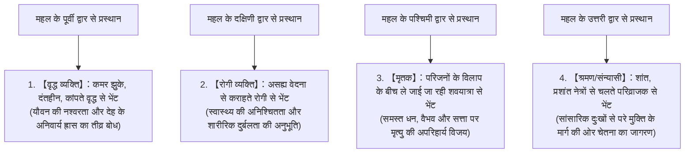

## प्रस्तावना: बुद्ध (संबुद्ध) का प्रादुर्भाव और मानव विचार-इतिहास की महान क्रांति

छठी शताब्दी ईसा पूर्व से पांचवीं शताब्दी ईसा पूर्व के मध्य, प्राचीन भारत की मध्य गंगा घाटी के क्षेत्र में उभरे दार्शनिक उद्वेलन (तथाकथित "धुरी काल" या "एक्सियल एज") के केंद्र में, गौतम सिद्धार्थ (Gautama Siddhārtha, पालि: गोतम सिद्धत्थ) द्वारा प्रवर्तित "बौद्ध धर्म (बुद्ध शासन / बुद्ध धम्म)" ने तत्कालीन वैदिक एवं औपनिषदिक प्राचीन भारतीय धार्मिक-दार्शनिक चिंतन को आमूलचूल परिवर्तित कर दिया। यह मानव के आध्यात्मिक और बौद्धिक इतिहास की अब तक की सबसे युगांतरकारी दार्शनिक एवं अस्तित्वपरक क्रांति थी।

'बुद्ध' (Buddha) किसी विशिष्ट देवी-देवता का व्यक्तिगत नाम नहीं है, अपितु संस्कृत और पालि भाषा में इसका अर्थ "जागृत व्यक्ति" अथवा "परम सत्य को जान लेने वाला (संबुद्ध / तत्वदर्शी)" है। यह एक गुणवाचक संज्ञा है। सिद्धार्थ द्वारा संस्थापित इस धम्म का मूल मर्म ब्रह्मांड के किसी सृष्टिकर्ता ईश्वर के प्रति अंधविश्वास अथवा पुरोहित वर्ग (ब्राह्मणों) द्वारा किए जाने वाले पशु-बलि व कर्मकांडीय अनुष्ठानों का पूर्ण परित्याग करना था। इसके स्थान पर, उन्होंने "मानव अस्तित्व के अंतर्निहित संरचनात्मक दुःख (दुक्ख)" का अत्यंत निष्पक्ष व वस्तुपरक विश्लेषण किया, उसके कारणों का कार्य-कारण सिद्धांत के आधार पर विखंडन किया, तथा स्वयं के सजग प्रेक्षण और साधना द्वारा मोक्ष/निर्वाण (निब्बान) तक पहुँचने का एक "वैज्ञानिक, अनुभवाश्रित एवं व्यावहारिक प्रज्ञा-मार्ग (एपिस्टीम)" प्रस्तुत किया।

बौद्ध धर्म आधुनिक अर्थों में प्रयुक्त संकुचित "धर्म (रिलीजन)" की सीमा से कहीं परे है। यह एक अत्यंत सूक्ष्म संज्ञानात्मक विज्ञान (कॉग्निटिव साइंस), एक गहन मनोचिकित्सा (साइकोथेरेपी), भाषा का आलोचनात्मक विश्लेषण और एक अस्तित्वपरक संवृत्तिशास्त्र (फेनोमेनोलॉजी) था। प्रस्तुत शोध-आलेख में, गौतम सिद्धार्थ के जीवन एवं उनके दार्शनिक रूपांतरण, चार आर्य सत्य, अष्टांगिक मार्ग, द्वादश निदान (प्रतीत्यसमुत्पाद) की तार्किक व गणितीय संरचना, पञ्चस्कन्ध और अनात्म (अनत्ता) का तत्वमीमांसीय विच्छेदन, पालि धर्मग्रंथों का भाषावैज्ञानिक पठन, तथा आधुनिक संज्ञानात्मक तंत्रिका विज्ञान, संवृत्तिशास्त्र और सचेतनता (माइंडफुलनेस) के साथ इसके गहन तात्विक संवाद को अत्यंत अकादमिक प्रामाणिकता और व्यापक परिप्रेक्ष्य में उद्घाटित किया गया है।

```
【प्राचीन भारतीय चिंतन परंपरा में बौद्ध धर्म का प्रतिमान-विस्थापन (पैराडाइम शिफ्ट)】

┌─────────────────┬───────────────────────────────┬───────────────────────────────┐
│ तुलना के बिंदु  │ रूढ़िवादी वैदिक/उपनिषद् दर्शन  │ प्रारंभिक बौद्ध दर्शन (गौतम बुद्ध)│
├─────────────────┼───────────────────────────────┼───────────────────────────────┤
│ परम तत्व        │ ब्रह्म (ब्रह्मांड का शाश्वत मूल)│ धर्म/धम्म (प्रतीत्यसमुत्पाद/सार्वभौमिक नियम)│
│ आत्मा की अवधारणा│ आत्मन् (अविनाशी, नित्य जीवात्मा)│ अनात्म/अनत्ता (स्थायी आत्मा का पूर्ण निषेध) │
│ मुक्ति का मार्ग │ ब्रह्मात्मैक्य-बोध, यज्ञ, तपस्या│ चार आर्य सत्य, अष्टांगिक मध्यम मार्ग, विपश्यना│
│ सामाजिक दृष्टिकोण│ वर्ण-व्यवस्था (जाति) का समर्थन│ जाति-भेद का खंडन, सार्वभौमिक समता│
│ ज्ञानमीमांसा    │ वेदों के अपौरुषेय प्रमाण पर आस्था│ एहिपस्सिका/आत्म-परीक्षण (स्वयं अनुभव व विवेक)│
└─────────────────┴───────────────────────────────┴───────────────────────────────┘
```

---

## 1. गौतम सिद्धार्थ का जीवन और दार्शनिक रूपांतरण

### 1.1 शाक्य वंश के राजकुमार के रूप में जन्म और चार दृश्यों का आघात
गौतम सिद्धार्थ का जन्म हिमालय की तराई में, वर्तमान दक्षिणी नेपाल के लुम्बिनी में हुआ था। वे शाक्य गणराज्य की राजधानी कपिलवस्तु पर शासन करने वाले राजा शुद्धोदन और महारानी मायादेवी के ज्येष्ठ पुत्र थे।

प्रचलित आख्यानों के अनुसार, सिद्धार्थ ने जन्म लेते ही चारों दिशाओं में सात-सात पग चले और उद्घोष किया, "आकाश के नीचे और पृथ्वी के ऊपर केवल मैं ही श्रेष्ठ हूँ।" परंतु यदि ऐतिहासिक और भाषावैज्ञानिक दृष्टि से देखा जाए, तो वे पूर्वी भारत के एक प्रमुख गण-संघीय (गण-संघ प्रणाली) कुलीन क्षत्रिय परिवार के राजकुमार थे, जिन्हें जीवन में सभी प्रकार के भौतिक सुख, संपदा और ऐश्वर्य सुलभ थे। उनके पिता राजा शुद्धोदन को सदैव यह भय सताता रहता था कि कहीं सिद्धार्थ संन्यास लेकर गृहत्याग न कर दें। अतः उन्होंने सिद्धार्थ के लिए तीन ऋतुओं (ग्रीष्म, वर्षा और शीत) के अनुकूल तीन भव्य प्रासादों (महलों) का निर्माण कराया, उन्हें सुंदरियों के नृत्य-संगीत और आमोद-प्रमोद से परिपूर्ण रखा, तथा वृद्धावस्था, बीमारी और मृत्यु जैसी मानवीय जीवन की कटु वास्तविकताओं को उनकी दृष्टि से पूर्णतः दूर रखने का भरसक प्रयास किया।

किंतु सिद्धार्थ की असाधारण तीक्ष्ण बुद्धि और संवेदनशील चेतना ने इस कृत्रिम सुख-स्वर्ग के खोखलेपन को शीघ्र ही पहचान लिया। बौद्ध परंपरा में इसे "चार दृश्यों (चतुर निमित्त)" के रूप में अत्यंत मार्मिक ढंग से चित्रित किया गया है।



चार दृश्यों की यह गाथा केवल एक पौराणिक रूपक मात्र नहीं है, अपितु यह **"अस्तित्वपरक संकट (Existential Crisis)"** का एक सार्वभौमिक प्रतिमान प्रस्तुत करती है। मनुष्य चाहे कितना भी धनवान, सत्तासंपन्न या स्वस्थ क्यों न हो, वह "वृद्ध होना", "रोगी होना" और "मरना" — इन तीन परम सीमाओं से एक क्षण के लिए भी बच नहीं सकता। सिद्धार्थ ने दूसरों की वृद्धावस्था, रोग और मृत्यु को देखकर यह गहन बोध प्राप्त किया: "यह किसी दूर भविष्य में घटने वाली किसी अन्य व्यक्ति की घटना नहीं है, अपितु इसी क्षण मुझ स्वयं की नियति और अपरिहार्य सत्य है।" इसी मर्मभेदी नैराश्य और अस्तित्वपरक आत्म-बोध ने उन्हें 29 वर्ष की आयु में राजमहल का परित्याग कर "महाभिनिष्क्रमण (महान गृहत्याग)" के लिए प्रेरित किया।

### 1.2 गृहत्याग, गुरुओं से शिक्षा, घोर तपस्या और उसकी विफलता
अपनी पत्नी यशोधरा और नवजात पुत्र राहुल तथा राजपद के समस्त ऐश्वर्य को त्यागकर, सिद्धार्थ ने अपने केश मुंडवाए, काषाय वस्त्र धारण किए और सत्य की खोज में एक "श्रमण (सत्य के खोजी परिव्राजक)" बन गए।

उन्होंने सर्वप्रथम तत्कालीन दो अत्यंत प्रतिष्ठित ध्यान-गुरुओं से दीक्षा ली:
1. **आलार कालाम (Āḷāra Kālāma)**: इन्होंने सिद्धार्थ को "आकिंचन्यायतन समापत्ति (Akiñcaññāyatana / शून्यता अथवा 'कुछ भी विद्यमान नहीं है' की उच्च मानसिक एकाग्रता)" की शिक्षा दी। सिद्धार्थ ने अत्यंत अल्पकाल में इस ध्यान-अवस्था को सिद्ध कर लिया, किंतु उन्होंने पाया कि ध्यान से बाहर आते ही सांसारिक दुःख पुनः लौट आते हैं। अतः इसे परम मुक्ति न मानकर वे आगे बढ़ गए।
2. **उद्दक रामपुत्त (Uddaka Rāmaputta)**: इन्होंने "नैवसंज्ञानासंज्ञायतन समापत्ति (Nevasaññānāsaññāyatana / ध्यान की वह पराकाष्ठा जहाँ न कोई स्पष्ट विचार रहता है और न ही पूर्ण अचेतनता)" का मार्गदर्शन किया। सिद्धार्थ ने यहाँ भी शीघ्र ही गुरु के समान सिद्धि प्राप्त कर ली, किंतु उन्होंने निष्कर्ष निकाला कि इससे भी मूल अविद्या और दुःख का समूल नाश नहीं होता।

मानसिक ध्यानावस्थाओं की सीमा को समझकर, सिद्धार्थ ने अब शारीरिक तपस्या द्वारा तृष्णाओं को नष्ट करने वाले "घोर तप (तपस्)" का मार्ग चुना। मगध के उरुवेला (वर्तमान बोधगया) के वनों में, अपने पाँच साथी साधकों (कौंडिन्य आदि पंच भद्रवर्गीय भिक्षु) के साथ, उन्होंने श्वास रोकने की कठोर साधना की, प्रचंड धूप में तपस्या की, और अंततः प्रतिदिन मात्र एक तिल या चावल का दाना ग्रहण कर छह वर्षों तक घोर उपवास किया।

परिणामस्वरूप, सिद्धार्थ का शरीर कंकाल मात्र रह गया; उनकी छाती की पसलियाँ दिखने लगीं, सिर की त्वचा सूखे कद्दू की भांति सिकुड़ गई, और जब वे खड़े होने का प्रयास करते तो दुर्बलतावश गिर पड़ते। किंतु मृत्यु के कगार पर पहुँचकर भी, जिस मानसिक परम शांति और सत्य के साक्षात्कार की वे खोज कर रहे थे, वह उन्हें प्राप्त नहीं हुआ। यहीं पर सिद्धार्थ ने मानव विचार-इतिहास की एक युगांतरकारी अंतर्दृष्टि प्राप्त की:

> **"शरीर को अत्यधिक कष्ट पहुँचाने वाली तपस्या केवल देह को नष्ट करती है और मन को शिथिल बनाती है; इससे सच्ची प्रज्ञा और बोधि प्राप्त नहीं हो सकती। जिस प्रकार इंद्रिय-सुखों में लिप्त रहना (भोगवाद) भ्रांत है, उसी प्रकार स्वयं को प्रताड़ित करना (कठोर तपस्यावाद) भी उतना ही व्यर्थ है।"**

सिद्धार्थ ने कठोर तपस्या का पूर्णतः परित्याग करने का दृढ़ निर्णय लिया। उन्होंने निरंजना (नैरांजना) नदी में स्नान कर छह वर्षों की धूल और मैल को धोया। जब वे दुर्बल होकर नदी के तट पर गिरे पड़े थे, तब पास के सेनानी गाँव की एक कन्या सुजाता (Sujātā) ने उन्हें ताजी खीर (पायस) अर्पित की। सिद्धार्थ ने उस खीर को ग्रहण किया, जिससे उनके शरीर में ऊर्जा और चेतना का अद्भुत संचार हुआ। यह देखकर उनके पाँचों साथी साधकों ने उनका तिरस्कार किया और यह कहकर उन्हें छोड़ दिया कि "गौतम साधना से भ्रष्ट हो गया है और उसने भोग का मार्ग चुन लिया है।"

```
【दो अतियों (चरम सीमाओं) का त्याग और मध्यम प्रतिपदा (मज्झिमा पटिपदा) की खोज】

इंद्रिय-सुखों में अत्यधिक लिप्ति  ←─────［मध्यम मार्ग］─────→  शरीर को घोर यातना देना
 (राजमहल का विलासपूर्ण जीवन)         (सच्ची प्रज्ञा व शांति)          (उरुवेला की कठोर तपस्या)
※ वीणा के तार यदि बहुत कसे हों तो टूट जाते हैं, और यदि बहुत ढीले हों तो स्वर नहीं निकलता। मध्यम तनाव ही मधुर संगीत उत्पन्न करता है।
```

### 1.3 बोधिवृक्ष के नीचे संबोधि: मार-विजय और 'बुद्ध' का प्रादुर्भाव
शारीरिक बल पुनः प्राप्त कर, सिद्धार्थ बोधगया में अश्वत्थ वृक्ष (जिसे कालांतर में "बोधिवृक्ष" कहा गया) के नीचे कुश का आसन बिछाकर पद्मासन में बैठ गए और एक अडिग संकल्प लिया:
**"इहासने शुष्यतु मे शरीरं, त्वगस्थिमांसं प्रलयं च यातु। अप्राप्य बोधिं बहुकल्पदुर्लभां, नैवासनात् कायमतश्चलिष्यते॥"**
("चाहे मेरा यह शरीर सूख जाए, मेरी त्वचा, अस्थियाँ और मांस नष्ट हो जाएं, किंतु अनेक कल्पों में दुर्लभ परम संबोधि प्राप्त किए बिना मैं इस आसन से कदापि नहीं उठूँगा।")

बौद्ध आख्यानों के अनुसार, इस अवसर पर सिद्धार्थ के अंतर्मन में उमड़ने वाली समस्त वासनाओं, भयों, संशयों और आसक्तियों ने मानवीकृत रूप धारण कर "मार (Māra / कामदेव-मृत्यु का प्रतीक)" के रूप में उन पर भीषण आक्रमण किया।
मार ने सर्वप्रथम अपनी तीन परम सुंदरी पुत्रियों (तृष्णा, रति, और राग) को भेजकर सिद्धार्थ को प्रलोभित करने की चेष्टा की। जब सिद्धार्थ अपने ध्यान में अविचल रहे, तब मार ने भयंकर आंधी, मूसलाधार वर्षा, जलते हुए अंगारे और भयानक दैत्यों की सेना भेजकर उन्हें भयभीत करना चाहा। अंत में मार ने ललकारते हुए कहा, "हे सिद्धार्थ! इस बोधि-आसन पर बैठने की तुम्हारी क्या पात्रता है? तुम्हारा साक्षी कौन है?" सिद्धार्थ ने शांत भाव से अपना दायां हाथ नीचे किया और अपनी अंगुलियों से पृथ्वी का स्पर्श किया (यह मुद्रा बौद्ध कला में "भूमिस्पर्श मुद्रा" अथवा "मार-विजय मुद्रा" कहलाती है)। तब पृथ्वी ने गंभीर गर्जना करते हुए साक्षी दी: "मैं साक्षी हूँ कि इन्होंने अनगिनत पूर्वजन्मों में निःस्वार्थ भाव से पारमिताओं का संचय किया है।" मार की सेना तितर-बितर हो गई और मन के समस्त क्लेशों (किलेस) का समूल विनाश हो गया।

रात्रि के प्रथम प्रहर (सायं 6 से 10 बजे) में, सिद्धार्थ ने अपने असंख्य पूर्वजन्मों के स्मरण का ज्ञान — **"पूर्वनिवासानुस्मृति ज्ञान" (पुब्बेनिवासानुस्सतिญาण)** प्राप्त किया।
रात्रि के द्वितीय प्रहर (रात्रि 10 से 2 बजे) में, उन्होंने समस्त प्राणियों के अपने कर्मों के अनुसार जन्म-मरण के चक्र में घूमने के नियम को देखने वाली दिव्य दृष्टि — **"दिव्यचक्षु ज्ञान" (दिव्वचक्खुญาण)** प्राप्त की।
और रात्रि के अंतिम प्रहर (प्रातः 2 से 6 बजे) में, जब पूर्व दिशा में भोर का तारा चमक उठा, तब उन्होंने समस्त अस्तित्व की पारस्परिकता को प्रकट करने वाले कार्य-कारण नियम — **"द्वादश निदान" (प्रतीत्यसमुत्पाद)** का अनुलोम और प्रतिलोम विधि से पूर्ण साक्षात्कार किया तथा समस्त मानसिक आस्रवों को समूल नष्ट करने वाला **"आस्रवक्षय ज्ञान" (आसवक्खयญาण)** सिद्ध किया।

इस प्रकार, सिद्धार्थ ने अनुत्तर सम्यक्संबोधि (पूर्ण प्रबुद्धता) प्राप्त की और वे मनुष्यता का अतिक्रमण कर **"बुद्ध (शाक्यमुनि तथागत)"** बन गए। उस समय उनकी आयु 35 वर्ष थी।

### 1.4 ब्रह्मा की प्रार्थना और धर्मचक्रप्रवर्तन: मौन से विश्व-धर्म की ओर छलांग
संबोधि प्राप्त करने के पश्चात, बुद्ध गहरे चिंतन में मग्न हो गए और उन्होंने स्वयं द्वारा जाने गए इस धर्म (धम्म) को संसार के सम्मुख प्रकट करने में संकोच का अनुभव किया। उन्होंने विचार किया: "मैंने जिस सत्य का साक्षात्कार किया है, वह अत्यंत गहन, सूक्ष्म, दुर्विज्ञेय, शांत और तर्क से परे है; इसे केवल प्रज्ञावान ही जान सकते हैं। जो संसार वासना, राग और आसक्ति के अंधकार में डूबा हुआ है, उसे यदि मैं यह उपदेश दूँ, तो वे इसे समझ नहीं पाएंगे और मुझे केवल व्यर्थ का श्रम व थकान ही प्राप्त होगी।" बुद्ध ने किसी को उपदेश न देकर मौन रहकर निर्वाण के आनंद में ही लीन रहने का विचार किया।

तभी, प्राचीन भारतीय देव-परंपरा के सर्वोच्च देव ब्रह्मा सहंपति (Brahmā Sahampati) स्वर्ग से अवतरित हुए। उन्होंने बुद्ध के समक्ष नतमस्तक होकर हाथ जोड़े और तीन बार अत्यंत करुणापूर्ण शब्दों में प्रार्थना की। बौद्ध इतिहास में यह प्रसंग **"ब्रह्मा-याचना (ब्रह्म-निमंत्रण)"** के नाम से विख्यात है:

"हे भगवन! कृपया धर्म का उपदेश दें! हे सुगत! धर्म का प्रकाश फैलाएं! इस संसार में कुछ ऐसे प्राणी भी हैं जिनकी आँखों पर अविद्या की धूल बहुत कम है। यदि वे धर्म का श्रवण नहीं करेंगे तो पतित हो जाएंगे, किंतु यदि वे धर्म को सुनेंगे तो निश्चय ही परम सत्य को प्राप्त कर लेंगे।"

बुद्ध ने करुणा की दृष्टि से समस्त संसार का अवलोकन किया। उन्होंने देखा कि जिस प्रकार किसी सरोवर में कमल के कुछ फूल कीचड़ और जल के भीतर डूबे रहते हैं, कुछ जल की सतह तक पहुँच जाते हैं, और कुछ जल से ऊपर उठकर निर्मल रूप से खिलते हैं, उसी प्रकार संसार के मनुष्यों में भी प्रज्ञा और योग्यता के विभिन्न स्तर हैं। बुद्ध ने अपने मौन को तोड़ने का ऐतिहासिक निर्णय लिया:

> **"अपारुता तेसं अमतस्स द्वारा, ये सोतवन्तो पमुञ्चन्तु सद्धं।"**
> **("अमृत के द्वार सभी के लिए खुल गए हैं! जिनके कान हों, वे अपनी श्रद्धा के साथ आगे आएं और श्रवण करें!")**

बुद्ध अपने उन पाँच साथी साधकों को खोजने के लिए, जिन्होंने उन्हें त्याग दिया था, सैकड़ों किलोमीटर की पदयात्रा कर सारनाथ (ऋषिपत्तन / मृगदाव) पहुँचे। जब उन पाँचों साधकों ने दूर से बुद्ध को अपनी ओर आते देखा, तो उन्होंने पहले यह निश्चय किया कि "हम गौतम का कोई सत्कार नहीं करेंगे, क्योंकि वह साधना से भ्रष्ट हो चुका है।" किंतु जैसे ही बुद्ध समीप आए, उनके दिव्य तेज, गरिमा और असीम शांति से अभिभूत होकर वे अनायास ही उठ खड़े हुए, उनके चरण धोए, उनके लिए आसन बिछाया और नतमस्तक हो गए।

यहाँ बुद्ध ने मानव इतिहास का अपना प्रथम धर्मोपदेश दिया, जिसे **"धर्मचक्रप्रवर्तन" (पालि: धम्मचक्कप्पवत्तन / 'धर्म के पहिये को गतिमान करना')** कहा जाता है। इस उपदेश में उन्होंने "मध्यम मार्ग", "चार आर्य सत्य" और "आर्य अष्टांगिक मार्ग" की देशना दी। इस उपदेश को सुनते ही, पाँचों साधकों में सबसे वयोवृद्ध कौंडिन्य (Kondañña) ने यह परम सत्य साक्षात कर लिया: **"यं किञ्चि समुदयधम्मं सब्बं तं निरोधधम्मं"** ("जो कुछ भी उत्पन्न होने के स्वभाव वाला है, वह सब निरुद्ध (नष्ट) होने के स्वभाव वाला है")। कौंडिन्य की प्रज्ञा की आँखें (धर्मचक्षु) खुल गईं। इसी क्षण पृथ्वी पर बुद्ध (मार्गदर्शक), धर्म (सत्य की शिक्षा), और संघ (साधकों का समुदाय) — इन **"त्रिरत्नों"** की विधिवत स्थापना हुई।

---

## 2. बौद्ध धर्म के सिद्धांत का आधार: चार आर्य सत्य (Cattāri Ariyasaccāni) की तार्किक संरचना

बुद्ध की देशना कोई रहस्यवादी हठधर्मिता या अंधविश्वास पर आधारित सिद्धांत नहीं थी, अपितु यह प्राचीन भारतीय आयुर्वेद चिकित्सा प्रणाली के "रोग, रोग का कारण (हेतु), स्वास्थ्य (आरोग्य), और औषधि/उपचार (भैषज्य)" की चतुर्व्यूह संरचना को मानव मन और चेतना पर पूर्णतः लागू करने वाली एक **"अस्तित्वपरक नैदानिक चिकित्सा (एग्जिस्टेंशियल क्लिनिकल मेडिसिन)"** थी। इसका मूल आधार **"चार आर्य सत्य" (पालि: चत्तारि अरियसच्चानि)** हैं।

```
【चिकित्सा विज्ञान के नैदानिक प्रतिमान और चार आर्य सत्यों की संरचनात्मक समरूपता】

┌─────────────────┬───────────────────────────────┬───────────────────────────────┐
│ चिकित्सा प्रतिमान│ बौद्ध धर्म के चार आर्य सत्य   │ अंतर्वस्तु एवं अस्तित्वपरक अर्थ│
├─────────────────┼───────────────────────────────┼───────────────────────────────┤
│ 1. रोग की पहचान │ दुःख सत्य (दुक्ख सच्च)         │ मानव जीवन का आधारभूत यथार्थ 'दुःख' है│
│ 2. रोग का कारण  │ समुदय सत्य (समुदय सच्च)       │ दुःख की मूल जड़ 'तृष्णा (तन्हा)' है│
│ 3. आरोग्य अवस्था│ निरोध सत्य (निरोध सच्च)       │ तृष्णा का समूल नाश = निर्वाण (निब्बान)│
│ 4. उपचार/नुस्खा │ मार्ग सत्य (मग्ग सच्च)         │ निर्वाण तक पहुँचाने वाला मार्ग = अष्टांगिक मार्ग│
└─────────────────┴───────────────────────────────┴───────────────────────────────┘
```

### 2.1 दुःख सत्य (Dukkha-sacca): अस्तित्व की संरचनात्मक "अतृप्ति"
जब बौद्ध धर्म यह घोषणा करता है कि "सब कुछ दुःख है (सब्वे संखारा दुक्खा)", तो यहाँ प्रयुक्त 'दुःख' (Dukkha) शब्द का अर्थ केवल साधारण शारीरिक पीड़ा या भावनात्मक शोक-संताप मात्र नहीं है।
पालि भाषा के *dukkha* शब्द की व्युत्पत्ति प्राचीन रथ के पहिये से जुड़ी है: जहाँ *kha* का अर्थ धुरी का छिद्र है और *du* का अर्थ विकृत, असंतुलित या खराब होना है। जब रथ की धुरी का छेद असंतुलित होता है, तो पहिया सहजता से नहीं घूमता और लगातार खड़खड़ाहट व झटका पैदा करता है। अतः दुःख का वास्तविक दार्शनिक अर्थ है: **"चीजों का हमारे मनोनुकूल न होना", "आधारभूत असंतोष", "अस्थिरता" और "अस्तित्वपरक सामंजस्य का अभाव"**।

प्रारंभिक बौद्ध धर्म ने जीवन के दुःखों को निम्नलिखित **"चार दुःख और आठ दुःख" (चतुर दुःख, अष्ट दुःख)** के रूप में अत्यंत सूक्ष्मता से वर्गीकृत किया है:

1. **जाति दुःख (जन्म)**: जन्म लेना और जीवन की सतत जैविक प्रक्रियाओं का होना ही दुःख का आधार है।
2. **जरा दुःख (वृद्धावस्था)**: शरीर और इंद्रियों की शक्ति का क्रमशः क्षीण होते जाना।
3. **व्याधि दुःख (रोग)**: शारीरिक एवं मानसिक रोगों की पीड़ा से ग्रस्त होना।
4. **मरण दुःख (मृत्यु)**: जीवन का अंत और अस्तित्व के मिट जाने का अपरिहार्य भय।
5. **प्रिय विप्रयोग दुःख**: अपनी प्रिय वस्तुओं, परिस्थितियों और प्रियजनों से बिछड़ना।
6. **अप्रिय संप्रयोग दुःख**: अप्रिय व्यक्तियों, घृणास्पद परिस्थितियों और कष्टों के साथ रहने को बाध्य होना।
7. **यदपिच्छं न लभति तम्पि दुःखं (इच्छा-विघात दुःख)**: जो चाहा जाए, उसका प्राप्त न होना।
8. **संक्षित्तेन पञ्चुपादानक्खन्धा दुक्खा (पञ्च उपादान स्कन्ध दुःख)**: संक्षेप में, अपने अस्तित्व का निर्माण करने वाले पाँचों तत्वों (पञ्चस्कन्ध) के प्रति आसक्ति ही समस्त दुःखों का मूल पुंज है।

### 2.2 समुदय सत्य (Samudaya-sacca): दुःख की उत्पत्ति का तंत्र और "तृष्णा"
यदि दुःख विद्यमान है, तो निश्चय ही उसका कोई न कोई कारण (समुदय) अवश्य होना चाहिए। समुदय सत्य यह उद्घाटित करता है कि दुःख की परम जड़ **"तृष्णा" (पालि: तन्हा / Taṇhā)** में निहित है।
'तन्हा' का शाब्दिक अर्थ 'प्यास' है। जिस प्रकार मरुस्थल में प्यास से व्याकुल व्यक्ति जल की एक-एक बूँद के लिए तड़पता है, उसी प्रकार इंद्रिय-विषयों को निरंतर भोगने, उन्हें पकड़कर रखने और कभी न खोने की अंधी मानसिक ललक ही तृष्णा है।

बुद्ध ने तृष्णा को तीन मुख्य रूपों में विश्लेषित किया:
- **काम-तृष्णा (Kāma-taṇhā)**: पाँचों ज्ञानेंद्रियों (रूप, शब्द, गंध, रस, स्पर्श) के सुख-भोग की लालसा।
- **भव-तृष्णा (Bhava-taṇhā)**: स्वयं के अस्तित्व को बनाए रखने, शाश्वत रूप से जीवित रहने, नाम, पद, सत्ता और संपदा का विस्तार करने की तृष्णा (जीने की अंधी चाह)।
- **विभव-तृष्णा (Vibhava-taṇhā)**: कष्टों, असफलताओं या ग्लानि से भागने के लिए स्वयं को नष्ट कर लेने, मृत्यु की कामना करने या सब कुछ मिटा देने की तृष्णा (उच्छेदवाद या विनाश की चाह)।

तृष्णा की सबसे भयानक विभीषिका उसकी "व्यसनकारी संरचना (एडिक्टिव लूप)" में है। यह समुद्र का खारा पानी पीने के समान है; इसे जितना अधिक पिया जाता है, प्यास उतनी ही भड़कती जाती है, और मनुष्य कभी न समाप्त होने वाले दुःख और भव-चक्र में उलझा रहता है।

### 2.3 निरोध सत्य (Nirodha-sacca): दुःख का आत्यंतिक क्षय और "निर्वाण"
जिस प्रकार रोग के मूल कारण को दूर कर देने पर स्वास्थ्य पुनः प्राप्त हो जाता है, उसी प्रकार दुःख के कारणभूत तृष्णा के सर्वथा नष्ट हो जाने पर जिस परम अवस्था का साक्षात्कार होता है, वही निरोध सत्य है। यही बौद्ध धर्म का अंतिम लक्ष्य — **"निर्वाण" (पालि: निब्बान / Nibbāna)** है।

'निर्वाण' शब्द की व्युत्पत्ति 'निर् + वा' से हुई है, जिसका अर्थ है **"दीपक का बुझ जाना"**। लोभ (राग), द्वेष (क्रोध), और मोह (अविद्या) रूपी "तीन विषों की अग्नि" का सर्वथा बुझ जाना और मन का अत्यंत शीतल, शांत और प्रशांत हो जाना ही निर्वाण है। निर्वाण मृत्यु के पश्चात प्राप्त होने वाला कोई काल्पनिक स्वर्गिक लोक नहीं है, अपितु **"इसी जीवन में, इसी क्षण, मन के समस्त बंधनों और क्लेशों से पूर्ण मुक्ति की परम स्वतंत्र अवस्था"** है।

### 2.4 मार्ग सत्य (Magga-sacca): निर्वाण का क्रियान्वयन - "आर्य अष्टांगिक मार्ग"
दुःख के पूर्ण निरोध और निर्वाण की प्राप्ति के लिए बुद्ध द्वारा उपदिष्ट व्यावहारिक और क्रियात्मक मार्ग ही मार्ग सत्य है। इसे **"आर्य अष्टांगिक मार्ग" (Ariyo aṭṭhaṅgiko maggo)** कहा जाता है। यह मार्ग आठ अंगों से मिलकर बना है, जिन्हें पारंपरिक रूप से **"त्रिशिक्षा" (शील, समाधि, प्रज्ञा)** के तीन स्तंभों में समाहित किया जाता है।

```
【आर्य अष्टांगिक मार्ग की संरचना और त्रिशिक्षा (शील, समाधि, प्रज्ञा) का समन्वय】

┌───────────────┬───────────────────────────────┬───────────────────────────────┐
│ त्रिशिक्षा     │ अष्टांगिक मार्ग के अंग         │ व्यावहारिक परिभाषा एवं कार्य   │
├───────────────┼───────────────────────────────┼───────────────────────────────┤
│ प्रज्ञा स्कन्ध│ 1. सम्यक् दृष्टि (Sammā-diṭṭhi)│ चार आर्य सत्य, प्रतीत्यसमुत्पाद व कर्म-नियम को यथार्थ समझना│
│ (Wisdom)      │ 2. सम्यक् संकल्प (Sammā-saṅkappa)│ राग, द्वेष और हिंसा से मुक्त होकर निष्काम व करुणामय विचार रखना│
├───────────────┼───────────────────────────────┼───────────────────────────────┤
│ शील स्कन्ध    │ 3. सम्यक् वाक् (Sammā-vācā)    │ असत्य, कटु वचन, चुगली और निरर्थक प्रलाप का त्याग करना│
│ (Ethics)      │ 4. सम्यक् कर्मान्त (Sammā-kammanta)│ हिंसा, चोरी और व्यभिचार जैसे दूषित कर्मों से विरत रहना│
│               │ 5. सम्यक् आजीव (Sammā-ājīva)   │ शस्त्र, विष, मांस, मदिरा व दास-व्यापार रहित पवित्र आजीविका│
├───────────────┼───────────────────────────────┼───────────────────────────────┤
│ समाधि स्कन्ध  │ 6. सम्यक् व्यायाम (Sammā-vāyāma)│ उत्पन्न अकुशल धर्मों को मिटाने व नए कुशल धर्मों को जगाने का यत्न│
│ (Meditation)  │ 7. सम्यक् स्मृति (Sammā-sati)  │ काया, वेदना, चित्त और धर्मों का 'यहाँ और अभी' तटस्थ अवलोकन│
│               │ 8. सम्यक् समाधि (Sammā-samādhi)│ मन को एकाग्र कर प्रथम से चतुर्थ ध्यान की परम शांति सिद्ध करना│
└───────────────┴───────────────────────────────┴───────────────────────────────┘
```

आर्य अष्टांगिक मार्ग कोई ऐसा मार्ग नहीं है जिसके अंगों का अभ्यास एक के बाद एक अलग-अलग क्रम में किया जाए, अपितु यह रथ के आठ आ Hyper-interconnected आरे (Spokes) की भांति परस्पर निर्भर होकर कार्य करने वाली एक जैविक प्रणाली है। सम्यक् दृष्टि से संसार का यथार्थ बोध होता है; शील (सम्यक् वाक्, कर्मान्त, आजीव) द्वारा आचरण और कर्म शुद्ध होते हैं; और समाधि (सम्यक् व्यायाम, स्मृति, समाधि) द्वारा चित्त निर्मल व एकाग्र होता है। इस निर्मल चित्त से सम्यक् दृष्टि और अधिक परिपक्व होती है, जो अंततः साधक को पूर्ण विमुक्ति (निर्वाण) की ओर ले जाती है।

---

## 3. तत्वमीमांसा की गहराई: द्वादश निदान (प्रतीत्यसमुत्पाद) और पञ्चस्कन्ध

### 3.1 प्रतीत्यसमुत्पाद (Paṭicca-samuppāda): बुद्ध की सर्वोच्च खोज
बौद्ध दर्शन की सर्वाधिक गहन, सूक्ष्म और मौलिक आधारशिला, जो इसे विश्व के अन्य सभी दर्शनों से सर्वथा पृथक करती है, वह **"प्रतीत्यसमुत्पाद" (पालि: पटिच्च-समुप्पाद / Dependent Origination)** का सिद्धांत है।
'प्रतीत्य' का अर्थ है 'किसी हेतु या शर्त के उपस्थित होने पर', और 'समुत्पाद' का अर्थ है 'उत्पन्न होना'। अर्थात "कारण और प्रत्ययों (शर्तों) पर निर्भर होकर ही किसी वस्तु का आविर्भाव होना।"

बुद्ध ने पालि त्रिपिटक में प्रतीत्यसमुत्पाद के नियम को अत्यंत संक्षिप्त, वैज्ञानिक और गणितीय सूत्र के रूप में इस प्रकार निरूपित किया है:

> **"इमस्मिं सति इदं होति, इमस्सुप्पादा इदं उप्पज्जति।**
> **इमस्मिं असति इदं न होति, इमस्स निरोधा इदं निरुज्झति॥"**
> *(इसके होने पर यह होता है; इसके उत्पन्न होने से यह उत्पन्न होता है।)*
> *(इसके न होने पर यह नहीं होता; इसके निरुद्ध होने से यह निरुद्ध हो जाता है।)*
> — (संयुत्त निकाय)

संसार में विद्यमान कोई भी वस्तु या परिघटना (चाहे वह भौतिक पदार्थ हो, विचार हो, जीवन हो या समाज) एकाकी, स्वतंत्र और शाश्वत रूप से विद्यमान "स्वतंत्र सत्ता" नहीं है। प्रत्येक तत्व अनगिनत कारणों और प्रत्ययों के परस्पर गुंथे हुए जाल (इंद्रजाल) के भीतर ही क्षण-क्षण प्रकट हो रहा है। न कोई निरपेक्ष सृष्टिकर्ता ईश्वर है, न कोई अकारण प्रथम कारण। कारण उपस्थित होने पर कार्य प्रकट होता है, और कारणों के विलीन हो जाने पर कार्य समाप्त हो जाता है — यही संपूर्ण ब्रह्मांड का सार्वभौमिक नियम (धर्म / धम्म) है।

### 3.2 द्वादश निदान की कारण-श्रृंखला
संबोधि की रात्रि में बुद्ध ने यह अन्वेषण किया कि मनुष्य बुढ़ापे, बीमारी और मृत्यु के अंतहीन चक्र में क्यों फंसा रहता है। उन्होंने इस कार्यकारण-तंत्र को बारह कड़ियों (द्वादश निदान) के रूप में उद्घाटित किया:

```mermaid
graph LR
    A["1. अविद्या<br/>(Avijjā)"] --> B["2. संस्कार<br/>(Saṅkhāra)"]
    B --> C["3. विज्ञान<br/>(Viññāṇa)"]
    C --> D["4. नाम-रूप<br/>(Nāmarūpa)"]
    D --> E["5. षड़ायतन<br/>(Saḷāyatana)"]
    E --> F["6. स्पर्श<br/>(Phassa)"]
    F --> G["7. वेदना<br/>(Vedanā)"]
    G --> H["8. तृष्णा<br/>(Taṇhā)"]
    H --> I["9. उपादान<br/>(Upādāna)"]
    I --> J["10. भव<br/>(Bhava)"]
    J --> K["11. जाति<br/>(Jāti)"]
    K --> L["12. जरा-मरण<br/>(Jarāmaraṇa)"]
```



```
【द्वादश निदान की बारह कड़ियां और मानवीय अस्तित्व का मनोवैज्ञानिक विकास】

1. अविद्या (Avijjā): मूल अज्ञान; चार आर्य सत्य, प्रतीत्यसमुत्पाद और अनात्म के यथार्थ को न जानना।
2. संस्कार (Saṅkhāra): अविद्या से प्रेरित होकर किए जाने वाले मानसिक, वाचिक और कायिक कर्म-प्रवृत्तियां।
3. विज्ञान (Viññāṇa): विषयों को जानने वाली चेतना; प्रतिसंधि-विज्ञान (एक जन्म से दूसरे जन्म को जोड़ने वाली चेतना)।
4. नाम-रूप (Nāmarūpa): मानसिक प्रक्रियाएं (नाम = वेदना, संज्ञा, संस्कार, विज्ञान) और भौतिक देह (रूप)।
5. षड़ायतन (Saḷāyatana): छह इंद्रिय-द्वार (नेत्र, कान, नाक, जीभ, त्वचा, और मन)।
6. स्पर्श (Phassa): इंद्रिय, बाह्य विषय और विज्ञान — इन तीनों का परस्पर सान्निध्य/संपर्क।
7. वेदना (Vedanā): स्पर्श से उत्पन्न होने वाली अनुभूति (सुखद, दुःखद, अथवा उपेक्षा/तटस्थ)।
8. तृष्णा (Taṇhā): सुखद वेदना को पकड़ने और दुःखद वेदना से भागने की तीव्र लालसा।
9. उपादान (Upādāna): तृष्णा का घनीभूत रूप; वस्तुओं, विचारों और 'मैं' की अवधारणा से चिपटना/आसक्ति।
10. भव (Bhava): उपादान से निर्मित होने वाली पुनर्जन्म की कर्म-प्रक्रिया और अस्तित्व का निर्माण।
11. जाति (Jāti): नए अस्तित्व या जन्म का प्रादुर्भाव होना।
12. जरा-मरण (Jarāmaraṇa): जन्म लेने के कारण अनिवार्य रूप से होने वाला बुढ़ापा, शोक, विलाप, पीड़ा और मृत्यु।
```

द्वादश निदान की सबसे क्रांतिकारी विशेषता यह है कि इसने संपूर्ण जीवन-दुःख का मूल कारण किसी अदृश्य भाग्य या ईश्वरीय इच्छा को न मानकर व्यक्ति के अपने **"अविद्या (अज्ञान)"** को सिद्ध किया।
और इस कारण-श्रृंखला को "उल्टी दिशा में" भी मोड़ा जा सकता है:
प्रज्ञा के उदय से यदि अविद्या का निरोध हो जाए, तो संस्कारों का निरोध हो जाता है; संस्कारों के निरोध से विज्ञान का निरोध होता है... और अंततः उपादान, भव तथा जाति के निरोध से जरा-मरण रूपी समस्त दुःख-पुंज का समूल उच्छेद हो जाता है (इसे "प्रतिलोम प्रतीत्यसमुत्पाद" या "निरोध-द्वार" कहा जाता है)। बौद्ध धर्म में दुःख से मुक्ति किसी चमत्कार या कृपा का फल नहीं, अपितु चेतना के वैज्ञानिक रूपांतरण का एक तार्किक निष्कर्ष है।

### 3.3 पञ्चस्कन्ध (Pañca-khandhā): मानव अस्तित्व का विखंडन
"मैं कौन हूँ?"
बुद्ध ने मनुष्य को एक अखंड, नित्य और अपरिवर्तनीय आत्मा (सोल) के रूप में स्वीकार करने से स्पष्ट इनकार कर दिया। उन्होंने मानव व्यक्तित्व को पाँच परिवर्तनशील घटकों के समूह — **"पञ्चस्कन्ध" (पालि: पञ्च-क्खन्ध)** के रूप में विखंडित (डीकंस्ट्रक्ट) किया:

1. **रूप स्कन्ध (Rūpa)**: भौतिक शरीर, इंद्रियाँ, और बाह्य जगत के समस्त भौतिक विषय।
2. **वेदना स्कन्ध (Vedanā)**: इंद्रियों के विषयों से संपर्क से उत्पन्न होने वाली संवेदनाएं (सुख, दुःख, तटस्थ)।
3. **संज्ञा स्कन्ध (Saññā)**: विषयों को पहचानना, उन्हें नाम देना, धारणा बनाना और स्मृति से जोड़ना।
4. **संस्कार स्कन्ध (Saṅkhāra)**: इच्छाएं, विचार, प्रवृत्तियां, संकल्प और वे समस्त मानसिक क्रियाएं जो कर्म को जन्म देती हैं।
5. **विज्ञान स्कन्ध (Viññāṇa)**: विषयों को जानने वाली शुद्ध सजगता या आधारभूत चेतना।

बुद्ध ने अनत्तलक्खण सुत्त में अपने भिक्षुओं से पूछा: "हे भिक्षुओ! क्या रूप नित्य है या अनित्य?" भिक्षुओं ने कहा: "अनित्य है, भगवन।" "जो अनित्य है, वह दुःख है या सुख?" "दुःख है, भगवन।" "तो जो अनित्य, दुःख और परिवर्तनशील स्वभाव वाला है, क्या उसके विषय में यह सोचना उचित है कि 'यह मेरा है, यह मैं हूँ, यह मेरी आत्मा है'?" भिक्षुओं ने उत्तर दिया: "कदापि नहीं, भन्ते।"

मनुष्य वास्तव में इन पाँचों स्कन्धों के तीव्र प्रवाह और उनकी परस्पर क्रिया का एक गतिशील "प्रवाह (प्रोसेस)" मात्र है। जिस प्रकार पहिया, धुरी, जुआ और ढांचा मिलने पर लोक-व्यवहार में उसे "रथ" कहा जाता है, उसी प्रकार पञ्चस्कन्धों के समुच्चय को ही व्यावहारिक सुविधा के लिए "मनुष्य" या "व्यक्ति" कहा जाता है; इसके अतिरिक्त वहां कोई स्वतंत्र 'मैं' या 'आत्मा' नहीं है।

---

## 4. अनात्मवाद (Anattā) का दर्शन: नित्य आत्मा का विखंडन और अस्तित्वपरक मुक्ति

### 4.1 अनात्म (अनत्ता) बनाम उपनिषदों का आत्मन्
प्रारंभिक बौद्ध दर्शन का सबसे विलक्षण और सर्वाधिक गलत समझा जाने वाला सिद्धांत **"अनात्म" (पालि: अनत्ता / Anattā, संस्कृत: अनात्मन्)** है।

बुद्ध के समकालीन वैदिक-औपनिषदिक दर्शन का मुख्य दावा था कि "भले ही शरीर और मन नश्वर हों, किंतु इनके गहनतम तल में एक शाश्वत, अजर-अमर और शुद्ध दृष्टा आत्मा (आत्मन्) निवास करती है।" और जब साधक यह जान लेता है कि यह वैयक्तिक आत्मा ही ब्रह्मांडीय परम तत्व ब्रह्म है (अहं ब्रह्मास्मि / तत्वमसि), तभी मुक्ति होती है।

इसके सर्वथा विपरीत, बुद्ध ने **"सब्बे धम्मा अनत्ता" (सभी धर्म/तत्व अनात्म हैं)** का उद्घोष किया और किसी भी प्रकार की नित्य आत्मा के अस्तित्व को सिरे से नकार दिया।
बुद्ध का तर्क अत्यंत स्पष्ट और वैज्ञानिक था:
यदि कोई वस्तु वास्तव में "मेरी आत्मा (मेरा स्व)" है, तो उस पर मेरा पूर्ण नियंत्रण होना चाहिए। क्या कोई अपने शरीर को यह आदेश दे सकता है कि "हे शरीर! तू कभी बूढ़ा मत हो, कभी बीमार मत पड़"? क्या हम अपने विचारों और भावनाओं को अपनी इच्छानुसार बिना किसी बाधा के चला सकते हैं? नहीं। क्योंकि वे सभी कारणों और प्रत्ययों के अधीन होकर स्वतः उत्पन्न और नष्ट हो रहे हैं। जिस पर हमारा कोई पूर्ण आधिपत्य नहीं है, उसे 'मैं' या 'मेरा' कैसे कहा जा सकता है? अतः पञ्चस्कन्धों में कहीं भी कोई नित्य 'आत्मा' नहीं पाई जाती।

```
【आत्मन्-यथार्थवाद और बौद्ध अनात्मवाद का ज्ञानमीमांसीय द्वंद्व】

■ उपनिषदों का आत्मवादी दृष्टिकोण (आत्मन्)
शरीर, मन और बुद्धि के परे एक नित्य, शुद्ध, कूटस्थ "साक्षी आत्मा" विराजमान है।
※ यह 'आत्मा के कल्याण' की खोज करता है, किंतु अनजाने में 'अहंकार और स्व-आसक्ति' को पुष्ट करने के जाल में उलझ जाता है।

■ प्रारंभिक बौद्ध दर्शन का प्रवाहवादी दृष्टिकोण (अनत्ता)
शरीर, संवेदनाएं और विचार केवल कार्य-कारण के प्रवाह में बह रहे हैं।
दृष्टा के पीछे कोई दूसरा 'देखने वाला' नहीं है; केवल 'देखने की क्रिया' हो रही है, कोई स्वतंत्र 'कर्ता' नहीं है।
※ 'मैं' की भ्रामक अवधारणा को विखंडित करके यह समस्त आसक्तियों की जड़ को ही काट देता है।
```

### 4.2 त्रिलक्षण और चतुरार्य धर्ममुद्राएं: ब्रह्मांड के सार्वभौमिक नियम
बौद्ध दर्शन की सत्यता की कसौटी के रूप में **"त्रिलक्षण" (पालि: तिलक्खण)** की अवधारणा प्रस्तुत की गई है, जो संसार के प्रत्येक अस्तित्व का यथार्थ स्वभाव उद्घाटित करती है:

1. **सब्वे संखारा अनिच्चा (सभी संस्कार अनित्य हैं)**:
   जो कुछ भी कारणों से उत्पन्न हुआ है, वह प्रतिक्षण बदल रहा है। ब्रह्मांड में कहीं भी कोई स्थायी, अपरिवर्तनीय वस्तु नहीं है।
2. **सब्वे धम्मा अनत्ता (सभी धर्म अनात्म हैं)**:
   न केवल निर्मित वस्तुएं, अपितु निर्वाण सहित समस्त धर्मों में कोई स्वतंत्र, नित्य सत्ता (आत्मा) नहीं है।
3. **निर्वाणं शांतम् (निर्वाण ही परम शांत है)**:
   अनित्यता और अनात्मता का पूर्ण साक्षात्कार हो जाने पर जब तृष्णा की ज्वाला शांत हो जाती है, तो वह परम शांति का साम्राज्य है।
4. **सब्वे संखारा दुक्खा (सभी संस्कार दुःख हैं)**:
   जो वस्तु अनित्य है, उसे नित्य मान लेना और जो अनात्म है, उससे 'मैं' के रूप में चिपकना ही समस्त दुःखों की जननी है (त्रिलक्षण में दुःख को जोड़कर चतुरार्य धर्ममुद्रा कहा जाता है)।

अनात्मवाद का अर्थ कदापि "शून्यवाद (निहिलिज्म)" या घोर अकर्मण्यता नहीं है। बुद्ध ने जिस प्रकार "आत्मा शाश्वत है" (शाश्वतवाद) को नकारा, उसी प्रकार "मृत्यु के बाद सब कुछ समाप्त हो जाता है और कुछ नहीं बचता" (उच्छेदवाद) को भी एक भ्रांत अति कहकर अस्वीकार किया। अनात्म का अर्थ है: "किसी काल्पनिक स्थिर सत्ता के भ्रम से मुक्त होकर, वर्तमान क्षण में जीवन की यथार्थता को बिना किसी आसक्ति के देखना और परम स्वतंत्रता में जीना।"

---

## 5. प्रारंभिक बौद्ध ग्रंथों का भाषावैज्ञानिक पठन और संघ की संरचना

### 5.1 पालि त्रिपिटक का इतिहास और महासंगीति
बुद्ध ने अपने उपदेशों को किसी लिखित पुस्तक के रूप में नहीं छोड़ा। प्राचीन भारत में ज्ञान को लिखित रूप देने की अपेक्षा गुरु-शिष्य परंपरा द्वारा कंठस्थ (मुखपाठ) रखने की अत्यंत सुदृढ़ परिपाटी थी।

80 वर्ष की आयु में जब कुशीनगर के शालवन में बुद्ध का महापरिनिर्वाण (महापरिनिब्बान) हुआ, तो उसके तुरंत पश्चात मगध की राजधानी राजगृह (राजगीर) की सप्तपर्णी गुफा में स्थविर महाकश्यप (Mahākassapa) के नेतृत्व में 500 अर्हत् भिक्षुओं का महासम्मेलन हुआ। इसे इतिहास में **"प्रथम बौद्ध संगीति" (संगीति = एक साथ समवेत स्वर में पाठ करना)** कहा जाता है।

```
【प्रथम बौद्ध संगीति में दो मुख्य पिटकों का संकलन】

1. सुत्तपिटक (Sutta Piṭaka) का पाठ:
   ・प्रवक्ता: आनंद (Ānanda / बुद्ध के चचेरे भाई और 25 वर्षों तक उनके अनन्य सेवक, 'बहुश्रुत' में सर्वश्रेष्ठ)
   ・प्रारंभिक सूत्र: "एवं मे सुतं" (ऐसा मैंने सुना / Thus have I heard)
   ・अंतर्वस्तु: विभिन्न स्थानों पर लोक-कल्याण हेतु बुद्ध द्वारा दिए गए उपदेशों और संवादों का संग्रह।

2. विनयपिटक (Vinaya Piṭaka) का पाठ:
   ・प्रवक्ता: उपालि (Upāli / पूर्व में नाई कुल के, जो विनय और नियमों के ज्ञाताओं में सर्वश्रेष्ठ थे)
   ・अंतर्वस्तु: भिक्षु-भिक्षुणियों के आचार-नियम, संघ के संचालन के नियम, और प्रायश्चित की विधियां।
```

कालांतर में मतभेदों के कारण संघ में विभाजन (मूल निकाय भेद) हुआ। ईसा पूर्व प्रथम शताब्दी में, श्रीलंका के मातले स्थित आलुविहार में, अकाल और युद्धों के कारण भिक्षुओं के जीवन पर आए संकट को देखकर, मौखिक परंपरा के लुप्त होने के भय से ताड़पत्रों पर पहली बार पालि भाषा में इन ग्रंथों को लिपिबद्ध किया गया। यही आज उपलब्ध विश्व-विख्यात **"पालि त्रिपिटक" (तिपिटक / सुत्त, विनय, और अभिधम्म पिटक)** है।

### 5.2 प्राचीनतम बौद्ध ग्रंथ: 'सुत्तनिपात' और 'धम्मपद' का दर्शन
आधुनिक भाषावैज्ञानिक अनुसंधानों (यथा राहुल सांकृत्यायन, धर्मानंद कोसंबी, टी.डब्ल्यू. रीज़ डेविड्स, विंटरनिट्ज़ आदि) ने यह सिद्ध किया है कि पालि त्रिपिटक के अंतर्गत 'सुत्तनिपात' के 'अट्ठकवग्ग' और 'पारायणवग्ग', तथा 'धम्मपद' बौद्ध साहित्य की सबसे प्राचीनतम स्तर की रचनाएं हैं।

इन प्राचीनतम ग्रंथों में बुद्ध किसी भव्य मंदिर में विराजमान भगवान या अलौकिक शक्तियों से युक्त देवता के रूप में नहीं, अपितु एक अत्यंत सादे काषाय वस्त्र पहने, भिक्षापात्र हाथ में लिए, धूल-भरे मार्गों पर एकाकी विचरते हुए एक यथार्थवादी, वैज्ञानिक और प्रज्ञावान दार्शनिक के रूप में दिखाई देते हैं।

> **"एको चरे खग्गविसाणकप्पो"**
> *(गेंडे के सींग की भांति अकेले विचरो।)*
> — (सुत्तनिपात, खग्गविसाण सुत्त)
> सांसारिक प्रपंचों में उलझने से राग और द्वेष उपजते हैं। व्यर्थ के शास्त्रार्थों और सामाजिक पाखंडों को त्यागकर, अपने मन को वश में करते हुए, गेंडे के अकेले सींग के समान सत्य के मार्ग पर एकाकी विचरण करो।

> **"न हि वेरेन वेरानि सम्मन्तीध कुदाचनं।**
> **अवेरेन च सम्मन्ति एस धम्मो सनन्तनो॥"**
> *(संसार में वैर से वैर कभी शांत नहीं होता; केवल अ-वैर (मैत्री और करुणा) से ही वैर शांत होता है। यही सनातन और शाश्वत नियम है।)*
> — (धम्मपद, यमकवग्ग, गाथा 5)

इन मूल ग्रंथों में बुद्ध ने व्यर्थ के तत्वमीमांसीय प्रश्नों (यथा: "संसार असीम है या ससीम?", "आत्मा और शरीर एक हैं या भिन्न?", "तथागत मृत्यु के बाद रहते हैं या नहीं?") को "अव्याकृत प्रश्न" (अव्याकृत = जिनका उत्तर देना व्यर्थ है) कहकर मौन साध लिया। अपने प्रसिद्ध **"विषैले बाण के दृष्टांत"** (मालुंक्यपुत्त सुत्त) में उन्होंने स्पष्ट किया कि यदि किसी व्यक्ति के शरीर में विषैला बाण लगा हो, तो उसका पहला कर्तव्य यह पूछना नहीं है कि बाण किसने चलाया, उसकी जाति क्या है, या धनुष किस लकड़ी का बना है; अपितु सबसे पहले उस बाण को निकालकर विष का उपचार करना है। बुद्ध का संपूर्ण ध्यान केवल एक ही बिंदु पर केंद्रित था: "मानव दुःख से पीड़ित है, और उसे इस दुःख से तत्काल कैसे मुक्त किया जाए।"

---

### 5.3 प्रारंभिक संघ का शासन-शिल्प: प्रातिमोक्ष (पातिमोक्ख) और सर्वसम्मति आधारित प्रत्यक्ष लोकतंत्र

बुद्ध द्वारा स्थापित भिक्षु-संघ (Saṅgha) केवल साधुओं की एक टोली नहीं थी, अपितु यह मानव इतिहास में स्थापित होने वाला **"प्रथम पूर्णतः प्रत्यक्ष लोकतांत्रिक और समतामूलक स्वायत्त समुदाय"** था।

जिस प्राचीन भारतीय समाज में वर्ण-व्यवस्था की जड़ें अत्यंत गहरी थीं और मगध व कोशल जैसे निरंकुश राजतंत्र उभर रहे थे, उस काल में बुद्ध के संघ ने सामाजिक समानता का एक क्रांतिकारी आदर्श प्रस्तुत किया। संघ की सीमा में प्रवेश करते ही क्षत्रिय, ब्राह्मण, वैश्य और शूद्र अथवा अस्पृश्य समझे जाने वाले चांडाल — सभी की पूर्व सामाजिक पहचान विलीन हो जाती थी। वे समुद्र में मिलने वाली नदियों के समान एकाकार हो जाते थे। वहाँ वरिष्ठता का एकमात्र मापदंड केवल "प्रव्रज्या (दीक्षा) लेने का समय" था। यही कारण था कि नाई कुल में जन्मे उपालि ने जब शाक्य राजकुमारों (अनिरुद्ध, आनंद आदि) से पहले दीक्षा ली, तो उन कुलीन राजकुमारों ने संघ की मर्यादा के अनुसार उपालि के चरणों में झुककर उन्हें प्रणाम किया।

```
【प्रारंभिक संघ की लोकतांत्रिक शासन-प्रणाली और कार्य-पद्धति】

1. संघ-कर्म (कम्म / Kamma): निर्णय-प्रक्रिया में पूर्ण सर्वसम्मति
   ・संघ के समस्त महत्वपूर्ण निर्णय (प्रव्रज्या, अनुशासन, संपत्ति-विभाजन) पूरी सभा की सर्वसम्मति से होते थे।
   ・प्रस्ताव रखे जाने के बाद सभापति तीन बार पूछते थे: "क्या किसी को कोई आपत्ति है?" यदि सभी मौन रहते, तो प्रस्ताव सर्वसम्मति से पारित माना जाता था (ज्ञप्ति-चतुर्थ कर्म / Ñatticatuttha-kamma)। यदि एक भी भिक्षु न्यायसंगत आपत्ति करता, तो निर्णय मान्य नहीं होता था।

2. उपोसथ (Uposatha): पाक्षिक आत्म-निरीक्षण और नैतिक शुद्धि
   ・प्रत्येक अमावस्या और पूर्णिमा को सभी भिक्षु एकत्र होते थे और 227 आचार-नियमों (प्रातिमोक्ष / पातिमोक्ख) का सस्वर पाठ किया जाता था।
   ・प्रत्येक भिक्षु अपने आचरण का विश्लेषण कर यदि कोई भूल हुई हो, तो सबके सामने उसे स्वीकार (देशना/प्रायश्चित) करता था।

3. प्रवारणा (Pavāraṇā): वर्षावास की समाप्ति पर पारस्परिक समीक्षा
   ・तीन माह के वर्षावास (वस्स) के समापन पर, प्रत्येक साधक अन्य साधकों से यह विनम्र प्रार्थना करता था: "यदि आपने मेरे आचरण में कोई त्रुटि देखी या सुनी हो, तो कृपया करुणापूर्वक मुझे बताएं; मैं उसका परिष्कार करूँगा।"
```

इसके अतिरिक्त, मानव इतिहास में लैंगिक समानता की दृष्टि से जो सबसे युगांतरकारी कदम बुद्ध ने उठाया, वह अपनी विमाता महाप्रजापती गौतमी के अनुरोध पर **"भिक्षुणी संघ"** की स्थापना की अनुमति देना था। उस युग में जहाँ स्त्री को पुरुष के अधीन रहने वाली संपत्ति समझा जाता था, स्त्रियों को पूर्ण संन्यास का अधिकार देना, पुरुषों के समान ही उनमें अर्हत्व (सर्वोच्च मुक्ति) प्राप्त करने की क्षमता को स्वीकार करना, और एक स्वतंत्र महिला-संघ का संचालन करने देना धार्मिक और सामाजिक इतिहास की एक अद्वितीय क्रांति थी।

---

## 6. प्रारंभिक बौद्ध धर्म से अभिधर्म और महायान का संरचनात्मक विकास

### 6.1 अभिधर्म (अभिधम्म) बौद्ध धर्म: अस्तित्व का सूक्ष्मतम विश्लेषण
बुद्ध के महापरिनिर्वाण के कुछ शताब्दियों पश्चात, भिक्षु-संघ में वैचारिक भिन्नताओं के कारण स्थविरवाद (Theravāda) और महासांघिक (Mahāsāṅghika) के रूप में पहला विभाजन हुआ, जो आगे चलकर लगभग 20 विभिन्न संप्रदायों (निकायों) में बंट गया।

इस काल में विभिन्न संप्रदायों के विद्वान आचार्यों ने बुद्ध के सूत्रों को तार्किक रूप से संहिताबद्ध, वर्गीकृत और विश्लेषित करने के लिए विशाल दार्शनिक ग्रंथों की रचना की, जिसे **"अभिधर्म" (अभिधम्म / धर्म का उच्चतर दार्शनिक विश्लेषण)** कहा जाता है। विशेष रूप से सर्वास्तिवाद (Sarvāstivāda) ने संसार के समस्त मानसिक व भौतिक तत्वों को "धर्म" (अंतिम यथार्थ घटक / सूक्ष्मतम परमाणु) के रूप में विभाजित कर "पंचवस्तु-पंचसत्तरि धर्म" (पाँच श्रेणियों में 75 धर्म) का एक अत्यंत सूक्ष्म सत्तामीमांसीय और संज्ञानात्मक मॉडल विकसित किया।

किंतु समय के साथ, अभिधर्म बौद्ध धर्म अत्यधिक पांडित्यपूर्ण, जटिल और शुष्क दर्शन में परिवर्तित हो गया। भिक्षु जनसाधारण के दुःखों से कटकर अपने विहारों में बैठकर सूक्ष्म दार्शनिक बहसों में उलझने लगे। इस अभिजात्यवादी और संकीर्ण दृष्टिकोण के विरुद्ध बौद्ध जगत में एक तीव्र विद्रोह का जन्म हुआ।

### 6.2 महायान की क्रांति: स्व-पर कल्याण और शून्यता
ईसा पूर्व प्रथम शताब्दी और ईसवी सन की पहली शताब्दी के संक्रमण काल में, गृहस्थ बौद्धों और प्रगतिशील भिक्षुओं के बीच से एक विशाल जन-आंदोलन उभरा। उन्होंने केवल अपनी व्यक्तिगत मुक्ति (अर्हत्व) तक सीमित रहने वाले मार्ग को संकुचित कहकर उसे "हीनयान" कहा, और समस्त जीवित प्राणियों के उद्धार का संकल्प लेने वाले विशाल मार्ग को **"महायान" (Mahāyāna / विशाल नौका)** का नाम दिया।

```
【निकाय बौद्ध धर्म (प्रारंभिक परंपरा) और महायान का वैचारिक तुलनात्मक परिप्रेक्ष्य】

┌─────────────────┬───────────────────────────────┬───────────────────────────────┐
│ तुलना के बिंदु  │ निकाय बौद्ध धर्म (अभिधर्म परंपरा)│ महायान बौद्ध धर्म (बोधिसत्व मार्ग)│
├─────────────────┼───────────────────────────────┼───────────────────────────────┤
│ आदर्श मानव-छवि  │ अर्हत् (स्वयं के दुःखों का अंत)│ बोधिसत्व (समस्त जीवों की मुक्ति तक समर्पित)│
│ साधना का स्वभाव │ आत्म-कल्याण (संन्यास व समाधि) │ स्व-पर कल्याण (करुणा व प्रज्ञा का समन्वय)│
│ दार्शनिक केंद्र │ धर्मों का सूक्ष्म यथार्थवाद    │ शून्यता (सर्वधर्म-निःस्वभावता) व मध्यमक│
│ मुक्ति का विस्तार│ केवल संन्यासी भिक्षु वर्ग     │ सर्वसत्व-मुक्ति (सभी में बुद्धत्व का बीज)│
│ प्रमुख ग्रंथ    │ त्रिपिटक, पालि निकाय, आगम     │ प्रज्ञापारमिता, सद्धर्मपुण्डरीक, लंकावतार│
└─────────────────┴───────────────────────────────┴───────────────────────────────┘
```

महायान दर्शन के प्रणेता आचार्य नागार्जुन (Nāgārjuna, दूसरी-तीसरी शताब्दी ई.) ने प्रारंभिक बौद्ध धर्म के "प्रतीत्यसमुत्पाद" को अपनी चरम दार्शनिक परिणति तक पहुँचाते हुए **"शून्यता" (Śūnyatā)** का क्रांतिकारी सिद्धांत स्थापित किया (माध्यमिक कारिका):

> **"यः प्रतीत्यसमुत्पादः शून्यतां तां प्रचक्ष्महे।**
> **सा प्रज्ञप्तिरुपादाय प्रतिपत्सैव मध्यमा॥"**
> *(जो प्रतीत्यसमुत्पाद है, उसी को हम शून्यता कहते हैं। वह उपादाय प्रज्ञप्ति (सापेक्ष अवधारणा) है और वही मध्यम मार्ग है।)*

नागार्जुन के अनुसार, चूँकि संसार का प्रत्येक तत्व अन्य कारणों और प्रत्ययों पर निर्भर होकर उत्पन्न होता है, इसलिए किसी भी तत्व का अपना कोई स्वतंत्र, स्वयंभू और अपरिवर्तनीय स्वभाव (स्वभाव / Svabhāva) नहीं होता। स्वभाव का न होना ही "शून्यता" है। शून्यता का अर्थ 'शून्य' या 'अभाव' नहीं है, अपितु यह सत्य का वह खुलापन है जिसके कारण संसार में परिवर्तन, विकास और मुक्ति संभव हो पाती है।

इस प्रकार, प्रारंभिक बौद्ध धर्म का 'अनात्म' और 'प्रतीत्यसमुत्पाद' महायान में 'शून्यता', 'महाकरुणा', 'विज्ञप्तिमात्रता' (योगाचार) और 'तथागतगर्भ' (बुद्ध-प्रकृति) के रूप में पल्लवित होकर संपूर्ण मध्य एशिया, चीन, तिब्बत, कोरिया और जापान तक फैल गया।

---

## 7. आधुनिक विचार, संज्ञानात्मक विज्ञान और सचेतनता (माइंडफुलनेस) के साथ संवाद

### 7.1 संज्ञानात्मक व्यवहार चिकित्सा (CBT) और बौद्ध धर्म की संरचनात्मक समरूपता
आधुनिक नैदानिक मनोविज्ञान और मनोरोग चिकित्सा की स्वर्ण-मानक पद्धति — **"संज्ञानात्मक व्यवहार चिकित्सा" (Cognitive Behavioral Therapy - CBT)**, विशेष रूप से डॉ. एरन बेक (Aaron Beck) की कॉग्निटिव थेरेपी और अल्बर्ट एलिस की REBT, बौद्ध धर्म के चार आर्य सत्यों के साथ आश्चर्यजनक संरचनात्मक समानता रखती है।

संज्ञानात्मक चिकित्सा का मूल सिद्धांत है: "घटनाएं स्वयं मनुष्य को दुखी नहीं करतीं, अपितु उन घटनाओं के प्रति व्यक्ति की स्वचालित व्याख्याएं और संज्ञानात्मक विकृतियां (Cognitive Distortions) ही मानसिक पीड़ा को जन्म देती हैं।" यह ठीक वही सिद्धांत है जिसे बुद्ध ने ढाई हजार वर्ष पूर्व 'शल्ल सुत्त' (Salla Sutta / बाण का सूत्र) में **"दो बाणों का दृष्टांत"** देकर समझाया था:

> जीवन में जब किसी व्यक्ति को कोई शारीरिक कष्ट या अप्रिय परिस्थिति आती है, तो यह उसके शरीर पर लगा **"पहला बाण"** है। इससे बचा नहीं जा सकता।
> किंतु अज्ञानी व्यक्ति उस कष्ट के आते ही क्रोधित होता है, विलाप करता है, और सोचता है: "यह केवल मेरे साथ ही क्यों हुआ? मेरा जीवन नष्ट हो गया!" ऐसा करके वह अपने मन में स्वयं ही **"दूसरा बाण"** मार लेता है।
> दूसरा बाण व्यक्ति की अपनी मानसिक प्रतिक्रिया है, जो पीड़ा को हजार गुना बढ़ा देती है।
> एक प्रज्ञावान साधक पहले बाण को तो सहता है, किंतु सजग रहकर अपने मन में दूसरा बाण कभी नहीं चुभोता।

बौद्ध धर्म की विपश्यना साधना (सम्यक् स्मृति / सती) वास्तव में प्रथम बाण (संवेदी इनपुट) और द्वितीय बाण (उस पर होने वाली वैचारिक व भावनात्मक प्रतिक्रिया) के बीच के अंतराल को पहचानकर दूसरे बाण की विनाशकारी श्रृंखला को काट देने वाला एक अत्यंत परिष्कृत संज्ञानात्मक कौशल है।

### 7.2 सचेतनता (MBSR) का उद्भव और तंत्रिका विज्ञान
1979 में, मैसाचुसेट्स विश्वविद्यालय के मेडिकल सेंटर में प्रोफेसर जॉन कबाट-जिन (Jon Kabat-Zinn) ने प्रारंभिक बौद्ध धर्म की 'सती' (Sammā-sati) की ध्यान-पद्धति से धार्मिक और पारंपरिक आवरण को अलग कर, उसे आधुनिक चिकित्सा और तनाव-निवारण के लिए **"माइंडफुलनेस-बेस्ड स्ट्रेस रिडक्शन" (MBSR)** के रूप में विकसित किया।

सचेतनता (माइंडफुलनेस) की वैज्ञानिक परिभाषा है: **"वर्तमान क्षण के अनुभव के प्रति, बिना किसी पूर्वाग्रह या मूल्यांकन के (Non-judgmentally), जानबूझकर अपनी सजगता को बनाए रखना।"**

```
【आधुनिक सचेतनता ध्यान और मस्तिष्क के तंत्रिका-पथों का रूपांतरण】

［डिफ़ॉल्ट मोड नेटवर्क (DMN) की अति-सक्रियता］
・मध्यवर्ती प्रीफ्रंटल कॉर्टेक्स और पोस्टीरियर सिंगुलेट कॉर्टेक्स का सक्रिय होना
・अतीत के पछतावे, भविष्य की चिंताएं, 'मैं'-केंद्रित विचारों (रुमिनेशन) का अनवरत चक्र
・मस्तिष्क की 60-80% ऊर्जा का क्षय, अवसाद और व्यग्रता (एंजाइटी) का मूल केंद्र
  ↓
［सचेतनता ध्यान का अभ्यास (सती / श्वास और संवेदनाओं का तटस्थ प्रेक्षण)］
・ध्यान-नियंत्रण नेटवर्क (डोर्सोलेटरल प्रीफ्रंटल कॉर्टेक्स, इंसुला) का जाग्रत होना
・DMN की अनियंत्रित गतिविधियों का त्वरित शमन (मस्तिष्क के भटकाव पर विराम)
  ↓
［मस्तिष्क में संरचनात्मक बदलाव (न्यूरोप्लास्टिसिटी / तंत्रिका-लचीलापन)］
・एमिग्डाला (भय और तनाव का केंद्र) के आकार और अति-प्रतिक्रियाशीलता में स्पष्ट कमी
・हिप्पोकैम्पस (स्मृति व संवेग नियमन) तथा प्रीफ्रंटल कॉर्टेक्स के ग्रे मैटर में वृद्धि
・संवेगात्मक संतुलन, एकाग्रता और आंतरिक शांति में अभूतपूर्व संवर्धन
```

आधुनिक fMRI और ईईजी (EEG) अध्ययनों ने यह प्रत्यक्ष सिद्ध कर दिया है कि बुद्ध द्वारा बोधिवृक्ष के नीचे खोजी गई विपश्यना ध्यान-पद्धति केवल एक मनोवैज्ञानिक शांति का अहसास नहीं है, अपितु यह मस्तिष्क के न्यूरोलॉजिकल नेटवर्क को भौतिक रूप से पुनर्गठित (रीवायर) करने की क्षमता रखती है।

### 7.3 संवृत्तिशास्त्र और एनेक्टिविज्म के साथ संवाद: वरेला और डेरिडा
समकालीन दर्शन के क्षेत्र में भी, बौद्ध धर्म का प्रतीत्यसमुत्पाद और अनात्मवाद 20वीं और 21वीं सदी के सबसे आधुनिक विचारों के साथ गहराई से संवाद करता है।

प्रसिद्ध तंत्रिका-जीवविज्ञानी फ्रांसिस्को वरेला (Francisco Varela), इवान थॉम्पसन और एलेनोर रोश ने अपनी युगांतरकारी पुस्तक *द एम्बॉडीड माइंड* (*The Embodied Mind*, 1991) में संज्ञानात्मक विज्ञान, मॉरिस मर्लो-पोंती के संवृत्तिशास्त्र (Phenomenology), और बौद्ध धर्म के "मध्यम मार्ग व पञ्चस्कन्ध" का समन्वय किया। उन्होंने प्रतिपादित किया कि संज्ञान (ज्ञान) मस्तिष्क द्वारा बाह्य जगत का केवल एक निष्क्रिय दर्पण-प्रतिबिंब नहीं है, अपितु एक सजीव देहधारी प्राणी द्वारा अपने पर्यावरण के साथ निरंतर अंतःक्रिया के माध्यम से जगत का सृजन करने की प्रक्रिया — **"एनेक्शन" (Enaction)** है। यह प्रारंभिक बौद्ध धर्म के उस सिद्धांत की सीधी पुष्टि थी, जहाँ नाम-रूप (शरीर/जगत) और विज्ञान (चेतना) को दो सरकंडों की भांति एक-दूसरे पर आश्रित माना गया है।

इसके अतिरिक्त, फ्रांसीसी दार्शनिक जैक डेरिडा (Jacques Derrida) द्वारा पश्चिमी दर्शन की "उपस्थिति की तत्वमीमांसा" (किसी स्थिर केंद्र या शाश्वत सार में विश्वास) को ध्वस्त करने के लिए विकसित किया गया **"विखंडन" (Deconstruction)**, बुद्ध द्वारा 'आत्मा' की भ्रामक अवधारणा को पञ्चस्कन्धों के अनित्य प्रवाह में विखंडित करने के तार्किक विश्लेषण से अत्यधिक मेल खाता है। आधुनिक पाश्चात्य दर्शन सदियों के चिंतन के पश्चात जिस उत्तर-संरचनावाद और सारहीनता के क्षितिज पर पहुँचा, बुद्ध ने ईसा पूर्व छठी शताब्दी में ही उस तत्व-ज्ञान को पूर्णतः उद्घाटित कर दिया था।

---

## 8. उपसंहार: धर्म (धम्म) की सार्वभौमिकता और आधुनिक जीवन के लिए प्रज्ञा

गौतम सिद्धार्थ ने मानव जाति को जो सबसे महान विरासत सौंपी, वह कोई पूजा की जाने वाली निर्जीव प्रतिमा या भयभीत करने वाले रूढ़िवादी कर्मकांड नहीं थे, अपितु उनका यह अमर संदेश था: **"अत्तदीपा विहरथ — अपने दीपक स्वयं बनो।"**

महापरिनिर्वाण के सन्निकट, कुशीनगर के शालवृक्षों के नीचे जब उनके प्रिय शिष्य आनंद फूट-फूट कर रोने लगे, तब बुद्ध ने उन्हें सांत्वना देते हुए बौद्ध इतिहास के सबसे उदात्त और तेजस्वी वचन कहे (महापरिनिब्बान सुत्त):

> **"अत्तदीपा विहरथ अत्तसरणा अनञ्ञसरणा, धम्मदीपा धम्मसरणा अनञ्ञसरणा।"**
> **("हे आनंद! अपने द्वीप (दीपक) स्वयं बनो, अपनी शरण स्वयं जाओ, किसी अन्य की शरण में मत जाओ।**
> **धर्म को अपना द्वीप (दीपक) बनाओ, धर्म को अपनी शरण बनाओ, किसी अन्य को अपनी शरण मत बनाओ।")**

बुद्ध ने अपने जीवन के अंतिम क्षण तक स्वयं को ईश्वर या अलौकिक अवतार कहलाने से स्पष्ट इनकार किया। वे स्वयं भी जन्म, जरा, व्याधि और मरण के दुःखों से जूझने वाले, चिंतन करने वाले और अपने पुरुषार्थ से उन पर विजय प्राप्त करने वाले एक मनुष्य थे। उन्होंने मनुष्य को किसी बाह्य शक्ति की कृपा का मोहताज नहीं बनाया, अपितु यह सिखाया कि प्रत्येक व्यक्ति अपने विवेक, अपनी सजगता और अपने पुरुषार्थ द्वारा स्वयं अपने अज्ञान के बंधनों को काटकर परम मुक्ति की स्थिति तक पहुँच सकता है।

21वीं सदी के आज के उत्तर-आधुनिक युग में, जहाँ मनुष्य सूचनाओं के अपार विस्फोट, अंतहीन आर्थिक अंधी दौड़, सोशल मीडिया पर 'लाइक्स' और स्वीकृति पाने की अंधी तृष्णा, तथा युद्ध, पर्यावरण-विनाश और मानसिक तनाव के भयंकर संकटों से घिरा हुआ है — हम पहले से कहीं अधिक तीव्र "तृष्णा (तन्हा)" और "अस्तित्वपरक संत्रास (दुक्ख)" के शिकार हैं।

आज मानवता को पुनः उसी बोधगया की नीरव और प्रशांत रात्रि की ओर लौटने की आवश्यकता है।
बाहरी कोलाहल को शांत कर, अपनी आती-जाती श्वास को देखना, अपने भीतर उठने वाले राग-द्वेष और विचारों का साक्षी बनना, और 'मैं' तथा 'मेरा' के संकीर्ण अहंकार को विसर्जित कर देना — इसी आंतरिक शांति और समता के भीतर वह परम सत्य उद्घाटित होता है जिसे बुद्ध ने **"निर्वाण"** कहा था। वह निर्वाण जो किसी अन्य लोक में नहीं, अपितु हमारे इसी जीवन के प्रत्येक सजग क्षण में सदा उपस्थित है।
