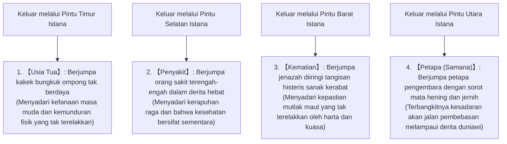

## Pendahuluan: Kelahiran Sang Sadar (Buddha) dan Revolusi Sejarah Pemikiran Manusia

Di tengah pergolakan pemikiran yang merebak di lembah tengah Sungai Gangga di India kuno antara abad ke-6 dan ke-5 SM (yang dikenal sebagai "Zaman Poros" atau *Axial Age*), "Buddhisme" yang dibabarkan oleh Gautama Siddhartha (Sanskerta: Gautama Siddhārtha; Pali: Gotama Siddhattha) merupakan revolusi intelektual dan eksistensial terbesar dalam sejarah spiritual umat manusia, yang secara fundamental merombak filsafat keagamaan India kuno sejak era Weda dan Upanishad.

Kata "Buddha" bukanlah nama dewa atau entitas ilahi tertentu, melainkan sebuah nomina komon dalam bahasa Sanskerta dan Pali yang bermakna "Ia yang Terjaga" atau "Ia yang Sadar akan Kebenaran Sejati" (Sang Sadar). Inti dari ajaran yang ditegakkan oleh Siddhartha secara tegas menolak keimanan buta kepada tuhan pencipta mutlak dari alam semesta, serta mengesampingkan pengorbanan hewan dan ritual-ritual magis yang dijalankan oleh kasta imamat (Brahmana). Sebaliknya, ajaran ini secara jernih dan objektif menatap langsung "penderitaan struktural yang melekat pada keberadaan manusia itu sendiri (*dukkha*)", membongkar sebab-musababnya secara kausal, dan membimbing manusia melalui observasi mandiri dan praksis menuju pembebasan mutlak (*moksha* / *nibbāna*)—sebuah "pengetahuan praksis rasional (*episteme*)".

Buddhisme melampaui batas-batas kerangka "agama" dalam pengertian modern. Ia adalah sains kognitif yang sangat presisi, sebuah psikoterapi, kritik bahasa, dan fenomenologi ontologis. Artikel ini bermaksud menguraikan secara menyeluruh riwayat hidup dan perubahan pemikiran Gautama Siddhartha, struktur logis dan matematis dari doktrin Empat Kebenaran Mulia, Delapan Jalan Utama, dan Dua Belas Sebab Musabab yang Saling Bergantungan, pembedahan ontologis atas Lima Agregat (*pañca-khandhā*) dan Tanpa-Diri (*anattā*), telaah filologis teks-teks kanon Pali, hingga resonansi mendalamnya dengan neurosains kognitif modern, fenomenologi, dan *mindfulness*, dengan ketepatan akademis dan kedalaman analisis yang komprehensif.

```
【Pergeseran Paradigma Buddhisme dalam Sejarah Pemikiran India Kuno】

┌─────────────────┬───────────────────────────────┬───────────────────────────────┐
│ Parameter       │ Brahmanisme Ortodoks /        │ Buddhisme Awal                │
│ Perbandingan    │ Upanishad Tradisional         │ (Gautama Buddha)              │
├─────────────────┼───────────────────────────────┼───────────────────────────────┤
│ Realitas Mutlak │ Brahman (Prinsip kosmis dasar │ Dhamma / Dharma (Hukum        │
│                 │ yang kekal dan tak terbagi)   │ universal sebab-akibat)       │
│ Konsepsi Diri   │ Atman (Diri/Jiwa sejati yang  │ Anatta (Tanpa-diri: penolakan │
│ (Jiwa)          │ abadi dan tak pernah binasa)  │ total atas entitas diri tetap)│
│ Jalan Pembebasan│ Kesatuan Atman-Brahman,       │ Empat Kebenaran Mulia, Jalan  │
│                 │ ritual kurban, tapa asketis   │ Utama, Jalan Tengah, Samatha- │
│                 │                               │ Vipassana                     │
│ Pandangan Dunia │ Mengafirmasi stratifikasi     │ Menolak diskriminasi kasta,   │
│ Sosial          │ kasta (Varna) secara kaku     │ menegaskan kesetaraan manusia │
│ Metode          │ Kepatuhan buta pada otoritas  │ Pembuktian mandiri (Paccattam │
│ Epistemologis   │ sakral kitab suci Weda        │ veditabbo vinnuhi / Ehipassiko│
└─────────────────┴───────────────────────────────┴───────────────────────────────┘
```

---

## 1. Riwayat Hidup Gautama Siddhartha dan Titik Balik Pemikirannya

### 1.1 Kelahiran sebagai Pangeran Suku Sakya dan Goncangan Empat Penglihatan
Gautama Siddhartha lahir di Lumbini (wilayah selatan Nepal saat ini) di kaki Pegunungan Himalaya, sebagai putra sulung dari Raja Suddhodana dan Ratu Maya, yang memerintah Kapilavastu, sebuah negara-kota kecil milik suku Sakya (Śākya).

Menurut legenda, sesaat setelah kelahirannya, Siddhartha melangkah tujuh langkah ke empat arah mata angin dan mendeklarasikan: "Di atas langit dan di bawah bumi, hanya Akulah yang termulia" (天上天下唯我独尊). Namun, dari sudut pandang sejarah dan filologi kritis, ia terlahir sebagai putra bangsawan ksatria (*khattiya* / *kshatriya*) dalam konfederasi suku terkemuka di India timur (*gana-sangha*), menikmati kehidupan yang bergelimang kemewahan dan kenikmatan tanpa kekurangan suatu apa pun. Ayahnya sangat cemas bahwa Siddhartha kelak akan meninggalkan keduniawian untuk menjadi seorang petapa pengembara, sehingga ia menyediakan tiga istana megah untuk tiga musim berbeda (musim panas, musim hujan, dan musim dingin), memenuhi istana dengan para penari dan biduanita jelita, serta berusaha keras menyingkirkan pemandangan realitas manusiawi yang suram—seperti usia tua, penyakit, dan kematian—dari pandangan putranya.

Akan tetapi, intelek dan kepekaan Siddhartha yang luar biasa tajam mampu menembus fatamorgana surga buatan tersebut. Hal ini disimbolkan secara mendalam dalam narasi legendaris tentang "Empat Penglihatan" (*Cattāri Nimittāni* / 四門出遊).



Empat Penglihatan bukan sekadar alegori dongeng, melainkan menyajikan model universal dari **"Krisis Eksistensial (*Existential Crisis*)"**. Betapapun kaya, berkuasa, dan sehatnya seseorang, tak ada yang sanggup lolos sedetik pun dari tiga keterbatasan absolut: "menjadi tua", "jatuh sakit", dan "mati". Saat menyaksikan usia tua, penyakit, dan kematian orang lain, Siddhartha menyadari secara mendalam: "Hal-hal tersebut bukanlah peristiwa milik orang asing di masa depan yang jauh, melainkan takdir tak terelakkan bagi diriku sendiri di sini dan saat ini." Keputusasaan yang mendalam dan kesadaran eksistensial inilah yang menjadi kekuatan pendorong baginya untuk melakukan "Pelepasan Agung" (*The Great Renunciation*) pada usia 29 tahun, meninggalkan kemegahan istana demi mencari kebenaran sejati.

### 1.2 Pelepasan Keduniawian, Berguru pada Pertapa, Praktik Tapa Ekstrem dan Kebuntuannya
Meninggalkan istrinya Yasodhara dan putranya yang baru lahir Rahula, serta seluruh hak waris atas tahta kerajaan, Siddhartha mencukur rambutnya, mengenakan jubah sederhana dari kain bekas, dan menjadi seorang "Samana" (*Śramaṇa* / petapa pencari kebenaran independen).

Ia mula-mula berguru pada dua guru meditasi terkemuka pada zamannya:
1. **Alara Kalama (Āḷāra Kālāma)**: Mengajarkan pencapaian alam meditasi "Keadaan Ketiadaan Apa-Apa" (*ākiñcaññāyatana-samāpatti* / 無所有処定). Siddhartha menguasai tataran ini dalam waktu singkat, namun menyadari bahwa begitu ia keluar dari meditasinya, penderitaan kenyataan hidup kembali menyergapnya. Ia menyimpulkan ini bukanlah pembebasan mutlak dan memutuskan untuk pergi.
2. **Uddaka Ramaputta (Uddaka Rāmaputta)**: Mengajarkan alam meditasi "Keadaan Bukan Persepsi pun Bukan Bukan-Persepsi" (*nevasaññānāsaññāyatana-samāpatti* / 非想非非想処定). Sama seperti sebelumnya, Siddhartha dengan cepat menyamai tingkatan sang guru, tetapi kembali menilai bahwa keadaan ini pun belum memadamkan akar penderitaan secara mendasar.

Menyadari keterbatasan meditasi konsentrasi mental murni tersebut, Siddhartha kemudian beralih ke jalan "tapa ekstrem (*tapas*)" untuk memusnahkan nafsu keinginan melalui penyiksaan raga. Di hutan Uruwela (Uruvelā), wilayah kerajaan Magadha, bersama lima rekan seperjuangannya (Kondanna dan empat petapa lainnya / Pañcavaggiya), ia menjalankan praktik mati raga yang luar biasa keras selama enam tahun: menahan napas hingga batas kemampuan ekstrem, berjemur di bawah terik matahari yang membakar, serta berpuasa hingga hanya mengonsumsi sebutir wijen atau sebutir beras per hari.

Akibatnya, tubuh Siddhartha menyusut hingga tinggal kulit pembalut tulang, tulang rusuknya menonjol seperti rangka atap lapuk, kulit kepalanya berkerut layaknya labu kering, dan tubuhnya limbung tak berdaya saat mencoba berdiri. Kendati berada di ambang maut, ketenangan batin sejati dan pencerahan yang dicarinya tak kunjung hadir. Pada titik nadir inilah, Siddhartha sampai pada wawasan yang menentukan dalam sejarah pemikiran manusia:

> **"Penyiksaan diri tidak lain hanyalah menghancurkan raga dan melemahkan pikiran, tanpa membuahkan kebijaksanaan sejati maupun pencerahan batin. Sebagaimana tenggelam dalam pemuasan hawa nafsu (hedonisme) adalah keliru, begitu pula menyiksa diri sendiri (asketisme ekstrem) adalah jalan yang sesat."**

Siddhartha memutuskan untuk sepenuhnya meninggalkan praktik penyiksaan diri. Ia membersihkan kotoran dan debu selama enam tahun di Sungai Nairanjana (Nerañjarā). Ketika ia jatuh pingsan di tepi sungai karena kehabisan tenaga, seorang gadis desa bernama Sujata (*Sujātā*) mempersembahkan semangkuk bubur susu segar (*pāyāsa*). Nutrisi tersebut meresap ke seluruh tubuhnya dan secara ajaib memulihkan kekuatannya. Melihat hal ini, kelima rekannya mencemooh: "Gotama telah gagal menahan kerasnya tapa dan jatuh ke dalam kemerosotan", lalu meninggalkannya sendirian.

```
【Penolakan Dua Ekstrem dan Penemuan Jalan Tengah (Majjhimā Paṭipadā)】

Tenggelam dalam Hawa Nafsu   ←─────［JALAN TENGAH］─────→   Penyiksaan Diri Ekstrem
(Kesenangan Indrawi Duniawi)      (Kebijaksanaan Sejati & Hening)   (Asketisme Menyakiti Raga)
(Kehidupan Istana Mewah)                                            (Hutan Rimba Uruwela)
※ Senar harpa (vīṇā): jika terlalu kencang akan putus, jika terlalu kendur tak berbunyi.
   Hanya tala yang pas dan tepat yang mampu melantunkan nada indah nan merdu.
```

### 1.3 Pencerahan di Bawah Pohon Bodhi: Pertarungan Melawan Mara dan Lahirnya Sang Buddha
Setelah memulihkan staminanya, Siddhartha duduk bersila di atas rumput kusa di bawah naungan pohon Assattha (kemudian dikenal sebagai Pohon Bodhi) di Bodh Gaya, dan mengucapkan ikrar teguh yang tak tergoyahkan:
**"Biarlah kulit, urat, dan tulangku mengering, biarlah daging dan darahku menguap habis, aku tak akan beranjak dari tempat duduk ini sebelum meraih Pencerahan Sejati yang tertinggi!"**

Menurut riwayat suci Buddha, segala hawa nafsu, ketakutan, keraguan, dan kemelekatan yang bergejolak di dalam batin Siddhartha dipersonifikasikan sebagai serbuan Raja Iblis Mara (*Māra* / Sang Penggoda).
Mara mula-mula mengirim ketiga putrinya yang rupawan (Tanha / Nafsu-Haus, Arati / Ketidakpuasan, Raga / Berahi) untuk menggoda Siddhartha. Melihat Siddhartha bergeming teguh, Mara mengerahkan angin badai, hujan lebat bergolak, bola api, dan bala tentara monster menakutkan untuk meremukkan jiwanya dengan teror. Terakhir, Mara berteriak menantang legitimasi Siddhartha: "Hak dan keutamaan apa yang kau miliki hingga berani menduduki takhta pencerahan ini?" Siddhartha dengan tenang mengulurkan tangan kanannya dan menyentuh bumi dengan ujung jari-jarinya (Gestur Menyentuh Bumi / *Bhūmisparśa-mudrā* / *Māravijaya*). Seketika itu bumi bergetar bergemuruh dahsyat dan bersaksi: "Aku bersaksi atas kebajikan tanpa-pamrih yang telah ia pupuk dalam tak terhitung kelahiran lampau." Bala tentara Mara pun tercerai-berai lenyap, dan segala kekotoran batin (*kilesa*) sirna tak berbekas.

Pada jaga pertama malam (pukul 18.00–22.00), Siddhartha memperoleh Pengetahuan Mengingat Kehidupan Lampau (*Pubbenivāsānussati-ñāṇa* / 宿命通), mampu mengingat kembali riwayat kehidupannya yang tak terhitung di masa lampau.
Pada jaga kedua malam (pukul 22.00–02.00), ia meraih Mata Batin Ilahi (*Dibbacakkhu-ñāṇa* / 天眼通), menembus hukum karma yang mengatur kematian dan kelahiran kembali semua makhluk di seluruh alam semesta sesuai perbuatannya.
Pada jaga ketiga malam (pukul 02.00–06.00), saat bintang fajar bersinar terang di ufuk timur, ia merenungkan secara mendalam proses kemunculan dan pemusnahan segala fenomena yang saling bergantungan—Dua Belas Sebab Musabab yang Saling Bergantungan (*Paṭicca-samuppāda* / 縁起の法)—baik dalam urutan maju (*anuloma*) maupun mundur (*paṭiloma*), dan meraih Pengetahuan atas Lenyapnya Noda Batin (*Āsavakkhaya-ñāṇa* / 漏尽通).

Dengan demikian, Siddhartha mencapai Pencerahan Sempurna yang Tiada Bandingnya (*Anuttara-sammā-sambodhi*) dan mentransformasikan dirinya melampaui kondisi manusia biasa menjadi **"Buddha (Sakyamuni Bhagava / Sang Junjungan Yang Mulia)"** pada usia 35 tahun.

### 1.4 Permohonan Brahma Sahampati dan Pemutaran Roda Dhamma Pertama: Dari Keheningan Menjadi Agama Dunia
Sesaat setelah mencapai Pencerahan, Sang Buddha terhanyut dalam perenungan mendalam dan ragu untuk membabarkan Dhamma yang telah disadarinya kepada dunia: "Dhamma ini teramat dalam, halus, sulit dilihat, melampaui logika penalaran belaka, dan hanya dapat dipahami oleh para bijaksana. Manusia di dunia ini diselubungi nafsu keinginan dan kemelekatan yang pekat. Jika aku mengajarkannya, itu hanya akan mendatangkan kelelahan dan kesia-siaan belaka." Sang Buddha sempat berniat untuk berdiam dalam keheningan dan langsung memasuki Nibbana tanpa mengajar.

Menurut tradisi, pada saat itulah dewa tertinggi dalam mitologi India, Brahma Sahampati (*Brahmā Sahampati*), turun dari alam brahma, berlutut, beranjali di hadapan Sang Buddha, dan memohon dengan sangat sebanyak tiga kali. Peristiwa ini dikenal sebagai **"Permohonan Brahma (Brahmā-yācana / 梵天勧請)"**:
"O, Yang Mulia Bhagava! Sudilah membabarkan Dhamma! Di dunia ini ada makhluk-makhluk yang memiliki sedikit debu di mata batin mereka. Tanpa mendengar Dhamma, mereka akan binasa; tetapi jika mereka mendengar Dhamma, mereka niscaya akan mencapai Pencerahan."

Sang Buddha menatap dunia dengan mata belas kasih (*karuṇā-cakkhu*). Bagaikan bunga teratai di telaga berlumpur: ada yang masih terbenam jauh di dalam lumpur, ada yang telah mencapai permukaan air, dan ada yang telah mekar anggun melampaui permukaan air tanpa ternoda oleh lumpur, Sang Buddha melihat bahwa kapasitas kebijaksanaan manusia berbeda-beda. Sang Buddha pun memutuskan untuk memecah keheningan:

> **"Pintu menuju Keabadian kini telah terbuka lebar! Wahai mereka yang bertelinga, bukalah keyakinanmu dan dengarkanlah!"**
> (*Apārutā tesaṃ amatassa dvārā, ye sotavanto pamuñcantu saddhaṃ*)

Sang Buddha berjalan kaki menempuh ratusan kilometer menuju Taman Rusa Isipatana di Sarnath, dekat Varanasi, untuk menemui lima mantan rekannya. Awalnya, melihat Sang Buddha mendekat dari kejauhan, kelima petapa bersepakat untuk mengabaikannya. Namun, menyaksikan pancaran wibawa dan keheningan agung yang memancar dari Sang Buddha, mereka tak kuasa menahan diri, segera bangkit menyambut, membasuh kakinya, dan menyiapkan tempat duduk yang layak.

Di hadapan mereka, Sang Buddha membabarkan khotbah pertamanya dalam sejarah manusia—**"Pemutaran Roda Dhamma Pertama (Dhammacakkappavattana Sutta / 初転法輪)"**. Ajaran yang dibabarkan adalah Jalan Tengah (*Majjhimā Paṭipadā*), Empat Kebenaran Mulia (*Cattāri Ariyasaccāni*), dan Delapan Jalan Utama (*Ariyo Aṭṭhaṅgiko Maggo*). Saat mendengarkan khotbah ini, petapa tertua, Kondanna, memperoleh "Mata Kebenaran" (*Dhamma-cakkhu*) dengan realisasi: "Segala sesuatu yang memiliki sifat muncul, pastilah memiliki sifat lenyap." Dengan peristiwa ini, Tiga Permata (*Tiratana* / 三宝)—yaitu Buddha (Guru Pembimbing), Dhamma (Ajaran Kebenaran), dan Sangha (Komunitas Persaudaraan Praksis)—secara resmi berdiri di muka bumi.

---

## 2. Inti Doktrin Buddhis: Struktur Logis Empat Kebenaran Mulia (Cattāri Ariyasaccāni)

Ajaran Buddha bukanlah dogma mistis atau keimanan doktriner, melainkan **"kedokteran klinis eksistensial"** yang menerapkan struktur metodologis pengobatan India kuno (Ayurveda)—yaitu diagnosis gejala penyakit, etiologi (penyebab penyakit), prognosis (kondisi kesembuhan), dan preskripsi (resep pengobatan)—secara sempurna ke dalam ranah batin manusia. Kerangka dasarnya adalah "Empat Kebenaran Mulia" (*Cattāri Ariyasaccāni* / 四聖諦).

```
【Keselarasan Struktural Model Medis Klinis dan Empat Kebenaran Mulia】

┌─────────────────┬───────────────────────────────┬───────────────────────────────┐
│ Model Diagnosis │ Empat Kebenaran Mulia Buddhis │ Konten dan Signifikansi       │
│ Medis Klinis    │ (Cattāri Ariyasaccāni)        │ Eksistensial                  │
├─────────────────┼───────────────────────────────┼───────────────────────────────┤
│ 1. Diagnosis    │ Kebenaran tentang Dukkha      │ Realitas fundamental eksistens│
│    Penyakit     │ (Dukkha-sacca / 苦諦)         │ manusia adalah penderitaan/   │
│                 │                               │ ketidakpuasan                 │
│ 2. Etiologi     │ Kebenaran tentang Asal Mula   │ Akar penyebab dukkha adalah   │
│    (Sebab Sakit)│ Dukkha (Samudaya-sacca / 集諦)│ nafsu-keinginan haus (Tanha)  │
│ 3. Prognosis    │ Kebenaran tentang Lenyapnya   │ Padamnya Tanha secara total = │
│    (Pemulihan)  │ Dukkha (Nirodha-sacca / 滅諦) │ Nibbana / Nirwana             │
│ 4. Terapi       │ Kebenaran tentang Jalan Menuju│ Metode praksis menuju Nibbana │
│    (Pengobatan) │ Lenyapnya Dukkha              │ = Delapan Jalan Utama (Magga) │
│                 │ (Magga-sacca / 道諦)          │                               │
└─────────────────┴───────────────────────────────┴───────────────────────────────┘
```

### 2.1 Kebenaran tentang Dukkha (Dukkha-sacca): "Ketidakpuasan" Struktural Eksistensi
Ketika Buddhisme menyatakan "Segala yang berkondisi adalah dukkha" (*Sabbe saṅkhārā dukkhā* / 一切皆苦), kata "penderitaan" (*dukkha*) di sini tidak hanya merujuk pada rasa sakit fisik atau kepedihan emosional belaka.
Secara etimologis dalam bahasa Pali, kata *dukkha* berakar dari lubang as roda (*kha*) yang bengkok atau cacat (*du*), sehingga roda kereta bergoyang, berderit kasar, dan tidak berputar dengan mulus sesuai kehendak pengendara. Dengan kata lain, esensi terdalam dari *dukkha* adalah **"ketidakmampuan untuk berjalan sesuai kehendak diri"**, **"ketidakpuasan mendasar (*unsatisfactoriness*)"**, dan **"disharmoni eksistensial"**.

Buddhisme awal mensistematisasikan penderitaan hidup ini secara terperinci ke dalam formula "Empat Penderitaan dan Delapan Penderitaan" (*Shi-ku Hak-ku* / 四苦八苦):

1. **Penderitaan Kelahiran (*Jāti-dukkha*)**: Penderitaan dari proses kelahiran dan kenyataan bahwa seseorang harus terus menjalani eksistensi biologis.
2. **Penderitaan Usia Tua (*Jarā-dukkha*)**: Kemunduran fisik, panca-indra, dan daya pikir yang tak terhindarkan.
3. **Penderitaan Penyakit (*Byādhi-dukkha*)**: Rasa sakit dan siksaan akibat rusaknya keseimbangan fisik oleh penyakit.
4. **Penderitaan Kematian (*Maraṇa-dukkha*)**: Teror kepunahan wujud jasmani dan perpisahan mutlak dengan kehidupan.
5. **Penderitaan Berpisah dengan yang Dicintai (*Piyavippayoga-dukkha*)**: Keharusan untuk berpisah dengan orang-orang terkasih dan benda-benda yang disayangi.
6. **Penderitaan Bertemu dengan yang Dibenci (*Appiyasaṃpayoga-dukkha*)**: Keniscayaan untuk berjumpa dan berinteraksi dengan orang atau situasi yang dibenci.
7. **Penderitaan Tidak Memperoleh Apa yang Diinginkan (*Yampicchaṃ na labhati tampi dukkhaṃ*)**: Kekecewaan batin ketika hasrat, ambisi, atau harapan tidak tercapai.
8. **Penderitaan Lima Agregat Kemelekatan (*Pañcupādānakkhandhā dukkhā*)**: Penderitaan holistik menyeluruh yang bersumber dari mencengkeram dan melekat pada lima agregat (*khandha*) yang membentuk diri ilusi.

### 2.2 Kebenaran tentang Asal Mula Dukkha (Samudaya-sacca): Mekanisme Munculnya Dukkha dan "Tanha"
Jika ada penderitaan, pastilah ada "sebab" yang menghasilkannya. Samudaya-sacca mengungkap bahwa akar paling mendasar dari penderitaan adalah **"Tanha (*Taṇhā* / 渇愛)"**—kehausan atau nafsu keinginan yang membabi-buta.
Secara harfiah, *taṇhā* melukiskan seseorang yang kehausan parah di tengah padang pasir gersang, meronta-ronta dengan panik mencari air, ingin mencengkeram, memiliki, dan enggan melepaskannya.

Sang Buddha mengklasifikasikan Tanha ke dalam tiga jenis:
- **Kama-tanha (*Kāma-taṇhā*)**: Kehausan indrawi terhadap kenikmatan objek-objek panca-indra (pemandangan indah, suara merdu, aroma wangi, kelezatan rasa, sentuhan nikmat).
- **Bhava-tanha (*Bhava-taṇhā*)**: Kehausan akan kelangsungan keberadaan (*craving for existence*); hasrat untuk terus mempertahankan diri, hidup abadi, memperluas status, kekuasaan, dan kekayaan (kemelekatan pada eksistensi).
- **Vibhava-tanha (*Vibhava-taṇhā*)**: Kehausan akan pemusnahan diri (*craving for non-existence*); dorongan destruktif untuk melenyapkan diri dari rasa sakit, menghancurkan segalanya, hasrat nihilistik untuk melarikan diri ke dalam kematian atau ketiadaan.

Bahaya terbesar dari Tanha terletak pada "struktur adiktifnya" yang tak pernah terpuaskan. Memuaskan nafsu-keinginan ibarat meminum air asin dari lautan untuk menghilangkan rasa haus: semakin banyak diminum, rasa haus bukannya reda, malah semakin membakar, memerangkap manusia dalam siklus penderitaan lingkaran samsara yang tanpa akhir.

### 2.3 Kebenaran tentang Lenyapnya Dukkha (Nirodha-sacca): Padamnya Penderitaan Secara Total dan "Nibbana"
Sebagaimana penyakit sembuh total jika patogen penyebabnya dihilangkan, ada suatu kondisi di mana nafsu kehausan penyebab penderitaan padam seutuhnya. Itulah Nirodha-sacca, tujuan tertinggi dalam Buddhisme: **"Nibbana (*Nibbāna* / Sanskerta: Nirvāṇa / 涅槃)"**.

Secara etimologis, *Nibbāna* bermakna "memadamkan tiupan" (*Nir* + *vā* = padamnya tiupan api). Maknanya adalah padamnya "Tiga Api Racun Batin" (*Akusala-mūla*): keserakahan (*lobha* / nafsu serakah), kemarahan/kebencian (*dosa*), dan kebodohan batin/delusi (*moha*). Ketika api-api ini padam sempurna, terbitlah kondisi batin yang sejuk, damai, dan hening tanpa gejolak. Nibbana bukanlah surga atau tempat geografis pasca-kematian, melainkan **"kondisi kebebasan mutlak dari belenggu kekotoran batin yang dicapai di sini dan saat ini dalam kehidupan ini juga"**.

### 2.4 Kebenaran tentang Jalan Menuju Lenyapnya Dukkha (Magga-sacca): Resep Praksis "Delapan Jalan Utama"
Jalan nyata, praktis, dan dapat ditempuh untuk memadamkan dukkha dan merealisasikan Nibbana adalah Magga-sacca, yaitu "Delapan Jalan Utama yang Mulia" (*Ariyo aṭṭhaṅgiko maggo* / 八正道). Delapan unsur ini secara tradisional dikelompokkan ke dalam "Tiga Pelatihan Luhur" (*Tisso sikkhā* / 三学): Sila (Moralitas/Etika), Samadhi (Konsentrasi/Meditasi), dan Panna (Kebijaksanaan/Paññā).

```
【Struktur Delapan Jalan Utama dan Hubungannya dengan Tiga Pelatihan Luhur (Sila, Samadhi, Panna)】

┌───────────────┬───────────────────────────────┬───────────────────────────────┐
│ Tiga Pelatihan│ Unsur Delapan Jalan Utama     │ Definisi Praksis dan Fungsi   │
│ Luhur (Sikkhā)│ (Ariyo Aṭṭhaṅgiko Maggo)      │ Transformasional              │
├───────────────┼───────────────────────────────┼───────────────────────────────┤
│ Kebijaksanaan │ 1. Pandangan Benar            │ Memahami secara benar Empat   │
│ (Paññā)       │    (Sammā-diṭṭhi)             │ Kebenaran, Paticca-samuppada, │
│               │                               │ dan hukum kamma               │
│               │ 2. Pikiran / Niat Benar       │ Membina niat bebas keserakahan│
│               │    (Sammā-saṅkappa)           │ bebas dendam, penuh welas asih│
├───────────────┼───────────────────────────────┼───────────────────────────────┤
│ Moralitas /   │ 3. Ucapan Benar               │ Menghindari dusta, fitnah,    │
│ Etika (Sīla)  │    (Sammā-vācā)               │ kata-kata kasar, obrolan kosong│
│               │ 4. Perbuatan Benar            │ Menghindari pembunuhan,       │
│               │    (Sammā-kammanta)           │ pencurian, asusila            │
│               │ 5. Penghidupan Benar          │ Menolak mata pencaharian jahat│
│               │    (Sammā-ājīva)              │ (senjata, racun, budak, daging│
├───────────────┼───────────────────────────────┼───────────────────────────────┤
│ Konsentrasi / │ 6. Daya Upaya Benar           │ Berupaya mencegah & memutus   │
│ Meditasi      │    (Sammā-vāyāma)             │ kejahatan, menumbuhkan kebajikan
│ (Samādhi)     │ 7. Perhatian Penuh Benar      │ Mengamati fenomena jasmani-   │
│               │    (Sammā-sati)               │ rohani di sini-kini objektif  │
│               │ 8. Konsentrasi Benar          │ Menyatukan batin dalam satu   │
│               │    (Sammā-samādhi)            │ objek hening (Jhana)          │
└───────────────┴───────────────────────────────┴───────────────────────────────┘
```

Delapan Jalan Utama bukanlah tahapan linear yang diselesaikan satu per satu secara berurutan, melainkan sebuah sistem holistik yang saling menopang laksana delapan jari-jari roda kereta. Pandangan Benar memandu etika perbuatan (Ucapan, Perbuatan, Penghidupan Benar), etika yang bersih menenangkan batin untuk memupuk konsentrasi (Upaya, Perhatian Penuh, Konsentrasi Benar), dan kejernihan meditasi mempertajam Pandangan Benar hingga menghasilkan kebijaksanaan penembusan yang merealisasikan pembebasan akhir.

---

## 3. Kedalaman Ontologis: Dua Belas Sebab Musabab yang Saling Bergantungan (Paṭicca-samuppāda) dan Lima Agregat

### 3.1 Doktrin Kemunculan yang Saling Bergantungan (Paṭicca-samuppāda): Penemuan Tertinggi Sang Buddha
Proposisi fundamental yang paling memiliki kedalaman filosofis dan membedakan ajaran Buddha dari seluruh sistem pemikiran lain di dunia adalah **"Paṭicca-samuppāda"** (Bahasa Sanskerta: *Pratītyasamutpāda* / 縁起).
Secara harfiah, istilah ini bermakna "Kemunculan yang Bergantung pada Kondisi-Kondisi" (*Dependent Origination* / Relasionalitas Saling Bergantung).

Sang Buddha merumuskan hukum ini dalam kanon Pali sebagai proposisi yang amat ringkas, elegan, dan matematis:

> **"Dengan adanya ini, maka adalah itu.**
> **Dengan timbulnya ini, maka timbullah itu.**
> **Dengan tidak adanya ini, maka tidak adalah itu.**
> **Dengan lenyapnya ini, maka lenyaplah itu."**
> (*Imasmiṃ sati idaṃ hoti, imassuppādā idaṃ uppajjati.*
> *Imasmiṃ asati idaṃ na hoti, imassa nirodhā idaṃ nirujjhati.* — *Saṃyutta Nikāya*)

Segala fenomena di alam semesta—materi, batin, kehidupan hayati, maupun tatanan sosial—bukanlah "entitas mutlak" yang mandiri dan berdiri sendiri. Segalanya eksis hanya sebagai penampakan sementara di dalam jejaring relasi sebab (*hetu*) dan kondisi pendukung (*paccaya*) yang saling terjalin rumit (Jejaring Indra). Tidak ada tuhan pencipta adikodrati yang mutlak, tidak ada zat yang tak berawal, tidak ada sebab pertama (*prime mover*) yang kekal. Jika kondisi terpenuhi, fenomena muncul; jika kondisi terurai, fenomena lenyap—inilah hukum alam universal (*Dhamma*) yang meresapi seluruh kosmos.

### 3.2 Struktur Rantai Dua Belas Sebab Musabab (Dvādasa-nidāna)
Pada malam Pencerahannya, Sang Buddha menelusuri rantai kausalitas mengapa manusia terjerat dalam lingkaran derita penuaan, kematian, dan samsara berulang melalui dua belas mata rantai (*dvādasa-nidāna* / 十二因縁).

```mermaid
graph LR
    A["1. Ketidaktahuan<br/>(Avijjā)"] --> B["2. Bentukan Kehendak<br/>(Saṅkhāra)"]
    B --> C["3. Kesadaran<br/>(Viññāṇa)"]
    C --> D["4. Batin dan Jasmani<br/>(Nāmarūpa)"]
    D --> E["5. Enam Landasan Indra<br/>(Saḷāyatana)"]
    E --> F["6. Kontak Sensorik<br/>(Phassa)"]
    F --> G["7. Perasaan Sensasi<br/>(Vedanā)"]
    G --> H["8. Nafsu Kehausan<br/>(Taṇhā)"]
    H --> I["9. Kemelekatan<br/>(Upādāna)"]
    I --> J["10. Proses Menjadi<br/>(Bhava)"]
    J --> K["11. Kelahiran Kembali<br/>(Jāti)"]
    K --> L["12. Penuaan dan Kematian<br/>(Jarāmaraṇa)"]
```



```
【Mata Rantai Dua Belas Sebab Musabab dan Dinamika Psikologis Eksistensi Manusia】

1. Avijjā (Ketidaktahuan/Kebodohan Batin): Ketidaktahuan mendasar; ketidakmampuan melihat Empat Kebenaran Mulia, hukum sebab-musabab, dan hakikat tanpa-diri.
2. Saṅkhāra (Bentukan Kehendak/Kamma): Aktivitas kehendak berakar dari ketidaktahuan; daya pembentuk karma potensial yang memprogram arus eksistensi.
3. Viññāṇa (Kesadaran): Daya pembeda kognitif yang mengenali objek; arus kesadaran penghubung kelahiran kembali (paṭisandhi-viññāṇa).
4. Nāmarūpa (Batin dan Jasmani): Perpaduan fungsi psikologis (Nama: perasaan, persepsi, kehendak) dan raga biologis material (Rupa) = pembentukan janin.
5. Saḷāyatana (Enam Landasan Indra): Enam pintu indrawi (mata, telinga, hidung, lidah, tubuh jasmani, dan pikiran/mano).
6. Phassa (Kontak): Bertemunya tiga faktor: organ indrawi, objek eksternal, dan kesadaran indrawi terkait.
7. Vedanā (Perasaan/Sensasi): Respon afektif langsung yang muncul dari kontak indrawi (menyenangkan, menyakitkan, atau netral).
8. Taṇhā (Nafsu Kehausan): Dorongan reaktif yang membara untuk mengejar kenikmatan dan menolak rasa tidak menyenangkan.
9. Upādāna (Kemelekatan/Pencengkeraman): Menggenggam erat objek-objek hasrat dan mengklaimnya sebagai "milikku" atau "diriku".
10. Bhava (Proses Menjadi/Eksistensi): Kekuatan kamma yang mengkristal akibat kemelekatan, membentuk kecenderungan penjelmaan eksistensi baru.
11. Jāti (Kelahiran Kembali): Munculnya kembali kehidupan individu baru ke dalam suatu alam keberadaan.
12. Jarāmaraṇa (Penuaan dan Kematian): Kemunduran jasmani, dukacita, ratap tangis, penderitaan fisik-mental, dan kematian tak terelakkan yang menyertai setiap kelahiran.
```

Hal yang amat mencengangkan dari rantai dua belas nidana ini adalah penemuan bahwa akar primordial dari tragedi penuaan dan kematian terletak pada **"Avijja (Ketidaktahuan Batin)"**.
Rantai kausalitas ini memiliki mekanisme yang dapat "dibalikkan" (*paṭiloma* / 還滅門).
Ketika ketidaktahuan dipadamkan oleh terang kebijaksanaan, maka bentukan kehendak lenyap. Jika bentukan kehendak lenyap, kesadaran karma lenyap... hingga akhirnya, kemelekatan lenyap, kelahiran lenyap, dan timbunan raksasa penderitaan berupa penuaan, ratap tangis, dan kematian pun runtuh musnah seutuhnya. Dalam Buddhisme, pembebasan dari penderitaan bukanlah keajaiban mistis atau anugerah rahmat dari luar, melainkan sebuah kepastian logis yang dicapai melalui revolusi persepsi (kebijaksanaan).

### 3.3 Lima Agregat (Pañca-khandhā): Dekonstruksi Eksistensi Manusia
Siapakah sebenarnya "diri saya"?
Sang Buddha menolak keras pandangan bahwa manusia adalah entitas tunggal yang permanen (jiwa/roh kekal), dan mendekonstruksi wujud manusia menjadi kumpulan dari lima kelompok unsur penyusun yang berproses secara dinamis—**"Lima Agregat (*Pañca-khandhā* / 五蘊)"**:

1. **Rupa-khandha (*Rūpa* / 色蘊)**: Jasmani material, organ-organ indrawi fisik, serta objek-objek fisik materi di dunia luar.
2. **Vedana-khandha (*Vedanā* / 受蘊)**: Kualitas perasaan/sensasi yang timbul saat indra berinteraksi dengan objek (menyenangkan, tidak menyenangkan, atau netral).
3. **Sanna-khandha (*Saññā* / 想蘊)**: Persepsi dan daya konseptualisasi yang mengenali karakteristik objek, memberi label/nama, dan mencocokkannya dengan ingatan masa lalu.
4. **Sankhara-khandha (*Saṅkhāra* / 行蘊)**: Bentukan-bentukan mental aktif seperti emosi, kehendak (*cetanā*), dorongan nafsu, niat, dan kecenderungan batin yang mengarahkan pikiran ke arah tertentu.
5. **Vinnana-khandha (*Viññāṇa* / 識蘊)**: Kesadaran murni yang mengintegrasikan seluruh proses dan mengenali objek secara sadar (*cognitive awareness*).

Sang Buddha mengajukan serangkaian pertanyaan mendalam kepada murid-muridnya:
"Apakah kelima agregat ini kekal atau tidak kekal?" — "Tidak kekal (*anicca*), Bhante."
"Jika sesuatu tidak kekal, apakah itu penderitaan atau kebahagiaan?" — "Penderitaan (*dukkha*), Bhante."
"Jika sesuatu tidak kekal, penderitaan, dan tunduk pada perubahan lenyap, apakah patut menganggapnya: 'Ini milikku, ini adalah aku, ini adalah diri/jiwaku (*atman*)'?" — "Tentu saja tidak, Bhante."

Manusia tidak lebih dari sebuah "proses aliran dinamis" di mana kelima agregat ini terus-menerus berinteraksi dan berubah dengan kecepatan luar biasa. Sebagaimana kata "kereta" hanyalah sebutan konvensional saat roda, poros roda, lantai, dan rangka dirakit menjadi satu, demikian pula sebutan "manusia" atau "diri" hanyalah nama konvensional (*vohāra*) yang disematkan pada gabungan dinamis dari kelima agregat ini.

---

## 4. Filosofi Tanpa-Diri (Anattā): Pembongkaran Diri Substantial dan Kebebasan Eksistensial

### 4.1 Anatta (Tanpa-Diri) vs. Atman (Diri Sejati) dalam Tradisi Upanishad
Mahakarya teragung sekaligus konsep yang paling kerap disalahpahami dalam pemikiran Buddhis awal adalah ajaran **"Anattā"** (Bahasa Sanskerta: *Anātman* / 無我).

Arus pemikiran dominan di India saat itu (filsafat Upanishad) menegaskan bahwa kendati raga fisik dan emosi senantiasa berubah-ubah, di kedalaman terdalam batin bersemayam "diri sejati" yang abadi, tidak dapat hancur, dan kekal abadi yang disebut *Ātman* (Diri/Roh Sejati). Upanishad mengajarkan bahwa puncak pembebasan adalah menyadari persatuan esensial antara Atman individu dan prinsip fundamental kosmis (*Brahman*) dalam kesadaran *Tat Tvam Asi* (Engkau adalah Itu).

Menghadapi doktrin ini, Sang Buddha memproklamasikan kebenaran revolusioner: "Segala fenomena adalah tanpa-diri" (*Sabbe dhammā anattā* / 諸法無我), menolak eksistensi Atman secara total.
Argumen logis Sang Buddha sangat jernih dan tak terbantahkan:
Jika sesuatu benar-benar adalah "Diri Sejati Saya" (milik mutlak saya), maka sesuatu itu semestinya dapat saya kendalikan sepenuhnya sesuai kehendak saya. Dapatkah kita memerintahkan tubuh jasmani kita: "Wahai tubuhku, jangan pernah sakit, jangan pernah bertambah tua!" dan tubuh itu serta-merta mematuhinya? Dapatkah kita mengendalikan setiap emosi dan pikiran kita tanpa meleset sedetik pun? Tentu tidak bisa. Mengapa? Karena semua itu hanyalah fenomena-fenomena yang timbul dan tenggelam mengikuti hukum sebab-musabab yang saling bergantungan (*paccaya*). Kita tidak dapat menyebut sesuatu yang berada di luar kendali mutlak kita sebagai "diri kita". Oleh karena itu, di mana pun di dalam kelima agregat tersebut, tidak ditemukan substansi tetap yang dapat disebut sebagai "Diri" (*Atman*).

```
【Pertentangan Epistemologis antara Teori Substansi Atman dan Teori Anatta Buddhis】

■ Teori Substansi Upanishad (Ātman)
Di balik raga, emosi, dan pikiran yang fana, bersemayam
"Diri/Jiwa Pengamat Sejati" yang kekal, murni, dan tak hancur.
※ Menghendaki "keselamatan jiwa", namun justru terjerumus ke dalam perangkap
   yang memperkuat "kemelekatan pada diri (ego)".

■ Teori Fenomenologis & Proses Buddhisme Awal (Anattā)
Raga, emosi, dan pikiran hanyalah arus proses kausalitas yang mengalir terus-menerus.
Tidak ada entitas "Pengamat" tetap di baliknya. Hanya ada "peristiwa melihat",
tetapi tidak ada "Sang Melihat" yang berwujud mandiri.
※ Dengan membongkar ilusi konsep kaku tentang "Aku",
   seluruh akar kemelekatan dan penderitaan tercerabut hingga tuntas.
```

### 4.2 Tiga Corak Keberadaan (Tilakkhana) dan Empat Corak Keberadaan
Sebagai panji atau lambang pembeda ajaran Buddha dari ajaran lainnya, ditegakkanlah apa yang disebut sebagai "Cap Dhamma" (*Dhamma-mudda* / 法印)—kebenaran universal yang menjadi meterai hakikat realitas:

1. **Ketidakkekalan Segala Fenomena yang Berkondisi (*Sabbe saṅkhārā aniccā* / 諸行無常)**:
   Segala sesuatu yang terwujud dari perpaduan sebab-musabab (*saṅkhāra*) senantiasa bergerak, berubah, dan mengalir tanpa henti. Tidak ada satu pun kondisi statis atau permanen di seluruh penjuru semesta.
2. **Tanpa-Diri dalam Segala Fenomena (*Sabbe dhammā anattā* / 諸法無我)**:
   Bukan hanya hal-hal yang berkondisi (*saṅkhata-dhamma*), melainkan seluruh realitas (termasuk yang tak berkondisi / *asaṅkhata-dhamma* seperti Nibbana) tidak memiliki substansi inti diri yang kekal dan terpisah.
3. **Ketenangan Abadi Nibbana (*Nibbānaṃ santaṃ* / 涅槃寂静)**:
   Kondisi batin di mana ketidakkekalan dan tanpa-diri telah disadari seutuhnya, serta kobaran api nafsu kemelekatan telah padam sempurna, adalah kedamaian dan keheningan mutlak.
4. **Segala yang Berkondisi adalah Dukkha (*Sabbe saṅkhārā dukkhā* / 一切皆苦)**:
   Ketika seseorang berilusi bahwa hal-hal yang tidak kekal adalah abadi, dan mencengkeram hal-hal yang tanpa-diri sebagai "diri saya", maka seluruh interaksinya dengan fenomena berubah menjadi penderitaan (*dukkha*). (Menambahkan unsur ini ke dalam Tiga Corak Keberadaan menghasilkan "Empat Cap Dhamma").

Doktrin Tanpa-Diri (*Anattā*) sama sekali bukan bentuk paham "Nihilisme" (*Ucchedavāda*). Sang Buddha dengan tegas menolak pandangan kaum anihilasionis yang menyatakan bahwa "setelah manusia mati, segalanya lenyap menjadi ketiadaan belaka" (*uccheda-diṭṭhi*), sebagaimana beliau juga menolak pandangan kaum eternalist yang menyatakan bahwa "jiwa manusia kekal abadi selamanya" (*sassata-diṭṭhi*). Anatta bukanlah kehampaan yang putus asa, melainkan pembebasan batin: "melihat kenyataan hidup apa adanya di sini dan saat ini tanpa terpenjara oleh ilusi substansi kaku, sehingga terbebas seutuhnya dari segala jerat kemelekatan ego."

---

## 5. Pembacaan Filologis Teks Buddhis Awal dan Pembentukan Sangha

### 5.1 Sejarah Pembentukan Kanon Pali dan Konsili Buddhis (Saṅgīti)
Sang Buddha tidak meninggalkan satu huruf pun catatan tertulis semasa hidupnya. Di India kuno, ajaran sakral diwariskan secara turun-temurun bukan melalui tulisan, melainkan lewat transmisi hafalan lisan (*oral recitation*) yang sangat ketat dari guru ke murid.

Sesaat setelah Sang Buddha mangkat pada usia 80 tahun di Kusinara (*Mahāparinibbāna* / 入滅), di Rajagaha (Rajgir), ibu kota Magadha, di bawah kepemimpinan Y.A. Mahakassapa, berkumpullah 500 orang Arahat. Peristiwa agung ini dikenal sebagai **"Konsili Pertama (*Paṭhama-saṅgīti* / 第一結集)"**—secara harfiah bermakna "melantunkan bersama-sama".

```
【Pembentukan Dua Tradisi Utama dalam Konsili Pertama】

1. Penghimpunan Keranjang Khotbah (Sutta Piṭaka)
   ・Pelantun / Penghafal: Y.A. Ananda (Sepupu Sang Buddha, pelayan setia selama 25 tahun,
     dianugerahi gelar "Terunggul dalam Banyak Mendengar / Bahussuta")
   ・Klausul Pembuka Standar: "Demikianlah yang telah kudengar" (Evaṃ me sutaṃ / 如是我聞)
   ・Isi: Kumpulan dialog dan khotbah kontekstual Sang Buddha kepada beragam lapisan masyarakat.

2. Penghimpunan Keranjang Disiplin (Vinaya Piṭaka)
   ・Pelantun / Penghafal: Y.A. Upali (Berasal dari kasta tukang cukur rendah,
     dianugerahi gelar "Terunggul dalam Pengetahuan Disiplin Moral / Vinayadhara")
   ・Isi: Aturan perilaku bagi para bhikkhu dan bhikkhuni, regulasi tata kelola komunitas monastik,
     dan sanksi pelanggaran.
```

Beberapa abad kemudian, menyusul perpecahan internal komunitas (*bhedasadhammavāda*) serta menghadapi ancaman invasi Tamil dan bahaya kelaparan di Sri Lanka pada abad ke-1 SM yang dapat memusnahkan garis keturunan para bhikkhu penghafal, teks-teks lisan tersebut untuk pertama kalinya dipahatkan ke atas daun lontar (*ola leaf*) dalam bahasa Pali di Aluvihara. Inilah yang kita kenal sekarang sebagai **"Tipitaka Pali (Tiga Keranjang: Sutta, Vinaya, dan Abhidhamma)"**.

### 5.2 Lapisan Teks Tertua: Pemikiran dalam Sutta Nipata dan Dhammapada
Penelitian filologi Buddhis modern (yang dipelopori oleh Hajime Nakamura, Edwin Arnold, T.W. Rhys Davids, K.R. Norman, dll.) telah berhasil mengidentifikasi strata teks paling kuno (lapisan arkaik) dalam kanon Pali. Teks representatif yang mencerminkan masa paling awal ini adalah Bab 4 ("Aṭṭhakavagga") dan Bab 5 ("Pārāyanavagga") dari *Sutta Nipāta*, serta bait-bait dalam *Dhammapada*.

Sosok Sang Buddha yang tampil dalam teks-teks paling purba ini bukanlah dewa adikodrati yang dipuja dalam bentuk arca megah berlapis emas atau dikelilingi oleh para Bodhisattva langit nan mistis, melainkan seorang filsuf realis yang bersahaja, mengenakan jubah tambalan sederhana, membawa mangkuk derma di tangan, dan mengembara sendirian di belantara dunia.

> **"Mengembaralah seorang diri bagaikan cula badak."**
> (*Khaggavisāṇakappo eko care* — *Sutta Nipāta*, Uragavagga, Khaggavisāṇa Sutta)
> Bergaul akrab menimbulkan kelekatan dan kemelekatan, dan dari kelekatan timbullah penderitaan. Jauhilah perdebatan kusir yang sia-sia dan kepalsuan duniawi; disiplinkan dirimu dengan kesucian, dan mengembaralah seorang diri bagaikan cula badak.

> **"Kebencian tak akan pernah padam jika dibalas dengan kebencian.**
> **Hanya dengan ketiadaan benci, kebencian akan padam.**
> **Inilah hukum abadi yang berlaku sepanjang masa."**
> (*Na hi verena verāni, sammantīdha kudācanaṃ.*
> *Averena ca sammanti, esa dhammo sanantano.* — *Dhammapada*, Syair 5)

Dalam teks strata terawal, Sang Buddha menolak keras spekulasi metafisika teoretis yang tak berguna (seperti: "Apakah alam semesta berhingga atau tak berhingga?", "Apakah jiwa dan raga adalah satu hal yang sama atau terpisah?", "Apakah Sang Tathagata ada atau tiada setelah kematian?") sebagai "perdebatan kosong yang menjerat batin" (*avyākata / papañca*).
Sebagaimana digambarkan dalam perumpamaan terkenal tentang "Orang yang Terkena Panah Beracun" (*Cūḷamālukya Sutta*): kewajiban mendesak seseorang yang tertembus anak panah beracun bukanlah mendebatkan siapa kasta pemanah tersebut, dari kayu apa busurnya dibuat, atau jenis bulu apa yang menempel pada panah, melainkan segera mencabut panah beracun tersebut dan mengobati lukanya agar nyawanya terselamatkan. Fokus Sang Buddha dari awal hingga akhir tertuju sepenuhnya pada praksis nyata: "Bagaimana membebaskan manusia konkret dari cengkeraman penderitaan nyata."

---

### 5.3 Rekayasa Tata Kelola Sangha Awal: Patimokkha dan Demokrasi Otonom Konsensus

Komunitas monastik para praktisi yang didirikan oleh Sang Buddha—yang disebut "Sangha" (*Saṅgha*)—bukan sekadar himpunan pengikut keagamaan pasif, melainkan salah satu **"komunitas otonom koperasi dengan demokrasi langsung terlengkap"** yang paling awal tercatat dalam sejarah peradaban manusia.

Di tengah tatanan masyarakat India kuno yang dicengkeram oleh hierarki kasta kaku dan kebangkitan monarki otokratis yang kejam (seperti di Magadha dan Kosala), Sangha asuhan Sang Buddha menampilkan oasis kesetaraan yang luar biasa radikal. Begitu melangkahkan kaki memasuki Sangha, kaum bangsawan (*kshatriya*), kaum pendeta kasta tertinggi (*brahmana*), kaum saudagar (*vaishya*), hingga kaum buruh strata terendah (*shudra*) dan kaum terbuang yang tak tersentuh (*candala*), seketika ditanggalkan seluruh privilese sosial serta sekat diskriminasinya. Di dalam Sangha, rasa hormat semata-mata ditentukan oleh "senioritas penahbisan (*vassa*)", mewujudkan persaudaraan egalitarian sejati. Kisah mengharukan di mana Upali, seorang mantan pemangkas rambut dari kasta rendah, ditahbiskan lebih dahulu dibanding para pangeran ningrat Sakya (seperti Ananda dan Anuruddha), sehingga para pangeran tersebut harus bersujud memberi hormat di hadapan kaki Upali, menjadi bukti nyata atas revolusi kesetaraan yang diusung oleh Sangha.

```
【Sistem Tata Kelola Otonom dan Prinsip Hukum Musyawarah Sangha Awal】

1. Kamma (Kammavācā): Musyawarah Mufakat Konsensus Penuh dalam Keputusan Tertinggi
   ・Segala urusan vital sangha (penahbisan anggota baru, pengadilan disipliner, pembagian jubah/properti)
     wajib diputuskan melalui konsensus mutlak dalam sidang paripurna majelis.
   ・Setelah mosi diajukan, pemimpin sidang bertanya tiga kali: "Apakah ada yang berkeberatan?"
     Keheningan bulat dari seluruh hadirin menandakan pengesahan mosi (Ñatticatuttha-kamma).
     Jika satu orang saja mengajukan sanggahan yang sah, mosi dinyatakan gugur.

2. Uposatha: Pembersihan Diri Berkala dan Penegakan Moralitas Dwi-Mingguan
   ・Setiap malam bulan baru dan bulan purnama (dua kali sebulan), seluruh anggota berkumpul bersama
     untuk menyimak pelafalan 227 aturan disiplin monastik (Pātimokkha).
   ・Setiap individu secara terbuka mengakui pelanggaran yang telah diperbuatnya (āpattidesanā)
     demi memulihkan kemurnian batin. Sikap menyembunyikan kesalahan dilarang keras.

3. Pavāraṇā: Evaluasi Kritis Terbuka Pasca-Masa Retret Musim Hujan (Vassa)
   ・Pada hari penutupan masa retret tiga bulan (Vassa), setiap petapa tanpa terkecuali mengundang
     rekan-rekannya: "Bila kalian melihat, mendengar, atau menduga kekeliruan dalam diriku,
     tegurlah aku dengan belas kasih, niscaya aku akan memperbaikinya."
```

Aspek sosiologis dan historis lain yang sangat monumental adalah perkenan Sang Buddha—atas permohonan gigih dari ibu angkatnya, Mahapajapati Gotami—untuk mendirikan **"Bhikkhuni Sangha (Komunitas Monastik Wanita)"**, sebuah terobosan peradaban yang tiada duanya di dunia kuno pada masa itu. Pada era ketika perempuan diposisikan sebagai subordinat tak berdaya milik ayah, suami, atau anak laki-lakinya, Sang Buddha secara resmi mengakui potensi wanita untuk meraih Pencerahan tertinggi (Arahat) setara dengan kaum pria, serta memberikan otonomi bagi komunitas monastik wanita. Ini merupakan lompatan emansipasi yang tak tertandingi dalam sejarah keagamaan dan kesetaraan gender dunia.

## 6. Transformasi Struktural dari Buddhisme Awal ke Abhidharma dan Mahayana

### 6.1 Buddhisme Abhidharma: Analisis Mikroskopis atas Realitas
Beberapa abad setelah parinibbana Sang Buddha, Sangha terpecah menjadi kelompok konservatif Theravada (para tetua) dan kelompok progresif Mahasanghika (majelis agung)—sebuah peristiwa yang disebut Perpecahan Mendasar (*Mūlabheda*)—yang kelak berkembang menjadi dua puluh sekte (periode Buddhisme Nikaya / Sektarian).

Pada era ini, para sarjana monastik menyusun risalah-risalah komentar dan sistem metafisika yang teramat masif untuk mensistematisasikan ajaran Sang Buddha secara ketat. Inilah tradisi "Abhidharma" (Abhidhamma / kajian analitis atas hakikat fenomena). Aliran Sarvastivada (*Sarvāstivāda*), misalnya, mengklasifikasikan unsur-unsur dasar pembentuk realitas (*dhamma* / atom terkecil keberadaan) ke dalam model kognitif-ontologis "Lima Kategori dan Tujuh Puluh Lima Unsur" (*Pañca-vastu-pañcasattati-dharmāḥ* / 五位七十五法) yang luar biasa rumit dan analitis.

Namun demikian, kecenderungan Abhidharma berkembang menjadi kajian skolastik yang sangat elitis dan terisolasi. Komunitas monastik mengurung diri di biara-biara megah untuk memperdebatkan silang-sengketa filsafat teknis yang terputus dari jerit derita masyarakat awam, sehingga menciptakan "menara gading" akademis yang beku. Hal ini memicu gelombang kritik pedas dan pemberontakan spiritual dari kaum awam dan para biarawan reformis.

### 6.2 Revolusi Buddhisme Mahayana: Kesatuan Altruisme dan Doktrin Sunyata (Kekosongan)
Menjelang permulaan tarikh Masehi, meletuslah sebuah gerakan pembaharuan spiritual yang masif dari kalangan umat awam dan para bhikkhu visioner. Mereka menolak apa yang mereka sebut sebagai jalan sempit yang hanya mengejar kebebasan individu diri sendiri (secara peyoratif disebut *Hīnayāna* / Kendaraan Kecil), dan mengibarkan panji kendaraan agung yang sanggup mengangkut seluruh makhluk menuju pembebasan universal—**"Mahāyāna (Kendaraan Besar)"**.

```
【Perbandingan Paradigma antara Buddhisme Sektarian (Akar Awal) dan Buddhisme Mahayana】

┌─────────────────┬───────────────────────────────┬───────────────────────────────┐
│ Parameter       │ Buddhisme Sektarian / Awal    │ Buddhisme Mahayana            │
│ Perbandingan    │ (Pengembangan Abhidharma)     │ (Gerakan Pembaruan Spiritual) │
├─────────────────┼───────────────────────────────┼───────────────────────────────┤
│ Sosok Ideal     │ Arahat (Pembebasan batin      │ Bodhisattva (Berikrar menunda │
│ Manusiawi       │ diri sendiri dari samsara)    │ nirwana demi menolong makhluk)│
│ Karakter        │ Penyelamatan Mandiri          │ Kesatuan Sempurna Kebaikan    │
│ Praksis         │ (Monastik disiplin pertapaan) │ Mandiri & Kebaikan Sesama     │
│ Fokus           │ Analisis Dharma (Realitas     │ Sunyata (Śūnyatā / Kekosongan)│
│ Filosofis       │ partikel pembentuk eksistensi)│ Madhyamaka, Cittamatra/Yogacara
│ Cakupan         │ Terbatas pada kaum monastik   │ Universal: Semua makhluk hidup│
│ Keselamatan     │ yang memegang sila biara      │ memiliki sifat Buddha inheren │
│ Kitab Suci      │ Kitab Nikaya / Agama,         │ Prajnaparamita, Saddharma-    │
│ Representatif   │ Vinaya, Abhidhamma            │ pundarika, Avatamsaka, Sukhavati│
└─────────────────┴───────────────────────────────┴───────────────────────────────┘
```

Tokoh agung yang meletakkan dasar filosofis Mahayana adalah Nagarjuna (*Nāgārjuna*, abad ke-2 hingga ke-3 M). Melalui risalah monumentalnya *Mūlamadhyamakakārikā* (Bait-Bait Madhyamaka), ia mengartikulasikan kembali doktrin "Paticca-samuppada" awal hingga pada batas logis terjauhnya, mendirikan mazhab **"Śūnyatā (Kekosongan / 空)"**.

Menurut Nagarjuna: karena segala sesuatu eksis semata-mata karena relasi ketergantungan pada kondisi lain (*paticca-samuppada*), maka tidak ada satu entitas pun di jagat raya yang memiliki hakikat inti mandiri yang berdiri sendiri (*svabhāva* / esensi diri permanen). Ketiadaan esensi mandiri inilah yang dinamakan "Kekosongan" (*Śūnyatā*). Kekosongan bukanlah ketiadaan hampa nihilistik, melainkan logika afirmasi dinamis: "Justru karena segala sesuatu tidak membeku dalam esensi statis yang kaku, maka segala kemungkinan perubahan, pertumbuhan, dan keterhubungan welas asih menjadi terbuka seluas-luasnya."

Dengan landasan inilah ajaran "Tanpa-Diri dan Sebab Musabab yang Bergantungan" dari Buddhisme awal bermetamorfosis secara megah menjadi doktrin Sunyata, Karuna (Welas Asih Universal), Yogacara (Hanya Kesadaran), dan Tathagatagarbha (Benih Kebuddhaan Inheren), yang kemudian bersemi subur menyebar ke Asia Tengah, Tiongkok, Semenanjung Korea, hingga ke Kepulauan Jepang.

---

## 7. Dialog Mendalam dengan Pemikiran Kontemporer, Sains Kognitif, dan Mindfulness

### 7.1 Keselarasan Struktural Terapi Kognitif Perilaku (CBT) dan Ajaran Buddha
"Terapi Perilaku Kognitif" (CBT / *Cognitive Behavioral Therapy*) yang menjadi standar emas (*gold standard*) dalam psikiatri modern—terutama model Terapi Kognitif Aaron Beck dan REBT karya Albert Ellis—memperlihatkan paralelisme struktural yang mengagumkan dengan Empat Kebenaran Mulia Buddhisme.

Terapi kognitif menegaskan: "Bukan peristiwa itu sendiri yang menyiksa manusia, melainkan interpretasi atau kognisi kaku (*automatic thoughts / cognitive schemas*) terhadap peristiwa itulah yang melahirkan penderitaan batin." Wawasan modern ini identik dengan ajaran Sang Buddha mengenai **"Anak Panah Kedua"** dalam *Salla Sutta* (Khotbah tentang Anak Panah):

> Dalam kehidupan di dunia ini, tak seorang pun sanggup menghindari terjangan "Anak Panah Pertama"—yaitu rasa sakit fisik biologis dan kemalangan badani.
> Akan tetapi, manusia awam yang belum terlatih batinnya seketika meradang, meratap histeris, dan mengeluh: "Mengapa kemalangan ini menimpaku? Mengapa hidup ini begitu kejam?" Dengan bersikap demikian, mereka secara sukarela menghujamkan "Anak Panah Kedua" tepat ke lubuk hati mereka sendiri, menggandakan rasa sakit dan penderitaan berkali-kali lipat.
> Seorang praktisi bijaksana yang batinnya telah terlatih, kendati tertembus oleh anak panah pertama rasa sakit fisik, tidak akan pernah membiarkan dirinya dihujam oleh anak panah kedua penderitaan psikologis.

Meditasi Vipassana (Perhatian Penuh / *Sammā-sati*) dalam Buddhisme adalah sebuah rekayasa kognitif tingkat tinggi yang melatih praktisi untuk memisahkan secara jernih antara input sensorik mentah (anak panah pertama) dan reaksi mental otomatis, delusi, atau narasi kecemasan yang menyusulnya (anak panah kedua), sehingga memutus rantai penderitaan sekunder pada akarnya.

### 7.2 Lahirnya Mindfulness (MBSR) dan Neurosains Otak
Pada tahun 1979, Profesor Jon Kabat-Zinn dari Fakultas Kedokteran University of Massachusetts menyaring teknik meditasi "Sati" (*mindfulness*) dari Buddhisme awal, melepaskannya dari beban dogma keagamaan dan simbolisme budaya, lalu merumuskannya menjadi intervensi medis-ilmiah klinis yang dikenal luas sebagai **"Pengurangan Stres Berbasis Mindfulness (MBSR / Mindfulness-Based Stress Reduction)"**.

*Mindfulness* didefinisikan secara operasional sebagai: **"Kesadaran yang timbul dari memberikan perhatian dengan sengaja, pada saat ini (di sini dan kini), tanpa menghakimi (non-judgmental)."**

```
【Meditasi Mindfulness Modern dan Rekonfigurasi Sirkuit Saraf Otak】

［Hiperaktivitas Default Mode Network (DMN)］
・Korteks prefrontal medial (mPFC) dan korteks cingulate posterior (PCC) aktif berlebihan
・Perenungan berulang (ruminasi) atas penyesalan masa lalu, kecemasan masa depan,
  dan kemelekatan ego ("Aku dan Milikku")
・Mengonsumsi 60–80% energi basal otak; menjadi sarang depresi dan gangguan kecemasan
  ↓
［Praksis Meditasi Mindfulness (Sati・Fokus Sadar pada Napas & Sensasi)］
・Jejaring kontrol atensi (dorsolateral prefrontal cortex / dlPFC, insula) aktif
・Aktivitas DMN ditekan secara signifikan (menghentikan "panas berlebih" pada sirkuit ego)
  ↓
［Perubahan Struktural Otak (Neuroplastisitas / Neuroplasticity)］
・Amigdala (pusat rasa takut, teror, dan reaktivitas stres) mengalami reduksi volume dan reaktivitas
・Densitas materi abu-abu di hipokampus (regulasi emosi dan memori) dan korteks prefrontal meningkat
・Peningkatan dramatis dalam stabilitas emosi, konsentrasi, dan kebahagiaan subjektif
```

Berbagai studi pencitraan otak fungsional modern (fMRI) membuktikan secara empiris bahwa teknik "meditasi pengamatan" (*vipassana*) yang ditemukan Sang Buddha di bawah pohon Bodhi 2.500 tahun silam sanggup meredam aktivitas DMN yang menjadi sarang ilusi ego, menenangkan amigdala dari alarm stres kronis, dan merajut ulang arsitektur jaringan saraf otak (*neuroplasticity*) secara nyata.

### 7.3 Resonansi dengan Fenomenologi dan Enaktivisme: Varela dan Derrida
Dalam ranah filsafat kontemporer, ontologi tanpa-diri dan kemunculan berkondisi dari ajaran Buddha bergaung kuat dengan garis depan pemikiran akhir abad ke-20 dan abad ke-21.

Ahli biologi dan ilmuwan kognitif Francisco Varela bersama rekan-rekannya, dalam karya rintisan *The Embodied Mind* (1991), memadukan sains kognitif mutakhir, fenomenologi Maurice Merleau-Ponty, dan doktrin "Jalan Tengah serta Lima Agregat" dari Buddhisme. Varela mendalilkan paradigma "Enaksi" (*Enaction*): kognisi bukanlah proses pasif di mana otak bertindak sebagai cermin yang merefleksikan dunia eksternal yang sudah terbentuk sebelumnya, melainkan sebuah proses dinamis di mana organisme berwujud jasmani (*embodied*) mengkreasikan dunia pengalaman melalui interaksi berkelanjutan dengan lingkungannya. Ini adalah pemulihan modern langsung atas doktrin saling ketergantungan timbal balik antara wujud fisik-lingkungan (*nāmarūpa*) dan kesadaran (*viññāṇa*) yang diajarkan dalam Buddhisme awal.

Sementara itu, proyek dekonstruksi Jacques Derrida yang membongkar "metafisika kehadiran" (*metaphysics of presence* / keyakinan Barat atas substansi tetap dan fondasi primordial) memiliki keintiman epistemologis yang luar biasa dengan logika Anatta Sang Buddha, yang membongkar ilusi substansi Atman ke dalam relasi Lima Agregat yang saling bergantung. Tanpa harus menunggu berabad-abad perkembangan pascastrukturalisme dan anti-substansialisme Barat, Sang Buddha pada abad ke-5 SM telah menginjakkan kaki dan menuntaskan eksplorasi di cakrawala filosofis tersebut.

---

## 8. Kesimpulan: Universalitas Dhamma dan Kebijaksanaan untuk Menghadapi Zaman Modern

Warisan terbesar yang ditinggalkan oleh Gautama Siddhartha bagi peradaban manusia bukanlah berhala untuk disembah dalam ketakutan, ataupun dogma perintah moral yang kaku, melainkan sebuah pesan kemandirian batin yang menggetarkan: **"Jadikan dirimu pelita bagi dirimu sendiri, jadikan Dhamma sebagai pelindungmu."**

Menjelang parinibbana-nya, di hadapan murid setianya Ananda yang tak kuasa menahan air mata kepedihan, Sang Buddha menyampaikan kata-kata yang paling luhur, agung, dan tak lapuk oleh waktu dalam sejarah keagamaan (*Mahāparinibbāna Sutta*):

> **"Wahai Ananda, jadikanlah dirimu pulau pelindung (pelita) bagi dirimu sendiri; jadikanlah dirimu tempat berlindungmu sendiri, tanpa bergantung pada perlindungan orang lain.**
> **Jadikanlah Dhamma sebagai pulaumu (pelitamu); jadikanlah Dhamma sebagai tempat berlindungmu, tanpa mencari perlindungan pada hal yang lain."**
> (*Attadīpā viharatha attasaraṇā anaññasaraṇā, dhammadīpā dhammasaraṇā anaññasaraṇā*)

Sang Buddha menolak keras segala bentuk deifikasi atas dirinya hingga saat-saat terakhir. Beliau sendiri adalah manusia sejati dari darah dan daging yang pernah gemetar di hadapan derita usia tua, sakit, dan maut, bergulat dengan keraguan batin, dan berjuang melampauinya. Jalan yang dibentangkannya bukanlah jalan ketergantungan mistis yang menanti penyelamat eksternal (*tariki*), melainkan jalan keberanian di mana manusia, dengan kekuatan nalar, kejujuran batin, dan keheningan observasinya sendiri, menyingkap tirai kebodohan dan kemelekatan, lalu melangkah tegak dengan kedua kakinya menuju cakrawala kebebasan sejati.

Di abad ke-21 yang sarat dengan ledakan informasi, persaingan ekonomi tiada henti, neraka pencarian validasi tiada ujung di media sosial, serta ancaman polarisasi dan konflik global, manusia modern kini terpapar pada "kehausan yang membara (*taṇhā*)" dan "kegelisahan eksistensial (*dukkha*)" yang lebih ganas dari zaman mana pun sebelumnya.
Justru di era inilah, kita perlu kembali melangkah menuju keheningan malam di bawah pohon Bodhi di Bodh Gaya.
Memisahkan diri sejenak dari hiruk-pikuk dunia luar, mengamati tarikan dan hembusan napas sendiri secara sadar, menyaksikan riak emosi dan sensasi tubuh apa adanya tanpa menghakimi, serta melepaskan segala perbandingan sosial dan kemelekatan ego yang mencengkeram. Di kedalaman keheningan batin itulah, terbitlah "kedamaian dan kebebasan sejati (*Nibbāna*)" yang tak tergoyahkan oleh badai apa pun di dunia.
