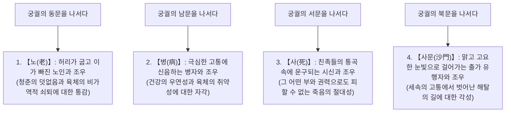
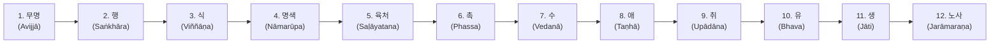

## 서론: 깨달은 자(붓다)의 탄생과 인류 사상사의 혁명

기원전 5세기부터 기원전 6세기에 걸쳐, 고대 인도 갠지스강 중류 유역에서 일어난 사상적 비등(소위 '축의 시대')의 한복판에서 고타마 싯다르타(Gautama Siddhārtha, 팔리어: 고타마 싯닷타)에 의해 열린 '불교(Buddhism)'는, 그 이전의 베다와 우파니샤드 이래 고대 인도 종교 철학을 근본적으로 전환시킨 인류 정신사 최고의 지적·실존적 혁명이었다.

붓다(Buddha)란 고유한 신의 이름이 아니라, 산스크리트어 및 팔리어로 '깨어난 자', '진리를 깨달은 자(각자, 覺者)'를 뜻하는 보통명사다. 싯다르타가 확립한 가르침의 핵심은, 우주를 창조했다는 절대신을 향한 맹목적인 신앙이나 사제 계급(바라문/브라만)에 의한 동물 희생제 및 주술적 의례를 철저히 배제하고, "인간이 존재한다는 것 자체의 구조적 고통(두카, Dukkha)"을 냉철하게 직시하며, 그 원인을 인과론적으로 해체하여 스스로의 관찰과 실천을 통해 해탈(모크샤 / 니바나)에 이르는 '이법적 실천지(에피스테메)'였다.

불교는 근대적 의미에서의 '종교'라는 틀을 아득히 뛰어넘는다. 그것은 지극히 정밀한 인지과학이자 심리치료였으며, 언어비판이자 존재론적 현상학이었다. 본고에서는 고타마 싯다르타의 생애와 사상적 전환, 사성제·팔정도·십이연기라는 교리의 논리적·수리적 구조, 오온과 무아(아나타)의 존재론적 해부, 팔리 불전의 문헌학적 정독, 그리고 현대의 인지신경과학 및 현상학, 마인드풀니스와의 심층적 조응에 이르기까지 학술적 엄밀성과 압도적인 스케일로 그 전모를 밝혀낸다.

```
【고대 인도 사상사에서 불교의 패러다임 전환】

┌─────────────────┬───────────────────────────────┬───────────────────────────────┐
│ 비교 항목       │ 정통 바라문교·우파니샤드      │ 초기불교 (고타마 붓다)        │
├─────────────────┼───────────────────────────────┼───────────────────────────────┤
│ 궁극적 실재     │ 브라흐만 (범: 우주의 근본원리)│ 법 (다르마: 연기의 법리·보편칙│
│ 자아(영혼)의 규정│ 아트만 (아: 불멸·영원한 진아)│ 무아 (아나타: 실체적 자아 부정│
│ 해탈에 이르는 길│ 범아일여 직관·제의의례·고행 │ 사성제·팔정도·중도·지관명상   │
│ 세계관          │ 카스트 제도 (바르나) 긍정     │ 카스트 차별의 철폐·만인평등  │
│ 인식의 방법     │ 베다 성전의 권위에 대한 귀의  │ 자내증 (스스로 관찰·검증함)   │
└─────────────────┴───────────────────────────────┴───────────────────────────────┘
```

---

## 1. 고타마 싯다르타의 생애와 사상적 전환

### 1.1 석가족의 왕자로서의 탄생과 사문출유의 충격
고타마 싯다르타는 히말라야 산맥 기슭, 오늘날 네팔 남부의 룸비니에서 석가족의 소도시 국가 카필라바스투(가비라위성)를 통치하던 슛도다나 왕(정반왕)과 마야 부인의 장남으로 탄생했다.

전설에 따르면 싯다르타는 태어나자마자 동서남북으로 일곱 걸음을 걸으며 "천상천하 유아독존(天上天下唯我獨尊)"이라 선언했다고 전해지지만, 역사학적·문헌학적 관점에서 볼 때 그는 동인도의 유력한 부족 연합(가나·상가제) 귀족(크샤트리아) 계급의 자제로서 부족함이 전혀 없는 지극히 풍요롭고 안락한 삶을 누리고 있었다. 부왕은 싯다르타가 출가하여 은둔자가 되는 것을 극도로 두려워하여, 세 계절(여름, 우기, 겨울)에 맞춘 웅장한 세 개의 궁전을 지어주고, 아름다운 여성들의 가무와 음악으로 궁전을 가득 채웠으며, 늙음과 질병, 죽음이라는 인간의 추악한 현실을 그의 시야에서 철저히 격리하고자 했다.

그러나 싯다르타의 더없이 예리한 지성과 감수성은 이 인공적인 낙원의 허망함을 간파하고 있었다. 이를 상징하는 사건이 바로 불전에서 유명한 '사문출유(四門出遊)' 설화다.



사문출유는 단순한 우화에 머물지 않고, **'실존적 위기(Existential Crisis)'**의 보편적 모델을 보여준다. 인간은 아무리 부유하고 권력이 있으며 건강을 누린다 해도, '늙는 것', '병드는 것', '죽는 것'이라는 세 가지 절대적 제약에서 단 1초도 벗어날 수 없다. 싯다르타는 타인의 노·병·사를 바라보며 "그것들은 먼 미래 타인의 일이 아니라, 바로 지금 여기 있는 자기 자신의 불가피한 숙명이다"라고 자각했다. 이 뼈아픈 절망과 실존적 자각이야말로 그를 29세에 '위대한 출가(유성출가/출성)'로 이끈 원동력이었다.

### 1.2 출가, 사사와 극한의 고행, 그리고 그 좌절
아내 야소다라와 갓 태어난 아들 라훌라, 그리고 왕위 계승자로서의 모든 영화를 미련 없이 내던지고, 싯다르타는 삭발한 채 거친 옷을 걸치고 진리를 구하는 '사문(슈라마나 / 자유 사상의 수행자)'이 되었다.

그는 먼저 당대 명성이 높았던 두 명의 명상 지도자를 사사했다.
1. **아라라 칼라마(Āḷāra Kālāma)**: '무소유처정(無所有處定 / 아무것도 존재하지 않는다는 고도의 정신 집중 상태)'을 지도했다. 싯다르타는 단기간에 이 경지를 체득했으나, 명상에서 깨어나면 다시 현실의 고뇌가 되돌아온다는 사실을 깨닫고 이것이 궁극의 해탈이 아니라고 판단하여 떠났다.
2. **우다카 라마푸타(Uddaka Rāmaputta)**: '비상비비상처정(非想非非想處定 / 생각이 있는 것도 아니고 없는 것도 아닌 극한의 명상 상태)'을 지도했다. 이 역시 마찬가지로 단기간에 스승과 동등한 경지에 도달했으나, 근원적인 고통의 소멸에는 이르지 못한다고 판단했다.

정신적 명상의 한계를 깨달은 싯다르타는, 다음으로 육체의 단련을 통해 욕망을 뿌리 뽑으려는 '극한의 고행(타파스, Tapas)'으로 몸을 던졌다. 마가다국의 우루벨라 숲에서 다섯 명의 수행 동료(콘단냐 등 5비구)와 함께 숨을 극한까지 멈추는 호흡 정지 고행, 살을 태우는 극한의 일광 쬐기, 그리고 하루에 참깨 한 알, 쌀 한 톨만 입에 넣는 단식 고행을 6년 동안 지속했다.

그 결과 싯다르타의 육체는 뼈와 가죽만 남아 앙상하게 여위었고, 가슴뼈는 갈빗대처럼 흉하게 드러났으며, 두피는 말라비틀어진 조롱박처럼 쭈글쭈글해졌고, 일어서려 하면 쓰러지는 극한 상황에 이르렀다. 그러나 죽음의 문턱에 섰음에도 불구하고 그토록 갈망하던 마음의 완전한 고요와 진리의 각성은 찾아오지 않았다. 여기서 싯다르타는 인류 사상사에서 결정적인 통찰에 도달한다.

> **"육체를 괴롭히는 고행은 육체를 파괴하고 정신을 피폐하게 만들 뿐, 참된 지혜와 각성을 가져다주지 않는다. 쾌락에 빠져드는 것(쾌락주의)이 그릇된 것처럼, 자신을 들볶는 고행(고행주의) 또한 잘못된 길이다."**

싯다르타는 고행을 완전히 포기하기로 결단했다. 그는 네란자라강(니련선하)에서 6년간 찌든 때와 먼지를 씻어내고 강변에서 기진맥진하여 쓰러져 있던 중, 마을 처녀 수자타(Sujātā)가 공양한 신선한 유미죽(우유죽, 파야사)을 받아먹었다. 온몸에 영양이 퍼지며 육체의 활력이 기적처럼 회복되었다. 이 모습을 본 다섯 명의 수행 동료는 "고타마가 고행을 견디지 못하고 타락했다"며 경멸하고 그를 버려둔 채 떠나버렸다.

```
【양극단(이변)의 지양과 중도(마지마 파티파다)의 발견】

쾌락에의 탐닉 (세속적 향락)  ←─────［중  도］─────→  육체에의 가학 (극한의 고행)
  (궁궐에서의 왕족 생활)         (참된 지혜와 고요)           (우루벨라 숲에서의 고행)
※ 거문고 줄은 너무 팽팽하면 끊어지고, 너무 느슨하면 소리가 나지 않는다. 알맞은 조율만이 묘음을 낳는다.
```

### 1.3 보리수 아래 성도: 마라와의 대결과 '깨달은 자(붓다)'의 탄생
체력을 회복한 싯다르타는 부다가야의 아슈왓타 나무(훗날 '보리수'라 불림) 아래 풀을 깔고 결가부좌를 틀고 앉아 흔들리지 않는 서원을 세웠다.
**"내 살이 마르고 뼈가 부서져 흩어질지언정, 참된 깨달음을 얻기 전까지는 결단코 이 자리에서 일어서지 않으리라."**

불전에 따르면 이때 싯다르타의 내면에 소용돌이치던 온갖 욕망, 공포, 의심, 집착이 의인화되어 '마왕 마라(Māra / 파피야스)'로서 그를 습격했다.
마라는 먼저 요염한 세 딸(애욕, 불만, 갈애)을 보내 싯다르타를 유혹했다. 싯다르타가 미동조차 하지 않자 폭풍, 폭우, 불덩이, 괴물 군대를 보내 공포로써 정신을 무너뜨리려 했다. 마지막으로 마라는 "너 따위에게 무슨 자격이 있어 깨달음의 자리에 앉는단 말인가"라고 외치며 싯다르타의 정통성을 의심했다. 싯다르타는 조용히 오른손을 내려 손끝으로 대지를 짚었다('촉지인 / 항마촉지인'). 그러자 대지가 우레와 같이 진동하며 "나는 수많은 전생에서 그가 쌓은 무아의 공덕을 증명하노라"라고 증언했다. 마라의 군세는 안개처럼 흩어졌고, 마음속의 모든 번뇌(킬레사)가 완전히 소멸했다.

밤의 초경(저녁 6시~10시), 싯다르타는 자신의 무수한 전생의 기억을 떠올리는 '숙명통(宿命通 / 숙명명)'을 얻었다.
밤의 중경(밤 10시~새벽 2시), 모든 생명이 업(카르마)에 따라 나고 죽음을 반복하는 윤회의 법칙을 꿰뚫어 보는 '천안통(天眼通 / 천안명)'을 얻었다.
그리고 밤의 후경(새벽 2시~6시), 샛별(새벽별)이 동쪽 하늘에서 찬연히 빛나는 순간, 만물이 상호 의존하여 생기하고 소멸하는 '십이인연(연기의 법)'을 순관과 역관으로 철저하게 관조하여 온갖 번뇌를 뿌리 뽑는 '누진통(漏盡通 / 누진명)'을 체득했다.

이로써 싯다르타는 아뇩다라삼먁삼보리(무상정등각 / 완전한 깨달음)를 성취하고, 인간의 한계를 초극하여 **'붓다(석가모니 세존)'**가 되었다. 이때 그의 나이 35세였다.

### 1.4 범천권청과 초전법륜: 침묵에서 세계 종교로의 도약
성도를 이룬 직후, 붓다는 깊은 사색에 잠기며 자신이 깨달은 법(다르마)을 세상 사람들에게 설하는 것을 주저했다. "내가 깨달은 이 법은 너무나 심오하고 미세하며 논리를 초월해 있어 오직 현자만이 알 수 있는 것이다. 격렬한 욕망과 집착에 덮여 있는 세상 사람들에게 이를 설해본들 헛되이 혼란만 부르고 피로만 초래하지 않겠는가." 붓다는 설법하지 않고 이대로 조용히 열반에 들고자 했다.

이때 인도 신화의 최고신인 범천(브라흐마)이 하늘에서 내려와 붓다 앞에 무릎을 꿇고 합장하며 세 번에 걸쳐 간곡히 청했다고 전해진다. 이것이 바로 **'범천권청(梵天勸請)'**이다.
"세존이시여, 부디 법을 설해 주소서. 세상에는 눈에 번뇌의 먼지가 적어 맑고 깨끗한 마음을 지닌 이들도 있습니다. 그들은 법을 듣지 못하면 쇠퇴하겠지만, 법을 들으면 반드시 진리를 깨달을 것입니다."

붓다는 자비의 눈으로 세상을 관찰했다. 진흙탕 속에 피어나는 연꽃 중에는 진흙물 속에 잠겨 있는 것, 수면 언저리에 닿아 있는 것, 그리고 진흙물을 벗어나 아름답게 꽃을 피운 것이 있듯이, 사람들 가운데도 지혜의 자질에 다양한 차이가 있음을 간파했다. 붓다는 침묵을 깨기로 결단을 내렸다.

> **"불사의 문은 열렸다. 귀 있는 자들이여, 믿음을 품고 들으라."**

붓다는 자신을 버리고 떠났던 다섯 명의 수행 동료를 찾기 위해 수백 킬로미터의 길을 걸어 사르나트(녹야원)로 향했다. 멀리서 다가오는 붓다의 위엄에 찬 모습을 본 다섯 사람은 처음에 "무시하자"고 결의했음에도 불구하고, 그 성스럽고 고결한 자태에 압도되어 자기도 모르게 벌떡 일어나 발을 씻겨주고 자리를 마련하여 맞이했다.

붓다는 그들을 향해 인류 역사상 최초의 설법――**'초전법륜(初轉法輪 / 진리의 수레바퀴를 굴림)'**을 펼쳤다. 여기서 설해진 가르침이 바로 '중도'이자 '사성제'이며 '팔정도'였다. 법문을 듣던 중 가장 연장자였던 콘단냐가 "생겨나는 성질을 지닌 것은 모두 소멸하는 성질을 지닌다"는 진리를 직관하여 깨달음의 눈(법안, 法眼)을 떴다. 이로써 불(스승)·법(가르침)·승(수행 공동체=승가)이라는 '삼보(三寶)'가 지상에 성립된 것이다.

---

## 2. 불교 교리의 근간: 사성제(Cattāri Ariyasaccāni)의 논리 구조

붓다의 가르침은 신비주의적 도그마나 교조적 신앙이 아니라, 고대 인도 의학 체계(아유르베다)에서의 '진단·병인·건강상태·처방전'이라는 논리 구조를 정신의 영역에 완벽히 적용한 **'실존적 임상의학'**이었다. 그 기본 프레임워크가 바로 '사성제(四聖諦 / 네 가지 거룩한 진리)'다.

```
【의학의 치료 모델과 사성제의 구조적 상동성】

┌─────────────────┬───────────────────────────────┬───────────────────────────────┐
│ 의학적 진단 모델│ 불교의 사성제                 │ 내용과 실존적 의미            │
├─────────────────┼───────────────────────────────┼───────────────────────────────┤
│ 1. 병상의 인식  │ 고제 (두카 사차)              │ 인생의 근본 현실은 '고(苦)'   │
│ 2. 병인의 규명  │ 집제 (사무다야 사차)          │ 고통의 원인은 '갈애(탄하)'    │
│ 3. 치유상태 설정│ 멸제 (니로다 사차)            │ 갈애의 소멸 = 열반(니바나)    │
│ 4. 치료법의 처방│ 도제 (마가 사차)              │ 열반에 이르는 실천법 = 팔정도 │
└─────────────────┴───────────────────────────────┴───────────────────────────────┘
```

### 2.1 고제(Dukkha-sacca): 실존의 구조적 '불만족성'
불교가 "일체개고(一切皆苦 / Sabbe saṅkhārā dukkhā)"를 선언할 때, 여기서 말하는 '고(두카 / Dukkha)'란 단순한 육체적 고통이나 정서적 슬픔·불행만을 의미하지 않는다.
팔리어 *dukkha*의 어원은 수레바퀴 축 구멍(kha)이 어긋나서(du) 제대로 맞물리지 않아, 바퀴가 덜컹거리고 삐걱거리며 뜻대로 굴러가지 않는 상태를 가리킨다. 즉, **"자신의 뜻대로 되지 않는 것", "근본적인 불만족성·부조화"**야말로 두카의 본질이다.

초기불교는 인생의 고통을 다음과 같은 '사고팔고(四苦八苦)'로 정밀하게 체계화했다.

1. **생고(生苦, Jāti)**: 태어나는 것, 그리고 삶을 지속하는 것 그 자체의 고통.
2. **노고(老苦, Jarā)**: 육체와 지력이 쇠퇴해가는 고통.
3. **병고(病苦, Byādhi)**: 육체적 질병에 시달리는 고통.
4. **사고(死苦, Maraṇa)**: 존재의 소멸과 죽음의 공포에 직면하는 고통.
5. **애별리고(愛別離苦, Piya-vippayoga)**: 사랑하는 대상, 친한 이들과 이별해야만 하는 고통.
6. **원증회고(怨憎會苦, Appiya-sampayoga)**: 증오하는 대상, 혐오스러운 것과 마주치고 공존해야만 하는 고통.
7. **구부득고(求不得苦, Yampicchaṃ na labhati)**: 구하고자 하는 바를 얻지 못하는 고통.
8. **오취온고(五取蘊苦, Pañcupādānakkhandhā)**: 자아를 구성하는 다섯 가지 요소(오온)에 집착하는 데서 생겨나는 총체적 고통.

### 2.2 집제(Samudaya-sacca): 고통의 발생 메커니즘과 '갈애'
고통이 존재한다면 거기에는 반드시 그것을 낳는 '원인'이 존재한다. 집제(集諦)는 고통의 근원이 **'갈애(탄하 / Taṇhā)'**에 있음을 꿰뚫어 본다.
탄하란 글자 그대로 사막에서 목이 타들어 가는 사람이 물을 찾아 광란하듯 대상을 맹렬히 탐하고 집착하며 놓지 않으려는 맹목적 충동이다.

붓다는 갈애를 다음 세 가지로 분류했다.
- **욕애(欲愛, Kāma-taṇhā)**: 감각기관(시각·청각·미각 등)의 쾌락에 대한 갈애.
- **유애(有愛, Bhava-taṇhā)**: 자아가 계속 존재하고 싶다, 영원히 살고 싶다, 명예와 부를 확장하고 싶다는 존재에 대한 갈애(생에 대한 집착).
- **무유애(無有愛, Vibhava-taṇhā)**: 고통에서 벗어나기 위해 자아를 소멸시키고 싶다, 모든 것을 파괴하고 싶다는 허무·단멸에 대한 갈애(죽음으로의 도피욕).

갈애의 무서움은 그것이 충족되어도 결코 끝나지 않는 '중독적 구조'에 있다. 갈증을 달래기 위해 바닷물을 마시는 것과 같아서, 마시면 마실수록 갈증은 더욱 격렬해져 인간을 끝없는 고뇌의 윤회에 결박한다.

### 2.3 멸제(Nirodha-sacca): 고통의 완전한 소멸과 '열반'
병인이 제거되면 병이 완치되듯이, 고통의 원인인 갈애가 완전히 소멸한 경지가 존재한다. 그것이 바로 멸제(滅諦)이며, 불교의 궁극적 목표인 **'열반(니바나 / 산스크리트어: 니르바나)'**이다.

니바나의 어원은 '불어 끄다(Nir + vā)'이다. 탐욕(탐), 분노(진), 무지(치)라는 '삼독의 불길'이 완전히 꺼져 서늘하고 고요한 평온으로 충만한 마음 상태를 의미한다. 열반이란 사후에 이르는 천국과 같은 장소가 아니라, **"지금 여기에서 번뇌의 구속으로부터 완전히 해방된 자유의 경지"**다.

### 2.4 도제(Magga-sacca): 열반에 이르는 구체적 처방전 '팔정도'
고통을 멸하고 열반에 이르기 위한 구체적이고 실천적인 길이 도제(道諦)이며, 그것이 바로 '팔정도(八正道 / Ariyo aṭṭhaṅgiko maggo)'다. 팔정도는 다음 여덟 가지 실천 항목으로 이루어지며, 전통적으로 '계(도덕)·정(집중)·혜(지혜)'의 '삼학(三學)'으로 포섭된다.

```
【팔정도의 구조와 삼학(계·정·혜)의 대응 체계】

┌───────────────┬───────────────────────────────┬───────────────────────────────┐
│ 삼학의 분류   │ 팔정도의 항목                 │ 실천적 정의와 기능            │
├───────────────┼───────────────────────────────┼───────────────────────────────┤
│ 혜학 (지혜)   │ 1. 정견 (Sammā-diṭṭhi)        │ 사제·연기·인과응보를 바르게 봄│
│               │ 2. 정사유 (Sammā-saṅkappa)    │ 탐욕과 악의를 여의고 청정 사유│
├───────────────┼───────────────────────────────┼───────────────────────────────┤
│ 계학 (윤리)   │ 3. 정어 (Sammā-vācā)          │ 거짓말, 험담, 이간질, 잡담 금지│
│               │ 4. 정업 (Sammā-kammanta)      │ 살생, 도둑질, 삿된 음행을 삼감│
│               │ 5. 정명 (Sammā-ājīva)         │ 무기·독물·생명매매 피한 생계  │
├───────────────┼───────────────────────────────┼───────────────────────────────┤
│ 정학 (명상)   │ 6. 정정진 (Sammā-vāyāma)      │ 악을 끊고 선을 기르는 부단한력│
│               │ 7. 정념 (Sammā-sati)          │ 심신 현상을 지금-여기서 관찰  │
│               │ 8. 정정 (Sammā-samādhi)       │ 마음을 한곳에 모아 선정의 고요│
└───────────────┴───────────────────────────────┴───────────────────────────────┘
```

팔정도는 하나씩 순서대로 행하는 것이 아니라, 여덟 개의 수레바퀴 살처럼 서로를 지탱하며 전체로서 기능하는 시스템이다. 정견을 통해 세계를 올바르게 인식하고, 계(정어·정업·정명)를 통해 행위를 정화하며, 정(정정진·정념·정정)을 통해 마음을 벼림으로써 정견은 더욱 깊어지고 최종적인 해탈에 도달하게 된다.

---

## 3. 존재론의 심연: 십이인연(연기설)과 오온성고

### 3.1 연기설(Paṭicca-samuppāda): 붓다 최고의 발견
붓다의 가르침 중에서 가장 철학적 심도가 깊고, 불교를 다른 모든 사상으로부터 준별하는 근본 명제가 바로 **'연기(緣起 / 팔리어: 파팃차 사무파다)'**다.
연기란 '조건(연)에 의지하여 생겨남(Dependent Origination / 상의성)'을 의미한다.

붓다는 팔리 경전 속에서 연기의 이법을 지극히 간결하고도 수학적인 명제로 정식화했다.

> **"이것이 있으므로 저것이 있고, 이것이 생겨나므로 저것이 생겨난다.**
> **이것이 없으므로 저것이 없고, 이것이 소멸하므로 저것이 소멸한다."**
> (『상윳타 니카야』)

세계에 존재하는 모든 현상(물질, 마음, 생명, 사회)은 홀로 자급자족적으로 존재하는 '절대적 실체'가 아니다. 모든 것은 무수한 원인(인)과 조건(연)이 복잡하게 얽혀 있는 상호 연관의 그물망(인드라망) 속에서 잠시 현상하고 있을 뿐이다. 절대적인 창조주도, 불변하는 신도, 영원한 제1원인도 존재하지 않는다. 조건이 갖추어지면 생겨나고, 조건이 허물어지면 소멸한다――이것이 우주를 관통하는 보편적 법칙(법 / 다르마)이다.

### 3.2 십이인연(십이지연기)의 연쇄 구조
붓다는 성도의 밤, 인간이 왜 늙음과 죽음의 고통에 얽매여 윤회를 거듭하는가에 대한 인과의 메커니즘을 12개의 고리(십이인연)로 규명해냈다.



```
【십이인연의 각 지(支)와 인간 존재의 심리학적 전개】

1. 무명 (아윗자): 근본적인 무지. 사성제와 연기, 무아의 진리를 보지 못함.
2. 행 (상카라): 무지에 근거하여 일으키는 의지적 형성 작용, 잠재적 형성력, 업(Karma)의 형성.
3. 식 (윈냐나): 대상을 인식하고 분별하는 작용, 의식, 결생식(생명의 연속성 유지).
4. 명색 (나마루파): 정신적 기능(명)과 물질적 신체(색)의 결합체 = 태아의 형성.
5. 육처 (살라야타나): 여섯 가지 감각기관(눈·귀·코·혀·몸·마음/의근).
6. 촉 (팟사): 감각기관과 외부 대상과 인식(식)의 세 가지가 접촉함.
7. 수 (웨다나): 접촉에 의해 일어나는 감수 작용(즐거움·괴로움·즐겁지도 괴롭지도 않음).
8. 애 (탄하): 쾌락을 추구하고 고통을 피하려는 격렬한 갈애와 맹목적 충동.
9. 취 (우파다나): 갈애에 기반하여 대상을 자신의 것으로 움켜쥐려는 집착.
10. 유 (바와): 집착에 의해 규정되는 존재 양식, 업의 축적과 새로운 생존의 잠재력.
11. 생 (자티): 새로운 생존, 즉 생명체로 태어남.
12. 노사 (자라마라나): 태어났기에 불가피한 노쇠, 고통, 비탄, 그리고 죽음.
```

십이인연의 놀라운 점은 노사의 고통이 지닌 근본 원인이 **'무명(무지)'**에 있음을 규명해 냈다는 점이다.
그리고 이 인과의 연쇄는 '역회전'시키는 것이 가능하다.
지혜로써 무명이 멸하면 행이 멸한다. 행이 멸하면 식이 멸한다…… 최종적으로 집착이 멸하고 생이 멸하여, 노사라는 거대한 고통의 퇴적이 근본에서부터 소멸한다('환멸문'). 불교에서 고통으로부터의 해방은 기적이나 은총에 의한 것이 아니라, 인식의 근본적 전환(지혜)에 따른 논리적 필연인 것이다.

### 3.3 오온(Pañca-khandhā): 인간 존재의 탈구축
'나'란 도대체 누구인가?
붓다는 인간이라는 존재를 고정된 단일 실체(영혼)로 파악하는 것을 단호히 거부하고, 인간을 다섯 가지 구성 요소의 집합체――**'오온(五蘊 / 팔리어: 판차 칸다)'**으로 해체(데콘스트럭션)했다.

1. **색온(루파 / Rūpa)**: 물질적 신체, 육체, 감각기관과 외계의 물리적 대상.
2. **수온(웨다나 / Vedanā)**: 대상과 접촉했을 때 일어나는 감각적 인상, 감수 작용(즐거움·괴로움·둘 다 아님).
3. **상온(산냐 / Saññā)**: 대상이 무엇인지를 개념화하고 명명하며 기억과 대조하는 표상·지각 작용.
4. **행온(상카라 / Saṅkhāra)**: 감정, 의지, 욕망, 의도 등 마음을 특정한 방향으로 움직이게 하는 정신적 형성력.
5. **식온(윈냐나 / Viññāṇa)**: 이들 전체를 통합하고 대상을 식별·인지하는 순수의식.

붓다는 제자들에게 물었다. "오온의 각각은 영원한가, 무상한가?" "무상합니다." "무상하다면 그것은 고통인가, 즐거움인가?" "고통입니다." "무상하고 고통이며 변하고 소멸하는 성질의 것이라면, '이것은 내 것이며, 이것이야말로 나이며, 이것이야말로 나의 자아(아트만)이다'라고 보는 것이 옳겠는가?" 제자들은 "아닙니다, 세존이시여, 옳지 않습니다"라고 대답했다.

인간은 이 다섯 가지 요소가 빠른 속도로 변화하며 상호작용하는 역동적인 '프로세스(흐름)'에 지나지 않는다. 수레가 바퀴, 차축, 차체 등의 부품이 모여 비로소 '수레'라고 불리듯, '인간'이나 '자아'란 오온의 다발에 편의상 붙여진 이름에 불과하다.

---

## 4. 무아(Anattā)의 철학: 실체적 자아의 해체와 실존적 자유

### 4.1 아나타(무아) vs 우파니샤드의 아트만(진아)
초기불교 사상의 진면목이자 가장 오해받기 쉬운 개념이 바로 **'무아(아나타 / Anattā / 산스크리트어: 아나트만)'**이다.

당대 인도의 주류 사상(우파니샤드 철학)은 "육체나 감정이 덧없이 흘러갈지라도 그 심오한 내면에는 결코 멸하지 않는 영원불멸의 참된 자아(아트만 / 아)가 존재한다"고 주장했다. 그리고 이 아트만이 우주의 근본 원리(브라흐만)와 하나임(범아일여, 梵我一如)을 깨닫는 것만이 해탈이라고 설파했다.

이에 반해 붓다는 "제법무아(諸法無我 / Sabbe dhammā anattā)"를 선언하며 아트만의 실재를 철저히 부정했다.
붓다의 논리는 지극히 명쾌하다.
만약 무언가가 '나의 자아(내 것)'라면, 그것은 내 의지에 따라 완벽하게 통제될 수 있어야 한다. "내 육체여, 병들지 말라, 늙지 말라"고 명한다고 해서 그대로 되는가? 내 감정이나 생각을 1초의 어긋남 없이 뜻대로 제어할 수 있는가? 불가능하다. 왜냐하면 그것들은 조건(연)에 따라 제멋대로 생겨나고 사라지는 현상에 불과하기 때문이다. 뜻대로 되지 않는 것을 '나'라고 부를 수는 없다. 따라서 오온 그 어디를 뒤져보아도 고정된 실체로서의 '자아'는 발견되지 않는다.

```
【아트만 실재론과 불교 무아론의 인식론적 대립】

■ 우파니샤드의 실체론 (아트만)
신체·감정·사고의 배후에
영원하고 불멸하며 순수한 '관찰자로서의 영혼(진아)'이 실재한다고 상정.
※ '영혼의 구원'을 추구하지만, 필연적으로 '자기 자신에 대한 집착'을 강화하는 덫에 빠짐.

■ 초기불교의 현상론·과정론 (아나타)
신체·감정·사고가 인과적으로 쉼 없이 흘러갈 뿐이며,
배후에 독립된 '관찰자' 따위는 존재하지 않음. '보는 행위'만 있을 뿐 '보는 자'는 없음.
※ '나'라는 고정관념 자체를 해체함으로써 모든 집착의 뿌리를 근원적으로 절단.
```

### 4.2 삼법인과 사법인: 우주의 보편적 진리
불교의 기치(트레이드마크)로 제시되는 것이 바로 '법인(法印 / 진리의 도장)'이다. 이는 모든 사물과 현상의 궁극적 실상을 나타낸다.

1. **제행무상(諸行無常 / Sabbe saṅkhārā aniccā)**:
   형성된 모든 것(상카라)은 찰나의 멈춤도 없이 변화해 간다. 고정된 정지 상태란 우주 어디에도 존재하지 않는다.
2. **제법무아(諸法無我 / Sabbe dhammā anattā)**:
   형성된 것(유위법)뿐만 아니라, 모든 존재(무위법을 포함한 일체의 법)에 고정된 실체(자아)는 존재하지 않는다.
3. **열반적정(涅槃寂靜 / Nibbānaṃ santaṃ)**:
   무상과 무아를 완전히 자각하여 집착의 불길이 꺼져버린 경지는 절대의 고요와 평화다.
4. **일체개고(一切皆苦 / Sabbe saṅkhārā dukkhā)**:
   무상한 것을 영원하다고 착각하고, 무아인 것에 '나'로서 집착하기에 모든 현상은 '고통'이 된다(삼법인에 일체개고를 더하여 사법인이라 한다).

무아란 결코 '허무주의(니힐리즘)'가 아니다. 붓다는 "인간은 죽으면 모든 것이 무로 돌아간다"는 단견(단멸론) 또한 "영혼은 영원히 불멸한다"는 상견(상주론)과 마찬가지로 그릇된 극단으로 보아 엄격히 배격했다. 무아란 "고정된 실체에 얽매이지 않고, 지금 여기에 있는 생명의 여실한 사실을 직시하여 온갖 집착으로부터 자유로워지는 것"이다.

---

## 5. 초기 불전의 문헌학적 해독과 승가의 형성

### 5.1 팔리 경전의 성립사와 결집(상기티)
붓다는 자신의 가르침을 단 한 글자도 문자로 남기지 않았다. 고대 인도에서는 성스러운 가르침을 문자가 아닌, 스승에게서 제자로 이어지는 엄격한 '구전(암송)'을 통해 전승하는 전통이 있었기 때문이다.

붓다가 80세로 쿠시나가라에서 입멸(마하파리니바나 / 완전한 열반)한 직후, 마가다국의 왕사성(라지기르)에서 장로 마하카사파(마하가섭)의 주도 아래 500명의 아라한이 집결했다. 이것이 바로 **'제1차 결집(第一結集 / 산스크리트어: 상기티=합송)'**이다.

```
【제1차 결집에서의 2대 전승 확립】

1. 경장(숫타 피타카 / Sutta Piṭaka)의 결집
   · 송출자(구술자): 아난다 (아난 / 붓다의 사촌이자 25년간 곁에서 시봉한 '다문제일')
   · 서두 정형구: "이와 같이 나는 들었다(에밤 메 수탐 / 如是我聞)"
   · 내용: 붓다가 각지에서 사람들의 근기에 맞추어 설한 대화와 가르침(설법) 모음.

2. 율장(비나야 피타카 / Vinaya Piṭaka)의 결집
   · 송출자(구술자): 우파리 (이발사 출신으로 계율에 가장 정통했던 '지율제일')
   · 내용: 출가 수행자(비구·비구니)가 지켜야 할 규범, 교단 운영 규칙, 위반 시 처벌 규정.
```

이후 교단의 분열(근본분열)을 거쳐 기원전 1세기경, 스리랑카(실론섬)에서 타밀인의 침략과 기근으로 승려가 격감하는 위기에 직면하자, 구전의 산실을 막기 위해 야자수 잎(패엽)에 팔리어로 비로소 문자화하여 기록되었다. 이것이 오늘날까지 전해지는 **'팔리 삼장(티피타카 / 경장·율장·논장)'**이다.

### 5.2 최고층 불전: 『숫타니파타』와 『담마파다』의 사상
현대 불교 문헌학(나카무라 하지메, 에드윈 아놀드, 리즈 데이비즈 등)의 연구에 의해 팔리 경전 중에서도 특히 오래된 언어 형태(고알카익기)를 간직한 최원초층 텍스트가 특정되었다. 그 대표가 『숫타니파타(경집)』 제4장 '의족경(Atthakavagga)'과 제5장 '피안도품(Pārāyanavagga)', 그리고 『담마파다(법구경)』다.

이 최원초층 불전들에 나타나는 붓다의 모습은 훗날 불교에서 보이는 장엄한 불상이나 천상의 무수한 보살들에게 둘러싸인 초자연적인 신불이 아니라, 소박한 옷을 걸치고 탁발 발우를 손에 든 채 황야를 고독하게 걸어가는 리얼리스트 철인이다.

> **"무소의 뿔처럼 혼자서 가라."**
> (『숫타니파타』 제1장 제3절)
> 동료와 사귀면 애착과 집착이 생기고, 애착을 따르면 고통이 따른다. 타인과의 소모적인 논쟁과 세속의 허영을 여의고, 맑고 깨끗하게 스스로를 다스리며 무소의 뿔처럼 홀로 가라.

> **"원한에 원한으로 갚는다면 원한은 결코 가라앉지 않는다.**
> **원한을 버릴 때에만 원한은 가라앉나니, 이것은 영원한 진리이다."**
> (『담마파다』 제5게)

최원초층 경전에서 붓다는 형이상학적 논쟁("세계는 유한한가 무한한가", "영혼과 육체는 동일한가 다른가", "사후에 여래는 존재하는가 존재하지 않는가")을 "무익한 탁상공론(희론, 戱論)"으로 물리쳤다. 유명한 '독화살의 비유'가 보여주듯, 독화살을 맞은 사람이 해야 할 일은 "독화살을 쏜 자의 신분이나 화살의 재질"을 따지는 것이 아니라, 즉시 독화살을 뽑아 독을 치료하는 것이다. 붓다의 관심은 철두철미하게 "현실에서 고통받고 있는 인간을 어떻게 구할 것인가"라는 실존적 구제에만 집중되어 있었다.

---

### 5.3 초기 승가의 통치공학: 바라제목차(파티목카)와 전원일치의 자치 민주주의

붓다가 창설한 수행자 공동체 '승가(Saṅgha)'는 단순한 종교적 신자들의 모임이 아니라, 인류 역사상 가장 초기에 성립된 **'철저한 직접민주제·협동조합적 자치 공동체'**였다.

카스트 제도가 엄격히 지배하고 전제군주정(마가다국과 코살라국)이 발흥하던 고대 인도 사회에서 붓다의 승가는 놀라운 평등의 오아시스를 출현시켰다. 승가에 발을 들여놓는 순간, 왕족(크샤트리아)도 사제(브라만)도 상인(바이샤)도, 그리고 최하층인 수드라나 불가촉천민(찬달라)도 모든 신분적 특권과 차별을 박탈당하고 오직 '득도(출가)한 순서'에 의해서만 존경을 받는 완전 평등한 공동체 구성원이 되었다. 천한 이발사 출신이었던 우파리가 석가족의 고귀한 왕자들(아누룻다나 아난다)보다 먼저 득도했기 때문에, 왕자들이 우파리의 발아래 무릎을 꿇고 절을 올렸다는 일화는 승가의 혁명적 평등성을 생생하게 증명한다.

```
【초기 승가의 자치 거버넌스 시스템과 합의제의 법리】

1. 갈마 (캄마 / Kamma): 최고 의사결정에서의 전원일치제
   · 교단 내 중대사(신참자의 득도 수계, 계율 위반 심리, 승가 재산의 분배 등)는 대중 집회에서 전원의 동의를 통해 결정.
   · 동의안(동기)이 제출된 후, 사회자가 세 번에 걸쳐 "이의가 있는가"를 묻고, 전원의 침묵(이의 없음)을 통해 가결(백사갈마 / 白四羯磨). 단 한 명이라도 정당한 사유로 반대하면 결의는 성립하지 않음.

2. 포살 (우포사타 / Uposatha): 반월(半月) 주기의 자정과 윤리 규율 유지
   · 삭망(초하루와 보름, 보름 주기) 밤에 대중이 모여 227조(비구계 기준)의 계목(바라제목차 / 파티목카)을 한 조목씩 낭독.
   · 스스로 범한 잘못을 대중 앞에 솔직히 고백(참회)하여 심신의 청정을 회복. 은폐나 허위 진술은 엄격히 금지.

3. 자자 (파와라나 / Pavāraṇā): 안거(우기 집중수행) 해제 시의 상호 피드백
   · 3개월간의 하안거가 끝나는 날, 수행자들 상호 간에 "내가 보고 들은 허물이 있다면 자비로운 마음으로 지적해 주십시오"라고 요청하고, 겸허하게 비판을 수용.
```

나아가 역사적·사회학적으로 특별히 주목해야 할 점은 붓다의 양모인 마하프라자파티(대애도) 등의 열렬한 간청을 수용하여, 붓다가 당대로서는 전 세계에서 유례를 찾아볼 수 없었던 **'비구니 승가(여성 출가 교단)'**의 설립을 인가했다는 사실이다. 고대 세계에서 여성이 아버지나 남편, 아들에게 예속된 소유물로 간주되던 시대에 여성에게도 남성과 완전히 동등한 해탈과 아라한과의 가능성을 공식적으로 인정하고, 자율적인 여성 공동체의 운영을 허락한 것은 종교사·젠더사에서 헤아릴 수 없이 거대한 선구적 도약이었다.

## 6. 초기불교에서 아비달마·대승불교로의 구조적 전환

### 6.1 아비달마(논장) 불교: 존재의 극미 분석
붓다의 입멸 후 수백 년이 흘러 교단은 보수적인 상좌부(테라와다)와 진보적인 대중부(마하상기카)로 분열(근본분열)했고, 다시금 스무 개에 달하는 부파로 세분화되었다(부파불교).

이 시대 각 부파의 학승들은 붓다의 가르침을 체계화하고 엄밀화하기 위해 방대한 주석서와 철학 대계를 구축했다. 이것이 '아비달마(阿毘達磨 / 법에 대한 연구)'다. 특히 설일체유부(Sarvāstivāda)는 세계를 구성하는 궁극적 요소(다르마 / 극미)를 철저히 분류하여 '오위칠십오법(五位七十五法)'이라는 경이로울 정도로 정밀한 인지·존재론 모델을 완성했다.

그러나 아비달마 불교는 고도로 전문화·학문화되면서 출가승들이 명상실에 틀어박혀 미세한 철학 논쟁에 세월을 보내는 '상아탑'으로 전락해 갔다. 일반 대중의 고뇌로부터 유리된 엘리트주의적 불교에 대해 강렬한 비판과 반동이 일어났다.

### 6.2 대승불교(마하야나)의 혁명: 자리이타와 공(순야타)
기원 전후 재가 신도들과 혁신적인 승려들 사이에서 "자기 자신의 해탈(아라한)만을 추구하는 편협한 가르침(소승 / 히나야나)"에서 탈피하여 모든 살아있는 존재를 구제하는 거대한 수레――**'대승(마하야나)'**을 표방하는 일대 종교 운동이 일어났다.

```
【부파불교(초기불교 전개)와 대승불교의 패러다임 비교】

┌─────────────────┬───────────────────────────────┬───────────────────────────────┐
│ 비교 항목       │ 부파불교 (초기불교의 전개)    │ 대승불교 (마하야나)           │
├─────────────────┼───────────────────────────────┼───────────────────────────────┤
│ 이상의 인간상   │ 아라한 (자기 자신의 해탈 달성)│ 보살 (자비로써 일체중생을 구제│
│ 실천의 성격     │ 자리 (출가 수행을 통한 자내증)│ 자리이타 원만 (타자 구제와 하 │
│ 철학적 핵심     │ 오위칠십오법·법(다르마)의 실유│ 공 (순야타)·중관·유식 사상   │
│ 구제의 범위     │ 출가계를 수지하는 일부 수행자 │ 일체중생 실유불성 (만인성불)  │
│ 대표적 경전     │ 아함경·팔리 삼장              │ 반야경, 법화경, 화엄경, 정토경│
└─────────────────┴───────────────────────────────┴───────────────────────────────┘
```

대승불교의 사상적 기초를 닦은 용수(나가르주나, 2~3세기)는 초기불교의 '연기'를 철저하게 밀고 나가 **'공(순야타 / Śūnyatā)'**의 철학을 확립했다(『중론』).
용수에 따르면 모든 것은 연기(타자와의 관계성)에 의해 성립하므로, 그 자체의 고정된 본질(자성 / 스바바바)을 갖지 않는다. 자성이 없다는 것, 그것이 곧 '공'이다. 공이란 '아무것도 없는 허무'가 아니라, "고정된 실체가 없기 때문에 비로소 무한한 가능성과 관계성을 향해 열려 있다"는 역동적인 긍정의 논리였다.

이렇게 초기불교의 '무아·연기'는 대승불교의 '공', '자비', '유식', '여래장'으로 장엄하게 발전하여 중앙아시아, 중국, 한반도, 그리고 일본으로 전파되기에 이른다.

---

## 7. 현대 사상·인지과학·마인드풀니스와의 심층적 대화

### 7.1 인지행동치료(CBT)와 불교의 구조적 상동성
현대 정신의학의 골드 스탠더드인 '인지행동치료(CBT)', 특히 아론 벡(Aaron Beck)의 인지치료나 앨버트 엘리스(Albert Ellis)의 합리정서행동치료(REBT)는 불교의 사성제와 경이로운 구조적 상동성을 보여준다.

인지치료는 "사건 그 자체가 인간을 괴롭히는 것이 아니라, 사건에 대한 '인지(자동적 사고·도식)'가 고통을 만들어낸다"고 설파한다. 이는 붓다가 『전경(화살의 경, Sallatha Sutta)』에서 설한 **'두 번째 화살'**의 가르침 그 자체다.

> 인생에서 육체적 통증이나 불운이라는 '첫 번째 화살'이 날아오는 것은 피할 수 없다.
> 그러나 어리석은 범부는 "왜 하필 나에게 이런 일이 일어나는가", "이제 모든 것이 끝났다"라며 분노하고 비탄에 잠긴다. 이로써 스스로 '두 번째 화살'을 마음에 꽂아 고통을 수십 배로 증폭시킨다.
> 지혜로운 수행자는 첫 번째 화살이 꽂히더라도 두 번째 화살을 스스로 꽂지는 않는다.

불교의 위빳사나 명상(정념 / 사티)은 첫 번째 화살(순수한 감각적 입력)과 두 번째 화살(그로부터 유발되는 자동적 사고·감정·망상)을 준열히 분리하여, 두 번째 화살의 연쇄를 끊어내는 인지공학이다.

### 7.2 마인드풀니스(MBSR)의 탄생과 뇌신경과학
1979년 매사추세츠 의과대학의 존 카밧진(Jon Kabat-Zinn) 교수는 초기불교의 '사티(Sati / 념)' 명상 기법에서 종교적·문화적 맥락을 걷어내고, 과학적·의학적 중재 프로그램으로서 **'마음챙김에 기반한 스트레스 완화(MBSR)'**를 개발했다.

마음챙김이란 **"지금 이 순간의 경험에 판단을 개입시키지 않고(Non-judgmental), 의도적으로 주의를 기울이는 것"**이다.

```
【현대 마음챙김(마인드풀니스) 명상과 뇌신경 회로의 변용】

［디폴트 모드 네트워크(DMN)의 과잉 활성화］
· 내측 전전두피질(mPFC), 후대상피질(PCC)의 지속적 과열
· 과거에 대한 후회, 미래에 대한 불안, 자아에 대한 집착(반추 사고)의 무한 루프
· 뇌 전체 에너지의 60~80%를 소모하며 우울증·불안장애의 온상이 됨
  ↓
［마음챙김 명상의 실천 (사티·호흡에 대한 주의 집중)］
· 주의 제어 네트워크(배외측 전전두피질, 뇌섬엽)의 활성화
· DMN 활동의 유의미한 억제 (뇌의 공회전 및 과열 차단)
  ↓
［뇌의 구조적 변화 (신경가소성 / Neuroplasticity)］
· 편도체(공포·스트레스 반응의 중추)의 부피 축소 및 과민 반응성 완화
· 해마(기억 및 정서 조절) 및 전두엽 피질의 회백질 밀도 증가
· 정서 조절 능력, 인지적 집중력, 주관적 웰빙 및 안녕감의 극적인 향상
```

현대의 fMRI를 활용한 뇌기능 영상 연구는 2500년 전 붓다가 보리수 아래서 체득한 '관찰 명상(위빳사나)'이 뇌의 자기참조적 네트워크(DMN)를 진정시키고, 공포 중추인 편도체를 가라앉히며, 정서 조절 기능을 물리적으로 재배선한다는 사실을 과학적으로 입증해 가고 있다.

### 7.3 현상학·에낵티비즘과의 공명: 바렐라와 데리다
철학의 영역에서도 불교의 연기와 무아론은 20세기 후반의 최첨단 사상과 격렬하게 공명하고 있다.

생물학자 프란시스코 바렐라(Francisco Varela) 등은 『체화된 마음(*The Embodied Mind*, 1991)』에서 인지과학, 현상학(메를로퐁티), 그리고 불교의 '중도·오온론'을 통합했다. 인지란 객관적인 외부 세계를 뇌가 거울처럼 수동적으로 표상하는 것이 아니라, 신체를 지닌 유기체가 환경과의 상호작용을 통해 세계를 함께 창조해 나가는 '에낵션(생성 / Enaction)'의 과정이라고 주장했다. 이는 색(신체·환경)과 식(의식)이 상호 의존하여 생겨난다는 초기불교의 '명색과 식의 상의관계'에 대한 직접적인 복권이었다.

또한 자크 데리다(Jacques Derrida)의 탈구축(Deconstruction)이 서구 형이상학의 '현존의 형이상학(고정된 실체에 대한 맹신)'을 해체한 작업은, 붓다가 아트만이라는 환상을 오온의 연기로 해체해 낸 무아의 논리와 놀라운 친화성을 지닌다. 불교는 근대 서양이 수백 년에 걸쳐 도달한 포스트구조주의와 반실체론의 극한 지평을 이미 기원전 5세기에 완벽히 답파하고 있었던 것이다.

---

## 8. 결론: 다르마(법)의 보편성과 현대를 살아가는 지혜

고타마 싯다르타가 인류에게 남긴 최고의 유산은 숭배해야 할 우상이나 두려워해야 할 계율이 아니라, **"자신을 등불로 삼고, 법을 등불로 삼아 살아가라"**는 자율의 메시지였다.

죽음을 목전에 둔 붓다는 비탄에 잠긴 가장 사랑하는 제자 아난다를 향해 불교 역사상 가장 준엄하고 아름다운 유훈을 남겼다(『대반열반경』).

> **"아난다여, 그러므로 너희는 스스로를 섬(등불)으로 삼고 자신을 귀의처로 삼아 남을 의지처로 삼지 말라.**
> **법(진리)을 섬(등불)으로 삼고 법을 귀의처로 삼아 다른 것을 의지처로 삼지 말라."**
> (*Attadīpā viharatha attasaraṇā anaññasaraṇā, dhammadīpā dhammasaraṇā anaññasaraṇā*)

붓다는 자신을 신격화하는 것을 마지막까지 거부했다. 그 자신 또한 생로병사의 고통 앞에 떨며 고뇌하고 갈등했던 한 사람의 인간이었다. 그가 제시한 길은 누군가에게 구원받는 타력본원의 길이 아니라, 인간이 스스로의 이성과 관찰을 통해 마음의 무지와 집착을 비추어내고, 자신의 두 발로 자유의 경지를 향해 당당히 걸어가는 길이었다.

정보의 폭발, 끝없는 경제 경쟁, 소셜 미디어가 부추기는 인정 욕구의 무한 지옥, 그리고 분열과 전쟁의 위기에 직면한 21세기 현대 사회에서 인간은 그 어느 때보다 극심한 '갈애(탄하)'와 '실존적 불안(두카)'에 노출되어 있다.
지금이야말로 우리는 저 부다가야의 고요한 밤으로 되돌아가야 한다.
외계의 소란함을 조용히 여의고, 자신의 호흡을 응시하며, 덧없이 흘러가는 감정과 신체를 있는 그대로 관조하고, 온갖 비교와 집착을 내려놓는 것. 그 적정의 한가운데에, 그 무엇에도 위협받지 않는 '참된 자유와 평화(열반)'가 활짝 열려 있는 것이다.
