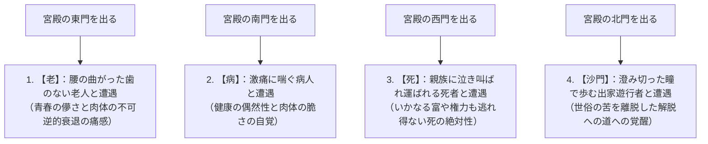

## 序論：覚者（ブッダ）の誕生と人類思想史の革命

紀元前5世紀から紀元前6世紀にかけて、古代インド・ガンジス川中流域において生起した思想的沸騰（いわゆる「枢軸時代」）の只中において、ゴータマ・シッダールタ（Gautama Siddhārtha, パーリ語: ゴータマ・シッダッタ）によって開かれた「仏教（Buddhism）」は、それ以前のヴェーダ・ウパニシャッド以来の古代インド宗教哲学を根底から転換する、人類精神史における最大の知的・実存的革命であった。

ブッダ（Buddha）とは固有の神の名ではなく、サンスクリット語およびパーリ語で「目覚めた者」「真理を覚知した者（覚者）」を意味する普通名詞である。シッダールタが確立した教えの核心は、宇宙を創造した絶対神への盲目的な信仰や、司祭階級（バラモン）による動物供犠と呪術的儀礼を徹底して排し、「人間が存在することそれ自体の構造的苦（ドゥッカ）」を冷静冷徹に直視し、その原因を因果論的に解体し、自らの観察と実践によって解脱（モークシャ / ニッバーナ）へと至る「理法的実践知（エピステーメー）」であった。

仏教は、近代的な意味における「宗教」という枠組みを遥かに超えている。それは、極めて精密な認知科学であり、心理療法であり、言語批判であり、存在論的現象学であった。本稿では、ゴータマ・シッダールタの生涯と思想的転回、四諦・八正道・十二縁起という教理の論理的・数理的構造、五蘊と無我（アナッタ）の存在論的解剖、パーリ仏典の文献学的精読、そして現代の認知神経科学や現象学、マインドフルネスとの深層における響き合いに至るまで、学術的厳密さと圧倒的スケールをもってその全貌を解き明かす。

```
【古代インド思想史における仏教のパラダイム・シフト】

┌─────────────────┬───────────────────────────────┬───────────────────────────────┐
│ 比較項目        │ 正統バラモン教・ウパニシャッド│ 初期仏教（ゴータマ・ブッダ）  │
├─────────────────┼───────────────────────────────┼───────────────────────────────┤
│ 究極的実在      │ ブラフマン（梵：宇宙の根本原理│ 法（ダルマ：縁起の法理・普遍則│
│ 自己（魂）の捉え│ アートマン（我：不滅・永遠の真│ 無我（アナッタ：実体我の完全否│
│ 解脱への道      │ 梵我一如の直観・祭祀儀礼・苦行│ 四諦八正道・中道・止観瞑想    │
│ 世界観          │ カースト制度（ヴァルナ）の肯定│ カースト差別の否定・万人平等  │
│ 認識の方法      │ ヴェーダ聖典の権威への帰依    │ 自内証（自ら観察し検証する理知│
└─────────────────┴───────────────────────────────┴───────────────────────────────┘
```

---

## 1. ゴータマ・シッダールタの生涯と思想的転回

### 1.1 シャカ族の王子としての誕生と四門出遊の衝撃
ゴータマ・シッダールタは、ヒマラヤ山脈の麓、現在のネパール南部ルンビニーにおいて、シャカ族の小都市国家カピラヴァストゥ（迦毘羅衛城）を統治していたスッドーダナ王（浄飯王）とマーヤー夫人（摩耶夫人）の長男として誕生した。

伝説によれば、シッダールタは生後まもなく東西南北に七歩歩み、「天上天下唯我独尊」と宣言したとされるが、歴史学的・文献学的な見地から見れば、彼は東インドの有力な部族連合（ガナ・サンガ制）の貴族（クシャトリヤ）階級の子弟として、何不自由のない極めて富裕で安楽な生活を享受していた。父王はシッダールタが出家して隠遁者となることを極度に恐れ、三つの季節（夏・雨季・冬）に応じた壮麗な三つの宮殿を用意し、美しい女性たちによる歌舞音曲で宮殿を満たし、老いや病、死といった人間の醜悪な現実を彼の視界から徹底的に隔離しようとした。

しかし、シッダールタの鋭敏極まりない知性と感受性は、この人工的な楽園の虚妄性を見抜いていた。それを象徴するのが、仏伝において名高い「四門出遊（しもんしゅつゆう）」の説話である。



四門出遊は、単なる寓話にとどまらず、**「実存的危機（Existential Crisis）」**の普遍的モデルを示している。人間はどれほど富裕で、権力があり、健康に恵まれていようとも、「老いること」「病むこと」「死ぬこと」という三つの絶対的制約から一秒たりとも逃れることはできない。シッダールタは、他者の老・病・死を眺めながら、「それらは遠い未来の他人の出来事ではなく、まさに今ここにある自分自身の不可避の宿命である」と覚知した。この痛切な絶望と実存的自覚こそが、彼を29歳での「偉大なる出家（出城）」へと駆り立てた原動力であった。

### 1.2 出家、師事、そして極限の苦行とその挫折
妻ヤソーダラーと生まれたばかりの息子ラーフラ、そして王位継承者としてのすべての栄華を捨て去り、シッダールタは剃髪して粗末な衣をまとい、真理を求める「沙門（シュラマナ / 自由思想の修行者）」となった。

彼はまず、当時高名であった二人の瞑想指導者に師事した。
1. **アーラーラ・カーラーマ**: 「無所有処定（むしょうしょじょう / 何ものも存在しないという高度な精神集中状態）」を指導。シッダールタは短期間でこの境地を体得したが、瞑想から覚めれば再び現実の苦悩が戻ってくることに気づき、これが究極の解脱ではないとして去った。
2. **ウッダカ・ラーマプッタ**: 「非想非非想処定（ひそうひひそうしょじょう / 想念があるともないとも言えない極限の瞑想状態）」を指導。これも同様に短期間で師と同等の境地に達したが、やはり根源的な苦の滅尽には至らないと判断した。

精神的瞑想の限界を悟ったシッダールタは、次に肉体の鍛錬によって欲望を根絶しようとする「極限の苦行（タパス）」へと身を投じた。マガダ国のウルヴェーラーの森において、五人の修行仲間（コンダンニャら五比丘）とともに、息を極限まで止める呼吸停止の苦行、極度の日光照射、そして一日に胡麻一粒・米一粒しか口にしない断食苦行を六年間にわたって続けた。

その結果、シッダールタの肉体は骨と皮ばかりに痩せ衰え、胸の骨は肋木のように浮き出、頭皮は干からびたヒョウタンのように縮み、立とうとすれば崩れ落ちる極限状態に達した。しかし、死の淵に立ってもなお、求めていた心の完全な静寂と真理の覚醒は訪れなかった。ここでシッダールタは、人類思想史における決定的な洞察に至る。

> **「肉体を痛めつける苦行は、ただ肉体を破壊し精神を疲弊させるだけであり、真の智慧と覚醒をもたらすことはない。快楽への溺没（快楽主義）が誤りであるのと同様に、自己を苛む苦行（苦行主義）もまた誤りである」**

シッダールタは苦行を完全に放棄することを決断した。彼はナイランジャナー川（尼連禅河）で六年間の垢と汚れを洗い流し、岸辺で力尽きて倒れていたところを、村の娘スジャータ（Sujātā）から施された新鮮な乳粥（パーヤサ）を口にした。滋養が全身に行き渡り、肉体の活力が奇跡的に回復した。この姿を見た五人の修行仲間は、「ゴータマは苦行に耐えかねて堕落した」と軽蔑し、彼を見捨てて去っていった。

```
【二辺（極端）の止揚と中道（マッジマ・パティパダー）の発見】

快楽への耽溺（世俗的享楽）  ←─────［中 道］─────→  肉体への加虐（極限の苦行）
（宮殿での王族生活）                （真の知恵と静寂）             （ウルヴェーラーの森）
※琴の弦は、強すぎれば切れてしまい、緩すぎれば音が出ない。適度な調律こそが妙音を奏でる。
```

### 1.3 菩提樹下の成道：マーラとの対決と「覚者（ブッダ）」の誕生
体力を回復したシッダールタは、ブッダガヤのアシュヴァッタ樹（後に「菩提樹」と呼ばれる）の根元に草を敷いて結跏趺坐し、揺るぎない誓いを立てた。
**「我が肉が枯れ、骨が砕け散ろうとも、真の覚りを獲得するまでは断じてこの座を立たない」**

仏伝によれば、このときシッダールタの内面に渦巻くあらゆる欲望、恐怖、疑念、執着が擬人化され、「魔王マーラ（Māra / パーピーヤン）」として彼を襲撃した。
マーラはまず、妖艶な三人の娘（愛欲、不満、渇愛）を送り込んでシッダールタを誘惑した。シッダールタが動じないと見るや、暴風、豪雨、火の玉、怪物の軍勢を差し向け、恐怖によって精神を崩壊させようとした。最後にマーラは、「お前のような者に何の資格があって覚りの座に就くのか」と叫び、シッダールタの正統性を疑った。シッダールタは静かに右手を下ろし、指先で大地に触れた（「触地印 / 降魔印」）。すると大地が轟然と鳴り響き、「私は幾多の前世における彼の無私の功徳を証明する」と証言した。マーラの軍勢は霧散し、心のあらゆる煩悩（キレーサ）が完全消滅した。

夜の初更（午後6〜10時）、シッダールタは自らの無数の前世の記憶を想起する「宿命通（しゅくみょうつう）」を獲得した。
夜の中更（午後10〜午前2時）、あらゆる生命が業（カルマ）に従って生死を繰り返す輪廻の法則を見通す「天眼通（てんげんつう）」を獲得した。
そして夜の後更（午前2〜6時）、明けの明星が東の空に輝く瞬間、万物が相互に依存して生起・消滅する「十二因縁（縁起の法）」を順逆両方から徹底的に観照し、あらゆる煩悩を根絶する「漏尽通（ろじんつう）」を体得した。

ここに、シッダールタは無上正等覚（アヌッタラ・サムヤック・サムボーディ / 完全な覚り）を成就し、人間を超克した**「ブッダ（釈迦牟尼世尊）」**となった。時に35歳であった。

### 1.4 梵天勧請と初転法輪：沈黙から世界宗教への跳躍
成道を遂げた直後、ブッダは深い思索に沈み、自らが覚知した法（ダルマ）を世の人々に語ることを躊躇した。「この法はあまりにも甚深であり、微細であり、論理を超えており、賢者のみが知るものである。激しい欲望と執着に覆われた世の人々にこれを説いても、徒らに混乱させ、疲労を招くだけではないか」。ブッダは説法することなく、このまま静かに涅槃に入ろうと考えた。

このとき、インド神話の最高神である梵天（ブラフマー）が天から降り立ち、ブッダの前に膝をついて合掌し、三度にわたって熱烈に懇請したと伝えられる。これが**「梵天勧請（ぼんてんかんじょう）」**である。
「世尊よ、どうか法をお説きください。世の中には、眼の塵が少なく、清らかな心を持つ者たちもおります。彼らは法を聞かなければ衰退しますが、法を聞けば必ず真理を悟るでしょう」。

ブッダは慈悲の眼をもって世界を観察した。泥沼の中に咲く蓮の花が、泥水の中に沈んでいるもの、水面すれすれにあるもの、そして泥水から抜け出て美しく開花しているものがあるように、人々の中にも智慧の素質において多様な差異があることを見抜いた。ブッダは沈黙を破る決断を下した。

> **「不死の門は開かれた。耳ある者たちよ、信を抱いて聞くがよい」**

ブッダは自らを見捨てて去った五人の修行仲間を探すため、数百キロの道を歩いてサールナート（鹿野苑）へと向かった。遠くから近づいてくるブッダの威厳に満ちた姿を見た五人は、当初「無視しよう」と取り決めていたにもかかわらず、その神々しい佇まいに圧倒され、思わず立ち上がって足を洗い、席を設けて出迎えた。

ブッダは彼らに対して、人類史における最初の説法――**「初転法輪（しょてんぽうりん / 法の車輪を回転させること）」**を行った。ここで説かれた教えこそが、「中道」であり、「四聖諦」であり、「八正道」であった。話を聞くうちに、最年長のコンダンニャが「生じる性質を持つものは、すべて滅びる性質を持つ」という真理を直観して覚りの眼（法眼）を開いた。ここに、仏（指導者）・法（教え）・僧（実践共同体＝サンガ）という「三宝」が地上に成立したのである。

---

## 2. 仏教教理の根幹：四聖諦（Cattāri Ariyasaccāni）の論理構造

ブッダの教えは、神秘的ドグマや教条的信仰ではなく、古代インドの医学体系（アーユルヴェーダ）における「診断・病因・健康状態・処方箋」の論理構造を精神の領域に完璧に適用した**「実存的臨床医学」**であった。その基本フレームワークが「四聖諦（ししょうたい / 四つの聖なる真理）」である。

```
【医学の治療モデルと四聖諦の構造的相同性】

┌─────────────────┬───────────────────────────────┬───────────────────────────────┐
│ 医学的診断モデル│ 仏教の四聖諦                  │ 内容と実存的意味              │
├─────────────────┼───────────────────────────────┼───────────────────────────────┤
│ 1. 病状の認識   │ 苦諦（ドゥッカ・サッチャ）    │ 人生の根本的現実は「苦」である│
│ 2. 病因の解明   │ 集諦（サムダヤ・サッチャ）    │ 苦の原因は「渇愛（タンハー）」│
│ 3. 治癒状態設定 │ 滅諦（ニローダ・サッチャ）    │ 渇愛の滅尽＝涅槃（ニッバーナ）│
│ 4. 治療法の処方 │ 道諦（マッガ・サッチャ）      │ 涅槃に至る実践法＝八正道      │
└─────────────────┴───────────────────────────────┴───────────────────────────────┘
```

### 2.1 苦諦（Dukkha-sacca）：実存の構造的「不満足性」
仏教が「一切皆苦（いっさいかいく / Sabbe saṅkhārā dukkhā）」と宣言するとき、ここでいう「苦（ドゥッカ / Dukkha）」とは、単なる肉体的な痛みや情緒的な悲哀・不幸を意味するのではない。
パーリ語の *dukkha* の語源は、車軸の穴（kha）が歪んで（du）うまく噛み合わず、車輪がガタガタと軋んで思い通りに回転しない状態を指す。すなわち、**「自分の思い通りにならないこと」「根本的な不満足性・不調和」**こそがドゥッカの本質である。

初期仏教は、人生における苦を以下の「四苦八苦」として精緻に体系化した。

1. **生苦（ジャーカーティ）**: 生まれること、生き続けることそれ自体の苦。
2. **老苦（ジャラー）**: 肉体と知力が衰えゆく苦。
3. **病苦（ビヤーディ）**: 肉体的疾病に苛まれる苦。
4. **死苦（マラナ）**: 存在の消滅と死の恐怖に直面する苦。
5. **愛別離苦（ピヤヴィッパヨーガ）**: 愛するもの、親しい者と別離しなければならない苦。
6. **怨憎会苦（アッピヤサンパヨーガ）**: 憎むもの、嫌悪するものと出会い共存しなければならない苦。
7. **求不得苦（ヤンピッカン ナ ラバティ）**: 求めるものを手に入れることができない苦。
8. **五取蘊苦（パンチュパーダーナッカンダ）**: 自己を構成する五つの要素（五蘊）に執着することから生じる全体的苦。

### 2.2 集諦（Samudaya-sacca）：苦の発生メカニズムと「渇愛」
苦痛が存在するならば、そこには必ずそれを生み出している「原因」が存在する。集諦（しゅうたい）は、苦の根源が**「渇愛（タンハー / Taṇhā）」**にあると看破する。
タンハーとは文字通り、砂漠で喉が渇ききった人間が水を求めて狂乱するように、対象を激しく欲し、執着し、手放すまいとする盲目的衝動である。

ブッダは渇愛を以下の三種に分類した。
- **欲愛（カーマ・タンハー）**: 感覚器官（視覚・聴覚・味覚等）の快楽に対する渇愛。
- **有愛（バヴァ・タンハー）**: 自己が存在し続けたい、永遠に生き続けたい、名誉や富を拡大したいという存在への渇愛（生への執着）。
- **無有愛（ヴィバヴァ・タンハー）**: 苦痛から逃れるために自己を消滅させたい、すべてを破壊したいという虚無・断滅への渇愛（死への逃避欲）。

渇愛の恐ろしさは、それが満たされても決して終わらない「中毒的構造」にある。喉の渇きを癒すために塩水を飲むようなものであり、飲めば飲むほど渇きは激しさを増し、人間を終わりのない苦悩の輪廻へと束縛する。

### 2.3 滅諦（Nirodha-sacca）：苦の完全なる消滅と「涅槃」
病因が除去されれば病が完治するように、苦の原因である渇愛が完全に消滅した境地が存在する。それが滅諦（めったい）であり、仏教の究極目標である**「涅槃（ニッバーナ / サンスクリット: ニルヴァーナ）」**である。

ニッバーナの語源は、「吹き消すこと（Nir + vā）」である。欲望（貪）、怒り（瞋）、無知（痴）という「三毒の炎」が完全に吹き消され、涼やかで静寂な安らぎに満ちた心の状態を意味する。涅槃とは、死後に至る天国のような場所ではなく、**「今ここにおいて、煩悩の束縛から完全に解放された自由の境地」**である。

### 2.4 道諦（Magga-sacca）：涅槃に至る具体的処方箋「八正道」
苦を滅し涅槃へと至るための具体的かつ実践的な道が道諦（どうたい）であり、それが「八正道（はっしょうどう / Ariyo aṭṭhaṅgiko maggo）」である。八正道は、以下の八つの実践項目から成り立ち、伝統的に「戒（道徳）・定（集中）・慧（智慧）」の「三学」へと包括される。

```
【八正道の構造と三学（戒・定・慧）の対応】

┌───────────────┬───────────────────────────────┬───────────────────────────────┐
│ 三学の分類    │ 八正道の項目                  │ 実践的定義と機能              │
├───────────────┼───────────────────────────────┼───────────────────────────────┤
│ 慧学（智慧）  │ 1. 正見（Sammā-diṭṭhi）       │ 四諦・縁起・因果応報を正しく観│
│               │ 2. 正思惟（Sammā-saṅkappa）   │ 貪りや悪意を離れ、清浄に思索す│
├───────────────┼───────────────────────────────┼───────────────────────────────┤
│ 戒学（倫理）  │ 3. 正語（Sammā-vācā）         │ 嘘、悪口、二枚舌、無駄話を離れ│
│               │ 4. 正業（Sammā-kammanta）     │ 殺生、盗み、不倫などの悪行を慎│
│               │ 5. 正命（Sammā-ājīva）        │ 武器・毒物・生命売買等を避けた│
├───────────────┼───────────────────────────────┼───────────────────────────────┤
│ 定学（瞑想）  │ 6. 正精進（Sammā-vāyāma）     │ 悪を断ち善を生み育てる不断の努│
│               │ 7. 正念（Sammā-sati）         │ 心身の現象を「今ここ」で客観観│
│               │ 8. 正定（Sammā-samādhi）      │ 心を一境に集中させ、禅定の静寂│
└───────────────┴───────────────────────────────┴───────────────────────────────┘
```

八正道は、一つずつ順番に行うものではなく、八つの車輪のスポークのように互いに支え合い、全体として機能するシステムである。正見によって世界を正しく認識し、戒（正語・正業・正命）によって行為を浄化し、定（正精進・正念・正定）によって心を研ぎ澄ますことで、正見はさらに深まり、最終的な解脱へと至るのである。

---

## 3. 存在論の深淵：十二因縁（縁起説）と五蘊盛苦

### 3.1 縁起説（Paṭicca-samuppāda）：ブッダの最高発見
ブッダの教えの中で最も哲学的深度が高く、仏教を他のあらゆる思想から峻別する根本命題が**「縁起（えんぎ / パーリ語: パティッチャ・サムッパーダ）」**である。
縁起とは、「縁（条件）によって生起すること（Dependent Origination / 相依性）」を意味する。

ブッダはパーリ経典の中で、縁起の理法を極めて簡潔かつ数学的な命題として定式化している。

> **「これがあるとき、それがある。これが生じるとき、それが生じる。**
> **これがないとき、それがない。これが滅するとき、それが滅する」**
> （『サンユッタ・ニカーヤ』）

世界に存在するあらゆる現象（物質、心、生命、社会）は、単独で自給自足的に存在する「絶対的実体」ではない。すべては無数の原因（因）と条件（縁）が複雑に絡み合う相互連関の網の目（インドラの網）の中で、仮に現象しているにすぎない。絶対的な創造主や、不変の神、永遠の第一原因など存在しない。条件が整えば生じ、条件が崩れれば消滅する――これが宇宙を貫く普遍的法則（法 / ダルマ）である。

### 3.2 十二因縁（十二支縁起）の連鎖構造
ブッダは成道の夜、人間がなぜ老いと死の苦痛に囚われ、輪廻を繰り返すのかという因果のメカニズムを十二の環（十二因縁）として解明した。

```mermaid
graph LR
    A["1. 無明<br/>（Avijjā）"] --> B["2. 行<br/>（Saṅkhāra）"]
    B --> C["3. 識<br/>（Viññāṇa）"]
    C --> D["4. 名色<br/>（Nāmarūpa）"]
    D --> E["5. 六処<br/>（Saḷāyatana）"]
    E --> F["6. 触<br/>（Phassa）"]
    F --> G["7. 受<br/>（Vedanā）"]
    G --> H["8. 愛<br/>（Taṇhā）"]
    H --> I["9. 取<br/>（Upādāna）"]
    I --> J["10. 有<br/>（Bhava）"]
    J --> K["11. 生<br/>（Jāti）"]
    K --> L["12. 老死<br/>（Jarāmaraṇa）"]
```



```
【十二因縁の各支と人間存在の心理学的展開】

1. 無明（アヴィッジャー）: 根本的な無知。四諦や縁起、無我の真理が見えていないこと。
2. 行（サンカーラ）: 無知に基づいて起こす意志活動、潜在的形成力、カルマ（業）の形成。
3. 識（ヴィンニャーナ）: 対象を認識する識別作用、意識、結生識（生命の連続性）。
4. 名色（ナーマルーパ）: 精神的機能（名）と物質的身体（色）の結合体＝胎児の形成。
5. 六処（サラーヤタナ）: 六つの感覚器官（眼・耳・鼻・舌・身・意＝心）。
6. 触（パッサ）: 感覚器官と対象世界と認識（識）の三者が接触すること。
7. 受（ヴェーダナー）: 接触によって生じる感受作用（快・不快・中性）。
8. 愛（タンハー）: 快を求め、不快を避けようとする激しい渇愛・衝動。
9. 取（ウパーダーナ）: 渇愛に基づいて対象を自己のものとして握りしめる執着。
10. 有（バヴァ）: 執着によって生み出される生存のあり方、業の集積。
11. 生（ジャーティ）: 新たな生存、生命として生まれること。
12. 老死（ジャラーマラナ）: 生まれたがゆえに不可避となる衰退、苦悶、悲嘆、そして死。
```

十二因縁の驚くべき点は、老死の苦しみの根本原因が**「無明（無知）」**にあると突き止めた点である。
そして、この因果連鎖は「逆回転」させることが可能である。
智慧によって無明が滅すれば、行が滅する。行が滅すれば、識が滅する……最終的に、執着が滅し、生が滅し、老死という巨大な苦の堆積が根底から消滅する（「還滅門」）。仏教において、苦からの解放は奇跡や恩寵によるのではなく、認識の根本的転換（知恵）による論理的必然なのである。

### 3.3 五蘊（Pañca-khandhā）：人間存在の脱構築
「私」とは一体何者なのか？
ブッダは、人間という存在を固定的な単一実体（魂）として捉えることを断固拒絶し、人間を五つの構成要素の集合体――**「五蘊（ごうん / パーリ語: パンチャ・ッカンダ）」**へと解体（デコンストラクション）した。

1. **色蘊（ルーパ / Rūpa）**: 物質的身体、肉体、感覚器官と外界の物理的対象。
2. **受蘊（ヴェーダナー / Vedanā）**: 対象と接触した際に生じる感覚的印象、感受作用（快・不快・どちらでもない）。
3. **想蘊（サンニャー / Saññā）**: 対象が何であるかを概念化し、名づけ、記憶と照合する表象・知覚作用。
4. **行蘊（サンカーラ / Saṅkhāra）**: 感情、意志、欲望、意図など、心を特定の方向へと動かす精神的形成力。
5. **識蘊（ヴィンニャーナ / Viññāṇa）**: これら全体を統合し、対象を識別・認知する純粋意識。

ブッダは弟子たちに問いかけた。「五蘊のそれぞれは、永遠であるか、無常であるか？」「無常であるならば、それは苦であるか、楽であるか？」「無常であり、苦であり、変滅する性質のものであるならば、『これは我がものであり、これこそが私であり、これこそが私の自己（アートマン）である』と見なすことは正しいであろうか？」。弟子たちは「いいえ、世尊よ、正しくありません」と答えた。

人間は、この五つの要素が高速で変化しながら相互作用しているダイナミックな「プロセス（流れ）」にすぎない。車が車輪、車軸、車体などの部品が集まって初めて「車」と呼ばれるように、「人間」や「自己」とは、五蘊の束に便宜的につけられた名前にすぎないのである。

---

## 4. 無我（Anattā）の哲学：実体我の解体と実存的自由

### 4.1 アナッタ（無我） vs ウパニシャッドのアートマン（我）
初期仏教思想の真骨頂であり、最も誤解されやすい概念が**「無我（アナッタ / Anattā / サンスクリット: アナートマン）」**である。

当時のインドの主流思想（ウパニシャッド哲学）は、「肉体や感情が移ろい去ろうとも、その深奥には絶対に滅びない永遠不滅の真の自己（アートマン / 我）が存在する」と主張した。そして、このアートマンが宇宙の根本原理（ブラフマン）と同一であること（梵我一如）を覚知することこそが解脱であると説いた。

これに対し、ブッダは「一切法無我（いっさいほうむが / Sabbe dhammā anattā）」を宣言し、アートマンの実在を徹底的に否定した。
ブッダの論理は極めて明快である。
もし何かが「私の自己（我がもの）」であるならば、それは私の意志によって完全にコントロールできなければならない。「私の肉体よ、病気になるな、老いるな」と命じてその通りになるだろうか。私の感情や思考を、一秒の狂いもなく思い通りに制御できるだろうか。できない。なぜなら、それらは条件（縁）によって勝手に生滅している現象にすぎないからである。思い通りにならないものを「私」と呼ぶことはできない。したがって、五蘊の中のどこを探しても、固定的な実体としての「我」は見つからない。

```
【アートマン実在論と仏教の無我論の認識論的対立】

■ ウパニシャッドの実体論（アートマン）
肉体・感情・思考の背後に、
永遠・不滅・純粋な「観察者としての魂（真我）」が鎮座している。
※「魂の救済」を求めるが、結果として「自己への執着」を強化する罠に陥る。

■ 初期仏教の現象論・プロセス論（アナッタ）
肉体・感情・思考が因果的に流れているだけであり、
背後に「観察者」など存在しない。「見る行為」があるだけで「見る者」はいない。
※「私」という固定観念そのものを解体することで、あらゆる執着の根を絶つ。
```

### 4.2 三法印と四法印：宇宙の普遍的真理
仏教の旗印（トレードマーク）として示されるのが「法印（ほういん / 真理の刻印）」である。これらは、あらゆる事物・現象の究極のあり方を示す。

1. **諸行無常（ショギョウムジョウ / Sabbe saṅkhārā aniccā）**:
   作られたすべてのもの（サンカーラ）は、一刻の猶予もなく移ろいゆく。固定した静止状態など宇宙のどこにも存在しない。
2. **諸法無我（ショホウムガ / Sabbe dhammā anattā）**:
   作られたもの（有為法）のみならず、あらゆる存在（無為法を含む一切の法）において、固定的な実体（我）は存在しない。
3. **涅槃寂静（ネハンジャクジョウ / Nibbānaṃ santaṃ）**:
   無常と無我を完全に覚知し、執着の炎が消え去った境地は、絶対の静寂と平和である。
4. **一切皆苦（イッサイカイク / Sabbe saṅkhārā dukkhā）**:
   無常であるものを永遠であると錯覚し、無我であるものに「私」として執着するがゆえに、すべての現象は「苦」となる（三法印に一切皆苦を加えて四法印とする）。

無我とは、決して「虚無主義（ニヒリズム）」ではない。ブッダは「人間は死んだらすべて無に帰す」という断見（断滅論）をも、「魂は永遠に不滅である」という常見（永遠論）と同様に誤った極端として厳しく退けた。無我とは、「固定的な実体にとらわれず、今ここにある生命のありのままの事実を直視し、あらゆる執着から自由になること」である。

---

## 5. 初期仏典の文献学的解読とサンガの形成

### 5.1 パーリ経典の成立史と結集（サンギーティ）
ブッダは自らの教えを一文字も書き残さなかった。古代インドにおいて、神聖な教えは文字ではなく、師から弟子への厳密な「口伝（暗誦）」によって継承される伝統があったためである。

ブッダが80歳でクシナガラにおいて入滅（マハーパーリニッバーナ / 完全な涅槃）した直後、マガダ国の王舎城（ラージギル）において、長老マハーカッサパ（摩訶迦葉）の主導のもと、500名の阿羅漢が集結した。これが**「第一結集（だいいちけつじゅう / サンスクリット: サンギーティ＝合誦）」**である。

```
【第一結集における二大伝承の確立】

1. 経蔵（スッタ・ピタカ / Sutta Piṭaka）の結集
   ・口述者: アーナンダ（阿難 / ブッダの従弟であり、25年間にわたり常随給仕した「多聞第一」）
   ・冒頭定型句: 「このように私は聞いた（エヴァン・メー・スタム / 如是我聞）」
   ・内容: ブッダが各地で人々の素質に応じて説いた対話・説法集。

2. 律蔵（ヴィナヤ・ピタカ / Vinaya Piṭaka）の結集
   ・口述者: ウパーリ（優波離 / 理髪師出身で戒律に精通した「持律第一」）
   ・内容: 出家修行者（ビック・ビックニー）が守るべき規則、教団運営の規約、罰則。
```

その後、教団の分裂（根本分裂）を経て、紀元前1世紀頃、スリランカ（セイロン島）においてタミル人の侵略や飢饉による僧侶の減少という危機に直面し、口伝の散逸を防ぐため、ヤシの葉（貝葉）にパーリ語で初めて文字として記録された。これが現在に伝わる**「パーリ三蔵（ティピタカ / 経蔵・律蔵・論蔵）」**である。

### 5.2 最古層の仏典：『スッタニパータ』と『ダンマパダ』の思想
現代の仏教文献学（中村元、エドウィン・アーノルド、リズ・デイヴィッズら）の研究により、パーリ経典の中でも特に古い言語形態（古アルカイック期）を残す最古層のテキストが特定されている。その代表が『スッタニパータ（経集）』の第4章「義足経」と第5章「彼岸道品」、そして『ダンマパダ（法句経）』である。

これらの最古層の仏典に見られるブッダの姿は、後の仏教に見られるような荘厳な仏像や、天界の無数の菩薩に囲まれた超自然的な神仏ではなく、質素な衣を身にまとい、托鉢の鉢を手に、荒野を孤独に歩むリアリストの哲人である。

> **「犀（さい）の角のようにただ独り歩め」**
> （『スッタニパータ』第1章第3節）
> 仲間と交われば愛着と執着が生じ、愛着に従えば苦痛が生じる。他者との不毛な論争や世俗の虚栄を離れ、清らかに自らを律して、犀の角のようにただ独りで歩め。

> **「怨みに報いるに怨みを以てすれば、怨みはついに息（や）むことなし。**
> **怨みを捨ててこそ怨みは息む。これは永遠の真理である」**
> （『ダンマパダ』第5詩）

最古層の経典において、ブッダは形而上学的な議論（「世界は有限か無限か」「霊魂と肉体は同一か別か」「死後にブッダは存在するか否か」）を「無益な議論（戯論）」として退けた。有名な「毒矢の例え」が示すように、毒矢に射られた人間がなすべきことは、「毒矢を放った者の身分や矢の材質」を議論することではなく、直ちに毒矢を抜いて毒を治療することである。ブッダの関心は徹頭徹尾、「現実に苦しんでいる人間をいかにして救うか」という実存的救済に絞られていた。

---


### 5.3 初期サンガの統治工学：波羅提木叉（パーティモッカ）と全員一致の自治民主主義

ブッダが創設した修行者の共同体「サンガ（Saṅgha）」は、単なる宗教的信者の集まりではなく、人類史において最も早期に成立した**「徹底的な直接民主制・協同組合的自治共同体」**であった。

カースト制度が厳格に支配し、専制的な専制君主制（マガダ国やコーサラ国）が台頭していた古代インド社会において、ブッダのサンガは驚くべき平等のオアシスを現出させた。サンガに足を踏み入れた瞬間、王族（クシャトリヤ）も、司祭（バラモン）も、商人（ヴァイシャ）も、そして最下層のシュードラや不可触民（チャンダーラ）も、あらゆる身分的特権と差別を剥奪され、ただ「得度（出家）した順番」のみによって敬意が払われる完全平等な共同体員となった。理髪師であった身分の低いウパーリが、釈迦族の高貴な王子たち（アヌルッダやアーナンダ）よりも先に得度したため、王子たちがウパーリの足元に跪いて礼拝したというエピソードは、サンガの革命的平等を鮮烈に示している。

```
【初期サンガの自治統治システムと合議制の法理】

1. 羯磨（カンマ / Kamma）：最高意思決定における全員一致制
   ・教団内の重大事（新人の得度、戒律違反の審理、財産の分配）は、集会において全員の合意によって決定される。
   ・動議が提出された後、議長が三度にわたって「異議はないか」と問いかけ、全員の沈黙（異議なし）をもって可決される（白四羯磨 / びゃくしこんま）。一人でも正当な理由で反対すれば決議は成立しない。

2. 布薩（ウポサタ / Uposatha）：半月ごとの自浄と倫理維持
   ・新月と満月の夜（半月ごと）に全員が集まり、227条（比丘の場合）の戒律（波羅提木叉 / パーティモッカ）が一条ずつ読み上げられる。
   ・自らの違反を公に告白（懺悔）し、心の清浄を回復する。隠蔽や虚偽は固く禁じられる。

3. 自恣（パヴァーラナー / Pavāraṇā）：安居（雨季の集中修行）明けの相互評価
   ・三ヶ月間の雨安居が終わる日、修行者同士が互いに「私に見聞きした過ちがあれば、慈悲の心をもって指摘してください」と求め合い、謙虚に批判を受け入れる。
```

さらに歴史的・社会学的に特筆すべきは、ブッダの養母マハープラジャーパティー（大愛道）らの熱烈な懇請を受け、ブッダが当時としては全世界で類を見ない**「比丘尼サンガ（女性の出家教団）」**の設立を認可したことである。古代世界において女性は父や夫、息子に従属する所有物と見なされていた時代に、女性に対しても男性と全く同一の解脱・阿羅漢の可能性を公式に認め、自律的な女性共同体の運営を認めたことは、宗教史・ジェンダー史における計り知れない先駆的跳躍であった。

## 6. 初期仏教からアビダルマ・大乗仏教への構造転換

### 6.1 アビダルマ（論蔵）仏教：存在の極微分析
ブッダの入滅後、数百年を経て教団は保守的な上座部（テーラワーダ）と進歩的な大衆部（マハーサンギカ）に分裂（根本分裂）し、さらに細かく二十の部派へと枝分かれした（部派仏教）。

この時代、各部派の学僧たちはブッダの教えを体系化・厳密化するため、膨大な注釈書・哲学大系を構築した。これが「アビダルマ（阿毘達磨 / 法に対する研究）」である。特に説一切有部（サルヴァースティヴァーダ）は、世界を構成する究極の構成要素（ダルマ / 極微）を徹底的に分類し、「五位七十五法」という驚異的に精緻な認知・存在論モデルを完成させた。

しかし、アビダルマ仏教は高度に専門化・学問化し、出家僧たちが瞑想室に閉じこもって微細な哲学論争に明け暮れる「象牙の塔」と化していった。一般民衆の苦悩から遊離したエリート主義的仏教に対し、強烈な批判と反動が巻き起こる。

### 6.2 大乗仏教（マハーヤーナ）の革命：自利利他と空（シューニャター）
紀元前後、在家の信徒や革新的な僧侶たちの間から、「自らの解脱（阿羅漢）のみを追求する狭い教え（小乗 / ヒナヤーナ）」を脱却し、すべての生きとし生けるものを救済する大きな乗り物――**「大乗（マハーヤーナ）」**を標榜する一大宗教運動が勃興した。

```
【部派仏教（初期仏教系）と大乗仏教のパラダイム対比】

┌─────────────────┬───────────────────────────────┬───────────────────────────────┐
│ 比較項目        │ 部派仏教（初期仏教の展開）    │ 大乗仏教（マハーヤーナ）      │
├─────────────────┼───────────────────────────────┼───────────────────────────────┤
│ 理想の人間像    │ 阿羅漢（アラハン / 自己の解脱 │ 菩薩（ボーディサッタ / 慈悲救 │
│ 実践の性格      │ 自利（出家修行による自内証）  │ 自利利他円満（他者の救済と一  │
│ 哲学的中核      │ 五位七十五法・ダルマの実在性  │ 空（シューニャター）・中観・唯│
│ 救済の範囲      │ 出家戒を守る一部の修行者      │ 一切衆生悉有仏性（万人成仏）  │
│ 代表的経典      │ 阿含経・パーリ三蔵            │ 般若経、法華経、華厳経、浄土経│
└─────────────────┴───────────────────────────────┴───────────────────────────────┘
```

大乗仏教の思想的基礎を築いた龍樹（ナーガールジュナ, 2–3世紀）は、初期仏教の「縁起」を徹底的に突き詰め、**「空（シューニャター / Śūnyatā）」**の哲学を確立した（『中論』）。
龍樹によれば、すべてのものは縁起（他との関係性）によって成り立っているがゆえに、それ自体の固定的な本質（自性 / スヴァバーヴァ）を持たない。自性がないこと、それこそが「空」である。空とは「何もない虚無」ではなく、「固定した実体がないからこそ、無限の可能性と関係性に向かって開かれている」というダイナミックな肯定の論理であった。

こうして初期仏教の「無我・縁起」は、大乗仏教の「空」「慈悲」「唯識」「如来蔵」へと壮大に発展し、中央アジア、中国、朝鮮半島、そして日本へと伝播していくこととなる。

---

## 7. 現代思想・認知科学・マインドフルネスとの深層的対話

### 7.1 認知行動療法（CBT）と仏教の構造的相同性
現代の精神医療におけるゴールドスタンダードである「認知行動療法（CBT）」、特にアーロン・ベックの認知療法やアルバート・エリスのREBTは、仏教の四聖諦と驚くべき構造的相同性を持っている。

認知療法は、「出来事それ自体が人間を苦しめるのではなく、出来事に対する『認知（自動思考・スキーマ）』が苦しみを生み出す」と説く。これは、ブッダが『箭経（矢の経）』において説いた**「第二の矢」**の教えそのものである。

> 人生において、肉体的な痛みや不運という「第一の矢」が飛んでくることは避けられない。
> しかし、無知な凡夫は、「なぜ私がこんな目に遭うのか」「もう終わりだ」と怒り、嘆き、悲嘆に暮れる。これによって自ら「第二の矢」を心に突き刺し、苦しみを何倍にも増幅させてしまう。
> 智慧ある修行者は、第一の矢が刺さっても、第二の矢を自ら刺すことはない。

仏教のヴィパッサナー瞑想（正念 / サティ）は、第一の矢（純粋な感覚的入力）と第二の矢（そこから生じる自動思考・感情・妄想）を峻別し、第二の矢の連鎖を断ち切る認知工学である。

### 7.2 マインドフルネス（MBSR）の誕生と脳神経科学
1979年、マサチューセッツ大学医学部教授のジョン・カバット・ジン（Jon Kabat-Zinn）は、初期仏教の「サティ（Sati / 念）」の瞑想技法から宗教的・文化的文脈を削ぎ落とし、科学的・医学的介入プログラムとして**「マインドフルネスストレス低減法（MBSR）」**を開発した。

マインドフルネスとは、**「今この瞬間の体験に、判断を加えることなく（ノン・ジャッジメンタルに）、意図的に注意を向けること」**である。

```
【現代マインドフルネス瞑想と脳神経回路の変容】

［デフォルト・モード・ネットワーク（DMN）の過剰活動］
・内側前頭前野、後帯状皮質が活性化
・過去の後悔、未来の不安、自己への執着（反芻思考）がループ
・脳のエネルギーの60〜80%を浪費し、うつ病や不安障害の温床に
  ↓
［マインドフルネス瞑想の実践（サティ・呼吸への注意集中）］
・注意制御ネットワーク（背外側前頭前野、島皮質）が活性化
・DMNの活動が有意に抑制（脳の過熱停止）
  ↓
［脳の構造的変化（ニューロプラスティシティ / 神経可塑性）］
・扁桃体（恐怖・ストレスの中枢）の体積縮小・反応性低下
・海馬（記憶・情動調整）および前頭前野皮質の灰白質密度増加
・感情調整能力、集中力、主観的幸福感の劇的向上
```

現代のfMRIを用いた脳機能画像研究は、2500年前にブッダが菩提樹下で体得した「観察瞑想（ヴィパッサナー）」が、脳の自己言及的ネットワーク（DMN）を鎮静化させ、恐怖中枢である扁桃体を沈静化させ、情動調整機能を物理的に再配線することを科学的に証明しつつある。

### 7.3 現象学・エナクティヴィズムとの共鳴：ヴァレラとデリダ
哲学の領域においても、仏教の縁起と無我論は、20世紀後半の最先端思想と激しく共鳴している。

生物学者フランシスコ・ヴァレラ（Francisco Varela）らは、『身体化された心（*The Embodied Mind*, 1991）』において、認知科学、現象学（メルロ＝ポンティ）、そして仏教の「中道・五蘊論」を統合した。認知とは、客観的な外界を脳が鏡のように受動的に表象することではなく、身体を持った生命体が環境との相互作用を通じて世界を共創していく「エナクション（生成 / Enaction）」のプロセスであると主張した。これは、色（身体・環境）と識（意識）が相互に依存して生起するという初期仏教の「名色と識の相依関係」の直接的復権であった。

また、ジャック・デリダ（Jacques Derrida）の脱構築（Deconstruction）が西洋形而上学の「現前の形而上学（固定的実体への信仰）」を解体した作業は、ブッダがアートマンという幻想を五蘊の縁起へと解体した無我の論理と驚くべき親和性を持っている。仏教は、近代西洋が何百年もかけて到達したポスト構造主義や反実体論の極限の地平を、紀元前5世紀においてすでに完全に踏破していたのである。

---

## 8. 結論：ダルマ（法）の普遍性と現代を生きる智慧

ゴータマ・シッダールタが人類に残した最大の遺産は、崇拝すべき偶像や、畏怖すべき戒律ではなく、**「自らを灯火とし、法を灯火として生きよ」**という自律のメッセージであった。

死を目前にしたブッダは、悲嘆に暮れる最愛の弟子アーナンダに対して、仏教史上最も峻厳で美しい言葉を遺した（『大般涅槃経』）。

> **「アーナンダよ、それゆえに、汝らは自らを島（灯火）とし、自らを拠り所として、他人を拠り所とするな。**
> **法（真理）を島（灯火）とし、法を拠り所として、他のものを拠り所とするな」**
> （*Attadīpā viharatha attasaraṇā anaññasaraṇā, dhammadīpā dhammasaraṇā anaññasaraṇā*）

ブッダは、自らを神格化することを最後まで拒絶した。彼自身もまた、生老病死の苦悩に震え、悩み、葛藤したひとりの人間であった。彼が示した道は、誰かに救ってもらう他力本願の道ではなく、人間が自らの理性と観察によって、心の無知と執着を照らし出し、自らの足で自由の境地へと歩み出す道であった。

情報爆発、終わりのない経済競争、SNSによる承認欲求の無限地獄、そして分断と戦争の危機に直面する21世紀の現代社会において、人間はかつてないほどの激しい「渇愛（タンハー）」と「実存的不安（ドゥッカ）」に晒されている。
今こそ、私たちはあのブッダガヤの静寂なる夜に立ち返る必要がある。
外界の喧騒を静かに離れ、自らの呼吸を見つめ、移ろいゆく感情と身体をありのままに観照し、あらゆる比較と執着を手放すこと。その静寂のただ中に、何ものにも脅かされない「真の自由と平和（涅槃）」が開かれているのである。
