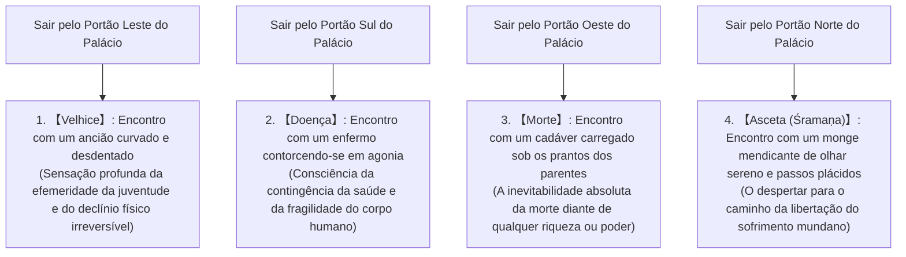

## Introdução: O Nascimento do Desperto (Buda) e a Revolução na História do Pensamento Humano

Entre os séculos VI e V a.C., em meio à efervescência intelectual e espiritual que eclodia na bacia média do rio Ganges, na Índia antiga — no coração da chamada "Era Axial" (termo cunhado por Karl Jaspers) —, o Budismo fundado por Gautama Siddhartha (em páli: Siddhattha Gotama) constituiu a mais profunda e radical revolução intelectual e existencial de toda a história espiritual humana, subvertendo desde as raízes as premissas da filosofia e religião védico-upanixádica que o precederam.

A designação "Buda" (Buddha) não é o nome próprio de uma divindade particular, mas um substantivo comum de origem sânscrita e páli que significa literalmente "Aquele que Despertou" ou "Aquele que compreendeu plenamente a Verdade suprema" (o Desperto, ou o Iluminado). O cerne dos ensinamentos estabelecidos por Siddhartha rejeitou de forma categórica a fé cega em deuses criadores onipotentes, bem como os rituais sacrificiais e práticas mágicas monopolizadas pela casta sacerdotal dos brâmanes. Em vez disso, encarou com serenidade inflexível e lucidez implacável o sofrimento estrutural constitutivo da própria condição humana (*dukkha*), desconstruiu suas causas por meio de uma cadeia de causalidade estrita e inaugurou uma "sabedoria prática e racional (episteme)" voltada à emancipação definitiva (*mokṣa* / *nibbāna*) mediante a auto-observação diligente e o cultivo meditativo.

O Budismo transcende em larga escala a definição ocidental moderna de "religião". Apresenta-se simultaneamente como uma ciência cognitiva extraordinariamente precisa, uma psicoterapia avançada, uma crítica implacável da linguagem conceitual e uma fenomenologia ontológica rigorosa. Este ensaio tem por objetivo desvelar em sua totalidade — com rigor acadêmico incomparável e fôlego enciclopédico — a vida e as viradas conceituais de Gautama Siddhartha, a arquitetura lógica e quase matemática das Quatro Nobres Verdades, do Nobre Caminho Óctuplo e dos Doze Elos da Originação Dependente, a anatomia ontológica dos Cinco Agregados e do Não-Eu (*Anattā*), a análise filológica minuciosa dos textos primitivos em língua páli, e as ressonâncias profundas que essas descobertas mantêm com a fenomenologia contemporânea, a neurobiologia cognitiva e a prática do mindfulness moderno.

```
【A Mudança de Paradigma do Budismo na História do Pensamento Indiano Antigo】

┌─────────────────┬───────────────────────────────┬───────────────────────────────┐
│ Item de         │ Bramanismo Ortodoxo e         │ Budismo Primitivo             │
│ Comparação      │ Filosofia dos Upanixades      │ (Gautama Buda)                │
├─────────────────┼───────────────────────────────┼───────────────────────────────┤
│ Realidade       │ Brahman (Princípio cósmico    │ Dharma (Lei universal da      │
│ Suprema         │ supremo, eterno e absoluto)   │ originação dependente e ordem)│
├─────────────────┼───────────────────────────────┼───────────────────────────────┤
│ Concepção do    │ Ātman (Eu eterno, imutável,   │ Anattā (Não-Eu: negação       │
│ Eu (Alma)       │ essência espiritual imortal)  │ radical do eu substancial)    │
├─────────────────┼───────────────────────────────┼───────────────────────────────┤
│ Caminho para a  │ Intuição da unidade Brahman-  │ Quatro Nobres Verdades, Nobre │
│ Liberação       │ Ātman, sacrifícios e ascese   │ Caminho Óctuplo, Meditação    │
├─────────────────┼───────────────────────────────┼───────────────────────────────┤
│ Visão de        │ Validação sacralizada do      │ Rejeição de castas, igualdade │
│ Sociedade       │ sistema de castas (Varṇa)     │ espiritual e ética universal  │
├─────────────────┼───────────────────────────────┼───────────────────────────────┤
│ Método          │ Fé e submissão à autoridade   │ Experiência direta e razão    │
│ Epistemológico  │ revelada das escrituras védicas│ investigativa (Ehipassiko)    │
└─────────────────┴───────────────────────────────┴───────────────────────────────┘
```

---

## 1. A Vida e as Viradas Filosóficas de Gautama Siddhartha

### 1.1 O Nascimento como Príncipe dos Shakya e o Impacto Existencial dos Quatro Encontros
Gautama Siddhartha nasceu aos pés da cordilheira do Himalaia, em Lumbini (região situada no atual sul do Nepal), como primogênito do rei Śuddhodana e da rainha Māyā, soberanos do clã dos Shakya estabelecido na cidade-estado de Kapilavastu.

Conforme relata a hagiografia budista tradicional, logo após o seu nascimento Siddhartha deu sete passos em direção aos quatro pontos cardeais e proclamou solenemente: "Acima dos céus e abaixo da terra, eu sou o único venerável" (declaração da dignidade inata insubstituível de cada ser senciente). Todavia, sob uma perspectiva histórico-crítica e filológica, ele era o herdeiro aristocrático (Kshatriya) de uma confederação tribal oligárquica no leste da Índia (o sistema republicano tribal Gana-Sangha), desfrutando de uma juventude cercada por luxo absoluto, opulência material e prazeres contínuos. Temendo obsessivamente que o príncipe renunciasse ao trono para se tornar um eremita errante, seu pai mandou construir três palácios suntuosos para as três estações do ano (o verão, o período das monções e o inverno), guarnecendo-os com música, danças, concubinas encantadoras e banquetes perpétuos, com o intuito expresso de ocultar rigorosamente dos olhos do jovem príncipe as realidades sórdidas e pungentes da decadência física, da enfermidade e da morte humana.

Contudo, a inteligência afiada e a sensibilidade extraordinária de Siddhartha perceberam sem demora a vacuidade intrínseca desse paraíso artificial. Esse despertar encontra sua expressão clássica no célebre episódio hagiográfico conhecido como os "Quatro Encontros" ou as "Quatro Saídas dos Portões" (*Catu-nimitta* / 四門出遊).



O episódio dos Quatro Encontros não é uma mera fábula alegórica; constitui um arquétipo universal de **"Crise Existencial" (Existential Crisis)**. Por mais abastado, poderoso e saudável que um indivíduo possa ser, nenhum ser humano é capaz de escapar, sequer por uma fração de segundo, das três contingências inescapáveis que limitam a existência: o envelhecer, o adoecer e o morrer. Ao contemplar o idoso decrépito, o doente agonizante e o cadáver em decomposição, Siddhartha não enxergou acontecimentos alheios pertencentes a um futuro abstrato e remoto: compreendeu instantaneamente que aquele era o seu próprio destino biológico e ontológico irrefutável no aqui e agora. Esse desespero visceral e essa consciência existencial inapelável foram o combustível que o impeliu, aos 29 anos de idade, à "Grande Renúncia" (*Mahāparinikkhamana* / a fuga corajosa do palácio em busca da verdade).

### 1.2 A Renúncia, o Discipulado com Grandes Mestres e a Crise da Ascese Extrema
Deixando para trás sua esposa Yaśodharā, seu filho recém-nascido Rāhula e todas as honrarias da sucessão imperial, Siddhartha raspou a cabeça, despiu suas vestes principescas, cobriu-se com mantos toscos e ingressou na ordem dos "Śramaṇas" (buscadores errantes, monges mendicantes e pensadores livres que contestavam a ortodoxia sacerdotal védica).

Inicialmente, procurou e estudou sob a orientação de dois dos mais renomados mestres de meditação da época:
1. **Āḷāra Kālāma**: Mestre que ensinava a atingir a "Esfera do Nada" (Ākiñcaññāyatana / 無所有処定), um estado de concentração mental purificada onde toda percepção material se esvazia. Siddhartha assimilou e dominou essa técnica em pouquíssimo tempo, mas logo percebeu que, ao cessar a meditação e retornar à vigília cotidiana, os conflitos e angústias existenciais ressurgiam intactos. Concluiu que aquilo não correspondia à emancipação final e despediu-se do mestre.
2. **Uddaka Rāmaputta**: Guia espiritual que ensinava a realização da "Esfera da Nem-Percepção-Nem-Não-Percepção" (Nevasaññānāsaññāyatana / 非想非非想処定), a mais sutil e rarefeita fronteira da mente onde mal se pode afirmar a presença ou a ausência de ideação consciente. Siddhartha alcançou este cume no mesmo nível de seu preceptor, contudo compreendeu que mesmo este ápice sutil da absorção meditativa falhava em extirpar a raiz da ignorância e do sofrimento ontológico.

Reconhecendo os limites do mero recolhimento mental contemplativo, Siddhartha decidiu voltar-se para a dominação radical do corpo biológico a fim de extirpar a pulsão dos desejos: entregou-se à "ascese extrema" (*Tapas*). Nas florestas sombrias de Uruvelā, no reino de Magadha, acompanhado por cinco companheiros de prática (liderados pelo ancião Koṇḍañña), submeteu seu organismo a práticas severas de asfixia voluntária com retenção prolongada do ar, exposição ao sol inclemente e um jejum terrível, reduzindo seu alimento diário a um único grão de gergelim ou a uma única baga de arroz ao longo de seis anos exaustivos.

O resultado foi devastador: seu corpo tornou-se um esqueleto ambulante recoberto de pele ressequida, suas costelas projetavam-se como o vigamento exposto de uma choça derruída, seu couro cabeludo definhava e enrugava-se como uma abóbora dessecada ao sol escaldante, e ao tentar erguer-se do solo seus joelhos colapsavam irremediavelmente. No entanto, mesmo postado à beira da morte física, a serenidade absoluta e a iluminação da sabedoria suprema continuavam inalcançáveis. Foi nesse limiar agônico que Siddhartha alcançou uma das mais monumentais intuições da história do pensamento:

> **"Mortificar e torturar a carne serve apenas para arruinar a vitalidade biológica e embotar a mente lúcida; jamais gerará a sabedoria autêntica e o despertar luminoso. Assim como a entrega cega aos prazeres sensoriais (hedonismo) é um equívoco pernicioso, a auto-afligição corporal violenta (ascetismo severo) é igualmente estéril e ilusória."**

Siddhartha tomou a decisão corajosa de romper definitivamente com as penitências ascéticas. Dirigiu-se ao rio Nairañjanā, lavou as crostas de imundície acumuladas durante seis anos de negligência física e, desfalecido de exaustão na margem, aceitou a tigela de mingau de arroz cozido em leite fresco (*pāyāsa*) oferecida com devoção pela jovem pastora Sujātā. A nutrição benfazeja percorreu suas veias e seu vigor corporal restabeleceu-se milagrosamente. Ao presenciarem a cena, seus cinco companheiros sentiram um desprezo profundo, murmurando: "Gautama fraquejou, abandonou o esforço virtuoso e decaiu na volúpia dos sentidos", e o abandonaram com rancor.

```
【A Superação dos Dois Extremos e a Descoberta do Caminho do Meio (Majjhimā Paṭipadā)】

Fascínio pelos Prazeres Sensoriais  ←─────［CAMINHO DO MEIO］─────→  Mortificação Corporal Extrema
(Vida palaciana como príncipe)          (Verdadeira Sabedoria e Paz)        (Ascese na floresta de Uruvelā)

* Símile das cordas da cítara: se estiverem muito tensas, quebram-se; se estiverem muito frouxas,
  não emitem som. Apenas a afinação harmoniosa e equilibrada produz a música perfeita.
```

### 1.3 A Iluminação sob a Árvore Bodhi: O Confronto com Māra e o Surgimento do Desperto (Buda)
Com as forças físicas e a lucidez plenamente revigoradas, Siddhartha caminhou até Bodh Gaya e acomodou-se sobre um feixe de relva fresca aos pés de uma frondosa árvore Assattha (*Ficus religiosa*, que a partir de então passaria a ser venerada como a Árvore Bodhi). Sentando-se na postura clássica de lótus completo (*padmāsana*), pronunciou seu juramento inabalável:
**"Ainda que minha carne resseque, meus tendões apodreçam e meus ossos se desfaçam em pó, jamais me levantarei deste assento sagrado antes de alcançar o Despertar Supremo e Insuperável!"**

Conforme a tradição budista, nesse instante crucial, todas as pulsões inconscientes reprimidas, os temores atávicos, os desejos sensuais, a arrogância e o apego identitário personificaram-se na figura mítica do Soberano da Ilusão, o demônio Māra (o Maligno / O Senhor da Morte e do Renascimento), que investiu contra Siddhartha com todas as suas armas.

Primeiramente, Māra enviou suas três filhas sedutoras (símbolos da Cobiça e Desejo Sensual [Taṇhā], da Inquietação e Repulsa [Arati], e da Paixão Cega [Rāga]) para seduzi-lo por meio de artes voluptuosas. Diante da indiferença límpida de Siddhartha, Māra lançou sobre ele furacões devastadores, tempestades torrenciais, projéteis chamejantes e uma horda monstruosa de espectros terrificantes a fim de esmagá-lo pelo pânico. Por fim, diante do fracasso de suas hostes, Māra bradou furioso: "Com que direito e sob que autoridade pretendes reivindicar o trono inabalável da sabedoria cósmica?". Em resposta, em vez de recorrer a palavras ou justificativas discursivas, Siddhartha estendeu silenciosamente sua mão direita em direção ao chão e tocou a terra com as pontas dos dedos — o gesto imortal conhecido como o "Mudra da Vitória sobre Māra" ou "Testemunho da Terra" (*Bhūmisparśa Mudrā*). Nesse momento, as entranhas da Terra estremeceram com um estrondo monumental e a deusa primordial da terra ecoou com solenidade: "Eu sou a testemunha viva de suas incontáveis vidas de perfeição moral e sacrifício abnegado". Derrotadas pela verdade, as tropas fantasmagóricas de Māra dissiparam-se como fumaça ao vento, e as contaminações e impurezas mentais (*kilesas*) extinguiram-se sem deixar rastro.

Ao cair da noite, na primeira vigília (das 18h às 22h), Siddhartha obteve o "Conhecimento da Memória de Vidas Passadas" (Pubbenivāsānussatiñāṇa / 宿命通), descortinando a vasta cadeia retrospectiva de seus renascimentos anteriores através das eras cósmicas.

Na segunda vigília da noite (das 22h às 02h), despertou para o "Olho Divino" (Dibbacakkhu / Cutūpapātañāṇa / 天眼通), contemplando com visão imaculada as leis universais que regem a morte e o renascimento de todas as miríades de seres no ciclo do Saṃsāra, submetidos inelutavelmente à qualidade volitiva de seus próprios atos (*Kamma*).

Por fim, na terceira vigília da madrugada (das 02h às 06h), quando a estrela matutina despontou radiante no horizonte oriental, contemplou em ambos os sentidos — direto e reverso — a causalidade universal que governa a emergência e o colapso de todos os fenômenos da existência: os Doze Elos da Originação Dependente (*Paṭicca-samuppāda*). Conquistou assim o "Conhecimento da Destruição Definitiva de Todas as Máculas Mentais" (Āsavakkhayañāṇa / 漏尽通).

Naquele instante glorioso, aos 35 anos de idade, Gautama Siddhartha consumou a Suprema e Perfeita Iluminação (*Anuttara-sammā-sambodhi*), transcendendo as limitações ordinárias da humanidade para converter-se no **Buda Śākyamuni** — o Desperto, o Mestre dos Deuses e dos Homens.

### 1.4 A Súplica de Brahmā e a Primeira Roda do Dharma: Do Silêncio ao Despertar de uma Mensagem Universal
Imediatamente após a consumação de seu despertar supremo, o Buda mergulhou em profunda quietude contemplativa e hesitou seriamente em divulgar ao mundo o Dharma (a Verdade e Lei dos fenômenos) que acabara de desvelar. Pensou consigo mesmo: "Esta Lei cósmica que compreendi é extraordinariamente profunda, serena, sutil, inacessível ao mero pensamento conceitual ordinário, compreensível apenas pelos verdadeiramente sábios. Os seres humanos mundanos estão atolados nas paixões cegas, na cobiça e no apego possessivo. Se eu lhes proclamar esta verdade, encontrarão apenas perplexidade, fadiga e frustração". Assim, inclinou sua mente a permanecer no silêncio contemplativo e adentrar serenamente o Parinirvana final sem enunciar palavras.

De acordo com o relato canônico, o deus supremo do panteão védico, Brahmā Sahampati, ao perceber a vacilação do Iluminado, desceu imediatamente dos céus cósmicos, ajoelhou-se respeitosamente diante do Buda com as palmas unidas em oração e suplicou-lhe três vezes consecutivas. Este momento sublime é conhecido nas escrituras como a **"Súplica de Brahmā" (Brahmā-yācana / 梵天勧請)**:
"Ó Senhor Bem-Aventurado, eu vos rogo, proclamai a Lei! Existem no mundo seres cuja visão está coberta por apenas uma fina camada de poeira; se não ouvirem a doutrina sagrada, perecerão irremediavelmente; contudo, se a escutarem, despertarão para a libertação final!"

Movido por uma compaixão cósmica incondicional, o Buda contemplou o mundo dos seres vivos com o Olho de um Iluminado. Assim como em uma lagoa de águas lodosas existem botões de lótus que jazem inteiramente submersos na lama, outros que crescem rente à flor d'água e alguns que emergem imaculados acima da superfície lodosa para desabrochar ao sol sem se conspurcarem, percebeu que a humanidade possuía graus muito distintos de lucidez e capacidade espiritual. O Buda tomou a magna decisão de romper seu silêncio e proclamou solenemente:

> **"Abertas estão as portas da imortalidade! Que aqueles que possuem ouvidos para escutar abandonem suas dúvidas e depositem sua confiança!"**

O Buda empreendeu uma longa caminhada a pé de centenas de quilômetros até Isipatana (atual Sārnāth, o Parque das Gazelas, nos arredores de Varanasi), onde se encontravam os cinco ascetas que o haviam renegado. Ao avistarem à distância a silhueta majestosa do Mestre que se aproximava, os cinco combinaram entre si ignorá-lo friamente: "Vem ali o renunciante Gautama, aquele que caiu na frouxidão e abandonou o rigor da ascese. Não nos levantemos nem o reverenciemos". Todavia, à medida que o Buda se aproximava, sua presença irradiava uma dignidade, paz e majestade tão avassaladoras que eles quebraram involuntariamente seu juramento: precipitaram-se ao seu encontro, lavaram seus pés, tomaram sua túnica e prepararam com reverência um assento de honra.

Naquela tarde histórica, o Buda proferiu aos cinco companheiros o primeiro sermão de sua dispensação — o **"Primeiro Giro da Roda do Dharma" (Dhammacakkappavattana Sutta / 初転法輪)**. Foi ali que enunciou pela primeira vez a doutrina sublime do Caminho do Meio, as Quatro Nobres Verdades e o Nobre Caminho Óctuplo. À medida que escutava a exposição impecável da verdade, o mais ancião dos ouvintes, Koṇḍañña, obteve a visão límpida e incorruptível da realidade (o Olho do Dharma / Dhammacakkhu), sintetizada no axioma supremo: *"Tudo aquilo que possui a natureza de surgir possui inelutavelmente a natureza de cessar"*. Naquele exato instante, o Triratna — as Três Joias eternas: o Buda (o Mestre Iluminado), o Dharma (a Verdade e o Caminho) e a Sangha (a comunidade dos nobres praticantes) — foi plenamente inaugurado na Terra.

---

## 2. O Fundamento da Doutrina Budista: A Estrutura Lógica das Quatro Nobres Verdades (Cattāri Ariyasaccāni)

O ensinamento do Buda afasta-se peremptoriamente de qualquer dogma teológico imposto ou mandamento de fé cega. Pelo contrário, adota com rigor assombroso o modelo metodológico da medicina tradicional indiana (Āyurveda), articulado em quatro etapas precisas: o diagnóstico da moléstia, a etiologia causal da infecção, o prognóstico do restabelecimento da saúde plena e a prescrição terapêutica do tratamento curativo. Trata-se, em essência, de uma **"medicina clínica existencial"** transposta para o domínio da consciência humana. Essa arquitetura metodológica constitui as Quatro Nobres Verdades (*Cattāri Ariyasaccāni*).

```
【Homologia Estrutural entre o Modelo Clínico Médico e as Quatro Nobres Verdades】

┌─────────────────┬───────────────────────────────┬───────────────────────────────┐
│ Modelo Clínico  │ Quatro Nobres Verdades        │ Conteúdo e Significado        │
│ Diagnóstico     │ (Cattāri Ariyasaccāni)        │ Existencial                   │
├─────────────────┼───────────────────────────────┼───────────────────────────────┤
│ 1. Sintoma      │ Dukkha-sacca                  │ A realidade existencial       │
│ (Diagnóstico)   │ (Verdade do Sofrimento)       │ fundamental é "insatisfatória"│
├─────────────────┼───────────────────────────────┼───────────────────────────────┤
│ 2. Etiologia    │ Samudaya-sacca                │ A origem do sofrimento reside │
│ (Causa)         │ (Verdade da Origem)           │ na "sede insaciável" (Taṇhā)  │
├─────────────────┼───────────────────────────────┼───────────────────────────────┤
│ 3. Prognóstico  │ Nirodha-sacca                 │ A erradicação de Taṇhā é o    │
│ (Cura)          │ (Verdade da Cessação)         │ Nirvana supremo (Nibbāna)     │
├─────────────────┼───────────────────────────────┼───────────────────────────────┤
│ 4. Terapêutica  │ Magga-sacca                   │ A prescrição prática para a   │
│ (Tratamento)    │ (Verdade do Caminho)          │ cura é o Nobre Caminho Óctuplo│
└─────────────────┴───────────────────────────────┴───────────────────────────────┘
```

### 2.1 Dukkha-sacca: A 'Insatisfatoriedade' Estrutural da Condição Existencial
Quando o Budismo declara a premissa universal "Tudo o que é condicionado é sofrimento" (*Sabbe saṅkhārā dukkhā*), a categoria **Dukkha** (苦) não deve ser reduzida à mera dor física, à tristeza psicológica ou aos infortúnios pontuais da biografia humana.

A etimologia da palavra páli *dukkha* é de clareza reveladora: é composta pelo prefixo *du* (mau, difícil, defeituoso, disfuncional) e pelo substantivo *kha* (o orifício central no cubo da roda por onde atravessa o eixo da carruagem). Refere-se, portanto, a uma roda cujo encaixe encontra-se torto, desalinhado ou gasto, fazendo com que a carruagem avance aos solavancos, rangendo asperamente sem jamais rodar com estabilidade e maciez. Em outros termos, a essência de *dukkha* designa a **"impossibilidade intrínseca de submeter os fenômenos à nossa vontade arbitrária"**, a **"instabilidade ontológica crônica"** e a **"radical insatisfatoriedade e discórdia estrutural"** que perpassam toda a existência condicionada.

O Budismo Primitivo organizou analiticamente essa condição em um sistema de "Quatro Sofrimentos Primários e Quatro Sofrimentos Secundários" (totalizando os célebres "Oito Sofrimentos" / Hachiku):

1. **Sofrimento do Nascimento (Jāti-dukkha)**: O trauma da emergência no mundo e as agruras do próprio existir biológico continuado.
2. **Sofrimento do Envelhecimento (Jarā-dukkha)**: O declínio inexorável dos sentidos, a perda da robustez muscular e a decadência cognitiva.
3. **Sofrimento da Doença (Byādhi-dukkha)**: A invasão das aflições orgânicas e a agonia das dores patológicas.
4. **Sofrimento da Morte (Maraṇa-dukkha)**: O colapso total da vitalidade psicofísica e o terror primordial da extinção identitária.
5. **Sofrimento da Separação do Amado (Piyavippayoga-dukkha)**: A dor pungente de ser arrancado daquilo que nos é caro, pelas transformações temporais e contingências fáticas.
6. **Sofrimento da Convivência com o Odiado (Appiyasamppayoga-dukkha)**: A opressão e o desgaste decorrentes de ter de conviver com o desagradável, com adversários ou com ambientes hostis.
7. **Sofrimento do Desejo Inalcançado (Yampicchaṃ na labhati tampi dukkhaṃ)**: A frustração lancinante de perseguir avidamente objetos, posições ou afetos e ser incapaz de obtê-los ou sustentá-los.
8. **Sofrimento dos Cinco Agregados de Apego (Pañcupādānakkhandhā dukkhā)**: O sofrimento sistêmico global que brota do apego obstinado às cinco estruturas constitutivas do indivíduo (corpo, sensações, percepções, impulsos volitivos e consciência).

### 2.2 Samudaya-sacca: O Mecanismo Causal da Origem da Angústia e a 'Sede Cega' (Taṇhā)
Na medida em que o sofrimento existe como um fenômeno fático, deve haver obrigatoriamente um feixe de condições causais que o alimenta e perpetua. A Segunda Nobre Verdade (*Samudaya-sacca*) penetra na raiz mais profunda do problema e diagnostica que a matriz primária do sofrimento é a **"Sede Cega" ou "Desejo Febril" (Taṇhā / 渇愛)**.

O vocábulo *taṇhā* traduz-se literalmente como a sede abrasadora e convulsiva de um viajante perdido nas areias de um deserto ardente, o qual, desidratado e em delírio, precipita-se sobre qualquer coisa que prometa alívio, apegando-se furiosamente aos objetos com recusa obstinada de largá-los.

O Buda categorizou essa pulsão em três modalidades dinâmicas fundamentais:
- **Sede de Prazeres Sensoriais (Kāma-taṇhā)**: A sofreguidão voraz pelos estímulos prazerosos ofertados pelas portas dos sentidos (formas visuais, sons sedutores, fragrâncias, sabores suculentos e toques carnais).
- **Sede de Existência e Devir (Bhava-taṇhā)**: O ímpeto de perpetuação da própria identidade egóica; a compulsão por continuar existindo indefinidamente, acumular status social, riquezas, prestígio e expandir os limites da própria autoimagem no tempo (o apego visceral à continuidade vital).
- **Sede de Não-Existência ou Aniquilação (Vibhava-taṇhā)**: O anseio violento de obliterar a si mesmo, de aniquilar a consciência e fugir da dor existencial intolerável através da autodestruição, do suicídio, da fuga niilista ou do apagamento absoluto.

O traço mais pérfido e apavorante de *taṇhā* reside na sua estrutura neurobiológica compulsiva e "viciante". Saciar o desejo é tão eficaz quanto bebericar água do mar para debelar a sede: quanto mais se ingere do líquido salino, mais intensa e desesperadora torna-se a desidratação celular interna, enredando o indivíduo em um circuito dopaminérgico ininterrupto de insaciabilidade e sofrimento.

### 2.3 Nirodha-sacca: A Extinção Completa da Angústia e a Quietude do Nirvana
Da mesma forma que a moléstia debela-se por completo quando o foco patogênico que a origina é integralmente debelado, existe um estado existencial real e verificável em que o sofrimento cessa sem deixar vestígios devido à erradicação de sua raiz causal: a extinção total da sede cega (*taṇhā*). Esta é a Terceira Nobre Verdade (*Nirodha-sacca*), e designa a meta suprema e incondicionada do ensinamento budista: o **Nirvana (em páli: Nibbāna / em sânscrito: Nirvāṇa)**.

A etimologia da palavra *nibbāna* provém da união da partícula *nir* (fora, cessação, ausência) e da raiz verbal *vā* (soprar). Significa literalmente **"extinguir soprando"**, como a chama de uma lamparina a óleo que se apaga gentilmente quando o combustível se esgota ou um sopro dissipa seu calor. O que é apagado no Nirvana não é a vida biológica ou a mente autêntica, mas o incêndio devastador dos "Três Venenos Mentais": a cobiça/avidez (*lobha* / *rāga*), a aversão/ódio (*dosa*) e a cegueira/ilusão egóica (*moha*). O Nirvana não consiste em um paraíso póstumo localizado nas nuvens metafísicas, tampouco na aniquilação suicida do nada absoluto; é, antes de tudo, **"a vivência lúcida, desobstruída e imperturbável da liberdade absoluta em relação às amarras das aflições mentais, experienciada aqui e agora nesta mesmíssima vida"**.

### 2.4 Magga-sacca: A Prescrição Operacional Prática Rumo ao Nirvana – O Nobre Caminho Óctuplo
A Quarta Nobre Verdade (*Magga-sacca*) constitui a rota metódica e empírica concebida para extinguir as raízes da angústia e realizar a serenidade do Nirvana: o **"Nobre Caminho Óctuplo" (Ariyo aṭṭhaṅgiko maggo / 八正道)**. O Nobre Caminho Óctuplo compreende oito disciplinas práticas interligadas organicamente, sintetizadas tradicionalmente na tríade formativa dos "Três Treinamentos Superiores" (Tisikkhā / 三学): a Sabedoria (*Paññā* / 慧), a Ética Moral (*Sīla* / 戒) e o Cultivo da Estabilidade Meditativa (*Samādhi* / 定).

```
【Estrutura do Nobre Caminho Óctuplo e Correspondência com os Três Treinamentos (Tisikkhā)】

┌───────────────┬───────────────────────────────┬───────────────────────────────┐
│ Três          │ Fatores do Nobre              │ Definição Prática e           │
│ Disciplinas   │ Caminho Óctuplo               │ Função Operacional            │
├───────────────┼───────────────────────────────┼───────────────────────────────┤
│ Sabedoria     │ 1. Visão Correta              │ Compreensão lúcida das Quatro │
│ (Paññā)       │    (Sammā-diṭṭhi)             │ Verdades, Originação e Carma  │
│               │ 2. Intenção Correta           │ Desapego, benevolência pura e │
│               │    (Sammā-saṅkappa)           │ não-violência (Ahiṃsā)        │
├───────────────┼───────────────────────────────┼───────────────────────────────┤
│ Conduta Ética │ 3. Linguagem Correta          │ Abstenção de mentiras, difama-│
│ (Sīla)        │    (Sammā-vācā)               │ ção, ofensas e futilidades    │
│               │ 4. Ação Correta               │ Abstenção de matar, roubar e  │
│               │    (Sammā-kammanta)           │ conduta sexual prejudicial    │
│               │ 5. Meio de Vida Correto       │ Modo de subsistência ético,   │
│               │    (Sammā-ājīva)              │ sem comércio nocivo à vida    │
├───────────────┼───────────────────────────────┼───────────────────────────────┤
│ Cultivo Mental│ 6. Esforço Correto            │ Prevenção e abandono do mal;  │
│ (Samādhi)     │    (Sammā-vāyāma)             │ cultivo e maturação do bem    │
│               │ 7. Atenção Plena Correta      │ Consciência vigilante dos     │
│               │    (Sammā-sati)               │ fenômenos psicofísicos (Sati) │
│               │ 8. Concentração Correta       │ Unificação serena da mente    │
│               │    (Sammā-samādhi)            │ nas absorções (Jhānas)        │
└───────────────┴───────────────────────────────┴───────────────────────────────┘
```

O Nobre Caminho Óctuplo não deve ser concebido como uma sequência linear na qual um fator é praticado isoladamente após a conclusão do anterior. Pelo contrário: ele funciona exatamente como os raios concêntricos de uma roda girando harmoniosamente em torno de um mesmo eixo, onde cada raio apoia, fortifica e equilibra os demais de maneira sistêmica. Por meio da Visão Correta compreende-se a realidade sem delírios; essa lucidez purifica a conduta moral (Linguagem, Ação e Meio de Vida Corretos); uma vida desprovida de remorsos éticos acalma o sistema nervoso e estabiliza a concentração mental (Esforço, Atenção Plena e Concentração Corretos); e uma mente estável e focada aprofunda exponencialmente a Sabedoria penetrante, selando a liberação integral da mente.

---

## 3. O Abismo Ontológico: Os Doze Elos da Originação Dependente (Paṭicca-samuppāda) e a Desconstrução dos Cinco Agregados

### 3.1 A Teoria da Originação Dependente (Paṭicca-samuppāda): A Descoberta Suprema do Buda
Dentre todos os ensinamentos proclamados pelo Buda, o postulado dotado da mais vertiginosa densidade filosófica — aquele que demarca uma linha divisória irrevogável entre o Budismo e todos os outros sistemas metafísicos mundiais — é a doutrina da **"Originação Dependente" (em páli: Paṭicca-samuppāda / 縁起)**.

O conceito significa literalmente "surgir dependente de condições prévias" (Dependent Origination / Co-emergência interdependente). Nos cânones em língua páli (*Saṃyutta Nikāya*), o Buda formulou essa lei universal de causalidade em uma equação lapidar de sobriedade quase axiomática:

> **"Quando isto existe, aquilo existe; com o surgimento disto, aquilo surge.**  
> **Quando isto não existe, aquilo não existe; com a cessação disto, aquilo cessa."**  
> (*Imasmiṃ sati idaṃ hoti; imass'uppādā idaṃ uppajjati.*  
> *Imasmiṃ asati idaṃ na hoti; imassa nirodhā idaṃ nirujjhati.*)

Nenhum fenômeno no cosmos — seja a matéria física, os fluxos mentais, as formas biológicas ou as estruturas sociológicas — subsiste como uma substância autônoma, fechada em si mesma e dotada de essência independente (*Svabhāva*). Tudo aquilo que se manifesta emerge unicamente no interior de uma teia colossal de inter-relações, causas antecedentes (*Hetu*) e condições de apoio (*Paccaya*) — como na metáfora clássica da "Rede de Indra", onde cada joia reflete todas as outras joias do universo simultaneamente. O cosmos não é governado por um Arquiteto Todo-Poderoso, nem regido por uma Causa Primeira imóvel. Quando as condições se reúnem, os fenômenos brotam; quando as condições se dissolvem, os fenômenos desvanecem. Esta é a Lei impessoal e inalterável que rege o tecido do universo: o Dharma.

### 3.2 A Estrutura Concatenda dos Doze Elos (Dvādaśa-nidāna)
Na noite de sua Iluminação sob a árvore Bodhi, o Buda analisou detalhadamente a mecânica causal que acorrenta os indivíduos ao sofrimento da decadência física e da morte, desdobrando-a em doze elos sucessivos e codependentes: os Doze Elos da Originação Dependente (*Dvādaśa-nidāna* / 十二因縁).


```
【Os Doze Elos da Originação Dependente e a Dinâmica Psicológica da Existência Humana】

1. Ignorância (Avijjā): Cegueira primordial em relação à verdadeira natureza da realidade (Quatro Verdades, Impermanência e Não-Eu).
2. Formações Volitivas (Saṅkhāra): Atividades volitivas e impulsos intencionais fundados na ilusão, que geram condicionamento e carma.
3. Consciência (Viññāṇa): Consciência discriminativa dos objetos perceptivos e continuidade do fluxo mental (consciência conectiva).
4. Mente e Matéria (Nāmarūpa): O complexo psicofísico; a integração entre funções mentais e a estrutura corporal orgânica.
5. Seis Portas Sensoriais (Saḷāyatana): Os seis órgãos da percepção (olhos, ouvidos, nariz, língua, corpo e faculdade mental).
6. Contato Sensorial (Phassa): O encontro e confluência entre o órgão do sentido, o objeto externo e o respectivo tipo de consciência.
7. Sensação (Vedanā): A valência afetiva imediata produzida pelo contato sensorial (prazerosa, desprazerosa ou neutra).
8. Sede / Desejo Cego (Taṇhā): O anseio ardente e compulsivo de perseguir o que agrada e repudiar o que desagrada.
9. Apego / Apropriação (Upādāna): A cristalização e intensificação da sede em posse, apego a dogmas e identificação egóica.
10. Vir a Ser / Existência (Bhava): O processo dinâmico de existência e o acúmulo de energia volitiva que projeta a continuidade.
11. Nascimento (Jāti): A manifestação de uma nova forma de vida em um plano existencial condicionado.
12. Velhice e Morte (Jarāmaraṇa): A decadência inevitável, sofrimento, agonia, lamentação e dissolução final decorrentes do nascimento.
```

A proeza intelectual e soteriológica dos Doze Elos reside em demonstrar que a causa fundante de todo o edifício do sofrimento cósmico (a velhice, o luto, a decadência e a morte) repousa sobre a **"Ignorância Primordial" (Avijjā)** — a incapacidade cognitiva de enxergar as coisas como elas realmente são.

O aspecto mais luminoso dessa descoberta é que essa cadeia mecânica é inteiramente reversível. Quando, através do cultivo da Sabedoria transcendente, a ignorância é extinta sem deixar resquício, as formações volitivas cessam; ao cessarem as formações, cessa a consciência reativa; e assim sucessivamente... até que todo o imenso agregado de apego, nascimento, decrepitude física e angústia colapse integralmente em suas raízes. Essa inversão lógica é denominada nas escrituras de "Porta da Cessação" (Patiloma-paṭiccasamuppāda / 還滅門). No Budismo, a conquista da libertação não depende de intervenções miraculosas ou graças divinas, mas da consequência racional e inexorável de uma profunda revolução na cognição humana.

### 3.3 Os Cinco Agregados (Pañca-khandhā): A Desconstrução Radical da Identidade Humana
O que é, afinal de contas, essa entidade que denominamos comumente de "Eu"?

O Buda recusou terminantemente a hipótese de uma "alma" una, imóvel, substancial e eterna habitando o interior do organismo. Em vez disso, operou uma desconstrução fenomênica precursora de toda a modernidade, decompondo a totalidade psicofísica humana em cinco agregados de processos interconectados: os **"Cinco Agregados de Apego" (Pañca-khandhā / 五蘊)**.

1. **Agregado da Forma / Matéria (Rūpa-khandha / 色蘊)**: O corpo físico biológico, os órgãos sensoriais materiais e a matéria do mundo exterior com a qual interagimos.
2. **Agregado da Sensação (Vedanā-khandha / 受蘊)**: A resposta afetiva imediata que surge do contato com estímulos: a tonalidade agradável (prazer), desagradável (dor) ou neutra (indiferença).
3. **Agregado da Percepção / Reconhecimento (Saññā-khandha / 想蘊)**: A operação cognitiva de distinguir, rotular, categorizar os objetos percebidos e resgatar traços da memória conceitual associativa.
4. **Agregado das Formações Mentais / Volições (Saṅkhāra-khandha / 行蘊)**: A esfera dos impulsos volitivos, emoções ativas, intenções éticas, motivações, desejos e reações psicológicas que orientam a mente a agir e produzem impressões cármicas.
5. **Agregado da Consciência (Viññāṇa-khandha / 識蘊)**: O campo da cognição desperta que registra, coordena e discerne a presença dos objetos dos sentidos e estados mentais nas seis esferas perceptivas.

Em um de seus mais contundentes discursos (*Anattalakkhaṇa Sutta*), o Buda interrogou os monges: "Ó monges, cada um destes Cinco Agregados é permanente ou impermanente?" — "É impermanente, Senhor." — "E o que é impermanente e instável é gerador de dor ou de felicidade duradoura?" — "É gerador de insatisfatoriedade e dor, Senhor." — "Sendo impermanente, vulnerável à dor e sujeito à contínua transformação e perecimento, é adequado tomá-lo afirmando: 'Isto me pertence, isto é o que eu sou, isto constitui o meu verdadeiro Eu (Ātman)'?" — "Certamente que não, ó Mestre Bem-Aventurado."

O ser humano não é uma substância espiritual rígida; é um turbilhão relacional e dinâmico — um **"processo em constante fluxo"**. Exatamente como uma carruagem não é uma entidade mística independente, mas uma palavra conveniente empregada para designar a conjunção funcional transitória de rodas, eixo, chassis e arreios montados entre si, a noção de "personalidade" ou "Eu" nada mais é do que uma convenção nominal e pragmática imposta sobre a orquestração dinâmica dos Cinco Agregados.

---

## 4. A Filosofia do Não-Eu (Anattā): A Desconstrução do Eu Substancial e a Conquista da Liberdade Existencial

### 4.1 Anattā (Não-Eu) vs. O Ātman (Eu Substancial) dos Upanixades
A joia da coroa da filosofia budista primitiva — e simultaneamente o seu conceito mais comumente mal interpretado ao longo dos séculos — é a doutrina do **"Não-Eu" (em páli: Anattā / em sânscrito: Anātman / 無我)**.

O pensamento hegemônico que florescia na Índia do período védico-upanixádico sustentava com veemência a premissa de que, por trás das mutações transitórias do corpo físico, das tempestades emocionais e da fugacidade dos pensamentos, existia uma essência espiritual soberana, imaculada, incorruptível e indestrutível: o **Ātman (o Eu Real / 我)**. A libertação suprema (*mokṣa*), segundo essa tradição, consistia em intuir experimentalmente que esse Ātman individual era idêntico à própria Matriz e Alma Cósmica do universo: o Brahman (*Aham Brahmāsmi* / "Eu sou Brahman"; *Tat Tvam Asi* / "Tu és Isso").

Rompendo audaciosamente com essa herança milenar, o Buda proclamou a proposição revolucionária: *"Todos os fenômenos são destituídos de um Eu intrínseco"* (**Sabbe dhammā anattā / 諸法無我**), rejeitando peremptoriamente a existência objetiva do Ātman.

A linha de argumentação empírica sustentada pelo Buda distingue-se pela sua clareza irretorquível: se existisse em nós algo que legitimamente pudesse ser denominado de "meu Eu soberano" (ou minha posse essencial), esse núcleo deveria necessariamente curvar-se ao comando incondicional de nossa vontade deliberada. Contudo, podemos nós ordenar ao nosso corpo físico: "Corpo, não adoeças jamais! Não envelheças! Não morras!"? Porventura essa ordem será obedecida pelo organismo? Podemos impor aos nossos pensamentos, fobias e oscilações emocionais que cessem ou permaneçam imóveis ao nosso bel-prazer sem um milissegundo de desvio? De maneira alguma. E por que isso não é possível? Porque tanto o corpo quanto a mente emergem e dissolvem-se compulsoriamente em resposta a causas e condições externas impessoais (*paccaya*). Chamar de "Eu" aquilo sobre o qual não possuímos controle soberano definitivo constitui um erro categorial primário e uma ilusão de ótica cognitiva. Logo, por mais que se perscrute cada recanto dos Cinco Agregados, nenhuma entidade estática ou alma permanente jamais será encontrada.

```
【Confronto Epistemológico entre o Substancialismo do Ātman e o Processualismo do Anattā】

■ A Ontologia Substancialista dos Upanixades (Ātman):
Atrás das oscilações do corpo, das emoções e dos pensamentos transitórios,
reside uma "alma pura, eterna, imutável e absoluta como testemunha interior (Verdadeiro Eu)".
* Busca a salvação da alma, mas recai fatalmente no reforço inconsciente do apego ao Eu.

■ A Fenomenologia Processual do Budismo Primitivo (Anattā):
O corpo, as sensações e as ideações constituem meros fluxos causais interconectados;
não existe nenhuma entidade ou "observador autônomo" por trás. Há a experiência de ver, mas não há um vidente eterno.
* Ao desconstruir a própria ficção do "Eu", elimina-se pela raiz todo o mecanismo de apego e sofrimento.
```

### 4.2 Os Três e Quatro Selos do Dharma (Trilakṣaṇa): As Marcas Universais da Existência
O Budismo consubstancia suas descobertas ontológicas irrefutáveis naquilo que denomina "Selos do Dharma" (Tilakkhaṇa / 法印), as marcas essenciais que definem a textura de toda a realidade fenomenológica:

1. **Impermanência Universal (Sabbe saṅkhārā aniccā / 諸行無常)**:
   Todos os fenômenos condicionados e compostos (*saṅkhāra*) estão imersos em fluxo incessante. Não existe no cosmos um único milímetro de substância estática ou repouso absoluto.
2. **Insubstancialidade / Não-Eu Universal (Sabbe dhammā anattā / 諸法無我)**:
   Não apenas as coisas compostas condicionadas (*saṅkhata*), mas a totalidade de todos os fenômenos imagináveis (*dhammā*, incluindo até mesmo a esfera incondicionada do Nirvana) são desprovidos de uma essência substancial autônoma (Eu).
3. **A Quietude Imperturbável do Nirvana (Nibbānaṃ santaṃ / 涅槃寂静)**:
   Aquele que desperta plenamente para a impermanência e o Não-Eu extingue as fogueiras ardentes do apego egóico e ingressa em um oceano de tranquilidade e paz imutável.
4. **Insatisfatoriedade de Todo o Composto (Sabbe saṅkhārā dukkhā / 一切皆苦)**:
   Na medida em que os seres apegam-se a coisas que são constitutivamente impermanentes como se fossem eternas, e agarram-se a agregados insubstanciais acreditando serem o seu "Eu", toda a experiência fenomênica condicionada torna-se fonte inelutável de atrito existencial e dor (ao acrescentar esta marca aos três selos basilares, constitui-se a doutrina clássica dos "Quatro Selos do Dharma").

É de suma importância ressaltar que a doutrina de Anattā não possui o menor parentesco com o niilismo destrutivo (*Ucchedavāda*). O Buda repudiou com a mesma severidade a teoria da aniquilação total após a morte ("o ser humano extingue-se no nada") e a teoria da permanência eterna da alma (*Sassatavāda*), denunciando ambas como extremos ilusórios decorrentes do apego. Anattā não significa dizer que não operamos no mundo como sujeitos funcionais no plano relativo; significa compreender com lucidez que, no plano absoluto, não há um centro egóico fixo a ser defendido, permitindo que a vida flua em harmonia compassiva e plenitude imaculada, desembaraçada de todo medo, ganância ou defesa territorial.

---

## 5. Leitura Filológica dos Cânones Budistas Primitivos e a Arquitetura Política da Sangha

### 5.1 A História de Formação dos Cânones em Páli e os Concílios Canônicos (Saṅgīti)
O Buda histórico jamais registrou seus ensinamentos por escrito durante sua existência terrena. Na cultura intelectual da Índia clássica, o conhecimento sagrado era considerado um patrimônio vivo e dinâmico, transmitido de mestre a discípulo por meio de métodos rigorosos e mnemônicos de "memorização oral (recitação coral)".

Imediatamente após o ingresso de Gautama Siddhartha no Grande Parinirvana final em Kushinagar aos 80 anos de idade, sob a liderança firme do venerável Mahākassapa, quinhentos monges iluminados (Arahants) reuniram-se na caverna de Saptaparṇi, nos arrabaldes de Rājagṛha (atual Rajgir), capital do reino de Magadha. Essa augusta assembleia eclesiástica é conhecida na história como o **"Primeiro Concílio Budista" (Saṅgīti / 第一結集)**. A palavra sânscrita e páli *saṅgīti* significa textualmente "cantar juntos", isto é, a checagem mútua e recitação coral unânime dos ensinamentos para purificar a memória textual e evitar interpolações arbitrárias.

```
【A Consolidação das Duas Grandes Tradições no Primeiro Concílio (Saṅgīti)】

1. Recitação do Sutta Piṭaka (Cesto dos Discursos)
   ・ Recitador: Ānanda (primo e assistente fiel de Buda por 25 anos; reconhecido como o "Primeiro em Erudição e Memória").
   ・ Fórmula Inicial: "Assim ouvi" (Evaṃ me sutaṃ / 如是我聞).
   ・ Conteúdo: Coleções de discursos, diálogos e sermões proferidos pelo Buda de acordo com o nível dos ouvintes.

2. Recitação do Vinaya Piṭaka (Cesto da Disciplina Monástica)
   ・ Recitador: Upāli (oriundo da casta dos barbeiros; perito absoluto nas regras monásticas, o "Primeiro em Disciplina").
   ・ Conteúdo: Regras de conduta moral para monges e monjas (Pātimokkha), procedimentos e governança comunitária.
```

Posteriormente, a comunidade original enfrentou cismas institucionais e doutrinários (o Cisma Fundamental entre os Sthaviras e os Mahāsāṃghikas), desdobrando-se ao longo dos séculos. Por volta do século I a.C., no Sri Lanka (na caverna de Aluvihāra), sob a ameaça iminente de guerras decorrentes de invasões estrangeiras e secas catastróficas que dizimavam o número de monges memorizadores, a Sangha tomou a decisão pioneira de transferir a sagrada tradição oral para a escrita, gravando minuciosamente os textos em folhas de palmeira secas (*ola leaves*) na língua literária páli. Esse acervo monumental conservou-se intacto até a contemporaneidade sob o nome de **"Cânone Páli" (Tipiṭaka / 三蔵)**, estruturado nos três grandes cestos: o Sutta Piṭaka (Discursos), o Vinaya Piṭaka (Disciplina) e o Abhidhamma Piṭaka (Tratados Filosóficos Sistemáticos).

### 5.2 A Camada Mais Arcaica dos Textos Budistas: O Pensamento do Sutta Nipāta e do Dhammapada
Graças aos desenvolvimentos da filologia budista moderna no século XX e XXI (com pesquisadores do porte de Hajime Nakamura, T.W. Rhys Davids, Richard Gombrich e K.R. Norman), foi possível identificar e isolar com precisão linguística as camadas textuais mais arcaicas do Cânone Páli, caracterizadas por uma métrica e morfologia linguística que remontam à fase proto-páli (o período védico tardio ou arcaico). Destacam-se, entre essas preciosidades, o quarto capítulo (*Aṭṭhakavagga* / "Octeto dos Discursos") e o quinto capítulo (*Pārāyanavagga* / "A Rota para a Outra Margem") do *Sutta Nipāta* (Coleção dos Discursos), além das sentenças imortais do *Dhammapada* (Versos da Doutrina).

A imagem de Gautama Buda que emerge dessas passagens mais primitivas é notavelmente desprovida da aura teológica mitologizada presente nos sutras posteriores, com suas miríades de deidades, milagres cósmicos e halos resplandecentes. O que se revela ali é o retrato límpido de um filósofo errante extraordinariamente lúcido, sóbrio, descalço, vestindo trapos costurados e empunhando sua tigela de barro para mendigar o sustento diário nas aldeias empoeiradas da Índia; um pensador profundamente realista e comprometido exclusivamente com o desarmamento do sofrimento humano.

> **"Caminha solitário como o chifre de um rinoceronte."**  
> (*Sutta Nipāta*, versículo 35, Khaggavisāṇa Sutta)  
> *Da convivência mundana irrefletida brotam o apego possessivo e a aflição; ao seguir os caprichos do apego, o sofrimento floresce inevitavelmente. Afasta-te das disputas ideológicas vazias e das vaidades efêmeras do mundo; mantendo-te sereno e disciplinado, avança solitário pela floresta da existência como o chifre altivo do rinoceronte.*

> **"Jamais o ódio é apaziguado pelo ódio no mundo;  
> apenas pelo desarmamento do ódio e pelo amor ele cessa. Esta é uma Lei eterna."**  
> (*Dhammapada*, versículo 5)

Nos estratos textuais mais primitivos, o Buda recusava categoricamente tomar parte nas disputas metafísicas insolúveis e estéreis que fascinavam os filósofos de sua era — se o cosmos é finito ou infinito no espaço; se o universo teve um começo no tempo ou é eterno; se a alma é idêntica ao corpo ou ontologicamente separada dele; se o Buda continua existindo após a morte física ou se aniquila completamente —, classificando tais especulações abstratas como meras "teias conceituais venenosas" (*papañca* / 戯論).

Essa postura encontra sua analogia magistral na célebre **"Parábola da Flecha Envenenada"** (*Cūḷamālukya Sutta* / Majjhima Nikāya 63). Se um guerreiro em combate for gravemente alvejado no peito por uma flecha untada de veneno espesso, qual seria a reação sensata de seus companheiros e médicos? Seria sensato que a vítima ferida recusasse a extração do projétil dizendo: "Não permitirei que removam esta flecha até que eu seja informado detalhadamente qual era a casta, o clã, o nome e a altura do homem que disparou o arco contra mim; que madeira compunha a haste da flecha; quais penas de ave ornavam a extremidade e qual alquimista forjou a ponta de ferro"? O homem pereceria dolorosamente antes mesmo que o primeiro questionamento recebesse resposta. Da mesma maneira, os seres humanos encontram-se feridos no peito pela flecha cáustica do sofrimento, do luto, da velhice e da finitude. O imperativo categórico e urgente do Buda não consistia em edificar castelos metafísicos no ar, mas em puxar a flecha, cauterizar o veneno da mente e restaurar a saúde espiritual plena.

### 5.3 Engenharia de Governança da Sangha Primitiva: O Pātimokkha e o Modelo Pioneiro de Autonomia Democrática Direta por Unanimidade
A comunidade monástica fundada por Gautama Buda — a **Sangha (Saṅgha)** — estava a anos-luz de ser um mero aglomerado passivo de crentes devocionais. Sob a lente da sociologia histórica e política comparada, constituiu **uma das mais precoces e bem-sucedidas experiências mundiais de democracia direta deliberativa, igualitarismo radical e comunidade cooperativa autônoma**.

Em uma civilização marcada pela tirania hierárquica implacável do sistema de castas e pela centralização absolutista de monarquias imperialistas autocráticas (como os reinos expansionistas de Magadha e Kosala), a Sangha do Buda instaurou um oásis espantoso de liberdade e paridade ontológica. No instante exato em que um indivíduo transpunha os portões da Sangha e recebia a ordenação monástica (*pabbajjā*), todas as distinções de casta — fossem nobres guerreiros (Kshatriya), sacerdotes brâmanes (Brāhmaṇa), mercadores abastados (Vaiśya) ou os marginalizados da classe trabalhadora (Śūdra) e os próprios párias intocáveis (*Caṇḍāla*) — desmoronavam instantaneamente como cinzas. No interior da comunidade, todo e qualquer privilégio secular de linhagem era revogado; a hierarquia e o respeito passavam a ser determinados estrita e unicamente pela "antiguidade no momento da ordenação monástica". O fato histórico registrado de que o ex-barbeiro da corte Upāli — pertencente às castas mais subalternas — foi ordenado primeiro e, por conseguinte, os príncipes imperiais de sangue azul do clã dos Shakya (como Aniruddha e o próprio Ānanda) ajoelharam-se no solo para venerar os pés de Upāli demonstra a voltagem emancipatória dessa igualdade revolucionária.

```
【Sistema de Autogovernança e Jurisprudência Colegiada da Sangha Primitiva】

1. Kamma (Saṅghakamma): O Princípio da Decisão por Unanimidade Absoluta
   ・ Questões comunitárias graves (ordenações, julgamento de transgressões, partilha) exigem consentimento pleno de todos.
   ・ Após a leitura da moção pelo presidente, indaga-se três vezes se alguém se opõe (Ñatticatuttha-kamma). A aprovação
     ocorre pelo silêncio unânime. Uma única oposição legítima anula a deliberação.

2. Uposatha: Autodepuração Quinzenal e Integridade Moral
   ・ Encontros nas noites de lua nova e cheia para a recitação solene das 227 regras monásticas (Pātimokkha).
   ・ Prática de confissão pública sincera de eventuais faltas, restabelecendo a pureza da mente. Qualquer dissimulação é proibida.

3. Pavāraṇā: Avaliação Mútua Fraterna ao Fim do Retiro das Chuvas
   ・ No dia final do retiro de três meses (Vassa), os monges convidam reciprocamente os irmãos a apontarem qualquer falha
     que tenham visto, ouvido ou suspeitado, acolhendo as correções com genuína humildade e compaixão.
```

Acrescente-se a isso um feito que ressoa com monumental ineditismo na história universal dos direitos humanos e do gênero: a despeito das resistências patriarcais arraigadas na cultura indiana da época, atendendo às súplicas decididas de sua mãe adotiva Mahāpajāpatī Gotamī e à intercessão de Ānanda, o Buda instituiu oficialmente a **"Bhikkhunī Sangha" (a Ordem Monástica das Mulheres)**. Em uma época arcaica em que a mulher era considerada uma propriedade jurídica tutelada pelo pai na infância, pelo marido na mocidade e pelos filhos na velhice, o Buda proclamou formalmente que as mulheres detinham capacidade espiritual idêntica à dos homens para atingir os mais elevados frutos da iluminação e o estado sublime de Arahant, outorgando-lhes plena soberania espiritual e administrativa na condução de suas próprias comunidades monásticas.

## 6. A Transição Estrutural do Budismo Primitivo para o Abhidharma e o Budismo Mahāyāna

### 6.1 O Budismo Abhidharma: A Microanálise Fenomenológica das Categorias da Existência
Nos séculos seguintes ao passamento do Buda, à medida que a comunidade monástica se expandia por todo o subcontinente indiano, emergiram divergências de interpretação hermenêutica que culminaram no "Grande Cisma Fundamental" (*Mahābheda*), fraturando a Sangha entre a linhagem conservadora dos Sthaviras (ancestrais do atual Theravāda) e a ala progressista dos Mahāsāṃghikas, subdividindo-se posteriormente em até vinte escolas teológicas distintas (o chamado Budismo das Escolas / Nikāya Buddhism).

Com o objetivo de sistematizar a vasta massa de discursos orais herdados e blindá-los contra incoerências ou heterodoxias, os eruditos das diversas linhagens desenvolveram uma impressionante literatura analítico-comentarial: o **Abhidharma (em páli: Abhidhamma / 阿毘達磨)**, que significa literalmente "a metafísica ou estudo analítico do Dharma". Entre essas correntes, a escola Sarvāstivāda (aqueles que afirmam a existência substancial dos fenômenos nos três tempos) construiu um sistema enciclopédico de precisão estarrecedora: a classificação dos **"Cinco Grupos e Setenta e Cinco Fenômenos" (五位七十五法)**, desmontando cada partícula da experiência psicofísica em elementos mínimos e irredutíveis denominados "Dharmas".

Contudo, esse imenso monumento de escolástica e microanálise incorreu gradativamente em um grave efeito colateral: as ordens monásticas encastelaram-se em mosteiros pomposos transformados em verdadeiras "torres de marfim", absorvidas em debates epistemológicos pedantes e herméticos, distanciando-se do clamor e da dor concreta da população leiga empobrecida. Esse isolamento aristocrático deflagrou uma profunda crise de legitimidade religiosa e abriu espaço para um contra-ataque espiritual fulminante.

### 6.2 A Revolução do Budismo Mahāyāna: O Altruísmo Compassivo e a Filosofia da Vacuidade (Śūnyatā)
Por volta do século I a.C. e I d.C., liderada por grupos de leigos instruídos e monges dissidentes dotados de ardor missionário, eclodiu uma vigorosa revolução espiritual que questionou os rumos do budismo monástico tradicional. Esse movimento autodenominou-se **"Mahāyāna" (O Grande Veículo / 大乗)**, reivindicando que a verdadeira mensagem de Gautama Buda não residia na busca egoísta e solitária da própria libertação individual (pejorativamente rotulada de "Hīnayāna" / Pequeno Veículo), mas em consagrar cada batimento cardíaco da prática à salvação universal de todos os seres sem exceção.

O coração do Mahāyāna substituiu o ideal estóico do **Arahant** (aquele que corta as próprias impurezas para adentrar o repouso do Nirvana pessoal) pelo arquétipo sublime do **Bodhisattva (菩薩)**: um ser que desperta a Mente da Iluminação (*Bodhicitta*) e renuncia ao privilégio de dissolver-se no Nirvana pacífico enquanto um único ser vivo estiver gemendo nas trevas do sofrimento e do Saṃsāra.

```
【Comparação Paradigmática: Budismo Sectário Primitivo vs. Budismo Mahāyāna】

┌─────────────────┬───────────────────────────────┬───────────────────────────────┐
│ Item de         │ Budismo das Escolas           │ Budismo Mahāyāna              │
│ Comparação      │ (Desenvolvimento Primitivo)   │ (O Grande Veículo)            │
├─────────────────┼───────────────────────────────┼───────────────────────────────┤
│ Ideal Humano    │ Arahant (Atingimento da       │ Bodhisattva (Aspiração à      │
│ Supremo         │ emancipação pessoal plena)    │ salvação de todos os seres)   │
├─────────────────┼───────────────────────────────┼───────────────────────────────┤
│ Natureza da     │ Benefício próprio (prática    │ Benefício mútuo perfeito      │
│ Prática         │ monástica e autorrealização)  │ (compaixão universal inseparável)│
├─────────────────┼───────────────────────────────┼───────────────────────────────┤
│ Eixo            │ Análise dos 75 Dharmas em     │ Vacuidade (Śūnyatā), Via Média│
│ Filosófico      │ cinco categorias analíticas   │ (Mādhyamaka) e Apenas-Mente   │
├─────────────────┼───────────────────────────────┼───────────────────────────────┤
│ Alcance da      │ Monges ordenados que cumprem  │ Todos os seres sencientes     │
│ Libertação      │ estritamente o Vinaya         │ possuem a Natureza de Buda    │
├─────────────────┼───────────────────────────────┼───────────────────────────────┤
│ Escrituras      │ Cânone Páli (Nikāyas),        │ Sutras Prajñāpāramitā, Lótus, │
│ Principais      │ Āgamas e comentários Abhidharma│ Avataṃsaka e Terra Pura       │
└─────────────────┴───────────────────────────────┴───────────────────────────────┘
```

O alicerce filosófico e dialético do Budismo Mahāyāna foi consolidado de maneira indelével pelo gênio de **Nāgārjuna (龍樹, séculos II–III d.C.)**, fundador da Escola do Meio (*Mādhyamaka*), em sua obra-prima *Mūlamadhyamakakārikā* (Fundamentos da Via Média).

Nāgārjuna levou a premissa budista primitiva da Originação Dependente (*Paṭicca-samuppāda*) até as suas últimas e mais implacáveis consequências lógicas, desembocando na magna doutrina da **"Vacuidade" (em sânscrito: Śūnyatā / 空)**.

O raciocínio de Nāgārjuna é de uma transparência cristalina: se todo e qualquer fenômeno existente no universo só emerge e subsiste em virtude de sua dependência ontológica em relação a causas e condições externas (Originação Dependente), segue-se matematicamente que nenhuma entidade no cosmos é capaz de possuir uma "natureza própria autônoma e inerente" (*Svabhāva* / 自性). A total ausência de essência fixa, eterna e imutável nas coisas é precisamente aquilo que se denomina **Śūnyatā (Vazio)**.

A Vacuidade não representa um abismo niilista de nulidade absoluta ("nada existe"), mas a descoberta libertadora de que a realidade é um campo dinâmico e relacional desprovido de solidez petrificada. Precisamente porque tudo é vazio de essência rígida e separada, tudo é dotado da possibilidade infinita de se transformar, evoluir, relacionar-se e conectar-se organicamente com a totalidade dos seres. Por meio dessa síntese genial, as sementes do Não-Eu (*Anattā*) e da Originação Dependente do Budismo Primitivo desabrocharam nos vastos oceanos do Pensamento da Vacuidade (*Śūnyatā*), da Escola da Mente Apenas (*Cittamātra* / *Yogācāra*) e da Teoria da Natureza Luminosa de Buda (*Tathāgatagarbha*), fertilizando as culturas milenares da Ásia Central, da China, da Coreia, do Tibete e do Japão.

---

## 7. O Diálogo Profundo com o Pensamento Contemporâneo, a Ciência Cognitiva e a Neurobiologia do Mindfulness

### 7.1 A Terapia Cognitivo-Comportamental (TCC) e a Homologia Estrutural com a Epistemologia Budista
No cenário contemporâneo da psiquiatria e psicologia clínica, o padrão-ouro das intervenções psicoterapêuticas é representado pela **Terapia Cognitivo-Comportamental (TCC)** — desenvolvida originariamente a partir dos trabalhos pioneiros de Aaron Beck e da Terapia Racional-Emotiva Comportamental (REBT) de Albert Ellis. O que poucos compreendem é que os alicerces teóricos dessa abordagem clínica moderna guardam uma homologia estrutural quase perfeita com a psicologia fenomênica das Quatro Nobres Verdades do Buda.

O postulado fulcral da terapia cognitiva formula que "não são os fatos objetivos em si mesmos que geram sofrimento ou perturbação emocional no ser humano, mas sim a interpretação cognitiva automática e as crenças nucleares (esquemas) através das quais a pessoa filtra e decodifica tais eventos". Esta máxima ecoa de forma impressionante a célebre **"Parábola da Segunda Flecha"** (*Sallatha Sutta* / Saṃyutta Nikāya 36.6), ensinada por Gautama Buda há mais de dois milênios e meio:

> Na trajetória da existência no mundo, ninguém é capaz de impedir que, em certos momentos imprevisíveis, o destino dispare contra nós a "Primeira Flecha" — representada pelas dores biológicas inescapáveis, enfermidades, perdas materiais ou contingências desfavoráveis da vida concreta.  
> Contudo, o indivíduo comum e destituído de instrução espiritual, ao ser atingido por essa primeira flecha fática, reage inflamando-se de indignação, pavor e desespero, murmurando: "Por que isso foi acontecer justamente comigo?", "Minha vida foi irremediavelmente arruinada!". Ao agir assim, sua própria mente dispara e crava no próprio peito a dolorosa "Segunda Flecha" — multiplicando por si mesmo a agonia e o desespero existencial.  
> O praticante dotado de sabedoria e serenidade lúcida, ao ser atingido pela primeira flecha da dor física ou da vicissitude fática, experimenta a sensação sem contudo permitir que a mente dispare a segunda flecha do rancor, da ruminação catastrófica e do vitimismo egóico.

A meditação de visão clara do Budismo Primitivo (*Vipassanā* / através da Atenção Plena ou *Sammā-sati*) funciona como uma ferramenta cirúrgica de engenharia metacognitiva: ensina o indivíduo a discriminar com precisão a "Primeira Flecha" (o dado sensorial bruto da experiência presente) da "Segunda Flecha" (a proliferação neurótica de narrativas mentais, distorções cognitivas e reações de pânico projetadas sobre a realidade), cortando pela raiz o ciclo de sofrimento desnecessário autoinduzido.

### 7.2 A Gênese do Mindfulness Médico (MBSR) e a Revolução da Neurociência
Em 1979, o Dr. Jon Kabat-Zinn, biólogo molecular e professor da Faculdade de Medicina da Universidade de Massachusetts, realizou um movimento histórico de tradução cultural: despojou a técnica meditativa de *Sati* (Atenção Plena) do Budismo Primitivo de toda roupagem religiosa, dogmática e cultural asiática, concebendo um protocolo clínico e científico padronizado de intervenção em saúde: o programa de **"Redução do Estresse Baseada em Mindfulness" (MBSR - Mindfulness-Based Stress Reduction)**.

A definição canônica de Mindfulness formulada por Kabat-Zinn reproduz a essência de *Sammā-sati*: **"A consciência que emerge ao prestarmos atenção deliberada e intencional ao momento presente, sem emitir julgamentos avaliativos (non-judgmental awareness)"**.

```
【A Meditação Mindfulness Moderna e a Remodelação dos Circuitos Neurais】

［Hiperativação da Rede de Modo Padrão (DMN - Default Mode Network)］
・Córtex pré-frontal medial e córtex cingulado posterior operando em sobrecarga contínua;
・Ciclos incessantes de ruminação sobre o passado, ansiedade pelo futuro e apego obsessivo ao Eu;
・Desperdício de 60% a 80% do consumo energético do cérebro, alimentando transtornos depressivos e de ansiedade.
  ↓
［Prática Meditativa Mindfulness (Sati e foco vigilante contínuo na respiração)］
・Ativação das redes de controle da atenção (córtex pré-frontal dorsolateral e córtex insular);
・Supressão estatisticamente significativa da atividade basal da DMN (desaceleração do superaquecimento cerebral).
  ↓
［Transformação Neuroestrutural Permanente (Neuroplasticidade)］
・Redução volumétrica perceptível e menor reatividade da amígdala (centro regulador do medo e das respostas de estresse);
・Aumento expressivo na densidade de massa cinzenta no hipocampo (memória/modulação afetiva) e no córtex pré-frontal;
・Aprimoramento drástico na autorregulação emocional, no foco executivo e no bem-estar psicológico subjetivo.
```

Com a emergência das tecnologias de ponta em neuroimagem funcional (fMRI) e eletroencefalografia de alta densidade, a neurociência contemporânea (com estudos liderados por Richard Davidson, Sara Lazar e Judson Brewer) vem comprovando nos laboratórios mais conceituados do planeta aquilo que Gautama Buda descobriu empiricamente sob o manto estrelado de Bodh Gaya: a meditação de observação atenta atua desacelerando e reconfigurando os circuitos cerebrais associados à autorreferencialidade e ruminação obsessiva da **Rede de Modo Padrão (DMN - Default Mode Network)**. Ao modular a hipertrofia patológica da amígdala e fortalecer as conexões fronto-límbicas, a prática meditativa reorganiza a plasticidade cerebral (neuroplasticidade), operando transformações anatômicas duradouras na morfologia cortical e demonstrando que a paz interior é uma habilidade neural treinável e tangível.

### 7.3 Conexões Profundas com a Filosofia Ocidental: A Fenomenologia Enativa de Varela e a Desconstrução de Derrida
No âmbito da epistemologia filosófica e da ciência cognitiva de ponta, as teses de Gautama Buda sobre a Originação Dependente e a dissolução do Eu substancial dialogam de modo simbiótico com os movimentos intelectuais mais audaciosos da segunda metade do século XX.

O neurobiólogo chileno Francisco Varela, em colaboração com Evan Thompson e Eleanor Rosch, publicou em 1991 a influente obra *The Embodied Mind: Cognitive Science and Human Experience* (A Mente Incorporada), na qual costurou uma síntese monumental entre a vanguarda das ciências cognitivas, a fenomenologia corporal de Maurice Merleau-Ponty e a doutrina budista do Caminho do Meio e dos Cinco Agregados. Varela demoliu a ilusão cartesiana tradicional de que a cognição é um mero espelho computacional passivo que processa representações mentais de um mundo exterior pré-dado. Em vez disso, propôs o paradigma do **"Enativismo" (Enaction)**: a consciência e o mundo exterior co-emergem de forma indissociável a partir da história de acoplamento estrutural e da ação encarnada do organismo vivo no ambiente. Essa formulação contemporânea nada mais é do que o resgate brilhante do princípio budista primitivo da relação de mútua dependência entre a Mente-Matéria (*Nāmarūpa*) e a Consciência (*Viññāṇa*), onde o sujeito que percebe e o objeto percebido surgem e co-determinam-se mutuamente no ato vivo do contato (*Phassa*).

De forma análoga, a estratégia filosófica da **"Desconstrução" (Déconstruction)** formulada pelo filósofo pós-estruturalista Jacques Derrida — cuja tarefa crítica consistiu em desmantelar a milenar "Metafísica da Presença" ocidental (a ilusão dogmática de um centro imóvel, de uma identidade originária e de uma substância transcendente idêntica a si mesma) — guarda uma consonância vertiginosa com o bisturi lógico pelo qual Gautama Buda desconstruiu o mito do Ātman na fluidez impessoal dos Cinco Agregados e da Originação Dependente. O Budismo Primitivo já havia percorrido e superado, no século V a.C., as mais agudas fronteiras do pós-estruturalismo contemporâneo e do anti-essencialismo moderno, com uma clareza operativa sem paralelos na história humana.

---

## 8. Conclusão: A Universalidade Eterna do Dharma e a Sabedoria Soberana para Viver no Mundo Contemporâneo

O maior e mais inestimável legado deixado por Gautama Siddhartha à humanidade jamais consistiu em ídolos esculpidos em ouro para serem adorados com servilismo supersticioso, nem em dogmas autoritários exigindo submissão cega. Seu presente eterno foi uma mensagem luminosa de soberania e autocompaixão: **"Fazei de vós mesmos vossa própria luz e tomai o Dharma como vosso refúgio permanente"**.

Postado nos umbrais de sua partida física, deitado serenamente sob a sombra suave das árvores Sala gêmeas na floresta de Kushinagar, o Buda contemplou o pranto copioso e o desespero de seu mais devotado discípulo e primo, Ānanda, e proferiu as palavras que ecoam como um dos testamentos mais límpidos, severos e sublimes de todo o patrimônio espiritual da Terra (*Mahāparinibbāna Sutta* / Dīgha Nikāya 16):

> **"Ānanda, permanecei sendo ilhas para vós mesmos, refúgios para vós mesmos, sem buscar refúgio em outrem;  
> tomai o Dharma como uma ilha, o Dharma como um refúgio, sem vos apegardes a nenhum outro refúgio exterior!"**  
> (*Attadīpā viharatha attasaraṇā anaññasaraṇā, dhammadīpā dhammasaraṇā anaññasaraṇā*)

Até seu último suspiro na Terra, o Buda recusou com firmeza inabalável qualquer tentativa de divinização de sua pessoa. Jamais se auto-proclamou um deus transcendente, um profeta enviado por céus misteriosos ou um messias encarregado de absolver milagrosamente os pecados do mundo. Foi, até o fim, um ser humano que viveu na carne os terrores biológicos da finitude, que chorou, buscou, lutou e triunfou através da própria força de seu olhar consciente e rigor intelectual. A trilha aberta por seus passos não é a estrada passiva da dependência em poderes sobrenaturais externos (*Tariki* / Outro-Poder), mas o caminho viril e audacioso da autoemancipação (*Jiriki* / Próprio-Poder), no qual cada ser humano é convidado a empunhar a tocha da razão crítica, da disciplina moral e da autopercepção serena para desarmar suas próprias correntes mentais e caminhar com dignidade altiva rumo à liberdade definitiva.

Na complexa e turbulenta atmosfera do século XXI — em meio à voragem da saturação de dados digitais, à tirania incessante da aprovação social nos algoritmos das redes virtuais, à ansiedade crônica imposta por economias hipercompetitivas e aos fantasmas da polarização bélica e da crise ecológica planetária —, o ser humano encontra-se mais desarmado e exposto do que nunca à febre dilacerante da "Sede Cega" (*Taṇhā*) e ao vazio da "Insatisfatoriedade Existencial" (*Dukkha*).

É precisamente neste momento histórico que a humanidade precisa retornar, com reverência e lucidez, àquela noite silenciosa e imaculada sob a copa da árvore Bodhi em Bodh Gaya.

Fazer calar o tumulto barulhento do mundo exterior, assentar-se com estabilidade inabalável no chão que nos sustenta, contemplar a respiração que entra e sai no presente vivo, reconhecer a dança impermanente das sensações somáticas e dos pensamentos passageiros sem apego e sem ódio, e libertar-se da teia das comparações egóicas mesquinhas: é nessa clareira de silêncio e presença desperta que se desvelam — acessíveis a todo coração humano corajoso — a inabalável paz, a serenidade imaculada e a soberana liberdade do **Nirvana**.
