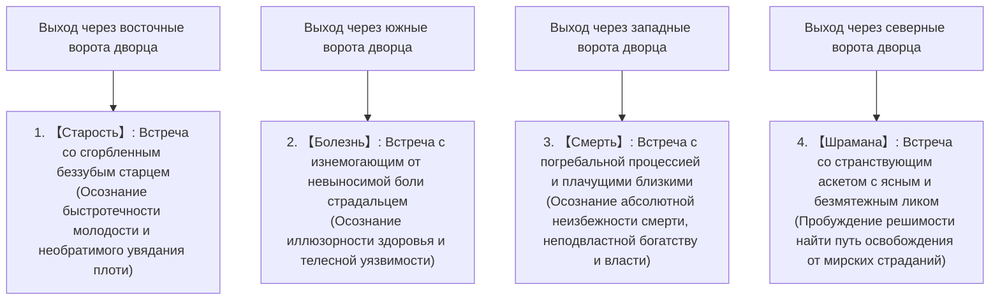

## Введение: Рождение Пробужденного (Будды) и революция в интеллектуальной истории человечества

В V–VI веках до н. э. в бассейне среднего течения Ганга в Древней Индии развернулось бурное философское брожение — эпоха, вошедшая в историю человечества как центральная часть «Осевого времени» (по Карлу Ясперсу). В самом горниле этих духовных исканий Сиддхартха Гаутама (санскр. Gautama Siddhārtha, пали: Gotama Siddhattha) явил миру учение, известное ныне как «буддизм». Это событие стало величайшей интеллектуальной и экзистенциальной революцией в духовной истории человечества, в корне перевернувшей традиционную древнеиндийскую религиозно-философскую парадигму, господствовавшую со времен Вед и Упанишад.

«Будда» (Buddha) — это не имя собственное некоего антропоморфного божества, а нарицательное имя на санскрите и пали, означающее «Пробужденный», «Тот, кто постиг истину». Сердцевина учения, открытого Сиддхартхой Гаутамой, решительно отвергала слепую веру в сотворившего вселенную бога-демиурга, а также монополию жреческого сословия (брахманов) на жертвоприношения животных и магические ритуалы. Вместо этого Будда предложил трезвый, беспристрастный взгляд на структурную неудовлетворительность и страдание (дуккху), имманентно присущие самому феномену человеческого существования, осуществил деконструкцию их причин с позиций строгой причинно-следственной связи и сформулировал рационально-практическое знание (эпистему), ведущее посредством личного наблюдения и медитативной практики к окончательному освобождению (мокше / нирване / ниббане).

Буддизм далеко выходит за рамки понятия «религия» в его новоевропейском понимании. Это поразительно точная когнитивная наука, глубинная психотерапия, критика языка и онтологическая феноменология. В настоящем исследовании с академической строгостью и непревзойденной полнотой раскрывается целостная система раннего буддизма: от жизненного пути Сиддхартхи Гаутамы и его духовного переворота, логической и математической строгости доктрин Четырех благородных истин, Восьмеричного пути и Двенадцати звеньев взаимозависимого происхождения до онтологической анатомии пяти скандх и бессамостности (анатмана), текстологического анализа палийских канонических первоисточников и глубинного резонанса с современной когнитивной нейробиологией, феноменологией и практиками осознанности (mindfulness).

```
【Парадигмальный сдвиг в интеллектуальной истории Древней Индии: Брахманизм vs Буддизм】

┌───────────────────┬────────────────────────────────┬────────────────────────────────┐
│ Критерий          │ Ортодоксальный брахманизм /    │ Ранний буддизм                 │
│ сравнения         │ Упанишады                      │ (Сиддхартха Гаутама Будда)     │
├───────────────────┼────────────────────────────────┼────────────────────────────────┤
│ Предельная        │ Брахман (космический абсолют,  │ Дхарма (закон взаимозависимого │
│ реальность        │ первопричина и субстанция бытия│ возникновения, универсальный   │
│                   │                                │ объективный принцип)           │
├───────────────────┼────────────────────────────────┼────────────────────────────────┤
│ Понимание Я       │ Атман (вечная, неизменная,     │ Анатман / Анатта (полное отри- │
│ (субъекта/души)   │ бессмертная истинная самость)  │ цание субстанциального Я,      │
│                   │                                │ процессуальный поток скандх)   │
├───────────────────┼────────────────────────────────┼────────────────────────────────┤
│ Путь к            │ Интуиция единства Брахмана и   │ Четыре истины, Восьмеричный    │
│ освобождению      │ Атмана, ритуалы, аскеза (тапас)│ путь, Срединный путь, шаматха  │
│                   │                                │ и випашьяна (шаматха-випассана)│
├───────────────────┼────────────────────────────────┼────────────────────────────────┤
│ Картина мира и    │ Санкционирование сословной     │ Отрицание варновой дискрими-   │
│ социум            │ иерархии (варны и касты)       │ нации, всеобщее равенство людей│
├───────────────────┼────────────────────────────────┼────────────────────────────────┤
│ Метод познания    │ Следование непререкаемому      │ Эхипассико («приди и узри»),   │
│                   │ авторитету ведийского канона   │ самопроверка личным опытом и   │
│                   │ (шрути)                        │ критическим разумом            │
└───────────────────┴────────────────────────────────┴────────────────────────────────┘
```

---

## 1. Жизненный путь Сиддхартхи Гаутамы и его духовный поворот

### 1.1 Рождение принца шакьев и экзистенциальный шок «Четырех встреч»
Сиддхартха Гаутама родился у подножия Гималаев, в Лумбини (на территории современного южного Непала), будучи сыном царя Шуддходаны (правителя небольшого олигархического полиса племени шакьев со столицей в Капилавасту) и царицы Майи.

Согласно агиографической легенде, сразу после рождения младенец сделал семь шагов на четыре стороны света и провозгласил: «На небесах и под небесами лишь Я один достоин почитания». Однако с точки зрения историко-филологической критики Сиддхартха происходил из аристократического клана воинов (кшатриев) могущественной восточноиндийской племенной конфедерации (гана-сангхи) и с юных лет пользовался всеми преимуществами беззаботной, роскошной жизни. Отец, движимый предсказанием о том, что сын может покинуть мир и стать странствующим отшельником, приказал построить для принца три великолепных дворца, соответствующих трем сезонам индийского года (жаркому, сезону дождей и прохладному), окружил его прекрасными танцовщицами и музыкантами и строго запретил допускать к нему любые напоминания об уродливых сторонах человеческого бытия — старости, немощах и смерти.

Тем не менее исключительно проницательный ум и обостренная чувствительность Сиддхартхи позволили ему распознать иллюзорность и хрупкость этого искусственного земного рая. Символическим выражением этого экзистенциального прозрения стало хрестоматийное предание о «Четырех встречах» (пали: cattāri nimittāni).



Четыре встречи — это не просто назидательная притча, но универсальная парадигма **«экзистенциального кризиса» (Existential Crisis)**. Сколь бы богатым, могущественным и физически цветущим ни был отдельный человек, он ни на мгновение не в состоянии отменить три непреложных онтологических ограничения: старение, болезнь и умирание. Созерцая немощь, страдания и смерть других людей, Сиддхартха осознал: это не отдаленные события чьей-то чужой жизни, но непосредственный, непреложный удел его собственного существования прямо здесь и сейчас. Это пронзительное экзистенциальное отчаяние и трезвое осознание человеческой судьбы стали движущей силой его «Великого исхода» (великого отречения) в возрасте 29 лет.

### 1.2 Отречение от мира, ученичество у наставников, крайняя аскеза и ее крах
Оставив супругу Яшодхару, новорожденного сына Рахулу и право наследования царского престола, Сиддхартха остриг волосы, облачился в грубое рубище и стал «шраманой» (пали: самана, странствующим искателем истины, находящимся вне ортодоксальной ведийской системы).

Сначала он обратился к двум известнейшим наставникам медитации того времени:
1. **Алара Калама (пали: Āḷāra Kālāma)**: обучал достижению состояния «сферы отсутствия всего» (пали: ākiñcaññāyatana / акиньчаньнья-аятана — высочайшая ступень медитативного сосредоточения, где сознание освобождается от любых предметных форм). Сиддхартха освоил это состояние за считанные дни, однако обнаружил, что по выходе из медитативного транса страдания и беспокойства возвращаются вновь; следовательно, это состояние не являлось подлинным и окончательным освобождением.
2. **Уддака Рамапутта (пали: Uddaka Rāmaputta)**: наставлял в практике достижения «сферы ни восприятия, ни не-восприятия» (пали: nevasaññānāsaññāyatana / невасання-насання-аятана — предельно тонкое состояние сознания, балансирующее на грани исчезновения апперцепции). Сиддхартха также в совершенстве овладел этой ступенью, сравнявшись с учителем, но вновь пришел к выводу, что даже это запредельное состояние не устраняет коренных причин страдания и омрачений ума.

Осознав ограниченность чисто ментальной концентрации, Сиддхартха решил пойти путем бескомпромиссного телесного умерщвления плоти («тапаса»), надеясь выкорчевать влечения и страсти физическим страданием. В лесах Урувелы (государство Магадха) вместе с пятью товарищами по подвижничеству (во главе с Конданьей) он на протяжении шести лет предавался жесточайшим формам самоистязания: задерживал дыхание до появления невыносимого внутреннего жара и шума в ушах, находился под палящим полуденным солнцем и довел голодание до того, что съедал лишь по одному конопляному зерну или рисовому зернышку в день.

В результате тело Сиддхартхи истощилось до крайности: ребра выпирали, словно стропила полуразрушенного сарая, глазные яблоки глубоко запали, кожа головы сморщилась подобно высохшей тыкве, а при попытке опереться на ноги он терял сознание и падал в пыль. Оказавшись на волосок от физической гибели, он так и не обрел желанного покоя и окончательного пробуждения ума. В этот критический миг Сиддхартха совершил эпохальный переворот в истории философии:

> **«Умерщвление плоти лишь разрушает тело и истощает дух, но не дарует ни подлинной мудрости, ни просветления. Подобно тому как гибельно погружение в чувственные наслаждения (гедонизм), столь же ложен и бесплоден путь самоистязания (ригористический аскетизм)».**

Сиддхартха принял бесповоротное решение отказаться от бесплодной аскезы. Он спустился к реке Найранджане (Ниранджаре), смыл с себя шестилетнюю пыль и грязь, а затем, обессилев, принял из рук деревенской девушки Суджаты (Sujātā) чашу живительной рисовой каши на молоке (паяса). Питательные соки разлились по телу, вернув принцу физическую силу и ясность сознания. Увидев это, пятеро его сподвижников сочли Гаутаму отступником, не выдержавшим трудностей святой жизни и павшим в роскошь, и с презрением покинули его.

```
【Диалектическое снятие двух крайностей и открытие Срединного пути (Мадджхима-патипада)】

Предание чувственным утехам  ←─────［СРЕДИННЫЙ ПУТЬ］─────→  Самоистязание плоти
(Роскошь царских дворцов)      (Подлинная мудрость и покой)   (Крайняя аскеза в лесах Урувелы)

※ Метафора струн вины (лютни): если струна натянута слишком туго — она лопнет;
   если ослаблена чрезмерно — она не издаст звука. Лишь гармонично настроенная струна звучит чисто.
```

### 1.3 Просветление под деревом Бодхи: Поединок с Марой и рождение Будды
Восстановив телесные силы, Сиддхартха направился в Бодх-Гаю, постелил циновку из травы куша под сенью священного древа ашваттха (впоследствии названного «деревом Бодхи») и сел в позу лотоса, дав непреклонную клятву:
**«Пусть иссохнет моя кожа, плоть и кости, пусть истлеет моя кровь, но я не сойду с этого места, пока не достигну высшего и полного Пробуждения!»**

Буддийская традиция повествует о том, что в этот миг все скрытые страхи, вожделения, сомнения и привязанности человеческой психики персонифицировались в образе демонического владыки сансары — Мары (Māra / Папиман — Лукавый).
Сначала Мара послал трех своих соблазнительных дочерей — Таху (Жажду/Вожделение), Арати (Неудовлетворенность/Тоску) и Рагу (Страсть), дабы соблазнить отшельника. Когда Сиддхартха остался абсолютно невозмутим, Мара обрушил на него свирепые бури, ураганы, огненные стрелы и полчища чудовищ, стремясь сокрушить его волю ужасом. Наконец Мара воскликнул: «Какое право имеешь ты претендовать на несокрушимый трон Просветления? Кто твой свидетель?». Сиддхартха молча опустил правую руку и коснулся кончиками пальцев земли — жест, вошедший в историю искусства как «бхумиспарша-мудра» (мудра прикосновения к земле, или подчинения Мары). В ответ земля содрогнулась от громоподобного гласа: «Я свидетельствую о бесчисленных деяниях самопожертвования и совершенствах (парамитах), совершенных им в прошлых жизнях!». Войско Мары обратилось в бегство, а все омрачающие аффекты (клеши) в сознании аскета были окончательно искоренены.

В первую стражу ночи (18:00–22:00) Сиддхартха обрел «пуббенивасануссати-ньяну» (знание воспоминания о прошлых жизнях), восстановив непрерывную память о бесчисленных циклах своих собственных перерождений.
Во вторую стражу ночи (22:00–02:00) он обрел «дибба-чаккху» («божественное око» / чутупапата-ньяну), узрев космический закон кармы: как живые существа рождаются, страдают и умирают в высших и низших мирах в строгом соответствии с качеством своих деяний и побуждений.
В третью стражу ночи (02:00–06:00), когда на предрассветном восточном небосклоне ярко воссияла Утренняя звезда, Сиддхартха в прямом и обратном порядке созерцал Двенадцать звеньев взаимозависимого возникновения (патичча-самуппада), полностью уничтожил фундаментальное неведение (авидью) и обрел знание прекращения всех омрачений и аффектов («асаваккхая-ньяна»).

В этот миг Сиддхартха Гаутама реализовал непревзойденное совершенное Пробуждение (ануттара-самьяк-самбодхи) и стал **Буддой (Шакьямуни, Благословенным Бхагаваном)**. Ему было 35 лет.

### 1.4 Мольба Брахмы (Брахма-ячана) и Первое вращение Колеса Дхармы
Достигнув Пробуждения, Будда погрузился в глубочайшее безмолвие и усомнился в целесообразности проповеди открытой им Дхармы: «Закон этот глубоководный, труднопостижимый, тонкий, трансцендентный логике, доступный лишь мудрецам. Род людской привязан к страстям, ослеплен похотью и тьмой. Если я стану возвещать эту истину, они не поймут ее, и труды мои обернутся лишь утомлением и тщетой». Будда склонялся к тому, чтобы остаться в безмолвном покое нирваны.

Тогда верховное божество индийского пантеона — великий Брахма Сахампати — сошел с небес, благоговейно преклонил колено перед Татхагатой, сложил ладони и трижды взмолился о спасении мира. Этот эпизод священной истории известен как **«Брахма-ячана» (Мольба Брахмы)**:
«О Благословенный, возвести закон! Есть среди существ те, чьи духовные очи покрыты лишь тончайшим слоем пыли. Не услышав Дхармы, они погибнут; услышав же, они непременно достигнут освобождения!»

Будда окинул мир оком сострадания Пробужденного. Он узрел человечество подобно озеру с лотосами: одни бутоны еще глубоко погребены в илистом дне, другие едва достигают поверхности мутной воды, а третьи уже поднялись над водной гладью и готовы раскрыть свои лепестки навстречу солнцу незапятнанными. И Будда прервал свое безмолвие, изрекши:

> **«Отверсты врата к Бессмертному (амата)! Пусть слушающие, имеющие уши, отринут сомнения и укрепят веру!»**

Будда преодолел пешком сотни километров, направляясь в Олений парк (Исипатана / Сарнатх) близ Варанаси, дабы отыскать пятерых покинувших его аскетов. Завидев издалека шествующего Будду, монахи сговорились проигнорировать его: «Вот идет Гаутама, оставивший аскезу и павший в чувственность. Не встанем перед ним и не окажем почестей». Однако по мере приближения Будды сияние его величия и абсолютной духовной невозмутимости ошеломило их: против своей воли они вскочили с мест, омыли его стопы, почтительно приготовили сиденье и приняли его как учителя.

Здесь Будда произнес свою первую проповедь в истории человечества — **«Дхармачакра-правартана-сутту» («Сутру запуска Колеса Дхармы»)**. В ней были впервые изложены принципы Срединного пути, Четырех благородных истин и Благородного восьмеричного пути. Слушая учение, старейший из сподвижников, Конданья, обрел незапятнанное «око Дхармы» (дхаммачаккху), узрев фундаментальный закон бытия: *«Все, что подлежит возникновению, подлежит и прекращению»*. В этот исторический миг на Земле родились «Три драгоценности» (Триратна): Будда (Учитель), Дхарма (Учение) и Сангха (Монашеская община).

---

## 2. Фундамент буддийского учения: Логическая структура Четырех благородных истин (Cattāri Ariyasaccāni)

Учение Будды представляет собой не мистическую догму и не схоластическое вероучение, но **«экзистенциальную клиническую медицину»**, которая с безупречной строгостью переносит логическую структуру древнеиндийской аюрведической врачебной практики («диагностика симптомов — выявление этиологии болезни — определение состояния полного выздоровления — предписание терапевтического курса лечения») в область духовного бытия человека. Этим всеобъемлющим клинико-философским каркасом являются «Четыре благородные истины» (пали: чаттари ариясаччани).

```
【Структурный изоморфизм клинической медицины и Четырех благородных истин】

┌───────────────────┬───────────────────────────────┬───────────────────────────────┐
│ Медицинская модель│ Четыре благородные истины     │ Содержание и экзистенциальный │
│ диагностики       │ буддизма                      │ смысл                         │
├───────────────────┼───────────────────────────────┼───────────────────────────────┤
│ 1. Диагностика    │ Дуккха-сачча (Истина о        │ Фундаментальная реальность    │
│    симптомов      │ страдании / неудовлетворитель-│ бытия есть «дуккха» (неудов-  │
│    болезни        │ ности)                        │ летворенность, бренность)     │
├───────────────────┼───────────────────────────────┼───────────────────────────────┤
│ 2. Выявление      │ Самудая-сачча (Истина об      │ Коренная причина страдания —  │
│    этиологии      │ источнике / возникновении     │ ненасытная жажда («танха») и  │
│    (причины)      │ страдания)                    │ цепляние                      │
├───────────────────┼───────────────────────────────┼───────────────────────────────┤
│ 3. Прогноз полного│ Ниродха-сачча (Истина о       │ Полное искоренение жажды =    │
│    исцеления      │ прекращении страдания)        │ Нирвана (угасание омрачений,  │
│                   │                               │ нерушимый абсолютный покой)   │
├───────────────────┼───────────────────────────────┼───────────────────────────────┤
│ 4. Терапевтичес-  │ Магга-сачча (Истина о Пути)   │ Практический курс исцеления = │
│    кий курс       │                               │ Благородный восьмеричный путь │
└───────────────────┴───────────────────────────────┴───────────────────────────────┘
```

### 2.1 Дуккха-сачча (Dukkha-sacca): Структурная «неудовлетворительность» экзистенции
Когда буддизм постулирует положение: «Все обусловленное есть страдание» (пали: Sabbe saṅkhārā dukkhā), термин **«дуккха» (Dukkha)** не сводится лишь к тривиальной физической боли, эмоциональной скорби или житейскому несчастью.
Этимология палийского слова *dukkha* восходит к метафоре колесницы: корень *kha* обозначает отверстие для оси в ступице колеса, а префикс *du-* указывает на дефект, искривление или рассогласованность. Таким образом, исходное значение слова — «плохо подогнанная ось», заставляющая повозку мучительно скрипеть, дребезжать и двигаться с постоянными перебоями. В онтологическом смысле «дуккха» выражает **«невозможность найти незыблемую опору», «радикальную неудовлетворительность», «нестабильность и несовершенство»** всякого обусловленного существования.

Ранний буддизм с математической точностью классифицировал проявления дуккхи в рамках формулы «восьми страданий» (четырех базовых и четырех производных):

1. **Страдание рождения (джати)**: травматический акт появления на свет и бремя биологического выживания.
2. **Страдание старения (джара)**: неумолимое увядание телесных и ментальных сил, утрата привлекательности и автономии.
3. **Страдание болезни (вьядхи)**: подверженность физическим патологиям, боли и разрушению тканей.
4. **Страдание смерти (марана)**: абсолютная утрата бытия, страх небытия и распад личности.
5. **Страдание разлуки с приятным (пия-виппайога)**: неизбежное расставание с любимыми людьми, вещами и статусом.
6. **Страдание соединения с неприятным (аппия-сампайога)**: вынужденный контакт с враждебным, ненавистным и отталкивающим.
7. **Страдание недостижения желаемого (ямпиччхам на лабхати)**: фрустрация от невозможности получить или удержать вожделенный объект.
8. **Страдание пяти скандх привязанности (паньчупаданаккхандха)**: интегральное напряжение и боль, порождаемые идентификацией иллюзорного «Я» с пятью составляющими психофизического агрегата.

### 2.2 Самудая-сачча (Samudaya-sacca): Механизм зарождения страдания и «Танха» (Жажда)
Если страдание существует, у него обязательно должна быть порождающая причина. Вторая благородная истина раскрывает корень дуккхи в феномене **«жажды» (пали: танха / Taṇhā, санскр. тришна)**.
Танха буквально означает мучительную жажду путника, заблудившегося в раскаленной пустыне и готового на любые безумства ради капли воды. Это слепой, ненасытный импульс влечения, цепляния и судорожной попытки удержать ускользающие феномены.

Будда подразделил жажду на три фундаментальные разновидности:
- **Кама-танха (Kāma-taṇhā)**: жажда чувственных наслаждений, погоня за приятными сенсорными стимулами (зрительными, слуховыми, вкусовыми, осязательными).
- **Бхава-танха (Bhava-taṇhā)**: жажда бытия, страстное стремление к продолжению индивидуального существования, жажда самоутверждения, вечной жизни, социального признания и накопления могущества (эгоцентрический инстинкт самосохранения).
- **Вибхава-танха (Vibhava-taṇhā)**: жажда небытия, деструктивное стремление уничтожить самого себя, избавиться от страданий путем аннигиляции, суицидальный или нигилистический эскапизм.

Коварство танхи заключается в ее патологически зависимой, аддиктивной природе. Она уподоблена питью соленой морской воды ради утоления жажды: чем больше человек пьет, тем сильнее разгорается жажда, привязывая сознание к нескончаемому круговороту сансарических метаний.

### 2.3 Ниродха-сачча (Nirodha-sacca): Полное прекращение страдания и «Нирвана»
Подобно тому как устранение причины заболевания приводит к полному исцелению организма, существует состояние окончательного пресечения жажды и освобождения от страданий. Это Третья благородная истина — истина о прекращении (ниродха), высшая цель буддизма — **«Нирвана» (пали: Ниббана / Nibbāna)**.

Буквальное значение термина «ниббана» — «задувание», «угасание» (от глагольного корня *nir-vā* — «гаснуть от отсутствия топлива»). Это состояние, в котором дотла угасли «три ядовитых пламени»: пламя жадности и страсти (лоба / рага), пламя гнева и ненависти (доса) и пламя иллюзии и неведения (моха). Нирвана — это вовсе не потусторонний посмертный рай и не мрачная черная дыра небытия; это **«прямо здесь и сейчас достижимое состояние абсолютной свободы, ясности и нерушимого внутреннего мира, освобожденного от пут аффектов»**.

### 2.4 Магга-сачча (Magga-sacca): Практический рецепт исцеления — «Благородный восьмеричный путь»
Четвертая истина формулирует конкретный путь духовной практики, ведущий к пресечению страдания — «Благородный восьмеричный путь» (пали: Ariyo aṭṭhaṅgiko maggo). Он охватывает восемь взаимосвязанных факторов, которые в традиционной систематике группируются в «Три высших раздела практики» (Тисиккха / Трайшикшья): Мудрость (пання), Нравственность (сила) и Сосредоточение (самадхи).

```
【Структура Благородного восьмеричного пути и три раздела практики (Шила, Самадхи, Праджня)】

┌─────────────────┬───────────────────────────────┬───────────────────────────────┐
│ Разделы практики│ Ступени Восьмеричного пути    │ Практическое определение и    │
│ (Тисиккха)      │                               │ функциональное назначение     │
├─────────────────┼───────────────────────────────┼───────────────────────────────┤
│ Праджня / Пання │ 1. Правильное воззрение       │ Истинное видение Четырех истин│
│ (Мудрость)      │    (Sammā-diṭṭhi)             │ кармы, анитьи и анатмана      │
│                 │ 2. Правильное намерение       │ Устремленность к непривязан-  │
│                 │    (Sammā-saṅkappa)           │ ности, доброжелательности и   │
│                 │                               │ ненасилию (ахимсе)            │
├─────────────────┼───────────────────────────────┼───────────────────────────────┤
│ Шила            │ 3. Правильная речь            │ Воздержание от лжи, клеветы,  │
│ (Нравственность)│    (Sammā-vācā)               │ грубых слов и пустословия     │
│                 │ 4. Правильное действие        │ Воздержание от убийства, во-  │
│                 │    (Sammā-kammanta)           │ ровства и половой распущеннос-│
│                 │                               │ ти (аморального поведения)    │
│                 │ 5. Правильный образ жизни     │ Добродетельный заработок, от- │
│                 │    (Sammā-ājīva)              │ каз от торговли оружием, яда- │
│                 │                               │ ми, живыми существами         │
├─────────────────┼───────────────────────────────┼───────────────────────────────┤
│ Самадхи         │ 6. Правильное усилие          │ Предотвращение и пресечение   │
│ (Сосредоточение)│    (Sammā-vāyāma)             │ зла, взращивание и укрепление │
│                 │                               │ благих состояний ума          │
│                 │ 7. Правильная осознанность    │ Непрерывное безоценочное вни- │
│                 │    (Sammā-sati)               │ мание к телу, чувствам, уму   │
│                 │                               │ и ментальным феноменам (дхар- │
│                 │                               │ мам) прямо здесь и сейчас     │
│                 │ 8. Правильное сосредоточение  │ Однонаправленность ума, вхож- │
│                 │    (Sammā-samādhi)            │ дение в четыре ступени меди-  │
│                 │                               │ тативного погружения (джханы) │
└─────────────────┴───────────────────────────────┴───────────────────────────────┘
```

Факторы Восьмеричного пути не осваиваются изолированно или механически друг за другом; подобно спицам одного колеса, они функционируют как органическая самоподдерживающаяся динамическая система. Правильное воззрение задает вектор понимания реальности; нравственные предписания очищают психофизические действия и создают бесконфликтное социальное пространство; медитативная тренировка дисциплинирует и успокаивает ум, что, в свою очередь, возводит мудрость на уровень прямого созерцательного постижения и приводит к окончательному пробуждению.

---

## 3. Бездны онтологии: Двенадцать звеньев взаимозависимого возникновения (Пратитья-самутпада) и бремя пяти скандх

### 3.1 Учение о взаимозависимом возникновении (Paṭicca-samuppāda): Величайшее открытие Будды
Наиболее глубокой в философском отношении доктриной, качественно отличающей буддизм от всех прочих религиозно-философских систем древности и современности, выступает **«учение о взаимозависимом возникновении» (пали: патичча-самуппада / Paṭicca-samuppāda, санскр. пратитья-самутпада)**.
Этот принцип утверждает, что любое явление во Вселенной возникает исключительно в зависимости от условий (Dependent Origination / интердепендентность).

В Палийском каноне Будда формулирует этот закон в виде кристально чистой, почти математической логической формулы:

> **«При наличии этого возникает то; с появлением этого появляется то.**
> **При отсутствии этого нет и того; с прекращением этого прекращается то».**
> (*«Самьютта-никая»*, II.28)

Ни один феномен мироздания — будь то материальный атом, психический акт, биологический организм или социальный институт — не обладает самостоятельным, изолированным, самодостаточным абсолютным бытием («свабхавой»). Все сущее пребывает в динамической сети универсальной взаимообусловленности (в позднейшей традиции уподобленной «сети Индры»), где каждый элемент существует лишь как узел пересечения причин (хету) и условий (пратьяя). Во Вселенной нет места ни неизменному Богу-творцу, ни трансцендентной первопричине, ни слепому фатализму. Если условия сходятся — феномен проявляется; условия распадаются — феномен угасает. Это и есть высший вселенский Закон (Дхарма).

### 3.2 Цепная структура Двенадцати звеньев (Двадаша-нидана)
В ночь Пробуждения Будда проследил причинно-следственную цепь, удерживающую человека в оковах перерождений, старости и смерти, систематизировав ее в виде двенадцати взаимосвязанных звеньев (нидан):

```mermaid
graph LR
    A["1. Неведение<br/>(Avijjā / Авиддья)"] --> B["2. Волевые импульсы<br/>(Saṅkhāra / Санкхара)"]
    B --> C["3. Сознание<br/>(Viññāṇa / Винняна)"]
    C --> D["4. Имя и форма<br/>(Nāmarūpa / Намарупа)"]
    D --> E["5. Шесть сфер чувств<br/>(Saḷāyatana / Салаятана)"]
    E --> F["6. Соприкосновение<br/>(Phassa / Пхасса)"]
    F --> G["7. Чувствование<br/>(Vedanā / Ведана)"]
    G --> H["8. Жажда<br/>(Taṇhā / Танха)"]
    H --> I["9. Привязанность<br/>(Upādāna / Упадана)"]
    I --> J["10. Становление<br/>(Bhava / Бхава)"]
    J --> K["11. Рождение<br/>(Jāti / Джати)"]
    K --> L["12. Старость и смерть<br/>(Jarāmaraṇa / Джарамарана)"]
```



```
【Двенадцать звеньев взаимозависимого происхождения и психология человеческого бытия】

1. Авидья (пали: авидджа) — Неведение: базисная слепота ума, непонимание Четырех истин, анитьи и анатмана.
2. Санскара (пали: санкхара) — Волевые формирующие импульсы: кармические следы и интенциональные акты.
3. Виджняна (пали: винняна) — Сознание: дифференцирующая способность ума, непрерывный поток различения.
4. Нама-рупа — Имя и форма: соединение ментальных функций (нама) и материального тела (рупа) зародыша.
5. Шад-аятана (пали: салаятана) — Шесть сфер восприятия: глаза, уши, нос, язык, тело и манас (ум).
6. Спарша (пали: пхасса) — Контакт: встреча органа чувств, внешнего объекта и соответствующего сознания.
7. Ведана — Ощущение / чувственный тон: автоматическая эмоциональная окраска контакта (приятно, неприятно, нейтрально).
8. Тришна (пали: танха) — Жажда: реактивное влечение к приятному и отвержение неприятного.
9. Упадана — Привязанность / цепляние: отчаянная попытка зафиксировать и присвоить объект жажды.
10. Бхава — Становление: накопление потенциала нового кармического существования.
11. Джати — Рождение: манифестация новой психофизической структуры в очередном цикле сансары.
12. Джара-марана — Старость и смерть: неизбежный физический распад, скорбь, стенания и гибель рожденного.
```

Величайшим прозрением этой доктрины является указание на то, что исходным корнем человеческой трагедии выступает не внешний злой рок, а внутреннее **«Неведение» (Авиддья)**.
Следовательно, данная причинная цепь может быть раскручена в обратном направлении («врата угасания» / пратилома):
С искоренением неведения светом праджни угасают кармические импульсы; с угасанием импульсов угасает омраченное сознание... угасает жажда, угасает цепляние, устраняется рождение, и вся колоссальная громада страданий, старости и смерти рассыпается в прах. В буддизме спасение — это не акт милости или слепой веры, а закономерный результат радикального гносеологического переворота.

### 3.3 Пять скандх (Pañca-khandhā): Деконструкция человеческой личности
Кто же такой этот пресловутый «индивид»?
Будда решительно отверг представление о человеке как о неизменной субстанциальной душе и деконструировал личность на пять динамических потоков психофизических элементов — **«Пять скандх» (пали: панча-ккхандха / Pañca-khandhā, санскр. панча-скандха)**:

1. **Рупа (Rūpa)** — скандха формы: биологическое тело, органы чувств и материальные объекты физического мира.
2. **Ведана (Vedanā)** — скандха ощущений: первичное чувственное переживание контакта (приятное, болезненное или индифферентное).
3. **Санджня (пали: Сання / Saññā)** — скандха восприятия: распознавание, концептуализация, наделение именами и отождествление объектов с образами памяти.
4. **Самскара (пали: Санкхара / Saṅkhāra)** — скандха волевых формирователей: аффекты, намерения, привычки, желания, мотивы и волевые импульсы, формирующие карму.
5. **Виджняна (пали: Винняна / Viññāṇa)** — скандха сознания: базовая способность синтеза и осознавания сенсорных и ментальных феноменов.

Будда обратился к своим ученикам с вопрошанием:
«Как вы полагаете, монахи: постоянна ли форма, ощущения, восприятия, волевые акты и сознание или непостоянны?»
— «Непостоянны, о Благословенный».
— «А то, что непостоянно, является ли оно страданием или благом?»
— «Страданием, о Благословенный».
— «Правомерно ли в отношении того, что непостоянно, подвержено страданию и изменчивости, заявлять: "Это принадлежит мне, это есть я, это мое истинное Я (Атман)"?»
— «Нет, о Благословенный, это неверно».

Человек представляет собой не застывшую монументальную статую, а высокоскоростной, непрерывно видоизменяющийся процесс — поток («сантану»). Подобно тому как набор колес, осей, кузова и дышла лишь условно именуется «колесницей», так и слова «личность», «субъект» или «Я» суть лишь конвенциональные ярлыки, обозначающие взаимосвязанный пучок пяти скандх.

---

## 4. Философия бессамостности (Anattā): Деконструкция субстанциального Я и экзистенциальная свобода

### 4.1 Анатта (Бессамостность) против учения Упанишад об Атмане
Кульминационным пунктом буддийской философии и предметом наиболее частых кривотолков является концепция **«Анатмана / Анатты» (пали: Anattā, санскр. Anātman — бессамостность, отсутствие непреходящего Я)**.

Господствующая брахманская ортодоксия того времени (философия Упанишад) учила: сколь бы бренным ни было физическое тело и изменчивыми эмоции, в сокровенной глубине каждого существа пребывает вечная, неизменная, сияющая искра абсолюта — бессмертная субстанциальная душа (**Атман**). Спасение виделось в мистическом осознании тождества индивидуального Атмана вселенскому Брахману («Тат твам аси» — «Ты есть То»).

Будда нанес сокрушительный удар по этой иллюзии, провозгласив фундаментальную максиму: **«Все дхармы лишены Я» (пали: Sabbe dhammā anattā)**.
Его аргументация поразительна своей прагматической неопровержимостью:
Если нечто является подлинным «Я» («моим»), оно должно находиться под моим полным и безусловным суверенным контролем. Может ли человек приказать своему телу: «Пусть плоть моя никогда не болеет и не стареет!», — и добиться послушания? Способны ли мы усилием воли навсегда запретить всплывать страхам, тоске или гневу? Нет. Ибо все эти явления суть безличные процессы, возникающие по закону причинности при наличии определенных условий. То, что неподвластно нашей абсолютной воле и непрерывно распадается, абсурдно объявлять «собой». Ни в одной из пяти скандх, ни за их пределами невозможно обнаружить фиксированную субстанцию эго.

```
【Эпистемологический конфликт: Субстанциализм Упанишад vs Феноменализм раннего буддизма】

■ Субстанциализм Упанишад (Теория Атмана):
За кулисами преходящих мыслей, телесных состояний и чувств
восседает вечный, чистый, бессмертный свидетель — «Истинное Я» (Атман).
※ Стремясь спасти душу, сознание впадает в ловушку утонченного эгоцентризма и цепляния.

■ Феноменалистический процессуализм раннего буддизма (Теория Анатты):
Существует лишь причинно обусловленный поток телесных ощущений, восприятий и мыслей.
За кулисами нет никакого скрытого «зрителя». Есть лишь процесс восприятия, но нет воспринимающего.
※ Полный демонтаж ментальной фикции «Я» вырывает с корнем саму возможность эгоистической привязанности.
```

### 4.2 Три и Четыре признака бытия (Дхарма-мудра): Универсальные печати реальности
Своеобразным фирменным знаком буддийского миросозерцания являются «Дхарма-мудры» — печати или фундаментальные характеристики истинной природы всякого опыта:

1. **Анитья (пали: Аничча / Sabbe saṅkhārā aniccā)** — Все обусловленные вещи непостоянны:
   Все сконструированное и составное пребывает в непрерывном потоке ежесекундного становления и распада. Во Вселенной нет ни единой застывшей точки.
2. **Анатман (пали: Анатта / Sabbe dhammā anattā)** — Все дхармы лишены самости:
   Не только обусловленные вещи (санкхата), но и вообще все существующие дхармы (включая необусловленный элемент — нирвану) лишены постоянной сущности или «Я».
3. **Нирвана-шанта (пали: Nibbānaṃ santaṃ)** — Нирвана есть высший покой:
   Состояние, в котором пламя эгоцентрического цепляния задуто знанием непостоянства и бессамостности, представляет собой абсолютную безмятежность и высшее освобождение.
4. **Дуккха (Sabbe saṅkhārā dukkhā)** — Все обусловленное неудовлетворительно:
   Попытка опереться на непостоянное как на постоянное и принять бессамостное за «себя» неизбежно порождает страдание (включение дуккхи образует традиционный свод «Четырех печатей Дхармы»).

Доктрина анатмана не имеет ничего общего с плоским нигилизмом. Будда равно осуждал как этернализм («сассата-вада» — веру в вечную субстанциальную душу), так и аннигиляционизм («уччхеда-вада» — убеждение в том, что со смертью тела все бесследно уничтожается). Анатта — это освобождение от тирании иллюзорного «Я», трезвый взгляд на факт непосредственной жизни здесь и сейчас и преодоление всех форм экзистенциального страха.

---

## 5. Текстологический анализ раннебуддийских памятников и генезис Сангхи

### 5.1 Формирование Палийского канона и Буддийские соборы (Сангити)
Будда не оставил после себя ни одной написанной строки. В Древней Индии сакральное знание веками транслировалось не посредством письма, а через строжайшую мнемоническую культуру устной передачи от учителя к ученику.

Сразу после ухода Будды в окончательную паринирвану (Махапариниббана) в Кушинагаре в возрасте 80 лет, в Раджагрихе под председательством старейшины Махакашьяпы (пали: Махакассапа) собрались 500 архатов. Это историческое собрание получило название **«Первого буддийского собора» (пали: Сангити — «Совместное воспевание / рецитация»)**.

```
【Две магистральные традиции Первого буддийского собора】

1. Рецитация Сутта-питаки (Корзины наставлений):
   ・Чтец: Ананда (двоюродный брат и бессменный личный секретарь Будды на протяжении 25 лет, «первый среди слышавших»).
   ・Вводная сакральная формула: «Так я слышал» (пали: Evaṃ me sutaṃ / санскр. Эвам мая шрутам).
   ・Содержание: Диалоги, притчи и проповеди Будды, адаптированные к уровню понимания слушателей.

2. Рецитация Виная-питаки (Корзины дисциплины):
   ・Чтец: Упали (бывший цирюльник шакьев, непревзойденный знаток монашеского устава, «первый среди знатоков винаи»).
   ・Содержание: Монашеские правила (патимоккха), процедуры вступления в общину и уставы общежития.
```

Впоследствии, пройдя через разделение на школы и столкнувшись в I веке до н. э. на острове Шри-Ланка с угрозой утраты устной традиции из-за войн с тамилами и жестокого голода, сингальские монахи в пещерном монастыре Алувихара впервые зафиксировали канон письмом на высушенных пальмовых листьях на языке пали. Так возник дошедший до наших дней **«Палийский канон» (Типитака / Трипитака: Сутта, Виная, Абхидхамма)**.

### 5.2 Древнейший пласт буддийской литературы: «Сутта-нипата» и «Дхаммапада»
Благодаря изысканиям выдающихся текстологов и буддологов XIX–XX веков (Т. В. Рис-Дэвидс, Э. Арнольд, Хадзимэ Накамура, Ф. И. Щербатской) в корпусе Палийского канона были выделены древнейшие языковые архаические слои. Вершиной этого древнейшего пласта признаны четвертая («Аттхака-вагга») и пятая («Параяна-вагга») главы «Сутта-нипаты», а также бессмертная «Дхаммапада».

В этих древнейших текстах образ Будды разительно отличается от позднейших мифологизированных описаний: перед нами не божество, восседающее на троне в окружении миллионов бодхисаттв, а странствующий мудрец в заплатанном одеянии, с глиняной чашей для подаяния в руках, в одиночестве бредущий по пыльным дорогам Индии.

> **«Ступай одиноко, подобно рогу носорога»**
> (*«Сутта-нипата»*, I.3, «Кхаггависана-сутта»)
> От общения с другими возникают привязанности, за привязанностями неотступно следует боль. Оставив тщетные споры и мирское тщеславие, овладев своими чувствами, иди по миру в уединении, подобно рогу носорога.

> **«Ибо никогда в этом мире ненависть не прекращается ненавистью;**
> **она прекращается лишь отсутствием ненависти (любовью). Таков вечный закон».**
> (*«Дхаммапада»*, стих 5)

В архаических сутрах Будда категорически отвергает спекулятивные метафизические споры («Конечен ли мир или бесконечен?», «Тождественны ли душа и тело?», «Существует ли Татхагата после смерти?»), относя их к категории так называемых «необъявленных вопросов» (авьяката). Как повествует знаменитая притча об отравленной стреле (*«Чула-Малункья-сутта»*), человеку, пронзенному ядовитой стрелой, не подобает выяснять касту, имя лучника или породу дерева, из которого выстругана стрела; его единственная насущная задача — немедленно извлечь стрелу и очистить рану от яда. Цель Будды была исключительно прагматической — спасение человека от реального страдания.

### 5.3 Инженерия ранней Сангхи: Патимоккха и прямая консенсусная демократия
Монашеская община (Сангха), учрежденная Буддой, представляла собой не просто клерикальную структуру, но **первую в истории человечества самоуправляемую кооперативную коммуну с радикальной прямой демократией**.

В жестоком сословном обществе Древней Индии, расколотом кастовыми барьерами и деспотизмом набиравших силу монархий (Магадха, Кошала), Сангха стала беспрецедентным оазисом равенства. Едва переступив порог общины, царь-кшатрий, жрец-брахман, торговец-вайшья и бесправный слуга-шудра или неприкасаемый (чандала) теряли все сословные привилегии. Старшинство в общине определялось исключительно днем принятия монашеского посвящения (упасампады). Поразительным символом этого порядка стал эпизод, когда знатные юноши из рода шакьев преклонили колени перед цирюльником Упали, поскольку тот принял постриг раньше них.

```
【Система самоуправления и юридические процедуры ранней Сангхи】

1. Каммы (пали: Kamma / санскр. Карма-вача) — принятие решений полным консенсусом:
   ・Любые ключевые решения (посвящение новичков, разбирательство проступков, распределение имущества) принимались на общем собрании всей местной общины.
   ・Председательствующий оглашал резолюцию и трижды вопрошал: «Есть ли возражения?». Решение считалось принятым лишь при единогласном безмолвии собрания (ньяпти-чатуртха-карма). Достаточно было одного аргументированного протеста, чтобы процедура была остановлена.

2. Упосатха (пали: Uposatha) — очищение устава каждые две недели:
   ・В дни новолуния и полнолуния все монахи собирались для декламации 227 правил кодекса Патимоккхи (пали: Pātimokkha / санскр. Пратимокша).
   ・Монах, нарушивший правило, был обязан публично исповедаться перед братьями, возвращая чистоту ума. Сокрытие вины строго порицалось.

3. Паварана (пали: Pavāraṇā) — взаимная критика по окончании сезона дождей:
   ・В последний день трехмесячного периода затворничества (васса) монахи смиренно обращались друг к другу: «Если братья видели или слышали за мной оплошность, умоляю из сострадания указать мне на нее, дабы я очистился».
```

Исторически и социологически эпохальным шагом Будды стало учреждение по настойчивой просьбе его приемной матери Махапраджапати Гаутами **«Бхикшуни-сангхи» — женской монашеской общины**. В античном мире, где женщина рассматривалась исключительно как собственность мужчины (отца, мужа или сына), официальное признание за женщинами равной с мужчинами способности достичь высшего духовного плода — состояния архата — и предоставление им полной институциональной автономии явилось гигантским революционным прорывом в истории религии и гендерного равноправия.

---

## 6. Структурная трансформация: от раннего буддизма к Абхидхарме и Махаяне

### 6.1 Абхидхарма: Микроанализ элементов бытия
Спустя несколько столетий после паринирваны Будды единая первоначальная община раскололась на консервативную Стхавираваду (Тхераваду) и реформаторскую Махасангхику, дав начало периоду так называемого «сектантского буддизма» (Никая-буддизм, разделившийся на 18–20 школ).

Мыслители этого периода направили все свои интеллектуальные усилия на каталогизацию и строжайшую систематизацию слов Учителя, создав монументальный корпус комментаторской философии — **Абхидхарму** («О Дхарме»). Школа Сарвастивада (Вайбхашика) разработала поразительную онтологическую модель «пяти категорий и семидесяти пяти дхарм» (панча-васту-дхарма), в которой материальные и ментальные явления были разложены на дискретные неделимые кванты бытия — мгновенные элементарные дхармы.

Однако со временем схоластика Абхидхармы замкнулась в «башне из слоновой кости», а монахи погрузились в отвлеченные терминологические дебаты, оторвавшись от реальных страданий мирян. В недрах традиции назревал неизбежный диалектический взрыв.

### 6.2 Революция Махаяны: Единство сострадания и мудрости и философия Пустоты (Шуньята)
На рубеже нашей эры среди странствующих монахов и благочестивых мирян зародилось мощное духовное движение, противопоставившее идеалу индивидуального спасения («Хинаньяне» / Малой колеснице) идеал универсального спасения всех живых существ — **«Махаяну» (Великую колесницу)**.

```
【Сравнительная таблица парадигм раннего/сектантского буддизма и Махаяны】

┌───────────────────┬───────────────────────────────┬───────────────────────────────┐
│ Критерий          │ Буддизм Никай / Абхидхарма    │ Буддизм Махаяны               │
│ сравнения         │ (раннее развитие)             │ (Великая колесница)           │
├───────────────────┼───────────────────────────────┼───────────────────────────────┤
│ Идеал личности    │ Архат (подвижник, достигший   │ Бодхисаттва (святой, давший   │
│                   │ личного освобождения от уз)   │ обет спасти всех живых существ│
├───────────────────┼───────────────────────────────┼───────────────────────────────┤
│ Направленность    │ Индивидуальное освобождение   │ Органическое единство мудрос- │
│ практики          │ («для себя»)                  │ ти и сострадания (каруна)     │
├───────────────────┼───────────────────────────────┼───────────────────────────────┤
│ Философский фокус │ Реальность субстанциальных    │ Шуньята (Пустота всего сущего,│
│                   │ дхарм (учение о 75 дхармах)   │ бессущностность самих дхарм)  │
├───────────────────┼───────────────────────────────┼───────────────────────────────┤
│ Масштаб спасения  │ Монахи, соблюдающие винаю     │ Универсальное спасение: «все  │
│                   │                               │ существа наделены природой Буд│
├───────────────────┼───────────────────────────────┼───────────────────────────────┤
│ Корпус текстов    │ Палийская Типитака, Агамы     │ Праджняпарамита, Лотосовая    │
│                   │                               │ сутра, Аватамсака, Вималакирти│
└───────────────────┴───────────────────────────────┴───────────────────────────────┘
```

Великий мыслитель Нагарджуна (II–III вв. н. э.), основатель школы Мадхьямака, довел раннебуддийскую интуицию взаимозависимого возникновения до абсолютной логической вершины, создав учение о **«Пустоте» (санскр. Шуньята / Śūnyatā)** в своем фундаментальном труде *«Муламадхьямака-карика»*.
Согласно Нагарджуне, поскольку всякая вещь возникает взаимозависимо (пратитья-самутпада), она лишена собственной независимой природы (свабхавы). Отсутствие свабхавы и есть Шуньята. Пустота — это не пустота небытия, но открытость беспредельной динамической ткани взаимосвязей.

Впоследствии семена ранней Дхармы Будды расцвели грандиозными древами Махаяны: учением Йогачары (Читтаматра — «Только сознание»), концепцией Татхагатагарбхи (Природы Будды), распространившись через Шелковый путь в Центральную Азию, Китай, Корею, Японию, Тибет и Вьетнам.

---

## 7. Глубинный диалог с современной мыслью: Когнитивная наука, феноменология и майндфулнесс

### 7.1 Когнитивно-поведенческая терапия (КПТ) и буддизм: Структурный изоморфизм
Золотой стандарт современной доказательной психотерапии — когнитивно-поведенческая терапия (КПТ), берущая начало в трудах Аарона Бека и Альберта Эллиса (REBT), демонстрирует ошеломляющее сходство с логикой Четырех благородных истин.

Краеугольный постулат когнитивной терапии гласит: «Человека ранят не сами события, а то, как он их интерпретирует (автоматические мысли и когнитивные искажения)». Эта идея буквально вторит знаменитой буддийской притче о **«Второй стреле»** из *«Саллатха-сутты»* (*«Сутры о стреле»*):

> В земной жизни никому не дано избежать первой стрелы — неизбежной физической боли, болезней, утрат и превратностей судьбы.
> Однако невежественный человек при попадании первой стрелы впадает в ярость, отчаяние и жалость к себе: «За что это мне? Жизнь кончена!». Тем самым он собственной рукой вонзает в свое сердце **вторую стрелу** — стрелу ментальных страданий, умножая боль во сто крат.
> Мудрый же практик, ощущая боль от первой стрелы, не ранит себя второй.

Буддийская медитация випассаны (правильная осознанность / сати) представляет собой чистейшую ментальную инженерию: она позволяет дифференцировать первичный сенсорный стимул (первую стрелу) от реактивного нагромождения автоматических мыслей, фобий и иллюзий (второй стрелы), разрывая порочный невротический круг страдания.

### 7.2 Рождение MBSR и нейробиология медитации
В 1979 году профессор медицины Массачусетского университета Джон Кабат-Зинн (Jon Kabat-Zinn) выделил технику осознанности (пали: сати / mindfulness) из сакрального религиозного контекста и разработал клинический протокол **«Снижения стресса на основе осознанности» (MBSR)**.
Майндфулнесс определяется как **«безоценочное, намеренное удержание внимания на непосредственном опыте текущего момента»**.

```
【Влияние медитации осознанности на нейронные контуры головного мозга】

［Гиперактивность дефолт-системы мозга (Default Mode Network, DMN)］
・Возбуждение медиальной префронтальной коры и задней поясной коры.
・Бесконечные блуждания ума: сожаления о прошлом, тревога о будущем, руминации эго.
・Сжигание до 60–80% энергии мозга; благодатная почва для депрессий и неврозов.
  ↓
［Практика осознанности (Сати: концентрация на дыхании и телесных феноменах)］
・Активация сетей контроля внимания (дорсолатеральная префронтальная кора, островок).
・Достоверное торможение активности DMN (прекращение ментального «перегрева»).
  ↓
［Структурные изменения мозга (Нейропластичность / Neuroplasticity)］
・Уменьшение объема серого вещества и реактивности миндалевидного тела (амигдалы).
・Увеличение плотности серого вещества в гиппокампе и передней префронтальной коре.
・Резкий рост эмоциональной устойчивости, концентрации и субъективного благополучия.
```

Современные нейровизуализационные исследования (фМРТ, ЭЭГ) доказали: созерцательная практика, открытая Буддой 2500 лет назад под деревом Бодхи, физически перестраивает архитектонику нейронных сетей, подавляет тревожный центр амигдалы и снижает разрушительную активность дефолт-системы мозга, даруя уму устойчивость и ясность.

### 7.3 Энактивизм Франсиско Варелы и деконструкция Жака Деррида
В русле фундаментальной философии интуиции буддизма предвосхитили сложнейшие открытия второй половины XX века.

Выдающийся чилийский нейробиолог и философ Франсиско Варела (Francisco Varela) в эпохальной монографии *«Воплощенный разум»* (*The Embodied Mind*, 1991, в соавторстве с Э. Томпсоном и Э. Рош) объединил когнитивную науку, феноменологию Мориса Мерло-Понти и буддийскую логику Нагарджуны и пяти скандх. Познание было переосмыслено не как пассивное зеркальное отражение внешнего мира внутренним субъектом, а как **«энактивация» (Enaction)** — порождение мира живым телесным организмом в акте непрерывного структурного сопряжения со средой. Это стало триумфальным возвращением на новом научном витке формулы раннего буддизма о неразрывной созависимости материальной формы и сознания (нама-рупы и виджняны).

В то же время проект деконструкции Жака Деррида (Jacques Derrida), разоблачивший западную «метафизику присутствия» (веру в неколебимые самотождественные сущности, «логоцентризм»), с поразительной точностью повторяет аналитическую работу Будды, разложившего химеру Атмана на мерцающий поток обусловленных дхарм. Буддизм прошел путь постструктуралистской критики эссенциализма за две с половиной тысячи лет до появления европейского постмодерна.

---

## 8. Заключение: Универсальность Дхармы и мудрость для XXI столетия

Величайшим наследием, оставленным Сиддхартхой Гаутамой человечеству, были не идолы для слепого поклонения и не грозные догматы веры, но бессмертный завет духовной суверенности человека: **«Будьте сами себе светильниками, уповайте на Дхарму как на прибежище»**.

На пороге физической кончины в роще салатовых деревьев в Кушинагаре, обращаясь к безутешно рыдающему Ананде, Пробужденный произнес одни из самых суровых и возвышенных слов в мировой литературе (*«Махапариниббана-сутта»*):

> **«Ананда! Будьте сами себе островом (светильником), будьте сами себе прибежищем, не ищите иного прибежища!**
> **Пусть Дхарма (Истина) будет вашим островом (светильником), пусть Дхарма будет вашим прибежищем, не ищите иного прибежища!»**
> (*Attadīpā viharatha attasaraṇā anaññasaraṇā, dhammadīpā dhammasaraṇā anaññasaraṇā*)

Будда до последнего вздоха отвергал любые попытки превратить себя в трансцендентного кумира. Он оставался человеком — тем, кто сам познал леденящий ужас старения, болезней и смерти, преодолел их в горниле самопознания и начертал ясную карту освобождения. Его путь — это не упование на внешнюю спасительную благодать («тарики»), но трезвый труд критического разума, растворяющего неведение и привязанности в свете прямого видения вещей таковыми, каковы они есть (ятхабхута-ньяна-дассана).

В XXI веке, посреди информационного взрыва, ненасытной экономической гонки, потребительского безумия, цифрового ада нарциссических социальных сетей, раскола и экзистенциального одиночества, человек вновь оказался лицом к лицу с чудовищной силой жажды (танхи) и онтологической тревоги (дуккхи).
И сегодня нам как никогда необходимо вернуться к безмолвию той предрассветной ночи в Бодх-Гае:
отстраниться от внешнего шума, вслушаться в собственное дыхание, созерцать мимолетный танец ощущений и мыслей без осуждения и цепляния — и обрести в этой сокровенной тишине неколебимый покой и свободу Нирваны.
