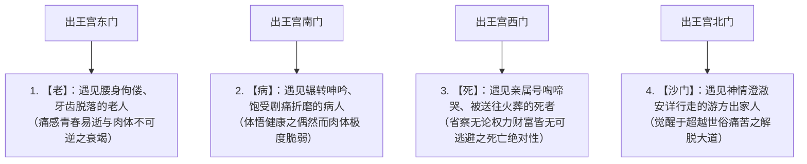

## 序论：觉者（佛陀）的诞生与人类思想史的革命

公元前6世纪至公元前5世纪，在古印度恒河流域中游爆发的思想鼎沸潮流（即所谓的“轴心时代”）之中，由乔达摩·悉达多（Gautama Siddhārtha，巴利语：Gotama Siddhattha）所开创的“佛教（Buddhism）”，从根本上颠覆了此前自吠陀、奥义书以来的古印度宗教哲学，堪称人类精神史上最为重大的理智与存在性革命。

佛陀（Buddha）并非某位特有神祇的名字，而是梵语和巴利语中意为“觉悟者”、“证知真理之人（觉者）”的普通名词。悉达多所确立的教义核心，彻底摒弃了对创造宇宙的绝对神的盲目信仰，以及婆罗门祭司阶级操弄的动物牺牲献祭与巫术仪轨，冷静而冷彻地直视“人类存在本身的结构性痛苦（苦 / Dukkha）”，以因果论彻底解构其成因，并通过自身的如实观察与实践通往最终解脱（解脱 / Mokṣa，涅槃 / Nibbāna），是一套“理法性的实践知（Episteme）”。

佛教早已远远超越了近代意义上的“宗教”范式。它是一门极其精密的认知科学、心理治疗体系、语言批判哲学与存在论现象学。本文将从乔达摩·悉达多的生平与思想转折，四圣谛、八正道、十二因缘这一教义体系的逻辑与数理构造，五蕴与无我（Anattā）的本体论剖析，巴利语早期佛典的文献学精读，直至其与现代认知神经科学、现象学及正念（Mindfulness）在深层层面的交融共鸣，以严谨的学术性与宏大的视野，全面揭示其完整体系。

```
【古印度思想史中佛教的范式转变】

┌─────────────────┬───────────────────────────────┬───────────────────────────────┐
│ 比较项目        │ 正统婆罗门教·奥义书           │ 早期佛教（乔达摩·佛陀）       │
├─────────────────┼───────────────────────────────┼───────────────────────────────┤
│ 终极实在        │ 梵（Brahman：宇宙根本原理实体 │ 法（Dharma：缘起之法理与法则）│
│ 自我（灵魂）观  │ 阿特曼（我：不灭永恒的真我）  │ 无我（Anattā：彻底否定实体我）│
│ 解脱之道        │ 梵我一如之直观·祭祀仪轨·苦行  │ 四谛八正道·中道·止观禅修      │
│ 世界观          │ 肯定并维护种姓制度（瓦尔那）  │ 否定种姓歧视·主张众生平等     │
│ 认识方法        │ 归依吠陀圣典的终极权威        │ 自内证（亲身观察验证之理智）  │
└─────────────────┴───────────────────────────────┴───────────────────────────────┘
```

---

## 1. 乔达摩·悉达多的生平与思想转折

### 1.1 释迦族王子的诞生与四门出游的震撼
乔达摩·悉达多诞生于喜马拉雅山脚下、现今尼泊尔南部的蓝毗尼，其父为统治释迦族小城邦国家迦毗罗卫城（Kapilavastu）的净饭王（Śuddhodana），其母为摩耶夫人（Māyā）。

根据传说，悉达多诞生后不久便向东南西北各行七步，宣告“天上天下，唯我独尊”。然而从历史学与文献学的视角审视，他作为当时东印度实力雄厚的部族联盟（迦纳·僧伽共和制）中的贵族（刹帝利）子弟，享受着毫无匮乏、极其优渥富足且安逸舒适的生活。净饭王极度恐惧悉达多将来出家沦为遁世修道者，特地依循三个季节（热季、雨季、凉季）为其建造了三座壮丽的宫殿，并选拔大批能歌善舞的貌美女子充斥宫闱，竭尽全力将衰老、疾病、死亡等一切人类丑恶残酷的现实从王子的视野中彻底隔绝。

然而，悉达多极其敏锐的知性与深刻的感受力，早已洞察到这一人造乐园的虚妄本质。佛传故事中著名的“四门出游”传说，正是这一实存觉醒的象征。



四门出游绝非单纯的神话寓言，它揭示了**“存在性危机（Existential Crisis）”**的普遍模型。无论一个人多么富有、权势显赫或体魄健壮，都绝对无法在哪怕一秒钟内逃脱“老去”、“患病”、“死亡”这三项绝对的实存限制。悉达多在注视他人的老、病、死时清醒地体认到：“那绝非遥远未来属于他人的偶然事件，而是此时此刻摆在自己面前无可避免的宿命。”正是这一沉痛的绝望与存在性自省，驱使他在29岁时毅然决然跨出“伟大的出离（逾城出家）”。

### 1.2 出家、师承、极限苦行及其挫折
悉达多舍弃了妻子耶输陀罗（Yaśodharā）和刚出生的儿子罗睺罗（Rāhula），毅然舍弃了作为王位继承人的全部荣耀与繁华，剃除须发，披上粗陋的袈裟，成为探求真理的“沙门（Śramaṇa / 追寻自由思想的游方修道者）”。

他最初向当时享誉盛名的两位禅定导师参学：
1. **阿罗罗·迦罗摩（Āḷāra Kālāma）**：传授“无所有处定（对‘无一物存在’之高度心念集中境界）”。悉达多在极短时间内便掌握并证得该境界，但他敏锐地察觉到，一旦从定境中出定，现实的苦恼依然会卷土重来，断定这并非究竟解脱而离去。
2. **郁陀迦·罗摩子（Uddaka Rāmaputta）**：传授“非想非非想处定（似有想又非有想、超越寻常意念之极致禅定境界）”。悉达多同样迅速达到了与导师相同的成就，但他清醒地认识到，这依然无法彻底灭尽根源性的苦，并非终极之道。

在参透了纯精神性禅定的局限之后，悉达多转而投身于企图通过极致折磨肉体来彻底根除欲望的“极限苦行（Tapas）”。在摩揭陀国的优楼频螺（Uruvelā）森林中，他与五位同修（憍陈如等五比丘）一起，修习了闭息止气、烈日暴晒、以及每日仅食一粒胡麻、一粒稻米的绝食苦行，整整持续了六年之久。

其结果是，悉达多的身躯消瘦得只剩枯骨与皮囊，胸骨如屋椽般暴突，头皮如干瘪的葫芦般皱缩，稍欲起立便颓然倒地，生命陷入濒死绝境。然而，即便置身于死亡边缘，他苦苦追寻的心灵彻底寂静与真理觉悟仍未降临。此时，悉达多达成了人类思想史上至为关键的洞见：

> **“摧残肉体的苦行，仅仅是毁坏肉身、耗竭心力，绝无法带来真正的智慧与觉悟。沉溺于感官享乐（享乐主义）固然是歧途，折磨自身肉体的苦行（苦行主义）同样是巨大的谬误。”**

悉达多果断决意彻底放弃苦行。他在尼连禅河（Nerañjarā）中洗去积聚六年的污垢与尘垢，因气力耗尽倒卧河畔时，接受了村落少女苏迦塔（Sujātā）所供养的新鲜乳糜（Pāyāsa）。甘露般的滋养流遍全身，他的体能奇迹般地得以复原。目睹这一幕的五位同修却认定“乔达摩耐不住苦行而堕落退转”，怀着鄙夷弃他而去。

```
【扬弃二边（极端）与中道（Majjhimā Paṭipadā）的发现】

沉溺享乐（世俗纵欲）  ←─────［中 道］─────→  摧残肉体（极端苦行）
（王宫中的贵族奢靡）            （真智慧与寂静）            （优楼频螺森林苦行）
※琴弦太紧则易断，太松则不鸣。唯有调弦适度，方能奏出微妙清朗之天籁。
```

### 1.3 菩提树下成道：决战魔罗与“觉者（佛陀）”的诞生
恢复体力后的悉达多，来到菩提伽耶的毕钵罗树（此后被称为“菩提树”）下，铺设吉祥草结跏趺坐，立下了磐石般坚定的誓愿：
**“我今若不证得无上正等菩提，宁使肌骨消枯粉碎，终不起此座！”**

依佛传记载，此时悉达多内心深处翻涌翻腾的一切欲望、恐惧、疑虑与执念被具象化为“魔王波旬（Māra）”，对他发起了疯狂的袭扰与进逼。
波旬首先派遣三位妖娆的魔女（贪爱、不悦、渴爱）施展百般媚态诱惑，悉达多心如止水、毫不动摇。魔王见诱惑失效，旋即调动暴风、骤雨、飞沙走石、烈火毒矢与狰狞可怖的鬼神大军，企图以滔天恐怖击溃悉达多的心智。最后，魔罗怒吼质问：“凭你这凡胎浊骨，有何资格占据这觉悟金刚宝座？谁能为你作证？”悉达多神色泰然，安详垂下右手，以手指触击大地（此即著名的“触地印 / 降魔印”）。刹那间，大地轰然震颤作响，地神现身证言：“于无量劫以来，我能证明此人为救度众生所积累的无私功德！”魔王大军瞬间溃散瓦解，悉达多内心的一切烦恼（Kilesa）荡然灭尽。

夜之初更（晚6时至10时），悉达多证得了能忆起自己无量前世记忆的“宿命通”；
夜之中更（晚10时至凌晨2时），证得了能彻见一切众生随业力（Karma）流转生死轮回之法则的“天眼通”；
夜之后更（凌晨2时至6时），拂晓的启明星在东方天际熠熠闪烁之际，悉达多从顺逆两个方向彻底观照万物依缘相待而生灭的“十二因缘（缘起之法）”，由此证得了根绝一切烦恼惑业的“漏尽通”。

至此，悉达多圆满成就无上正等正觉（Anuttara-samyak-sambodhi），超越凡庸实存，成为了**“佛陀（释迦牟尼世尊）”**。时年35岁。

### 1.4 梵天请法与初转法轮：从沉默到世界宗教的飞跃
成道证悟之后，佛陀陷入深沉的哲思，对是否将自己所证知的正法（Dharma）公之于世产生了迟疑。“我所证悟的法，深奥微妙、极难解见、超乎思量，唯有智者方能领会。世间凡夫深陷贪欲爱执的厚重泥沼，纵使宣说，恐徒遭毁谤困惑，虚耗精力而已。”佛陀一度萌生不说法而径入涅槃之念。

相传此时，古印度神话中的最高神祇大梵天（Brahmā）从天界降临，跪伏于佛陀座前，双掌合十，三次热切哀请弘法，史称**“梵天请法（梵天劝请）”**：
“世尊！祈请开演甘露法门！世间众生之中，亦有利根少垢、心性明净之人。彼等若不得听闻妙法，便将随波沉沦；若得闻法，必能悟入真理。”

佛陀遂以大悲之眼观照世间。他洞察到，犹如池塘中盛开的莲花，有的深陷泥水之中，有的贴近水面，亦有的超脱淤泥、亭亭玉立于水面之上，众生在根基慧度上存在着种种差异。佛陀决意打破沉默，开启法门：

> **“不死之门今已敞开。有耳能听者，当生净信，倾听妙法！”**

为了寻访当年离弃自己的五位同修，佛陀顶风冒暑，徒步数百公里赶往萨尔纳特（鹿野苑）。远远望见佛陀威仪具足、神采奕奕的身姿，五人原本暗中约定“决不理睬、不为迎候”，却被佛陀那庄严安详的圣者气象彻底震撼，身不由己地纷纷起立相迎，浣足敷座，恭敬礼拜。

佛陀在鹿野苑面对五比丘，开演了人类思想史上具有划时代意义的首次宣法——**“初转法轮（转动正法之轮）”**。在此处所开示的核心要义，正是“中道”、“四圣谛”与“八正道”。闻法之际，年资最长的憍陈如当即证得“凡有生起之法，皆必定归于坏灭”的真理，开启了清净的法眼。至此，由佛（导师）、法（真理）、僧（修道实践共同体——僧团）构成的“三宝”正式在世间确立。

---

## 2. 佛教教义之核心：四圣谛（Cattāri Ariyasaccāni）的逻辑结构

佛陀的教义绝非神秘莫测的神秘主义教条，亦非盲从的宗派信仰，而是将古印度医学体系（阿育吠陀）中“诊断病情、追查病因、确立痊愈状态、开具对症处方”的科学逻辑结构，天衣无缝地运用于心灵与精神领域的**“存在性临床医学”**。其根本理论架构即为“四圣谛（四项神圣的真理）”。

```
【医学治疗模型与四圣谛的结构同构性】

┌─────────────────┬───────────────────────────────┬───────────────────────────────┐
│ 医学临床诊断模型│ 佛教之四圣谛                  │ 具体内容与存在性意义          │
├─────────────────┼───────────────────────────────┼───────────────────────────────┤
│ 1. 诊断识别病情 │ 苦谛（Dukkha-sacca）          │ 人生之实存本质是“苦”（不满意│
│ 2. 查明致病病因 │ 集谛（Samudaya-sacca）        │ 苦之根源在于“渴爱（Taṇhā）” │
│ 3. 确立康复状态 │ 灭谛（Nirodha-sacca）         │ 渴爱断尽之境＝涅槃（Nibbāna） │
│ 4. 开立治疗处方 │ 道谛（Magga-sacca）           │ 导向涅槃之实践法门＝八正道    │
└─────────────────┴───────────────────────────────┴───────────────────────────────┘
```

### 2.1 苦谛（Dukkha-sacca）：实存的结构性“不满意性”
当佛教宣告“一切皆苦（Sabbe saṅkhārā dukkhā）”时，此处所谓的“苦（Dukkha）”，绝非单纯指肉体层面的疼痛或情感上的悲伤与不幸。
巴利语中 *dukkha* 一词的原意，指车轴孔（kha）产生偏斜扭曲（du），使得车轴与车轮无法平顺咬合，导致车轮转动时颠簸轧砾、无法如意顺畅运转的状态。换言之，**“无法如己所愿”、“根本性的不满意性、失调与不圆满”**，才是“苦”的深刻哲学本质。

早期佛教将人生中所遭遇的实存困顿，极其严密地概括为“四苦八苦”：

1. **生苦（Jāti）**：诞生与存活延续本身所蕴含的痛苦。
2. **老苦（Jarā）**：肉体与智能不可抗拒地衰微退化的痛苦。
3. **病苦（Byādhi）**：受制于生理疾患侵蚀折磨的痛苦。
4. **死苦（Maraṇa）**：面对肉体崩解与存在湮灭之恐惧的痛苦。
5. **爱别离苦（Piya-vippayoga）**：与挚爱之人、所执之物不可避免发生分离的痛苦。
6. **怨憎会苦（Appiya-sampayoga）**：与厌恶之人、仇怨之境不得不相逢共处的痛苦。
7. **求不得苦（Yampicchaṃ na labhati tampi dukkhaṃ）**：欲望炽盛却欲求未遂、无法满足的痛苦。
8. **五取蕴苦（Pañcupādānakkhandhā dukkhā）**：对构成自我的五种身心要素（五蕴）产生执念所引发的综合性痛苦。

### 2.2 集谛（Samudaya-sacca）：苦的生成机制与“渴爱”
痛苦既然真实存在，其背后就必然存在催生痛苦的“起因”。集谛清晰地指出，一切痛苦的源头在于**“渴爱（Taṇhā / 梵语：Tṛṣṇā）”**。
渴爱字面意义即为“极度干渴”，它好比行进在酷烈荒漠中濒临渴死之人疯狂觅水一般，是一种针对外境对象所产生的狂暴欲求、强烈执取与绝不放手的盲目心理冲动。

佛陀将渴爱解构为以下三种基本形态：
- **欲爱（Kāma-taṇhā）**：对眼、耳、鼻、舌、身等感官器官所诱发的感官愉悦之渴求。
- **有爱（Bhava-taṇhā）**：执求个体生命恒常存续、渴望长生不死、企图无限扩张权力名望的生存执念（对生的执取）。
- **无有爱（Vibhava-taṇhā）**：在承受剧烈痛苦绝望时企图自我了断、渴望身心彻底湮灭消失的虚无冲动（对死的逃避欲）。

渴爱的恐怖之处在于其“自我强化的成瘾机制”。它正如通过饮用盐水来解渴，愈饮则喉舌愈发枯焦，渴意愈甚，从而将人类生灵牢牢禁锢在无始无终的痛苦轮回之中。

### 2.3 灭谛（Nirodha-sacca）：苦的彻底消解与“涅槃”
正如彻底拔除病根则顽疾自愈，当痛苦的根本诱因——渴爱被彻底平息灭尽时，存在着一种超越束缚的心灵境界。此即灭谛，亦即佛教的终极归宿——**“涅槃（Nibbāna / 梵语：Nirvāṇa）”**。

“涅槃”的词根由“吹灭（Nir + vā）”构成。其本义是指将贪（贪欲）、嗔（嗔恚）、痴（愚痴无明）这三团炽烈燃烧的毒火彻底吹熄灭尽，使心灵归于澄澈、凉爽、恒久而安宁的祥和境地。涅槃并非某种在肉体死亡后方能进入的死后天国，而是**“于此时此刻、在当下现世之中，从一切烦恼障缚中彻底获得解脱的绝对自由境界”**。

### 2.4 道谛（Magga-sacca）：通达涅槃的具体处方“八正道”
能够切实灭除痛苦、最终通往涅槃彼岸的实践途径，便是道谛，亦即**“八正道（Ariyo aṭṭhaṅgiko maggo）”**。八正道由八项具体的修持纲目所构成，传统上被统一统摄在“戒（伦理道德）、定（专注定力）、慧（真理智慧）”之“三学”架构之内：

```
【八正道的结构与三学（戒·定·慧）的对应关系】

┌───────────────┬───────────────────────────────┬───────────────────────────────┐
│ 三学归类      │ 八正道具体条目                │ 实践定义与核心功能            │
├───────────────┼───────────────────────────────┼───────────────────────────────┤
│ 慧学（智慧）  │ 1. 正见（Sammā-diṭṭhi）       │ 如实照见四谛、缘起与因果法则  │
│               │ 2. 正思维（Sammā-saṅkappa）   │ 远离贪求与恶意，生起清净思维  │
├───────────────┼───────────────────────────────┼───────────────────────────────┤
│ 戒学（伦理）  │ 3. 正语（Sammā-vācā）         │ 戒除妄语、恶口、两舌、绮语    │
│               │ 4. 正业（Sammā-kammanta）     │ 戒绝杀生、偷盗、邪淫等身业恶行│
│               │ 5. 正命（Sammā-ājīva）        │ 远离贩卖军火毒物等，清净谋生  │
├───────────────┼───────────────────────────────┼───────────────────────────────┤
│ 定学（禅定）  │ 6. 正精进（Sammā-vāyāma）     │ 断除恶法、生起护持善法的努力  │
│               │ 7. 正念（Sammā-sati）         │ 于当下如实客观觉察身受心法    │
│               │ 8. 正定（Sammā-samādhi）      │ 心注一境，证入四禅八定之深寂  │
└───────────────┴───────────────────────────────┴───────────────────────────────┘
```

八正道绝非孤立割裂、线性先后展开的阶段，而是好比车轮上的八根辐条，彼此紧密维系、互为因果支撑的有机运作系统。由正见确立对万法实相的如实洞察，由戒学（正语、正业、正命）净化现实言行与身心环境，再由定学（正精进、正念、正定）磨砺澄澈敏锐的觉察力，进而促使正见向更深维度升华，最终引导行者达致彻底的究竟解脱。

---

## 3. 本体论之深渊：十二因缘（缘起说）与五蕴盛苦

### 3.1 缘起说（Paṭicca-samuppāda）：佛陀的最高发现
在佛陀的全部教义中，哲学深度最为渊博、并将佛教与其他一切古今思想流派判然区分开来的根本基石，正是**“缘起（Paṭicca-samuppāda / 梵语：Pratītyasamutpāda）”**。
所谓缘起，意指“依托条件（缘）而生起（Dependent Origination / 彼此相待依附而显现）”。

佛陀在巴利三藏中，将缘起的普遍理则概括为极为凝练且具备数理公理般美感的命题：

> **“此有故彼有，此生故彼生；**
> **此无故彼无，此灭故彼灭。”**
> （《相应部·因缘相应》）

世界上所存在的一切现象（物质、心识、生命、社会），皆非能够独存、自足存在的“绝对实体”。一切无非是在无穷无尽的原因（因）与条件（缘）错综交织的网络（因陀罗网）之中，所形成的暂态现象。宇宙中绝不存在超然独立的造物主，不存在永恒不变的神祇，亦不存在作为终极开端的原初第一因。条件聚合则现象显现，条件离散则现象寂灭——这便是贯穿宇宙法界的恒常法则（法 / Dharma）。

### 3.2 十二因缘（十二支缘起）的连锁结构
在菩提树下成道的静夜中，佛陀将众生为何陷入老病死之痛苦煎熬并深陷轮回应报的因果流转链条，彻底梳理为十二个前后相续的环节（十二因缘）。

```mermaid
graph LR
    A["1. 无明<br/>（Avijjā）"] --> B["2. 行<br/>（Saṅkhāra）"]
    B --> C["3. 识<br/>（Viññāṇa）"]
    C --> D["4. 名色<br/>（Nāmarūpa）"]
    D --> E["5. 六处<br/>（Saḷāyatana）"]
    E --> F["6. 触<br/>（Phassa）"]
    F --> G["7. 受<br/>（Vedanā）"]
    G --> H["8. 爱<br/>（Taṇhā）"]
    H --> I["9. 取<br/>（Upādāna）"]
    I --> J["10. 有<br/>（Bhava）"]
    J --> K["11. 生<br/>（Jāti）"]
    K --> L["12. 老死<br/>（Jarāmaraṇa）"]
```



```
【十二因缘各支与人类存在的心理学展开】

1. 无明（Avijjā）：根本愚痴盲目。对四谛、缘起与无我之实相缺乏如实认知。
2. 行（Saṅkhāra）：基于无明盲动生起的意志造作、潜在心理构造力、业力驱动。
3. 识（Viññāṇa）：对境辨析之认知机能、结生识（维持生命相续之识流）。
4. 名色（Nāmarūpa）：精神要素（名）与物质肉躯（色）之和合体＝胚胎形成。
5. 六处（Saḷāyatana）：六种感觉器官（眼、耳、鼻、舌、身、意六根）。
6. 触（Phassa）：感觉器官（根）、外界对象（境）与认知心识（识）之三者接触。
7. 受（Vedanā）：由三者接触所诱发之情感感受作用（苦受、乐受、不苦不乐受）。
8. 爱（Taṇhā）：对乐受贪恋追逐、对苦受憎恶抗拒之强烈渴求冲动。
9. 取（Upādāna）：受渴爱驱使，将对象执为己有、顽固抱持之强烈执取。
10. 有（Bhava）：因顽固执取而铸造之生存模式与潜在业力集聚。
11. 生（Jāti）：随顺业力感召、作为独立个体再次投生受胎。
12. 老死（Jarāmaraṇa）：受生之后必然招致之机能衰朽、忧悲苦恼直至死亡。
```

十二因缘最为振聋发聩之处，在于佛陀指明了老死等一切苦难的终极元凶乃是**“无明（认识上的无知）”**。
更为重要的是，这一因果链条是可以被“逆向瓦解”的：
通过般若智慧彻底破除灭尽无明，则妄动之“行”随之灭尽；“行”灭则“识”灭；“识”灭则“名色”灭……最终，执取灭尽，生死相续断绝，老死忧悲苦恼这整座巨大的苦聚大厦便从地基上轰然倒塌（即所谓的“还灭门”）。在佛教的视界中，从痛苦中获得救赎，绝非仰赖外在超自然神力的奇迹或恩赐，而是建立在对认知根本转向（智慧）的逻辑必然性之上。

### 3.3 五蕴（Pañca-khandhā）：人类存在的解构
究竟何为“我”？
佛陀断然拒绝将人视为具有单一、永恒、不变实体（灵魂）的存在，而是将人解构（Deconstruction）为五种相续变迁的基本要素之聚合体——**“五蕴（Pañca-khandhā）”**。

1. **色蕴（Rūpa）**：物质性的肉体躯干、感知器官以及外界的物理客观对象。
2. **受蕴（Vedanā）**：六根与外境接触时所产生的情感印记与感受反应（乐受、苦受、舍受）。
3. **想蕴（Saññā）**：对感知对象进行概念提炼、名相标定、记忆比对之表象认知功能。
4. **行蕴（Saṅkhāra）**：意志意图、心理冲动、动机欲求等推动心识朝向特定方向运作的动态形成力。
5. **识蕴（Viññāṇa）**：对上述种种过程加以总摄统合、进行辨识与知觉的纯粹心识知觉流。

佛陀曾向弟子们反复设问：“诸比丘，五蕴之中的每一蕴，是永恒常住的，还是无常变易的？”弟子答：“是无常的，世尊。”“若是无常之法，是苦还是乐？”“是苦，世尊。”“既然是无常、是苦、是败坏变易之法，那么，若认为‘这是我的所有，这就是我，这就是我永恒的真我（阿特曼）’，这是否妥当如法？”弟子答：“绝非妥当，世尊。”

所谓的人，不过是这五种身心要素在极高速度下飞速生灭、瞬息交互作用的动态**“演历过程（Process）”**。正如车轮、车轴、车厢等构件依特定方式拼合组装在一起时，方才假名为“车”，所谓的“人”与“自我”，亦不过是强加给五蕴聚合之流的便利假名而已。

---

## 4. 无我（Anattā）的哲学：实体我的解构与存在性自由

### 4.1 无我（Anattā） vs 奥义书的阿特曼（我）
在早期佛教思想中，最具革命性锋芒、却也最容易遭受世俗误解的概念，莫过于**“无我（Anattā / 梵语：Anātman）”**。

当时古印度的正统主流思想（奥义书哲学）宣称：“即便肉体与情感如过眼云烟般变迁消亡，在生命至深幽微处，依然永恒驻留着一个绝对不死、不可毁灭的真我（阿特曼 / Ātman）。”奥义书进而断言，唯有直观证悟这一内在真我与宇宙终极本体（梵 / Brahman）完全合一（梵我一如），才是唯一的解脱路径。

与之针锋相对，佛陀悍然宣示“诸法无我（Sabbe dhammā anattā）”，从根基上彻底否定了任何恒常实存的阿特曼。
佛陀的逻辑论证极度冷峻而明澈：
倘若某种事物确乎是“我的真我（我之所有）”，那么它就必须完全服从于我的主观意志所支配掌控。我们能否向自己的肉身下令：“我的肉身啊，切莫衰老，切莫染病！”它会遵从吗？我们能否强令自己的情感与念头在每分每秒间都丝毫不爽地如我们所愿运转？绝无可能。何以故？因为它们完全是依托因缘条件而身不由己、自生自灭的瞬息现象。把完全无法受自己随心所欲支配的事物认作“我”，纯属荒诞的妄想。因此，在五蕴的身心剖析之中，无论如何追索，也绝不可能找到一个恒常不变的固定实体之“我”。

```
【阿特曼实体论与佛教无我论的认识论对峙】

■ 奥义书的实体论（阿特曼 / 梵我）
坚信在肉体、情绪、思维的背后，
安坐着一个永恒、不灭、纯粹的“终极观察者与灵魂实体（真我）”。
※本欲追求“灵魂解脱”，其结果却反向陷入强化“对自我的顽固执着”之泥潭。

■ 早期佛教的现象论·过程论（无我 / Anattā）
唯有肉体、感受与心念依循因果规律川流不息，
其背后绝无超然独立的“观察者实体”。“唯见所行之业，未见行事之人”。
※通过彻底解构“我”这一固着幻象，从而从根基上斩断一切执念烦恼之源。
```

### 4.2 三法印与四法印：宇宙的普遍真理
被奉为佛教正统真伪试金石的根本标识，即是“法印（真理之烙印）”。它们揭示了一切造作万物与实存现象的终极真相：

1. **诸行无常（Sabbe saṅkhārā aniccā）**：
   凡是由因缘造作和合而成的万物（行 / Saṅkhāra），无一不在刹那生灭、迁流不息。在宇宙法界各处，绝不存在任何绝对静止恒常的僵死状态。
2. **诸法无我（Sabbe dhammā anattā）**：
   不仅限于受因缘造作的有为法，包括无为法（如涅槃）在内的一切法（Dhammā），皆无独立、固有、恒常不变的主宰实体（我）。
3. **涅槃寂静（Nibbānaṃ santaṃ）**：
   彻底彻悟无常与无我，将渴爱执着的烈火全盘熄灭之后的心境，是绝对的静谧安宁与清凉和平。
4. **一切皆苦（Sabbe saṅkhārā dukkhā）**：
   将变幻无常之物妄执为永恒，将虚妄无我之相执取为“真我”，因这种错乱执着，一切世间造作现象皆显现为“苦”（在三法印基础上增添一切皆苦，合称四法印）。

必须再三强调，无我绝非走向万念俱灰的“虚无主义（Nihilism）”。佛陀对于主张“人死如灯灭、万事归空无”的断见（断灭论），与主张“灵魂常恒不死”的常见（永恒论），皆视作危险极端的偏见而严厉斥责驳斥。无我之旨，在于“不被虚构的凝固实体所绑架，直面当下生命如实流淌的真切事实，从而彻底从贪着狂乱中赢得大自由”。

---

## 5. 早期佛典的文献学解读与僧伽形成

### 5.1 巴利语经典的成立史与结集（Saṅgīti）
佛陀生前未曾留下哪怕半行亲笔书写的文字记载。在古印度传统中，神圣高妙的智慧从来不依托易朽的文字，而是依靠师徒之间严谨苛刻的“口耳相传（唱诵记忆）”予以原样代代传承。

当佛陀以80岁高龄在拘尸那揭罗（Kusinārā）示寂归于完全解脱（大般涅槃 / Mahāparinibbāna）之后，为防止正法散失偏颇，在摩揭陀国首都王舍城（Rājagaha），由长老板摩诃迦叶（Mahākassapa）召集发起，五百位阿罗汉尊者齐聚一堂。此即佛教史上具有奠基意义的**“第一次结集（第一次集结 / Saṅgīti，意为合诵、齐声宣诵）”**。

```
【第一次结集中两大文献传承的确立】

1. 经藏（Sutta Piṭaka）之结集诵出
   · 口诵宣说者：阿难（Ānanda / 佛陀堂弟，随侍佛陀25年，闻法最多之“多闻第一”）
   · 开篇定型语式：“如是我闻（Evaṃ me sutaṃ / 我就是这样听佛陀宣说的）”
   · 核心内容：佛陀在各地因应不同众生根基特质所开示的对话法宝汇编。

2. 律藏（Vinaya Piṭaka）之结集诵出
   · 口诵宣说者：优波离（Upāli / 贱民理发师出身，对禁戒法度了如指掌之“持律第一”）
   · 核心内容：出家行者（比丘与比丘尼）必须恪守的清规戒条、僧团治理裁决规章与惩戒条例。
```

历经数百年传承与僧团内部的历史分化（根本分裂），至公元前1世纪前后，斯里兰卡岛遭遇南印度泰米尔人兵燹侵袭与严重饥荒，僧众锐减。为免口耳相传的正法随高僧凋零而断绝，僧人们在阿鲁维哈拉石窟首次将巴利语口传三藏整套刻录在贝多罗树叶（贝叶）之上。此即完整流传至今的**“南传巴利三藏（Tipiṭaka / 经藏、律藏、论藏）”**。

### 5.2 最古层佛典：《经集》与《法句经》的思想
当代佛教文献学巨擘（中村元、埃德温·阿诺德、T.W.里斯·戴维兹等）借由严密的语源学与比较文本分析证实，在巴利三藏中，保留了极其古老语言形态（古风期 Archaic Pali）的文本属于佛教的最古层。其典型代表当推《经集（Sutta Nipāta）》的第四品“义品（Aṭṭhakavagga）”与第五品“彼岸道品（Pārāyanavagga）”，以及脍炙人口的《法句经（Dhammapada）》。

在这些最古老的佛典字里行间所呈现的佛陀形象，并非后来大乘经籍中周身光芒万丈、被无数天人菩萨重重簇拥的超自然神化主宰，而是一位身着褴褛百衲衣、手托陶钵、孤身穿行于旷野荒原的真切智者与脚踏实地的哲人。

> **“如犀牛之角，独自漫步。”**
> （《经集》第一品第3章）
> 结交同伴必生亲昵爱染，依循爱染必招痛彻之苦；超拔于世俗之争辩与虚荣浮华，清净自制，如犀牛独角般安然独行。

> **“怨怨相报，终不可歇；**
> **唯怨止息，此为恒法。”**
> （《法句经》第5偈）

在这一最古老的文献地层中，佛陀毫不犹豫地将种种抽象晦涩的形而上学玄想（如著名的“十四无记”：“宇宙有边还是无边？”“肉体与灵魂是同一还是相异？”“佛陀死后是否存在？”）斥为荒唐无益的“戏论”。正如著名的“毒箭之喻”所深刻揭示的：当一个人被毒箭射中剧痛濒死时，当务之急绝非盘问追查“射箭者姓甚名谁、出身何种阶级、箭杆取自何种木材、箭羽用何种飞禽之羽”，而是立刻拔出剧毒之箭，施药救命！佛陀的目光自始至终精准钉在“如何彻底解救现实中正在遭受痛苦煎熬的活生生之人”这一终极关怀之上。

### 5.3 早期僧伽的治理工学：波罗提木叉与全员一致自治民主

佛陀亲手创建的修行者团体“僧伽（Saṅgha）”，绝非单纯的盲信崇拜组织，而是人类历史上最早出现的**“彻底的直接民主制与协同自治共同体”**。

在种姓制度壁垒森严、专制君主强权（如摩揭陀国、拘萨罗国）狂暴扩张的古印度现实世界中，佛陀的僧伽奇迹般地缔造了一座不可思议的平等绿洲。任何生命一旦迈入僧团山门，无论是刹帝利王侯、婆罗门祭司、吠舍商贾，亦或是社会最底层的首陀罗乃至不可接触者（旃陀罗），其原本世俗社会的一切身份特权与阶级烙印皆被彻底剥离粉碎，唯一的尊卑秩序仅依据“受戒出家之先后时序”而定。昔日出身微贱的剃头匠优波离由于率先受戒，释迦贵族出身的高傲王子们（阿那律、阿难等）必须伏身跪拜在优波离脚下向其行礼致敬——这一幕将僧团内颠覆性的激进平等体现得淋漓尽致。

```
【早期僧团自治治理系统与合议制法理】

1. 羯磨（Kamma）：最高决策权之全员一致同意制
   · 僧团内一切重大法务（新人度牒受戒、戒律违犯审判、寺产僧物分配等），皆须在全员齐聚的大会上通过民主协商决定。
   · 提案动议提出后，主事法师必须连续三次高声询问全场“大众有无异议”，直至全场肃穆静默（无异议）方得正式通过（此即“白四羯磨”）。只要有一人提出合法正当的反驳，决议即告流产。

2. 布萨（Uposatha）：半月一度的集体反省与纯洁自净
   · 于新月与满月之夜（每半个月一次），全体清净比丘齐聚一堂，由长老逐条唱诵共227条戒律纲目（波罗提木叉 / Pātimokkha）。
   · 僧人当众坦白发露自身微小过失（忏悔），重获戒体清净。欺瞒、掩盖与伪饰被视为极恶禁忌。

3. 自恣（Pavāraṇā）：雨季结夏安居圆满之际的相互批评评议
   · 在为期三个月的雨季安居结束之日，修道者之间彼此诚挚拜托：“诸位同修，若见我、闻我、疑我有何过失，祈请怀慈悲之心坦率指出，我见即当悔过改正。”以极其谦逊温厚的胸怀接纳大众的批评。
```

尤为值得历史学与社会学大书特书的是，在养母摩诃波阇波提（大爱道瞿昙弥）等杰出女性的再三诚恳请愿下，佛陀打破了古印度乃至整个古代欧亚大陆的铁律，正式批准创立了**“比丘尼僧团”**。在那个女性被视作父兄丈夫之依附附属物的古代蛮荒岁月，佛陀在制度上公开承认女性拥有与男性完全平等的解脱潜能与证得最高阿罗汉果位的权力，并允许女性自主自治管理比丘尼社群。这一壮举在人类宗教史与性别平权史上留下了无比光辉的划时代篇章。

---

## 6. 早期佛教向阿毗达磨与大乘佛教的结构转型

### 6.1 阿毗达磨（论藏）佛教：存在的极微分析与哲学建构
佛陀入灭数百年后，僧团发生部派分立，分化为稳健保守的上座部与激进革新的大众部（根本分裂），其后进一步衍生繁衍出二十个支派（部派佛教时期）。

在此阶段，各派学僧为了将佛陀散见各处的言教严密化、逻辑体系化，构筑了卷帙浩繁的哲学注疏大厦。这便是“阿毗达磨（Abhidharma / 对法，即对法义的系统性研究）”。特别是雄踞北方一带的说一切有部（Sarvāstivāda），将宇宙万有解构为不可再分的基本元素（法 / Dharma / 极微），建构了包含“五位七十五法”的惊人精密认知与本体论体系，主张“法体恒有，三世常在”。

然而，阿毗达磨的发展逐渐滑向了过度繁琐经院哲学的深渊。出家僧侣们蜷缩于幽闭的精舍之中，日复一日地沉溺于微言大义的概念推演，日益脱离了劳苦大众的鲜活血泪与现实救济，使佛教退化为少数僧侣精英的“象牙塔”。

### 6.2 大乘佛教（Mahāyāna）的革命：自利利他与空性（Śūnyatā）
公元纪元前后，在广大在家族群与具有改革魄力的革新派僧人之间，掀起了一场席卷四方的思想革命运动。他们痛斥部派佛教只顾自身脱离苦海的独善其身为狭隘的“小乘（Hīnayāna）”，毅然高擎以普度一切众生为宏誓愿景的广阔舟楫——**“大乘（Mahāyāna）”**旗帜。

```
【部派佛教（早期佛教流变）与大乘佛教的范式对比】

┌─────────────────┬───────────────────────────────┬───────────────────────────────┐
│ 比较维度        │ 部派佛教（阿毗达磨时期）      │ 大乘佛教（Mahāyāna）          │
├─────────────────┼───────────────────────────────┼───────────────────────────────┤
│ 崇高理想人格    │ 阿罗汉（求取自身烦恼灭尽出离）│ 菩萨（上求菩提，下化众生）    │
│ 行持实践性格    │ 侧重自利（通过苦行静虑自内证）│ 自利利他圆融（救度众生即解脱）│
│ 哲学逻辑核心    │ 五位七十五法·法体实有论       │ 缘起性空（Śūnyatā）·中观·唯识 │
│ 救度普摄范围    │ 严守出家戒律之少数僧伽精英    │ 一切众生悉有佛性（万姓成佛）  │
│ 奠基代表经典    │ 阿含经·南传巴利三藏          │ 般若经、法华经、华严经、净土经│
└─────────────────┴───────────────────────────────┴───────────────────────────────┘
```

奠定大乘佛教深邃哲学基石的中观派鼻祖龙树（Nāgārjuna，约2–3世纪），在其经典名著《中论》中将早期佛教的“缘起”推演至终极辩证法高度，确立了**“空（Śūnyatā / 空性）”**的哲学大厦。
龙树指出：万事万物皆是依托因缘而假立显现，因此一切法绝无任何独立自存的实体性（无自性 / Asvabhāva）。“无自性”即是“空”。“空”绝非断灭的顽空或无底的虚无，相反，正因为诸法本性为空、不具有顽固不变的僵死自性，万物方能展现出无限生成、发展、转化与相互关联的生机活力。

由此，早期佛教的“无我与缘起”，在大乘佛教中波澜壮阔地演进为“空性”、“同体大悲”、“万法唯识”以及“如来藏”，并跨越葱岭沙漠，经由中亚西域传入中华大地，继而播迁至朝鲜半岛与日本，塑造了浩瀚辉煌的东亚文明景观。

---

## 7. 与现代思想、认知科学与正念的深层对话

### 7.1 认知行为疗法（CBT）与佛教的结构同构性
当代临床精神医学界的黄金标准治疗模式——认知行为疗法（CBT），尤其是阿伦·贝克（Aaron Beck）的认知疗法与阿尔伯特·艾利斯（Albert Ellis）的理性情绪行为疗法（REBT），与佛陀两千五百年前提出的四圣谛体系展现出了震撼人心的结构同构性。

现代认知科学指出：“使人类深陷痛苦泥淖的，从来不是客观事件本身，而是人类自身对客观事件所持有的‘负面认知歪曲（自动化思维与潜意识图式）’。”这恰与佛陀在《箭经（Salla Sutta）》中开示的**“第二支箭”**之寓言完全暗合：

> 在人世间，凡夫遭遇肉体痛楚或客观挫折，此即命中的“第一支箭”，这是任何有生之命皆无可避免的现实。
> 然而，未受心智训练的无明凡夫，旋即在内心疯狂抱怨：“为何偏偏是我？我完蛋了！天地待我不公！”在震怒、惶恐与自怨自艾中，亲手将“第二支箭”乃至无数支恶念之箭狠狠刺入自己的心房，使内心的煎熬呈几何倍数暴增。
> 具足明见智慧的行者，即便身中第一支现实肉身之箭，心念却如如不动，绝不把第二支箭刺向自己。

佛教的正念内观禅修（Vipassanā），正是一套旨在精确剥离第一支箭（纯粹客观的感觉输入）与第二支箭（由妄念引发的恶性自动化连锁情绪反应）、从而果断阻断第二支箭生成机制的心灵认知工程学。

### 7.2 正念（MBSR）的诞生与脑神经科学验证
1979年，麻省理工学院生物分子学博士、马萨诸塞大学医学院教授乔·卡巴金（Jon Kabat-Zinn），剔除早期佛教修习法门“念（Sati）”之中的宗教神学外壳与地域文化附着，将其改造为规范化、可量化复现的临床现代医学干预范式——**“正念减压疗法（MBSR）”**。

正念被严谨界定为：**“在此时此刻，以不带任何主观评判的姿态（Non-judgmental），有意识地将清醒的觉察投注于当下的身心体验。”**

```
【现代正念禅修冥想与大脑神经环路的结构重塑】

［默认模式网络（DMN）的过度亢进］
· 大脑内侧前额叶皮层、后扣带皮层高度活跃
· 陷入反刍沉溺：对过去的悔恨、对未来的焦虑、对自我的顽固执念在脑海中死循环
· 疯狂空耗大脑基础能量的60%至80%，成为诱发抑郁症、焦虑症与慢性耗竭的精神温床
  ↓
［正念禅修的如实修持（Sati·专注于呼吸与当下感知）］
· 激活注意力控制网络（背外侧前额叶皮层、前脑岛）
· 显著抑制默认模式网络（DMN）的过热运转，使失控的脑部内耗平息止歇
  ↓
［大脑构造的实质重塑（神经可塑性 / Neuroplasticity）］
· 恐惧应激中枢杏仁核（Amygdala）体积缩小、应激过敏性显著降低
· 海马体（记忆与情绪稳定中枢）及前额叶皮层的灰质密度与厚度显著增加
· 情绪自主调节力、专注力和主观幸福感获得质的飞跃
```

借助当代最为前沿的功能性磁共振成像（fMRI）与脑电波（EEG）研究，认知脑神经科学正在以前所未有的实证数据雄辩地证实：两千五百年前佛陀在菩提树下所亲身开辟的“内观（Vipassanā）”实证经验，能够切实行之有效地平息大脑自我指涉的杂乱神经网络（DMN），驯服负责制造恐惧与惊恐的杏仁核，在物理物质层面上直接重构优化人类大脑的情感调节生理神经环路。

### 7.3 现象学、生成认知论与解构主义的共鸣：瓦雷拉与德里达
在理论哲学的崇高殿堂中，早期佛教的缘起论与无我论，亦与20世纪下半叶以来的西方最前沿思潮产生了极具震撼力的交相辉映。

杰出的智利认知生物学家与哲学家弗朗西斯科·瓦雷拉（Francisco Varela）与其合作者，在经典跨学科里程碑著作《具身心智（*The Embodied Mind*, 1991）》中，创造性地熔铸了认知科学、梅洛-庞蒂身体现象学以及早期佛教的“中道五蕴论”。瓦雷拉明确论证指出：所谓认知，绝非大脑如同照相机镜子一般单向被动地映射一个外在固定的客观世界；相反，认知是有机体凭借具有生理结构的身体，在与生存环境长期的能动交互作用中，彼此依存共同涌现构造世界的**“具身生成（Enaction）”**演进历程。这无疑是早期佛教所奠定的“名色与识互为因缘而生起”这一古老深奥智慧在当代认知哲学语境下的辉煌复兴。

不仅如此，法国后结构主义旗手雅克·德里达（Jacques Derrida）所发起的“解构（Deconstruction）”哲学运动，其旨在彻底粉碎西方自柏拉图以来根深蒂固的“在场形而上学（对不变终极实体与终极真理的迷恋神化）”，其批判逻辑的严谨与冷彻，与佛陀将所谓的“我（阿特曼）”这一幻觉无情拆解归为五蕴相依之缘起的无我辩证法，具有令人惊叹的内在亲缘性。现代西方思潮历经千百年曲折摸索才终于达到的去中心化、反本质主义批判之极境，早在公元前5世纪，便已被恒河畔那位静默的东方行者用双脚与心神彻底踏破勘平。

---

## 8. 结论：达摩（法）的普遍性与当代生命的觉醒智慧

乔达摩·悉达多留在人类文明苍穹中最崇高、最宝贵的遗产，从来不是供人顶礼膜拜的泥塑偶像，亦非让人望而生畏的神秘禁条，而是那一篇唤醒人类自立觉悟的终极箴言：**“自以为灯，自以为靠；以法为灯，以法为靠。”**

在行将离世的最后时刻，面对悲痛难当、泣不成声的至爱侍者阿难，佛陀在《大般涅槃经》中留下了佛教史上最为壮烈峻拔的临终嘱托：

> **“阿难！是故汝等当自为洲渚（自为明灯），自作归依，莫归依他人；**
> **当以法为洲渚（以法为明灯），以法为归依，莫归依其他！”**
> （*Attadīpā viharatha attasaraṇā anaññasaraṇā, dhammadīpā dhammasaraṇā anaññasaraṇā*）

佛陀至死都在断然拒绝一切形式的人格神化与盲目崇拜。他自身亦曾是一位经历过生老病死深重痛苦的战栗、彷徨、探索与绝望挣扎的血肉之躯。他为众生指明的大道，绝非匍匐祈求神祇拯救的“他力祈福”小道，而是一条凭借人类自身的理智、冷静客观的自省观察，如实照破心识深处的无明盲目与偏执羁绊，以坚实的双足迈向心灵永恒自立与完全自由的觉醒坦途。

在21世纪的今天，面对信息洪流的疯狂轰炸、永无止境的经济内卷重压、社交网络引发的情感焦虑与认同地狱，以及遍布全球的分裂、对抗与战火威胁，现代人正承受着人类历史上前所未有的强烈“渴爱（Taṇhā）”与“存在性危机（Dukkha）”。

正因如此，我们比以往任何时代都更为迫切地需要重新回归菩提伽耶那座静谧安详的菩提树下。
远离尘嚣的虚妄喧嚣，深沉平稳地凝视自己的每一次呼吸，以无分别的正念觉照自己变幻无常的肉体与念头，彻底放下一切计较、抗拒与执念。在那份万籁俱寂的深沉澄明之中，那份不可撼动、不依外物的**“真正的自由、安详与永恒和平（涅槃）”**，正在每一个生命的当下，向我们赫然敞开。
