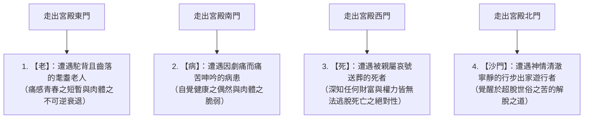

## 序論：覺者（佛陀）的誕生與人類思想史的革命

西元前6世紀至西元前5世紀，在古代印度恆河中游所爆發的思想激盪（即所謂「軸心時代」）中，由喬達摩·悉達多（Gautama Siddhārtha，巴利語：Gotama Siddhattha）所開拓的「佛教（Buddhism）」，從根本上顛覆了自吠陀與奧義書以來的古印度宗教哲學，是人類精神史上最偉大的知識與實存革命。

佛陀（Buddha）並非某個特定神祇的專有名稱，而是梵語與巴利語中意指「覺醒者」、「徹悟真理者（覺者）」的普通名詞。悉達多所確立的教義核心，徹底摒棄了對創造宇宙的造物主的盲目信仰，以及婆羅門祭司階級的動物血祭與咒術儀軌；而是冷靜冷徹地直視「人類生存本身所具有的結構性痛苦（苦，Dukkha）」，以因果論解構其成因，並透過自我的觀察與實踐導向解脫（Moksha / Nibbāna）的「理法性實踐知（Episteme）」。

佛教遠遠超越了近代意義下的「宗教」範疇。它是一門極其精密的認知科學、心理治療體系、語言批判理論與存在論現象學。本文將以學術的嚴謹性與宏大的格局，全方位解析喬達摩·悉達多的生平與思想轉折、四諦、八正道與十二因緣等教理的邏輯與數理結構、五蘊與無我（Anattā）的存在論解構、巴利三藏經典的文獻學精讀，乃至其與當代認知神經科學、現象學與正念（Mindfulness）的深層共鳴。

```
【古代印度思想史中佛教的範式轉移】

┌────────────────┬───────────────────────────────┬──────────────────────────────────┐
│ 比較項目       │ 正統婆羅門教與奧義書          │ 原始佛教（喬達摩·佛陀）          │
├────────────────┼───────────────────────────────┼──────────────────────────────────┤
│ 終極實在       │ 梵（Brahman：宇宙根本原理）   │ 法（Dharma：緣起法理、普遍法則） │
│ 自我（靈魂）觀 │ 梵我（Ātman：不滅永恆之真我） │ 無我（Anattā：徹底否定實體我）   │
│ 解脫之道       │ 梵我一如直觀、祭祀儀軌、苦行  │ 四諦八正道、中道、止觀禪修       │
│ 世界觀         │ 肯定種姓制度（瓦爾那，Varṇa） │ 否定種姓歧視、主張眾生平等       │
│ 認識方法       │ 歸依吠陀聖典之神聖權威        │ 自內證（親自觀察驗證之理性知）   │
└────────────────┴───────────────────────────────┴──────────────────────────────────┘
```

---

## 1. 喬達摩·悉達多的生平與思想轉折

### 1.1 釋迦族王子的誕生與四門出遊的衝擊
喬達摩·悉達多誕生於喜馬拉雅山脈山腳下，即現今尼泊爾南部的藍毗尼（Lumbinī），為統治釋迦族小城邦迦毗羅衛城（Kapilavastu）的淨飯王（Suddhodana）與摩耶夫人（Māyā）的長子。

傳說悉達多出生不久即向東西南北各走七步，並宣言「天上天下，唯我獨尊」。然而從歷史學與文獻學的角度來看，他是東印度有力部族聯盟（共和政體的迦拏·僧伽制，Gaṇa-saṅgha）的貴族武士階級（剎帝利，Kshatriya）子弟，享受著極其富裕、優渥且安逸的無憂生活。父王極度畏懼悉達多會出家成為隱遁者，特地為他修建了因應三個季節（夏季、雨季、冬季）的壯麗三時宮殿，並以美麗的宮女與歌舞管弦充斥宮中，試圖將衰老、疾病與死亡等人類醜惡的現實徹底隔離在他的視線之外。

然而，悉達多極其敏銳的智慧與感受力，早已看穿了這座人造樂園的虛妄。象徵這一切的，便是佛傳故事中著名的「四門出遊」。



四門出遊不僅是一則單純的寓言，更是**「實存危機（Existential Crisis）」**的普遍典範。無論人類擁有何等龐大的財富、無上的權力或健全的體魄，都絕不可能逃脫「老」、「病」、「死」這三重絕對的生存制約哪怕一秒鐘。悉達多注視著他人的老病死，領悟到：「這絕非遙遠未來的他人之事，正是此時此刻此處我自身無可避免的宿命。」這份痛切的絕望與實存自覺，成為驅使他在29歲時毅然決然展開「偉大出家（逾城出家）」的根本原動力。

### 1.2 出家、尋師求道、極端苦行及其挫敗
悉達多捨棄了妻子耶輸陀羅（Yaśodharā）、剛出生的兒子羅睺羅（Rāhula），以及王位繼承人的一切榮華富貴，剃除鬚髮，披上粗陋的袈裟，成為尋求終極真理的「沙門（Śramaṇa / 自由思想的行者）」。

他首先師從當時負有盛名的兩位禪修導師：
1. **阿羅邏·迦羅摩（Ārāḍa Kālāma）**：傳授「無所有處定」（精神完全專注於空無一物的極高禪定境地）。悉達多在極短時間內便體悟此境界，但他發現一旦出定，現實的苦惱便隨之復甦，因而判定這並非徹底的終極解脫，隨即離去。
2. **鬱陀迦·羅摩子（Uddaka Rāmaputta）**：傳授「非想非非想處定」（心念似有若無、超驗極限的禪定狀態）。悉達多同樣在短時間內達到了與導師同等的境地，但深知這依然無法從根本上滅盡苦痛。

領悟到純粹精神禪定的局限後，悉達多轉而投入試圖以肉體磨礪根除慾望的「極限苦行（Tapas）」。他在摩揭陀國的優樓頻螺林（Uruvelā）中，與五位共修同伴（憍陳如等五比丘）一同進行極端的閉氣苦行、暴烈日光下的曝曬，以及每日僅食一粒胡麻、一粒米穀的斷食苦行，整整持續了六年之久。

結果，悉達多的肉體枯槁得皮包骨頭，肋骨宛如腐朽的房櫞般根根突起，頭皮如乾扁的苦瓜般乾癟皺縮，欲起身便頓時仆倒，陷入瀕死邊緣。然而，即便置身於死亡幽谷，他所追尋的心靈全然寂靜與真理覺醒依然未曾降臨。此時，悉達多達成了人類思想史上最具決定性的洞見：

> **「折磨肉體的苦行，只會摧殘身軀並使精神陷入疲憊，絕無法帶來真正的智慧與覺悟。正如沉溺於感官享樂（享樂主義）是錯誤的一樣，折磨自我的極端苦行（苦行主義）同樣是偏執的迷途。」**

悉達多毅然決定徹底放棄苦行。他步入尼連禪河（Nairañjanā），洗去身上六年間積累的塵垢與污穢。當他力竭倒臥在河畔時，接受了村落少女蘇嘉塔（Sujātā，善生女）所奉獻的新鮮乳糜（Pāyasa）。乳糜的滋養迅速流遍全身，他的體能奇蹟般地得以復原。目睹這一切的五位修行同伴，鄙夷地認為「喬達摩不堪苦行而墮落了」，遂將他拋棄並離他而去。

```
【揚棄二邊（極端）與中道（Majjhimā Paṭipadā）之發現】

沉溺感官享樂（世俗縱慾）  ←─────［中 道］─────→  摧殘折磨肉體（極限苦行）
（宮廷中的王族奢靡生活）              （真正的智慧與寂靜）            （優樓頻螺林的枯木死灰）
※琴弦若調得過緊則易斷，調得過鬆則無法發聲。唯有調律適中，方能奏出美妙天籟。
```

### 1.3 菩提樹下成道：降伏魔羅與「覺者（佛陀）」之誕生
恢復體力的悉達多，來到菩提伽耶的一棵畢缽羅樹（Aśvattha，後世稱為「菩提樹」）下，鋪設吉祥草結跏趺坐，立下了堅定不移的誓願：
**「我今若不證無上正等菩提，寧使身肉枯竭、碎骨粉身，終不起此座！」**

據佛傳記載，此時悉達多內心翻湧的所有慾望、恐懼、懷疑與執念，具象化為「魔王波旬（Māra / 魔羅）」對他發動了猛烈的襲擊。
魔羅首先派遣三名妖豔的女兒（渴愛、不悅、貪慾）前來誘惑悉達多。見悉達多心如磐石、泰然不動，魔羅隨即召喚狂風、暴雨、火球與猙獰的魔軍，企圖以極度的恐怖徹底摧毀其心智。最後，魔羅狂傲地質問：「如你這般微不足道之人，究竟有何資格坐於成道之座？」企圖質疑悉達多的正當性。悉達多從容平靜地垂下右手，以指尖輕觸大地（此即著名的「觸地印 / 降魔印」）。剎那間大地發出轟鳴震動，地神湧現為其作證：「我能證明他在無數前世中為利眾生所積累的無私功德！」魔羅的軍隊頓時煙消雲散，內心所有煩惱（Kilesa）徹底泯滅。

在初夜（下午6時至10時），悉達多獲得了能憶起自身無數前世記憶的「宿命通」；
在中夜（晚上10時至凌晨2時），他獲得了能洞徹一切眾生隨其業力（Karma）流轉輪迴死生的「天眼通」；
在後夜（凌晨2時至6時），破曉啟明星在東方天際熠熠生輝之際，悉達多順觀、逆觀徹照萬物相互依存而生起、止滅的「十二因緣（緣起法）」，斷盡一切漏染，體證了徹底拔除煩惱根本的「漏盡通」。

此時，悉達多成就了無上正等正覺（Anuttara-samyak-sambodhi，圓滿覺悟），超凡入聖，成為超越世間的**「佛陀（釋迦牟尼世尊）」**。時年35歲。

### 1.4 梵天勸請與初轉法輪：從沉默到世界宗教的躍遷
成道之後，佛陀陷入深沉的思惟之中，對於是否該向世人開演自己所證悟的法（Dharma）感到躊躇猶豫。「此法甚深、微細、超越世俗思辨之邏輯，唯智者能知。世人多被強烈的貪慾與執念所蒙蔽，若向其開示，恐徒增混亂與困惑，耗費心力而無益。」佛陀因此考慮默然安住，就此入於涅槃。

傳說此時古印度神話中的至高神大梵天（Brahmā）自天界降臨，跪伏於佛陀膝前合掌，慇懃三度祈請。這便是佛傳中極為關鍵的**「梵天勸請」**：
「世尊！懇請開演妙法！世間尚有眼著塵埃稀少、內心純淨清澈之眾生。彼等若不得聞法必將沉淪墮落；若得聞正法，必定能獲證悟！」

佛陀遂以悲憫之眼審視世間。正如荷花池中的蓮花，有的尚沉於泥水之下，有的將平於水面，有的則已拔出泥潭而亭亭玉立、即將綻放；佛陀洞見眾生的智慧資質亦有千差萬別。於是，佛陀作出了打破沉默的歷史性決斷：

> **「不死之門今已大開！有耳者當聽，生起堅定之信心吧！」**

為了尋找當初離他而去的五位修道同伴，佛陀徒步跋涉數百公里，前往鹿野苑（Sārnāth）。五比丘遠遠望見佛陀莊嚴威儀的身姿迎面而來，原本約定「絕不理睬此墮落之人」，卻不由自主地被其神聖而崇高的威德所攝受，紛紛起座迎迓，為其洗足並敷設座位。

佛陀隨即為他們作了人類歷史上的第一次說法——**「初轉法輪（轉動正法之車輪）」**。在此所開示的，正是「中道」、「四聖諦」與「八正道」。在聽聞法音的過程中，最為年長的憍陳如當即直觀體證「凡具生起之法者，悉皆歸於壞滅」的真理，得證清淨法眼。自此，由佛（導師）、法（真理教義）、僧（修行共同體，僧伽/Sangha）所構成的「三寶」，正式在人間具足確立。

---

## 2. 佛教教理的根幹：四聖諦（Cattāri Ariyasaccāni）的邏輯結構

佛陀的教法絕非神祕主義的教條或盲目的盲信，而是將古代印度醫學體系（阿育吠陀，Āyurveda）中的「診斷、病因、痊癒狀態、處方箋」之邏輯結構，完美映射於精神領域的**「實存臨床醫學」**。其基礎架構即為「四聖諦（Cattāri Ariyasaccāni，四種聖潔的真實）」。

```
【醫學治療模型與四聖諦之結構對應】

┌─────────────────┬────────────────────────┬─────────────────────────────────┐
│ 醫學診斷模型    │ 佛教四聖諦             │ 核心內容與實存意義              │
├─────────────────┼────────────────────────┼─────────────────────────────────┤
│ 1. 識別病徵     │ 苦諦（Dukkha-sacca）   │ 人生之根本實存狀態為「苦」      │
│ 2. 探究病因     │ 集諦（Samudaya-sacca） │ 苦痛之根源在於「渴愛（Taṇhā）」 │
│ 3. 確立康復狀態 │ 滅諦（Nirodha-sacca）  │ 渴愛徹底滅盡＝涅槃（Nibbāna）   │
│ 4. 開立治療處方 │ 道諦（Magga-sacca）    │ 導向涅槃之實踐法＝八正道        │
└─────────────────┴────────────────────────┴─────────────────────────────────┘
```

### 2.1 苦諦（Dukkha-sacca）：實存的結構性「不圓滿與不安穩」
當佛教宣稱「一切皆苦（Sabbe saṅkhārā dukkhā）」時，此處所指的「苦（Dukkha）」，絕非單指肉體上的痛楚或情緒上的悲傷與不幸。
巴利語 *dukkha* 的詞源，本指車軸之孔（kha）偏斜歪曲（du）而無法契合，導致輪子嘎吱作響、顛簸運轉而無法隨心所欲之狀態。換言之，**「無法順從己意之狀態」、「根本上的不圓滿性、不協調性與不恆常性」**，才是「苦」的真實本質。

原始佛教將人生之苦精闢地體系化為「四苦八苦」：

1. **生苦（Jāti）**：誕生與延續生存本身的痛苦。
2. **老苦（Jarā）**：肉體機能衰退與智力凋零之苦。
3. **病苦（Byādhi）**：肉體遭受疾病摧殘折磨之苦。
4. **死苦（Maraṇa）**：面對個體存在消逝與死亡恐懼之苦。
5. **愛別離苦（Piya-vippayoga）**：與所深愛之人事物被迫分離割捨之苦。
6. **怨憎會苦（Appiya-sampayoga）**：與所怨恨憎惡之人事物無奈相遇共處之苦。
7. **求不得苦（Yam p'icchaṃ na labhati）**：心有所求卻無法得遂願望之苦。
8. **五取蘊苦（Pañc'upādānakkhandhā）**：執著於構成自我的五種要素（五蘊）而產生的總體性實存之苦。

### 2.2 集諦（Samudaya-sacca）：苦之生起機制與「渴愛」
凡有苦痛存在，背後必定存在生起苦痛的「原因」。集諦深刻洞見，苦的終極根源在於**「渴愛（Taṇhā）」**。
所謂「渴愛」，字面原意如同在乾旱沙漠中極度口渴之人瘋狂尋求水源一般，指對特定對象產生猛烈追求、死命抓取、絕不放手的盲目衝動與心理執念。

佛陀將渴愛劃分為以下三種形態：
- **欲愛（Kāma-taṇhā）**：對感官器官（視覺、聽覺、嗅覺、味覺、觸覺等）所帶來的快樂之渴求。
- **有愛（Bhava-taṇhā）**：渴望自我永恆延續存在、求生不朽、擴張名譽與財富之存在性渴愛（對「生存」的執著）。
- **無有愛（Vibhava-taṇhā）**：企圖逃避痛苦而渴望自我徹底毀滅消逝、希求一切歸於虛無的斷滅性渴愛（對「死亡」的逃避慾）。

渴愛的致命之處，在於其永遠無法被徹底填補的「成癮性結構」。這猶如飲用鹽水以解渴，越飲則口渴越甚，驅使人類在永無止境的痛苦輪迴中越陷越深。

### 2.3 滅諦（Nirodha-sacca）：苦之徹底消滅與「涅槃」
正如病根被徹底清除則疾病自然痊癒，當苦因——渴愛徹底滅盡之時，便呈現出一種全然清涼寂靜的境界。此即滅諦，亦即佛教的終極歸宿——**「涅槃（Nibbāna / 梵語：Nirvāṇa）」**。

「涅槃」的字面語源為「吹熄、熄滅（Nir + vā）」。它指貪婪（貪）、嗔恚（嗔）、愚癡（癡）這「三毒之烈焰」被徹底吹熄，心靈回歸於清涼、寧靜與平和的絕對安穩狀態。涅槃絕非死後前往的彼岸天國，而是**「於此時此刻、現生之中，徹底從煩惱縛鎖中獲得解脫的完全自由境地」**。

### 2.4 道諦（Magga-sacca）：導向涅槃的具體實踐方略「八正道」
滅盡痛苦、證入涅槃的具體實踐途徑即為道諦，亦即「八正道（Ariyo aṭṭhaṅgiko maggo，八支聖道）」。八正道包含八項修持項目，傳統上總攝於「戒（道德倫理）、定（專注禪定）、慧（般若智慧）」之「三學」之中。

```
【八正道的結構及其與三學（戒、定、慧）之對應】

┌──────────────┬─────────────────────────────┬────────────────────────────────┐
│ 三學分類     │ 八正道項目                  │ 實踐定義與功能                 │
├──────────────┼─────────────────────────────┼────────────────────────────────┤
│ 慧學（智慧） │ 1. 正見（Sammā-diṭṭhi）     │ 正確認知四諦、緣起與因果法則   │
│              │ 2. 正思惟（Sammā-saṅkappa） │ 遠離貪婪與嗔恚，純淨無染地思索 │
│ 戒學（倫理） │ 3. 正語（Sammā-vācā）       │ 遠離妄語、惡口、兩舌與綺語     │
│              │ 4. 正業（Sammā-kammanta）   │ 戒除殺生、偷盜、邪淫等惡行     │
│              │ 5. 正命（Sammā-ājīva）      │ 遠離販賣軍火、毒物、生命之邪業 │
│ 定學（禪定） │ 6. 正精進（Sammā-vāyāma）   │ 斷惡生善、護善令增的精進不懈   │
│              │ 7. 正念（Sammā-sati）       │ 於「當下」客觀覺照身心一切現象 │
│              │ 8. 正定（Sammā-samādhi）    │ 心注一境，安住於禪定的澄澈寂靜 │
└──────────────┴─────────────────────────────┴────────────────────────────────┘
```

八正道絕非孤立、依次遞進的階梯，而是如同車輪的八根輻條般相互支持、協同運作的有機動態系統。以正見正確認識世間，以戒學（正語、正業、正命）淨化身口行為，以定學（正精進、正念、正定）澄澈自心；定力反過來深化智慧正見，層層遞進，最終導向圓滿解脫。

---

## 3. 存在論的深淵：十二因緣（緣起說）與五蘊盛苦

### 3.1 緣起說（Paṭicca-samuppāda）：佛陀的最高發現
在佛陀的所有教義中，哲學深度最為深邃、將佛教與其他一切哲學體系徹底劃分開來的根本命題，莫過於**「緣起（Paṭicca-samuppāda）」**。
緣起，意指「依緣（條件）而生起（Dependent Origination / 相互依待性）」。

佛陀在巴利三藏中，以極其精鍊且富含數理邏輯的形式，將緣起法規律定式化為經典命題：

> **「此有故彼有，此生故彼生；**
> **此無故彼無，此滅故彼滅。」**
> ——《相應部》（Saṃyutta Nikāya）

世間存在的一切現象（物質、精神、生命、社會），皆非獨立存在、自給自足的「絕對實體」。一切無非是在無數前因（因）與條件（緣）錯綜複雜交織而成的巨大因果網絡（帝網/因陀羅網）中，暫時顯現的動態過程而已。世上既無絕對的造物主，亦無永恆不變的神性，更無所謂第一因。條件具足則現象生起，條件離散則現象消滅——此乃貫穿宇宙萬象的普遍必然法則（法 / Dharma）。

### 3.2 十二因緣（十二支緣起）的連鎖結構
在成道之夜，佛陀順逆觀照，徹照出人類何以受困於衰老與死亡之苦痛、歷經生死輪迴不休的因果機制，將其揭示為十二個相互扣合的因果環節（十二因緣）。

```mermaid
graph LR
    A["1. 無明<br/>（Avijjā）"] --> B["2. 行<br/>（Saṅkhāra）"]
    B --> C["3. 識<br/>（Viññāṇa）"]
    C --> D["4. 名色<br/>（Nāmarūpa）"]
    D --> E["5. 六處<br/>（Saḷāyatana）"]
    E --> F["6. 觸<br/>（Phassa）"]
    F --> G["7. 受<br/>（Vedanā）"]
    G --> H["8. 愛<br/>（Taṇhā）"]
    H --> I["9. 取<br/>（Upādāna）"]
    I --> J["10. 有<br/>（Bhava）"]
    J --> K["11. 生<br/>（Jāti）"]
    K --> L["12. 老死<br/>（Jarāmaraṇa）"]
```



```
【十二因緣各支及其在人類實存中的心理學生髮展開】

1. 無明（Avijjā）：根本無知。未能徹見四諦、緣起與無我的真實法則。
2. 行（Saṅkhāra）：基於無明而發起的意志活動、潛在造作力與業力（Karma）形成。
3. 識（Viññāṇa）：對對象進行分別感知的意識作用、分別心與結生識（生命相續之紐帶）。
4. 名色（Nāmarūpa）：精神要素（名）與物質肉身（色）的聚合體＝胚胎生命之成形。
5. 六處（Saḷāyatana）：六種感覺器官（眼、耳、鼻、舌、身、意＝根）。
6. 觸（Phassa）：感覺器官、外界對象與感知認識（識）三者相接觸。
7. 受（Vedanā）：由三者接觸而生起的感受體驗（苦、樂、不苦不樂之捨受）。
8. 愛（Taṇhā）：趨樂避苦的強烈渴求與盲目衝動（渴愛）。
9. 取（Upādāna）：基於渴愛而企圖將對象緊緊抓住並佔為己有的強烈執著。
10. 有（Bhava）：由執取所造作形成的生存狀態與潛在業力積聚。
11. 生（Jāti）：在新的生命階段或生存型態中誕生。
12. 老死（Jarāmaraṇa）：既有誕生則無可避免的肉體凋零衰老、病痛愁嘆與死亡。
```

十二因緣最為震撼人心之處，在於佛陀精確剖析出老病死痛苦的終極源頭正是**「無明（對真理的無知）」**。
更重要的是，這條因果鏈條是完全可以「逆向終結」的：
以般若智慧斷除無明，則盲目造作之行隨之止滅；行滅則妄執之識隨之止滅……最終，執取滅、生存滅，老死愁嘆等龐大的苦蘊體系便從根基處徹底冰消瓦解（即「還滅門」）。在佛教中，自痛苦中解脫絕不依賴超自然的奇蹟或神靈恩寵，而是認知結構根本轉向（智慧）所帶來的必然邏輯結果。

### 3.3 五蘊（Pañca-khandhā）：人類存在的解構
所謂的「我」，究竟是什麼？
佛陀堅決拒斥將人類視為具有固定不變之單一實體（靈魂）的觀點，而是將人的存在解構（Deconstruction）為五種動態聚集的要素——**「五蘊（Pañca-khandhā）」**。

1. **色蘊（Rūpa）**：物質性的身體、肉軀、感覺器官以及外界物理對象。
2. **受蘊（Vedanā）**：根塵接觸時所引發的感官印記與情緒感受（樂受、苦受、不苦不樂受）。
3. **想蘊（Saññā）**：對認知對象進行概念化、命名、辨識並與過往記憶對照的心像表象作用。
4. **行蘊（Saṅkhāra）**：情感、意志、慾望、動機等推動心靈朝向特定方向運作的心理形成力。
5. **識蘊（Viññāṇa）**：統攝統合上述諸功能、對對象進行清晰辨析與明確認知的純粹意識。

佛陀曾以此反問諸弟子：「五蘊之各個要素，是恆常的，還是無常的？」「若是無常，那是帶來痛苦，還是帶來安樂？」「若是無常、生苦且本質為變易敗壞之物，那麼主張『此乃我所有，此乃我，此乃我的真我（Ātman）』，難道是正確的嗎？」眾弟子皆答：「不，世尊，絕非如此。」

人類生命無非是這五種要素以極高速度不斷生滅、交互影響的動態「進程（河流）」。正如馬車是由輪、軸、車輿等零件組裝而成方被名為「車」，所謂的「人」或「自我」，不過是加諸於五蘊動態集合體之上的便利稱謂（假名）而已。

---

## 4. 無我（Anattā）的哲學：實體我的解構與實存自由

### 4.1 阿那達（無我） vs 奧義書的阿特曼（我）
原始佛教思想最為精髓、同時也最容易被世人誤解的核心概念，莫過於**「無我（Anattā / 梵語：Anātman）」**。

當時印度的正統主流哲學（奧義書哲學）主張：「縱使肉體與情緒流轉變遷，在其靈魂深處，必然存在著一個絕不毀滅、永恆不朽的真我（Ātman / 我）。」並進一步宣稱，體認到此真我與宇宙根本原理（梵，Brahman）完全合一（即「梵我一如」），才是至高無上的解脫境界。

與此相對，佛陀發出了震撼古今的宣言——「諸法無我（Sabbe dhammā anattā）」，徹底粉碎了阿特曼的實體性存在。
佛陀的論證邏輯極具明晰性與說服力：
若某個事物真正是「我的自我（為我所有）」，那麼它理應能夠完全遵從我的意志予以支配與主宰。然而，試問若我們命令自己的肉體：「我的身軀啊，莫要患病、莫要衰老！」肉身真能如願嗎？我們能否讓自己的情緒與雜念在每一分每一秒都絲毫不差地受控於意念？顯然不能。原因在於，身心一切現象皆是依憑因緣條件而生滅流轉的現象。無法受自主意志絕對支配之物，根本無法稱其為「我」。因此，無論如何在五蘊之內外上下求索，皆絕不可能覓得任何固定不變的「常住我」。

```
【奧義書阿特曼實體論與佛教無我論的認識論對峙】

■ 奧義書的實體論（Ātman / 我論）
在肉體、情感、思維的背後，
端坐著一個永恆、不滅、純粹的「作為觀察者的靈魂（真我）」。
※追求「靈魂的救贖」，其結果反而落入強化「對自我的執著」之致命陷阱。

■ 原始佛教的現象論與進程論（Anattā / 無我論）
身心僅是肉體、感受與思維依因果律在進行動態流轉，
背後絕無一個所謂的「觀察實體」。「唯有觀察之行為，而無實體之觀察者。」
※藉由徹底解構「我」的固著幻相，從根本上拔除一切執著與痛苦的根芽。
```

### 4.2 三法印與四法印：宇宙的普遍真理
作為檢驗正法真偽的印記（信標），佛教提出了「法印（真理之烙印）」。這精準概括了一切事物與現象的終極法性：

1. **諸行無常（Sabbe saṅkhārā aniccā）**：
   一切由因緣所造作聚集之物（行 / 有為法），瞬息萬變，無有片刻停滯。宇宙中絕不存在任何靜態恆常之物。
2. **諸法無我（Sabbe dhammā anattā）**：
   不僅是由因緣造作之物（有為法），乃至包含非因緣造作之物（無為法）在內的一切存在（諸法），皆無獨立自存的實體本性（我）。
3. **涅槃寂靜（Nibbānaṃ santaṃ）**：
   徹底徹照無常與無我，執著之烈火完全熄滅的境地，是至高無上的寂靜、清涼與絕對安穩。
4. **一切皆苦（Sabbe saṅkhārā dukkhā）**：
   凡將無常之物妄執為永恆，將無我之物執取為「自我」者，其一切涉入的現象皆必然轉化為「苦」（在三法印基礎上加入一切皆苦，合稱為「四法印」）。

「無我」絕非消極的「虛無主義（Nihilism）」。佛陀將主張「人死如燈滅、一切化為虛無」的斷見（斷滅論），與主張「靈魂永生不滅」的常見（永恆論），同等視為偏頗危險的極端謬見而予以嚴正拒斥。「無我」的真諦在於：**「擺脫對僵化實體的妄執，直面此時此刻生命最原初的動態事實，從而超越一切狹隘的偏執與痛苦，獲得徹底的精神自由。」**

---

## 5. 早期佛教經典的文獻學解讀與僧伽（Saṅgha）的形成

### 5.1 巴利經典的成立史與結集（Saṅgīti）
佛陀在世時未曾留下隻字片語的文字著述。在古代印度，神聖的教法歷來秉持透過師徒之間極為嚴謹的「口耳相傳（背誦記憶）」予以代代傳承。

西元前5世紀，在佛陀於拘尸那羅（Kusinārā）入滅（大般涅槃，Mahāparinibbāna）後不久，長老摩訶迦葉（Mahākassapa）在摩揭陀國的王舍城（Rājagaha）召集了五百位阿羅漢尊者。這便是佛教史上的**「第一結集（Saṅgīti，意即全體合誦）」**。

```
【第一結集中確立的兩大口傳傳承】

1. 經藏（Sutta Piṭaka）之結集
   - 口誦者：阿難（Ānanda / 佛陀之堂弟，侍奉佛陀長達二十五年，被譽為「多聞第一」）
   - 經典開篇定式語：「如是我聞（Evaṃ me sutaṃ，我親自聽聞世尊如此開示）」
   - 核心內容：佛陀遊行各地、針對不同弟子與信眾資質根性所宣講的對話與說法集。

2. 律藏（Vinaya Piṭaka）之結集
   - 口誦者：優波離（Upāli / 出身賤民理髮師，嚴謹精熟戒律規範，被譽為「持律第一」）
   - 核心內容：出家行者（比丘、比丘尼）所應嚴格遵守的戒律細則、僧團組織治理規範與違規懲處辦法。
```

此後，歷經僧團分裂（根本分裂），至西元前1世紀左右，斯里蘭卡（錫蘭島）面臨泰米爾人入侵與嚴重飢荒導致僧侶人數銳減的危機。為防止口傳遺失與篡改，僧團打破不立文字之傳統，首次以巴利語將教法刻寫在貝多羅樹葉（貝葉經）上。此即今日流傳於世的南傳**「巴利三藏（Tipiṭaka，經藏、律藏、論藏）」**。

### 5.2 最古層佛教經典：《經集》與《法句經》的思想風貌
現代佛教文獻學（如中村元、埃德溫·阿諾德、里斯·戴維斯等學者）的研究，透過嚴密的語法分析，確認了巴利三藏中保存了最古老語言型態（古風阿爾哈克期）的最原始文本層。其代表作即為《經集（Sutta Nipāta）》的第四品〈義足品〉、第五品〈彼岸道品〉，以及《法句經（Dhammapada）》。

在這些最古層的經典中，我們所見到的佛陀，並非後世宏偉殿堂中金碧輝煌的偶像，亦非被天界無數菩薩眷屬簇擁的神化存在；而是一位身披襤褸粗袍、手持粗樸托缽、在茫茫荒野孤獨行步的無比清醒的現實主義哲人。

> **「如犀牛之角，踽踽獨行。」**
> ——《經集》第一品第三首
> 結伴交往則易生貪愛執戀，順從愛戀則痛苦隨之相伴。遠離與世人無益的紛爭諍論與世俗虛榮，清淨自持，正如犀牛單角般獨立獨行。

> **「以怨報怨，怨終不息；**
> **唯捨怨恨，其怨自歇。此乃自古長存之常理。」**
> ——《法句經》第5偈頌

在這些最古老的經文中，佛陀將形而上學的抽象思辨（如「世界是有邊還是無邊？」、「靈魂與肉體是一體還是殊異？」、「佛陀死後究竟存在還是不存在？」）斥之為「十四無記（無益之戲論）」而予以果斷擱置。正如著名的「毒箭之喻」所揭示：當人身中劇毒之箭時，當務之急絕非考究「射箭者身分名諱為何？弓箭由何種木材製成？羽毛取自何種飛禽？」，而是必須刻不容緩地拔出毒箭、徹底清除蜂毒。佛陀的終極關懷，徹頭徹尾緊扣著**「如何將眼前飽受煎熬的眾生從真實的痛苦中拯救出來」**這一無比迫切的實存救拔。

### 5.3 原始僧伽的治理工學：波羅提木叉（Pātimokkha）與全員一致的自治民主制

佛陀所建立的修行者共同體「僧伽（Saṅgha）」，絕不僅僅是單純的宗教信徒團體，而是人類歷史上最早確立的**「徹底之直接民主制與協同自治公社共同體」**。

在種姓制度森嚴壁壘、專制君主政權（如摩揭陀國與憍薩羅國）日益膨脹的古代印度社會中，佛陀的僧伽開闢出了一片令人驚嘆的平等綠洲。任何人一旦踏入僧伽的殿堂，無論其出身為貴族王侯（剎帝利）、祭司階層（婆羅門）、庶民商賈（吠舍），乃至最底層的賤民首陀羅或不可接觸者（旃陀羅），過去的一切世俗特權與種姓烙印皆被徹底抹平，唯以「受戒出家之先後順序」相互尊敬，締造了一個絕對平等的自治共同體。昔日身為賤民理髮師的優波離，因早於釋迦族的顯赫王子們（阿那律與阿難陀）剃度出家，王子們毫不猶豫地跪拜於優波離足前行禮——此一經典歷史場景，生動詮釋了僧伽對世俗階級秩序的革命性顛覆。

```
【原始僧伽之自治治理系統與合議法理】

1. 羯磨（Kamma）：最高決策之「全員一致表決制」
   - 教團內部的一切重大事務（新學人受戒、破戒案件之審理裁決、僧物財產之公平分配），皆須於全體僧眾大會中透過全員共識議決。
   - 動議提出後，大會主持者須三度詢問「大眾可有異議？」，唯在全體保持緘默（無人反對）時方得正式通過（即「白四羯磨」）。若有任何一人提出具備正當理由的反對意見，決議即宣告流案。

2. 布薩（Uposatha）：半月一期的集體自淨與戒律維護
   - 逢每半月之新月與滿月之夜，全體僧眾齊聚一堂，逐條朗誦比丘具足戒（波羅提木叉，共227條戒款）。
   - 行者須公開發露懺悔自身之微細過失，以重獲清淨之心靈。蓄意隱瞞與弄虛作假在此受到最嚴厲的譴責。

3. 自恣（Pavāraṇā）：夏安居圓滿之際的互評互照
   - 在為期三個月的雨季安居修持結束之日，修行同儕彼此誠懇請求：「若見我、聞我或疑我有何過失，懇請諸位慈悲予以指正指點」，行者皆以謙卑恭敬之心接納批評並悔過自新。
```

在歷史與社會學維度上尤具劃時代意義的是，在養母大愛道（摩訶波闍波提，Mahāprajāpatī）等人百折不撓的熱切懇請下，佛陀作出了在當時全球文明中絕無僅有的破天荒決策——正式創立並認可**「比丘尼僧伽（女性出家教團）」**。在古代世界普遍將女性視為隸屬於父、夫、子之家庭附屬品與私有財產的黑暗時代，佛陀公開承認女性擁有與男性完全同等證得解脫阿羅漢果之崇高可能性，並賦予其自主治理女性修道共同體的權利，這無疑是宗教史與性別平等史上不可磨滅的超前飛躍。

## 6. 從原始佛教到阿毘達磨與大乘佛教的結構轉向

### 6.1 阿毘達磨（論藏）佛教：存在的極微分析
佛陀入滅數百年後，僧伽內部因戒律見解分歧分裂為保守的上座部（Theravāda）與進步的大眾部（Mahāsāṃghika）（根本分裂），隨後更進一步分化出二十餘個部派（部派佛教）。

在這一時期，各部派的經師論師為將佛陀生前隨機應變的說法體系化與邏輯嚴密化，著手構建龐大的註釋文本體系與哲學巨著，此即「阿毘達磨（Abhidharma / 對法、法之論究）」。尤以說一切有部（Sarvāstivāda）為代表，其論師對構成宇宙萬有的終極要素（法 / 極微）進行了窮極精微的分類與解剖，建構了包含「五位七十五法」的龐大認知本體論體系。

然而，阿毘達磨佛教日益陷入高度專業化與經院哲學化的泥淖，出家僧侶長期閉門於禪房展開繁瑣名相的爭辯，使佛教逐漸淪落為脫離廣大黎民苦難的「象牙塔哲學」。這種與世隔絕的精英主義佛教，在歷史潮流中不可避免地引發了強烈的批判與反思浪潮。

### 6.2 大乘佛教（Mahāyāna）的革命：自利利他與「空（Śūnyatā）」
約在西元前後，以在家信眾與激進改革派僧侶為中堅力量，一場旨在告別「僅追求自身個人解脫（阿羅漢）的偏狹教法（貶稱為小乘 / Hīnayāna）」、矢志普渡一切苦難眾生的宏大精神運動應運而生，他們自豪地標榜這條道路為宏偉的大船——**「大乘（Mahāyāna）」**。

```
【部派佛教（原始佛教演變體系）與大乘佛教之範式對比】

┌────────────────┬──────────────────────────────────┬──────────────────────────────────┐
│ 比較項目       │ 部派佛教（原始佛教之後續開展）   │ 大乘佛教（Mahāyāna）             │
├────────────────┼──────────────────────────────────┼──────────────────────────────────┤
│ 理想人格範式   │ 阿羅漢（Arhat / 個體之自求解脫） │ 菩薩（Bodhisattva / 悲憫度眾）   │
│ 修行實踐特質   │ 自利（以出家苦修證得自內證）     │ 自利利他圓滿（拔眾生苦方為成佛） │
│ 哲學核心論題   │ 五位七十五法、諸法體性之實有     │ 空（Śūnyatā）、中觀、唯識實相    │
│ 救拔普渡範疇   │ 僅限於嚴守出家淨戒之少數行者     │ 一切眾生皆具佛性（人人皆可成佛） │
│ 代表性聖典文本 │ 阿含經、巴利三藏                 │ 般若經、妙法蓮華經、華嚴經等     │
└────────────────┴──────────────────────────────────┴──────────────────────────────────┘
```

為大乘佛教奠定深厚哲學基石的龍樹菩薩（Nāgārjuna，約2–3世紀），將原始佛教的「緣起論」推進至極致，創立了震撼人心的**「空（Śūnyatā）」**之哲學體系（其代表作《中論》）。
龍樹深刻指出：一切事物無不依憑緣起（相互依待之關係性）而生起運作，是以萬法皆無獨立不改之內在自性（無自性 / Niḥsvabhāva）。無自性本身，即名為「空」。空絕非消極的「空無一物之虛無」，而恰恰是因為萬物沒有僵化不變的實體，才蘊藏著無限的互聯關係與創造性生成的宏大肯定邏輯。

自此，原始佛教的「無我、緣起」，在大乘佛教的汪洋大潮中壯大昇華為「空性」、「菩提大悲」、「萬法唯識」與「如來藏」等宏篇巨制，並綿延播遷至中亞、中國、朝鮮半島、日本以及廣袤的東亞世界。

---

## 7. 與現代思想、認知科學、正念（Mindfulness）的深層對話

### 7.1 認知行為療法（CBT）與佛教的結構同構性
當代精神醫學與心理臨床治療的黃金標準——「認知行為療法（CBT）」，特別是亞倫·貝克（Aaron Beck）的認知療法以及阿爾伯特·艾利斯（Albert Ellis）的理性情緒行為療法（REBT），與佛教的四聖諦展現出驚人的結構同構性。

認知療法揭示：「客觀事件本身並不能直接折磨人類，而是人對事件所抱持的『認知扭曲（自動化思考與基模）』催生了痛苦。」這恰與佛陀在《箭經（Salla Sutta）》中所傳授的**「第二支箭」**之寓言若合符節：

> 人生在世，遭受肉體之劇痛或不可抗逆之命運厄運，此乃無可避免的「第一支箭」；
> 然而，未經修持的愚癡凡夫，往往隨之陷入「何以偏偏是我遭此厄運？」、「一切全完了！」等激憤、怨尤與自我折磨的深淵之中。此舉無異於親手將「第二支箭」狠狠刺入自己的心房，將原本的痛苦呈幾何級數放大。
> 具足正見智慧的修行者，縱然身中第一支箭，卻絕不會親手射出第二支箭傷害自心。

佛教的內觀禪修（正念 / 念住，Sati）正是一門精妙的認知工程學，其核心正是將第一支箭（純粹客觀的感官信號輸入）與第二支箭（隨之附會生成的自動化思維、情緒投射與幻妄執念）清晰剖離，從而在源頭上斬斷第二支箭的連鎖反芻。

### 7.2 正念減壓療法（MBSR）之誕生與腦神經科學
1979年，美國麻省大學醫學院的喬·卡巴金（Jon Kabat-Zinn）博士，毅然剝除原始佛教中「念（Sati）」之禪修技法背後的宗教儀軌與文化外衣，將其淬鍊為一門純粹基於科學實證與醫學臨床干預的醫療項目——**「正念減壓療法（MBSR）」**。

正念的當代定義極為明確：**「於此時此刻，不加評判地（Non-judgmentally）、有意識地將注意力全然安住於當下的體驗之中。」**

```
【當代正念禪修與腦神經迴路之重塑塑性】

［預設模式網絡（DMN / Default Mode Network）之過度活躍］
- 內側前額葉皮質、後扣帶皮層處於持續高度亢奮狀態
- 深陷對過往的懊悔自責、對未來的惶恐焦慮，以及反芻式的自我執念漩渦
- 長期空耗大腦60%至80%之能量，成為抑鬱症、焦慮症與心理慢性衰竭的溫床
  ↓
［正念禪修的具體實踐（念住當下、專注呼吸出入）］
- 注意調控網絡（背外側前額葉皮質、腦島皮層）被顯著激活
- 預設模式網絡（DMN）的過熱活動受到顯著抑制（大腦過度空轉被切斷）
  ↓
［大腦結構的可塑性改變（神經可塑性 / Neuroplasticity）］
- 杏仁核（主導恐懼、憤怒與應激反應的中樞）體積縮小，反應性鈍化
- 海馬迴（負責記憶編碼與情緒調節）及前額葉皮層之灰質密度顯著提升
- 個體之情緒調節能力、專注力與主觀幸福感獲得結構性躍升
```

現代基於功能性磁振造影（fMRI）的腦神經影像學前沿研究，正以堅不可摧的客觀數據，全面證實佛陀2500年前在菩提樹下所體證的「內觀（Vipassanā）」實踐，確實能夠自生理層面顯著平撫大腦的自我指涉迴路（DMN）、安撫恐懼反應中樞杏仁核，並以物理方式徹底重新布線人體的情緒調節神經機制。

### 7.3 與現象學、生成認知論（Enactivism）之共鳴：瓦雷拉與德希達
在哲學與認知哲學的高峰領域，原始佛教的緣起與無我論，同樣與20世紀後半葉以降的西方先鋒思潮激盪出無比璀璨的哲思火花。

著名神經生物學家與認知哲學家法蘭西斯科·瓦雷拉（Francisco Varela）等人在其開創性名著《身心具足（*The Embodied Mind*, 1991）》中，創造性地融合了前沿認知科學、現象學（特別是梅洛-龐蒂之身體現象學）與佛教的「中道、五蘊論」。瓦雷拉尖銳地指出：認知絕非大腦如鏡子般單向被動地表象客觀外部世界的鏡像投影，而是具備實體肉身的鮮活生命透過與所處環境的動態交互作用，共同生髮塑造世界的「生成（Enaction）」進程。這在哲學本質上，乃是原始佛教中「色（肉體環境）與識（認知心靈）互為條件、相互依待而生起（名色與識之相依緣起）」這一古老洞見的現代全面復權。

與此同時，後結構主義大師賈克·德希達（Jacques Derrida）以「解構（Deconstruction）」手術徹底肢解西方形而上學「臨在的形而上學（對恆常永在實體之迷信）」之哲學工程，與佛陀將堅固實體「阿特曼」無情解構為五蘊流轉動態之無我智慧，展現出驚人的一致性。近代西方思想歷經數百年跋涉方才艱難抵達的後結構主義與反實體論之思想高峰，佛陀早於西元前5世紀便已舉重若輕地將其徹底踏平與超越。

---

## 8. 結論：正法（Dharma）的普遍價值與照亮當代的實存智慧

喬達摩·悉達多留給全人類最為崇高的遺產，絕非一座座需要膜拜跪伏的神壇偶像，亦非令人窒息的戒律枷鎖，而是**「自以為燈，自以為歸，以法為燈，以法為歸」**的覺醒獨立宣言。

在即將步向生命終點的最後時刻，面對悲痛欲絕的摯愛侍者阿難，佛陀吐露了佛教歷史上最為肅穆而雋永的遺訓（出自《大般涅槃經》）：

> **「阿難！因此，你們當自依止，以自己為島嶼，以自己為歸依，勿以他人為歸依；**
> **當法依止，以法為島嶼，以法為歸依，勿以他法為歸依。」**
> （*Attadīpā viharatha attasaraṇā anaññasaraṇā, dhammadīpā dhammasaraṇā anaññasaraṇā*）

佛陀至死都在堅決拒絕將自我神格化。他始終坦承，自己同樣是一個曾飽經生老病死煎熬、歷經徬徨苦悶與內心激盪的平凡人類。他所開闢的道路，絕非寄託於神蹟恩寵、求助於他力的迷信之徑；而是人類憑藉自身的理性思辨與澄澈觀照，徹底照亮內心的無明與偏執，以堅實的步伐邁向生命自由解脫的明燈之道。

在資訊爆炸、無休止的經濟內捲競爭、社群網絡引發的認同焦慮無限深淵，以及世界走向地緣撕裂與戰火威脅的21世紀當代社會中，人類正承受著前所未有的劇烈「渴愛（Taṇhā）」與「實存焦慮（Dukkha）」。
此時此刻，我們比任何時候都更需要重返菩提伽耶那個寂靜澄明的覺醒之夜。
輕輕放下外部世界的紛擾嘈雜，凝神內觀自己的出入息呼吸，如實觀照流轉不居的情緒起伏與身軀變化，徹底鬆開一切攀比、執取與抗拒。唯有在那深邃的澄寂之境中，方能照見那永不為外物所動搖的**「真實自由與絕對和平（涅槃）」**。
