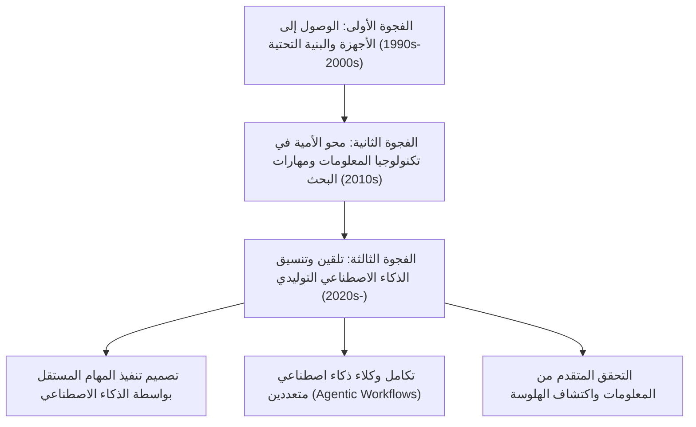
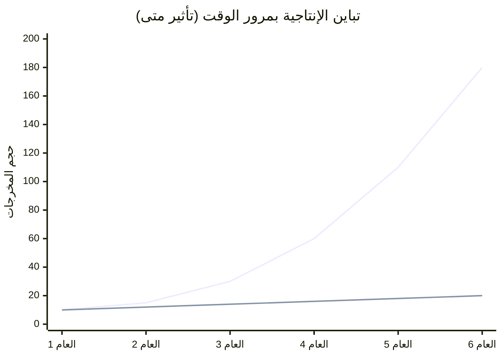
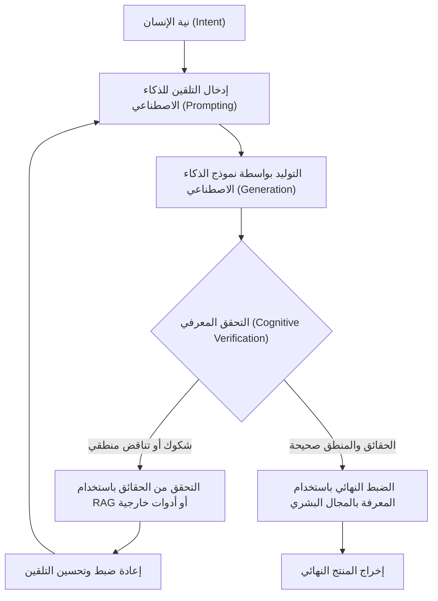

## 1. مقدمة: التطور التاريخي للفجوة الرقمية والنموذج الجديد

منذ انتشار الإنترنت، سمعنا مصطلح "الفجوة الرقمية (الفجوة المعلوماتية)" مرارًا وتكرارًا. كانت الفجوة الرقمية في البداية تتعلق بشكل أساسي بـ "حق الوصول المادي". بعبارة أخرى، كان الأمر عبارة عن معادلة بسيطة تحدد ما إذا كان امتلاك جهاز كمبيوتر أو اتصال إنترنت عالي السرعة يؤثر على الوصول إلى المعلومات والفرص الاقتصادية أم لا. بعد ذلك، ومع تحول الهواتف الذكية والنطاق العريض إلى سلع استهلاكية أساسية، تحول تركيز الفجوة إلى "محو الأمية في مجال تكنولوجيا المعلومات (القدرة على الاستفادة من المعلومات)". وهو الجانب البرمجي والمعرفي، مثل القدرة على البحث عن المعلومات بشكل مناسب باستخدام محركات البحث وإتقان استخدام البرامج.

ومع ذلك، فإن الظهور المفاجئ للذكاء الاصطناعي التوليدي (Generative AI) وتطور النماذج اللغوية الكبيرة (LLMs: Large Language Models) في العشرينيات من القرن الحالي يقلب مفهوم الفجوة الرقمية هذا رأسًا على عقب. ما نواجهه الآن ليس مجرد "فجوة في الوصول إلى المعلومات" أو "فجوة في مهارات تشغيل البرامج". بل إنها "فجوة في القدرة على تنسيق الذكاء الاصطناعي (توجيهه ودمجه)"، وهي "فجوة رقمية ثالثة" عميقة جدًا ولا رجعة فيها، تحدد ما إذا كانت إنتاجية الفرد ستتضاعف بشكل أسي، أم أنه سيتخلف عن ركب تطور الذكاء الاصطناعي ليفقد قيمته النسبية.

في هذا المقال، سنكشف بالتفصيل عن طبيعة هذه الفجوة الرقمية الجديدة التي أحدثها الذكاء الاصطناعي التوليدي، وذلك من خلال ثلاث طبقات: النماذج الرياضية للإنتاجية، وهندسة الأجهزة وتكلفتها، والجوانب المعرفية البشرية.

## 2. من "الوصول" إلى "التنسيق": قدوم الفجوة الرقمية الثالثة

كانت البرامج والأدوات السابقة بطبيعتها "أدوات سلبية". فحدود البرامج التقليدية كانت تكمن في إرجاع نتائج حتمية استجابةً لمدخلات المستخدم الصريحة (على سبيل المثال: إدخال معادلة رياضية في برنامج جداول بيانات للحصول على نتيجة حسابية). لكن الذكاء الاصطناعي التوليدي الحالي، وخاصة نماذج LLM المعتمدة على بنية Transformer (مثل GPT-4، وClaude 3.5، وLlama 3)، تتصرف كـ "أجزاء ذكاء نشطة".

بسبب هذا التحول النموذجي، تغيرت مجموعة المهارات المطلوبة من البشر بشكل جذري من "القدرة على تشغيل الأدوات" إلى "القدرة على تصميم وإدارة سير عمل مستقل من خلال الجمع بين وكلاء وأدوات ذكاء اصطناعي متعددة (AI Orchestration)". يمكن أن نطلق على هذا "محو الأمية في تنسيق الذكاء الاصطناعي".

يوضح الرسم البياني أدناه تطور الفجوة الرقمية من الماضي إلى الحاضر.

متجاوزين حدود هندسة التلقين، دخلنا الآن في مرحلة يتم فيها استخدام أطر عمل متعددة الوكلاء مثل LangChain، وAutoGen، وCrewAI لجعل الأنظمة تحل المشكلات بشكل مستقل. وهناك فجوة في الإنتاجية تتسع بسرعة لم تشهدها البشرية من قبل بين "الطبقة التي ترسم المخططات وتجعل الذكاء الاصطناعي ينفذها" و"الطبقة التي لا تزال تؤدي الأعمال الروتينية بيديها".

## 3. تأثير متى (Matthew Effect) للإنتاجية: تصور الفجوة من خلال نهج رياضي

يشير "تأثير متى (Matthew Effect)"، المستمد من مقولة العهد الجديد "لأن كل من له يعطى فيزداد، ومن ليس له فالذي عنده يؤخذ منه"، إلى ظاهرة في علم الاجتماع والاقتصاد حيث تؤدي الميزة الأولية إلى مكاسب تراكمية. مع إدخال الذكاء الاصطناعي التوليدي، يظهر هذا التأثير بقوة في سوق العمل والإنتاج الفكري.

إن إنتاجية الأفراد الذين يستخدمون الذكاء الاصطناعي بفعالية لا تنمو بشكل خطي بمرور الوقت، بل بشكل أسي. والسبب هو أنه يمكن استثمار الوقت الذي يوفره الذكاء الاصطناعي في بناء أنظمة ذكاء اصطناعي أكثر تقدمًا، وتحسين التلقين، والتعلم الذاتي. دعونا نعبر عن هذا بنموذج رياضي.

يمكن تمثيل إنتاجية المستخدم غير المعتمد على الذكاء الاصطناعي $P_{human}(t)$ وإنتاجية منسق الذكاء الاصطناعي $P_{AI}(t)$ عند نقطة زمنية $t$ بالنماذج التالية:

$$
P_{human}(t) = P_0 (1 + r_{human})^t
$$
هنا، $P_0$ هي الإنتاجية الأولية، و$r_{human}$ هو معدل التعلم الطبيعي للإنسان (معدل النمو بناءً على منحنى الخبرة). بشكل عام، يكون $r_{human}$ صغيرًا جدًا، وغالبًا ما يكون النمو حسابيًا.

من ناحية أخرى، تجمع إنتاجية المستخدم الذي يستفيد بالكامل من الذكاء الاصطناعي بين معدل تحسن قدرة نموذج الذكاء الاصطناعي المستخدم $r_{model}$، والتأثير المركب لأتمتة سير عمل الذكاء الاصطناعي $\alpha$:

$$
P_{AI}(t) = P_0 \cdot \exp\left( \int_0^t (r_{human} + \alpha \cdot r_{model}(\tau)) d\tau \right)
$$

نظرًا لأن نماذج الذكاء الاصطناعي نفسها تتطور بشكل أسي (زيادة عدد المعلمات ومقدار الحوسبة استنادًا إلى قوانين التحجيم)، فإن $r_{model}(t)$ نفسه يزداد بمرور الوقت. ونتيجة لذلك، يتسع فارق الإنتاجية بين الاثنين $\Delta P(t)$ بسرعة:

$$
\Delta P(t) = P_{AI}(t) - P_{human}(t)
$$

يوضح الرسم البياني التالي هذا التفاوت بشكل مرئي:

*(ملاحظة: الخط الأزرق يمثل إنتاجية منسق الذكاء الاصطناعي، والخط السفلي يمثل إنتاجية المستخدم غير المعتمد على الذكاء الاصطناعي)*

قد يبدو الفارق ضئيلًا في العام الأول، ولكن مع كل تطور لنماذج الذكاء الاصطناعي من GPT-3 إلى GPT-4، والأجيال القادمة، يتمتع مستخدمو الذكاء الاصطناعي بتحسينات هائلة في الإنتاجية بمجرد توصيل نماذج جديدة بخطوط أنابيب الأتمتة الحالية الخاصة بهم. ومن المستحيل رياضيًا بمرور الوقت أن يسد المستخدمون الذين لا يستخدمون الذكاء الاصطناعي هذه الفجوة.

## 4. فجوة الأجهزة: جدار الاستدلال المحلي وفخ واجهة برمجة تطبيقات السحابة

بالإضافة إلى المهارات البرمجية، تخلق الفجوة الرقمية الثالثة فجوة جديدة في الأجهزة، وهي "الوصول إلى الحوسبة (موارد الحوسبة)" لتشغيل أحدث نماذج الذكاء الاصطناعي.

هناك طريقتان رئيسيتان لاستخدام النماذج اللغوية الكبيرة: "استخدام واجهات برمجة تطبيقات السحابة" أو "استدلال النماذج محليًا (Inference)". ولكل منهما مزايا وعيوب، وهذا يشكل حاجزًا اقتصاديًا وماديًا جديدًا.

### قيود وتكاليف التشغيل لواجهة برمجة تطبيقات السحابة
من الشائع الوصول إلى نماذج الحافة الرائدة التي تقدمها شركات مثل OpenAI وAnthropic وGoogle (مثل GPT-4o، وClaude 3.5 Sonnet) عبر واجهات برمجة التطبيقات (API). ومع ذلك، إذا قمت ببناء وكلاء مستقلين متقدمين (Agentic Workflow) وتوليد عشرات الآلاف من طلبات واجهة برمجة التطبيقات يوميًا، فستزيد التكاليف بشكل هائل.

تعتمد التكلفة الإجمالية للسحابة $C_{cloud}$ على كمية الرموز المدخلة والمخرجة:

$$
C_{cloud} = \sum_{i=1}^{N} \left( c_{in} \cdot T_{in}^{(i)} + c_{out} \cdot T_{out}^{(i)} \right)
$$
($N$ هو عدد الطلبات، $T$ هو عدد الرموز، $c$ هو تكلفة الرمز الواحد)

إذا تم إجراء معالجة بيانات واسعة النطاق أو متجهات RAG (التوليد المعزز بالاسترجاع) بشكل مستمر، فقد تصبح هذه التكلفة المتغيرة عبئًا فادحًا للمطورين المستقلين والشركات الصغيرة والمتوسطة.

### نماذج LLM المحلية وجدار VRAM
من منظور تجنب تكاليف السحابة وخصوصية البيانات، يتزايد الطلب على تشغيل نماذج الأوزان المفتوحة مثل Llama 3 وMistral محليًا. ولكن هنا يظهر جدار "VRAM (ذاكرة الوصول العشوائي للفيديو)" المادي كفجوة.

تعتمد سرعة استدلال LLM بقوة على عرض النطاق الترددي للذاكرة (Memory Bandwidth) أكثر من أداء الحوسبة (FLOPS) لوحدة المعالجة الرسومية (وهي ذات طبيعة مقيدة بالذاكرة). إذا كان عدد معلمات النموذج هو $P$ والدقة 16 بت (2 بايت)، فإن تحميل النموذج في الذاكرة يتطلب على الأقل $2P$ بايت من VRAM. على سبيل المثال، يتطلب نموذج يحتوي على 70 مليار معلمة (70B) ما لا يقل عن 140 جيجابايت من VRAM.

$$
VRAM_{required} \approx \left( \frac{P \times bits\_per\_weight}{8} \right) + Context\_Memory
$$

حتى أفضل وحدات المعالجة الرسومية المتاحة للمستهلكين العاديين (NVIDIA RTX 4090) لا تتجاوز سعة VRAM الخاصة بها 24 جيجابايت، مما يجعل تشغيل نموذج بحجم 70B كما هو أمرًا مستحيلًا. وهنا ظهرت "تقنيات التكميم (Quantization)" مثل AWQ وGGUF، والتي تضغط الأوزان إلى 4 بت أو 8 بت لإيجاد حل وسط تقني، لكن تدهور الأداء (تفاقم الحيرة Perplexity) الناتج عن التكميم لا مفر منه.

علاوة على ذلك، ظهرت مؤخرًا "أجهزة الكمبيوتر الشخصية للذكاء الاصطناعي (AI PCs)" المزودة بوحدة المعالجة العصبية (NPU)، ولكن حد عمليات TOPS (تريليون عملية في الثانية) الحالية لـ NPU يقتصر على تشغيل النماذج اللغوية الصغيرة والخفيفة (SLM). ولإجراء استدلال متقدم حقًا محليًا، ستحتاج إلى القوة المالية لبناء بيئة متعددة وحدات المعالجة الرسومية بتكلفة ملايين الينات. وهذا هو الجوهر الحقيقي "للفجوة الرقمية كثيفة رأس المال" في مجال الذكاء الاصطناعي.

## 5. الفجوة المعرفية: حلقة الهلوسة والتحقق

ما هو أكثر رعبًا من فجوة الأجهزة أو المهارات هو "الفجوة المعرفية". يقوم الذكاء الاصطناعي بتوليد نصوص بطلاقة ومقنعة للغاية، ولكنه في الوقت نفسه ينتج "هلوسات (Hallucinations)" تُخرج محتوى لا أساس له من الصحة بشكل يبدو معقولاً.

تكمن الفجوة هنا في الانقسام بين "الطبقة القادرة على فحص مخرجات الذكاء الاصطناعي بشكل نقدي والتحقق منها (التحقق من الحقائق)" و"الطبقة التي تثق بشكل أعمى بمخرجات الذكاء الاصطناعي كحقيقة موثوقة". تستخدم المجموعة الأولى الذكاء الاصطناعي كأداة قوية للعصف الذهني وصياغة المسودات، بينما تستخدم خبراتها المتخصصة لضبط جودة المخرجات النهائية (QA). أما المجموعة الثانية فتقوم بنشر معلومات خاطئة للعالم كما هي، مما لا يفقدها مصداقيتها فحسب، بل يساهم أيضًا في تلويث مساحة المعلومات على الإنترنت بمحتوى يشبه البريد العشوائي.

توضح حلقة التحقق المعرفي (Cognitive Verification Loop) أدناه العملية المطلوبة لمنع ذلك.

لتشغيل هذه الحلقة، لا يكفي مجرد معرفة كيفية استخدام الذكاء الاصطناعي، بل لا غنى عن "المعرفة العميقة بالمجال" و"التفكير النقدي" فيما يتعلق بمجال المخرجات. من المفارقات، أنه كلما تطور الذكاء الاصطناعي، تحولت متطلبات الإنسان من مهارات التشغيل الأساسية إلى مهارات معرفية متقدمة للغاية، مثل التفكير الفلسفي والمنطقي، والثقافة المطلوبة للتمييز بين الحقيقة والباطل.

## 6. المجتمع الطبقي الجديد: منسقو الذكاء الاصطناعي والعمال اليدويون

في المستقبل الذي تصل فيه هذه الفجوات إلى أقصى حدودها (أو كواقع يحدث حاليًا)، سينقسم سوق العمل بطريقة لم يسبق لها مثيل.

**1. منسقو الذكاء الاصطناعي (أعلى 1-5٪)**
في مجالات تخصصهم، يقوم هؤلاء ببناء سير عمل يعمل فيه العديد من وكلاء الذكاء الاصطناعي بشكل مستقل. يفوضون معظم العمليات كالبحث، والبرمجة، وتحليل البيانات، وكتابة التقارير إلى الذكاء الاصطناعي، بينما يتخصصون في "تصميم العمليات"، و"معالجة الاستثناءات"، و"اتخاذ القرارات النهائية". تصل إنتاجيتهم إلى عشرات أو مئات أضعاف إنتاجية العمال التقليديين، مما يخلق قيمة اقتصادية هائلة.

**2. عمال المعرفة التقليديون والعمال اليدويون**
هم الأشخاص الذين يكتبون التعليمات البرمجية بأيديهم، ويشغلون Excel بأيديهم، ويكتبون النصوص بأيديهم. سيتم استبدال وظائفهم تدريجيًا بالذكاء الاصطناعي، أو سيتم دفعهم إلى "مراقبة وصيانة الأطراف" للأنظمة التي أنشأها منسقو الذكاء الاصطناعي، أو سيتم حصرهم في "العمل في المساحات المادية". يواجه العمل الفكري الذي لا يستخدم الذكاء الاصطناعي خطر الفقدان الكامل للقدرة التنافسية في السوق.

## 7. الاستراتيجيات والوصفات الاجتماعية للنجاة في مجتمع الفوارق

في ظل هذه الفجوة الهائلة، كيف ينبغي للأفراد والشركات والمجتمع التكيف؟

### استراتيجيات الأفراد: التكيف مع التحول النموذجي
الأهم هو التخلي عن التقليل من شأن الذكاء الاصطناعي واعتباره "مجرد روبوت محادثة". يجب أن تعتاد على التفكير باستمرار في كيفية تفكيك عمليات عملك وتفويضها للذكاء الاصطناعي (Task Decomposition)، واعتباره "متدربًا متقدمًا" أو "فريقًا من الخبراء". حتى لو لم تكن تبرمج، فإن تعلم مفاهيم واجهة برمجة التطبيقات (API) وهيكلة البيانات (مثل JSON) سيمكنك من دمج الأدوات التي لا تتطلب برمجة / ذات البرمجة المنخفضة (مثل Zapier وMake) مع الذكاء الاصطناعي لأتمتة قوية.

### استراتيجيات الشركات: تصميم تنظيمي يعتمد على الذكاء الاصطناعي
بالنسبة للشركات، لا يكفي مجرد "توزيع حسابات ChatGPT". يجب إعادة تصميم تدفق العمل بأكمله بافتراض استخدام الذكاء الاصطناعي (BPR: إعادة هندسة العمليات التجارية)، والاستثمار في البنية التحتية مثل بناء بيئات RAG آمنة، وتخصيص المعرفة الداخلية الخاصة بالشركة في نماذج محلية (Fine-tuning). مطلوب أيضًا تقديم مؤشرات أداء رئيسية (KPIs) جديدة لتقييم قدرة الموظفين على تنسيق الذكاء الاصطناعي.

### الوصفات الاجتماعية: البنية التحتية للذكاء الاصطناعي كمنفعة عامة
على مستوى الدول والمجتمع، هناك حاجة إلى شبكات أمان وتعليم لضمان عدم تسبب الفجوة الرقمية الثالثة في فوارق اقتصادية واضطرابات اجتماعية خطيرة. على سبيل المثال، الدعم العام للبحث والتطوير لنماذج الذكاء الاصطناعي مفتوحة المصدر، وجعل "محو الأمية النقدية للذكاء الاصطناعي" إلزاميًا في المؤسسات التعليمية. يجب أيضًا مناقشة اللوائح القانونية المناسبة وتحديث قوانين مكافحة الاحتكار لمنع شركات التكنولوجيا العملاقة من "احتكار نماذج الذكاء الاصطناعي وموارد الحوسبة".

## 8. الخاتمة: اركب موجة التطور أو اغرق فيها

إن "الفجوة الرقمية الجديدة" التي يحدثها الذكاء الاصطناعي التوليدي تعيد بناء مجتمعنا بشكل أسرع وأوسع نطاقًا من أي ابتكار تكنولوجي في الماضي. تتجلى هذه الفجوة في الاختلافات في موارد حوسبة الأجهزة، والقدرة على الاستثمار في واجهات برمجة تطبيقات السحابة، وقبل كل شيء "المهارات المعرفية والمنطقية لتنسيق الذكاء الاصطناعي".

كما يوضح تأثير متى للإنتاجية، ستتوسع هذه الفجوة بمرور الوقت لدرجة يصبح من المستحيل سدها. ما يجب علينا فعله الآن ليس الخوف من تطور الذكاء الاصطناعي، ولا الإيمان الأعمى به. بل الفهم العميق لخصائص الذكاء الاصطناعي كأعظم جهاز لتضخيم الذكاء (Intelligence Amplifier) في تاريخ البشرية، وتنفيذ "تحول ذاتي فكري" لتحديث طريقة تفكيرنا وسير عملنا.

هل ستقف على هذا الجانب من الفجوة الرقمية الجديدة أم ستبقى على الجانب الآخر؟ هذا الاختيار متروك، في هذه اللحظة بالذات، لتعلمنا وعملنا اليومي.

---
*بالنسبة للآراء حول هذا المقال أو الأمثلة المحددة لتطبيق تنسيق الذكاء الاصطناعي، يرجى مشاركتها في قسم التعليقات أو على وسائل التواصل الاجتماعي الخاصة بالمؤلف.*
