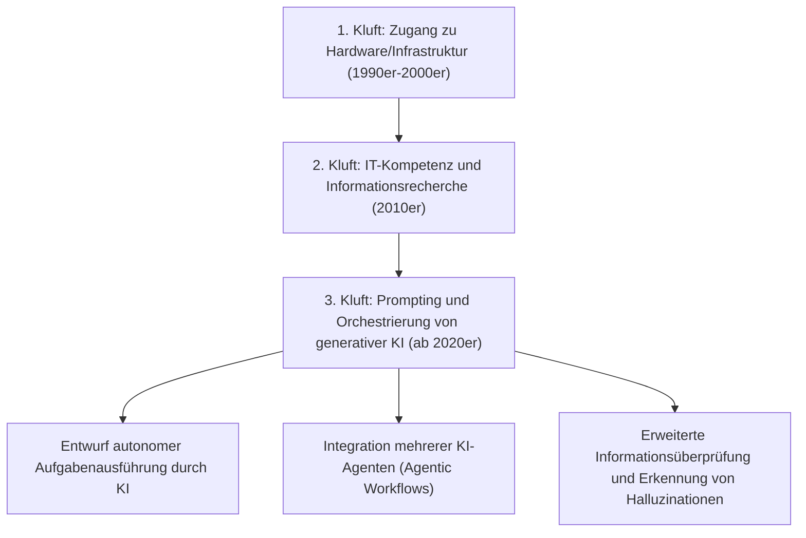
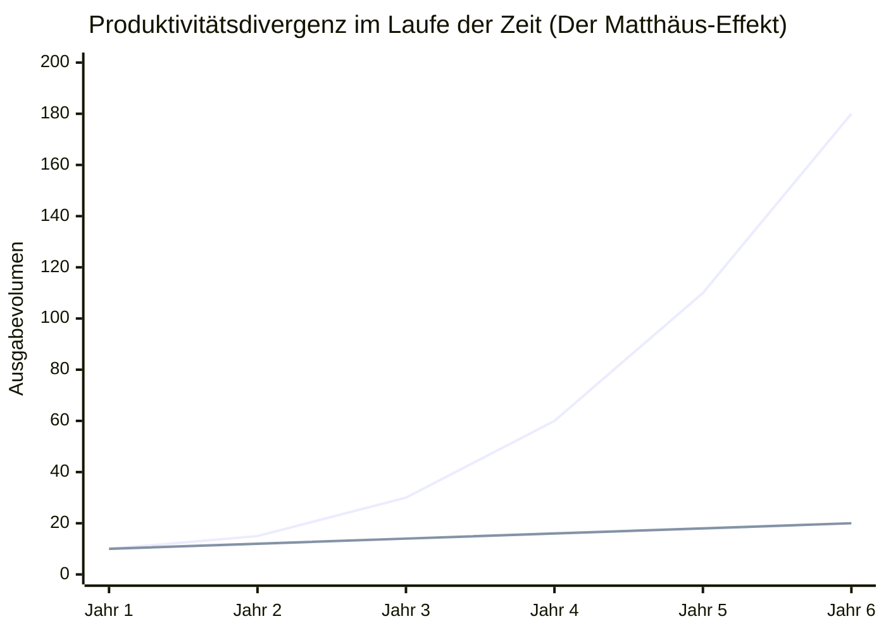
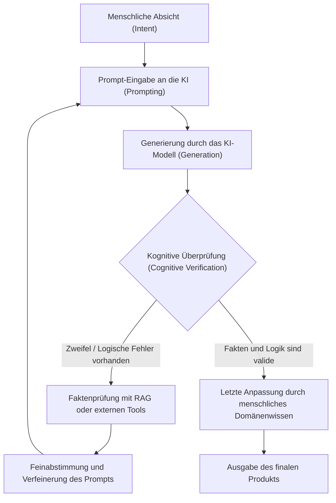

## 1. Einleitung: Historischer Wandel der digitalen Kluft und das neue Paradigma

Seit der Verbreitung des Internets haben wir den Begriff der "digitalen Kluft" (Digital Divide) oft gehört. Die frühe digitale Kluft bezog sich hauptsächlich auf den "physischen Zugang". Das heißt, es war eine einfache Konstellation, bei der der Besitz von Computern oder Hochgeschwindigkeits-Internetverbindungen den Zugang zu Informationen und wirtschaftlichen Möglichkeiten bestimmte. Später, als Smartphones und Breitbandverbindungen zur Massenware wurden, verlagerte sich der Fokus der Kluft auf die "IT-Kompetenz" (Information Technology Literacy). Es ging um weiche, kognitive Aspekte, wie die Fähigkeit, Suchmaschinen richtig zu nutzen, um Informationen zu finden, oder Software effizient zu bedienen.

Die plötzliche Entstehung der generativen KI (Generative AI) in den 2020er Jahren und die Evolution der großen Sprachmodelle (LLM: Large Language Models) drohen jedoch, dieses Konzept der digitalen Kluft grundlegend auf den Kopf zu stellen. Womit wir heute konfrontiert sind, ist keine bloße "Kluft beim Zugang zu Informationen" oder "Kluft bei den Fähigkeiten zur Softwarebedienung". Es ist die "Kluft in der Fähigkeit, KI zu orchestrieren (zu steuern und zu integrieren)". Dies ist eine extrem schwerwiegende und unumkehrbare "dritte digitale Kluft", die darüber entscheidet, ob die individuelle Produktivität exponentiell gesteigert wird oder ob man von der KI-Evolution zurückgelassen wird und seinen relativen Wert verliert.

In diesem Artikel werden wir die wahre Natur dieser neuen digitalen Kluft, die durch generative KI verursacht wird, aus drei Ebenen extrem detailliert entschlüsseln: dem mathematischen Modell der Produktivität, der Hardware-Architektur und den Kosten sowie den menschlichen kognitiven Aspekten.

## 2. Vom "Zugang" zur "Orchestrierung": Die Ankunft der dritten digitalen Kluft

Software-Tools der Vergangenheit waren im Wesentlichen "passive Werkzeuge". Die Grenze herkömmlicher Software bestand darin, dass sie auf explizite Eingaben des Benutzers deterministische Ergebnisse lieferte (z. B. Eingabe einer Formel in eine Tabellenkalkulation, um ein Berechnungsergebnis zu erhalten). Die heutige generative KI, insbesondere die auf der Transformer-Architektur basierenden LLMs (GPT-4, Claude 3.5, Llama 3 usw.), verhält sich jedoch wie ein "aktives Fragment von Intelligenz".

Durch diesen Paradigmenwechsel hat sich das von Menschen geforderte Skillset drastisch von der "Fähigkeit, Werkzeuge zu bedienen" zur "Fähigkeit, mehrere KI-Agenten und -Tools zu kombinieren und autonome Workflows zu entwerfen und zu steuern (AI Orchestration)" verändert. Dies kann als "KI-Orchestrierungskompetenz" bezeichnet werden.

Nachfolgend ist die Entwicklung der digitalen Kluft von der Vergangenheit bis zur Gegenwart dargestellt.

Über die Grenzen des Prompt-Engineerings hinaus treten wir nun in eine Phase ein, in der Systeme mithilfe von Multi-Agenten-Frameworks wie LangChain, AutoGen oder CrewAI in die Lage versetzt werden, Probleme autonom zu lösen. Zwischen dieser Schicht, die "den Bauplan zeichnet und die KI ausführen lässt", und der Schicht, die "Routinearbeiten immer noch manuell erledigt", entsteht eine Diskrepanz in der Produktivität mit einer Geschwindigkeit, die die Menschheit noch nie zuvor erlebt hat.

## 3. Der Matthäus-Effekt der Produktivität: Visualisierung der Kluft durch einen mathematischen Ansatz

Der "Matthäus-Effekt" (Matthew Effect), der aus den Worten des Neuen Testaments "Denn wer da hat, dem wird gegeben; wer aber nicht hat, dem wird auch das genommen, was er hat" stammt, beschreibt in der Soziologie und Wirtschaftswissenschaft ein Phänomen, bei dem anfängliche Vorteile kumulative Gewinne bringen. Mit der Einführung generativer KI manifestiert sich dieser Matthäus-Effekt stark auf dem Arbeitsmarkt und in der intellektuellen Produktion.

Die Produktivität von Personen, die KI effektiv nutzen, wächst nicht linear, sondern exponentiell mit der Zeit. Der Grund dafür ist, dass die durch KI eingesparte Zeit in den Aufbau noch fortschrittlicherer KI-Systeme, die Optimierung von Prompts und selbstgesteuertes Lernen investiert werden kann. Lassen Sie uns dies in einem mathematischen Modell ausdrücken.

Die Produktivität $P_{human}(t)$ eines Nicht-KI-Nutzers und die Produktivität $P_{AI}(t)$ eines KI-Orchestrators zum Zeitpunkt $t$ lassen sich jeweils durch die folgenden Modelle darstellen.

$$
P_{human}(t) = P_0 (1 + r_{human})^t
$$
Hierbei ist $P_0$ die anfängliche Produktivität und $r_{human}$ die natürliche Lernrate des Menschen (Wachstumsrate basierend auf der Erfahrungskurve). Im Allgemeinen ist $r_{human}$ sehr klein, und das Wachstum tendiert dazu, arithmetisch zu verlaufen.

Andererseits kombiniert die Produktivität von Benutzern, die KI voll ausschöpfen, die Leistungssteigerungsrate $r_{model}$ des verwendeten KI-Modells mit dem Zinseszinseffekt $\alpha$ der Automatisierung von KI-Workflows.

$$
P_{AI}(t) = P_0 \cdot \exp\left( \int_0^t (r_{human} + \alpha \cdot r_{model}(\tau)) d\tau \right)
$$

Da sich das KI-Modell selbst exponentiell entwickelt (Erhöhung der Parameteranzahl und der Rechenleistung basierend auf den Skalierungsgesetzen), nimmt $r_{model}(t)$ selbst im Laufe der Zeit zu. Infolgedessen vergrößert sich der Produktivitätsunterschied $\Delta P(t)$ zwischen den beiden rapide.

$$
\Delta P(t) = P_{AI}(t) - P_{human}(t)
$$

Das folgende Diagramm zeigt diese Divergenz visuell.

*(Anmerkung: Die blaue Linie repräsentiert die Produktivität des KI-Orchestrators, die untere Linie die Produktivität des Nicht-KI-Nutzers)*

Im ersten Jahr mag der Unterschied gering erscheinen, aber jedes Mal, wenn sich das KI-Modell von GPT-3 zu GPT-4 und weiter zu seiner nächsten Generation entwickelt, profitieren KI-Nutzer von einer dramatischen Produktivitätssteigerung, indem sie einfach das neue Modell in ihre bestehenden Automatisierungs-Pipelines einstecken (plug-in). Für Nicht-KI-Nutzer wird es mit der Zeit mathematisch nahezu unmöglich, diese Lücke zu schließen.

## 4. Hardware-Kluft: Die Barriere der lokalen Inferenz und die Falle der Cloud-APIs

Die dritte digitale Kluft schafft nicht nur Unterschiede bei Software-Fähigkeiten, sondern auch eine neue Hardware-Kluft durch den "Zugang zu Rechenleistung (Compute)", um die fortschrittlichsten KI-Modelle auszuführen.

Es gibt hauptsächlich zwei Ansätze, um große Sprachmodelle zu nutzen: "Verwendung von Cloud-APIs" oder "lokale Ausführung der Modellinferenz (Inference)". Beide haben ihre Vor- und Nachteile, was eine neue wirtschaftliche und physische Barriere darstellt.

### Grenzen von Cloud-APIs und laufende Kosten
Die fortschrittlichsten Frontier-Modelle (GPT-4o, Claude 3.5 Sonnet usw.), die von OpenAI, Anthropic und Google bereitgestellt werden, sind in der Regel über APIs zugänglich. Wenn man jedoch einen hochgradig autonomen Agenten (Agentic Workflow) aufbaut und zehntausende API-Aufrufe pro Tag generiert, explodieren die Kosten.

Die Gesamtkosten der API $C_{cloud}$ hängen von der Menge der Eingabe- und Ausgabetokens ab.

$$
C_{cloud} = \sum_{i=1}^{N} \left( c_{in} \cdot T_{in}^{(i)} + c_{out} \cdot T_{out}^{(i)} \right)
$$
($N$ ist die Anzahl der Anfragen, $T$ ist die Anzahl der Tokens, $c$ ist der Einzelpreis pro Token)

Bei kontinuierlicher Durchführung umfangreicher Datenverarbeitungen oder Vektorisierung für RAG (Retrieval-Augmented Generation) können diese variablen Kosten zu einer fatalen Belastung für einzelne Entwickler und kleine bis mittlere Unternehmen werden.

### Lokale LLMs und die VRAM-Grenze
Um Cloud-Kosten zu vermeiden und den Datenschutz zu wahren, steigt die Nachfrage, Open-Weight-Modelle wie Llama 3 von Meta oder Mistral lokal auszuführen. Hier stellt sich jedoch die physische Kluft der "VRAM-Grenze" (Video RAM) in den Weg.

Die Inferenzgeschwindigkeit von LLMs hängt stärker von der Speicherbandbreite (Memory Bandwidth) als von der Rechenleistung (FLOPS) der GPU ab (Memory-bound-Eigenschaft). Wenn die Parameteranzahl des Modells $P$ ist und die Genauigkeit 16 Bit (2 Byte) beträgt, sind allein zum Laden des Modells in den Speicher mindestens $2P$ Bytes VRAM erforderlich. Beispielsweise erfordert ein Modell mit 70 Milliarden (70B) Parametern über 140 GB VRAM.

$$
VRAM_{required} \approx \left( \frac{P \times bits\_per\_weight}{8} \right) + Context\_Memory
$$

Selbst bei High-End-GPUs, die für allgemeine Verbraucher erhältlich sind (NVIDIA RTX 4090), ist der VRAM auf 24 GB begrenzt, was es unmöglich macht, ein Modell der 70B-Klasse direkt auszuführen. An diesem Punkt kommen "Quantisierungstechnologien" (Quantization) wie AWQ und GGUF ins Spiel, bei denen Gewichte auf 4 Bit oder 8 Bit komprimiert werden, um einen technischen Kompromiss zu finden. Eine Leistungsminderung (Verschlechterung der Perplexity) durch Quantisierung ist jedoch unvermeidlich.

Darüber hinaus sind in den letzten Jahren "AI-PCs" erschienen, die mit einer NPU (Neural Processing Unit) ausgestattet sind. Die aktuellen TOPS (Tera Operations Per Second) dieser NPUs reichen jedoch gerade aus, um leichtgewichtige, kleine Modelle (SLM: Small Language Models) auszuführen. Um wirklich fortschrittliche Inferenz lokal durchführen zu können, bedarf es einer Kapitalstärke, die es ermöglicht, eine Multi-GPU-Umgebung im Wert von mehreren Millionen Yen (Zehntausende von Euro) aufzubauen. Dies ist die wahre Natur der "kapitalintensiven digitalen Kluft" im Bereich der KI.

## 5. Kognitive Kluft: Halluzinationen und die Verifikationsschleife

Noch beängstigender als die Kluft bei Hardware oder Fähigkeiten ist die "kognitive Kluft". KI erzeugt sehr fließende und überzeugende Texte, produziert aber gleichzeitig "Halluzinationen" (Hallucinations), bei denen falsche Informationen plausibel dargestellt werden.

Die hier entstehende Kluft ist die Spaltung zwischen der "Schicht, die die KI-Ausgaben kritisch prüfen und verifizieren (Fact-Checking) kann" und der "Schicht, die blindlings an die KI-Ausgaben als maßgebliche Wahrheit glaubt". Erstere nutzt KI als mächtiges Tool zum Brainstorming und Entwerfen und führt die abschließende Qualitätskontrolle (QA) der Ausgaben mit ihrem eigenen Fachwissen durch. Letztere veröffentlicht falsche Informationen unkontrolliert in der Welt und ruiniert nicht nur die eigene Glaubwürdigkeit, sondern trägt auch dazu bei, den Informationsraum im Internet mit spam-artigen Inhalten zu verschmutzen.

Der Prozess der kognitiven Verifikationsschleife (Cognitive Verification Loop), um dies zu verhindern, ist unten dargestellt.

Um diese Schleife durchlaufen zu können, reicht es nicht aus, nur zu wissen, wie man KI benutzt. Tiefgehendes "Domänenwissen" (Domain Knowledge) im Bereich der Ausgaben und "kritisches Denken" (Critical Thinking) sind unerlässlich. Ironischerweise verschieben sich die an den Menschen gestellten Anforderungen mit zunehmender Weiterentwicklung der KI nicht auf grundlegende Bedienungsfertigkeiten, sondern auf extrem hohe kognitive Fähigkeiten wie philosophisches und logisches Denkvermögen sowie die Bildung, Wahrheit von Lüge zu unterscheiden.

## 6. Die neue Klassengesellschaft: KI-Orchestratoren und manuelle Arbeiter

In einer Zukunft, in der diese Ungleichheiten extrem voranschreiten (oder in der sich entfaltenden Realität der Gegenwart), wird sich der Arbeitsmarkt auf beispiellose Weise polarisieren.

**1. KI-Orchestratoren (Die obersten 1–5 %)**
Sie bauen in ihren jeweiligen Fachgebieten Workflows auf, die mehrere KI-Agenten autonom steuern. Sie delegieren den Großteil von Prozessen wie Recherche, Programmierung, Datenanalyse und Berichtserstellung an die KI und spezialisieren sich auf das "Prozessdesign", die "Ausnahmebehandlung" (Exception Handling) und die "endgültige Entscheidungsfindung". Ihre Produktivität übersteigt die traditioneller Arbeitnehmer um das Dutzend- bis Hundertfache, was enorme wirtschaftliche Werte schafft.

**2. Traditionelle Wissensarbeiter und manuelle Arbeiter**
Dies sind die Menschen, die immer noch Code von Hand schreiben, Excel manuell bedienen und Texte selbst verfassen. Ihre Arbeit wird nach und nach von KI ersetzt, oder sie werden an den Rand gedrängt, um die von den KI-Orchestratoren geschaffenen Systeme zu "überwachen und warten" oder um "körperliche Arbeit im physischen Raum" zu verrichten. Intellektuelle Arbeit, die keine KI nutzt, ist dem Risiko ausgesetzt, ihre Wettbewerbsfähigkeit am Markt völlig zu verlieren.

## 7. Strategien und gesellschaftliche Lösungsansätze zum Überleben in der Klassengesellschaft

Wie sollten sich Einzelpersonen, Unternehmen und die Gesellschaft an diese überwältigende Kluft anpassen?

### Individuelle Strategien: Anpassung an den Paradigmenwechsel
Am wichtigsten ist es, die Fehleinschätzung aufzugeben, dass "KI nur ein Chatbot" sei. Es ist notwendig, sich anzugewöhnen, KI als "fortgeschrittenen Praktikanten" oder als ein "Expertenteam" zu betrachten und ständig darüber nachzudenken, wie man eigene Geschäftsprozesse in Teilaufgaben zerlegen und an die KI delegieren kann (Task Decomposition). Selbst wenn man nicht programmieren kann, ermöglicht das Erlernen von API-Konzepten und Datenstrukturierung (wie JSON) durch die Kombination von No-Code/Low-Code-Tools (Zapier, Make usw.) und KI mächtige Automatisierungen.

### Unternehmensstrategien: KI-natives Organisationsdesign
Für Unternehmen reicht es nicht aus, einfach nur "ChatGPT-Accounts zu verteilen". Es sind Infrastrukturinvestitionen erforderlich, wie die Umgestaltung der gesamten Geschäftsabläufe unter der Prämisse von KI (BPR: Business Process Re-engineering), der Aufbau einer sicheren RAG-Umgebung und das Fein-Tuning (Fine-Tuning) interner Fachkenntnisse auf lokale Modelle. Zudem ist die Einführung neuer KPIs gefordert, um die KI-Orchestrierungsfähigkeiten der Mitarbeiter zu bewerten.

### Gesellschaftliche Lösungsansätze: KI-Infrastruktur als öffentliches Gut
Auf staatlicher und gesellschaftlicher Ebene sind ein Sicherheitsnetz und Bildung erforderlich, um sicherzustellen, dass die dritte digitale Kluft nicht zu schwerwiegenden wirtschaftlichen Ungleichheiten und sozialen Unruhen führt. Beispiele hierfür sind öffentliche Unterstützung für die Forschung und Entwicklung von Open-Source-KI-Modellen sowie die Einführung von "kritischer KI-Kompetenz" als Pflichtfach an Bildungseinrichtungen. Darüber hinaus sollten geeignete gesetzliche Regelungen und Aktualisierungen des Kartellrechts (Antimonopolgesetze) diskutiert werden, um die "Monopolisierung von KI-Modellen und Rechenressourcen" durch gigantische Technologieunternehmen zu verhindern.

## 8. Fazit: Die Welle der Evolution reiten oder davon verschlungen werden

Die durch die generative KI verursachte "neue digitale Kluft" strukturiert unsere Gesellschaft schneller und umfassender um als jede technologische Innovation der Vergangenheit. Diese Kluft manifestiert sich im Unterschied der Hardware-Rechenressourcen, der Fähigkeit, in Cloud-APIs zu investieren, und vor allem in den "kognitiven und logischen Fähigkeiten zur KI-Orchestrierung".

Wie der Matthäus-Effekt der Produktivität zeigt, wird diese Ungleichheit im Laufe der Zeit unüberwindbar wachsen. Was wir jetzt tun müssen, ist weder, die Evolution der KI zu fürchten, noch blindlings an sie zu glauben. Wir müssen die Eigenschaften der KI, des größten Intelligenzverstärkers (Intelligence Amplifier) in der Geschichte der Menschheit, tiefgreifend verstehen und eine "intellektuelle Selbsttransformation" entschlossen durchführen, die unser Denken und unsere Workflows aktualisiert.

Ob wir auf dieser Seite der neuen digitalen Kluft stehen oder auf der anderen zurückbleiben – diese Entscheidung liegt jetzt, in diesem Moment, in unserem täglichen Lernen und Handeln.

---
*Bitte hinterlassen Sie Ihr Feedback zu diesem Artikel oder spezifische Fallstudien zur Einführung der KI-Orchestrierung in den Kommentaren oder auf den Social-Media-Kanälen des Autors.*
