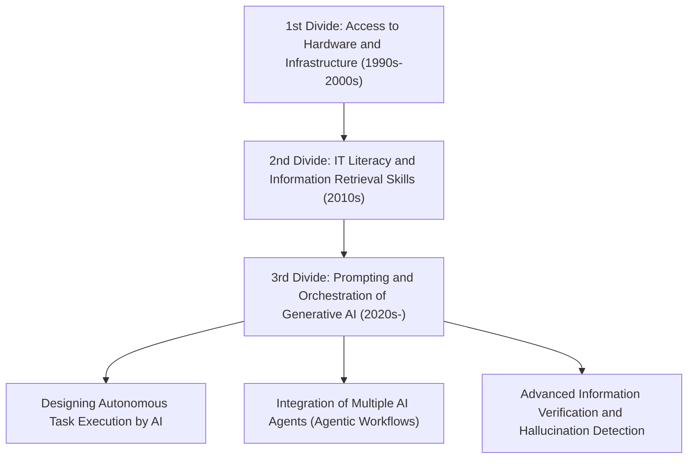
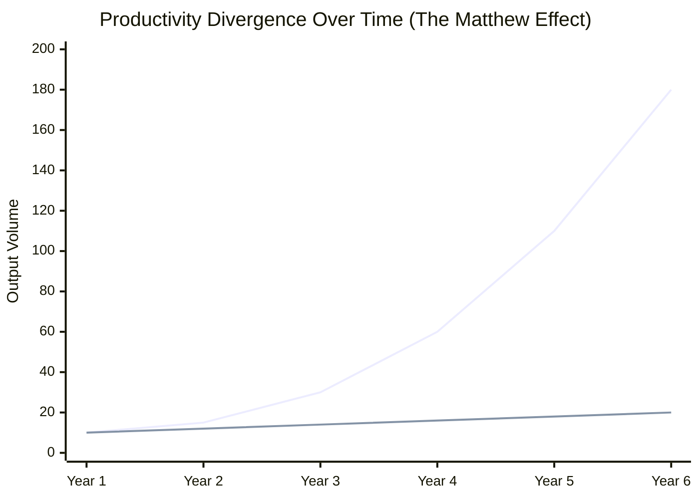
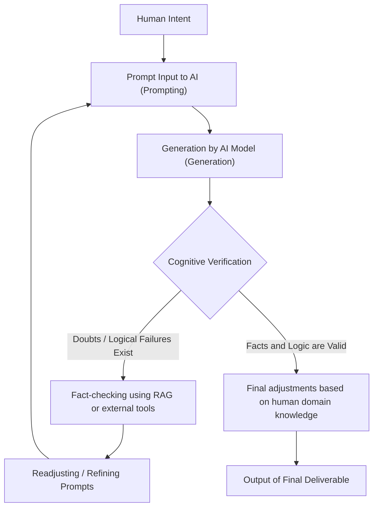

## 1. Introduction: Historical Transition of the Digital Divide and the New Paradigm

Since the popularization of the internet, we have often heard the term "digital divide" (information gap). The early digital divide was primarily about "physical access rights." In other words, it was a simple scenario where whether or not one had a computer or high-speed internet connection determined access to information and economic opportunities. Later, as smartphones and broadband connections became commoditized, the focus of the divide shifted to "IT literacy" (information utilization capability). This involved the software and cognitive aspects, such as whether one could appropriately search for information using search engines or master software.

However, the sudden emergence of Generative AI and the evolution of Large Language Models (LLMs) in the 2020s are fundamentally overturning this concept of the digital divide. What we are facing now is not merely a "divide in access to information" or a "divide in software operation skills." It is a "divide in the ability to orchestrate (direct and integrate) AI," a profound and irreversible "3rd Digital Divide" that determines whether an individual's productivity is amplified exponentially or if they are left behind by the evolution of AI and lose relative value.

In this article, we will unravel in great detail the true nature of this new digital divide brought about by Generative AI from three layers: the mathematical model of productivity, hardware architecture and cost, and the cognitive aspects of human beings.

## 2. From "Access" to "Orchestration": The Arrival of the 3rd Digital Divide

Past software tools were essentially "passive instruments." The limitation of traditional software was that it returned deterministic results in response to the user's explicit input (e.g., entering a formula in spreadsheet software to get a calculated result). However, current Generative AI, especially LLMs based on the Transformer architecture (GPT-4, Claude 3.5, Llama 3, etc.), act as "fragments of active intelligence."

Due to this paradigm shift, the required skill set for humans has dramatically changed from the "ability to operate tools" to the "ability to combine multiple AI agents and tools, and to design and direct autonomous workflows (AI Orchestration)." This can be called "AI Orchestration Literacy."

Below is the transition of the digital divide from the past to the present.

Moving beyond the boundaries of prompt engineering, we have now entered a stage where systems are made to autonomously solve problems using multi-agent frameworks like LangChain, AutoGen, and CrewAI. Between the "class that draws the blueprints and lets AI execute them" and the "class that still performs routine work manually," a divergence in productivity is occurring at a speed that humanity has never experienced before.

## 3. The Matthew Effect of Productivity: Visualizing the Divide through a Mathematical Approach

The "Matthew Effect," derived from the New Testament saying "For to everyone who has, more will be given, and he will have abundance; but from him who does not have, even what he has will be taken away," refers in sociology and economics to a phenomenon where early advantages lead to cumulative benefits. With the introduction of Generative AI, this Matthew Effect is strongly manifesting in the labor market and knowledge production.

The productivity of an individual who effectively uses AI grows exponentially, not linearly, with time. This is because the time saved by AI can be further invested in building more advanced AI systems, optimizing prompts, and self-learning. Let us express this with a mathematical model.

The productivity of a non-AI user $P_{human}(t)$ and the productivity of an AI orchestrator $P_{AI}(t)$ at a given time $t$ can be represented by the following models, respectively.

$$
P_{human}(t) = P_0 (1 + r_{human})^t
$$
Here, $P_0$ is the initial productivity, and $r_{human}$ is the natural human learning rate (growth rate based on the experience curve). Generally, $r_{human}$ is very small, and growth tends to be arithmetic.

On the other hand, the productivity of a user who fully utilizes AI combines the capability improvement rate of the AI model being used, $r_{model}$, and the compound interest effect of workflow automation by AI, $\alpha$.

$$
P_{AI}(t) = P_0 \cdot \exp\left( \int_0^t (r_{human} + \alpha \cdot r_{model}(\tau)) d\tau \right)
$$

Because the AI model itself is evolving exponentially (an increase in parameter count and computational complexity based on scaling laws), $r_{model}(t)$ itself increases over time. As a result, the difference in productivity between the two, $\Delta P(t)$, rapidly widens.

$$
\Delta P(t) = P_{AI}(t) - P_{human}(t)
$$

The graph below visually shows this divergence.

*(Note: The blue line represents the productivity of the AI orchestrator, and the lower line represents the productivity of the non-AI user)*

In the first year, the difference seems negligible, but each time the AI model evolves from GPT-3 to GPT-4, and further to its next generation, AI users enjoy a dramatic leap in productivity simply by plugging the new model into their existing automation pipelines. It becomes mathematically closer to impossible over time for non-AI users to close this gap.

## 4. The Hardware Divide: The Wall of Local Inference and the Trap of Cloud APIs

The 3rd Digital Divide creates a new hardware gap not just in software skills, but in "access to compute (computational resources)" needed to run cutting-edge AI models.

To utilize Large Language Models, there are mainly two approaches: "using Cloud APIs" or "running the model locally for inference." Both have their pros and cons, which are forming a new economic and physical wall.

### Limitations and Running Costs of Cloud APIs
State-of-the-art frontier models provided by OpenAI, Anthropic, and Google (GPT-4o, Claude 3.5 Sonnet, etc.) are generally accessed via API. However, if you build a highly autonomous agent (Agentic Workflow) that generates tens of thousands of API calls per day, the costs explode.

The total cost of the API, $C_{cloud}$, depends on the volume of input and output tokens.

$$
C_{cloud} = \sum_{i=1}^{N} \left( c_{in} \cdot T_{in}^{(i)} + c_{out} \cdot T_{out}^{(i)} \right)
$$
(Where $N$ is the number of requests, $T$ is the number of tokens, and $c$ is the unit price per token)

When continuously performing large-scale data processing or vectorization for RAG (Retrieval-Augmented Generation), this variable cost can become a fatal burden for individual developers and small to medium-sized enterprises.

### The Wall of Local LLMs and VRAM
From the perspective of avoiding cloud costs and maintaining data privacy, the demand for running open-weight models like Meta's Llama 3 and Mistral locally is increasing. However, the physical divide known as the "Wall of VRAM (Video RAM)" stands in the way here.

The inference speed of an LLM depends more strongly on Memory Bandwidth rather than the calculation performance (FLOPS) of the GPU (it has a Memory-bound nature). Assuming the number of parameters of the model is $P$ and the precision is 16-bit (2 bytes), just loading the model into memory requires at least $2P$ bytes of VRAM. For example, a 70 billion (70B) parameter model demands over 140GB of VRAM.

$$
VRAM_{required} \approx \left( \frac{P \times bits\_per\_weight}{8} \right) + Context\_Memory
$$

Even with high-end GPUs available to general consumers (like the NVIDIA RTX 4090), VRAM is limited to 24GB, making it impossible to run a 70B class model as is. Here, "Quantization" technologies like AWQ and GGUF have emerged, and a technical struggle is taking place to find a compromise by compressing weights to 4-bit or 8-bit, but performance degradation (worsening of Perplexity) due to quantization is inevitable.

Furthermore, in recent years, "AI PCs" equipped with NPUs (Neural Processing Units) have appeared, but the TOPS (Tera Operations Per Second) of current NPUs can only handle lightweight, small-scale models (SLMs: Small Language Models) at best. To truly perform highly advanced inference locally, you need the capital to build a multi-GPU environment costing millions of yen. This is the true nature of the "capital-intensive digital divide" in AI.

## 5. The Cognitive Divide: The Loop of Hallucination and Verification

What is more terrifying than the disparity in hardware and skills is the "Cognitive Divide." AI generates highly fluent and persuasive text, but at the same time, it causes "hallucinations," outputting completely baseless information as if it were plausible.

The divide that arises here is the separation between "the class that critically examines and verifies (fact-checks) AI output" and "the class that blindly believes AI output as an authoritative truth." The former utilizes AI as a powerful brainstorming and drafting tool, performing quality assurance (QA) on the final output using their own domain knowledge. The latter sends incorrect information out into the world as is, which not only ruins their own credibility but also contributes to polluting the internet's information space with spam-like content.

The process of the Cognitive Verification Loop to prevent this is shown below.

To iterate through this loop, one needs not only to understand how to use AI but also to possess deep "domain knowledge" and "critical thinking" concerning the output domain. Ironically, the more AI evolves, the more the requirements for humans shift away from basic operational skills to highly advanced cognitive abilities, such as philosophical and logical reasoning and the cultural sophistication to distinguish truth from falsehood.

## 6. The New Class Society: AI Orchestrators and Manual Workers

In a future where these disparities have reached their limits (or a reality currently unfolding), the labor market will polarize in unprecedented ways.

**1. AI Orchestrators (Top 1-5%)**
In their fields of expertise, they construct workflows that autonomously run multiple AI agents. They delegate the majority of processes, such as research, coding, data analysis, and report generation, to AI, specializing themselves in "process design," "exception handling," and "final decision-making." Their productivity reaches tens to hundreds of times that of traditional workers, creating immense economic value.

**2. Traditional Knowledge Workers / Manual Workers**
These are people who write code with their own hands, operate Excel with their own hands, and write text with their own hands. Their jobs will gradually be replaced by AI, or they will be relegated to "end-point monitoring and maintenance" of systems created by AI orchestrators, or forced into "labor in physical space." Intellectual labor that does not utilize AI faces the risk of entirely losing its market competitiveness.

## 7. Strategies and Social Prescriptions for Surviving the Stratified Society

Amidst this overwhelming divide, how should individuals, corporations, and society adapt?

### Individual Strategies: Adapting to the Paradigm Shift
The most important thing is to discard the underestimation that "AI is just a chatbot." It is necessary to develop the habit of treating AI as an "advanced intern" or a "team of experts" and constantly thinking about how you can break down your own work processes and delegate them to AI (Task Decomposition). Also, even if you cannot program, learning about the concept of APIs and data structuring (like JSON) enables powerful automation by combining No-Code/Low-Code tools (Zapier, Make, etc.) with AI.

### Corporate Strategies: AI-Native Organizational Design
For companies, simply "distributing ChatGPT accounts" is not enough. It requires infrastructure investment, such as redesigning the entire workflow around AI (BPR: Business Process Re-engineering), building a secure RAG environment, and fine-tuning local models with internal proprietary knowledge. Furthermore, introducing new KPIs to evaluate employees' AI orchestration capabilities is also required.

### Social Prescriptions: AI Infrastructure as a Public Good
At the national and societal levels, safety nets and education are needed so that the 3rd Digital Divide does not lead to severe economic disparities and social unrest. For instance, public support for the R&D of open-source AI models and making "Critical AI Literacy" compulsory in educational institutions can be considered. In addition, updating appropriate legal regulations and antitrust laws to prevent the "monopolization of AI models and computing resources" by Big Tech companies should be brought to the table for discussion.

## 8. Conclusion: Ride the Wave of Evolution, or Be Swallowed by It

The "new digital divide" caused by Generative AI is restructuring our society more rapidly and broadly than any technological innovation in the past. This divide appears as a difference in hardware computational resources, the ability to invest in Cloud APIs, and above all, the "cognitive and logical skills to orchestrate AI."

As the Matthew Effect of productivity indicates, this gap will expand unbridgeably over time. What we must do now is neither to fear the evolution of AI nor to blindly believe in it. It is to deeply understand the characteristics of AI, the greatest Intelligence Amplifier in human history, and decisively execute an "intellectual self-transformation" to update our own thinking and workflows.

Will we stand on this side of the new digital divide, or remain on the other side? That choice is entrusted to our daily learning and actions, right at this very moment.

---
*If you have any opinions on this article or specific case studies on introducing AI orchestration, please send them to the comment section or the author's social media.*
