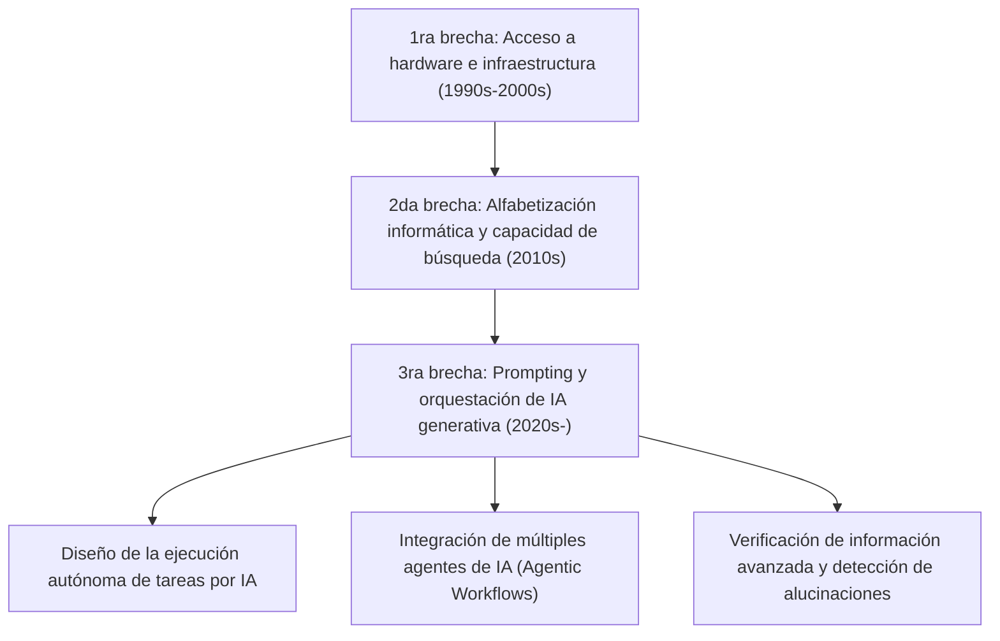
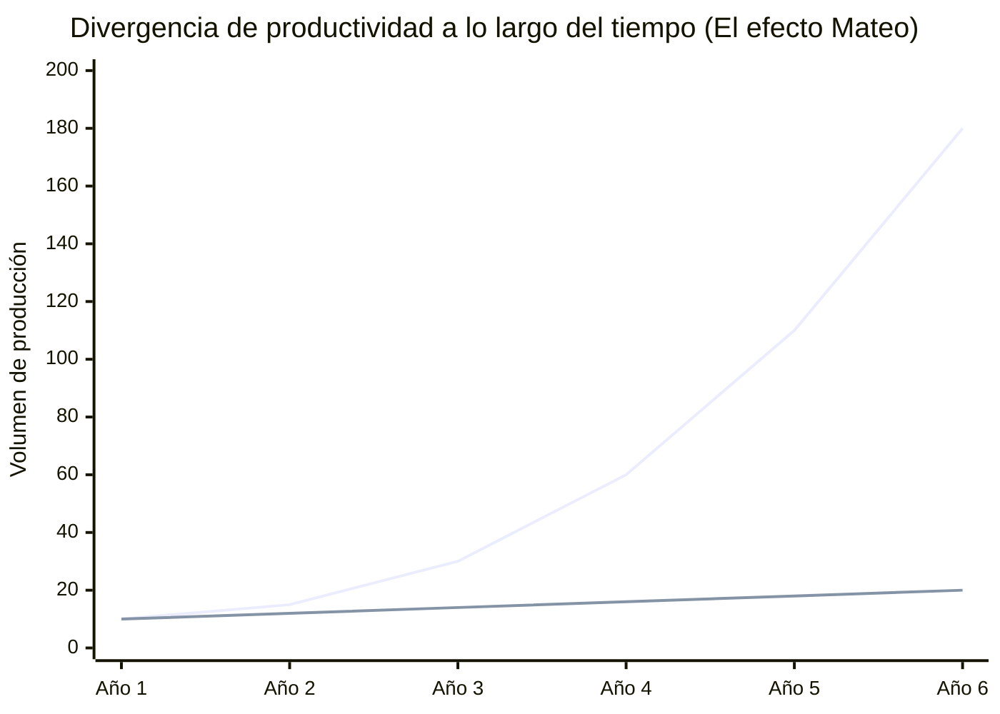
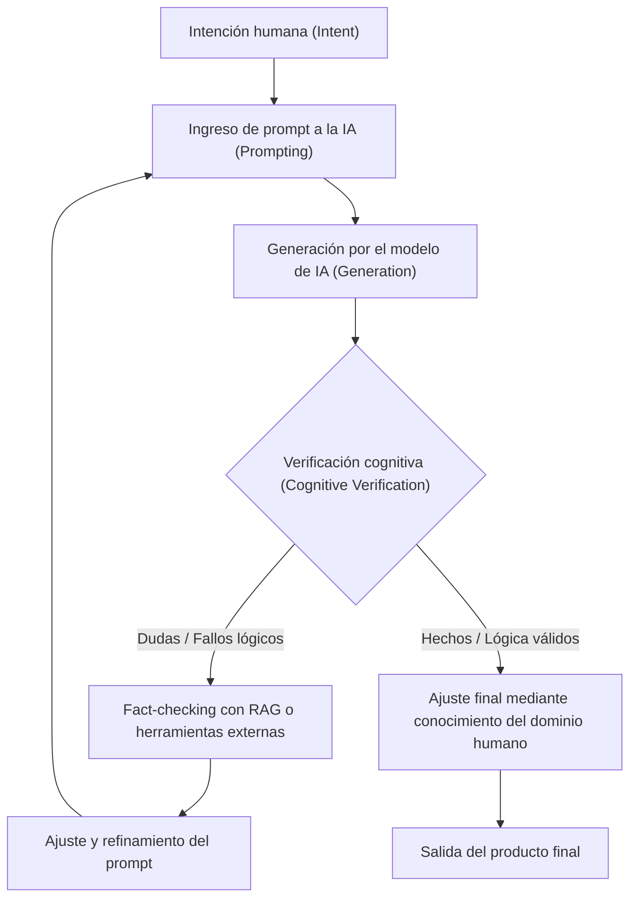

## 1. Introducción: Evolución histórica de la brecha digital y el nuevo paradigma

Desde la popularización de Internet, hemos escuchado repetidamente el término "brecha digital" (disparidad de información). La brecha digital inicial se relacionaba principalmente con el "acceso físico". Es decir, el simple esquema de si tener o no un ordenador y una conexión a Internet de alta velocidad determinaba el acceso a la información y a las oportunidades económicas. Posteriormente, a medida que los teléfonos inteligentes y las conexiones de banda ancha se convirtieron en bienes de consumo básico (commodities), el enfoque de la brecha se trasladó hacia la "alfabetización informática" (capacidad de utilizar la información). Esto abarcaba aspectos cognitivos y de software, como la capacidad de usar motores de búsqueda para encontrar información adecuada o el dominio de diversos programas.

Sin embargo, el surgimiento de la IA generativa (Generative AI) y la evolución de los grandes modelos de lenguaje (LLM: Large Language Models) en la década de 2020 están cambiando radicalmente este concepto de brecha digital desde sus cimientos. Lo que enfrentamos ahora no es una simple "brecha de acceso a la información" o "brecha de habilidades en el manejo de software". Se trata de una "brecha en la capacidad de orquestar (dirigir e integrar) la IA", una "tercera brecha digital" extremadamente grave e irreversible, en la que la productividad individual se amplifica exponencialmente o, por el contrario, uno se queda rezagado en la evolución de la IA perdiendo valor relativo.

En este artículo, desentrañaremos con gran detalle la verdadera naturaleza de esta nueva brecha digital provocada por la IA generativa, analizándola desde tres capas: el modelo matemático de la productividad, la arquitectura y los costos del hardware, y los aspectos cognitivos humanos.

## 2. Del "acceso" a la "orquestación": La llegada de la tercera brecha digital

Las herramientas de software del pasado eran esencialmente "herramientas pasivas". El límite del software convencional era devolver un resultado determinista a una entrada explícita del usuario (por ejemplo: introducir una fórmula en una hoja de cálculo y obtener un resultado). Sin embargo, la IA generativa actual, especialmente los LLM basados en la arquitectura Transformer (como GPT-4, Claude 3.5, Llama 3, etc.), actúan como "fragmentos de inteligencia activa".

Con este cambio de paradigma, el conjunto de habilidades requeridas por los humanos ha pasado drásticamente de "la capacidad de manejar herramientas" a "la capacidad de diseñar y dirigir flujos de trabajo autónomos combinando múltiples agentes de IA y herramientas (AI Orchestration)". Esto se puede denominar "alfabetización en orquestación de IA".

A continuación, se muestra la evolución de la brecha digital desde el pasado hasta el presente.

Más allá de la ingeniería de prompts (prompt engineering), actualmente hemos entrado en una fase en la que los sistemas resuelven problemas de forma autónoma utilizando frameworks multi-agente como LangChain, AutoGen y CrewAI. Entre el "grupo que diseña los planos y deja que la IA los ejecute" y el "grupo que sigue realizando tareas rutinarias con sus propias manos", se está produciendo una divergencia de productividad a una velocidad que la humanidad nunca antes había experimentado.

## 3. El efecto Mateo en la productividad (Matthew Effect): Visualización de la brecha mediante un enfoque matemático

El "Efecto Mateo", derivado de la frase del Nuevo Testamento "al que tiene, se le dará más; y al que no tiene, aun lo que tiene se le quitará", se refiere en sociología y economía al fenómeno por el cual una ventaja inicial produce beneficios acumulativos. Con la introducción de la IA generativa, este efecto Mateo se está manifestando con fuerza en el mercado laboral y en la producción intelectual.

La productividad de un individuo que utiliza la IA de manera efectiva no crece linealmente con el tiempo, sino exponencialmente. Esto se debe a que el tiempo ahorrado por la IA puede invertirse en la construcción de sistemas de IA aún más avanzados, en la optimización de prompts y en el autoaprendizaje. Expresemos esto con un modelo matemático.

La productividad de un usuario sin IA $P_{human}(t)$ y la productividad de un orquestador de IA $P_{AI}(t)$ en un momento dado $t$ pueden representarse con los siguientes modelos:

$$
P_{human}(t) = P_0 (1 + r_{human})^t
$$
Aquí, $P_0$ es la productividad inicial y $r_{human}$ es la tasa natural de aprendizaje humano (tasa de crecimiento basada en la curva de experiencia). Generalmente, $r_{human}$ es muy pequeña, y el crecimiento tiende a ser aritmético.

Por otro lado, la productividad de un usuario que aprovecha plenamente la IA combina la tasa de mejora de la capacidad del modelo de IA utilizado $r_{model}$ y el efecto compuesto de la automatización del flujo de trabajo de la IA $\alpha$.

$$
P_{AI}(t) = P_0 \cdot \exp\left( \int_0^t (r_{human} + \alpha \cdot r_{model}(\tau)) d\tau \right)
$$

Debido a que el propio modelo de IA evoluciona exponencialmente (aumento en el número de parámetros y volumen de cálculo basado en las leyes de escalado), el mismo $r_{model}(t)$ aumenta con el tiempo. Como resultado de esto, la diferencia de productividad entre ambos $\Delta P(t)$ se amplía rápidamente.

$$
\Delta P(t) = P_{AI}(t) - P_{human}(t)
$$

El siguiente gráfico ilustra visualmente esta divergencia:

*(Nota: la línea azul representa la productividad del orquestador de IA, la línea inferior representa la de un usuario sin IA)*

En el primer año la diferencia parece insignificante, pero a medida que el modelo de IA evoluciona de GPT-3 a GPT-4 y a las siguientes generaciones, el usuario de IA disfruta de un aumento exponencial de la productividad simplemente conectando (plugging in) el nuevo modelo a sus canales de automatización (pipelines) existentes. Matemáticamente, se vuelve casi imposible para los usuarios sin IA cerrar esta brecha a medida que pasa el tiempo.

## 4. La brecha del hardware: El muro de la inferencia local y la trampa de las API en la nube

La tercera brecha digital está creando no solo una desigualdad en las habilidades de software, sino también una nueva disparidad de hardware: el "acceso a la computación (recursos de cálculo)" para ejecutar modelos de IA de última generación.

Existen principalmente dos enfoques para usar grandes modelos de lenguaje: "utilizar API en la nube" o "realizar inferencias (Inference) del modelo de forma local". Ambos tienen sus pros y sus contras, lo que constituye un nuevo muro económico y físico.

### Los límites y los costos operativos de las API en la nube
Por lo general, se accede a los modelos de frontera más avanzados (como GPT-4o, Claude 3.5 Sonnet, etc.) proporcionados por OpenAI, Anthropic y Google a través de una API. Sin embargo, al construir agentes autónomos avanzados (Agentic Workflow) que generan decenas de miles de llamadas API por día, los costos aumentan de manera explosiva.

El costo total de la API $C_{cloud}$ depende del volumen de tokens de entrada y salida.

$$
C_{cloud} = \sum_{i=1}^{N} \left( c_{in} \cdot T_{in}^{(i)} + c_{out} \cdot T_{out}^{(i)} \right)
$$
($N$ es el número de solicitudes, $T$ es el número de tokens, $c$ es el precio por token)

Cuando se realiza de forma continua el procesamiento de datos a gran escala o la vectorización para RAG (Retrieval-Augmented Generation), estos costos variables pueden convertirse en una carga fatal para los desarrolladores independientes y las pequeñas y medianas empresas.

### Los LLM locales y el muro de la VRAM
Desde el punto de vista de evitar los costos de la nube y mantener la privacidad de los datos, está aumentando la demanda de ejecutar modelos de pesos abiertos (open weights) como Llama 3 de Meta o Mistral de forma local. Sin embargo, aquí es donde se interpone la brecha física conocida como "el muro de la VRAM (Video RAM)".

La velocidad de inferencia de los LLM depende más del ancho de banda de la memoria (Memory Bandwidth) que del rendimiento de cálculo de la GPU (FLOPS) (es decir, están limitados por la memoria o Memory-bound). Si el número de parámetros del modelo es $P$ y la precisión es de 16 bits (2 bytes), solo cargar el modelo en la memoria requiere al menos $2P$ bytes de VRAM. Por ejemplo, un modelo de 70 mil millones de parámetros (70B) exige más de 140 GB de VRAM.

$$
VRAM_{required} \approx \left( \frac{P \times bits\_per\_weight}{8} \right) + Context\_Memory
$$

Incluso con las GPU de gama alta (como la NVIDIA RTX 4090) que pueden comprar los consumidores en general, la VRAM está limitada a 24 GB, por lo que es imposible ejecutar directamente un modelo de la clase 70B. Aquí es donde entran en juego tecnologías de "cuantización (Quantization)" como AWQ o GGUF, produciéndose una lucha técnica para comprimir los pesos a 4 u 8 bits y encontrar un punto de equilibrio; sin embargo, es inevitable cierto deterioro del rendimiento (empeoramiento de la perplejidad o Perplexity) debido a la cuantización.

Además, en los últimos años han aparecido "AI PCs" equipados con NPU (Neural Processing Units), pero las TOPS (Tera Operations Per Second) de las NPU actuales solo alcanzan para ejecutar pequeños modelos ligeros (SLM: Small Language Models). Para realizar inferencias verdaderamente avanzadas a nivel local, se requiere la capacidad de capital para construir entornos de múltiples GPUs que cuestan cientos de miles de dólares. Esta es la verdadera naturaleza de la "brecha digital intensiva en capital" en la IA.

## 5. La brecha cognitiva: Las alucinaciones y el bucle de verificación

Aún más aterradora que la brecha de hardware o de habilidades es la "brecha cognitiva". Si bien la IA genera textos extremadamente fluidos y persuasivos, al mismo tiempo puede producir "alucinaciones (Hallucinations)", es decir, respuestas plausibles pero que carecen por completo de fundamento real.

La brecha que surge aquí es la división entre el "grupo que puede examinar críticamente y verificar (fact-checking) las respuestas de la IA" y el "grupo que cree ciegamente en las salidas de la IA como si fueran la verdad absoluta". El primer grupo utiliza la IA como una poderosa herramienta de lluvia de ideas (brainstorming) o para redactar borradores, y realiza el control de calidad final (QA) de las salidas basándose en su propia experiencia. El segundo grupo envía información errónea al mundo tal cual, lo que no solo destruye su propia credibilidad, sino que también contribuye a contaminar el espacio de la información en Internet con contenido tipo spam.

El proceso del bucle de verificación cognitiva (Cognitive Verification Loop) para evitar esto se muestra a continuación.

Para ejecutar este bucle, no solo es indispensable saber cómo usar la IA, sino que también es vital un profundo "conocimiento del dominio" en el área del resultado y un "pensamiento crítico (critical thinking)". Irónicamente, cuanto más evoluciona la IA, lo que se exige a los humanos no son habilidades operativas básicas, sino capacidades cognitivas extremadamente avanzadas, como el pensamiento filosófico y lógico, y el discernimiento para distinguir la verdad de la falsedad.

## 6. La nueva sociedad de clases: Orquestadores de IA y trabajadores manuales

En un futuro (o en la realidad actual en desarrollo) en el que estas brechas hayan llegado al límite, el mercado laboral se polarizará de una manera nunca antes vista.

**1. Orquestadores de IA (1 al 5% superior)**
En su área de especialización, construyen flujos de trabajo en los que múltiples agentes de IA operan de forma autónoma. Delegan la mayor parte de los procesos (investigación, programación, análisis de datos, redacción de informes) a la IA y se especializan en "diseño de procesos", "manejo de excepciones" y "toma de decisiones final". Su productividad es de decenas a cientos de veces superior a la de los trabajadores tradicionales, creando un valor económico enorme.

**2. Trabajadores del conocimiento tradicionales y trabajadores manuales**
Son personas que escriben código con sus propias manos, manipulan Excel con sus propias manos y escriben textos con sus propias manos. Su trabajo será gradualmente reemplazado por la IA, o serán relegados a tareas de "monitoreo y mantenimiento de terminales" en sistemas creados por orquestadores de IA o a trabajos en el "espacio físico". El trabajo intelectual que no utiliza la IA enfrenta el riesgo de perder por completo su competitividad en el mercado.

## 7. Estrategias y prescripciones sociales para sobrevivir en una sociedad desigual

En medio de esta brecha abrumadora, ¿cómo deberían adaptarse los individuos, las empresas y la sociedad?

### Estrategia individual: Adaptación al cambio de paradigma
Lo más importante es abandonar la subestimación de que "la IA es solo un chatbot". Es necesario desarrollar el hábito de tratar a la IA como un "pasante avanzado" o un "equipo de expertos", y pensar constantemente en cómo dividir los propios procesos comerciales y delegarlos a la IA (Task Decomposition). Además, incluso si no se sabe programar, aprender sobre conceptos de API y estructuración de datos (como JSON) permitirá una automatización poderosa al combinar herramientas sin código / de bajo código (no-code/low-code tools como Zapier, Make) con la IA.

### Estrategia corporativa: Diseño organizacional nativo de IA
Para las empresas, no es suficiente simplemente "distribuir cuentas de ChatGPT". Es necesario rediseñar todos los flujos de trabajo asumiendo el uso de la IA (BPR: Business Process Re-engineering) y realizar inversiones en infraestructura, como la creación de entornos RAG seguros y el ajuste fino (fine-tuning) del conocimiento corporativo específico en modelos locales. También se requerirá la introducción de nuevos KPI para evaluar la capacidad de orquestación de IA de los empleados.

### Prescripción social: La infraestructura de IA como un bien público
A nivel estatal o social, se necesitan redes de seguridad y educación para evitar que la tercera brecha digital conduzca a desigualdades económicas severas y agitación social. Algunos ejemplos incluyen el apoyo público para la investigación y el desarrollo de modelos de IA de código abierto, y la incorporación de una "alfabetización crítica de la IA" como educación obligatoria en las instituciones educativas. Asimismo, la actualización de las regulaciones adecuadas y las leyes antimonopolio debe estar sobre la mesa de discusión para evitar el "monopolio de modelos de IA y recursos de cálculo" por parte de los gigantes tecnológicos (Big Tech).

## 8. Conclusión: Subirse a la ola de la evolución o ser tragado por ella

La "nueva brecha digital" provocada por la IA generativa está reestructurando nuestra sociedad de manera más rápida y extensa que cualquier otra innovación tecnológica en el pasado. Esta brecha se manifiesta como una diferencia en los recursos de cálculo de hardware, en la capacidad de inversión en API en la nube y, sobre todo, en las "habilidades cognitivas y lógicas para orquestar la IA".

Como muestra el Efecto Mateo de la productividad, esta disparidad se expandirá de manera insuperable con el tiempo. Lo que debemos hacer ahora no es temer a la evolución de la IA, ni creer ciegamente en ella. Se trata de comprender profundamente las características de la IA, que es el amplificador de inteligencia (Intelligence Amplifier) más grande en la historia de la humanidad, y de llevar a cabo una "auto-transformación intelectual" que actualice nuestros propios procesos de pensamiento y flujos de trabajo.

Quedarnos de este lado de la nueva brecha digital o pasar al otro lado. Esa elección recae en nuestro aprendizaje y acciones diarias, en este mismo instante.

---
*Para dejar sus opiniones sobre este artículo o para comentar casos de uso específicos de orquestación de IA, por favor hágalo en la sección de comentarios o a través de las redes sociales del autor.*
