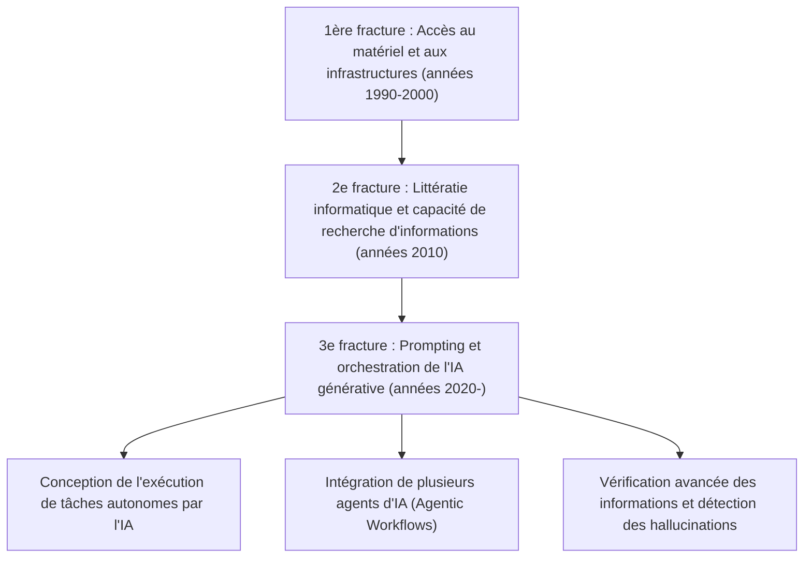
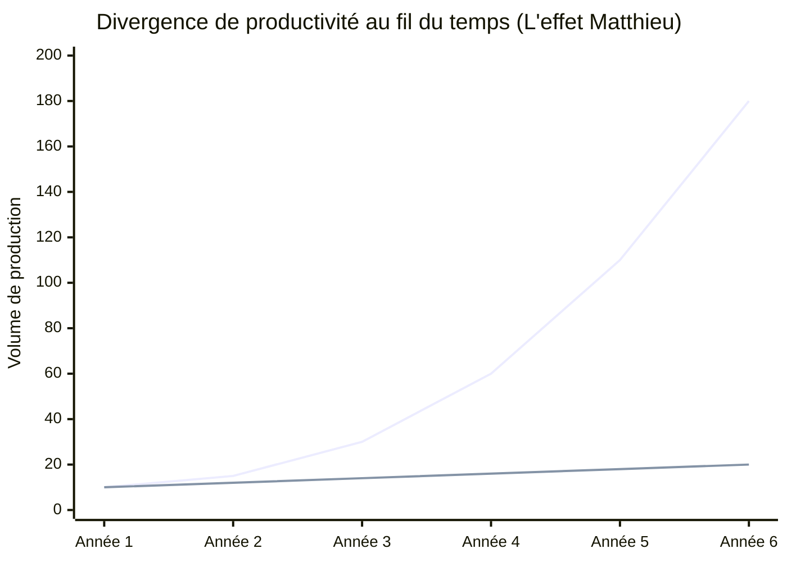
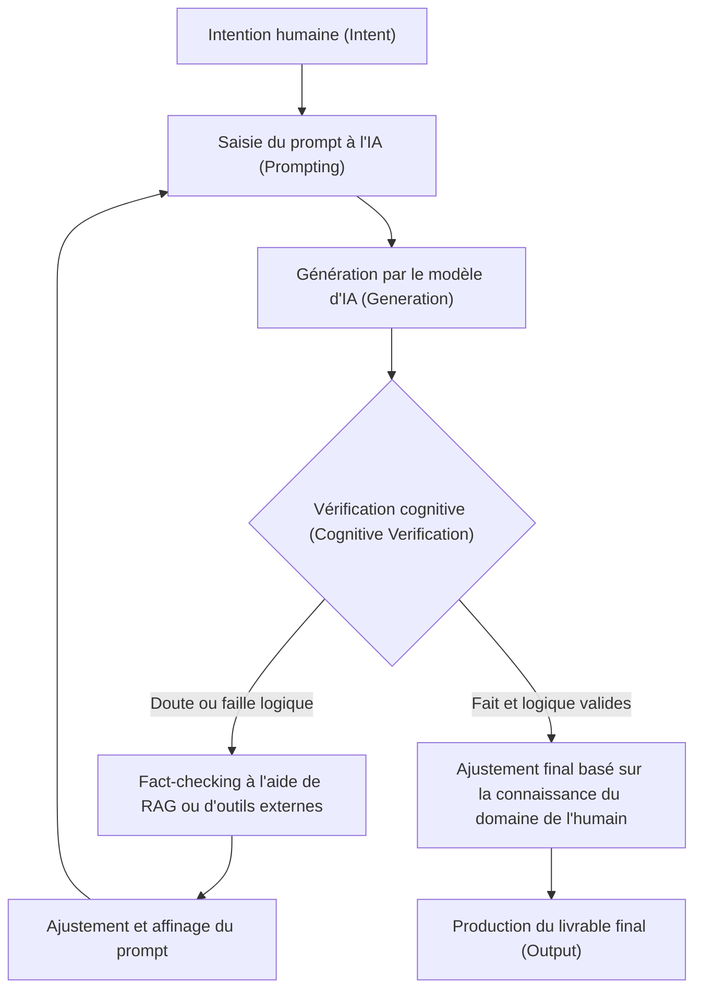

## 1. Introduction : L'évolution historique de la fracture numérique et le nouveau paradigme

Depuis la démocratisation d'Internet, nous avons souvent entendu le terme de « fracture numérique » (digital divide). La fracture numérique initiale concernait principalement le « droit d'accès physique ». En d'autres termes, il s'agissait d'un schéma simple où la possession ou non d'un ordinateur et d'une connexion Internet à haut débit déterminait l'accès à l'information et aux opportunités économiques. Par la suite, avec la banalisation des smartphones et des connexions à haut débit, le cœur de cette fracture s'est déplacé vers la « littératie informatique » (la capacité à utiliser l'information). Il s'agissait d'aspects cognitifs et logiciels, tels que la capacité à rechercher correctement des informations à l'aide de moteurs de recherche ou à maîtriser des logiciels.

Cependant, l'évolution de l'IA générative (Generative AI) et des grands modèles de langage (LLM : Large Language Models), qui a soudainement émergé dans les années 2020, est en train de bouleverser fondamentalement ce concept de fracture numérique. Ce à quoi nous sommes confrontés aujourd'hui n'est pas une simple « fracture de l'accès à l'information » ou une « fracture des compétences en matière d'utilisation des logiciels ». Il s'agit d'une « fracture dans la capacité à orchestrer (diriger et intégrer) l'IA », une « troisième fracture numérique » extrêmement grave et irréversible qui détermine si la productivité individuelle sera amplifiée de manière exponentielle, ou si l'individu sera laissé pour compte par l'évolution de l'IA et perdra sa valeur relative.

Dans cet article, nous allons détailler la nature de cette nouvelle fracture numérique provoquée par l'IA générative, à travers trois niveaux extrêmement précis : un modèle mathématique de productivité, l'architecture et les coûts matériels, ainsi que les aspects cognitifs humains.

## 2. De l'« Accès » à l'« Orchestration » : L'avènement de la 3e fracture numérique

Les logiciels et outils du passé étaient par essence des « outils passifs ». La limite des logiciels traditionnels était de renvoyer un résultat déterministe en réponse à une saisie explicite de l'utilisateur (par exemple : saisir une formule dans un tableur pour obtenir un résultat de calcul). Cependant, l'IA générative actuelle, et plus particulièrement les LLM basés sur l'architecture Transformer (GPT-4, Claude 3.5, Llama 3, etc.), agit comme un « fragment d'intelligence active ».

Ce changement de paradigme a considérablement modifié l'ensemble de compétences requis pour les humains, passant de la « capacité à manipuler des outils » à la « capacité à combiner plusieurs agents d'IA et outils pour concevoir et diriger des flux de travail autonomes (AI Orchestration) ». Nous pouvons appeler cela la « littératie de l'orchestration de l'IA ».

Ci-dessous, l'évolution de la fracture numérique du passé jusqu'à aujourd'hui.

Au-delà de l'ingénierie des prompts, nous sommes désormais entrés dans une phase où les systèmes sont capables de résoudre des problèmes de manière autonome grâce à des frameworks multi-agents tels que LangChain, AutoGen et CrewAI. L'écart de productivité entre ceux qui « dessinent les plans et laissent l'IA exécuter » et ceux qui « continuent à accomplir les tâches de routine de leurs propres mains » se creuse à une vitesse que l'humanité n'a jamais connue.

## 3. L'effet Matthieu de la productivité : Visualisation de l'écart par une approche mathématique

L'« effet Matthieu » (Matthew Effect), tiré d'un verset du Nouveau Testament déclarant « à celui qui a, on donnera encore ; mais à celui qui n'a pas, on ôtera même ce qu'il a », désigne en sociologie et en économie le phénomène par lequel un avantage initial génère un profit cumulatif. Avec l'adoption de l'IA générative, cet effet Matthieu se manifeste de manière flagrante sur le marché du travail et dans la production intellectuelle.

La productivité d'un individu utilisant efficacement l'IA croît de manière non pas linéaire, mais exponentielle par rapport au temps. En effet, le temps économisé par l'IA peut être réinvesti dans la création de systèmes d'IA encore plus avancés, l'optimisation des prompts et l'auto-apprentissage. Représentons cela avec un modèle mathématique.

La productivité d'un utilisateur sans IA $P_{human}(t)$ et celle d'un orchestrateur d'IA $P_{AI}(t)$ à un instant $t$ peuvent être modélisées respectivement comme suit :

$$
P_{human}(t) = P_0 (1 + r_{human})^t
$$
Ici, $P_0$ est la productivité initiale, et $r_{human}$ est le taux d'apprentissage naturel de l'être humain (taux de croissance basé sur la courbe d'expérience). En général, $r_{human}$ est très faible, et la croissance a tendance à être arithmétique.

D'autre part, la productivité d'un utilisateur exploitant pleinement l'IA combine le taux d'amélioration des capacités du modèle d'IA utilisé $r_{model}$ et l'effet des intérêts composés de l'automatisation du flux de travail par l'IA $\alpha$.

$$
P_{AI}(t) = P_0 \cdot \exp\left( \int_0^t (r_{human} + \alpha \cdot r_{model}(\tau)) d\tau \right)
$$

Étant donné que le modèle d'IA lui-même évolue de manière exponentielle (augmentation du nombre de paramètres et de la quantité de calcul basée sur les lois d'échelle), $r_{model}(t)$ lui-même augmente avec le temps. En conséquence, la différence de productivité entre les deux $\Delta P(t)$ se creuse rapidement.

$$
\Delta P(t) = P_{AI}(t) - P_{human}(t)
$$

Le graphique suivant illustre visuellement cette divergence.

*(Note : la ligne bleue représente la productivité de l'orchestrateur d'IA, et la ligne du bas représente la productivité de l'utilisateur sans IA)*

La différence semble minime au cours de la première année, mais à mesure que le modèle d'IA évolue de GPT-3 à GPT-4, puis à la génération suivante, l'utilisateur de l'IA bénéficie d'une amélioration spectaculaire de sa productivité en branchant simplement le nouveau modèle sur son pipeline d'automatisation existant. Il deviendra mathématiquement impossible pour les utilisateurs sans IA de combler cet écart au fil du temps.

## 4. La fracture matérielle : Le mur de l'inférence locale et le piège de l'API cloud

La 3e fracture numérique ne concerne pas seulement les compétences logicielles, elle engendre également une nouvelle fracture matérielle : « l'accès au calcul (ressources informatiques) » pour faire fonctionner des modèles d'IA de pointe.

Il existe principalement deux approches pour utiliser les grands modèles de langage : « utiliser l'API cloud » ou « faire l'inférence (Inference) du modèle localement ». Les deux présentent des avantages et des inconvénients, ce qui constitue une nouvelle barrière économique et physique.

### Les limites et les coûts de fonctionnement des API cloud
Il est courant d'accéder via une API aux modèles frontières de pointe (tels que GPT-4o, Claude 3.5 Sonnet, etc.) proposés par OpenAI, Anthropic et Google. Cependant, si l'on construit un agent autonome avancé (Agentic Workflow) générant des dizaines de milliers d'appels API par jour, les coûts augmentent de manière explosive.

Le coût total du cloud $C_{cloud}$ dépend de la quantité de tokens d'entrée et de sortie.

$$
C_{cloud} = \sum_{i=1}^{N} \left( c_{in} \cdot T_{in}^{(i)} + c_{out} \cdot T_{out}^{(i)} \right)
$$
(Où $N$ est le nombre de requêtes, $T$ est le nombre de tokens, $c$ est le prix unitaire du token)

Lorsqu'il s'agit d'effectuer en continu des traitements de données à grande échelle ou la vectorisation de RAG (Retrieval-Augmented Generation), ce coût variable peut devenir un fardeau fatal pour les développeurs indépendants ou les petites et moyennes entreprises.

### Les LLM locaux et le mur de la VRAM
Afin d'éviter les coûts liés au cloud et pour des raisons de confidentialité des données, il existe une demande croissante pour faire tourner des modèles à poids ouverts (open weights) comme Llama 3 de Meta ou Mistral en local. Mais c'est là que se dresse une fracture physique appelée « mur de la VRAM (Video RAM) ».

La vitesse d'inférence des LLM dépend plus fortement de la bande passante de la mémoire (Memory Bandwidth) que de la puissance de calcul (FLOPS) du GPU (nature Memory-bound). Si l'on considère un nombre de paramètres du modèle à $P$ et une précision de 16 bits (2 octets), le simple chargement du modèle en mémoire nécessite au minimum $2P$ octets de VRAM. Par exemple, un modèle de 70 milliards (70B) de paramètres requiert plus de 140 Go de VRAM.

$$
VRAM_{required} \approx \left( \frac{P \times bits\_per\_weight}{8} \right) + Context\_Memory
$$

Même les GPU haut de gamme accessibles au grand public (NVIDIA RTX 4090) plafonnent à 24 Go de VRAM, rendant impossible l'exécution native de modèles de la classe des 70B. C'est là qu'interviennent les « techniques de quantification (Quantization) » telles que AWQ ou GGUF, qui consistent à compresser les poids à 4 ou 8 bits dans une lutte technique pour trouver un compromis, bien qu'une dégradation des performances (détérioration de la perplexité) due à la quantification soit inévitable.

De plus, ces dernières années, des « PC IA » équipés de NPU (Neural Processing Unit) sont apparus, mais les TOPS (Tera Operations Per Second) des NPU actuels limitent l'exécution à de petits modèles légers (SLM : Small Language Models). Réaliser une véritable inférence avancée en local nécessite une capacité financière permettant de construire un environnement multi-GPU coûtant plusieurs millions de yens. C'est la véritable nature de la « fracture numérique capitalistique » de l'IA.

## 5. La fracture cognitive : Les hallucinations et la boucle de vérification

Ce qui est encore plus effrayant que les écarts matériels ou de compétences, c'est la « fracture cognitive ». L'IA génère des textes très fluides et persuasifs, mais elle produit également des « hallucinations », sortant de fausses informations tout en les faisant paraître plausibles.

La fracture qui se crée ici est la division entre « ceux qui peuvent examiner d'un œil critique et vérifier (fact-checker) la production de l'IA » et « ceux qui croient aveuglément en la production de l'IA comme une vérité faisant autorité ». Les premiers utilisent l'IA comme un outil puissant de brainstorming et de rédaction de brouillons, effectuant le contrôle qualité (QA) du résultat final avec leur propre expertise. Les seconds diffusent de fausses informations telles quelles, détruisant non seulement leur propre crédibilité, mais contribuant également à polluer l'espace d'information sur Internet avec des contenus de type spam.

Voici le processus de la boucle de vérification cognitive (Cognitive Verification Loop) permettant d'éviter cela.

Pour faire tourner cette boucle, il est indispensable non seulement de savoir utiliser l'IA, mais aussi de posséder une profonde « connaissance du domaine » et un « esprit critique » concernant la production. Ironiquement, plus l'IA évolue, plus les compétences requises des humains se déplacent non pas vers des compétences de manipulation de base, mais vers des capacités cognitives extrêmement avancées, telles que la pensée philosophique et logique, ou la culture permettant de discerner le vrai du faux.

## 6. Une nouvelle société de classes : Les orchestrateurs d'IA et les travailleurs manuels

Dans un avenir où ces disparités seront poussées à l'extrême (ou une réalité déjà en cours), le marché du travail se polarisera comme jamais auparavant.

**1. Les orchestrateurs d'IA (le top 1 à 5 %)**
Ils construisent des flux de travail dans leur domaine d'expertise en faisant interagir de manière autonome plusieurs agents d'IA. Ils délèguent à l'IA la majorité des processus, tels que la recherche, le codage, l'analyse de données et la rédaction de rapports, et se spécialisent eux-mêmes dans la « conception des processus », le « traitement des exceptions » et la « prise de décision finale ». Leur productivité atteint des dizaines à des centaines de fois celle des travailleurs traditionnels, générant une valeur économique colossale.

**2. Les travailleurs intellectuels traditionnels et travailleurs manuels**
Ce sont les personnes qui écrivent du code de leurs propres mains, qui manipulent Excel elles-mêmes et qui rédigent des textes elles-mêmes. Leur travail sera progressivement remplacé par l'IA, ou bien elles seront reléguées à des tâches de « surveillance et maintenance de bout de chaîne » des systèmes créés par les orchestrateurs d'IA, ou à du « travail dans l'espace physique ». Le travail intellectuel qui n'exploite pas l'IA est confronté au risque de perdre totalement sa compétitivité sur le marché.

## 7. Stratégies et prescriptions sociales pour survivre dans une société inégalitaire

Face à cette fracture écrasante, comment les individus, les entreprises et la société doivent-ils s'adapter ?

### Stratégie individuelle : S'adapter au changement de paradigme
Le plus important est d'abandonner la sous-estimation selon laquelle « l'IA n'est qu'un simple chatbot ». Il faut considérer l'IA comme un « stagiaire de haut niveau » ou une « équipe d'experts », et prendre l'habitude de toujours se demander comment décomposer ses propres processus métier (Task Decomposition) pour les déléguer à l'IA. De plus, même sans savoir programmer, comprendre le concept d'API et la structuration des données (comme JSON) permet de créer des automatisations puissantes en combinant des outils no-code/low-code (Zapier, Make, etc.) avec l'IA.

### Stratégie d'entreprise : Conception d'organisation AI-native
Pour les entreprises, il ne suffit pas de simplement « distribuer des comptes ChatGPT ». Il est nécessaire de redessiner l'ensemble des flux de travail en considérant l'IA comme acquise (BPR : Business Process Re-engineering), et d'investir dans des infrastructures telles que la construction d'environnements RAG sécurisés ou le fine-tuning de modèles locaux avec les connaissances propres à l'entreprise. L'introduction de nouveaux KPI permettant d'évaluer la capacité des employés à orchestrer l'IA est également requise.

### Prescriptions sociales : L'infrastructure IA comme bien public
Au niveau de l'État ou de la société, des filets de sécurité et une éducation sont nécessaires pour éviter que la 3e fracture numérique ne débouche sur de graves inégalités économiques et des troubles sociaux. Par exemple, le soutien public à la recherche et au développement de modèles d'IA open source, ou l'enseignement obligatoire de la « littératie critique de l'IA » dans les établissements scolaires. Il convient également de mettre sur la table des discussions la mise à jour des lois antitrust et l'adoption de régulations appropriées pour prévenir le « monopole des modèles d'IA et des ressources de calcul » par les géants de la technologie.

## 8. Conclusion : Surfer sur la vague de l'évolution ou se faire engloutir

La « nouvelle fracture numérique » provoquée par l'IA générative restructure notre société de manière plus rapide et plus vaste qu'aucune autre innovation technologique passée. Cette fracture se manifeste par la différence des ressources de calcul matérielles, la capacité d'investir dans des API cloud, et surtout, dans les « compétences cognitives et logiques pour orchestrer l'IA ».

Comme le montre l'effet Matthieu de la productivité, cet écart s'élargira avec le temps jusqu'à devenir insurmontable. Ce que nous devons faire maintenant, ce n'est ni craindre l'évolution de l'IA, ni y croire aveuglément. Il s'agit de comprendre en profondeur les caractéristiques de l'IA, le plus grand amplificateur d'intelligence (Intelligence Amplifier) de l'histoire de l'humanité, et d'opérer une « auto-transformation intellectuelle » en mettant à jour nos propres pensées et flux de travail.

Se tenir de ce côté-ci de la nouvelle fracture numérique ou rester de l'autre côté. Ce choix, à chaque instant, est laissé à notre apprentissage et à nos actions quotidiens.

---
*Si vous avez des commentaires sur cet article ou des exemples concrets de déploiement de l'orchestration de l'IA, n'hésitez pas à les partager dans la section des commentaires ou sur les réseaux sociaux de l'auteur.*
